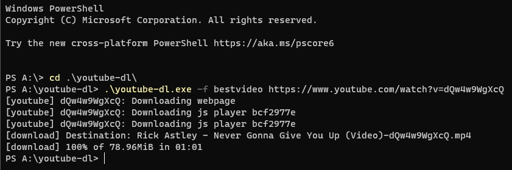

---
tags:
  - how to download videos from YouTube
  - how to use YouTube videos
  - wie man Videos von YouTube herunterlädt
  - wie man YouTube-Videos benutzt
---

<!-- TODO: replace link as soon as German article is available (line 40) -->

# Videos von YouTube

*Bitte beachte, dass das Herunterladen von YouTube-Videos einen Verstoß gegen die [Nutzungsbedingungen](https://www.youtube.com/t/terms) darstellt.*

[YouTube](https://youtube.com) ist eine nützliche Quelle für Kreative, die nach Hintergrundvideos für ihre [Beatmaps](/wiki/Beatmap) schauen. Wenn ein Song ein Musikvideo hat, dann wird es in den meisten Fällen auf YouTube sein und wahrscheinlich in der richtigen Größe komprimiert. Die Qualität ist gut, aber die Videodatei ist auch nicht extrem groß.

Dieses Tutorial ist gedacht für alle, die **keine** Videos außerhalb von YouTube finden können.

## Benutzung von Online-Tools

[YouTube to Mp3](https://ytmp3.cc) ist ein Dienst, um YouTube-Videos online zu konvertieren. Den Service zu benutzen, ist dabei sehr simpel: Als erstes musst du den Link zu deinem gewünschten YouTube-Video in das Textfeld kopieren. Wähle dann `mp4` und drücke auf `Convert`. Im Anschluss kannst du auf `Download` klicken und die Datei herunterladen, sobald die Konvertierung abgeschlossen wurde.

## youtube-dl verwenden

[youtube-dl](https://youtube-dl.org) ist ein Kommandozeilenprogramm, um Videos von YouTube und anderen Seiten herunterzuladen.

1. Lade youtube-dl herunter und starte es in einer Konsole deiner Wahl (PowerShell, CMD, Terminal)
2. Tippe den Befehl unten ein und drücke `Enter`

```cmd
youtube-dl -f bestvideo <Video-Link>
```



## Die Audiospuren entfernen

*Hauptseite: [Dateien komprimieren](/wiki/Guides/Compressing_files)*

Nachdem du das Video heruntergeladen hast, kannst du es in die Beatmap importieren, so wie du es normalerweise über den [Design-Tab](/wiki/Client/Beatmap_editor/Design) im [Beatmap-Editor](/wiki/Client/Beatmap_editor) machen würdest. Jedoch wird das Video zusätzlich Audiospuren enthalten, die nur unnütz Speicherplatz verbrauchen. Außerdem verbieten die [Beatmap-Ranking-Kriterien](/wiki/Ranking_Criteria#video-and-background) Videos mit Audiospuren, da diese nicht verwendet werden. Mehr Informationen zum Entfernen der Audiospuren in einem Video findest du unter [Dateien komprimieren](/wiki/Guides/Compressing_files).
