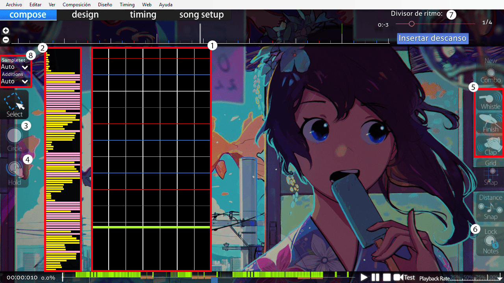

# Guía de mapping de osu!mania

## Prólogo

### ¿Qué es osu!mania?

*Página principal: [osu!mania](/wiki/Game_mode/osu!mania)*

osu!mania es uno de los cuatro modos de juego. osu!mania pertenece al género **juego de ritmo de desplazamiento vertical** (VSRG por sus siglas en inglés). Como su nombre indica, las notas musicales caen o suben de forma vertical. Hay muchos juegos bastante similares a osu!mania, como «Stepmania», «O2Jam» o «Beatmania IIDX».

Una de las ventajas de osu!mania es el número personalizable de columnas jugables y su sencillo editor de beatmaps.

### ¿Qué es el editor de beatmaps?

Como ya se ha mencionado, el editor permite una cantidad personalizable de columnas. Para simplificar, esta guía girará en torno al mapping de 4 teclas (4K). Más abajo puedes ver una captura de pantalla que detalla los compartimentos del editor.

#### Editor de osu!mania

**1. Área de mapeo**: Aquí es donde colocas tus objetos.

**2. Gráfico de densidad**: Esta es la densidad de las partes individuales en el mapa. Las barras de color *rosa* indican que la densidad es demasiado alta para mostrarse.

**3 & 4. Notas y notas largas**: Estas opciones se pueden cambiar haciendo clic. Las **notas** se colocan haciendo clic, las **notas largas** se pueden crear haciendo clic y arrastrando.

*Atajos:* `2` y `3`

**5. Hitsounds**: Se pueden asignar sonidos a los objetos durante el juego. Más información sobre los hitsounds más adelante en la guía.

*Atajos:* `W`, `E` y `R`

**6. Bloquear Notas**: Si «bloquear notas» está activado, no podrás mover ninguna nota, lo cual resulta muy útil a la hora de poner hitsounds. Sin esta opción activada, puedes mover accidentalmente las notas mientras les pones hitsounds.

*Atajo:* `L`

**7. Divisor de ritmo**: Usando el deslizador, puedes seleccionar el divisor de ritmo que quieres usar para mapear. El deslizador va de 1/1 a 1/16, la mayoría de los mappers suelen usar 1/4.

En los [criterios de clasificación de osu!mania](/wiki/Ranking_criteria/osu!mania) se detallan los divisores que deben usarse para la clasificación.

*Atajo:* `Ctrl` + `Rueda del ratón`

**8. Conjuntos de muestras y adiciones**: Los conjuntos de muestras y adiciones te permiten añadir incluso más hitsounds que los mostrados en el punto 5. Por ejemplo, puedes superponer un sonido de *drum-finish* sobre el *normal-finish*. De este modo, ¡puedes darle a tu canción una mayor variedad de hitsounds!

*Atajos:* `Ctrl` + (`W`, `E` o `R`), `Mayús` + (`W`, `E` o `R`)`

## Lo básico

### Configuración de la canción

¡Muy bien! Arrastra el archivo `.mp3` de la canción que quieras mapear a osu! y se creará automáticamente un nuevo mapa. Siempre que crees un mapa por primera vez en el editor, se abrirá automáticamente la ventana para la configuración de las canciones.

#### General

| Nombre | Descripción |
| :-- | :-- |
| `Artist` | Aquí tendrás que añadir el nombre original del artista de tus canciones. No importa si es japonés, alemán o ruso. Si el nombre del artista tiene al menos un carácter especial, debes añadirlo aquí. Por ejemplo, si el nombre del artista es «Die Ärzte», debes añadirlo aquí debido a la «Ä». |
| `Romanised Artist` | Aquí tienes que añadir el nombre romanizado del artista, que se traduce al nombre original del artista en escritura romana (latina). Con nuestro ejemplo anterior, sería «Die Aerzte» porque la «Ä» se traduce por «Ae». Si el nombre del artista no incluye ningún carácter especial, este campo se rellenará automáticamente. |
| `Title` y `Romanised Title` | Exactamente lo mismo que con el artista, pero con el título de la canción. |
| `Beatmap Creator` | Este campo se rellena automáticamente con tu nombre cuando tienes la sesión iniciada en el cliente de osu!. Si no estás conectado en el momento de crear el beatmap, añade tu nombre allí. |
| `Difficulty` | [Reglas para el nombramiento de las dificultades según los criterios de clasificación**](/wiki/Ranking_criteria#beatmap). Aquí se especifica el nombre de la dificultad. Como guía, los nombres de dificultad estándar para osu!mania son «Easy», «Normal», «Hard», «Insane» y «Expert». Si la canción es de otro juego, ¡puedes usar los nombres de dificultad de ese juego! Por ejemplo, en Sound Voltex se usan los siguientes nombres para sus respectivas dificultades: «BASIC», «NOVICE», «ADVANCED», «EXHAUST», «INFINITE», «GRAVITY». Para nombres personalizados, consulta los criterios de clasificación enlazados más arriba. |
| `Source` | Aquí tienes que añadir de dónde proviene la canción. ¿Es de otro juego? ¿O de un anime? ¿Tal vez de un programa de televisión? ¡Añádelo aquí! Por ejemplo, si la canción proviene de Sound Voltex, tienes que añadirlo aquí. ¡Ten en cuenta que tiene que ser el nombre exacto del juego! |
| `Tags` | Aquí puedes añadir información adicional sobre la canción. Por ejemplo, nombres de álbumes o productores. Todo lo que ayude a encontrar la canción en el listado de beatmaps. También tienes que añadir los nombres de todos los mappers que hayan creado dificultades para tu mapa. Las etiquetas van separadas por espacios. |

#### Dificultad

| Nombre | Descripción |
| :-- | :-- |
| `HP Drain Rate (HP)` | Un valor más alto significa un drenaje superior y una recuperación inferior, y viceversa. Un valor de HP comúnmente usado es **7**. *Nota: Solo los 50 o los fallos drenarán la HP* |
| `Key Count` | Aquí tienes que establecer el número de teclas en el que quieres mapear. En esta guía usaré 4K. Ten en cuenta que solo los mapas 4K, 5K, 6K, 7K, 8K y 9K son clasificables. La casilla «Co-Op» puede marcarse a partir de 5K, duplicando el número de teclas. Esto te permite jugar con un amigo en un solo teclado. |
| `Approach Rate` | Este punto no se usa en osu!mania, así que puedes ignorarlo. |
| `Overall Difficulty` (OD) | El OD cambia el margen de error de los aciertos de todos los [juicios](/wiki/Gameplay/Judgement), excepto de los 300g. Se recomienda usar un OD más bajo para mapas que estén orientados a usar más notas largas que notas simples, y viceversa para mapas orientados a usar más notas simples que notas largas. |

#### Diseño

| Nombre | Descripción |
| :-- | :-- |
| `Countdown` | Aquí puedes establecer una cuenta regresiva para tu mapa. No se recomienda activarla. |
| `Widescreen Support` | Esta casilla solo debería activarse cuando el mapa tenga un storyboard panorámico. |
| `Display Epilepsy Warning` | Si usas un storyboard con luces que parpadean rápidamente, ¡es muy importante activar esta casilla! Esto advierte a los jugadores sobre el storyboard para que puedan desactivarlo o aumentar la atenuación de fondo. |
| `Letterboxing During Breaks` | El letterboxing muestra pequeños cuadros negros en la parte superior e inferior de la pantalla durante los descansos. |

#### Avanzado

| Nombre | Descripción |
| :-- | :-- |
| `Stacking` | Este punto no tiene ningún efecto para osu!mania, por lo que no es necesario cambiar nada aquí. |
| `Allowed Modes` | Con este punto, cambias el modo del editor al que quieres usar para tu mapa. Esta guía trata sobre osu!mania, así que usaremos «osu!mania». Si eliges «All», tu editor se pondrá en el modo osu!. **Cambiar esta opción en un mapa de osu!mania existente sobrescribirá el mapa.** |
| `Use special Style (N+1 style) for osu!mania` | Si mapeas en un modo de teclas que usa una tecla especial (6K y 8K), puedes habilitar este punto. Esto le permite al jugador intercambiar la **columna especial** a su izquierda o derecha dependiendo de su configuración. Conocido en «BMS» como la «Columna Scratch», se usa comúnmente en 7+1K (8K) en osu!mania. Mapear 7+1K es similar a mapear un mapa de 7K, pero se genera una **columna especial** adicional a discreción del mapper. |

El punto **Colours** no se usa en osu!mania, por lo que no es necesario cambiar nada ahí.

El punto **Audio** se explicará en la sección [Hitsounds](#hitsounds).

### Temporización

Una vez terminada la configuración de nuestra canción, tenemos que temporizarla. La temporización establecida debe ser exacta al ritmo de la canción, de lo contrario será difícil mapearla con precisión.

#### Cómo encontrar el BPM

Primero, tienes que escuchar atentamente la canción para hacerte una idea del ritmo. Cuando creas oír el ritmo, empieza a presionar `T` al compás hasta que el editor muestre un valor. Puedes seguir presionando para obtener un valor de BPM más preciso, pero la mayoría de las canciones tienen valores de BPM enteros; es decir, no tienen decimales.

Debería haber un sonido de tictac indicando el BPM establecido, si no está presente, comprueba si tu volumen de **Effects** es lo suficientemente alto.

#### Cómo comprobar la compensación

La mayoría de las veces, la compensación estará ligeramente fuera de ritmo; es decir, el tictac sonará constantemente antes de tiempo o después de tiempo. Ajusta el valor hasta que suene perfecto con el ritmo.

#### Cómo comprobar el BPM

Por lo general, el BPM inicial encontrado estará ligeramente fuera de ritmo, por lo que tendrás que comprobar que el BPM sea el correcto.

*Ten en cuenta que las malas compensaciones son diferentes de los malos BPM.*

Para los valores de BPM imprecisos, el tictac *se moverá* y será **más prominente** cuanto más se aleje de la **línea roja** en la línea de tiempo (en la parte inferior del editor). Este es un signo evidente de que el BPM es impreciso. Intenta ajustarlo en +1 o -1.

#### Cómo encontrar la primera compensación

La primera compensación es el primer pulso de tu BPM actual. Ve al punto de tu canción donde puedas oír el primer pulso, presiona F6, haz clic en el punto de tiempo y pulsa «Use current time». Ahora el punto de tiempo debería estar en la compensación actual, el primer pulso.

En caso de que sea correcto, ¡tu canción por fin está temporizada!

#### MixMeister BPM Analyzer

También me gustaría mostrarte un pequeño programa que puede ser realmente útil para encontrar el BPM adecuado realmente rápido. Se llama ***MixMeister BPM Analyzer***. Este programa te mostrará el BPM promedio de tu canción. Solo tiene un punto débil. No puede mostrar múltiples BPM. Te mostrará el promedio de BPM de todos los puntos BPM de tu canción. En pocas palabras, solo sirve para un único BPM. Puedes buscarlo en Google o simplemente hacer clic [aquí](https://dropbox.com/s/m4pjenvo4n65943/bpmanalyzer.zip?dl=0). No intentes usarlo para temporizar cada uno de tus mapas. Nunca aprenderás a temporizar canciones si dejas que este programa temporice todo por ti. ¡Úsalo para compararlo con tu BPM y comprobar si has encontrado el correcto!

#### Múltiples BPM

Muchas canciones no tienen un BPM constante. Para estos casos, es necesario añadir otro punto BPM en el punto de cambio.

Ve al punto en el que cambia el BPM, presiona F6 para abrir el panel de temporización, añade otro punto de tiempo haciendo clic en el «+» verde y ajústalo al cambio de BPM mientras escuchas de nuevo el metrónomo. También puedes presionar `Ctrl` + `P` para establecer un punto de BPM en la marca de tiempo en la que te encuentras. ¡Haz esto para cada cambio de BPM en tu mapa!

#### Panel de configuración de la temporización

| Nombre | Descripción |
| :-- | :-- |
| `Timing Points` | El punto de tiempo o «línea roja» está ahí para temporizar tu canción. Sin él, no puedes empezar a mapear. Consulta los pasos anteriores para [**temporizar**](#temporización) tu canción. |
| `Inherited Points` | El punto heredado o «línea verde» se usa para añadir «efectos» a tu mapa. Con ellos, puedes cambiar el volumen, el conjunto de muestras, la velocidad de los sliders (SV) y puedes añadir un [Kiai-Time](/wiki/Gameplay/Kiai_time). |
| `Kiai` | El Kiai se puede seleccionar en «Style» y se puede añadir entre dos puntos heredados. El Kiai Time se usa por lo general en el coro de las canciones. Creará fuentes de estrellas en ambos lados de la pantalla y se usa para enfatizar una sección del mapa. |

### Patrones

Una vez que tengas la temporización correcta en tu mapa, es hora de empezar a mapear. Los patrones son como bloques de construcción para el mapa, es esencial conocer sus nombres y sus propósitos. Voy a añadir una captura de pantalla para todos y cada patrón con una breve descripción de lo que son y cuándo deben usarse.

#### Notas largas

Las LN son los «sliders» de osu!mania. Usar LNs es la mejor manera de representar sonidos largos en tu canción. Hay muchas maneras de usar una LN que explicaré en otra parte de esta guía.

#### Chords

En la captura de pantalla he usado un *chord* de dos notas. Los *chords* son *más de 1 nota*. Los «dobles», «triples» o «cuádruples» entran en esa categoría. Se usan para enfatizar los sonidos fuertes de la canción, como la batería o los platillos.

Si piensas clasificar tu mapa, ¡puedes usar hasta seis notas! Más notas van en contra de los criterios de clasificación.

#### Bursts

Los *bursts* son ráfagas rápidas de notas. No son necesariamente de 1/4, sino que se definen por un aumento repentino de la densidad durante un breve periodo de tiempo.

#### Escaleras

Las *escaleras* se usan principalmente en los sonidos rápidos. Ten en cuenta que algunas *escaleras* se vuelven muy difíciles de realizar a partir de cierto BPM, esto se debe principalmente a los *jacks* que se forman en las columnas 2 y 3.

#### Rolls

Los *rolls* son similares a las *escaleras*. Normalmente, los *rolls* están definidos por un patrón repetitivo de 4 o más notas, pero, en general, se trata de notas que van en una dirección determinada. Un 1234 es un *roll* y un 1324 es un *roll dividido*.

#### Jackhammers

También conocidos comos ***jacks***. Se recomienda usar los *jacks* para dos sonidos que suenen exactamente igual. Los *jacks* pueden escalar en dificultad rápidamente cuando se usan en exceso. Se recomienda no abusar de ellos, a menos que estés totalmente seguro.

#### Escudos

Los *escudos* se reconocen porque siempre aparecen justo antes o después de una LN.

#### Chordjack

Los *chord jacks* son una combinación de los *jackhammers* y los *chords*. La forma de usarlos es la misma que la de los *jackhammers*. Para los mismos sonidos, solo que los usas como *chords* para sonidos más pesados.

#### Trills

Los *trills* se usan para dos sonidos que cambian muy rápido en la canción. En la captura de pantalla se muestra un *trill* de una mano, pero también puedes usar las columnas 1 y 3 para un *trill* de dos manos.

#### Chordtrills

Los *chord trills* pueden elevar la dificultad de tu mapa rápidamente. Al igual que los *trills*, los *chord trills* se usan para enfatizar dos sonidos mucho más fuertes que cambian muy rápido. Una alternativa más sencilla sería usar *chord trills* de `12` y `34` en su lugar.

#### Jumpstreams

Los ***jumps*** son chords de 2 notas, por lo tanto, los *jumpstreams* son *chords streams* de 2 notas.

Se pueden usar los *jumpstreams* para superponer sonidos fuertes entre un stream constante de 1 nota, usando un *chord* de 2 notas siempre que sea posible.

Hay muchas formas de mapear los jumpstreams. En la captura de pantalla se muestra una forma realmente segura de mapearlo, ya que no hay *triples jacks* de 1/2 en él.

¡Muy bien! ¡Estos son algunos de los diferentes patrones que puedes usar en las canciones! Sin embargo, aún existen muchas más formas de crear patrones que no se incluyen en esta guía. Muchas combinaciones funcionan bien juntas. ¡Intenta experimentar estos patrones en tu canción y seguro que encuentras una buena mezcla para tu mapa!

### Mapping

Una vez que sepas qué patrones vas a usar y cómo se llaman, puedes empezar con el mapeo. ¡Solo tienes que arrastrar la canción que quieres mapear a osu!, rellenar la configuración de la canción y añadir la temporización! Si en tus primeros intentos te queda un poco raro o no te gusta, ¡no te rindas! Nadie nace siendo un maestro. Prueba tu mapa tantas veces como puedas y, una vez terminado, intenta recibir el máximo de opiniones posibles. Pregúntale a tus amigos que juegan a osu!mania o escríbele directamente a algún jugador en el juego y pídele su opinión. Realmente ayuda mucho cuando usas la velocidad de reproducción al 25 % mientras mapeas. Muy bien, ¡empecemos! En esta parte me gustaría explicar qué es exactamente lo que debes tener en cuenta mientras mapeas una dificultad Easy/Normal/Hard o Insane.

**Aviso**: Ten en cuenta que todo lo que voy a escribir a partir de aquí es solo una guía y no debes tomarlo como una regla a seguir. No es necesario que sigas estas pautas al pie de la letra.

Si quieres clasificar tu beatmap, hay algunos puntos que debes tener en cuenta.

**Primero**: Necesitas una distribución completa en tu beatmap. Un beatmap de osu!mania necesita normalmente 3 dificultades o más. Una Easy/Normal, una Hard y una Insane. Por supuesto, puedes decidir por ti mismo si quieres una Easy o una Normal, pero lo mejor es tener ambas. Sin embargo, no estás obligado a tener una dificultad Easy en tu conjunto. Los [criterios de clasificación de osu!mania](/wiki/Ranking_criteria/osu!mania) indican que la dificultad más baja debe ser inferior a 2\*. Eso significa que puedes tener una Normal como la más baja, siempre y cuando esté por debajo de 2\*.

Al crear una distribución completa, es muy importante fijarse en el patrón de la distribución, no en la calificación por estrellas. Puede ocurrir que la calificación por estrellas sea muy alta solo porque hay una parte muy densa en el mapa. osu!mania tiene una herramienta realmente útil para mapear diferentes dificultades cuando ya tienes una lista. Por ejemplo, si ya tienes terminada la dificultad Hard de tu conjunto y ahora quieres mapear una Normal. Abre la nueva dificultad, haz clic en «Archivo», luego en «Abrir dificultad» y después en «Para referencia». Ahora elige la dificultad Hard. Ahora, aparecerá un segundo campo de mapeo junto a tu campo de mapeo actual. Es la dificultad Hard. ¡Te muestra exactamente cómo has colocado el patrón ahí y puedes tomarlo como referencia para saber cómo mapear la dificultad Normal!

Aquí tienes también algunos consejos generales para crear mapas:

**¡Sé consistente!** ¿Qué significa eso? No uses diferentes tipos de patrones para exactamente el mismo sonido en tu mapa. Por ejemplo, si usas un *chord* para la batería o la caja, ¡mantenlo así! No lo cambies después por una sola nota. La consistencia de los patrones es uno de los aspectos más importantes de los mapas de osu!mania. Si usas diferentes cantidades de notas para los mismos sonidos, la sensación al jugar no es la misma.

Ahora explicaré las **pautas generales** sobre qué poner en cada dificultad, desde Easy hasta Extras.

**Como dije, esto es solo una guía y no tienes que seguir esto al pie de la letra**.

**La dificultad «Easy»**: Como su propio nombre indica, aquí estamos mapeando la dificultad fácil. Y debería ser *fácil* de jugar. Queremos introducir a los nuevos jugadores en osu!mania y que aprendan lo básico. Por eso queremos que nuestras dificultades sean lo más sencillas posible. No usaremos ningún patrón de 1/4, incluso los patrones de ½ deben usarse con cuidado. Usa *chords* solo para enfatizar el principio o el final de una parte con un platillo pesado. Asegúrate de que siempre intentas equilibrar muy bien las manos. Usa muchas LN para los sonidos largos de tu canción y para mapear sonidos pesados de 1/4 y superiores. Si quieres usar *chords* en tu kiai, asegúrate de que el jugador tenga tiempo suficiente para reaccionar. ¡Eso significa darle un 1/1 en el tiempo de compás! En la mayoría de las canciones, el segundo tiempo fuerte o pulso principal es siempre más fuerte que el primero, con una batería pesada, bombos o aplausos. Aquí podrías mapear un *chord* mientras usas una nota normal para los sonidos silenciosos. Pero aún así, lo mejor es usar notas simples. ¡No uses notas simples mientras tengas una LN! El jugador debe aprender primero a saber jugar una LN y a soltarla en el momento adecuado. Si realmente quieres usar notas simples durante una LN, debes vigilar que la nota simple esté en la otra mano. Es decir, cuando hayas mapeado una LN en la mano derecha, ¡la nota simple debe pulsarse con la mano izquierda! No olvides que si quieres añadir una dificultad Easy a tu canción, debes intentar mantenerla por debajo de 1,5\* para tener el icono de «Easy».

**La dificultad «Normal»**: Ahora que sabemos cómo mapear una dificultad Easy, podemos elevar un poco la densidad de las notas para la dificultad Normal. Podemos usar más patrones de 1/2 ahora, pero deberíamos intentar evitar usar patrones de 1/4 o usarlos con mucho cuidado. En el mejor de los casos, solo cuando la canción tenga un BPM muy bajo o solo *escaleras* muy cortas. Además, ahora podemos usar más *chords*. Si tienes una caja pesada o un platillo pesado en medio de una parte, podemos mapear esto con un *chord* para enfatizarlo. ¡También podemos usar notas simples durante LNs, pero intenta usar diferentes manos como se explica en la dificultad Easy! Si tienes más de una nota durante la LN, está bien tener algunas en la misma mano que la LN, ¡pero la mayoría de ellas deben jugarse con la otra mano! Aquí definitivamente debemos mapear el kiai con *chords* y notas normales como ya se explicó en el Easy, pero no hay que abusar de esto. Dependiendo del BPM de la canción, también puedes añadir notas normales de 1/2 aquí. ¡Pero no te olvides que los jugadores acaban de aprender el patrón básico y no hay que exagerar! Un punto también bueno para una dificultad normal es seguir el PR (relevancia del tono) con tus notas. Los sonidos más agudos pueden mapearse en el lado derecho, los sonidos más graves en el lado izquierdo del campo de juego.

**La dificultad «Hard»**: En la dificultad Hard podemos empezar a añadir patrones más complicados, ya que el jugador debe haber aprendido lo básico de Easy y Normal. Podemos empezar a añadir *bursts* de 1/4 más largos y patrones de *escalera*, también podemos empezar a usar *chords* de 3 notas para los platillos pesados al final o al principio de una parte. Además, dependiendo del BPM y de la parte de tu mapa, podemos usar *jump streams* cortos, pero asegúrate de que se ajustan a la parte que estás mapeando actualmente. Cuando la canción se vuelve más agitada y rápida, es el momento perfecto para añadir un *jumpstream* de este tipo. Aquí también puedes empezar a usar patrones de *jacks* cortos. Lo que debes evitar son los *chord trills*. Los *chord trills* tienen una densidad realmente alta, lo que puede dar lugar a una calificación por estrellas muy alta. Puedes usar triples cortos de *chords*, ya que no deberían tener un gran impacto en la calificación por estrellas. Si es posible, el kiai debería ser la parte más densa del mapa. Además, puedes intentar combinar más patrones de LNs y de notas simples de ¼. ¡Intenta combinar diferentes longitudes de patrones de LN al mismo tiempo! Puedes darle una sensación especial a tu mapa usando más de una LN al mismo tiempo. Pero ten mucho cuidado con esto. ¡Asegúrate de que cada LN siga un sonido! No las añadas «al azar» en tu canción solo porque crees que podría sonar bien. Dependiendo del BPM, también se pueden añadir patrones cortos de *escaleras* de 1/6 o 1/8. Pero úsalos con cuidado. Solo cuando la canción lo permita. ¡Los *bursts* de 1/6 no deberían durar más de 1/2 de tiempo, y las de 1/8 no más de 1/4 de tiempo! Cuanto más bajo sea el BPM de la canción, más largos pueden ser estos patrones de *bursts*.

**La dificultad «Insane» y «Extreme»**: Ahora nos centramos en las dificultades Insane y Extreme. De nuevo, ¡aumentamos la densidad de los patrones y empezamos a usar patrones aún más complicados! Ahora puedes usar todo tipo de patrones e intentar combinarlos. Además, ¡ahora puedes usar patrones largos de 1/8 y *chord trills*! Las dificultades Insane y Extra son sobre todo para los jugadores más experimentados, así que deberías intentar hacer una dificultad realmente cómoda de jugar y a la vez emocionante. Intenta combinar *jumpstreams* con *trills* y un intenso machacado de *chords*. Puedes usar *chords* de 3 notas para algo más que para enfatizar el final de una parte de la canción. Pero ten en cuenta que si piensas añadir otra dificultad, como una dificultad extra, ¡no debes llegar al límite! Deberías dejar algo de espacio para hacer una dificultad aún más difícil. No puedo decir mucho, ya que solo tienes que crear una dificultad más difícil que el Hard en una buena distribución. Si quieres añadir una dificultad Extra, puedes ir hasta el límite de la canción. Puedes usar varios *jumpstreams* junto con varios *chords* para machacar. Puede usar *chords* de 3 notas en *jumpstreams* entre *chords* de 2 notas. Tienes que probar cuál es el límite de la canción. Pero ten en cuenta lo siguiente: Una pauta dice que debes ser capaz de superar tus propias dificultades y tengo que estar de acuerdo con este punto. Si de verdad quieres crear una buena y jugable dificultad Insane/Extra, debes saber como juegan, para lo cual tienes que ser capaz de pasártelas.

### Hitsounds

¿Has puesto tus primeras notas y te gustan? ¿O puede que incluso hayas terminado una dificultad o una distribución completa? ¡Excelente! Pero falta algo, ¿verdad? ¡Sí! Los hitsounds.

Los hitsounds son importantes en todos los modos de juego. Proporcionan apoyo al pulsar las notas para que los jugadores sepan lo que acaban de pulsar. Además, tener diferentes hitsounds en tu mapa puede darle un toque especial porque la canción sonará diferente de repente, ¡puede que incluso mejor que sin hitsounds! osu!mania tiene dos formas diferentes de colocar hitsounds.

Primero, está la forma normal que usa las muestras y efectos proporcionados por el propio juego, como whistle/finish y clap. La otra forma es a través del menú de muestras que puedes abrir con `Ctrl` + `Mayús` + `I`. Ese menú de muestras es especialmente importante para los keysounds, ¡por eso lo explicaré más adelante!

Por ahora, vamos a centrarnos en la forma normal de colocar hitsounds.

Primero tienes que decidir: ¿quieres usar los hitsounds predeterminados que te da osu! o quieres añadir hitsounds personalizados?

Si quieres usar los que vienen de forma predeterminada, no necesitas cambiar mucho. Todo lo que necesitas es decidir qué conjunto de muestras quieres usar de forma predeterminada. Entra al panel de configuración de la temporización y cambia el punto de tiempo por el conjunto de muestras que quieras usar. osu!mania suele usar «soft» de forma predeterminada porque el hit-normal no es tan fuerte.

Siempre puedes cambiar el conjunto de muestras para toda una parte seleccionando todas las notas y cambiándolo al conjunto de muestras deseado, o puedes añadir un punto heredado (línea verde) y cambiar toda la parte al conjunto de muestras seleccionado hasta el siguiente punto heredado. ¡Ahora solo tienes que añadir el hitsound que quieras! Puede elegir entre *finish*, *whistle* y *clap*. Todos estos efectos suenan diferente cuando cambias el conjunto de muestras. ¡Prueba un poco y seguro que encuentras el perfecto para tu canción!

Ahora explicaré cómo añadir **hitsounds** personalizados a tu beatmap.

Primero necesitas los hitsounds que quieras añadir. Tienen que ser archivos `.wav`. No puedes usar hitsounds en formato `.mp3` o `.ogg`, porque no son clasificables. ¡También tienes que asegurarte de que tus hitsounds usados sean clasificables! Es decir, tienen que tener una duración mínima de 100 ms y el hitsound debe tener un rango aceptable de retraso inferior a 5 ms. En el mejor de los casos, si tus hitsounds no tienen ningún retraso, siempre puedes cortar el retraso con programas como Audacity. Además, no está permitido el uso de hitsounds silenciados en osu!mania. Cada nota pulsada tiene que dar un efecto. Una vez que tengas los hitsounds personalizados que quieres añadir, tienes que renombrarlos. Cuando quieras colocar hitsounds de la forma habitual, tus hitsounds deben tener uno de los siguientes nombres:

#### Lista de hitsounds

Los siguientes hitsounds se pueden cambiar en la carpeta de las canciones:

- normal-hitnormal
- normal-hitwhistle
- normal-hitfinish
- normal-hitclap
- soft-hitnormal
- soft-hitwhistle
- soft-hitfinish
- soft-hitclap
- drum-hitnormal
- drum-hitwhistle
- drum-hitfinish
- drum-hitclap

¡Puedes añadir más que estos! ¡También puedes nombrar tus hitsounds! Por ejemplo, «soft-hitnormal2». Es necesario cambiar el conjunto de muestras que quieres usar en el panel de configuración de la temporización.
**También ten en cuenta que «xxx-hitnormal» es el sonido que se reproduce cuando no le das a la nota un hitsound específico**. Por ejemplo, si cambias el «soft-hitnormal», todas las notas de tu mapa que tengan activo el conjunto de muestras «soft» tendrán este hitsound. ¡Ten cuidado al cambiarlos!

Una vez que hayas añadido tus hitsounds personalizados, ¡tienes que activarlos!

Para ello, abre el panel de configuración de la temporización en el editor y marca todos los puntos. Ahora vamos a «Audio» en el panel de configuración de la temporización y cambiamos el conjunto de muestras a «Custom 1». ¡Y ya está!

¡Todos los hitsounds del conjunto de muestras 1 ya están activados! Si usas otro conjunto de muestras, eliges el tercer punto y eliges el conjunto de muestras que también elegiste para tus hitsounds.

Cuando por fin tengas tus hitsounds, no olvides activar «Bloquear notas». De este modo, no se moverá ninguna nota al añadir los hitsounds a tu mapa. Añadir hitsounds a tu mapa no lleva mucho tiempo en absoluto. Puedes elegir una o varias notas al mismo tiempo, cambiar el conjunto de muestras en la parte superior izquierda de la pantalla y añadir el efecto en la parte derecha. ¡Ahora todas estas notas tienen un hitsound!

Ni siquiera tienes que seleccionar todo esto a mano. También puedes cambiar el conjunto de muestras, las adiciones y el efecto con teclas de acceso rápido. ¡Una vez que sepas qué tecla de acceso rápido es para qué, añadir hitsounds se convierte en una tarea extremadamente fácil! Esta es la lista de teclas de acceso rápido que puedes usar para añadir hitsounds a tu beatmap:

#### Teclas de acceso rápido de los hitsounds

- `Mayús` + `Q` cambia el conjunto de muestras a «Auto»
- `Mayús` + `W` cambia el conjunto de muestras a «Normal»
- `Mayús` + `E` cambia el conjunto de muestras a «Soft»
- `Mayús` + `R` cambia el conjunto de muestras a «Drum»
- `CTRL` + `Q` cambia las adiciones a «Auto»
- `CTRL` + `W` cambia las adiciones a «Normal»
- `CTRL` + `E` cambia las adiciones a «Soft»
- `CTRL` + `R` cambia las adiciones a «Drum»
- `W` le da a tu nota el efecto «Whistle»
- `E` le da a tu nota el efecto «Finish»
- `R` le da a tu nota el efecto «Clap»

**Nota:** ¡Por supuesto que puedes añadir más de un efecto a una nota!

**Lo que quiero mencionar**: ¡Nunca añadas un mismo hitsound a más de una nota en el mismo *chord*! Ten en cuenta que cada nota que se pulsa también reproduce el hitsound. Cuando tengas dos notas con el mismo efecto, el efecto también se reproducirá dos veces. Esto es demasiado ruidoso.

Colocar hitsounds puede tomar algo de tiempo, pero como ya he mencionado, es importante para el beatmap. Una vez que te acostumbras, ¡se vuelve más rápido!

## Conocimiento avanzado

En esta parte me gustaría explicar más detalles sobre el mapping de osu!mania, como los keysounds, los cambios de SV y la relevancia del tono. Además, junto con la comunidad, quiero explicar aquí los diferentes estilos de mapping. La comunidad de osu!mania está formada por jugadores de diferentes VSRG como o2 jam, Stepmania y BMS. Todos estos juegos tienen un estilo de mapping especial.

### Tono

Mapear siguiendo el tono puede dar lugar a un mapa divertido de jugar, especialmente en osu!mania.

No es tan difícil, colocas las notas en el tono como en un piano, los sonidos graves se colocan a la izquierda y los agudos a la derecha. Esto se usa con más frecuencia en las teclas más altas (7K, 8K, etc.), donde hay más posibilidades debido a la mayor anchura del campo de juego y al mayor número de columnas.

Por supuesto, no debes mapear toda la canción según el tono porque esto puede causar algunos problemas de equilibrio en tu mapa.

Lo que siempre puedes intentar es mapear las partes tranquilas en tu mapa según el tono, especialmente cuando uses notas simples en esas partes. Además, cuando la canción tenga cambios de tono en los instrumentos, debes intentar seguirlos.

Por supuesto, no es necesario que sigas el tono en tu mapa, pero puedes verlo como un «pequeño extra» que puede hacer que tu mapa sea más divertido de jugar.

### Velocidad de los sliders (SV)

La velocidad de los sliders es un poco diferente en osu!mania; cambia la velocidad a la que las notas se desplazan hacia abajo. Una mayor velocidad de los sliders significa que las notas caen más rápido, una menor velocidad de los sliders significa que las notas caen más lento.

¡Esto se usa principalmente para enfatizar partes específicas de los mapas! Por ejemplo, cuando la canción se vuelve tranquila y más lenta, puedes usar una velocidad baja para que el mapa se adapte al ambiente de la canción. Pero cuando la canción tiene algunas pausas cortas y rápidas, puedes usar un SV más alto para que el mapa sea más dinámico, ¡así encajará mejor con la canción!

También es necesario añadir cambios de SV a tu mapa cuando la canción tiene múltiples cambios de BPM. Por ejemplo, si la canción tiene un cambio de BPM de 150 a 200, la velocidad de desplazamiento de las notas también aumentará. Para evitar esto, tenemos que añadir un punto de SV en el cambio del BPM para ajustar la velocidad de desplazamiento al BPM promedio.

La fórmula para ajustar el SV según el BPM es: **SV = Modo BPM / BPM actual**

El *modo BPM* de tu mapa es siempre el número entre paréntesis que puedes encontrar en el selector de canciones en la parte superior izquierda al lado del BPM.

Tomas este número y lo divides por el BPM actual. Lo que te salga es el SV que necesitas establecer con un punto heredado exactamente en el mismo tiempo en el que cambia el BPM.

### Estilos de diseño/mapping

Como ya hemos mencionado, la comunidad de osu!mania está formada por jugadores de diferentes VSRG, por lo que también están acostumbrados a tener diferentes estilos de mapping.

Si bien cada persona que mapea tiene su propio estilo, hay algunas características básicas en las que se pueden reconocer los estilos de mapping de otros juegos.

#### Estilo Stepmania

Stepmania cuenta con una de las mayores comunidades de juegos VSRG. Por lo tanto, también cuenta con una gran comunidad de mapping.

El estilo Stepmania consiste, aparte del estilo personal de cada mapper, básicamente en dos estilos de mapping diferentes. El estilo NB5/Yolomania 4 y el DCP/LCP.

El estilo DCP/LCP hace énfasis en la relevancia musical a través de técnicas de mapping como la relevancia del tono y la teoría de los *jacks*. (La teoría de los *jacks* consiste básicamente en crear *jacks* para enfatizar un determinado instrumento, como un golpe de platillo). Los mapas DCP/LCP son más apreciados por otros mappers que por los jugadores porque se centran sobre todo en la relevancia musical y no tanto en la jugabilidad.

El estilo Yolomania se basa más en los patrones que en otra cosa. Se preocupa más por crear buenos mapas jugables para los jugadores y la comunidad. Si bien sigue usando el concepto de relevancia del tono, no tiene la máxima importancia.

En general: El estilo DCP se centra más en el ritmo de las canciones y su tono, mientras que el estilo Yolomania se centra más en los jugadores y en cómo responderían a determinadas elecciones de patrones.
