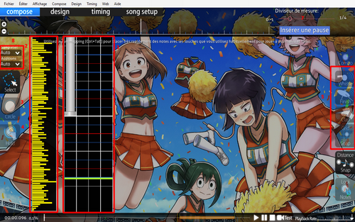

# Guide de mapping osu!mania

## Prologue

### Qu'est-ce que osu!mania ?

*Page principale : [osu!mania](/wiki/Game_mode/osu!mania)*

osu!mania est l'un des quatre modes de jeu. osu!mania fait partie du genre **Vertical Scrolling Rhythm Game** (VSRG). Comme son nom l'indique, les notes de musique descendent ou montent de manière verticale. Il existe de nombreux jeux assez similaires à osu!mania tels que "Stepmania", "O2Jam" ou "Beatmania IIDX".

Un des avantages d'osu!mania est le nombre personnalisable de colonnes jouables et son éditeur de beatmaps simple à utiliser.

### Qu'est-ce que l'éditeur de beatmaps ?

Comme indiqué, l'éditeur permet un nombre personnalisable de colonnes. Pour des raisons de simplicité, ce guide s'articulera autour du mapping à 4 touches. Vous pouvez voir ci-dessous une capture d'écran qui détaille les compartiments de l'éditeur.

#### Éditeur osu!mania

**1. Zone de mapping** : C'est ici que vous placez vos objets.

**2. Graphique de densité** : Il s'agit de la densité des parties individuelles dans la beatmap. Les barres *rose* indiquent que la densité est trop élevée pour être affichée.

**3 & 4. Notes et hold** : Ces options peuvent être modifiées en cliquant. Les **Notes** sont placées en cliquant, les **Hold Notes** *(également connues sous le nom de Long Notes)* peuvent être créées en cliquant et en faisant glisser.

*Raccourci :* `2, 3`

**5. Hitsounds** : Les objets peuvent être assignés à des sons pendant le jeu. Plus d'informations sur les hitsounds plus loin dans le guide.

*Raccourci :* `W, E, R`

**6. Lock Notes** : Si l'option Lock Notes est activée, vous ne pouvez déplacer aucune note, ce qui est utile lors du hitsounding. Si cette option n'est pas activée, vous pouvez accidentellement déplacer les notes lorsque vous mettez des hitsounds.

*Raccourci :* `L`

**7. Diviseur de mesure** : À l'aide du curseur, vous pouvez sélectionner le beat snap dans lequel vous souhaitez mapper. Le curseur va de 1/1 à 1/16, la plupart des mappeurs utilisent 1/4.

Les détails sur les snaps à utiliser pour le classement sont détaillés dans les [critères de classement d'osu!mania](/wiki/Ranking_criteria/osu!mania).

*Raccourci :* `Ctrl + Molette de la souris`

**8. Sample Set & Additions** : Les Sample Sets et les Additions vous permettent d'ajouter encore plus de hitsounds que ceux présentés au point 5. Par exemple, vous pouvez superposer un son de fin de batterie au son de fin normal. Ainsi, vous pouvez donner à votre morceau une variété encore plus grande de hitsounds !

*Raccourci :* `Ctrl + (W, E, R), Shift + (W, E, R)`

## Principes de base

### Song Setup

Très bien ! Faisons glisser le `.mp3` de la musique que nous voulons mapper dans osu! et une nouvelle beatmap sera créée automatiquement. Chaque fois que vous créez une beatmap pour la première fois dans l'éditeur, la configuration de la musique s'ouvre automatiquement.

#### General

| Nom | Description |
| :-- | :-- |
| Artist : | Ici, vous devrez ajouter le nom original de l'artiste de vos musiques. Peu importe qu'il soit japonais, allemand ou russe. Si le nom de l'artiste comporte au moins un caractère spécial, vous devez l'ajouter ici ! Par exemple : Si le nom de votre artiste est "Die Ärzte", vous devez l'ajouter ici à cause du "Ä". |
| Romanised Artist : | Ici, vous devez ajouter le nom romanisé de l'artiste, qui se traduit par le nom original de l'artiste en caractères romains (latins). Dans notre exemple précédent, ce serait "Die Aerzte", car le "Ä" se traduit par "Ae". Si le nom de votre artiste ne comporte aucun caractère spécial, ce champ sera rempli automatiquement. |
| Title & Romanised Title : | Exactement la même chose que pour l'artiste, mais avec le titre de la musique. |
| Beatmap Creator : | Ce champ est automatiquement rempli avec votre nom lorsque vous êtes connecté à osu!. Si vous n'êtes pas en ligne au moment de la création de la beatmap, ajoutez votre nom à cet endroit. |
| Difficulty : | [Règles de dénomination des difficultés des critères de classement**](/wiki/Ranking_criteria#beatmap) Vous indiquez ici le nom de la difficulté. À titre indicatif, les noms de difficulté standard pour osu!mania sont "Easy", "Normal", "Hard", "Insane" et "Expert". Si votre musique est issue d'un autre jeu, vous pouvez utiliser les noms de difficulté de ce jeu ! Par exemple Sound Voltex, qui utilise les noms suivants pour leurs difficultés respectives : "BASIC", "NOVICE", "ADVANCED", "EXHAUST", "INFINITE", "GRAVITY".  Pour les noms personnalisés, reportez-vous aux critères de classement liés ci-dessus. |
| Source : | Ici, vous devez indiquer d'où vient votre musique. Est-ce qu'elle vient d'un autre jeu ? Ou d'un anime ? Peut-être d'une émission de télévision ? Ajoute-le ici ! Par exemple : Si votre musique vient de Sound Voltex, vous devez l'ajouter ici. N'oubliez pas qu'il doit s'agir du nom exact du jeu ! |
| Tags : | Vous pouvez ajouter des informations supplémentaires sur votre musique ici. Par exemple, des noms d'albums ou de producteurs. Tout ce qui peut aider à trouver votre musique dans la liste des beatmaps. Vous devez également ajouter le nom de chaque mappeur d'osu! qui a fait une difficulté dans votre beatmap. Les balises sont séparées par des espaces. |

#### Difficulty

| Nom | Description |
| :-- | :-- |
| HP Drain Rate (HP) : | Une valeur plus élevée signifie un drain plus punitif et une récupération plus faible, et vice versa. Une valeur de HP couramment utilisée serait **7** *Note : Seuls les 50 ou les miss draineront les HP*. |
| Key Count : | Ici, vous devez définir le nombre de touches dans lequel vous voulez mapper. Dans ce guide, je vais utiliser 4K. Notez que seules les beatmaps 4K, 5K, 6K, 7K, 8K et 9K sont classables. La case à cocher "Co-Op" peut être sélectionnée lorsque vous choisissez 5K et plus, doublant ainsi le nombre de touches. Cela vous permet de jouer avec un ami sur un seul clavier. |
| Approach Rate : | Cette option n'est pas utilisée dans osu!mania et vous pouvez l'ignorer. |
| Overall Difficulty (OD) : | L'OD modifie la fourchette d'erreur de frappe de tous les [jugements](/wiki/Gameplay/Judgement), à l'exception de 300g. Il est recommandé d'utiliser un OD plus faible pour les beatmaps orientées Long Note, et vice versa pour les beatmaps orientées Note. |

#### Design

| Nom | Description |
| :-- | :-- |
| Countdown : | Ici, vous pouvez définir un compte à rebours pour votre beatmap. Il n'est pas recommandé de l'activer. |
| Widescreen Support : | Cette case ne doit être activée que si votre beatmap a un storyboard en écran large. |
| Display Epilepsy Warning : | Si vous utilisez un storyboard avec des lumières qui clignotent rapidement, il est très important d'activer cette case ! Le joueur est ainsi averti de la présence du storyboard, ce qui lui permet de le désactiver ou d'augmenter l'intensité du fond. |
| Letterboxing During Breaks : | Le Letterboxing fait apparaître des petites boîtes en haut et en bas de l'écran lors d'une pause. |

#### Advanced

| Nom | Description |
| :-- | :-- |
| Stacking : | Cette option n'a pas d'effet pour osu!mania donc pas besoin de changer quoi que ce soit ici. |
| Allowed Modes : | Avec cette option, vous changez le mode de l'éditeur à celui que vous voulez utiliser pour votre beatmap. Ce guide est consacré à l'osu!mania, nous utilisons donc "osu!mania" bien sûr. Si vous choisissez "All", votre éditeur sera réglé sur osu!mania. **Si vous changez cette option alors que vous êtes dans une beatmap osu!mania existante, celle-ci sera écrasée**. |
| Use special Style (N+1 style) for osu!mania : | Si vous mappez dans un keymode qui utilise une touche spéciale (6K et 8K), vous pouvez activer ce point. Cela permet au joueur d'échanger la **colonne spéciale** à sa gauche ou à sa droite selon ses réglages. Connue dans "BMS" sous le nom de "Scratch Column", elle est couramment utilisée dans 7+1K (8K) osu!mania. Le mapping en 7+1K est similaire au mapping d'une beatmap 7K, mais une **colonne spéciale** supplémentaire est générée à la discrétion du mappeur. |

L'option **Colours** n'est pas utilisée dans osu!mania donc nous n'avons pas besoin de changer quoi que ce soit ici.

L'option **Audio** sera expliquée dans la partie "Hitsounds".

### Timing

Une fois que nous avons terminé la configuration de notre musique, nous devons la timer. Le réglage du timing doit être précis par rapport au rythme de la musique, sinon il sera difficile d'établir une correspondance exacte.

#### Trouver le BPM

Tout d'abord, vous devez écouter attentivement votre musique pour vous faire une idée du rythme. Une fois que vous pensez pouvoir entendre le rythme, commencez à appuyer sur "T" sur chaques temps jusqu'à ce que l'éditeur affiche une valeur. Vous pouvez continuer de taper pour obtenir un BPM plus précis, mais la plupart des musiques ont des valeurs de BPM entières, c'est-à-dire qu'elles n'ont pas de décimales.

Il devrait y avoir un tic-tac indiquant le BPM réglé, s'il n'est pas présent, vérifiez si votre volume **Effets** est assez élevé.

#### Vérification du décalage

La plupart du temps, votre décalage sera légèrement décalé, c'est-à-dire que le tic-tac sonnera systématiquement en retard ou en avance. Ajustez la valeur jusqu'à ce qu'elle sonne parfaitement sur le rythme.

#### Vérification du BPM

En général, le BPM initial trouvé sera légèrement décalé, vous devrez vérifier que le BPM est correct.

*Notez que les mauvais offsets sont différents des mauvais BPMs.*

Pour les valeurs de BPM inexactes, le tic-tac se *déplace* et devient de plus en plus **important** au fur et à mesure que vous vous éloignez de la **ligne rouge** de la timeline (en bas de l'éditeur). C'est un signe révélateur que votre BPM est imprécis. Essayez de l'ajuster de +1 ou -1.

Si tout cela échoue, vous pouvez demander de l'aide dans le canal `#osu` ou `#osumania`.

#### Trouver le premier décalage

Le premier décalage est le premier temps de votre BPM actuel. Allez au point de votre musique où vous pouvez entendre le premier temps, appuyez sur F6, cliquez sur le point de timing et appuyez sur "Use current time". Maintenant, le point de synchronisation devrait se trouver sur le décalage actuel, le premier temps.

S'il est juste, votre musique est enfin timée !

#### MixMeister BPM Analyzer

Nous voudrions aussi vous montrer un petit programme qui peut être très utile pour trouver le bon BPM très rapidement. Il s'appelle ***MixMeister BPM Analyzer***. Ce programme vous montrera le BPM moyen de votre musique. Il a juste un point faible. Il ne peut pas vous montrer plusieurs BPM. Il vous montrera le BPM moyen de tous les points de BPM de votre musique. Pour le dire simplement : Il n'aide qu'avec un seul BPM. Vous pouvez le rechercher sur Google ou simplement cliquer [ici](https://dropbox.com/s/m4pjenvo4n65943/bpmanalyzer.zip?dl=0). N'essayez pas de l'utiliser pour timer toutes vos beatmaps. Vous n'apprendrez jamais à timer des musiques si vous laissez ce programme timer tout pour vous. Utilisez-le pour le comparer avec votre BPM pour vérifier si vous avez le bon !

#### Plusieurs BPM

Beaucoup de musiques n'ont pas un BPM constant. Pour ceux-là, vous devez ajouter un autre point de BPM au point de changement.

Allez au point où le BPM change, appuyez sur F6 pour ouvrir le panneau Timing, ajoutez un autre point de timing en cliquant sur le "plus" vert et ajustez-le au changement de BPM tout en écoutant à nouveau le métronome. Vous pouvez également appuyer sur Ctrl + P pour définir un point de BPM à l'horodateur où vous vous trouvez actuellement. Faites cela pour chaque changement de BPM dans votre beatmap !

#### Timing Setup Panel

| Nom | Description |
| :-- | :-- |
| Timing Point : | Le point de synchronisation ou "ligne rouge" est là pour synchroniser votre musique. Sans lui, vous ne pouvez pas commencer le mapping. Reportez-vous aux étapes ci-dessus pour [*timer*](#timing) votre musique. |
| Inherited Point : | Le point hérité ou "Ligne verte" est utilisé pour ajouter des "effets" à votre beatmap. Avec ces effets, vous pouvez modifier le volume, l'ensemble d'échantillons, le slider velocity (SV) et vous pouvez ajouter un [Kiai Time](/wiki/Gameplay/Kiai_time). |
| Kiai : | Le Kiai peut être sélectionné dans "Style" et peut être ajouté entre deux points hérités. Le Kiai Time est normalement utilisé dans le refrain de votre musique. Il fera apparaître des fontaines étoilées des deux côtés de l'écran et est utilisé pour mettre en valeur une section de la beatmap. |

### Pattern

Une fois que vous avez enfin trouvé le bon timing dans votre beatmap, il est temps de commencer à mapper. Les patterns sont comme des blocs de construction de la beatmap, il est essentiel de connaître leurs noms et leurs objectifs. Nous allons ajouter une capture d'écran pour chaque motif avec une courte description de ce qu'ils sont et quand vous devez les utiliser.

#### Long Note

La LN est le "Slider" dans osu!mania. L'utilisation des LN est la meilleure façon de représenter les sons longs dans votre musique. Il y a beaucoup de façons d'utiliser une LN que nous allons expliquer dans une autre partie de ce guide.

#### Chord

Dans la capture d'écran, nous avons utilisé un chord de deux notes. Les chords signifient *plus d'une note*. Les "doubles", "triples" ou "quads" entrent dans cette catégorie. Ils sont utilisés pour mettre en valeur les sons forts de votre musique, comme les grosses batteries ou les cymbales.

Si vous prévoyez de classer votre beatmap, vous pouvez utiliser jusqu'à six notes ! Toute note supplémentaire est contraire aux critères de classement.

#### Burst

Les bursts sont des rafales rapides de notes. Ils ne sont pas nécessairement en 1/4, mais se définissent par une augmentation soudaine de la densité pendant une courte période de temps.

#### Staircases

Le staircase est surtout utilisé pour les sons rapides. Notez que certains staircases deviennent très difficiles à exécuter à partir d'un certain BPM, ceci est principalement dû aux jacks formés sur les colonnes 2 et 3.

#### Roll

Les rolls sont similaires aux staircases. Habituellement, les rolls sont délimités par un motif répétitif de 4 notes ou plus, mais plus généralement, ce sont des notes qui vont dans une certaine direction. Un 1234 est un roll et un 1324 est un split roll.

#### Jackhammer

Également connu sous le nom de **Jack**. Il est recommandé d'utiliser des jacks pour deux sons qui sonnent exactement de la même façon. Les jacks peuvent rapidement monter en difficulté lorsqu'ils sont surutilisés. Il est recommandé d'éviter d'en abuser, sauf si vous êtes certain.

#### Shield

Le shield est reconnaissable au fait qu'il est toujours situé juste avant ou après une LN.

#### Chordjack

Le chord jack est une combinaison du jackhammer et du chord. La façon de l'utiliser est la même que pour le jackhammer. Pour les mêmes sons, il suffit de les utiliser comme des chords pour les sons plus lourds.

#### Trill

Le trill est utilisé pour deux sons changeant très rapidement dans votre musique. Dans la capture d'écran, nous voyons le handed trill, mais vous pouvez également utiliser les colonnes 1 et 3 pour un two handed trill.

#### Chordtrill

Le chord trill peut augmenter rapidement la difficulté de votre beatmap. Comme le trill, le chord trill est utilisé pour accentuer deux sons beaucoup plus forts qui changent très rapidement. Une alternative plus simple serait d'utiliser les chords trill `12` et `34` à la place.

#### Jumpstream

**Jump** est un chord de 2 notes, donc jumpstream est un chord stream de 2 notes.

Un jumpstream peut être utilisé pour superposer des sons forts entre un stream constant de 1 note, en utilisant un chord de 2 notes lorsque cela est possible.

Il y a beaucoup de façons différentes de mapper les jumpstreams. Dans la capture d'écran, nous pouvons voir une façon vraiment basique de le mapper car il n'y a pas de 1/2 triple jacks.

Ok ! Voici quelques-uns des différents patterns que vous pouvez utiliser dans votre musique ! Cependant, il existe encore de nombreuses autres configurations de patterns qui ne sont pas abordées dans ce guide. De nombreuses combinaisons fonctionnent bien ensemble. Essayez d'expérimenter ces patterns dans votre musique et nous pensons que vous pourrez trouver un bon mélange pour votre musique !

### Mapping

Une fois que nous savons quels patterns nous pouvons utiliser et comment ils sont appelés, nous pouvons commencer le mapping. Il suffit de faire glisser la musique que vous voulez mapper dans osu!, de remplir la configuration du morceau et d'ajouter le timing ! Si vos premiers essais sont étranges ou si vous n'aimez pas, n'abandonnez pas ! Personne n'est né maître en la matière. Testez votre beatmap aussi souvent que possible et lorsqu'elle est terminée, essayez d'obtenir le plus de retours possible ! Demande à tes amis qui jouent à osu!mania, demande sur \#osumania ou écris directement à un joueur en jeu et demande-lui son avis. Cela aide vraiment beaucoup lorsque vous utilisez le playback rate de 25% pendant le mapping. Très bien, c'est parti ! Dans cette partie, nous souhaitons vous expliquer ce que vous devez surveiller lorsque vous mappez une difficulté Easy, Normal, Hard ou Insane.

**Notice** : Gardez à l'esprit que tout ce qui sera dit ici n'est qu'une ligne directrice et que vous ne devez pas le prendre comme une règle établie. Vous n'avez pas besoin de suivre cette ligne directrice mot à mot.

Si vous voulez classer votre beatmap, vous devez tenir compte de certains points.

**Premièrement** : Vous avez besoin d'un spread complet dans votre beatmap. Une beatmap osu!mania nécessite généralement 3 difficultés ou plus. Une Easy/Normal, une Hard et une Insane. Bien sûr, vous pouvez décider vous-même si vous voulez une difficulté Easy ou Normal, mais il est préférable d'avoir les deux. Cependant, vous n'êtes pas obligé d'avoir une difficulté Easy dans votre beatmap. Les [Critères de classement osu!mania](/wiki/Ranking_criteria/osu!mania) stipulent que la difficulté la plus faible doit être inférieure à 2\*. Cela signifie que vous pouvez avoir une Normal comme difficulté la plus faible tant qu'elle est inférieure à 2\*. **Les beatmaps à approuver ne sont pas concernées par cette règle**.

Lorsque vous créez un full spread, il est très important de regarder le pattern spread, et non le star rating ! Il peut arriver que le nombre d'étoiles soit très élevé à cause d'une seule partie très dense de votre beatmap. osu!mania dispose d'un outil très utile pour mapper différentes difficultés lorsque vous en avez déjà une prête. Par exemple : Vous avez déjà terminé la difficulté Hard de votre beatmap et vous voulez maintenant en créer une Normal. Ouvrez la nouvelle difficulté, cliquez sur "Fichier", puis sur "Ouvrir la difficulté" et enfin sur "Pour référence". Choisissez maintenant la difficulté Hard. Un deuxième champ de mapping apparaît alors à côté du champ de mapping actuel. Il s'agit de la difficulté Hard. Il vous montre exactement comment vous avez placé le motif à cet endroit et vous pouvez vous en servir comme référence pour mapper la difficulté Normal !

Voici également quelques conseils généraux pour le mapping :

**Soyez cohérent !** Qu'est-ce que cela signifie ? N'utilisez pas différents types de pattern pour exactement le même son dans votre beatmap. Par exemple, si vous utilisez un chord pour la batterie ou la caisse claire, gardez-le comme tel ! Ne le changez pas en une seule note par la suite. La cohérence des patterns est l'un des aspects les plus importants du mapping d'osu!mania. Le fait d'utiliser des quantités différentes de notes pour les mêmes sons donne une impression de fausse note.

Nous allons maintenant vous expliquer les **directives générales** sur ce qu'il faut mettre dans les difficultés particulières, allant de Easy à Extras.

**Comme nous l'avons dit, il s'agit juste d'une ligne directrice et vous n'êtes pas obligé de la suivre à la lettre**.

**La difficulté "Easy"** : Comme son nom l'indique, nous avons choisi la difficulté Easy. Et c'est ce qu'elle doit être : Facile à jouer ! Nous voulons introduire les nouveaux joueurs à osu!mania et ils doivent apprendre les bases. C'est pourquoi nous voulons garder notre difficulté aussi simple que possible. Nous n'utilisons pas de motif 1/4, même le motif 1/2 doit être utilisé avec précaution. N'utilisez les chords que pour souligner le début ou la fin d'une partie avec une cymbale lourde. Assurez-vous de toujours essayer de bien équilibrer les mains. Utilisez beaucoup de LN pour les sons longs de votre musique et pour mapper les sons lourds de 1/4 et plus. Si vous voulez utiliser des chords par exemple dans votre kiai, assurez-vous que le joueur a suffisamment de temps pour réagir. Cela signifie qu'il faut lui donner un temps de battement de 1/1 ! Dans la plupart des musiques, le deuxième temps ou le temps principal est toujours plus fort que le premier, avec des sons lourds de batterie, de kicks ou de clap. Pour ces derniers, vous pouvez mapper un chord et utiliser une note normale pour les sons calmes. Mais tout de même : dans le meilleur des cas, n'utilisez que des notes normales et simples. N'utilisez pas non plus de notes simples lorsque vous avez une LN ! Le joueur doit d'abord apprendre à gérer une LN et à la relâcher au bon moment. Si vous voulez vraiment utiliser des notes simples pendant une LN, vous devez faire attention à ce que la note simple soit sur l'autre main. Cela signifie que lorsque vous avez mappé une LN sur la main droite, la note simple doit être pressée avec la main gauche ! N'oubliez pas non plus que si vous voulez ajouter une difficulté facile à votre musique, vous devez essayer de la garder en dessous de 1,5\* pour avoir l'icône Easy.

**La difficulté "Normal"** : Maintenant que nous savons comment créer une difficulté Easy, nous pouvons augmenter un peu la densité des notes pour la difficulté Normal. Nous pouvons utiliser plus de pattern 1/2 maintenant, mais nous devrions essayer d'éviter les pattern 1/4 ou les utiliser très prudemment. Dans le meilleur des cas, seulement lorsque votre musique a un bpm très bas ou seulement des shorts stairs. Nous pouvons également utiliser plus de chords maintenant. Si vous avez une grosse caisse claire ou une grosse cymbale au milieu de la partie, vous pouvez l'associer à un chord pour les mettre en valeur. Nous pouvons également utiliser des notes simples pendant une LN mais essayez d'utiliser des mains différentes comme expliqué dans la difficulté Easy ! Si vous avez plus d'une note pendant la LN, il est possible d'en avoir certaines sur la même main que la LN, mais la plupart d'entre elles doivent être jouées avec l'autre main ! Ici, nous devrions certainement mapper le kiai avec des chords et des notes normales comme déjà expliqué dans le Easy, mais n'en abusez pas. Selon le bpm de votre musique, vous pouvez aussi ajouter 1/2 notes normales ici. Mais n'oubliez pas : Le joueur vient d'apprendre le modèle de base et vous ne devez pas en abuser ! Un autre bon point pour une difficulté normal est de suivre le PR (pitch relevancy) avec vos notes. Les sons plus aigus peuvent être mappés sur le côté droit, les sons plus graves sur le côté gauche du champ de jeu.

**La difficulté "Hard"** : Dans la difficulté Hard, nous pouvons commencer à ajouter des motifs plus compliqués car le joueur doit avoir appris les bases de Easy et Normal. Nous pouvons commencer à ajouter de plus longues salves de 1/4 et des pattern stairs, nous pouvons également commencer à utiliser des chords de 3 notes pour les cymbales lourdes à la fin ou au début d'une partie. De même, en fonction du bpm et de la partie de votre beatmap, nous pouvons utiliser des jumpstreams courts mais assurez-vous qu'ils correspondent à la partie que vous mappez actuellement. Lorsque la musique devient plus trépidante et plus rapide, c'est le moment idéal pour ajouter un tel jumpstream. Vous pouvez également commencer à utiliser de courts pattern jack ici. Ce que vous devez éviter, ce sont les chord trills. Les chord trills ont une densité de pattern très élevée, ce qui peut entraîner un star ranting très élevé. Vous pouvez bien sûr utiliser de courts chord triples, mais ils ne devraient pas avoir un impact important sur le star ranting. Le kiai doit être la partie la plus dense de votre beatmap si possible. Aussi, vous pouvez essayer de combiner plus de LN et de patterns 1/4 de notes simples. Essayez de combiner différentes longueurs de patterns LN en même temps ! Cela peut donner à votre beatmap une sensation particulière en utilisant plus d'une LN en même temps. Mais fais très attention. Assurez-vous que chaque LN suit un son ! Ne les ajoutez pas "au hasard" dans votre musique juste parce que vous pensez que cela pourrait bien jouer. En fonction du BPM, il est également possible d'ajouter de courts patterns stairs 1/6 ou 1/8. Mais utilisez-les avec précaution. Ne les utilisez que si votre musique en offre suffisamment l'occasion. Les stairs 1/6 ne doivent pas être plus long qu'un 1/2 temps et le 1/8 pas plus long qu'un 1/4 temps ! Plus le bpm de votre musique est bas, plus ces pattern stairs peuvent être longs.

**Les difficultés "Insane" et "Extreme"** : Maintenant, nous nous concentrons sur les difficultés Insane et Extreme. Encore une fois, nous augmentons la densité des patterns et commençons à en utiliser des encore plus compliqués ! Vous pouvez maintenant utiliser toutes sortes de patterns et essayer de les combiner. De plus, vous pouvez maintenant utiliser des LN 1/8 ainsi que des chord trills ! Les difficultés Insane et Extreme sont surtout destinées aux joueurs plus expérimentés, donc vous devriez essayer de créer une difficulté vraiment agréable à jouer et toujours plus excitante. Essayez de combiner les jumpstreams avec les trills et le heavy chord mashing. Vous pouvez maintenant utiliser les chords à 3 notes pour faire plus que simplement souligner la fin d'une certaine partie de votre musique. Mais n'oubliez pas : Si vous envisagez d'ajouter une autre difficulté, par exemple une difficulté supplémentaire, vous ne devez pas aller jusqu'aux limites ! Vous devez laisser un peu d'espace pour créer une difficulté encore plus difficile. Je ne peux pas vous dire grand-chose car dans une bonne répartition de difficulté vous devez simplement créer une difficulté plus difficile que la difficile. Si vous prévoyez d'ajouter une difficulté supplémentaire, vous pouvez aller jusqu'aux limites de la musique. Vous pouvez utiliser des jumpstreams lourds avec des chordmashs lourds. Vous pouvez utiliser des chords de 3 notes dans des jumpstreams entre des chords de 2 notes. Vous devez essayer de repousser les limites de la musique. Mais prenez note de ce qui suit : Une ligne directrice dit que vous devez être capable de passer vos propres difficultés et nous sommes d'accord avec ce point. Si vous voulez vraiment créer une bonne difficulté insane/extreme jouable, vous devez savoir comment elles se jouent et pour cela vous devez être capable de les passer.

### Hitsounds

Vous avez placé vos premières notes et cela vous plaît ? Ou bien vous avez même terminé une difficulté ou un spread complet ? Excellent ! Mais il manque quelque chose, non ? Oui ! Les Hitsounds.

Les Hitsounds sont importants dans tous les modes de jeu. Ils donnent un retour d'information lorsque vous appuyez sur une note, ce qui permet au joueur de savoir ce qu'il vient de frapper. De plus, le fait d'avoir différents hitsounds dans votre beatmap peut lui donner une ambiance spéciale car la musique sonne différemment tout d'un coup, peut-être même mieux que sans hitsounds ! osu!mania propose deux façons différentes d'utiliser les hitsounds.

Tout d'abord, il y a la méthode normale qui utilise les échantillons et les effets fournis par le jeu lui-même, comme le sifflement/la fin et le clap. L'autre façon est via le menu d'échantillons que vous pouvez ouvrir avec `Ctrl` + `Shift` + `I`. Ce menu d'échantillons est particulièrement important pour le keysounding, c'est pourquoi nous l'expliquerons plus tard !

Pour l'instant, nous voulons nous concentrer sur la méthode normale du hitsounding.

Tout d'abord, vous devez décider si vous voulez utiliser les sons par défaut que osu! vous fournit ou si vous voulez ajouter des sons personnalisés.

Si vous voulez utiliser ceux par défaut, vous n'avez pas vraiment besoin de changer grand-chose. Tout ce dont vous avez besoin est de décider quel jeu d'échantillons vous voulez utiliser par défaut. Allez dans le panneau de configuration du timing et changez votre point de timing pour le jeu d'échantillons que vous voulez utiliser. osu!mania utilise généralement "soft" par défaut car le hit-normal n'est pas si fort.

Vous pouvez toujours changer le sample set pour une partie entière en sélectionnant toutes les notes et en la changeant pour le sample set désiré ou vous pouvez ajouter un point hérité (ligne verte) et changer toute la partie pour le sample set sélectionné jusqu'au prochain point hérité. Il ne vous reste plus qu'à ajouter le son que vous souhaitez ! Vous pouvez choisir entre Finish, Whistle et Clap. Tous ces effets sonnent différemment lorsque vous changez de jeu d'échantillons. Essayez un peu et je suis sûr que vous trouverez l'effet parfait pour votre musique !

Je vais maintenant vous expliquer comment ajouter des **sons personnalisés** à votre beatmap.

Tout d'abord, vous avez besoin des sons que vous voulez ajouter. Il doit s'agir d'un fichier .wav. Vous ne pouvez pas utiliser de hitsounds au format `.mp3` ou .ogg, car ils ne sont pas classables. Vous devez également vous assurer que vos hitsounds utilisés sont classables ! Cela signifie qu'ils doivent avoir une longueur d'au moins 100ms et que le délai du hitsound doit être acceptable et inférieur à 5ms. Dans le meilleur des cas, votre hitsound n'a absolument aucun retard, vous pouvez toujours couper le retard avec des programmes comme Audacity. Il est également interdit d'utiliser des hitsounds silencieux dans osu!mania. Chaque note pressée doit donner un feedback. Une fois que vous avez les hitsounds personnalisés que vous voulez ajouter, vous devez les renommer. Lorsque vous voulez faire un hitsound de la manière habituelle, vos hitsounds doivent avoir l'un des noms qui vont suivre.

#### Liste des Hitsounds

Les hitsounds suivants peuvent être modifiés dans le dossier des musiques :

- normal-hitnormal
- normal-hitwhistle
- normal-hitfinish
- normal-hitclap
- soft-hitnormal
- soft-hitwhistle
- soft-hitfinish
- soft-hitclap
- drum-hitnormal
- drum-hitwhistle
- drum-hitfinish
- drum-hitclap

Vous pouvez ajouter plus que cela ! Vous pouvez également nommer vos hitsounds ! Par exemple "soft-hitnormal2". Vous devez changer le jeu d'échantillons que vous voulez utiliser dans le panneau de configuration du timing.
**Note également :** Le "xxx-hitnormal" est le hitsound qui est joué lorsque vous ne donnez pas à la note un hitsound spécifique. Par exemple, lorsque vous changez le "soft-hitnormal", toutes les notes de votre beatmap qui ont le sample set soft actif auront ce hitsound ! Soyez prudent lorsque vous les modifiez.

Une fois que vous avez ajouté vos hitsounds, vous devez les activer !

Pour cela, nous ouvrons le Timing Setup Panel dans l'éditeur et marquons tous les points. Maintenant, nous allons dans "Audio" dans le Timing Setup Panel et changeons le Sample Set en "Custom 1". Et voilà !

Tous vos hitsounds du sample set 1 sont maintenant activés ! Si vous utilisez un autre sample set, choisissez le troisième point et choisissez le sample set que vous avez également choisi pour vos hitsounds.

Une fois que vous avez enfin vos hitsounds, n'oubliez pas d'activer "Lock Notes". De cette façon, aucune note ne pourra être déplacée pendant que vous modifiez votre beatmap. Le Hitsounding ne prend pas beaucoup de temps. Vous pouvez choisir une ou plusieurs notes en même temps, changer le jeu d'échantillons en haut à gauche de l'écran et ajouter l'effet sur le côté droit. Maintenant, toutes ces notes ont un hitsound !

Vous n'avez même pas besoin de sélectionner tout cela à la main. Vous pouvez également changer le jeu d'échantillons, les ajouts et l'effet avec des touches de raccourci ! Une fois que vous savez quel hotkey correspond à quoi, le hitsounding devient une tâche extrêmement facile ! Voici la liste des touches de raccourci que vous pouvez utiliser pour le hitsounding de votre beatmap :

#### Touches de raccourci des Hitsounds

- `Shift` + `Q` change le jeu d'échantillons en "Auto".
- `Shift` + `W` change le jeu d'échantillons en "Auto". "Normal"
- `Shift` + `E` change le jeu d'échantillons en "Auto". "Soft"
- `Shift` + `R` change le jeu d'échantillons en "Auto". "Drum"
- `CTRL` + `Q` change les ajouts à "Auto"
- `CTRL` + `W` change les ajouts à "Normal"
- `CTRL` + `E` change les ajouts à "Soft"
- `CTRL` + `R` change les ajouts à "Drum"
- `W` donne à votre note l'effet "Whistle"
- `E` donne à votre note l'effet "Finish"
- `R` donne à votre note l'effet "Clap"

**Note :** Bien sûr, vous pouvez ajouter plus d'un effet sur une note !

**Ce que nous voulons mentionner** : Ne jamais frapper plus d'une note dans le même chord avec le même hitsound ! Gardez à l'esprit que chaque note qui est jouée joue également le hitsound. Lorsque vous avez deux notes avec le même effet, l'effet sera également joué deux fois. C'est trop fort.

Le Hitsounding peut prendre un certain temps mais comme nous l'avons déjà mentionné, c'est important pour la beatmap. Une fois que vous vous y serez habitué, le hitsounding ira très vite !

## Connaissances avancées

Dans cette partie, je voudrais expliquer plus en détail le mapping d'osu!mania. Comme le keysounding, les changements de SV et la pertinence du pitch. En outre, en collaboration avec la communauté, je souhaite expliquer les différents styles de mapping. La communauté osu!mania est composée de joueurs de différents VSRG's comme o2 jam, Stepmania et BMS. Tous ces jeux ont un style de mapping particulier.

### Pitch

L'adaptation au pitch peut conduire à une beatmap amusante à jouer, surtout dans osu!mania !

En fait, ce n'est même pas si difficile, vous placez vos notes en fonction de la hauteur comme sur un piano, les sons graves sont mappés sur le côté gauche, les sons aigus sur le côté droit. Cette méthode est utilisée plus fréquemment dans les jeux à nombre de touches élevé (7K, 8K, etc.), où les possibilités sont plus nombreuses en raison de la largeur du champ de jeu et du nombre de colonnes.

Bien sûr, vous ne devez pas faire correspondre l'ensemble de la musique à la hauteur, car cela peut entraîner des problèmes d'équilibre dans votre beatmap.

Ce que vous pouvez toujours essayer, c'est de faire correspondre les parties calmes de votre beatmap à la hauteur, surtout lorsque vous utilisez principalement des notes simples dans cette partie. De même, lorsque votre musique comporte des changements de hauteur instrumentale audibles, vous devez essayer de les suivre.

Bien sûr, vous n'êtes pas obligé de suivre le pitch dans votre beatmap, mais vous pouvez le considérer comme un "petit plus" qui peut rendre votre beatmap plus intéressante à jouer.

### Slider Velocity (SV)

Le Slider Velocity agit un peu différemment dans osu!mania ; il modifie la vitesse à laquelle les notes défilent vers le bas. Plus le Slider Velocity est élevé, plus les notes descendent vite, et plus il est faible, plus les notes descendent lentement.

Ceci est principalement utilisé pour mettre l'accent sur des parties spécifiques des beatmaps ! Par exemple, lorsque la musique devient calme et plus lente, vous pouvez utiliser un slider velocity faible, pour que la beatmap corresponde à l'humeur de la musique. Mais quand la musique a quelques breaks courts et rapides, vous pouvez utiliser une vitesse plus élevée pour rendre la beatmap plus excitante, de cette façon, elle s'adapte encore mieux à la musique !

Vous devez également ajouter les changements de SV à votre beatmap lorsque votre musique comporte plusieurs changements de BPM. Par exemple : Si votre musique passe de 150 à 200 BPM, la vitesse de défilement de vos notes va également augmenter ! Pour éviter cela, nous devons ajouter un point SV au changement de BPM pour ajuster la vitesse de défilement au BPM moyen.

La formule pour ajuster le SV au BPM est la suivante: **SV = Mode BPM / Current BPM**

Le mode BPM de votre beatmap est toujours le nombre entre parenthèses que vous pouvez trouver dans le menu de sélection des beatmaps en haut à gauche à côté du BPM.

Vous prenez ce nombre et le divisez par le BPM actuel. Vous obtiendrez le SV que vous devez définir avec un point hérité au même moment que le changement de BPM.

### Styles de design/mapping

Comme nous l'avons déjà mentionné, la communauté osu!mania est composée de joueurs de différents VSRG et ils sont donc habitués à avoir différents styles de mapping.

Bien que chaque personne qui fait du mapping ait son propre style, il existe quelques caractéristiques de base sur lesquelles vous pouvez reconnaître les styles de mapping des autres jeux.

#### Stepmania Style

Stepmania possède l'une des plus grandes communautés pour les jeux VSRG. Par conséquent, elle possède également une grande communauté de mappeurs !

Le style Stepmania consiste, outre le style personnel de chaque mappeur, en deux styles de mapping différents. Le style NB5/Yolomania 4 et le style DCP/LCP.

Le style DCP/LCP met l'accent sur la pertinence musicale grâce à des techniques de mapping telles que la pertinence de la hauteur et la théorie du jack. (La théorie du jack consiste essentiellement à créer des jacks pour mettre en valeur un certain instrument, comme un crash de cymbale). Les beatmaps DCP/LCP sont plus appréciées par leurs mappeurs que par les joueurs car elles se concentrent principalement sur la pertinence musicale et pas tellement sur la jouabilité.

Le style yolomania s'appuie plus sur le patterning qu'autre chose. Il s'attache davantage à créer de bonnes beatmaps jouables pour le joueur et la communauté. Bien qu'il utilise toujours le concept de pertinence de la hauteur, il n'est pas non plus très important.

Généralement dit : Le style DCP s'intéresse davantage au rythme de la musique et à sa hauteur, tandis que le style yolomania s'intéresse davantage aux joueurs et à leur réaction à certains choix de patterns.
