# คู่มือการสร้างแผนที่ osu!mania (osu!mania mapping guide)

## บทนำ (Prologue)

### osu!mania คืออะไร? (What is osu!mania?)

*หน้าหลัก: [osu!mania](/wiki/Game_mode/osu!mania)*

osu!mania เป็นหนึ่งในสี่โหมดเกมของ osu! โดย osu!mania จัดอยู่ในประเภทเกม **Vertical Scrolling Rhythm Game** (VSRG) ตามที่ชื่อได้ระบุไว้แล้วว่า ตัวโน้ตดนตรีจะตกลงมาหรือลอยขึ้นในแนวตั้ง มีเกมที่ค่อนข้างคล้ายกับ osu!mania อยู่หลายเกม เช่น "Stepmania", "O2Jam" หรือ "Beatmania IIDX"

ข้อได้เปรียบประการหนึ่งของ osu!mania คือจำนวนคอลัมน์ที่เล่นได้ที่สามารถปรับแต่งได้ และตัวแก้ไขแผนที่ (beatmap editor) ที่ใช้งานง่าย

### ตัวแก้ไขแผนที่คืออะไร? (What is the beatmap editor?)

ตามที่ระบุไว้ ตัว editor อนุญาตให้ปรับแต่งจำนวนคอลัมน์ได้ เพื่อความเรียบง่าย คู่มือนี้จะเกี่ยวข้องกับการทำแมพแบบ 4 ปุ่ม (4-key-mapping) ด้านล่างนี้คุณจะเห็นภาพหน้าจอที่แสดงรายละเอียดส่วนประกอบต่างๆ ของ editor

#### osu!mania editor

**1. Mapping Area**: นี่คือจุดที่คุณวางวัตถุต่างๆ ของคุณ

**2. Density Graph**: นี่คือความหนาแน่นของแต่ละส่วนในแผนที่ แถบ *สีชมพู* บ่งบอกว่าความหนาแน่นสูงเกินกว่าจะแสดงผลได้

**3 & 4. Notes และ Hold**: ตัวเลือกเหล่านี้สามารถสลับได้โดยการคลิก **Notes** วางโดยการคลิก, **Hold Notes** *(หรือที่เรียกว่า Long Notes)* สามารถสร้างได้โดยการคลิกแล้วลาก

*ปุ่มลัด:* `2, 3`

**5. Hitsounds**: วัตถุสามารถถูกกำหนดเสียงในขณะเล่นได้ ข้อมูลเพิ่มเติมเกี่ยวกับ hitsounds จะอยู่ถัดไปในคู่มือนี้

*ปุ่มลัด:* `W, E, R`

**6. Lock Notes**: หากเปิดใช้งาน Lock Notes คุณจะไม่สามารถย้ายโน้ตใดๆ ได้ ซึ่งมีประโยชน์เมื่อทำการใส่ hitsounding หากไม่ได้เปิดใช้งานสิ่งนี้ คุณอาจเผลอย้ายโน้ตโดยไม่ได้ตั้งใจในขณะที่กำลังใส่ hitsound ให้พวกมัน

*ปุ่มลัด:* `L`

**7. Beat Snap Divisor**: การใช้แถบเลื่อน คุณสามารถเลือก beat snap ที่คุณต้องการจะวางแมพได้ แถบเลื่อนมีตั้งแต่ 1/1 ถึง 1/16 โดย mapper ส่วนใหญ่มักใช้ 1/4

รายละเอียดเฉพาะเกี่ยวกับ snap ที่ควรใช้สำหรับการ ranking มีระบุไว้ใน [osu!mania ranking criteria](/wiki/Ranking_criteria/osu!mania)

*ปุ่มลัด:* `Ctrl + MouseScrollWheel`

**8. Sample Set & Additions**: Sample Sets และ Additions อนุญาตให้คุณเพิ่ม hitsounds ได้มากกว่าที่แสดงในข้อ 5 ตัวอย่างเช่น คุณสามารถวางเสียง drum-finish ซ้อนทับบน normal-finish ได้ ด้วยการใช้สิ่งนี้ คุณสามารถทำให้เพลงของคุณมีความหลากหลายของ hitsounds มากยิ่งขึ้น!

*ปุ่มลัด:* `Ctrl + (W, E, R), Shift + (W, E, R)`

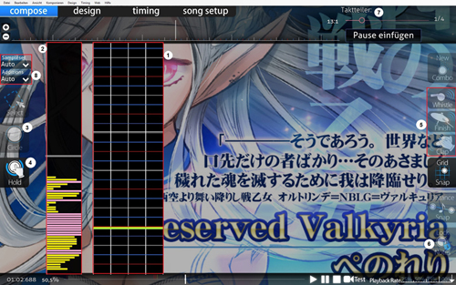

## พื้นฐาน (Basics)

### การตั้งค่าเพลง (Song Setup)

เอาล่ะ! ให้ลากไฟล์ `.mp3` ของเพลงที่เราต้องการจะทำแมพเข้าไปใน osu! และแผนที่ใหม่จะถูกสร้างขึ้นโดยอัตโนมัติ เมื่อใดก็ตามที่คุณสร้างแผนที่เป็นครั้งแรกใน editor หน้าต่าง song setup จะเปิดขึ้นโดยอัตโนมัติ

#### ทั่วไป (General)

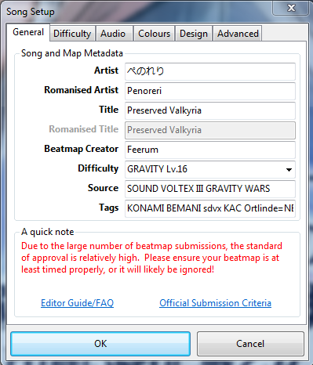

| ชื่อ | คำอธิบาย |
| :-- | :-- |
| Artist: | ที่นี่คุณจะต้องเพิ่มชื่อต้นฉบับของศิลปินเจ้าของเพลง ไม่ว่าจะเป็นภาษาญี่ปุ่น เยอรมัน หรือรัสเซีย หากชื่อของศิลปินมีตัวอักษรพิเศษอย่างน้อยหนึ่งตัว คุณต้องเพิ่มมันที่นี่! ตัวอย่างเช่น: หากชื่อศิลปินของคุณคือ "Die Ärzte" คุณต้องเพิ่มมันที่นี่เนื่องจากตัว "Ä" |
| Romanised Artist: | ที่นี่คุณต้องเพิ่มชื่อศิลปินที่ถูกแปลงเป็นอักษรโรมัน ซึ่งแปลมาจากชื่อศิลปินต้นฉบับในอักษรโรมัน (ละติน) จากตัวอย่างที่เราใช้ก่อนหน้านี้ มันจะเป็น "Die Aerzte" เพราะตัว "Ä" ถูกแปลงเป็น "Ae" หากชื่อศิลปินของคุณไม่มีตัวอักษรพิเศษใดๆ ในชื่อ ช่องนี้จะถูกเติมให้โดยอัตโนมัติ |
| Title & Romanised Title: | เหมือนกับกรณีของศิลปินทุกประการ แต่ใช้กับชื่อของเพลง |
| Beatmap Creator: | ช่องนี้จะถูกเติมด้วยชื่อของคุณโดยอัตโนมัติเมื่อคุณลงชื่อเข้าใช้ใน osu! หากคุณไม่ได้ออนไลน์ในเวลาที่สร้างบีทแมพ ให้เพิ่มชื่อของคุณที่นั่น |
| Difficulty: | [**กฎการตั้งชื่อความยากของ Ranking Criteria**](/wiki/Ranking_criteria#beatmap) คุณระบุชื่อความยากที่นี่ ในฐานะคำแนะนำ ชื่อความยากมาตรฐานสำหรับ osu!mania คือ "Easy", "Normal", "Hard", "Insane" และ "Expert" หากเพลงของคุณมาจากเกมอื่น คุณสามารถใช้ชื่อความยากของเกมนั้นได้! ตัวอย่างเช่น Sound Voltex ซึ่งใช้ชื่อต่อไปนี้สำหรับความยากตามลำดับ: "BASIC", "NOVICE", "ADVANCED", "EXHAUST", "INFINITE", "GRAVITY" สำหรับชื่อที่กำหนดเอง ให้อ้างอิงถึง ranking criteria ที่ลิงก์ไว้ด้านบน |
| Source: | ที่นี่ คุณต้องเพิ่มว่าเพลงของคุณมาจากไหน มันมาจากเกมอื่นหรือไม่? หรืออนิเมะ? บางทีอาจจะเป็นรายการทีวี? เพิ่มมันที่นี่! ตัวอย่างเช่น: หากเพลงของคุณมาจาก Sound Voltex คุณต้องเพิ่มมันที่นี่ จำไว้ว่ามันต้องเป็นชื่อที่ถูกต้องของเกมนั้นๆ! |
| Tags: | คุณสามารถเพิ่มข้อมูลเพิ่มเติมเกี่ยวกับเพลงของคุณที่นี่ ตัวอย่างเช่น ชื่ออัลบั้มหรือผู้ผลิต ทุกสิ่งที่ช่วยให้ค้นหาเพลงของคุณเจอในรายการบีทแมพ คุณต้องเพิ่มชื่อของ osu! mapper ทุกคนที่ทำระดับความยากใน mapset ของคุณลงไปด้วย แท็กจะถูกแยกด้วยช่องว่าง |

#### ความยาก (Difficulty)

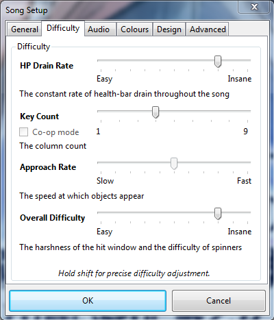

| ชื่อ | คำอธิบาย |
| :-- | :-- |
| HP Drain Rate (HP): | ค่าที่สูงขึ้นหมายถึงการลดเลือดที่รุนแรงขึ้นและการฟื้นฟูที่น้อยลง และในทางกลับกัน ค่า HP ที่มักใช้กันคือ **7** *หมายเหตุ: เฉพาะค่า 50 หรือ Miss เท่านั้นที่จะลด HP* |
| Key Count: | ที่นี่คุณต้องตั้งค่าจำนวนปุ่มที่คุณต้องการจะทำแมพ ในคู่มือนี้ผมจะใช้ 4K โปรดทราบว่าเฉพาะแผนที่ 4K, 5K, 6K, 7K, 8K และ 9K เท่านั้นที่สามารถ ranked ได้ ช่องทำเครื่องหมาย "Co-Op" สามารถเลือกได้เมื่อคุณเลือก 5K ขึ้นไป ซึ่งจะทำให้จำนวนปุ่มเพิ่มเป็นสองเท่า สิ่งนี้อนุญาตให้คุณเล่นกับเพื่อนบนคีย์บอร์ดตัวเดียวได้ |
| Approach Rate: | จุดนี้ไม่ได้ถูกใช้ใน osu!mania และคุณสามารถมองข้ามมันไปได้ |
| Overall Difficulty (OD): | OD เปลี่ยนช่วงเวลาความผิดพลาดในการกด (hit error range) ของการ [ตัดสิน (judgements)](/wiki/Gameplay/Judgement) ทั้งหมด ยกเว้น 300g แนะนำให้ใช้ OD ที่ต่ำลงสำหรับแผนที่ที่เน้น Long Note และในทางกลับกันสำหรับแผนที่ที่เน้น Note ปกติ |

#### การออกแบบ (Design)

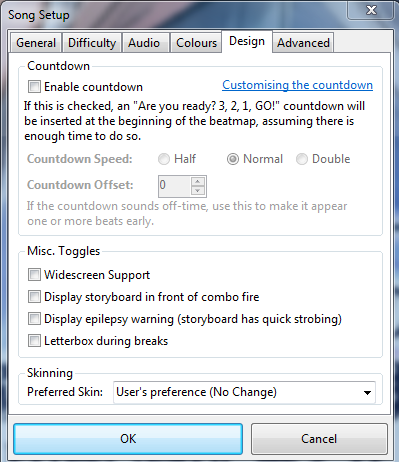

| ชื่อ | คำอธิบาย |
| :-- | :-- |
| Countdown: | ที่นี่คุณสามารถตั้งค่าการนับถอยหลังสำหรับแผนที่ของคุณ ไม่แนะนำให้เปิดใช้งานมัน |
| Widescreen Support: | ช่องนี้ควรเปิดใช้งานเมื่อแผนที่ของคุณมี storyboard แบบจอกว้างเท่านั้น |
| Display Epilepsy Warning: | หากคุณใช้ storyboard ที่มีแสงกะพริบอย่างรวดเร็ว มันเป็นสิ่งสำคัญมากที่จะต้องเปิดใช้งานช่องนี้! สิ่งนี้จะเตือนผู้เล่นเกี่ยวกับ storyboard เพื่อให้เขาสามารถปิดการใช้งานมันหรือเพิ่มค่า Background Dim ได้ |
| Letterboxing During Breaks: | Letterboxing จะแสดงแถบสีดำเล็กๆ ที่ด้านบนและด้านล่างของหน้าจอในขณะที่อยู่ในช่วงพัก (break) |

#### ขั้นสูง (Advanced)

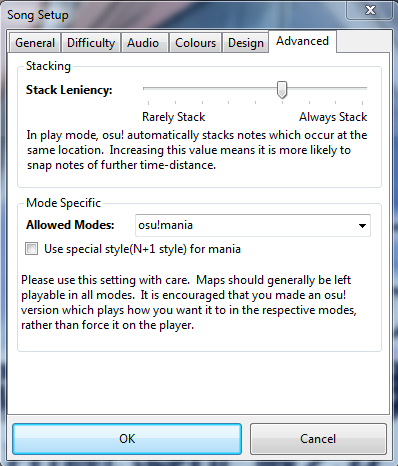

| ชื่อ | คำอธิบาย |
| :-- | :-- |
| Stacking: | จุดนี้ไม่มีผลสำหรับ osu!mania ดังนั้นจึงไม่จำเป็นต้องเปลี่ยนอะไรที่นี่ |
| Allowed Modes: | ด้วยจุดนี้ คุณสามารถเปลี่ยนโหมดของ editor เป็นโหมดที่คุณต้องการใช้สำหรับแผนที่ของคุณ คู่มือนี้เกี่ยวกับ osu!mania ดังนั้นเราจึงใช้ "osu!mania" แน่นอน หากคุณเลือก "All" editor ของคุณจะถูกตั้งค่าเป็น osu! **การเปลี่ยนตัวเลือกนี้ในขณะที่อยู่ในแผนที่ osu!mania ที่มีอยู่แล้วจะทำการเขียนทับแผนที่นั้น** |
| Use special Style (N+1 style) for osu!mania: | หากคุณทำแมพในโหมดปุ่มที่ใช้ปุ่มพิเศษ (6K และ 8K) คุณสามารถเปิดใช้งานจุดนี้ได้ สิ่งนี้อนุญาตให้ผู้เล่นสลับ **คอลัมน์พิเศษ** ไปทางซ้ายหรือขวาของพวกเขาขึ้นอยู่กับการตั้งค่าของพวกเขา เป็นที่รู้จักในชื่อ "BMS" ว่าเป็น "Scratch Column" ซึ่งมักถูกใช้ใน 7+1K (8K) ของ osu!mania การทำแมพ 7+1K นั้นคล้ายกับการทำแมพ 7K แต่จะมี **คอลัมน์พิเศษ** เพิ่มเติมที่สร้างขึ้นตามดุลยพินิจของ mapper |

จุด **Colours** ไม่ได้ถูกใช้ใน osu!mania ดังนั้นเราจึงไม่จำเป็นต้องเปลี่ยนอะไรที่นั่น

จุด **Audio** จะถูกอธิบายในส่วนของ "Hitsounds"

### การตั้งจังหวะ (Timing) {#timing}

เมื่อเราเสร็จสิ้นการ song setup เราจำเป็นต้องตั้งจังหวะเพลงของเรา การตั้งจังหวะต้องแม่นยำกับจังหวะของเพลง มิฉะนั้นมันจะยากที่จะวางแมพให้แม่นยำ

#### การหา BPM

อันดับแรกคุณต้องฟังเพลงของคุณอย่างใกล้ชิดเพื่อให้ได้ความรู้สึกของจังหวะ เมื่อคุณคิดว่าคุณได้ยินจังหวะแล้ว ให้เริ่มกด "T" ตามจังหวะจนกว่า editor จะแสดงค่าออกมา คุณสามารถเคาะให้นานขึ้นเพื่อให้ได้ BPM ที่แม่นยำยิ่งขึ้น แต่เพลงส่วนใหญ่มักจะมีค่า BPM เป็นจำนวนเต็ม นั่นคือพวกเขาไม่มีทศนิยม

ควรจะมีเสียงติ๊กที่ระบุถึงค่า BPM ที่ตั้งไว้ หากไม่มี ให้ตรวจสอบว่าระดับเสียง **Effects** ของคุณสูงเพียงพอหรือไม่

#### การตรวจสอบ Offset

ส่วนใหญ่แล้ว offset ของคุณจะคลาดเคลื่อนเล็กน้อย นั่นคือเสียงติ๊กจะฟังดูช้าไปหรือเร็วไปอย่างสม่ำเสมอ ให้ขยับค่าทีละนิดจนกว่ามันจะฟังดูสมบูรณ์แบบตรงตามจังหวะ

#### การตรวจสอบ BPM

โดยปกติ BPM เริ่มต้นที่พบจะคลาดเคลื่อนเล็กน้อย คุณจะต้องตรวจสอบว่า BPM นั้นถูกต้องหรือไม่

*โปรดทราบว่า offset ที่ไม่ดีนั้นแตกต่างจาก BPM ที่ไม่ดี*

สำหรับค่า BPM ที่ไม่แม่นยำ เสียงติ๊กจะ *แกว่ง* มันจะ **เด่นชัดมากขึ้น** ยิ่งคุณอยู่ห่างจาก **เส้นสีแดง** ใน timeline (ที่ด้านล่างของ editor) มากเท่าไหร่ นี่คือสัญญาณที่บอกว่า BPM ของคุณไม่แม่นยำ ให้ลองปรับมันทีละ +1 หรือ -1

หากทุกอย่างล้มเหลว คุณสามารถขอความช่วยเหลือได้ในช่อง `#osu` หรือ `#osumania`

#### การหา Offset แรก

offset แรกคือจังหวะแรกของ BPM ปัจจุบันของคุณ ไปยังจุดของเพลงที่คุณสามารถได้ยินจังหวะแรก กด F6 คลิกที่ timing point และกด "Use current time" ตอนนี้ timing point ควรจะอยู่ที่ offset ปัจจุบัน ซึ่งก็คือจังหวะแรก

หากมันถูกต้อง เพลงของคุณก็ได้รับการตั้งจังหวะแล้วในที่สุด!

#### MixMeister BPM Analyzer

ผมอยากจะแสดงให้คุณเห็นถึงโปรแกรมเล็กๆ ที่สามารถช่วยหา BPM ที่ถูกต้องได้อย่างรวดเร็ว มันเรียกว่า ***MixMeister BPM Analyzer*** โปรแกรมนี้จะแสดงค่า BPM เฉลี่ยของเพลงของคุณ มันมีจุดอ่อนเพียงอย่างเดียว คือมันไม่สามารถแสดงค่า BPM หลายค่าได้ มันจะแสดงค่า BPM เฉลี่ยของจุด BPM ทั้งหมดในเพลงของคุณ พูดง่ายๆ คือ: มันช่วยในกรณีที่มี BPM เดียวเท่านั้น คุณสามารถค้นหามันได้ใน Google หรือแค่คลิก [ที่นี่](https://dropbox.com/s/m4pjenvo4n65943/bpmanalyzer.zip?dl=0) อย่าพยายามใช้มันเพื่อตั้งจังหวะทุกแผนที่ของคุณ คุณจะไม่มีวันเรียนรู้วิธีการตั้งจังหวะเพลงเมื่อคุณปล่อยให้โปรแกรมนี้ตั้งจังหวะทุกอย่างให้คุณ ใช้มันเพื่อเปรียบเทียบกับ BPM ของคุณเพื่อตรวจสอบว่าคุณได้ค่าที่ถูกต้องหรือไม่!

#### BPM หลายค่า (Multiple BPMs)

เพลงจำนวนมากไม่ได้มี BPM ที่คงที่ สำหรับเพลงเหล่านั้น คุณต้องเพิ่มจุด BPM อีกจุดหนึ่งในจุดที่มีการเปลี่ยนแปลง

ไปยังจุดที่ BPM เปลี่ยน กด F6 เพื่อเปิดหน้าต่าง Timing เพิ่ม timing point อีกจุดโดยการคลิกที่ "เครื่องหมายบวก" สีเขียว และปรับแต่งมันตามการเปลี่ยนแปลงของ BPM ในขณะที่ฟังเมโทรนอมอีกครั้ง คุณสามารถกด Ctrl + P เพื่อตั้งจุด BPM ที่ตำแหน่งเวลาที่คุณอยู่ในปัจจุบันได้เช่นกัน ทำสิ่งนี้สำหรับการเปลี่ยนแปลง BPM ทุกจุดในแผนที่ของคุณ!

#### หน้าต่างการตั้งค่าจังหวะ (Timing Setup Panel)

| ชื่อ | คำอธิบาย |
| :-- | :-- |
| Timing Point: | timing point หรือ "เส้นแดง" มีไว้เพื่อตั้งจังหวะเพลงของคุณ หากไม่มีมันคุณจะไม่สามารถเริ่มทำแมพได้ อ้างอิงด้านบนสำหรับขั้นตอนในการ [**ตั้งจังหวะ**](#timing) เพลงของคุณ |
| Inherited Point: | inherited point หรือ "เส้นเขียว" ถูกใช้เพื่อเพิ่ม "เอฟเฟกต์" ให้กับแผนที่ของคุณ ด้วยสิ่งเหล่านี้ คุณสามารถเปลี่ยนระดับเสียง, ชุดตัวอย่างเสียง (sample set), ความเร็วสไลเดอร์ (slider velocity หรือ SV) และคุณสามารถเพิ่ม [Kiai-Time](/wiki/Gameplay/Kiai_time) ได้ |
| Kiai: | Kiai สามารถเลือกได้ใน "Style" และสามารถเพิ่มได้ระหว่างสอง inherited points Kiai Time ปกติจะถูกใช้ในท่อนฮุคของเพลงของคุณ มันจะสร้างน้ำพุรูปดาวที่ทั้งสองด้านของหน้าจอ และถูกใช้เพื่อเน้นส่วนหนึ่งของแผนที่ |

### รูปแบบ (Pattern)

เมื่อคุณมีจังหวะที่ถูกต้องในแผนที่ของคุณแล้ว ก็ถึงเวลาที่จะเริ่มทำแมพ รูปแบบต่างๆ เปรียบเสมือนบล็อกตัวต่อของแผนที่ มันเป็นสิ่งสำคัญที่ต้องรู้จักชื่อและวัตถุประสงค์ของพวกมัน ผมจะเพิ่มภาพหน้าจอสำหรับแต่ละรูปแบบพร้อมคำอธิบายสั้นๆ ว่าพวกมันคืออะไรและคุณควรใช้พวกมันเมื่อไหร่

#### Long Note

LN คือ "Slider" ใน osu!mania การใช้ LN เป็นวิธีที่ดีที่สุดในการแสดงถึงเสียงที่ยาวในเพลงของคุณ มีหลายวิธีในการใช้ LN ซึ่งผมจะอธิบายในส่วนอื่นของคู่มือนี้

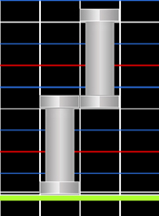

#### Chord

ในภาพหน้าจอผมได้ใช้คอร์ดแบบสองโน้ต คอร์ดหมายถึง *โน้ตที่มากกว่า 1 ตัว* "Doubles", "triples" หรือ "quads" จัดอยู่ในหมวดหมู่นี้ มันถูกใช้เพื่อเน้นเสียงที่หนักแน่นในเพลงของคุณ เช่น เสียงกลองหนักๆ หรือฉาบ

หากคุณกำลังวางแผนจะทำให้แผนที่ของคุณได้รับการ ranked คุณสามารถใช้ได้สูงสุดหกโน้ต! สิ่งใดที่มากกว่านั้นจะขัดต่อ Ranking Criteria

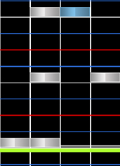

#### Burst

Bursts คือกลุ่มโน้ตที่เกิดขึ้นอย่างรวดเร็ว พวกมันไม่จำเป็นต้องเป็น 1/4 เสมอไป แต่ถูกนิยามโดยการเพิ่มขึ้นของความหนาแน่นอย่างกะทันหันในช่วงเวลาสั้นๆ

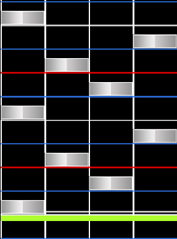

#### Staircases

Staircase (บันได) มักถูกใช้สำหรับเสียงที่รวดเร็ว โปรดทราบว่าบันไดบางแบบจะเริ่มเล่นยากมากหลังจากถึง BPM ระดับหนึ่ง ซึ่งสาเหตุหลักมาจาก jacks ที่เกิดขึ้นในคอลัมน์ที่ 2 และ 3

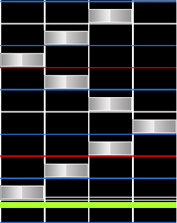

#### Roll

Rolling จะคล้ายกับ Staircases โดยปกติ rolls จะถูกแบ่งโดยรูปแบบที่ซ้ำกันของโน้ต 4 ตัวหรือมากกว่านั้น แต่โดยทั่วไปแล้ว มันคือโน้ตที่ดำเนินไปในทิศทางที่แน่นอน 1234 คือ roll และ 1324 คือ split roll

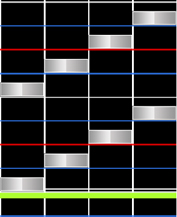

#### Jackhammer

หรือที่รู้จักกันในชื่อ **Jack** แนะนำให้ใช้ jacks สำหรับสองเสียงที่ฟังดูเหมือนกันทุกประการ Jacks สามารถเพิ่มความยากได้อย่างรวดเร็วเมื่อถูกใช้มากเกินไป แนะนำให้หลีกเลี่ยงการใช้สิ่งเหล่านี้มากเกินไปเว้นแต่คุณจะมั่นใจ

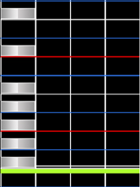

#### Shield

Shield (โล่) สามารถสังเกตได้จากข้อเท็จจริงที่ว่ามันเป็นโน้ตที่อยู่ก่อนหน้าหรือหลัง LN เสมอ

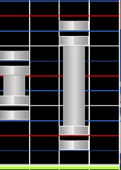

#### Chordjack

Chord jack คือการรวมกันของ jackhammer และ chord วิธีการใช้จะเหมือนกับ jackhammer สำหรับเสียงที่เหมือนกัน เพียงแค่คุณใช้สิ่งเหล่านี้เป็นคอร์ดสำหรับเสียงที่หนักกว่า

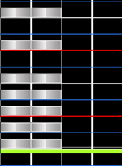

#### Trill

Trill ถูกใช้สำหรับสองเสียงที่สลับกันอย่างรวดเร็วมากในเพลงของคุณ ในภาพหน้าจอเราจะเห็น trill แบบมือเดียว อย่างไรก็ตามคุณสามารถใช้คอลัมน์ 1 และ 3 แทนสำหรับ trill แบบสองมือได้

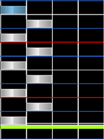

#### Chordtrill

Chord trill สามารถเพิ่มความยากของแผนที่ของคุณได้อย่างรวดเร็ว เช่นเดียวกับ trill ตัว chord trill ถูกใช้เพื่อเน้นเสียงที่ดังกว่ามากสองเสียงที่สลับกันเร็วมาก ทางเลือกที่ง่ายกว่าคือการใช้ `12` และ `34` chord trills แทน

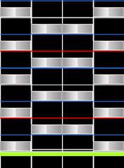

#### Jumpstream

**Jump** คือคอร์ดแบบ 2 โน้ต ดังนั้น jumpstream จึงเป็นสตรีมของคอร์ดแบบ 2 โน้ต

jumpstream สามารถใช้เพื่อวางชั้นของเสียงที่หนักแน่นระหว่างสตรีมของโน้ตเดี่ยวที่คงที่ โดยใช้คอร์ด 2 โน้ตเมื่อใดก็ตามที่ทำได้

มีวิธีที่แตกต่างกันมากมายในการทำแมพ jumpstreams ในภาพหน้าจอเราสามารถเห็นวิธีที่ปลอดภัยมากในการทำมัน เพราะไม่มี 1/2 triple jacks ในนั้น

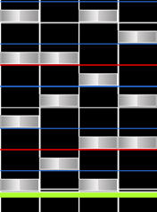

โอเค! เหล่านี้คือรูปแบบต่างๆ ที่คุณสามารถใช้ในเพลงของคุณ! อย่างไรก็ตาม ยังมีการจัดวางรูปแบบอีกมากมายที่ไม่ได้ครอบคลุมในคู่มือนี้ การผสมผสานหลายอย่างทำงานร่วมกันได้ดี ลองทดลองใช้รูปแบบเหล่านี้ในเพลงของคุณและผมมั่นใจว่าคุณจะพบส่วนผสมที่ดีสำหรับเพลงของคุณ!

### การทำแมพ (Mapping)

หลังจากที่เราทราบแล้วว่ารูปแบบไหนที่เราสามารถใช้ได้และพวกมันถูกเรียกว่าอะไร เราก็สามารถเริ่มต้นการทำแมพได้ แค่ลากเพลงที่คุณต้องการจะทำแมพเข้าไปใน osu!, กรอกข้อมูล song setup และเพิ่ม timing! หากการลองครั้งแรกของคุณดูแปลกๆ หรือคุณไม่ชอบมัน อย่าเพิ่งยอมแพ้! ไม่มีใครเกิดมาเป็นปรมาจารย์ ให้ทดสอบเล่น (testplay) แผนที่ของคุณบ่อยเท่าที่คุณจะทำได้ และเมื่อมันเสร็จสิ้นให้พยายามรับคำติชม (feedback) ให้มากที่สุดเท่าที่จะทำได้! ถามเพื่อนที่เล่น osu!mania, ถามใน #osumania หรือเขียนข้อความโดยตรงถึงผู้เล่นบางคนในเกมและขอคำติชม มันช่วยได้มากเมื่อคุณใช้ความเร็วในการเล่น 25% ในขณะที่ทำแมพ เอาล่ะ ไปกันเลย! ในส่วนนี้ผมอยากจะอธิบายว่าคุณควรจับตาดูอะไรเป็นพิเศษในขณะที่ทำแมพความยากระดับ Easy/Normal/Hard หรือ Insane

**ข้อสังเกต**: พึงระลึกไว้ว่าทุกสิ่งที่ผมจะเขียนจากตรงนี้เป็นเพียงแนวทาง (guideline) และคุณไม่ควรยึดถือสิ่งนี้เป็นกฎจริงๆ คุณไม่จำเป็นต้องปฏิบัติตามแนวทางนี้แบบคำต่อคำ

หากคุณต้องการจะ ranked บีทแมพของคุณ มีบางจุดที่คุณต้องให้ความสำคัญ

**อย่างแรก**: คุณต้องการระดับความยากที่ครอบคลุม (full spread) ในบีทแมพของคุณ บีทแมพ osu!mania มักต้องการความยาก 3 ระดับขึ้นไป ได้แก่ Easy/Normal, Hard และ Insane แน่นอนว่าคุณสามารถตัดสินใจด้วยตัวเองได้หากคุณต้องการ Easy หรือ Normal แต่จะดีที่สุดถ้ามีทั้งสองอย่าง อย่างไรก็ตามคุณไม่ถูกบังคับให้ต้องมีความยากระดับ Easy ใน mapset ของคุณ [osu!mania Ranking Criteria](/wiki/Ranking_criteria/osu!mania) ระบุว่าระดับความยากต่ำสุดของคุณต้องต่ำกว่า 2 ดาว นั่นหมายความว่าคุณสามารถมี Normal เป็นระดับต่ำสุดได้ตราบเท่าที่มันต่ำกว่า 2 ดาว **แผนที่สำหรับการ approval จะไม่ได้รับผลกระทบจากกฎนี้!**

ในขณะที่สร้างระดับความยากที่ครอบคลุม มันเป็นสิ่งสำคัญมากที่จะต้องดูที่การกระจายของรูปแบบ (pattern spread) ไม่ใช่ดูที่ระดับดาว! มันสามารถเกิดขึ้นได้ที่ระดับดาวจะสูงมากเพียงเพราะส่วนที่หนาแน่นมากๆ เพียงส่วนเดียวในแผนที่ของคุณ osu!mania มีเครื่องมือที่มีประโยชน์มากสำหรับการทำแมพความยากระดับต่างๆ เมื่อคุณมีระดับหนึ่งที่พร้อมแล้ว ตัวอย่างเช่น: คุณทำความยากระดับ Hard สำหรับ mapset ของคุณเสร็จแล้ว และตอนนี้คุณต้องการจะทำแมพระดับ Normal ให้เปิดความยากระดับใหม่ คลิกที่ "File" จากนั้นคลิกที่ "Open Difficulty" และคลิกที่ "For Reference" คราวนี้ให้เลือกความยากระดับ Hard ตอนนี้ พื้นที่การทำแมพที่สองจะปรากฏขึ้นข้างๆ พื้นที่ปัจจุบันของคุณ มันคือความยากระดับ Hard มันแสดงให้คุณเห็นว่าคุณได้วางรูปแบบไว้อย่างไรและคุณสามารถใช้สิ่งนี้เป็นข้อมูลอ้างอิงในการทำแมพความยากระดับ Normal ได้!

นี่คือคำแนะนำทั่วไปสำหรับการทำแมพ:

**จงมีความสม่ำเสมอ (Be consistent!)** นั่นหมายความว่าอย่างไร? อย่าใช้รูปแบบที่แตกต่างกันสำหรับเสียงที่เหมือนกันทุกประการในแผนที่ของคุณ ตัวอย่างเช่น; หากคุณใช้คอร์ดสำหรับเสียงกลองหรือสแนร์ ให้ทำแบบนั้นต่อไป! อย่าเปลี่ยนมันเป็นโน้ตเดี่ยวในภายหลัง ความสม่ำเสมอของรูปแบบเป็นหนึ่งในแง่มุมที่สำคัญที่สุดของการทำแมพ osu!mania มันจะรู้สึกผิดเพี้ยนเมื่อเล่นหากคุณใช้จำนวนโน้ตที่แตกต่างกันสำหรับเสียงที่เหมือนกัน

ตอนนี้ผมจะอธิบาย **แนวทางทั่วไป** เกี่ยวกับสิ่งที่ควรจะใส่ลงในแผนที่สำหรับระดับความยากเฉพาะ ตั้งแต่ Easy ไปจนถึง Extras

**อย่างที่ผมบอก นี่เป็นเพียงแนวทางและคุณไม่จำเป็นต้องปฏิบัติตามแบบ 1:1**

**ระดับความยาก "Easy"**: ตามที่ชื่อบอกไว้ เรากำลังทำแมพระดับความยากง่ายที่นี่ และมันควรจะเป็นแบบนั้น: เล่นง่าย! เราต้องการแนะนำผู้เล่นใหม่เข้าสู่ osu!mania และเขาควรจะได้เรียนรู้พื้นฐาน นั่นเป็นเหตุผลที่เราต้องการรักษาความยากของเราให้เรียบง่ายที่สุดเท่าที่เราจะทำได้ เราไม่ใช้รูปแบบ 1/4 ใดๆ แม้แต่รูปแบบ 1/2 ก็ควรใช้อย่างระมัดระวัง ใช้คอร์ดเพื่อเน้นเฉพาะการเริ่มต้นหรือตอนจบของส่วนที่มีเสียงฉาบหนักๆ ตรวจสอบให้แน่ใจว่าคุณพยายามรักษาสมดุลของมือได้เป็นอย่างดีเสมอ ใช้ LN จำนวนมากสำหรับเสียงที่ยาวในเพลงของคุณ และเพื่อทำแมพเสียง 1/4 ที่หนักแน่นและสูงกว่านั้น หากคุณต้องการใช้คอร์ดตัวอย่างเช่นใน kiai ของคุณ ตรวจสอบให้แน่ใจว่าผู้เล่นมีเวลามากพอที่จะตอบสนอง นั่นหมายถึงให้เวลาเขา 1/1 จังหวะ! ในเพลงส่วนใหญ่ จังหวะที่สองหรือจังหวะหลักจะดังกว่าจังหวะแรกเสมอ ด้วยเสียงกลองหนักๆ, kicks หรือเสียงปรบมือ สิ่งเหล่านี้คุณสามารถวางแมพเป็นคอร์ดในขณะที่คุณใช้โน้ตปกติสำหรับเสียงที่เงียบ แต่ถึงอย่างนั้น: ในกรณีที่ดีที่สุดแค่ใช้โน้ตปกติแบบเดี่ยว นอกจากนี้อย่าใช้โน้ตเดี่ยวในขณะที่มี LN! ผู้เล่นควรเรียนรู้วิธีกด LN ก่อนและเรียนรู้วิธีปล่อยมันในเวลาที่ถูกต้อง หากคุณต้องการใช้โน้ตเดี่ยวระหว่างมี LN จริงๆ คุณควรระวังให้โน้ตเดี่ยวนั้นอยู่อีกมือหนึ่ง หมายความว่า เมื่อคุณวาง LN ไว้ที่มือขวา โน้ตเดี่ยวจะต้องถูกกดด้วยมือซ้าย! อย่าลืมด้วยว่า: หากคุณต้องการเพิ่มความยากระดับ easy ให้กับเพลงของคุณ คุณควรพยายามรักษามันให้ต่ำกว่า 1.5 ดาวเพื่อให้ได้ไอคอน easy

**ระดับความยาก "Normal"**: ตอนนี้เรารู้วิธีทำแมพระดับ easy แล้ว เราสามารถเพิ่มความหนาแน่นของโน้ตสำหรับระดับความยาก normal ได้เล็กน้อย เราสามารถใช้รูปแบบ 1/2 ได้มากขึ้นในตอนนี้ แต่เราควรพยายามหลีกเลี่ยงการใช้รูปแบบ 1/4 หรือแค่ใช้มันอย่างระมัดระวังจริงๆ ในกรณีที่ดีที่สุดเฉพาะเมื่อเพลงของคุณมี bpm ที่ต่ำมากหรือมีบันไดที่สั้นจริงๆ นอกจากนี้เรายังสามารถใช้คอร์ดได้มากขึ้นในตอนนี้ หากคุณมีกลองสแนร์หนักๆ หรือเสียงฉาบที่หนักแน่นในช่วงกลางของส่วน เราสามารถวางแมพสิ่งนี้ด้วยคอร์ดเพื่อเน้นสิ่งเหล่านี้ นอกจากนี้ เราสามารถใช้โน้ตเดี่ยวระหว่างมี LN ได้แต่โปรดพยายามใช้คนละมือเหมือนที่อธิบายไว้ในระดับ easy! หากคุณมีโน้ตมากกว่าหนึ่งตัวระหว่างมี LN มันเป็นเรื่องปกติที่จะมีบางตัวอยู่ในมือเดียวกับ LN แต่ส่วนใหญ่ก็ควรจะถูกเล่นด้วยมืออีกข้าง! ที่นี่เราควรทำแมพ kiai ด้วยคอร์ดและโน้ตปกติอย่างแน่นอนตามที่อธิบายไปแล้วในระดับ easy แต่ห้ามใช้มากเกินไป ขึ้นอยู่กับ bpm ของเพลงคุณ คุณยังสามารถเพิ่มโน้ตปกติ 1/2 ได้ที่นี่ แต่ห้ามลืมว่า: ผู้เล่นเพิ่งจะเรียนรู้รูปแบบพื้นฐานและคุณไม่ควรทำเกินไป! จุดที่ดีอีกอย่างสำหรับระดับ normal คือการเดินตาม PR (pitch relevancy) ด้วยโน้ตของคุณ เสียงที่สูงกว่าสามารถวางแมพไว้ทางด้านขวา เสียงที่ทุ้มกว่าวางไว้ทางด้านซ้ายของพื้นที่เล่น

**ระดับความยาก "Hard"**: ในระดับ Hard เราสามารถเริ่มเพิ่มรูปแบบที่ซับซ้อนขึ้นได้เนื่องจากผู้เล่นควรจะได้เรียนรู้พื้นฐานจาก easy และ normal แล้ว เราสามารถเริ่มเพิ่ม 1/4 bursts ที่ยาวขึ้นและรูปแบบบันได (stair) เรายังสามารถเริ่มใช้คอร์ด 3 โน้ตสำหรับเสียงฉาบหนักๆ ที่ตอนท้ายหรือตอนเริ่มต้นของส่วน นอกจากนี้ ขึ้นอยู่กับ bpm และส่วนของแผนที่ของคุณ เราสามารถใช้ jump streams สั้นๆ ได้แต่ต้องตรวจสอบให้แน่ใจว่าพวกมันเข้ากับส่วนที่คุณกำลังทำแมพอยู่ในขณะนั้น เมื่อเพลงเริ่มวุ่นวายและเร็วขึ้น มันเป็นเวลาที่สมบูรณ์แบบในการเพิ่ม jumpstream ดังกล่าว คุณสามารถเริ่มใช้รูปแบบ jack สั้นๆ ได้ที่นี่เช่นกัน สิ่งที่คุณควรหลีกเลี่ยงคือ chord trills เพราะ chord trills มีความหนาแน่นของรูปแบบที่สูงมากซึ่งอาจส่งผลให้ระดับดาวสูงมาก คุณสามารถใช้ chord triples สั้นๆ ได้แน่นอน สิ่งเหล่านี้ไม่ควรส่งผลกระทบใหญ่หลวงต่อระดับดาว kiai ควรจะเป็นส่วนที่หนาแน่นที่สุดของแผนที่ของคุณหากเป็นไปได้ นอกจากนี้คุณสามารถลองผสมผสาน LNs และรูปแบบโน้ตเดี่ยว 1/4 ให้มากขึ้น ลองผสมผสานรูปแบบ LN ที่มีความยาวแตกต่างกันในเวลาเดียวกัน! มันสามารถให้ความรู้สึกพิเศษแก่แผนที่ของคุณโดยการใช้ LN มากกว่าหนึ่งตัวในเวลาเดียวกัน แต่จงระมัดระวังให้มากที่นี่ ตรวจสอบให้แน่ใจว่าทุก LN เดินตามเสียงเพลง! อย่าเพิ่มสิ่งเหล่านี้แบบ "สุ่ม" ลงในเพลงของคุณเพียงเพราะคุณคิดว่ามันน่าจะเล่นได้ดี ขึ้นอยู่กับ BPM มันยังโอเคที่จะเพิ่มรูปแบบบันได 1/6 หรือ 1/8 สั้นๆ แต่ใช้สิ่งเหล่านี้อย่างระมัดระวัง เฉพาะเมื่อเพลงมีข้อมูลเพียงพอสำหรับสิ่งเหล่านี้ 1/6 burst ไม่ควรยาวเกิน 1/2 จังหวะ และ 1/8 ไม่ยาวเกิน 1/4 จังหวะ! ยิ่ง bpm ของเพลงคุณต่ำลงเท่าไหร่ รูปแบบ burst เหล่านี้ก็ยิ่งยาวได้มากขึ้นเท่านั้น

**ระดับความยาก "Insane" และ "Extreme"**: คราวนี้เรามุ่งเน้นไปที่ระดับความยาก insane และ extra อีกครั้งที่เราเพิ่มความหนาแน่นของรูปแบบและเริ่มใช้รูปแบบที่ซับซ้อนยิ่งขึ้นไปอีก! ตอนนี้คุณสามารถใช้รูปแบบได้ทุกประเภทและลองผสมผสานพวกมันดู นอกจากนี้ ตอนนี้คุณยังสามารถใช้รูปแบบ 1/8 ที่ยาวได้เช่นเดียวกับ chord trills! ระดับความยาก insane และ extra มักจะมีไว้สำหรับผู้เล่นที่มีประสบการณ์มากขึ้น ดังนั้นคุณควรพยายามสร้างระดับความยากที่เล่นได้สนุกและยังน่าตื่นเต้น ลองผสมผสาน jumpstreams เข้ากับ trills และการกดคอร์ดแบบหนักหน่วง (chord mashing) ตอนนี้คุณสามารถใช้คอร์ด 3 โน้ตเพื่อมากกว่าแค่การเน้นตอนจบของส่วนใดส่วนหนึ่งในเพลงของคุณ แต่พึงระลึกไว้ว่า: หากคุณวางแผนที่จะเพิ่มความยากอีกระดับอย่างระดับ extra คุณไม่ควรทำจนสุดทาง! คุณควรทิ้งพื้นที่ไว้บ้างเพื่อสร้างความยากที่ยากขึ้นไปอีก ผมไม่สามารถบอกได้มากนักเนื่องจากคุณแค่ต้องสร้างระดับความยากที่ยากกว่าระดับ hard ในความครอบคลุม (spread) ที่ดี หากคุณวางแผนที่จะเพิ่มระดับความยาก extra คุณสามารถทำจนสุดขีดจำกัดของเพลงได้ คุณสามารถใช้ jumpstreams หนักๆ ร่วมกับ chordmash หนักๆ คุณสามารถใช้คอร์ด 3 โน้ตใน jumpstreams ระหว่างคอร์ด 2 โน้ต คุณต้องลองดูว่าขีดจำกัดของเพลงอยู่ที่ไหน แต่โปรดจำสิ่งต่อไปนี้: แนวทางระบุว่าคุณต้องสามารถผ่านระดับความยากของตัวคุณเองได้ และผมเห็นด้วยกับจุดนี้ หากคุณต้องการสร้างระดับความยาก insane/extra ที่ดีและเล่นได้จริงๆ คุณควรทราบว่าพวกมันเล่นอย่างไร และสำหรับสิ่งนี้คุณต้องสามารถผ่านพวกมันได้

### เสียงตอนกด (Hitsounds)

คุณได้วางโน้ตตัวแรกของคุณแล้วและคุณชอบมัน? หรือคุณอาจจะทำระดับความยากที่ครอบคลุมจนเสร็จแล้ว? ยอดเยี่ยม! แต่บางอย่างขาดหายไปใช่ไหม? ใช่! Hitsounds นั่นเอง

Hitsounds มีความสำคัญในทุกโหมดเกม พวกมันให้การสะท้อนกลับเมื่อกดโน้ตเพื่อให้ผู้เล่นทราบว่าเขาเพิ่งกดโดนอะไร นอกจากนี้การมี hitsounds ที่แตกต่างกันในแผนที่ของคุณสามารถให้ความรู้สึกพิเศษเพราะเพลงจะฟังดูเปลี่ยนไปในทันที บางทีอาจจะดีกว่าตอนไม่มี hitsounds ด้วยซ้ำ! osu!mania มีสองวิธีในการใส่ hitsound

อย่างแรก มีวิธีปกติที่ใช้ชุดตัวอย่าง (samples) และเอฟเฟกต์ที่ตัวเกมมอบให้เอง เช่น whistle/finish และ clap อีกวิธีหนึ่งคือผ่านเมนู sample ที่คุณสามารถเปิดได้ด้วย `Ctrl` + `Shift` + `I` เมนู sample นั้นมีความสำคัญอย่างยิ่งสำหรับ keysounding นั่นเป็นเหตุผลที่ผมจะอธิบายในภายหลัง!

สำหรับตอนนี้ เราต้องการมุ่งเน้นไปที่วิธีปกติของการใส่ hitsounding

อันดับแรกคุณต้องตัดสินใจ; คุณต้องการใช้ hitsounds เริ่มต้นที่ osu! มอบให้ หรือคุณต้องการเพิ่ม custom hitsounds?

หากคุณต้องการใช้แบบเริ่มต้น คุณไม่จำเป็นต้องเปลี่ยนอะไรมากนัก ทุกสิ่งที่คุณต้องการคือตัดสินใจว่าชุดตัวอย่างเสียง (sample set) ไหนที่คุณต้องการใช้เป็นค่าเริ่มต้น เข้าไปใน Timing Setup Panel และเปลี่ยน timing point ของคุณเป็น sample set ที่คุณต้องการใช้ ปกติ osu!mania จะใช้ "soft" เป็นค่าเริ่มต้นเพราะเสียง hit-normal ไม่ได้ดังขนาดนั้น

คุณสามารถเปลี่ยน sample set สำหรับทั้งส่วนได้เสมอโดยการเลือกโน้ตทั้งหมดและเปลี่ยนเป็น sample set ที่ต้องการ หรือคุณสามารถเพิ่ม inherited point (เส้นเขียว) และเปลี่ยนทั้งส่วนเป็น sample set ที่เลือกไว้จนกว่าจะถึง inherited point ถัดไป คราวนี้คุณแค่ต้องเพิ่ม hitsound ที่คุณปรารถนา! คุณสามารถเลือกระหว่าง Finish, Whistle และ Clap เอฟเฟกต์เหล่านี้ทั้งหมดจะฟังดูแตกต่างกันเมื่อคุณเปลี่ยน sample set ลองเล่นไปรอบๆ สักพักและผมมั่นใจว่าคุณจะพบสิ่งที่สมบูรณ์แบบสำหรับเพลงของคุณ!

คราวนี้ผมจะอธิบายวิธีเพิ่ม **custom hitsounds** ลงในบีทแมพของคุณ

อันดับแรกคุณต้องมี hitsounds ที่คุณต้องการจะเพิ่ม สิ่งเหล่านี้ต้องเป็นไฟล์ .wav คุณไม่สามารถใช้ hitsounds ในรูปแบบ `.mp3` หรือ .ogg ได้ เพราะสิ่งนี้ไม่สามารถ ranked ได้ นอกจากนี้คุณต้องแน่ใจว่า hitsounds ที่คุณใช้นั้น ranked ได้! หมายความว่า พวกมันต้องมีความยาวอย่างน้อย 100ms และ hitsound ต้องมีช่วงความล่าช้า (delay) ที่ยอมรับได้ต่ำกว่า 5ms ในกรณีที่ดีที่สุด hitsound ของคุณต้องไม่มีความล่าช้าเลย คุณสามารถตัดความล่าช้าออกได้เสมอด้วยโปรแกรมอย่าง Audacity นอกจากนี้ไม่อนุญาตให้ใช้ hitsounds ที่ไม่มีเสียง (silenced hitsounds) ใน osu! mania ทุกโน้ตที่ถูกกดจะต้องมีการสะท้อนกลับ เมื่อคุณมี custom hitsounds ที่คุณต้องการเพิ่มแล้ว คุณต้องเปลี่ยนชื่อพวกมัน เมื่อคุณต้องการใส่ hitsound ด้วยวิธีปกติ hitsounds ของคุณต้องมีชื่ออย่างใดอย่างหนึ่งดังต่อไปนี้:

#### รายการ Hitsound (Hitsound List)

hitsounds ต่อไปนี้สามารถเปลี่ยนได้ในโฟลเดอร์เพลง:

- normal-hitnormal
- normal-hitwhistle
- normal-hitfinish
- normal-hitclap
- soft-hitnormal
- soft-hitwhistle
- soft-hitfinish
- soft-hitclap
- drum-hitnormal
- drum-hitwhistle
- drum-hitfinish
- drum-hitclap

คุณสามารถเพิ่มได้มากกว่าแค่สิ่งเหล่านี้! คุณสามารถตั้งชื่อ hitsounds ของคุณได้ด้วยเช่นกัน! ตัวอย่างเช่น "soft-hitnormal2" คุณต้องเปลี่ยน sample set ที่คุณต้องการใช้ใน Timing Setup Panel
**ข้อสังเกตเพิ่มเติม:** "xxx-hitnormal" คือ hitsound ที่จะถูกเล่นเมื่อคุณไม่ได้กำหนด hitsound เฉพาะเจาะจงให้แก่โน้ต ตัวอย่างเช่น; เมื่อคุณเปลี่ยน "soft-hitnormal" ทุกโน้ตในแผนที่ของคุณที่มี soft sample-set เปิดใช้งานอยู่จะมี hitsound นี้! จงระมัดระวังเมื่อทำการเปลี่ยนพวกมัน

เมื่อคุณเพิ่ม custom hitsounds แล้ว คุณต้องเปิดใช้งานพวกมัน!

สำหรับสิ่งนี้ เราเปิด Timing Setup Panel ใน editor และเลือกทุกจุด ตอนนี้เราเข้าไปใน "Audio" ใน Timing Setup Panel และเปลี่ยน Sample Set เป็น "Custom 1" แค่นั้นแหละ!

hitsounds ทั้งหมดของคุณใน sample set 1 ถูกเปิดใช้งานแล้ว! หากคุณใช้ sample set อื่น คุณก็เลือกจุดที่สามและเลือก sample set ที่คุณได้เลือกไว้สำหรับ hitsounds ของคุณ

หลังจากที่คุณมี hitsounds แล้ว อย่าลืมเปิดใช้งาน "Lock Notes" ด้วยวิธีนั้น จะไม่มีโน้ตตัวไหนถูกขยับได้เมื่อคุณกำลังใส่ hitsounding ให้แผนที่ของคุณ การใส่ Hitsounding ไม่ได้ใช้เวลามากเลย คุณสามารถเลือกหนึ่งโน้ตหรือมากกว่าในเวลาเดียวกัน เปลี่ยน sample set ที่มุมซ้ายบนของหน้าจอและเพิ่มเอฟเฟกต์ที่ด้านขวา ตอนนี้โน้ตเหล่านั้นทั้งหมดมี hitsound แล้ว!

คุณไม่จำเป็นต้องเลือกทั้งหมดนี้ด้วยมือด้วยซ้ำ คุณสามารถเปลี่ยน sample set, additions และเอฟเฟกต์ด้วยปุ่มลัดได้เช่นกัน! เมื่อคุณทราบว่าปุ่มลัดไหนมีไว้สำหรับอะไร การใส่ hitsounding จะกลายเป็นงานที่ง่ายอย่างยิ่ง! นี่คือรายการปุ่มลัดที่คุณสามารถใช้สำหรับการใส่ hitsounding ในบีทแมพของคุณ:

#### ปุ่มลัด Hitsound (Hitsound Hotkeys)

- `Shift` + `Q` เปลี่ยน Sample set เป็น "Auto"
- `Shift` + `W` เปลี่ยน Sample set เป็น "Normal"
- `Shift` + `E` เปลี่ยน Sample set เป็น "Soft"
- `Shift` + `R` เปลี่ยน Sample set เป็น "Drum"
- `CTRL` + `Q` เปลี่ยน Additions เป็น "Auto"
- `CTRL` + `W` เปลี่ยน Additions เป็น "Normal"
- `CTRL` + `E` เปลี่ยน Additions เป็น "Soft"
- `CTRL` + `R` เปลี่ยน Additions เป็น "Drum"
- `W` ให้เอฟเฟกต์ "Whistle" แก่โน้ตของคุณ
- `E` ให้เอฟเฟกต์ "Finish" แก่โน้ตของคุณ
- `R` ให้เอฟเฟกต์ "Clap" แก่โน้ตของคุณ

**หมายเหตุ:** แน่นอนว่าคุณสามารถเพิ่มเอฟเฟกต์มากกว่าหนึ่งอย่างลงบนโน้ตตัวเดียวได้!

**สิ่งที่ผมต้องการจะกล่าวถึง**: อย่าใส่ hitsound มากกว่าหนึ่งโน้ตในคอร์ดเดียวกันด้วย hitsound เดียวกัน! โปรดจำไว้ว่าทุกโน้ตที่ถูกเล่นก็จะเล่นเสียง hitsound ด้วย เมื่อคุณมีสองโน้ตที่มีเอฟเฟกต์เดียวกัน เสียงเอฟเฟกต์ก็จะถูกเล่นสองครั้ง ซึ่งมันจะดังเกินไป

การใส่ Hitsounding อาจใช้เวลาบ้างแต่ตามที่ผมได้กล่าวไปแล้ว มันสำคัญสำหรับบีทแมพ เมื่อคุณคุ้นเคยกับมัน การใส่ hitsounding จะทำได้รวดเร็วมาก!

## ความรู้ขั้นสูง (Advanced Knowledge)

ในส่วนนี้ผมอยากจะอธิบายรายละเอียดเพิ่มเติมของการทำแมพ osu!mania เช่น keysounding, การเปลี่ยนแปลง SV และ pitch relevancy นอกจากนี้ ผมอยากจะอธิบายสไตล์การทำแมพที่แตกต่างกันที่นี่ร่วมกับชุมชน ชุมชน osu!mania ประกอบด้วยผู้เล่นจาก VSRG ต่างๆ เช่น o2 jam, Stepmania และ BMS เกมเหล่านี้ทั้งหมดมีสไตล์การทำแมพที่พิเศษ

### ระดับเสียง (Pitch)

การทำแมพตามระดับเสียง (pitch) สามารถนำไปสู่แผนที่ที่เล่นได้สนุก โดยเฉพาะใน osu!mania!

โดยพื้นฐานแล้วมันไม่ได้ยากขนาดนั้น คุณวางโน้ตตามระดับเสียงเหมือนบนเปียโน เสียงที่มีระดับต่ำกว่าจะถูกวางแมพไว้ทางด้านซ้าย เสียงที่สูงกว่าจะอยู่ทางด้านขวา สิ่งนี้ถูกใช้บ่อยขึ้นในโหมดปุ่มที่สูงขึ้น (7K, 8K เป็นต้น) ที่ซึ่งคุณมีโอกาสมากขึ้นเนื่องจากพื้นที่เล่นที่กว้างกว่าและคอลัมน์ที่มากกว่า

แน่นอนว่าคุณไม่ควรทำแมพทั้งเพลงตามระดับเสียง เพราะสิ่งนี้อาจทำให้เกิดปัญหาสมดุลในแผนที่ของคุณได้

สิ่งที่คุณสามารถลองได้เสมอคือการทำแมพส่วนที่เงียบในแผนที่ของคุณตามระดับเสียง โดยเฉพาะเมื่อคุณใช้โน้ตเดี่ยวเป็นส่วนใหญ่ในส่วนนั้น นอกจากนี้ เมื่อเพลงของคุณมีการเปลี่ยนแปลงระดับเสียงของเครื่องดนตรีที่ได้ยินชัดเจน คุณควรพยายามเดินตามมัน

แน่นอนว่าคุณไม่จำเป็นต้องเดินตามระดับเสียงในแผนที่ของคุณ แต่คุณสามารถมองมันเป็น "ส่วนเสริมเล็กน้อย" ที่สามารถทำให้แผนที่ของคุณน่าตื่นเต้นมากขึ้นในการเล่น

### ความเร็วสไลเดอร์ (Slider Velocity หรือ SV)

Slider Velocity ทำงานแตกต่างไปนิดหน่อยใน osu!mania; มันเปลี่ยนความเร็วที่โน้ตจะเลื่อนลงมา Slider velocity ที่สูงขึ้นหมายความว่าโน้ตจะตกลงมาเร็วขึ้น Slider Velocity ที่ต่ำลงหมายความว่าโน้ตจะตกลงมาช้าลง

สิ่งนี้มักถูกใช้เพื่อเน้นส่วนเฉพาะของแผนที่! ตัวอย่างเช่น; เมื่อเพลงเริ่มเงียบและช้าลง คุณสามารถใช้ slider velocity ที่ต่ำ เพื่อทำให้แผนที่เข้ากับอารมณ์ของเพลง แต่เมื่อเพลงมีช่วงพักที่สั้นและรวดเร็วไม่กี่ครั้ง คุณสามารถใช้ SV ที่สูงขึ้นเพื่อทำให้แผนที่น่าตื่นเต้นมากขึ้น ด้วยวิธีนั้น มันจะเข้ากับเพลงได้ดียิ่งขึ้น!

นอกจากนี้คุณจำเป็นต้องเพิ่มการเปลี่ยนแปลง SV ให้กับแผนที่ของคุณเมื่อเพลงของคุณมีการเปลี่ยนแปลง BPM หลายจุด ตัวอย่างเช่น: หากเพลงของคุณมีการเปลี่ยน BPM จาก 150 เป็น 200 ความเร็วในการเลื่อนของโน้ตของคุณก็จะสูงขึ้นด้วย! เพื่อป้องกันสิ่งนี้ เราจำเป็นต้องเพิ่มจุด SV ที่จุดที่มีการเปลี่ยน BPM เพื่อปรับความเร็วการเลื่อนให้เข้ากับค่า BPM เฉลี่ย

สูตรในการปรับ SV ให้เข้ากับ BPM คือ: **SV = Mode BPM / Current BPM**

ค่า mode BPM ของแผนที่ของคุณคือตัวเลขในวงเล็บที่คุณสามารถพบได้ในเมนูเลือกเพลงที่ด้านบนซ้ายข้างๆ BPM เสมอ

คุณเอาตัวเลขนี้มาหารด้วย BPM ปัจจุบัน สิ่งที่คุณจะได้คือค่า SV ที่คุณต้องตั้งค่าด้วย Inherited Point ที่ตำแหน่งเวลาเดียวกับการเปลี่ยน BPM ทุกประการ

### รูปแบบการออกแบบ/การทำแมพ (Design/Mapping Styles)

ตามที่ได้กล่าวไปก่อนหน้านี้ ชุมชน osu!mania ประกอบด้วยผู้เล่นจาก VSRGs ที่แตกต่างกัน ดังนั้นพวกเขาจึงคุ้นเคยกับการมีสไตล์การทำแมพที่แตกต่างกันด้วย

ในขณะที่ทุกคนที่ทำแมพต่างก็มีสไตล์เป็นของตัวเอง แต่ก็มีคุณลักษณะพื้นฐานบางอย่างที่คุณสามารถใช้จดจำสไตล์การทำแมพของเกมอื่นๆ ได้

#### สไตล์ Stepmania (Stepmania Style)

Stepmania มีหนึ่งในชุมชนที่ใหญ่ที่สุดสำหรับเกม VSRG ดังนั้นมันจึงมีชุมชนการทำแมพที่ใหญ่ด้วย!

สไตล์ Stepmania นอกจากสไตล์ส่วนตัวของ mapper แต่ละคนแล้ว โดยพื้นฐานแล้วจะประกอบด้วยสไตล์การทำแมพที่แตกต่างกันสองแบบ คือ NB5/Yolomania 4 และสไตล์ DCP/LCP

สไตล์ DCP/LCP จะเน้นความเกี่ยวข้องทางดนตรีผ่านเทคนิคการทำแมพอย่าง pitch relevancy และ jack theory (ทฤษฎี jack คือพื้นฐานของการสร้าง jacks เพื่อเน้นเครื่องดนตรีบางอย่าง เช่น เสียงฉาบ) ชาร์ตแบบ DCP/LCP มักจะเป็นที่ชื่นชมโดยคนทำชาร์ตคนอื่นๆ มากกว่าผู้เล่น เพราะพวกเขามุ่งเน้นไปที่ความเกี่ยวข้องทางดนตรีเป็นส่วนใหญ่และไม่ได้เน้นที่ความสามารถในการเล่น (playability) มากนัก

สไตล์ yolomania จะอาศัยการวางรูปแบบ (pattering) มากกว่าสิ่งอื่นใด มันให้ความสำคัญกับการสร้างชาร์ตที่เล่นได้ดีสำหรับผู้เล่นและชุมชนมากกว่า ในขณะที่มันยังใช้แนวคิดของ pitch relevancy แต่มันก็ไม่ได้มีความสำคัญสูงสุด

กล่าวโดยทั่วไป: การทำชาร์ตสไตล์ DCP จะใส่ใจเรื่องจังหวะและระดับเสียงของเพลงมากกว่า และสไตล์ yolomania จะใส่ใจเรื่องผู้เล่นและการที่พวกเขาจะตอบสนองต่อการเลือกรูปแบบ (pattern) บางอย่างมากกว่า
