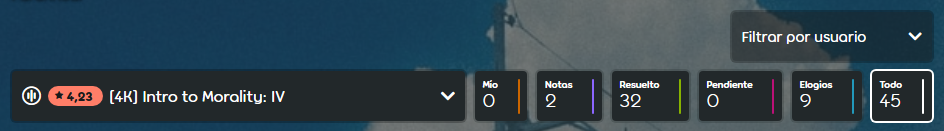
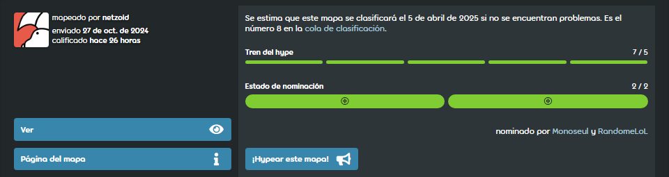

# Guía de modding de osu!mania

*Autor original: ::{ flag=DE }:: [Feerum](https://osu.ppy.sh/users/4815717).*

Esta guía explica cómo modear un [beatmap](/wiki/Beatmap) en [osu!mania](/wiki/Game_mode/osu!mania). El [modding](/wiki/Modding) es un proceso relativamente sencillo, y con la suficiente práctica, puede llevarte a convertirte en un [Beatmap Nominator](/wiki/People/Beatmap_Nominators). Así que, ¡empecemos!

## ¿Por dónde empezar?

*Si ya estás familiarizado con la página de modding y con lo que hace cada botón, puedes pasar directamente a la sección [¡Empecemos a modear!](#¡empecemos-a-modear!).*

Para empezar a modear un mapa, elige un beatmap del [listado de beatmaps pendientes](https://osu.ppy.sh/beatmapsets?m=3&s=pending) o pregunta a cualquier mapper de osu!mania si tiene algo que quiera clasificar, y cuando estés en la página del beatmap, haz clic en `Discusión`. Se abrirá la página de discusión, donde se realiza el proceso de modding.

La página de discusión está llena de botones, que se explican a continuación.

Primero, empecemos con la siguiente fila de botones:

- **\[#K\] *Nombre de la dificultad*:** Esto abre una lista de dificultades para elegir cuál modear. La x representa la cantidad de columnas que tiene el mapa.
- **Mío:** Solo se mostrarán tus mensajes (los del modder).
- **Notas:** Solo se mostrarán las notas que el mapper haya dejado en la página de discusión.
- **Resuelto:** Solo se mostrarán los problemas resueltos.
- **Pendiente:** Solo se mostrarán los asuntos pendientes.
- **Elogios:** Solo se mostrarán los elogios.
- **Todo:** Se mostrará todo.
- **Filtrar por usuario:** Solo se mostrarán los mensajes de un usuario en específico.

Además, hay 3 botones más abajo en la página:

- **¡Hypear este mapa!:** Los hypes se usan como forma de promocionar los mapas y señalar el interés por ver el mapa clasificado. Los hypes son necesarios para que un beatmap pase a estar calificado, ya que antes de que un Beatmap Nominator pueda nominar un beatmap, este debe alcanzar al menos 5 hypes. Cada usuario solo puede hypear un beatmap una vez, y los hypeos se reparten cada 7 días, hasta un máximo de 10 hypeos.
- **Ver/Dejar de ver:** Ver un mapa hará que aparezcan notificaciones cada vez que ocurra algo en la discusión del beatmap. Si ya sigues una discusión de un beatmap, también puedes dejar de seguirla pulsando de nuevo el botón.
- **Página del mapa:** Vuelve a la página de información y resultados del beatmap.

Los Beatmap Nominators y los moderadores tienen botones adicionales, pero no son importantes para este tutorial.

Antes de hacer una publicación, asegúrate de que has seleccionado la pestaña correcta según los cambios que vayas a sugerir. Hay disponibles un total de 3 opciones diferentes:

- **General (Todas las dificultades):** Las publicaciones aquí se mostrarán para todas las dificultades, lo que normalmente se reserva para mencionar cosas que afectan al conjunto completo, como sugerencias de puntos de tiempo o metadatos. Aquí también es posible hypear un beatmap.
- **General (Nombre de la dificultad):** Las publicaciones aquí solo serán visibles en la dificultad seleccionada anteriormente. Las publicaciones aquí reflejan la dificultad completa en lugar de puntos singulares, como comentarios sobre la dificultad completa o problemas en la distribución de las dificultades anteriores/siguientes.
- **Línea de tiempo:** Aquí es donde se produce la mayor parte del modding. Todos los problemas/sugerencias de secciones o notas en la dificultad elegida anteriormente pertenecen aquí. Se requiere copiar/pegar una marca de tiempo del editor a la página de discusión antes de hacer una publicación, para que el mapper sepa qué sección se está discutiendo.

Al escribir algo en el campo de texto de la página de discusión se muestran otros tres botones generales, junto con dos botones situacionales según la sección elegida. Son importantes para determinar la importancia de un problema. A continuación, una breve explicación de cada uno de ellos antes de entrar en más detalles:

### Generales

- **Elogio:** Permite que el modder señale partes del mapa que disfrutó usando una marca de tiempo o toda la dificultad si lo desea.
- **Sugerencia:** Marca la publicación como una sugerencia normal.
- **Informar un problema:** Marca la publicación como un problema.

### Situacionales

- **¡Hype!:** Solo visible en la sección `General (Todas las dificultades)` de la página de discusión. Esto cuesta 1 hype y aumenta el hype del mapa en 1. Un mapa necesita 5 hypes antes de que pueda ser revisado por los Beatmap Nominators.
- **Nota:** Solo visible si eres el propietario del beatmap. Esto dejará notas públicas para que la gente las vea, usadas principalmente para señalar cualquier cosa que parezca extraña, o cualquier plan futuro con el conjunto.

Cuando una publicación se marca como **sugerencia** es para cambios que son subjetivos y no no clasificables. Cambios de patrones, colocación de notas específicas y otros cambios que podrían mejorar el mapa. Esto se usa principalmente si el modder encuentra ciertos patrones incómodos, o encuentra una nota que parece fuera de lugar pero no está seguro.

Cuando una publicación se marca como **problema** es para cambios que son necesarios para la clasificación del beatmap y son objetivamente necesarios para la clasificación. No publiques cambios subjetivos como un problema, solo cuando algo infrinja claramente los criterios de clasificación o sea extremadamente inadecuado, como SV en una sección en la que no ocurre nada que los justifique, notas descolocadas o BPM completamente desincronizado.

Puedes visitar el artículo [discusión de beatmaps](/wiki/Beatmap_discussion) para más detalles.

## ¡Empecemos a modear!

Para empezar a modear, abre la dificultad de un beatmap en el editor. A continuación, elige **la misma** dificultad en el menú desplegable de la página de discusión del beatmap, para asegurarte de que las publicaciones vayan a la dificultad correcta.

**Antes de empezar**: No todos los puntos que se mencionan a continuación tienen que tratarse en cada mod. Si no estás seguro de algo, como los metadatos o la temporización, no lo incluyas. Sin embargo, es bueno practicar para aprender a cubrir todos los puntos que se indican a continuación, ya que es necesario tener experiencia en todos ellos para convertirse en un Beatmap Nominator. Incluso si se cometen errores, se adquiere experiencia y se aprende.

### AiMod

La mejor sugerencia al entrar por primera vez en una dificultad de un beatmap es **comprobar el AiMod**.

Para ello, haz clic en `Archivo` en la esquina superior izquierda de la pantalla y elige `Abrir AiMod`. Como alternativa, presiona `CTRL` + `Mayús` + `A`, que también abre AiMod.

AiMod enumera los problemas con el beatmap en general, así como la dificultad específica abierta. Muestra los problemas en dos categorías. **Advertencia** y **Error**. Aparecerá una advertencia si se trata de un problema menor, algo que puede solucionarse fácilmente. Sin embargo, algunos de ellos no van en contra de los criterios de clasificación y no suponen un problema. Por ejemplo, `Kiai Time is toggled on for less than 15 seconds.` aparecerá de vez en cuando, ya que la sección que cubre el kiai (que suele ser un coro) puede ser inferior a 15 segundos en total, lo que no va en contra de ningún criterio de clasificación. Sin embargo, algunas cosas que aparecen como **advertencia** van en contra de los criterios de clasificación, por ejemplo, las notas no ajustadas.

Recopilar todos los problemas importantes que plantea AiMod en **General (Esta dificultad)** es un buen punto de partida. Si no hay ninguno, sigue adelante.

### Temporización

Después de comprobar AiMod, **comprueba la temporización** del beatmap. Una temporización correcta es obligatoria para que un beatmap se clasifique, y también lo es para la jugabilidad en general.

Para comprobar que un beatmap esté correctamente temporizado, comprueba primero si el BPM es correcto. En la mayoría de los casos no es un problema, pero conviene comprobarlo. La mejor forma de comprobarlo es verificando si los pulsos de la canción coinciden constantemente con una línea de compás blanca y no se adelantan o retrasan. Aumentar el volumen de los hitsounds y reducir la velocidad de reproducción del mapa puede ayudar. Si los pulsos de la canción se adelantan, reduce el BPM; si se retrasan, aumenta el BPM hasta que coincidan.

A continuación, comprueba la compensación. La mayoría de los problemas de temporización se producen al ajustar la compensación. Una compensación incorrecta durante más de 5 ms no se puede clasificar, por lo que es importante asegurarse de que es exacta. Esto se hace asegurándose de que el pulso principal de la canción se alinee exactamente con la línea blanca principal, y aumentando la compensación si la canción se adelanta, o disminuyéndola si se retrasa.

La compensación es la posición de los puntos de tiempo. Debería empezar **siempre** en el primer pulso del mapa. Si no es así, señálalo como un problema en la discusión del beatmap. Sin embargo, hay casos especiales en los que no empieza en el primer pulso. Por ejemplo, puede empezar en el menos, si es necesario para el storyboard.

### Metadatos

**Comprobar los metadatos de un beatmap** es importante para la clasificación de un beatmap, pero a menudo se omite debido a su complejidad. Los metadatos están contenidos en la pestaña `General` de la ventana `Song Setup`, que incluye el título de la canción, el artista, etc.

Normalmente se omite debido al esfuerzo que requiere encontrar **fuentes oficiales** para una prueba de los metadatos, siendo uno de los principales problemas cuando el artista y el título están escritos en un idioma diferente, como japonés, coreano o ruso. Para ello no es necesario entender otros idiomas, siempre y cuando los metadatos sean exactamente los mismos que en la fuente oficial de internet.

Aunque esta parte puede omitirse, puede ser de gran ayuda para el mapper y los BNs si se comprueban los metadatos y se hace una publicación al respecto. Incluso cuando los metadatos ya son correctos, publicar buenas fuentes de confirmación también ayuda.

### Ventana song setup

Mientras estamos en la ventana **Song Setup**, vamos a recorrer las otras pestañas.

En la pestaña **Difficulty**, comprueba si el OD/HP para el beatmap siguen las **pautas oficiales** de los criterios de clasificación. Ten en cuenta que las pautas deben seguirse; de lo contrario, el mapper debe explicar por qué ha elegido algo diferente. ¡Señala un problema si el OD/HP no siguen los criterios de clasificación!

Además de eso, asegúrate de que el HP/OD usado en el beatmap es apropiado para su dificultad/patrones y concuerda con el resto del conjunto. Si el beatmap usa muchas notas largas, la tasa de OD debe mantenerse bastante baja.

Las pestañas de **Audio** y **Colours** no son tan importantes como modder.

Pasando a la pestaña **Design**. Esta pestaña solo es importante si el beatmap tiene un storyboard. Si el mapa lo tiene, asegúrate de que la opción **Widescreen Support** esté marcada. Si el storyboard tiene muchas luces parpadeantes, también es necesario tener activado **Display Epilepsy Warning**, para que cada vez que un usuario juegue el mapa, vea primero esta advertencia.

La última pestaña es **Advanced**. Esta pestaña tampoco es importante como modder.

### Modding para la distribución de dificultades

Lo siguiente en la lista de comprobaciones es la distribución general del beatmap.

Como advertencia: **No uses nunca la calificación por estrellas como un indicador para la distribución**. En la actualidad, es muy imprecisa en osu!mania, ya que solo se centra en la densidad de las notas para calcular la calificación por estrellas, lo que puede hacer que una sección densa dispare el resto de la calificación, a pesar de que la distribución siga encajando en el conjunto.

La mejor forma de empezar a juzgar la distribución de un beatmap es entrando en el editor de una dificultad del beatmap, yendo a `Archivo` en la esquina superior izquierda, luego a `Abrir Dificultad...` y seleccionar `Para Referencia`. En la ventana emergente para seleccionar las dificultades, selecciona la siguiente dificultad en la distribución. Por ejemplo: Si estás revisando un Easy, abre el Normal. Si es Normal, abre el Hard y así sucesivamente. Ahora se muestran dos dificultades en la pantalla, la de la izquierda es la original, y la de la derecha es la seleccionada para el mapa de referencia.

A continuación, se muestra un ejemplo de comparación de dos dificultades en la distribución:

Se está revisando una dificultad **Easy** de un beatmap de 180 BPM. La dificultad Easy consiste principalmente en patrones de 1/1 con patrones de 1/2 de vez en cuando y uso raro de jumps.

En la dificultad **Normal**, hay varios patrones de 1/4 con una longitud de 5 notas. Estos se encuentran alrededor de las partes que se mapearon en un patrón simple de 1/1 en la dificultad Easy.

El salto de 1/1 a 1/4 es bastante alto en varios lugares, lo que no es aceptable para los criterios de distribución. La dificultad aumenta demasiado rápido, ya que es poco probable que un principiante pueda pasar de un patrón de 1/1 a 1/4.

Esto puede señalarse como un problema en la pestaña `General (Esta dificultad)` de la página de discusión del beatmap. En primer lugar, expón el problema (el aumento de dificultad entre Easy y Normal es demasiado pronunciado), luego ofrece al mapper varios ejemplos en el beatmap publicando las marcas de tiempo, explicando que la distribución no es aceptable. Por último, dale una solución al mapper. Ya sea reduciendo o aumentando una de las dificultades, o creando otra dificultad si la diferencia es demasiado grande.

Haz esto con cada dificultad del beatmap, teniendo también en cuenta los criterios de clasificación.

**Nota**: Si el beatmap tiene una duración de más de 5 minutos y aún así tiene varias dificultades mapeadas, no tiene que seguir ninguna regla de distribución. Esto también se indica en los criterios de clasificación generales.

### Modding de los patrones

Ahora, centrémonos en la parte principal de un mapa, las notas y los patrones en sí.

Tener experiencia de juego en osu!mania te dará ventaja para esto. Como mínimo, intenta ser capaz de jugar con éxito a la dificultad que estás modeando, aunque **no es obligatorio**. Los mappers experimentados suelen saber cómo «se sienten» los patrones, por lo que pueden hacer mods sin tener que jugarlos.

Antes de empezar, juega la dificultad al menos una vez para ver qué te resulta incómodo, extraño o si el beatmap tiene algún error. De este modo, el modder puede hacerse una idea general del mapa y de cómo se ha mapeado.

Es importante respetar la idea de los mappers detrás del beatmap. Un modder está ahí para pulirlo y señalar problemas, no para volver a mapear el beatmap.

Si se ha encontrado algún problema al probar el mapa, salta a la parte en el editor y revísalo. Si no estás seguro de dónde estaba, el cliente permite probar una parte del mapa pulsando F5 en un momento determinado.

Luego, analiza qué es exactamente lo que hace que el patrón sea raro de jugar. Algunos ejemplos serían las notas colocadas de forma incómoda, el uso de la mano, los jacks donde no deben estar o el uso excesivo de anchors. Si no estás seguro, intenta mover algunos patrones para eliminar problemas, así como añadir/eliminar notas. Es importante probar siempre las sugerencias.

Una vez descubierto, añade la sugerencia a través de la discusión. Para empezar, copia/pega la marca de tiempo en la nueva sección de la discusión. Hay dos formas de hacerlo. Si no hay notas seleccionadas, al copiar la marca de tiempo presionando `Ctrl` + `C` y luego `Ctrl` + `V` en la página de discusión del beatmap, solo publicará la ubicación de tiempo. Si las notas están seleccionadas, al copiar la marca de tiempo se colocará en la posición de tiempo de la primera nota y mostrará al mapper las notas resaltadas.

Después de añadir el tiempo, añade la sugerencia. En primer lugar, señala lo que está mal, y hazlo brevemente en una frase, como un resumen. Luego, escribe la sugerencia en su totalidad. La mejor manera es anotar cada cambio realizado en comparación con los patrones/notas actuales. Colocar varias marcas de tiempo adicionales puede ayudar a guiar al mapper si las notas se han movido o borrado. A continuación, se ofrece un ejemplo:

> 00:52:299 - Este patrón se siente bastante extraño al jugar, ya que hay una desviación en la mano izquierda, así como un anchor largo. Puedes resolver ese problema moviendo 00:52:459 (52459|0) - esta nota a 3, 00:52:618 (52618|3) - esta a 2 y quizás quitar 00:52:858 (52858|1) - porque causa un jack con el siguiente patrón de mano.

Como se ha visto, el formato seguía la guía anterior: primero se publicaba la marca de tiempo y luego se describía el problema, terminando con una sugerencia sobre cómo solucionarlo.

Continúa haciendo este proceso para todo el mapa. Como se ha mencionado antes, si algo es claramente no clasificable, publícalo como un problema en lugar de una sugerencia para que el mapper vea que tiene que arreglarlo. Si se sugiere un cambio de patrones para varias partes, como se muestra arriba, hazlo como una sugerencia.

Cuando plantees un problema/sugerencia para una sección más amplia del beatmap, usa dos marcas de tiempo, una para empezar y otra para terminar, y luego describe el problema en esta sección, terminando con una sugerencia sobre cómo resolverlo. Un ejemplo sería:

> 00:53:416 - a 00:58:682 - El uso de la 1ra columna aquí provoca demasiados anchors, lo cual es bastante incómodo de jugar junto a las notas de la 2da columna. Sugiero mover cada dos notas (00:53:691 -, 00:53:966 -, 00:54:241 -, etc.) a una columna diferente para aliviar el efecto de desviación a la izquierda en el mapa.

Hay muchas maneras de modear un beatmap. Cuanta más práctica se tenga, más experiencia se gana y los estilos empiezan a formarse con la familiaridad.

### Modding de los hitsounds

Otra parte importante de los beatmaps son los hitsounds. Si el beatmap no tiene hitsounds y el mapper aún planea añadirlos, la mejor sugerencia es darles un recordatorio amistoso de que son necesarios para clasificar un beatmap.

Si el beatmap tiene hitsounds, no dudes en modearlos. Lo primero que hay que hacer es hacerse una idea general de la idea que tienen los mappers sobre cómo debe ser el beatmap. osu!mania tiene una ventaja sobre otros modos de juego, ya que los tipos de hitsounds se pueden mostrar en las notas. Para ello, ve a `Ver` en la esquina superior izquierda y elige `Mostrar nombre de muestra de audio`. Ahora todas las muestras usadas aparecerán en las notas.

Luego, **comprueba si los hitsounds son suficientemente audibles**. Los beatmaps que tienen una dificultad Hard o inferior en su distribución deben tener hitsounds audibles. Si la distribución contiene solo dificultades Insane o superiores, entonces está bien que contenga solo los hitsounds predeterminados. Lo ideal es tener el mismo volumen en la música y en los efectos en los ajustes generales de volumen. Luego, escucha la dificultad a velocidad de reproducción normal y comprueba si se oyen los hitsounds. Si no es así, plantea un problema en la sección `General (Esta dificultad)` e informa al mapper. Además, busca el volumen correcto para el mapper y añádelo a la sugerencia. La forma más sencilla de hacerlo es yendo a Timing y pulsando el panel de configuración de la temporización (o presionando `F6`), y seleccionando la marca de tiempo que es la primera por detrás del punto de tiempo actual (por ejemplo, seleccionando 00:43:392, si el sonido está en silencio en 00:43:495). Desde aquí, ve a Audio, y ajusta el volumen hasta que los hitsounds sean lo suficientemente audibles, y sugiere el nuevo valor al mapper.

Después, revisa el mapa y **busca incoherencias en los hitsounds.** Comprueba si hay algún patrón que tenga un hitsound incorrecto o que falte. Si es así, ¡ponlo como una sugerencia! No asumas que el mapper no lo omitió intencionalmente, por lo que el punto debería publicarse como una sugerencia, no como un problema. En general, los pequeños errores de hitsounds tampoco son no clasificables. Para plantear problemas, copia la marca de tiempo con la nota y dile al mapper qué es lo que está mal, igual que en el modding de los patrones. Primero, publica la marca de tiempo, luego señala el problema y una sugerencia sobre cómo solucionarlo.

Si la dificultad tiene muchos problemas de hitsounds, ¡**no los señales todos**! Haz una publicación más grande y general como problema en la misma sección y dile al mapper que revise una vez más sus hitsounds. De preferencia, señala 2-3 marcas de tiempo para mostrar dónde se produce el problema y diles que el mismo problema vuelve a aparecer más adelante.

## Consejos

- **¡No hagas exclusivamente sugerencias de mover, añadir o eliminar!**
  - Estas sugerencias no son necesariamente malas. También pueden ayudar a mejorar un conjunto. Pero nunca deben constituir la mayoría de un mod. Intenta encontrar una buena mezcla de sugerencias de mover/añadir/eliminar y otras sugerencias. Hacer solo sugerencias del tipo «mover a X», «añadir aquí» y «eliminar» hace que el modder parezca poco profesional y desinteresado. Esto es especialmente importante de evitar cuando se aspira a convertirse en un Beatmap Nominator.
- **¡Modea diferentes modos de teclas!**
  - Muchos modders empiezan con 4K porque es el modo más jugado y la mayoría de beatmaps son para 4K, pero también hay mappers para 5K, 6K, 7K, 8K y 9K, y a menudo tienen problemas para encontrar modders. También puede suponer una ventaja a la hora de presentarse como candidato para Beatmap Nominator en el futuro. Hay mucha demanda de modders para los modos de teclas más altos.
- **¡Mira cómo modean los demás!**
  - El modding puede adaptarse y mejorarse a partir del estilo de mods de otras personas. Entra en la página de discusión de algunos beatmaps recientemente clasificados y échales un vistazo, especialmente a los mods de los Beatmap Nominators. Suelen tener mucha experiencia en el modding y pueden ayudar a comprender mejor el formato y el estilo.
- **Uso del editor (funciones que no todo el mundo conoce)**
  - **Abrir como referencia**: Abre una segunda dificultad para compararla con la actual. Para acceder a esta función, haz clic en `Archivo` -> `Abrir dificultad...` -> `Para referencia`, luego haz clic en la dificultad que quieras comparar.
  - **Mostrar el nombre de las muestras de audio**: Muestra los nombres de los hitsounds en las notas. Para acceder a esta función, haz clic en `Ver` > `Mostrar nombre de muestra de audio`. Muestra las muestras W/F/C predeterminadas y los nombres de las muestras personalizadas. Funciona también con la dificultad de referencia.

## Enlaces útiles

- **[Criterios de clasificación generales](/wiki/Ranking_criteria)**
- **[Criterios de clasificación de osu!mania](/wiki/Ranking_criteria/osu!mania)**
- **[Mapset Verifier de Naxess (herramienta de modding)](https://github.com/Naxesss/MapsetVerifier)**
- **[Curso intensivo de SV de Evening](https://github.com/Eve-ning/SV-Crash-Course-LaTeX/blob/master/builds/11082018.pdf)**
