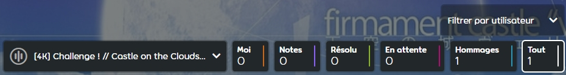
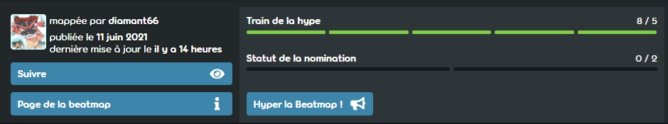

# Guide de modding d'osu!mania

*Auteur original : ::{ flag=DE }:: [Feerum](https://osu.ppy.sh/users/4815717).*

Ce guide explique comment modifier une [beatmap](/wiki/Beatmap) dans [osu!mania](/wiki/Game_mode/osu!mania). Le [modding](/wiki/Modding) est un processus relativement simple, et avec suffisamment de pratique, il peut vous amener à devenir un [Beatmap Nominator](/wiki/People/Beatmap_Nominators). Alors, c'est parti !

## Par où commencer (modification de la mise en page)

*Si vous êtes familiarisé avec la mise en page de la page de modding et avec la fonction de chaque bouton, passez directement à la section [Commençons à modder !](#commençons-à-modder-!)*

Pour commencer à modder une beatmap, choisissez une beatmap dans la [liste des beatmaps en attente](https://osu.ppy.sh/beatmapsets?m=3&s=pending) ou demandez à n'importe quel mappeur osu!mania s'il a quelque chose à classer, et lorsque vous êtes sur la page Beatmap, cliquez sur Discussion. Cela ouvrira la page de discussion, où le modding a lieu.

La page de discussion est remplie de nombreux boutons, qui sont tous expliqués ci-dessous :

Commençons par la rangée de boutons suivante :

- **\[#K\] *Nom de la difficulté* :** Cela ouvre une liste de difficultés à choisir pour le modding. Le x représente le nombre de colonnes de la beatmap.
- **Moi :** Seuls vos messages (ceux du moddeur) seront affichés.
- **Notes :** Seules les notes laissées par le mappeur sur la page de discussion seront affichées.
- **Résolu :** Seuls les problèmes résolus seront affichés.
- **En attente :** Seules les questions en suspens seront affichées.
- **Hommages :** Seules les félicitations seront affichées.
- **Tout :** Tout sera affiché.
- **Filtrer par utilisateur :** Seuls les messages d'un utilisateur spécifique seront affichés.

En outre, il y a 3 boutons plus bas sur la page :

- **Train de la hype :** Les hypes sont utilisés comme un moyen de promouvoir les beatmaps et de signaler l'intérêt de voir la beatmap classée. Les hypes sont nécessaires pour qu'une beatmap soit qualifiée. En effet, pour qu'un Beatmap Nominator puisse nommer une beatmap, celle-ci doit atteindre au moins 5 hypes. Chaque utilisateur ne peut mettre en avant une beatmap qu'une seule fois, et les hypes sont distribués tous les 7 jours, jusqu'à un maximum de 10 hype.
- **Suivre/Ne plus suivre :** En suivant une beatmap, des notifications apparaîtront chaque fois que quelque chose se passe dans la discussion sur la beatmap. Si vous suivez déjà une discussion sur la beatmap, vous pouvez également l'annuler en cliquant à nouveau sur le bouton.
- **Page de la beatmap :** Retourne à la page des informations et des scores de la beatmap.

Les Beatmap Nominators/Moderators disposent de boutons supplémentaires, mais ceux-ci ne sont pas importants pour ce tutoriel.

Avant de poster, assurez-vous que le bon onglet est sélectionné en fonction des modifications qui vont être suggérées. Au total, 3 options différentes sont disponibles :

- **Général (Toutes les difficultés) :** Les messages postés ici seront affichés pour toutes les difficultés, ce qui est généralement réservé pour mentionner des choses qui affectent toutes les difficultés, comme des suggestions de points de synchronisation ou des métadonnées. La promotion d'une beatmap se fait également ici.
- **Général (Cette difficulté) :** Les messages affichés ici ne seront visibles que dans la difficulté définie ci-dessus. Les messages postés ici reflètent l'ensemble de la difficulté au lieu de points particuliers, tels que des commentaires sur l'ensemble de la difficulté ou des problèmes de spread avec les difficultés précédentes/suivantes.
- **Chronologie :** C'est ici que se fait l'essentiel du modding. Tous les problèmes/suggestions pour les sections ou les notes dans la difficulté choisie ci-dessus se trouvent ici. Il est nécessaire de copier/coller un horodatage depuis l'éditeur vers la page de discussion avant de poster un message, afin que le mappeur sache de quelle section il s'agit.

Si vous écrivez quelque chose dans le champ de texte de la page de discussion sur le modding, trois autres boutons généraux apparaissent, ainsi que deux boutons situationnels en fonction de la section choisie. Ces boutons sont importants pour déterminer l'importance d'un problème. Voici une explication rapide de chacun d'entre eux avant d'entrer dans les détails ci-dessous :

### Général

- **Compliment :** Permet au moddeur d'indiquer les parties de la beatmap qu'il a appréciées à l'aide d'un horodatage ou la difficulté entière s'il le souhaite.
- **Suggestion :** Marque un message comme une suggestion normale.
- **Problème :** Marque un message comme étant un problème.

### Situationnel

- **Hype! :** Visible uniquement dans la section Général (toutes difficultés) de la page de discussion du modding. Cela coûte 1 hype et augmente la hype de la beatmap de 1. Une beatmap doit avoir 5 hype avant de pouvoir être vérifiée par les Beatmap Nominators.
- **Note :** Seulement visible si vous êtes le propriétaire de la beatmap. Ceci laissera des notes publiques pour que les gens puissent les voir, principalement utilisées pour signaler tout ce qui semble étrange, ou tout plan futur avec la beatmap.

Lorsqu'un message est marqué comme une **suggestion**, c'est pour des changements qui sont subjectifs et qui ne sont pas impossibles à classer. Des changements de patterns, des placements de notes spécifiques, et d'autres changements qui pourraient améliorer la beatmap. Ceci est principalement utilisé si le moddeur trouve certains patterns inconfortables, ou trouve une note mal placée mais n'est pas sûr.

Lorsqu'un message est marqué comme un **problème**, c'est pour des changements qui sont nécessaires pour le classement de la beatmap et qui sont objectivement nécessaires pour le classement. Ne postez pas de changements subjectifs en tant que problème, seulement lorsque quelque chose viole clairement les critères de classement ou est extrêmement inadapté, comme des SV sur une section où rien ne se passe qui pourrait les justifier, des notes unsnapped, ou un BPM complètement faux.

Vous pouvez consulter l'article [discussions de la beatmap](/wiki/Beatmap_discussion) pour plus de détails.

## Commençons à modder !

Pour commencer à modder, ouvrez la difficulté d'une beatmap dans l'éditeur. Choisissez ensuite **la même** difficulté dans le menu déroulant de la page de discussion de la beatmap, pour être sûr que les messages vont vers la bonne difficulté.

**Avant de commencer** : Tous les points évoqués ci-dessous ne doivent pas nécessairement être couverts dans chaque mod. Si vous n'êtes pas sûr de quelque chose, comme les métadonnées ou le timing, laissez-le de côté. Cependant, il est bon de s'entraîner pour apprendre à couvrir tous les points ci-dessous, car il est nécessaire d'avoir de l'expérience dans tous les domaines pour devenir un Beatmap Nominator. Même si des erreurs sont commises, cela permet d'acquérir de l'expérience et d'apprendre.

### AiMod

La meilleure suggestion lorsque vous entrez dans une difficulté de beatmap pour la première fois est de **vérifier AiMod**.

Cela peut être fait en appuyant sur `Fichier` dans le coin supérieur gauche de l'écran et en choisissant `Ouvrir AiMod`. Vous pouvez aussi simplement appuyer sur CTRL+Shift+A, ce qui ouvre également AiMod.

AiMod répertorie les problèmes liés aux beatmaps dans son ensemble ainsi qu'à la difficulté spécifique ouverte. Il affiche les problèmes dans deux catégories. **Avertissement** et **Erreur**. Un avertissement sera affiché s'il s'agit d'un problème mineur, quelque chose qui peut être facilement corrigé. Cependant, certains d'entre eux ne vont pas à l'encontre des critères de classement et ne constituent pas un problème. Par exemple, `Le temps de kiai est activé pendant moins de 15 secondes` s'affichera occasionnellement car la section couverte par le kiai (qui est généralement un refrain) peut durer moins de 15 secondes, ce qui n'est pas contraire aux critères de classement. Certaines choses qui apparaissent comme un **avertissement** sont cependant contraires aux critères de classement, par exemple, les notes unsnapped.

Rassembler toutes les questions importantes soulevées par AiMod dans un post **Général (cette difficulté)** est un bon point de départ. S'il n'y en a pas, passez à autre chose.

### Timing

Après avoir vérifié AiMod, **vérifier le  timing** d'une beatmap . Un timing correct est obligatoire pour qu'une beatmap soit classée, ainsi que pour des raisons de jouabilité générale.

Pour vérifier qu'une beatmap est correctement timée, il faut d'abord vérifier si le BPM est correct. La plupart du temps, ce n'est pas un problème, mais il est bon de le vérifier quand même. La meilleure façon de le faire est de vérifier si les battements de la musique se posent sur une ligne de battement blanche de façon constante et ne divergent pas en avance ou en retard. Augmenter le volume du hitsound et régler la vitesse de lecture de la beatmap plus lentement peut aider. Si les temps de la musique divergent en avance, diminuez le bpm, dans le cas contraire, augmentez le bpm jusqu'à ce qu'ils correspondent.

Ensuite, vérifiez le décalage. La plupart des problèmes de timing surviennent lors du réglage de l'offset. Un décalage erroné de plus de 5 ms est impossible à classer, il est donc important de s'assurer qu'il est précis. Pour ce faire, assurez-vous que le temps principal de la musique s'aligne exactement sur la ligne blanche principale. Augmentez le décalage si la musique est en avance, et diminuez-le si elle est en retard.

Le décalage est la position des points de synchronisation. Il devrait **toujours** commencer sur le tout premier temps de la beatmap. Si ce n'est pas le cas, signalez le problème dans la discussion sur la beatmap. Cependant, il existe des cas particuliers où il ne commence pas au tout premier temps, par exemple il peut commencer dans le moins, si cela est nécessaire pour le storyboard.

### Métadonnées

**La vérification des métadonnées de la beatmap** est importante pour le classement de la beatmap, mais comme il s'agit d'une tache ardue, elle est souvent omise. Les métadonnées sont contenues dans l'onglet `General` de la fenêtre `Song Setup`, qui inclut le titre de la musique, l'artiste, etc.

Elle est généralement ignorée en raison de l'effort requis pour trouver des sources **officielles** pour une preuve des métadonnées, l'un des principaux problèmes étant lorsque l'artiste et le titre sont écrits dans une langue différente, comme le japonais, le coréen ou le russe. Il n'est pas nécessaire de comprendre d'autres langues pour cela, il suffit que les métadonnées soient exactement les mêmes que dans la source officielle sur Internet.

Bien que cette partie puisse être ignorée, la vérification des métadonnées et la publication d'un message à ce sujet peuvent être d'une grande aide pour le mappeur et les BN. Même si les métadonnées sont déjà correctes, il est également utile d'indiquer les bonnes sources pour confirmation.

Si vous n'êtes pas sûr d'une source légitime de métadonnées, le [serveur discord Metadata Heap](https://discord.gg/9Y4EdyM) est ouvert pour de telles questions.

### Song setup

Tout en restant dans l'écran **Song Setup**, passons en revue les autres onglets.

Sur la page **Difficulty**, vérifiez si l'OD/HP de la beatmap suivent les **directives officielles** des critères de classement. Gardez à l'esprit que les directives doivent être suivies ou le mappeur doit expliquer pourquoi il a choisi quelque chose de différent. Signalez un problème si l'OD/HP ne suit pas les critères de classement !

En plus de cela, assurez-vous que les HP/OD utilisés dans la beatmap sont appropriés à sa difficulté/son pattern et correspondent au reste du set. Si la beatmap utilise beaucoup de notes longues par exemple, l'OD doit être maintenu assez bas.

Les pages **Audio** et **Colours** ne sont pas si importantes pour un moddeur.

Passons à **Design**. Ceci n'est important que si la beatmap a un storyboard. Si elle en a un, assurez-vous que la case **Widescreen Support** est cochée. Si le storyboard comporte de nombreuses lumières clignotantes, il est également nécessaire d'activer l'option **Display Epilepsy Warning**, de sorte qu'à chaque fois que la beatmap est jouée par un utilisateur, celui-ci voit d'abord cet avertissement.

La dernière page est la **Advanced Section**. Celle-ci n'est pas non plus importante en tant que moddeur.

### Modding d'un spread

Le prochain point à vérifier est le spread global de la beatmap.

En guise d'avertissement : **N'utilisez jamais le star rating comme mesure de spread**. Il est actuellement très imprécis dans osu!mania car il ne se concentre que sur la densité des notes pour calculer le star rating, ce qui peut faire qu'une section dense fasse grimper en flèche le reste du classement, malgré le fait que l'écart soit toujours correct dans l'ensemble du set.

Pour continuer, la meilleure façon de commencer à juger le spread d'une beatmap est d'aller dans l'éditeur d'une difficulté de la beatmap, puis d'aller dans `Fichier` dans le coin supérieur gauche, dans `Ouvrir la difficulté...` et de sélectionner `Pour référence`. Dans la fenêtre pop-up de sélection de difficulté, sélectionnez la difficulté suivante dans le spread. par exemple : Si vous vérifiez un Easy, ouvrez le Normal. Si c'est un Normal, ouvrez le Hard et ainsi de suite. Maintenant deux difficultés sont affichées à l'écran, celle de gauche étant l'originale, et celle de droite étant la beatmap sélectionnée pour référence.

Vous trouverez ci-dessous un exemple de comparaison de deux difficultés spread :

Une difficulté **difficulté Easy** d'une beatmap de 180 BPM est en cours de vérification. La difficulté Easy consiste principalement en des patterns 1/1 avec des patterns 1/2 occasionnels et une utilisation rare des jumps.

Dans la **difficulté Normal**, il y a plusieurs patterns 1/4 avec une longueur de 5 notes. Ceux-ci sont repérés autour des parties qui ont été mappées en pattern simple 1/1 dans la difficulté Easy.

Le jump de 1/1 à 1/4 est assez élevé à plusieurs endroits, ce qui n'est pas acceptable selon les critères de spread. La difficulté augmente beaucoup trop rapidement, car il est peu probable qu'un débutant soit capable de passer d'un pattern 1/1 à 1/4.

Cela peut être signalé comme un problème dans l'onglet `Général (cette difficulté)` de la page de discussion de la beatmap. Tout d'abord, énoncez le problème (l'augmentation de la difficulté entre Easy et Normal est trop forte), puis donnez au mappeur plusieurs exemples dans la beatmap en postant les horodatages, en expliquant que l'écart n'est pas acceptable. Enfin, donnez au mappeur une solution. Soit en réduisant ou en augmentant une des difficultés, soit en créant une autre difficulté si l'écart est trop important.

Faites-le pour chaque difficulté de la beatmap, en tenant également compte des critères de classement.

**Note** : Si la beatmap a une durée de plus de 5 minutes et qu'il présente encore plusieurs difficultés, il ne doit pas suivre de règles de spread. Ceci est également indiqué dans les critères généraux de classement.

### Modding des Patterns

Maintenant, concentrons-nous sur la partie principale d'une beatmap, les notes et les patterns eux-mêmes.

Avoir une expérience de jeu dans osu!mania donnera un avantage pour cela. Au minimum, essayez d'être capable de jouer avec succès la difficulté à modder, cependant **ce n'est pas obligatoire** ! Les mappeurs expérimentés savent souvent comment les patterns se "sentent", et peuvent donc les modder sans être en mesure de les jouer.

Avant de commencer, jouez la difficulté au moins une fois pour voir ce qui vous semble inconfortable, bizarre ou si la beatmap comporte des erreurs. Cela permet également au moddeur d'avoir un aperçu de la beatmap et de la façon dont le mappeur s'y est pris pour la mapper.

Il est important de respecter l'idée du mappeur derrière la beatmap. Un moddeur est là pour la peaufiner et signaler les problèmes, pas pour refaire la beatmap.

Si un problème a été découvert lors du test de la beatmap, passez à la partie concernée dans l'éditeur et vérifiez-la. Si vous n'êtes pas sûr de l'endroit où se trouve le problème, le client permet de tester une seule partie de la beatmap en appuyant sur F5 à un moment donné.

Ensuite, analysez ce qui rend le pattern bizarre à jouer. Par exemple, des notes mal placées, un hand bias, des jacks là où il ne faut pas, ou une utilisation excessive des anchors. Si vous n'êtes pas sûr, essayez de déplacer certains pattern pour éliminer les problèmes, ainsi que d'ajouter/supprimer des notes. Il est important de toujours tester les suggestions de jeu.

Une fois la solution trouvée, ajoutez la suggestion via la discussion de modding. Pour commencer, copiez/collez l'horodatage dans la nouvelle section de discussion. Il y a deux façons de procéder. Si aucune note n'est sélectionnée, copier l'horodatage en appuyant sur Ctrl-C puis Ctrl-V sur la page de discussion de la beatmap affichera uniquement l'emplacement temporel. Si des notes sont sélectionnées, la copie de l'horodatage affichera l'emplacement temporel de la première note et montrera au mappeur les notes mises en évidence.

Après avoir ajouté le timing, ajoutez la suggestion. Tout d'abord, indiquez ce qui ne va pas, et faites-le en une seule phrase, comme un résumé. Ensuite, écrivez la suggestion dans son intégralité. Le mieux est de noter chaque changement apporté par rapport aux patterns/notes actuels. L'affichage de plusieurs horodatages supplémentaires peut aider à guider le mappeur si des notes ont été déplacées ou supprimées. Un exemple est fourni ci-dessous :

> 00:52:299 - Ces patterns sont assez bizarres à jouer car il y a un bias à la main gauche, ainsi qu'une longue anchor. Vous pouvez résoudre ce problème en déplaçant 00:52:459 (52459|0) - cette note vers 3, 00:52:618 (52618|3) - celle-ci vers 2 et peut-être en supprimant 00:52:858 (52858|1) - parce qu'elle provoque un jack avec le pattern de la main suivante.

Comme on peut le voir, le format a suivi le guide ci-dessus en affichant d'abord l'horodatage, puis en décrivant le problème et en terminant par une suggestion sur la façon de le résoudre.

Continuez à faire ce processus pour toute la beatmap. Comme mentionné précédemment, si quelque chose est clairement impossible à classer, postez-le comme un problème plutôt que comme une suggestion afin que le mappeur voie qu'il doit le corriger. Si vous suggérez des changements de patterns pour plusieurs parties comme indiqué ci-dessus, faites-le comme une suggestion.

Lorsque vous donnez un problème/suggestion concernant une section plus large de la beatmap, utilisez deux horodatages, un pour le début et un pour la fin, puis décrivez le problème dans cette section, en terminant par une suggestion sur la façon de le résoudre. Un exemple serait le suivant :

> 00:53:416 - jusqu'à 00:58:682 - L'utilisation de la 1ère colonne ici provoque trop d'anchor, ce qui est vraiment gênant pour jouer avec les notes de la 2ème colonne. Je suggérerais de déplacer une note sur deux (00:53:691 - , 00:53:966 - , 00:54:241 - , etc.) dans une autre colonne afin d'atténuer le bias de la main gauche dans la beatmap.

Il existe de nombreuses façons de modder une beatmap. Plus on s'exerce, plus on acquiert de l'expérience et les styles commencent à se former avec la familiarité.

### Modding des hitsounds

Une autre partie importante des beatmaps sont les hitsounds. Si la beatmap n'a pas de hitsounds et que le mappeur prévoit toujours d'en ajouter, la meilleure suggestion est de leur rappeler amicalement qu'ils sont nécessaires pour classer une beatmap.

Si la beatmap a des hitsounds, n'hésitez pas à les modifier. La première chose à faire est d'avoir une vue d'ensemble de l'idée du mappeur sur la façon dont la beatmap devrait être hitsoundée. osu!mania a un avantage sur les autres modes de jeu car les types de hitsounds peuvent être affichés sur les notes. Pour ce faire, allez dans `Visualiser` dans le coin supérieur gauche et choisissez ensuite `Montrer le nom de l'échantillon`. Maintenant, tous les échantillons utilisés sont affichés sur les notes.

Ensuite, **vérifiez si les hitsounds sont suffisamment audibles**. Les beatmaps dont la difficulté est Hard ou inférieure doivent avoir des hitsounds audibles. Si le spread ne contient que des difficultés Insane ou supérieures, il est possible de n'y trouver que le son d'impact par défaut. Idéalement, réglez le même volume sur Musique que sur Effet dans les paramètres généraux de volume. Ensuite, écoutez la difficulté à un taux de lecture normal et voyez si les hitsounds sont audibles. Si ce n'est pas le cas, signalez un problème dans la section `Général (cette difficulté)` et informez le mappeur. De plus, trouvez le volume correct pour le mappeur et ajoutez-le à la suggestion. La façon la plus simple de le faire est d'aller dans Timing et d'appuyer sur le panneau de configuration de Timing (ou d'appuyer sur F6), et de sélectionner l'horodatage qui est le premier derrière le point de chronométrage actuel (par exemple, sélectionnez 00:43:392, si le son est calme à 00:43:495). A partir de là, allez dans Audio, et ajustez le volume jusqu'à ce que les sons soient suffisamment audibles, et proposez la nouvelle valeur au mappeur.

Ensuite, parcourez la beatmap et **recherchez les incohérences de hitsound.** Voyez s'il y a des patterns qui ont un hitsound incorrect ou manquant. Si c'est le cas, postez-le comme suggestion ! Ne supposez pas que le mappeur ne l'a pas laissé intentionnellement, c'est pourquoi le point doit être posté comme une suggestion, pas un problème. Les petites erreurs de sons ne sont pas non plus unrankable en général. Pour soulever des problèmes, copiez l'horodatage avec la note et dites au mappeur ce qui ne va pas, tout comme le modding des patterns. D'abord, postez l'horodatage, puis indiquez le problème et une suggestion sur la façon de le résoudre.

Si la difficulté a beaucoup de problèmes de hitsound, **ne les signalez pas tous** ! Faites un post plus important et général comme un problème dans la même section et dites au mappeur de regarder une fois de plus ses hitsounds. De préférence, indiquez 2 ou 3 horodatages pour montrer où se situe le problème et dites-lui que le même problème réapparaît plus tard.

## Conseils

- **Ne faites pas exclusivement des suggestions de déplacement, d'ajout ou de suppression !**
  - Ces suggestions ne sont pas nécessairement mauvaises. Elles peuvent également contribuer à améliorer une beatmap. Mais elles ne devraient jamais constituer la majorité d'un mod. Essayez de trouver un bon mélange de suggestions de déplacement/ajout/suppression et d'autres suggestions. Si vous ne faites que des suggestions de type "déplacer vers X", "ajouter ici" et "supprimer", le moddeur apparaîtra comme non professionnel et désintéressé. Il est particulièrement important d'éviter cela lorsque l'on vise le rôle de Beatmap Nominator.
- **Modder différents keys**
  - Beaucoup de moddeurs commencent par le 4K parce que c'est le mode de keys le plus joué et que la plupart des beatmaps sont pour le 4K, mais il y a aussi des mappeurs pour le 5K, 6K, 7K, 8K et 9K, et ils ont souvent du mal à trouver des moddeurs. Cela peut aussi donner un avantage pour devenir un Beatmap Nominator à l'avenir. Les moddeurs pour les modes de keys plus élevés sont très demandés.
- **Regardez comment les autres moddent !**
  - Le modding peut être adapté et amélioré à partir du style de mods d'autres personnes. Allez dans la page de discussion de certaines beatmaps récemment classés et regardez-les, en particulier les mods des Beatmap Nominators. Ils sont généralement très expérimentés en matière de modding et peuvent vous aider à mieux comprendre le formatage et le style.
- **Utilisation de l'éditeur (fonctions que tout le monde ne connaît pas forcément)**
  - **Ouvrir pour référence** : Ouvre une deuxième difficulté à comparer avec la difficulté actuelle. Cette fonction est accessible en cliquant sur "Fichier -> Ouvrir une difficulté -> Pour référence", puis en cliquant sur la difficulté à comparer.
  - **Afficher le nom de l'échantillon** : Affiche les noms de hitsound sur les notes. Cette fonction est accessible en cliquant sur `Affichage` > `Afficher le nom de l'échantillon`. Cela montre les échantillons W/F/C par défaut et les noms d'échantillons personnalisés. Fonctionne également avec la difficulté de référence.

## Liens utiles

- **[Critères généraux de classement](/wiki/Ranking_criteria)**
- **[Critères de classement d'osu!mania](/wiki/Ranking_criteria/osu!mania)**
- **[Naxess' Mapset Verifier (outil de modding)](https://github.com/Naxesss/MapsetVerifier)**
- **[Evening's SV Crash Course](https://github.com/Eve-ning/SV-Crash-Course-LaTeX/blob/master/builds/11082018.pdf)**
