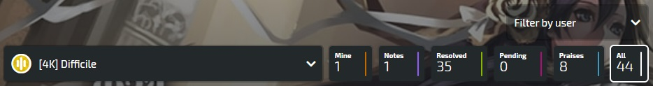
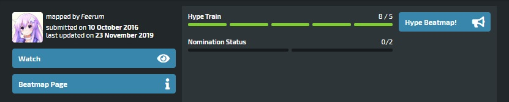

# คู่มือการ Mod แผนที่ osu!mania (osu!mania modding guide)

*ผู้เขียนต้นฉบับ: ::{ flag=DE }:: [Feerum](https://osu.ppy.sh/users/4815717).*

คู่มือนี้จะแนะนำวิธีการ mod [บีทแมพ (beatmap)](/wiki/Beatmap) ใน [osu!mania](/wiki/Game_mode/osu!mania) การ [Modding](/wiki/Modding) เป็นกระบวนการที่ค่อนข้างง่าย และด้วยการฝึกฝนที่มากพอ มันสามารถนำคุณไปสู่การเป็น [Beatmap Nominator](/wiki/People/Beatmap_Nominators) ได้ ดังนั้นเรามาเริ่มกันเลย!

## เริ่มต้นที่ไหน (โครงสร้างหน้าการ mod) (Where to start (modding page layout))

*หากคุณคุ้นเคยกับโครงสร้างหน้าการ mod และหน้าที่ของแต่ละปุ่มแล้ว โปรดข้ามไปยังส่วน [เริ่มทำการ mod กันเลย!](#let's-start-modding!).*

ในการเริ่ม mod แผนที่ ให้เลือกบีทแมพจาก [รายการบีทแมพที่รอการตรวจสอบ (pending beatmap listing)](https://osu.ppy.sh/beatmapsets?m=3&s=pending) หรือถาม mapper ของ osu!mania คนไหนก็ได้ว่าพวกเขามีอะไรที่อยากจะ rank หรือไม่ และเมื่ออยู่ในหน้า Beatmap ให้กดที่ Discussion สิ่งนี้จะเปิดหน้า Discussion ซึ่งเป็นที่ที่การ mod เกิดขึ้น

หน้า discussion เต็มไปด้วยปุ่มมากมาย ซึ่งทั้งหมดถูกอธิบายไว้ด้านล่างนี้:

อันดับแรก เริ่มจากแถวของปุ่มต่อไปนี้:

- **[#K] *Difficulty name*:** สิ่งนี้จะเปิดรายการระดับความยากให้เลือกเพื่อทำการ mod ตัว x แทนจำนวนคอลัมน์ที่แผนที่มี
- **Mine:** เฉพาะโพสต์ของคุณ (modder) เท่านั้นที่จะถูกแสดง
- **Notes:** เฉพาะบันทึกที่ mapper ทิ้งไว้ในหน้า discussion เท่านั้นที่จะถูกแสดง
- **Resolved:** เฉพาะประเด็นที่ได้รับการแก้ไขแล้วเท่านั้นที่จะถูกแสดง
- **Pending:** เฉพาะประเด็นที่ยังค้างอยู่เท่านั้นที่จะถูกแสดง
- **Praises:** เฉพาะคำชมเท่านั้นที่จะถูกแสดง
- **All:** ทุกอย่างจะถูกแสดง
- **Filter by user:** เฉพาะโพสต์โดยผู้ใช้เฉพาะรายเท่านั้นที่จะถูกแสดง

นอกจากนี้ ยังมีปุ่มอีก 3 ปุ่มที่อยู่ถัดลงมาในหน้า:

- **Hype Beatmap:** Hypes ถูกใช้เป็นวิธีในการโปรโมทแผนที่และส่งสัญญาณความสนใจที่จะเห็นแผนที่ได้รับการ ranked ค่า Hypes จำเป็นสำหรับการเลื่อนบีทแมพเข้าสู่ช่วง qualified เนื่องจากก่อนที่ Beatmap Nominator จะสามารถ nominate บีทแมพได้ มันต้องได้รับอย่างน้อย 5 Hype ผู้ใช้แต่ละคนสามารถ hype บีทแมพได้เพียงครั้งเดียว และสิทธิ์ hype จะถูกมอบให้ทุกๆ 7 วัน สูงสุดไม่เกิน 10 hype
- **Watch/Unwatch:** การติดตาม (Watching) แผนที่จะทำให้มีการแจ้งเตือนปรากฏขึ้นเมื่อมีอะไรเกิดขึ้นในการสนทนาของบีทแมพ หากคุณติดตามการสนทนาของบีทแมพอยู่แล้ว คุณยังสามารถเลิกติดตามได้โดยการคลิกที่ปุ่มอีกครั้ง
- **Beatmap Page:** กลับไปยัง [หน้าข้อมูลบีทแมพ (beatmap information page)](/wiki/Beatmap_information)

Beatmap Nominators/Moderators จะได้รับปุ่มเพิ่มเติม แต่สิ่งเหล่านี้ไม่สำคัญสำหรับบทเรียนนี้

ก่อนที่จะโพสต์ ตรวจสอบให้แน่ใจว่าได้เลือกแท็บที่ถูกต้องตามการเปลี่ยนแปลงที่จะถูกเสนอ มีตัวเลือกทั้งหมด 3 แบบที่แตกต่างกัน:

- **General (All difficulties):** โพสต์ที่นี่จะถูกแสดงสำหรับทุกระดับความยาก ซึ่งมักจะสงวนไว้สำหรับการกล่าวถึงสิ่งที่มีผลต่อ mapset ทั้งหมด เช่น ข้อเสนอแนะเรื่อง timing point หรือ metadata การ hype บีทแมพก็เกิดขึ้นที่นี่เช่นกัน
- **General (This difficulty):** โพสต์ที่นี่จะมองเห็นได้เฉพาะในระดับความยากที่ตั้งไว้ด้านบนเท่านั้น โพสต์ที่นี่สะท้อนถึงระดับความยากทั้งหมดแทนที่จะเป็นจุดเดี่ยวๆ เช่น คำติชมเกี่ยวกับระดับความยากทั้งหมด หรือปัญหาเรื่อง spread กับระดับความยากก่อนหน้า/ถัดไป
- **Timeline:** นี่คือจุดที่การ mod ส่วนใหญ่เกิดขึ้น ปัญหา/ข้อเสนอแนะทั้งหมดสำหรับส่วนต่างๆ หรือตัวโน้ตในระดับความยากที่เลือกไว้ด้านบนเป็นของส่วนนี้ การคัดลอก/วาง timestamp จาก editor ไปยังหน้า discussion เป็นสิ่งที่จำเป็นก่อนที่จะทำการโพสต์ เพื่อให้ mapper ทราบว่ากำลังพูดถึงส่วนไหนอยู่

การเขียนบางอย่างลงในช่องข้อความบนหน้าการสนทนาการ mod จะแสดงปุ่มทั่วไปอีกสามปุ่ม พร้อมกับปุ่มตามสถานการณ์อีกสองปุ่มขึ้นอยู่กับว่าเลือกส่วนไหน สิ่งเหล่านี้สำคัญสำหรับความสำคัญของประเด็นหนึ่งๆ นี่คือคำอธิบายสั้นๆ ของแต่ละปุ่มก่อนจะลงรายละเอียดด้านล่าง:

### ทั่วไป (General)

- **Praise:** อนุญาตให้ modder ระบุส่วนของแผนที่ที่พวกเขาชื่นชอบโดยใช้ timestamp หรือระดับความยากทั้งหมดหากพวกเขาปรารถนา
- **Suggestion:** ทำเครื่องหมายโพสต์ว่าเป็นข้อเสนอแนะปกติ
- **Problem:** ทำเครื่องหมายโพสต์ว่าเป็นปัญหา

### ตามสถานการณ์ (Situational)

- **Hype:** มองเห็นได้เฉพาะเมื่ออยู่ในส่วน General (All difficulties) ของหน้าการสนทนาการ mod เท่านั้น สิ่งนี้ใช้ 1 hype และเพิ่ม hype ของแผนที่ขึ้น 1 แผนที่ต้องการ 5 hype ก่อนที่มันจะสามารถถูกตรวจสอบโดย Beatmap Nominators ได้
- **Note:** มองเห็นได้เฉพาะเมื่อคุณเป็นเจ้าของบีทแมพเท่านั้น สิ่งนี้จะทิ้งบันทึกสาธารณะให้ผู้คนเห็น มักใช้เพื่อระบุสิ่งที่ดูแปลกๆ หรือแผนการในอนาคตกับชุดแผนที่นี้

เมื่อโพสต์ถูกทำเครื่องหมายเป็น **suggestion** (ข้อเสนอแนะ) มันมีไว้สำหรับการเปลี่ยนแปลงที่เป็นเรื่องส่วนบุคคล (subjective) และไม่ถึงขั้น unrankable เช่น การเปลี่ยนแปลงรูปแบบ (pattern), การวางตำแหน่งโน้ตเฉพาะเจาะจง และการเปลี่ยนแปลงอื่นๆ ที่สามารถปรับปรุงแผนที่ได้ สิ่งนี้มักถูกใช้หาก modder พบว่ารูปแบบบางอย่างเล่นลำบาก หรือพบโน้ตที่ดูเหมือนจะวางผิดที่แต่ไม่แน่ใจ

เมื่อโพสต์ถูกทำเครื่องหมายเป็น **problem** (ปัญหา) มันมีไว้สำหรับการเปลี่ยนแปลงที่จำเป็นสำหรับสถานะ rankability ของบีทแมพ และเป็นสิ่งที่ต้องการอย่างเป็นรูปธรรม (objectively) เพื่อการ ranked อย่าโพสต์การเปลี่ยนแปลงที่เป็นเรื่องส่วนบุคคลเป็นปัญหา ให้โพสต์เป็นปัญหาเฉพาะเมื่อบางอย่างละเมิด Ranking Criteria อย่างชัดเจน หรือไม่เหมาะสมอย่างยิ่ง เช่น การใช้ SV ในส่วนที่ไม่มีอะไรเกิดขึ้นซึ่งไม่สามารถอธิบายเหตุผลได้, โน้ตที่ไม่ได้ snap (unsnapped) หรือ BPM ที่ผิดจังหวะโดยสิ้นเชิง

คุณสามารถไปที่บทความ [การสนทนาบีทแมพ (beatmap discussion)](/wiki/Beatmap_discussion) สำหรับรายละเอียดเพิ่มเติม

## เริ่มทำการ mod กันเลย! (Let's start modding!)

ในการเริ่ม mod ให้เปิดระดับความยากของบีทแมพใน editor จากนั้นเลือกความยาก **อันเดียวกัน** จากเมนูแบบเลื่อนลงบนหน้าการสนทนาของบีทแมพ เพื่อให้แน่ใจว่าโพสต์จะไปยังระดับความยากที่ถูกต้อง

**ก่อนที่เราจะเริ่ม**: ไม่จำเป็นต้องครอบคลุมทุกประเด็นที่ยกมาด้านล่างในการ mod แต่ละครั้ง หากไม่แน่ใจในบางสิ่ง เช่น metadata หรือ timing ให้เว้นไว้ อย่างไรก็ตาม มันเป็นเรื่องดีที่จะฝึกฝนเพื่อเรียนรู้วิธีครอบคลุมประเด็นทั้งหมดด้านล่าง เนื่องจากจำเป็นต้องมีประสบการณ์ในทุกเรื่องเพื่อเป็น Beatmap Nominator แม้ว่าจะทำผิดพลาด แต่ก็ยังได้รับประสบการณ์และการเรียนรู้จากมัน

### AiMod

ข้อเสนอแนะที่ดีที่สุดเมื่อเข้าสู่ระดับความยากของบีทแมพเป็นครั้งแรกคือ **การตรวจสอบ AiMod**

สิ่งนี้สามารถทำได้โดยการกดที่ `File` ที่มุมซ้ายบนของหน้าจอและเลือก `Open AiMod` หรืออีกทางหนึ่ง เพียงแค่กด CTRL+Shift+A ซึ่งจะเปิด AiMod เช่นกัน

AiMod จะรายการปัญหาของบีทแมพในภาพรวมรวมถึงระดับความยากเฉพาะที่เปิดอยู่ มันแสดงปัญหาในสองหมวดหมู่คือ **Warning** (คำเตือน) และ **Error** (ข้อผิดพลาด) คำเตือนจะถูกแสดงหากมีปัญหาเล็กน้อย สิ่งที่สามารถแก้ไขได้ง่าย อย่างไรก็ตาม บางส่วนในนี้ไม่ได้ขัดต่อ Ranking Criteria และไม่ใช่ปัญหา ตัวอย่างเช่น `Kiai Time is toggled on for less than 15 seconds.` (เวลา Kiai ถูกเปิดใช้งานน้อยกว่า 15 วินาที) จะปรากฏขึ้นเป็นครั้งคราวเนื่องจากส่วนที่ kiai ครอบคลุม (ซึ่งมักจะเป็นท่อนฮุค) อาจน้อยกว่า 15 วินาทีโดยรวม ซึ่งไม่ขัดต่อ ranking criteria ใดๆ อย่างไรก็ตาม บางสิ่งที่ปรากฏเป็น **warning** ก็ขัดต่อ Ranking Criteria เช่น โน้ตที่ไม่ได้ snap

การรวบรวมปัญหาสำคัญทั้งหมดที่ AiMod ยกขึ้นมาไว้ในโพสต์ **General (This difficulty)** เพียงโพสต์เดียวเป็นจุดเริ่มต้นที่ดี หากไม่มีประเด็นใดเลย ให้ไปต่อ

### การตั้งจังหวะ (Timing)

หลังจากตรวจสอบ AiMod แล้ว ให้ **ตรวจสอบจังหวะ (timing)** ของบีทแมพ จังหวะที่ถูกต้องเป็นสิ่งที่บังคับสำหรับบีทแมพเพื่อให้ได้รับการ ranked รวมถึงเพื่อวัตถุประสงค์ในการเล่นโดยทั่วไป

เพื่อตรวจสอบว่าบีทแมพได้รับการตั้งจังหวะอย่างถูกต้อง อันดับแรกคุณตรวจสอบว่า BPM ถูกต้องหรือไม่ ส่วนใหญ่สิ่งนี้ไม่ใช่ปัญหา แต่มันก็ดีที่จะตรวจสอบอยู่ดี วิธีที่ดีที่สุดในการตรวจสอบสิ่งนี้คือการตรวจสอบว่าจังหวะของเพลงลงบนเส้นจังหวะสีขาวอย่างสม่ำเสมอและไม่แกว่งไปเร็วกว่าหรือช้ากว่า การเพิ่มระดับเสียง hitsound และตั้งค่าการเล่นของแผนที่ให้ช้าลงสามารถช่วยในเรื่องนี้ได้ หากจังหวะของเพลงแกว่งไปก่อน (เร็วไป) ให้ลดค่า bpm มิฉะนั้นหากมันแกว่งไปช้ากว่า (ช้าไป) ให้เพิ่มค่า bpm จนกว่าพวกมันจะตรงกัน

ต่อไป ให้ตรวจสอบ offset ปัญหาเรื่องจังหวะส่วนใหญ่เกิดขึ้นเมื่อตั้งค่า offset ค่า offset ที่ผิดมากกว่า 5ms ถือว่า unrankable ดังนั้นมันจึงสำคัญที่จะต้องแน่ใจว่ามันแม่นยำ สิ่งนี้ทำได้โดยการทำให้แน่ใจว่าจังหวะหลักของเพลงตรงกับเส้นสีขาวหลักอย่างพอดิบพอดี และเพิ่มค่า offset หากเพลงมาก่อน (เร็วไป) และลดค่าลงหากเพลงมาช้า (ช้าไป)

offset คือตำแหน่งของ timing points มันควรจะเริ่มต้นที่จังหวะแรกสุดของแผนที่ **เสมอ** หากไม่เป็นเช่นนั้น ให้ระบุเป็นปัญหาในการสนทนาของบีทแมพ อย่างไรก็ตาม มีกรณีพิเศษที่มันไม่ได้เริ่มต้นที่จังหวะแรกสุด ตัวอย่างเช่น มันสามารถเริ่มต้นในค่าติดลบได้ หากมันจำเป็นสำหรับ storyboard

### ข้อมูลเพลง (Metadata)

**การตรวจสอบ metadata ของบีทแมพ** เป็นสิ่งสำคัญสำหรับความสามารถในการ ranked ของบีทแมพ อย่างไรก็ตาม เนื่องจากความน่าเบื่อของมัน มันจึงมักถูกข้ามไป metadata บรรจุอยู่ในแท็บ `General` ของหน้าต่าง `Song Setup` ซึ่งรวมถึงชื่อเพลง, ศิลปิน ฯลฯ

มันมักจะถูกข้ามเนื่องจากความพยายามที่จำเป็นในการค้นหา **แหล่งข้อมูลอย่างเป็นทางการ** เพื่อเป็นข้อพิสูจน์ของ Metadata หนึ่งในปัญหาหลักคือเมื่อชื่อศิลปินและชื่อเพลงถูกเขียนในภาษาที่แตกต่างกัน เช่น ภาษาญี่ปุ่น เกาหลี หรือรัสเซีย ไม่จำเป็นต้องเข้าใจภาษาอื่นสำหรับเรื่องนี้ เพียงแค่ทำให้แน่ใจว่า Metadata นั้นเหมือนกับในแหล่งข้อมูลอย่างเป็นทางการบนอินเทอร์เน็ตทุกประการ

ในขณะที่ส่วนนี้สามารถข้ามได้ แต่มันสามารถเป็นความช่วยเหลือที่ยิ่งใหญ่สำหรับ mapper และ BNs หาก Metadata ได้รับการตรวจสอบและมีการโพสต์เกี่ยวกับเรื่องนี้ แม้ในขณะที่ Metadata ถูกต้องอยู่แล้ว การโพสต์แหล่งข้อมูลที่ดีเพื่อการยืนยันก็ช่วยได้เช่นกัน

หากไม่แน่ใจเกี่ยวกับแหล่งข้อมูลที่ถูกกฎหมายสำหรับ metadata เซิร์ฟเวอร์ [Metadata Heap Discord](https://discord.gg/9Y4EdyM) เปิดกว้างสำหรับคำถามดังกล่าว

### การตั้งค่าเพลง (Song setup)

ในขณะที่อยู่ใน **หน้าจอ Song Setup** เรามาไล่ดูแท็บอื่นๆ กัน

ในหน้า **Difficulty** ตรวจสอบว่า OD/HP สำหรับบีทแมพเดินตาม **แนวทางอย่างเป็นทางการ (official guidelines)** จาก Ranking Criteria หรือไม่ พึงระลึกไว้ว่าแนวทาง (Guidelines) จะต้องถูกปฏิบัติตาม มิฉะนั้น mapper จำเป็นต้องอธิบายว่าทำไมพวกเขาถึงเลือกสิ่งที่แตกต่างออกไป ให้ระบุว่าเป็นปัญหาหาก OD/HP ไม่เดินตาม Ranking Criteria!

นอกจากนั้น ตรวจสอบให้แน่ใจว่า HP/OD ที่ใช้ในบีทแมพนั้นเหมาะสมกับระดับความยาก / รูปแบบ (patterning) ของมัน และสอดคล้องกับส่วนที่เหลือของชุดแผนที่ ตัวอย่างเช่น หากบีทแมพใช้ long notes จำนวนมาก อัตรา OD ควรถูกรักษาไว้ค่อนข้างต่ำ

หน้า **Audio** และ **Colours** นั้นไม่สำคัญนักในฐานะ modder

ไปต่อที่ **Design** สิ่งนี้สำคัญเฉพาะเมื่อบีทแมพมี storyboard หากแผนที่มีสิ่งนั้น ตรวจสอบให้แน่ใจว่าได้เลือก **Widescreen Support** ไว้ หาก storyboard มีแสงกะพริบจำนวนมาก จำเป็นต้องเปิดใช้งาน **Display Epilepsy Warning** ไว้ด้วย เพื่อที่เมื่อใดก็ตามที่แผนที่ถูกเล่นโดยผู้ใช้ พวกเขาจะเห็นคำเตือนนี้ก่อนเป็นอันดับแรก

หน้าสุดท้ายคือ **Advanced Section** ส่วนนี้ก็ไม่สำคัญในฐานะ modder

### การ mod ความต่อเนื่องของความยาก (Spread modding)

ถัดไปในรายการการตรวจสอบคือความต่อเนื่อง (spread) โดยรวมของบีทแมพ

เป็นการเตือนล่วงหน้า: **ห้ามใช้ระดับดาว (Star Rating) เป็นเกณฑ์วัด spread เด็ดขาด** ในปัจจุบันมันมีความไม่แม่นยำอย่างมากใน osu!mania เนื่องจากมันมุ่งเน้นเพียงความหนาแน่นของโน้ตในการคำนวณ Star Rating ซึ่งสามารถทำให้ส่วนที่หนาแน่นส่วนเดียวพุ่งสูงกว่าส่วนที่เหลือของเรตติ้ง ทั้งที่ความจริงแล้ว spread ยังคงเหมาะสมโดยรวมในชุดแผนที่

ไปต่อกัน วิธีที่ดีที่สุดในการเริ่มตัดสิน spread ของบีทแมพคือการเข้าไปใน editor ของระดับความยากหนึ่งของบีทแมพ จากนั้นไปที่ `File` ที่มุมซ้ายบน ไปที่ `Open Difficulty…` แล้วเลือก `For Reference` ในหน้าต่างเลือกความยากที่ปรากฏขึ้น ให้เลือกระดับความยากถัดไปใน spread ตัวอย่างเช่น: หากกำลังตรวจสอบระดับ Easy ให้เปิด Normal หากเป็น Normal ให้เปิด Hard และต่อไปเรื่อยๆ คราวนี้ระดับความยากสองระดับจะถูกแสดงบนหน้าจอ โดยระดับที่อยู่ทางซ้ายคือตัวต้นฉบับ และระดับที่อยู่ทางขวาคือตัวที่เลือกมาเพื่อเป็นข้อมูลอ้างอิง

ที่แสดงด้านล่างคือตัวอย่างการเปรียบเทียบระดับความยากสองระดับเพื่อดู spread:

ระดับความยาก **Easy** ของบีทแมพที่มี 180 BPM กำลังถูกตรวจสอบ ระดับ Easy ประกอบด้วยรูปแบบ 1/1 เป็นส่วนใหญ่ โดยมีรูปแบบ 1/2 เป็นครั้งคราว และมีการใช้ jump ที่หาได้ยาก

ในระดับความยาก **Normal** มีรูปแบบ 1/4 หลายจุดที่มีความยาว 5 โน้ต จุดเหล่านี้ถูกพบรอบๆ ส่วนที่ถูกวางแมพในรูปแบบ 1/1 แบบง่ายในระดับ Easy

การกระโดดจาก 1/1 ไปเป็น 1/4 นั้นค่อนข้างสูงในหลายๆ จุด ซึ่งไม่เป็นที่ยอมรับสำหรับเกณฑ์ของ spread ระดับความยากกำลังเพิ่มขึ้นเร็วเกินไปเนื่องจากผู้เริ่มต้นไม่น่าจะสามารถพัฒนาจากการทำรูปแบบ 1/1 ไปเป็น 1/4 ได้

สิ่งนี้สามารถระบุเป็นปัญหาในแท็บ `General (This difficulty)` บนหน้าการสนทนาของบีทแมพ อันดับแรก ให้ระบุปัญหา (การเพิ่มขึ้นของความยากระหว่าง Easy และ Normal นั้นชันเกินไป) จากนั้นให้ตัวอย่างแก่ mapper ในบีทแมพหลายๆ จุดโดยการโพสต์ timestamp พร้อมอธิบายว่า spread นั้นไม่เป็นที่ยอมรับ สุดท้าย ให้ทางออกแก่ mapper ไม่ว่าจะด้วยการลดหรือเพิ่มความยากระดับใดระดับหนึ่ง หรือการสร้างระดับความยากอื่นขึ้นมาเลยหาก spread นั้นกว้างเกินไป

ทำสิ่งนี้กับทุกระดับความยากของบีทแมพ โดยคำนึงถึง ranking criteria ด้วย

**หมายเหตุ**: หากบีทแมพมีความยาวเกิน 5 นาที และยังคงมีระดับความยากหลายระดับวางแมพไว้ มันไม่จำเป็นต้องเดินตามกฎ spread ใดๆ สิ่งนี้ยังถูกระบุไว้ใน Ranking Criteria ทั่วไปเช่นกัน

### การ mod รูปแบบโน้ต (Pattern modding)

คราวนี้ มุ่งเน้นไปที่ส่วนหลักของแผนที่ นั่นคือตัวโน้ตและรูปแบบ (patterns) ของพวกมันเอง

การมีประสบการณ์การเล่นใน osu!mania จะให้ข้อได้เปรียบสำหรับเรื่องนี้ อย่างน้อยที่สุด พยายามให้สามารถเล่นระดับความยากที่กำลังถูก mod ได้สำเร็จ อย่างไรก็ตาม **สิ่งนี้ไม่จำเป็น!** mapper ที่มีประสบการณ์มักจะทราบว่ารูปแบบต่างๆ "รู้สึก" อย่างไร ดังนั้นจึงสามารถ mod มันได้โดยไม่จำเป็นต้องเล่นมันได้

ก่อนเริ่มต้น ให้เล่นระดับความยากอย่างน้อยหนึ่งครั้งเพื่อดูว่าอะไรที่รู้สึกไม่สะดวก, แปลก หรือหากบีทแมพมีข้อผิดพลาดใดๆ สิ่งนี้ยังช่วยให้ modder ได้เห็นภาพรวมคร่าวๆ ของแผนที่และวิธีที่ mapper ทำการวางแมพมัน

มันเป็นสิ่งสำคัญที่จะต้องเคารพแนวคิดของ mapper ที่อยู่เบื้องหลังบีทแมพ modder อยู่ที่นั่นเพื่อขัดเกลามันและระบุปัญหา ไม่ใช่เพื่อทำแมพบีทแมพนั้นใหม่

หากพบประเด็นในขณะที่กำลังทดสอบเล่นแผนที่ ให้กระโดดไปยังส่วนนั้นใน editor และตรวจสอบมันอีกครั้ง หากไม่แน่ใจว่ามันอยู่ตรงไหน ตัวเกมอนุญาตให้ทดสอบเล่นเฉพาะส่วนของแผนที่ได้โดยการกด F5 ที่ timestamp เฉพาะเจาะจง

ต่อไป วิเคราะห์ว่าอะไรกันแน่ที่ทำให้รูปแบบนั้นเล่นแล้วรู้สึกแปลก ตัวอย่างบางส่วนคือโน้ตที่วางตำแหน่งอย่างไม่สะดวก, การเน้นหนักไปที่มือข้างใดข้างหนึ่ง (hand bias), การมี jacks ในจุดที่พวกมันไม่ควรอยู่ หรือการใช้ anchors มากเกินไป หากไม่แน่ใจ ลองย้ายรูปแบบบางอย่างไปรอบๆ เพื่อขจัดปัญหา รวมถึงการเพิ่ม/ลบตัวโน้ตที่เป็นไปได้ มันเป็นสิ่งสำคัญที่จะต้องทดสอบเล่นข้อเสนอแนะเสมอ

เมื่อเข้าใจแล้ว ให้เพิ่มข้อเสนอแนะผ่านการสนทนาการ mod ในการเริ่มต้น ให้คัดลอก/วาง timestamp ลงในส่วนการสนทนาใหม่ มีสองวิธีในการทำเช่นนี้ หากไม่ได้เลือกโน้ตใดๆ การคัดลอก timestamp โดยการกด Ctrl-C และจากนั้น Ctrl-V บนหน้าการสนทนาบีทแมพจะโพสต์เฉพาะตำแหน่งเวลาเท่านั้น หากมีการเลือกโน้ตไว้ การคัดลอก timestamp จะโพสต์ตำแหน่งเวลาของโน้ตตัวแรกและแสดงโน้ตที่ถูกเน้นให้ mapper เห็น

หลังจากเพิ่มเวลาแล้ว ให้เพิ่มข้อเสนอแนะ อันดับแรก ระบุว่าอะไรที่ผิดพลาด และทำให้มันสั้นในหนึ่งประโยค เหมือนเป็นบทสรุป ต่อไป เขียนข้อเสนอแนะออกมาฉบับเต็ม วิธีที่ดีที่สุดคือเขียนการเปลี่ยนแปลงทุกอย่างที่ทำเมื่อเทียบกับรูปแบบ/โน้ตปัจจุบัน การโพสต์ timestamp เพิ่มเติมบางส่วนสามารถช่วยนำทาง mapper ได้หากโน้ตถูกเคลื่อนย้ายหรือถูกลบ ตัวอย่างมีให้ด้านล่าง:

> 00:52:299 - รูปแบบเหล่านี้รู้สึกค่อนข้างแปลกในขณะเล่นเนื่องจากมีการเน้นไปที่มือซ้าย รวมถึงมี anchor ที่ยาว คุณสามารถแก้ปัญหานั้นได้โดยการย้าย 00:52:459 (52459|0) - โน้ตนี้ไปที่ 3, 00:52:618 (52618|3) - ตัวนี้ไปที่ 2 และบางทีอาจลบ 00:52:858 (52858|1) - ออกเพราะมันทำให้เกิด jack กับรูปแบบมือถัดไป

อย่างที่เห็น รูปแบบเป็นไปตามคู่มือด้านบนโดยการโพสต์ timestamp ก่อนเป็นอันดับแรก จากนั้นอธิบายปัญหา และจบด้วยข้อเสนอแนะเกี่ยวกับวิธีแก้ไข

ทำกระบวนการนี้ต่อไปสำหรับทั้งแผนที่ ตามที่ได้กล่าวไปก่อนหน้านี้ หากบางอย่างถึงขั้น unrankable อย่างชัดเจน ให้โพสต์มันเป็นปัญหาแทนที่จะเป็นข้อเสนอแนะ เพื่อให้ mapper เห็นว่าพวกเขาต้องแก้ไขมัน หากจะเสนอการเปลี่ยนแปลงรูปแบบสำหรับหลายๆ ส่วนตามที่แสดงด้านบน ให้ทำเป็นข้อเสนอแนะ (suggestion)

เมื่อให้ปัญหา/ข้อเสนอแนะต่อส่วนที่ใหญ่ขึ้นของบีทแมพ ให้ใช้สอง timestamp ตัวหนึ่งเพื่อเริ่มต้นและอีกตัวเพื่อจบ และจากนั้นอธิบายปัญหาในส่วนนี้ จบด้วยข้อเสนอแนะเกี่ยวกับวิธีแก้ปัญหานั้น ตัวอย่างเช่น:

> 00:53:416 - ถึง 00:58:682 - การใช้คอลัมน์ที่ 1 ที่นี่ทำให้เกิด anchors มากเกินไป ซึ่งเล่นได้ค่อนข้างลำบากไปพร้อมๆ กับโน้ตในคอลัมน์ที่ 2 ผมแนะนำให้ย้ายโน้ตตัวเว้นตัว (00:53:691 - , 00:53:966 - , 00:54:241 - , เป็นต้น) ไปยังคอลัมน์อื่นเพื่อบรรเทาอาการเน้นมือซ้ายในแผนที่

มีหลายวิธีในการ mod บีทแมพ ยิ่งฝึกฝนมากเท่าไหร่ ก็ยิ่งได้รับประสบการณ์มากขึ้นและสไตล์ต่างๆ จะเริ่มก่อตัวขึ้นพร้อมกับความคุ้นเคย

### การ mod เสียงตอนกด (Hitsound modding)

อีกส่วนที่สำคัญของบีทแมพคือ hitsounds หากบีทแมพไม่มี hitsounds และ mapper ยังคงวางแผนที่จะเพิ่มพวกมัน ข้อเสนอแนะที่ดีที่สุดคือการเตือนพวกเขาอย่างเป็นกันเองว่าสิ่งเหล่านี้จำเป็นสำหรับการจัดอันดับบีทแมพ

หากบีทแมพมี hitsounds แล้ว อย่าลังเลที่จะ mod พวกมัน สิ่งแรกที่ต้องทำคือทำความเข้าใจภาพรวมของแนวคิดของ mapper ว่าบีทแมพควรจะถูกใส่ hitsound อย่างไร osu!mania มีข้อดีเหนือกว่าโหมดเกมอื่นตรงที่ประเภท hitsound สามารถถูกแสดงบนตัวโน้ตได้ ในการทำเช่นนั้น ให้ไปที่ `View` ที่มุมซ้ายบนแล้วเลือก `Show Sample Name` คราวนี้ตัวอย่างเสียงทั้งหมดที่ถูกใช้จะถูกแสดงบนตัวโน้ต

ต่อไป **ตรวจสอบว่า hitsounds นั้นดังพอที่จะได้ยินหรือไม่** บีทแมพที่มีระดับความยาก Hard หรือต่ำกว่าใน spread จะต้องมี hitsounds ที่ได้ยินชัดเจน หาก spread มีเพียงระดับความยาก Insane หรือสูงกว่าเท่านั้น ก็ถือว่าโอเคที่จะมีเพียง hitsound เริ่มต้น ตามอุดมคติแล้ว ควรตั้งค่าระดับเสียงของ Music และ Effect ให้เท่ากันในการตั้งค่าระดับเสียงทั่วไป จากนั้น ฟังระดับความยากนั้นในอัตราการเล่นปกติและดูว่าได้ยิน hitsounds หรือไม่ หากไม่ได้ยิน ให้ยกเป็นปัญหาในส่วน `General (This difficulty)` และแจ้งให้ mapper ทราบ นอกจากนี้ ให้หาความดังที่ถูกต้องให้แก่ mapper และเพิ่มมันเข้าไปในข้อเสนอแนะ วิธีที่ง่ายที่สุดในการทำเช่นนี้คือไปที่ Timing และกด Timing Setup Panel (หรือกด F6) และเลือก timestamp ตัวแรกที่อยู่หลัง timing point ปัจจุบัน (ตัวอย่างเช่น เลือก 00:43:392 หากเสียงนั้นเบาที่ 00:43:495) จากที่นี่ ไปที่ Audio และปรับระดับเสียงจนกว่า hitsounds จะดังพอที่จะได้ยิน และเสนอค่าใหม่ให้แก่ mapper

ต่อไป ไล่ดูแผนที่และ **มองหาความไม่สม่ำเสมอของ hitsound** ดูว่ามีรูปแบบใดที่มี hitsound ที่ผิดหรือขาดหายไปหรือไม่ หากเป็นกรณีนี้ ให้โพสต์เป็นข้อเสนอแนะ! อย่าสรุปเอาเองว่า mapper ไม่ได้จงใจทิ้งมันไว้ ซึ่งเป็นสาเหตุที่ประเด็นนี้ควรถูกโพสต์เป็นข้อเสนอแนะ ไม่ใช่ปัญหา ข้อผิดพลาดของ hitsound เล็กน้อยโดยทั่วไปก็ไม่ใช่ unrankable ในการยกประเด็น ให้คัดลอก timestamp พร้อมกับตัวโน้ตและบอก mapper ว่าอะไรที่ผิดพลาด เช่นเดียวกับการ mod รูปแบบ อันดับแรก โพสต์ timestamp จากนั้นระบุปัญหาและข้อเสนอแนะเกี่ยวกับวิธีแก้ปัญหา

หากระดับความยากมีปัญหา hitsound จำนวนมาก **อย่าระบุพวกมันออกมาทั้งหมด!** ให้ทำโพสต์ทั่วไปขนาดใหญ่ขึ้นหนึ่งโพสต์เป็นปัญหาในส่วนเดียวกันและบอกให้ mapper กลับไปดู hitsounds ของพวกเขาอีกครั้ง แนะนำให้ระบุ 2-3 timestamp เพื่อแสดงว่าปัญหาเกิดขึ้นที่ไหนและบอกพวกเขาว่าปัญหาเดิมปรากฏขึ้นอีกในภายหลัง

## เคล็ดลับ (Tips)

- **อย่าทำเฉพาะข้อเสนอแนะประเภทย้าย, เพิ่ม หรือลบโน้ตเพียงอย่างเดียว!**
  - ข้อเสนอแนะเหล่านี้ไม่จำเป็นต้องแย่เสมอไป พวกมันยังสามารถช่วยปรับปรุงชุดแผนที่ได้ด้วย แต่พวกมันไม่ควรจะเป็นส่วนใหญ่ของการ mod พยายามหาความผสมผสานที่ดีของข้อเสนอแนะย้าย/เพิ่ม/ลบ และข้อเสนอแนะอื่นๆ การทำเฉพาะข้อเสนอแนะ "ย้ายไป X", "เพิ่มที่นี่" และ "ลบ" ทำให้ modder ดูไม่เป็นมืออาชีพและดูเหมือนไม่สนใจ สิ่งนี้สำคัญอย่างยิ่งที่จะต้องหลีกเลี่ยงเมื่อมุ่งหวังจะก้าวเข้าสู่บทบาท Beatmap Nominator
- **Mod โหมดปุ่มที่แตกต่างกัน!**
  - modder หลายคนเริ่มต้นด้วย 4K เพราะมันเป็นโหมดปุ่มที่มีคนเล่นมากที่สุดและบีทแมพส่วนใหญ่เป็น 4K แต่ก็ยังมี mapper สำหรับ 5K, 6K, 7K, 8K และ 9K และพวกเขามักจะมีปัญหาในการหา modder มันยังอาจให้ข้อได้เปรียบในการเป็น Beatmap Nominator ในอนาคต modder สำหรับโหมดปุ่มที่สูงกว่านั้นเป็นที่ต้องการอย่างมาก
- **ตรวจสอบว่าคนอื่น mod อย่างไร!**
  - การ mod สามารถถูกปรับตัวและพัฒนาได้จากสไตล์การ mod ของคนอื่น เข้าไปในหน้า discussion สำหรับบีทแมพที่เพิ่งได้รับการ ranked บางตัวและตรวจสอบพวกมัน โดยเฉพาะการ mod จาก Beatmap Nominators พวกเขามักจะมีประสบการณ์สูงในการ mod และสามารถช่วยให้เข้าใจเรื่องการจัดรูปแบบ / สไตล์ได้ดียิ่งขึ้น
- **การใช้งาน Editor (ฟังก์ชันที่ทุกคนอาจไม่ทราบ)**
  - **Open for Reference**: เปิดระดับความยากที่สองเพื่อเปรียบเทียบกับระดับปัจจุบัน ฟังก์ชันนี้สามารถเข้าถึงได้โดยการคลิกที่ "File -> Open Difficulty -> For Reference" จากนั้นคลิกที่ระดับความยากที่ต้องการเปรียบเทียบ
  - **Show Sample Name**: แสดงชื่อ hitsound บนตัวโน้ต ฟังก์ชันนี้สามารถเข้าถึงได้โดยการคลิกที่ `View` > `Show Sample Name` สิ่งนี้แสดงทั้งตัวอย่าง W/F/C เริ่มต้นและชื่อตัวอย่างที่กำหนดเอง ใช้งานได้กับระดับความยากที่ใช้อ้างอิงด้วยเช่นกัน

## ลิงก์ที่มีประโยชน์ (Useful links)

- **[Ranking criteria ทั่วไป](/wiki/Ranking_criteria)**
- **[osu!mania ranking criteria](/wiki/Ranking_criteria/osu!mania)**
- **[Naxess' Mapset Verifier (เครื่องมือสำหรับการ mod)](https://github.com/Naxesss/MapsetVerifier)**
- **[Evening's SV Crash Course](https://github.com/Eve-ning/SV-Crash-Course-LaTeX/blob/master/builds/11082018.pdf)**