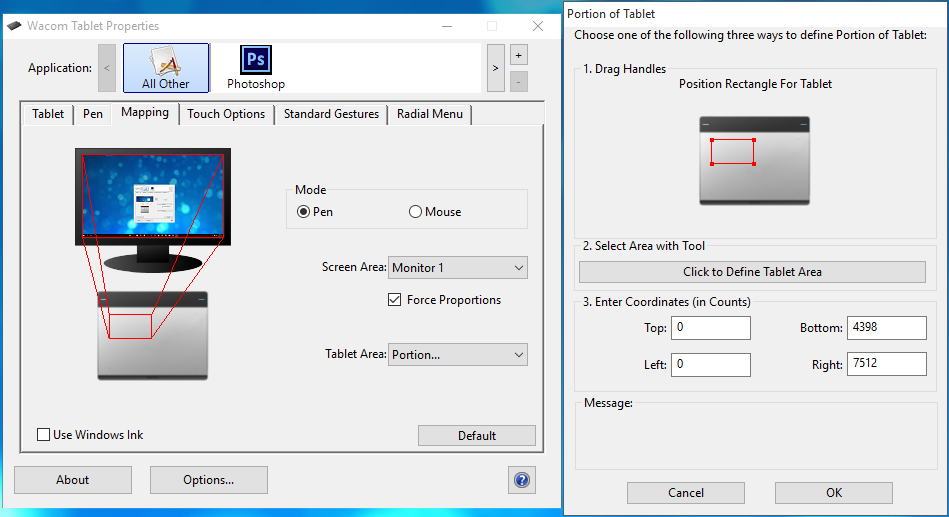
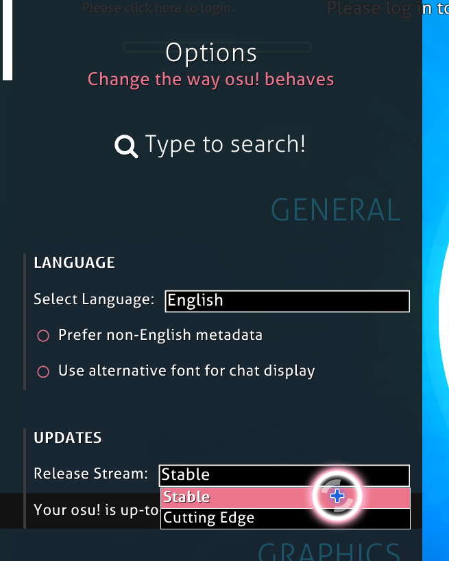
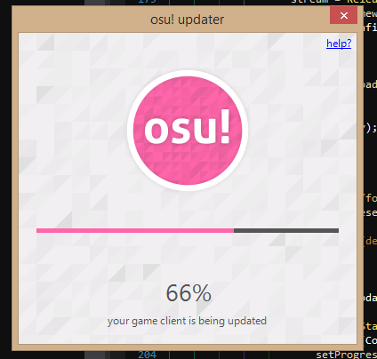
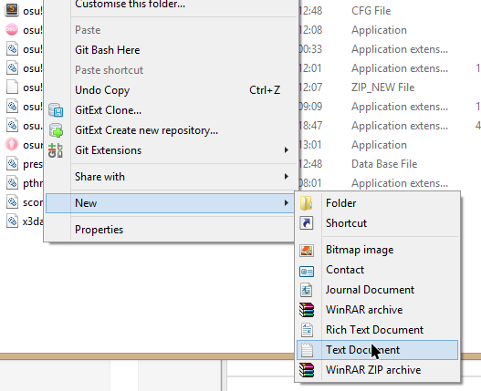
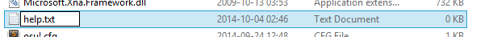

Here you can find assistance for multiple issues across various fields. Use the **Content Listing** to jump to your question directly!

Account related issues
======================

The flag on my account profile is wrong!
----------------------------------------

Your nationality is automatically determined by the game based on where you register your account from geographically speaking, meaning that if you register an account in the US, your account will be automatically assigned as being from the United States, and also placed within the US country rankings.

We can change this upon request, but you **must provide proof of residency for the given country that you wish to change to**. A picture of any sufficient 100 points of ID (passport, driver's license) representing this alongside a slip of paper with your osu! username written on it is required for us to even consider your request.

Providing false information to us may result in your account being placed under permanent restrictions, or heavily silenced for upwards of a month.

------------------------------------------------------------------------

I've forgotten my username and password!
----------------------------------------

Please use **<https://osu.ppy.sh/p/forgot>** to reclaim your account automatically, provided that you still have access to the email you registered with.

If you do not have access to your original email that you registered with anymore, or you have forgotten your username completely, please send in a support ticket via mail to accounts@ppy.sh listing as much, along with any information that we could use to verify that you are the account owner - such as the name of the original email address registered to your account.

It also helps significantly if you email us from your registration email, as this allows us to check whether you are the account owner without any further follow up.

------------------------------------------------------------------------

My account has been banned/disabled/restricted! What do I do now?
-----------------------------------------------------------------

First, sit down and think for a short while. Have you used any third-party cheating utilities or any other programs to try and get an edge over other users? Have you been making multiple accounts or otherwise violating our community rules?

If any of these sound familiar to you - then you have discovered the reason behind your ban without even having to send a ticket to accounts@ppy.sh!

If you believe this was in error for whatever reason, please file a ticket with us as soon as possible. Do note however, that we very rarely (in less than 0.05% of all submitted tickets) rescind the statuses that are applied to accounts, and only then in utterly exceptional circumstances. This rate reduces to 0% if we discover that you are lying, or attempting to circumvent the ban via a new account or any other means.

You will remain banned for a period of at **LEAST** six (6) months from the time of your initial ban/restriction.

After this point, we will accept a single appeal from you regarding the status of your account. This appeal must include substantial, well-thought out reasoning as to why we should consider allowing you another chance in the osu! community, and how we can be assured that you will not simply infringe again at a later point in the future.

*We reserve the right to deny any and all appeal possibility based on a user's history, especially if it is particularly severe.*

If you are successful and your appeal is accepted, you will be granted access to the game once more, but with the inability to submit scores for one month (30 days). If you do not infringe again in this period, your ability to submit scores will be returned and you may play fully as normal.

Users that are banned after having returned from a successful appeal will be permanently and irrevocably removed from the community, with no chance of reprieve or appeal. We will no longer respond to any correspondence sent by them through any channel, either.

------------------------------------------------------------------------

My account has been stolen!
---------------------------

Try using **<http://osu.ppy.sh/p/forgot>** to see if your account's email is still valid. If this succeeds, you will be able to reset your own password without the assistance of the support staff.

Otherwise, send a support ticket to accounts@ppy.sh in to us immediately - detailing (or from) your original registration email and an estimate of how long you believe that someone else has been using your account for, along with one or two recent passwords that you have used.

Please **do not** include replay or score data in your ticket - we cannot use this to verify your ownership of the account.

------------------------------------------------------------------------

Can I make more than one account for a fresh start or play on another person's account?
---------------------------------------------------------------------------------------

Simply put, **no - you can not**. This is possibly our most enforced rule as far as things go, and it exists solely to keep ranking fair for the vast majority of players who obey the rules.

The owner of the account is classified as the person who created the account via registration. You cannot share an account amongst siblings - though you are welcome to make an account for each of your siblings and family members **for them and only them to play on**. We will know whether you do this legitimately or not.

Under **no** circumstances will we do the following:

-   Grant a "fresh start" or a stat wipe (except in utterly exceptional circumstances, which have only ever happened 3 times in osu!'s history)
-   Delete or ban an old account so that a user may play on a new account
-   Allow another player to take ownership of another player's account

**You are only allowed to play on the first account that you have created**. You will not be allowed to create a new account to play on, under any circumstance. You can be permanently banned from osu! entirely for making multi accounts.

If you have made an account whilst being unaware of this rule somehow, cease playing on the account immediately and send in a support ticket to accounts@ppy.sh listing both your main and multi account(s). We appreciate honesty in this case, and will refrain from punishing users who choose to do this harshly.

------------------------------------------------------------------------

Am I allowed to change my account's username?
---------------------------------------------

osu! supporters can get change their usernames, which can be [at the osu!store](http://store.ppy.sh/store/product/32).

There are some points to username changes to know:

1.  The first username change is free of charge with your osu!supporter (only once). The second change costs $8 USD with subsequent changes duplicating the price. This is to stop people from recklessly changing their name too many times.
2.  Changing your username for changing capitalization is free once per name change.
3.  For minor changes (like Player223 to Player), you should contact support since they may change your username for free usually. For more complex changes, you should buy your username change like normal.
4.  You can take an existing user's username **if they haven't logged in for at least 6 months when they have no plays. For every 500 plays across all game modes you must wait an additional year to take the username**. This means that a user with a play-count (combined over all modes) of 680, you’d have to wait 1.86 years – or 678 days – from their last login.

------------------------------------------------------------------------

Website related issues
======================

I've paid for a supporter tag, but still haven't got it!
--------------------------------------------------------

Payments can take time to process, especially if you don't use Paypal, so be patient and wait 24 hours.

If you haven't used Paypal, contact xsolla support directly [here](https://support.xsolla.com/) and follow their instructions to resolve your issue. Supporter status is automatically given out as soon as we receive the funds - so the issue is on xsolla's end!

If you still haven't received your supporter tag after all this, please e-mail accounts@ppy.sh with the confirmation receipt to get further support.

------------------------------------------------------------------------

My support ticket was closed with no response!
----------------------------------------------

This means that the support staff have determined that your issue is not appropriate for this service.

If you have been banned in the past, it is a warning call to be more truthful and forthwith in your responses, or you risk having all your tickets closed without answer, which cuts off your only recourse of becoming a legitimate member of the community again.

------------------------------------------------------------------------

My user page has been locked and I can't edit it! Why?
------------------------------------------------------

If your user page has been locked, it means that one of our volunteer moderators has judged it to have content which is inappropriate for our community. Usually, these offensive pages are cleared first, and a warning issued.

Users which ignore this warning will soon find that they can no longer edit their user page, or even some aspects of their profile data. This is irreversible in most circumstances.

If you believe that you have had your user page access revoked in error, feel free to file a support ticket via mail to accounts@ppy.sh listing why, including the previous contents of your user page. We may offer a final chance depending on the severity of your past offenses.

------------------------------------------------------------------------

What are these "user pages" that I see on other players profiles?
-----------------------------------------------------------------

osu!supporters are given the privilege of editing their very own page for display on their profile for the world to see. User pages may contain anything you like - so long as it follows the community rules!

------------------------------------------------------------------------

When I try to register, all the fields say "invalid request"!
-------------------------------------------------------------

This is a known issue, and we aren't yet sure what causes it. Some possible workarounds are:

1.  Make sure JavaScript is enabled and osu.ppy.sh is allowed to use it
2.  Register on another browser
3.  Registering on a different computer or Internet connection

If none of these solutions work for you, or the first two don't work and you have no access to another computer or internet connection, please contact support and we'll try to get it resolved.

------------------------------------------------------------------------

Do I need to use my email address to register?
----------------------------------------------

No - **osu! authenticates your account by having you log in to the game client**. If you have trouble connecting with the client, please check your firewall and anti-virus settings to make sure osu! isn't being blocked.

------------------------------------------------------------------------

I can't search for a beatmap artist who's name is less than 3 characters long!
------------------------------------------------------------------------------

Due to the limitation of the current search engine, it is simply not possible to search for less than three characters at once. If you want to find a specific artist with a short name, try using the Google Search bar at the upper left-hand corner and typing the artist's name in enclosed quotation marks - such as "Xi", for instance.

------------------------------------------------------------------------

My stats on the web are all wrong! Help!
----------------------------------------

You have most likely switched your web profile view to a different game mode. Click on your primary game mode and your normal stats will come back.

------------------------------------------------------------------------

Gameplay related issues
=======================

My combo/scores/accuracy display are missing!
---------------------------------------------

A feature that toggles the HUD (scores, combo, accuracy display) was added recently.

To enable / disable this feature, simply hit **shift + tab**.

If you changed the keybinding that toggles the scoreboard, press and hold shift and press the key that toggles your scoreboard instead.

------------------------------------------------------------------------

I can't login or connect to the game at all!
--------------------------------------------

Please ensure that osu! is allowed full access in whatever firewall or anti-virus software you may be using - internet connectivity is required to log into our game servers.

Even if your firewall policy allows other games through without adding exceptions, try adding one for osu! - it'll probably help!

If you're still having issues connecting to our game servers, please submit a support ticket via mail to accounts@ppy.sh containing a 'tracert cho.ppy.sh' output log (see [here](http://support.microsoft.com/kb/162326) for information on how to do this)

------------------------------------------------------------------------

I receive some sort of server-side error when trying to play online!
--------------------------------------------------------------------

Are you using an open connection, such as a proxy, VPN or university campus internet?

If so, sometimes our systems will automatically blacklist these networks in an effort to reduce cheating behavior. Try using another proxy or VPN provider - if all else fails, send in a support ticket via mail to accounts@ppy.sh.

If you are not using any of the above, then you will need to send in a support ticket, as your connection has likely been blacklisted in error.

------------------------------------------------------------------------

My scores are missing!
----------------------

There are few causes for this:

-   **I have recently reinstalled the game client!**

Reinstalling the game client will automatically clear all of your local scores. The scores you have submitted online are still there, however - simply redownload any song that you have played before, and your score will reappear. If you are an osu!supporter, you can use the Rank Status beatmap filter ([here](http://osu.ppy.sh/p/beatmaplist&s=4&r=0)) to find any beatmaps you may have submitted scores for in the past.

-   **I have the songs, and I am certain I achieved a score on this map!**

Are you sure you are set to the right game mode? A common cause of this problem arises from playing maps of another game mode, which then automatically set song selection to use that mode's scores until the mode is set back again. You can change the game mode by clicking the Mode button at the bottom left of the screen in song select - see this, and then selecting the appropriate mode that you submitted the score with.

-   **My scores that I earned while playing offline don't appear on the online rankings!**

Sorry, but scores can only be submitted to our servers while you are playing online - local scores cannot be manually added or sent to our servers! If you are playing online and suffer a brief disconnection, your score will automatically reattempt to send itself for as long as it is able.

-   **I downloaded a lot of beatmaps that I've played before and osu! still isn't showing my scores or anyone elses!**

This is normal - as you play other maps, the game client will automatically download the latest scores from the game servers gradually. Leaving osu! idle for a little while will do exactly the same thing, if you are impatient.

------------------------------------------------------------------------

White trails / smoke appears when playing, how do I remove it?
--------------------------------------------------------------

These trails are called **smoke** and can be used to draw on your playfield for novelty's sake. Anybody who is spectating you can see this smoke as well.

The default keybinding for this feature is C, and needs to be held down in order to function.

-   **How do I remove it?**

If smoke appears when you don't want it to, go to **Main Menu**, from there select **Options**, in options, find button called "Key Bindings" or simply write "Bindings". After you go there, find entry called **Smoke** and change key used for smoke to another key.

------------------------------------------------------------------------

How do I save my own replay of a completed song?
------------------------------------------------

You can save your replay after you have completed the song, in order to do that, once you are at the post-game results screen, hit the **F2** button. That will save the replay in the **/Replays/** folder under the osu! installation directory.

If you have forgot to save the replay at the end of the song, don't panic! You can always check local ranking of your song, select desired score, and hit **F2**. osu! automatically saves all replays after you complete a song under the **/Data/r/** folder, also contained within the osu! installation directory.

------------------------------------------------------------------------

My PC reboots while playing osu!
--------------------------------

This is usually caused by your graphics card or CPU overheating, or some other hardware fault.

To determine the cause more accurately, download a GPU/CPU temperature monitor and keep close watch over your hardware while playing osu!. If your hardware is regularly reaching temperatures of &gt;90C / 194F, you may wish to try enabling the 120FPS/240FPS **Frame Limiter** in the game's options, as this will significantly reduce the load on both your CPU and GPU.

Alternatively, setting your CPU/GPU fans to 100% will help dissipate the building heat quicker - there are several applications which will allow you to do this, such as **MSI Afterburner** and **SpeedFan**.\]

If overheating is not the issue, you may wish to investigate your sound card - specifically whether its drivers are up to date or not, along with any peripherals you may have plugged in to your computer.

If none of this helps, please send in a support ticket to accounts@ppy.sh with more information on the issue - including your computer's technical specifications, model (where appropriate) and any other information you think may help us discern the cause of your problem.

------------------------------------------------------------------------

I can't submit my score, osu! says my game version is too old!
--------------------------------------------------------------

If osu! doesn't update automatically, you can force update by going into **Options** and selecting **Run Updater**. Alternatively, you can close osu! and restart the osu.exe **while holding shift**. This will provide you multiple recovery options.

------------------------------------------------------------------------

I can't hold more than a few keys at once while playing osu!mania.
------------------------------------------------------------------

This is due to an issue that most keyboards suffer from called "**ghosting**", where certain key combinations cannot be pressed together. Many newer keyboards can allow up to **6 keys** to be held down at once, mostly in random combinations. This application will help you determine how many keys your keyboard is capable of handling at once

Keep in mind that most of the **ranked** osu!mania maps are designed to prevent the influence of ghosting in most cases, by only allowing up to 6 simultaneous key presses at once.

If you cannot reliably play osu!mania due to ghosting issues, then your only recourse is to purchase a newer keyboard which is capable of handling more key presses at once.

------------------------------------------------------------------------

My scores are not submitting, and I have everything updated!
------------------------------------------------------------

1.  Check if you were connected to the internet while achieving score - your internet might have just died when you achieved the score.
2.  Make sure you don't have any software running in the background that could block the score submission, such as a firewall.
3.  Check if score submission is online - There is small possibility that while you have achieved your record, osu!'s submission system was offline, and therefore it couldn't send record. In that case, don't close osu! until issues with score system are resolved since game will try to send scores up to 1 hour in case of failure.

Unfortunately, **we cannot upload scores for you** - even by request. If you cannot submit a score for whatever reason due to technical issues or otherwise, you will need to reattempt the score at a later date once the issues are resolved. Sorry!

------------------------------------------------------------------------

My mouse cursor goes crazy whenever I try to play osu!
------------------------------------------------------

If you are seeing two cursors, cursor jumps when you move or its movement is simply unnatural, you should make sure that **Mouse Sensitivity** in options is set to **1.0x**. If the mouse cursor is too sluggish and moves far too slowly, try some of the options below, depending on what peripheral you are using:

-   **Mouse**: check if your mouse supports a manual setting of DPI (dots per inch). If so, try adjusting it to alter your mouse sensitivity over using the **Mouse Sensitivity** slider in osu!'s options.
-   **Tablet**: If you have recently bought a new tablet, and you feel like your mouse is too slow, check out this screenshot for instructions on how to change your area.

-   **osu! Tablet**: osu! tablet is one of tablets that supports raw input - just enable **Raw Input** in the options and adjust your **Mouse Sensitivity** like you would a mouse!

------------------------------------------------------------------------

My song list keeps scrolling!
-----------------------------

In order to fix this, try one of the following steps:

-   Go to **Options**, from there find and disable **Joystick support**.
-   If the previous step doesn't help, **disconnect** your input devices from PC one by one, and see if the issue clears itself up. If this works, check the peripheral for any faults that may be causing input to be sent to your computer, such as a jammed button, or even a broken USB slot.
-   If after disconnecting all your input devices from your PC the problem is still present, go and check for any **programs running in the background** - some of them may be emulating you holding down a key or mouse button, especially driver applications or things like Xpadder and X-Mouse Button Control.

------------------------------------------------------------------------

I have changed my settings, and now I can't start osu! or it freezes.
---------------------------------------------------------------------

Some computer configurations get affected by weird bugs which cause is unknown. If you happen to change your settings into state that osu! is unusable, there is still possibility to recover osu! **without** reinstalling.

-   **Fixing osu! using recovery dialog**.

1.  Hold down the **Shift** key on your keyboard.
2.  While holding **Shift**, double click the osu! icon on your desktop.
3.  Continue holding **Shift** until you see the **recovery dialog prompt**. From there, change your settings to the last known working configuration for you. If you don't remember what were your settings before, you can use the most optimal configuration below.

-   **Optimal Configuration**:

<!-- -->

-   Rendering Engine: **OpenGL** or **DirectX** (try the other one if first one doesn't work)
-   Resolution: **1024x768**
-   FPS Limiter: **60FPS (vsync)**

------------------------------------------------------------------------

Notes are not synced to the rhythm of music.
--------------------------------------------

There may be few possibilities for that to happen, here are the most common ones:

-   Go to **Options** and find **Universal Offset**, make sure it is not set to some really high or really low value. Default value is **0**.
    -   If your notes feel not in rhythm, even when you set your offset to 0, then try to play around with Offset Wizard.
-   Make sure you are not running any sound processing software, that is check if you don't run any program that may reprocess the outputted audio coming from osu!. One of the most common software are for example: **Razer Surround Audio Software**.
-   If nothing helps, you may try updating your **Sound Drivers**.

------------------------------------------------------------------------

When I try to download Beatmap Packs I get a message requesting me to login to download!
----------------------------------------------------------------------------------------

Try to turn off your browser caching.

------------------------------------------------------------------------

I never get more than 3 FPS on osu! and my PC doesn't belong in the junkyard yet!
---------------------------------------------------------------------------------

Try messing around with visual settings (renderer, frame limiter, etc.) This can also happen if you have faulty audio drivers or output devices, so make sure everything is firmly plugged in and you have the latest/proper audio drivers for your soundcard.

------------------------------------------------------------------------

I downloaded a Beatmap Pack but osu! is always trying to "repair" the file!
---------------------------------------------------------------------------

Once a pack has been downloaded, extract the .rar into your osu! Songs directory. All songs are still .zip'd and/or .osz'd inside the pack, so osu! will need to extract the beatmaps itself the next time you go into Play mode. Do NOT extract the zip's/osz's yourself, or the beatmaps will display incorrectly in osu and will not function properly.

------------------------------------------------------------------------

Installation
============

Updater Issues
--------------

osu! generally keeps itself up-to-date without any help, but sometimes things can go wrong. This is usually due to unique circumstances on your PC. Here are the steps you should take if updating is failing:

-   **Restart your PC**

This will solve a **lot** of issues, so please try it before continuing.

-   **Make sure your release stream is set to stable**

From the main menu, click Options and find the **UPDATES** section (near the top). Change your release stream to **stable**.

-   **Try running the updater manually**

You can find a "Run updater" button at the bottom of options.

On clicking this button, osu! will close and enter repair mode.

-   **If you can't start osu!**

You can force the updater to run by creating a new text document in your osu! folder called "help". Right-click in an empty space in your osu! folder, and choose **New &gt; Text Document**.

Name it **help** and then **run osu!** to start the updater in forced maintenance mode.

------------------------------------------------------------------------

How do I download osu!?
-----------------------

Simply click **Download** in the top bar of any page on the osu! website. Alternately, [click here for a direct link to the download page](https://osu.ppy.sh/p/download).

Please ensure that you are using the latest version of osu! as downloaded from the website (osu.ppy.sh) before sending in a support ticket! Some very old versions of the game obtained via Brothersoft and other file mirror websites can no longer update themselves and will fail to connect to the game servers upon launch.

------------------------------------------------------------------------

Where do I register for osu!?
-----------------------------

Simply click "**I'm new!**" in the upper right corner of any page on the osu! website, or go there directly via this link.

**We do not use email authentication** for registering a new account unlike many other sites - simply logging into the game client with your brand new account will activate your account for full play, and render it safe from our daily purges.

If you create your account and do not authenticate it by logging into the game once, the wayward account will be purged from our databases within a day. Ensure that you authenticate it quickly once you make it!

------------------------------------------------------------------------

The game installer throws an error or does not work when I use it!
------------------------------------------------------------------

If game installer throws errors when attempting to install, you can try few things:

1.  Clean your PC - Scan with anti virus software, clean registry. Good program for general clean up is **CCleaner**, scan both your computer files and your registry. The installer can fail if there are registry entries from a previous copy of osu! still present on your system.
2.  If previous step fails, you can try reinstalling .NET 3.5 Framework. You can find it here.
3.  If nothing helps, you can always download osu! updater. Just put that file into folder in which you want to install osu!, and run it. Updater should download all necessary files. The only downside of this method, is that you don't get any songs included in game at all, so make sure to download some from here!

------------------------------------------------------------------------

I downloaded a Beatmap Pack but osu! is always trying to "repair" the file!
---------------------------------------------------------------------------

Once a pack has been downloaded, extract the .rar into your osu! Songs directory. If you don't know what .rar file is, or how to extract it, you can install free software called 7-zip, after installing it, right click on a beatmap pack file, go to **7-zip** tab, and select "**Extract to 'Beatmap Pack \#xxx**". After you extract the package, you can either double click every single song so osu! opens them, or you can select all songs and drag and drop them into osu! window. Do **not** extract the zip's/osz's yourself, or the beatmaps will display incorrectly in osu and will not function properly.

------------------------------------------------------------------------

I can hear osu! after launching it, but it's invisible!
-------------------------------------------------------

Hold **Shift** while starting osu!, and try changing around the settings. Most computers will solve this problem if you use DirectX, vsync and windowed mode, but this may vary from PC to PC.

------------------------------------------------------------------------

Can't change settings, textures seem corrupted.
-----------------------------------------------

If your can't drag any sliders, checkbox are missing, or your osu! seems overall corrupted, you should try deleting **all \*.dll files** from the folder where your osu! is installed, and then run osu.exe, in order to retrieve them again.

------------------------------------------------------------------------

Cursor stops when using tablet, but I'm still able to tap.
----------------------------------------------------------

In one of the recent updates, a feature called **Raw Input** was introduced. Sadly, tablets manufactured by **Wacom** and some mouses that use proprietary **drivers** are not supported by this feature yet, and using it causes user cursor to stop moving. To fix this issue, simply go to **Options** using input device that still works (mostly likely your mouse) and search for **Raw Input** checkbox and disable it.

------------------------------------------------------------------------

I have 64-bit Windows and cannot install osu! correctly.
--------------------------------------------------------

Try to install 64-bit .NET Framework. This should come with the osu! installer.

------------------------------------------------------------------------

I've installed the game but I'm getting an error about font styles.
-------------------------------------------------------------------

If you see this error when you try to open osu! or its updater, it means you deleted or otherwise lost important system fonts that ship with Windows. These fonts are used all over the Windows OS, so you can expect other assorted problems, such as wrong fonts, missing text, and other app crashes throughout Windows.

Here is a collection of common fonts used in different versions of Windows and across the web which should help:

-   [Microsoft core web fonts](http://web.nickshanks.com/fonts/microsoft-core-web-fonts) (especially Arial, Times New Roman, Trebuchet MS, and Verdana)
-   [Tahoma](http://www.boldfonts.com/fonts/T/Tahoma.html)
-   [Windows Live Essentials](http://explore.live.com/windows-live-essentials?os=other) (Segoe UI)
-   [Powerpoint 2007 Viewer](http://www.microsoft.com/downloads/en/details.aspx?FamilyID=048dc840-14e1-467d-8dca-19d2a8fd7485&displaylang=en&pf=true) (Cleartype family--Calibri, Consolas, Corbel, ... Nothing in osu! or your system depends on these, but these fonts are awesome! Download now gogo!)
-   [Microsoft JhengHei (微軟正黑體)](http://www.microsoft.com/download/en/details.aspx?DisplayLang=en&id=12072) (Traditional Chinese UI font)

See [this topic](http://answers.microsoft.com/en-us/windows/forum/windows_vista-windows_programs/font-tahoma-does-not-support-style-regular/80ad7a97-230f-41d4-9101-107a0bfa986a) in Microsoft Answers for some more detailed advice, and other options on getting them back.

------------------------------------------------------------------------

Community Help
==============

I applied to play in an official tournament, but was denied!
------------------------------------------------------------

We scrutinize every participant in our official tournaments closely before allowing them to play. If your account has any history of breaking our community rules, whether it is from multi-accounting, cheating or just generally being a disruption, you may be barred from playing in any official tournaments completely **for a minimum of 1 year from the time of your most recent offense**.

In the event that this happens, **you may not contest this decision with the tournament coordinators** - as it is not their call to make.

Instead, 'you can appeal your case via a support ticket to tournaments@ppy.sh' - but you must provide an absolutely convincing reason as to why we should overlook your previous account history and allow you to play, and there are no guarantees that we will even consider your request at all, given the timeframe constraints on organizing such large-scale tournaments.

If you are honest and forward with us in your appeal, you may be allowed to play in future tournaments - but you will still not be allowed to play in the tournament in which you were originally attempting to participate in.

To do so would be to denigrate the efforts of legitimate players who work hard to improve themselves for these tournaments, and who abide by our community rules without any prompting

------------------------------------------------------------------------

I would like official support for a tournament/event that I am hosting.
-----------------------------------------------------------------------

We provide official support in the form of streaming support and prize donations to some well-hosted community tournaments and other events upon request.

After you have completed organizing your event and have a full roster of attendees and a proper structure, send in a support ticket to tournaments@ppy.sh with all the details you think we should know about your tournament/event, including:

-   The start and end date of the tournament
-   A link where the tournament can be followed (forum thread/external publicly accessible webpage)
-   A list of osu! users who will need the dedicated [osu!tourney](osu!tourney "wikilink") client
-   A short summary about the tournament setup (e.g. A regional 1v1 tournament with special rules)
-   A rough estimate of the number of participants
-   A list of your tournament staff and their responsibilities within your competition or event.
-   What prizes you would like to get sponsored
-   Anything else of importance

We may take some time to respond to your request, but we will give it ample consideration so long as you have prepared it properly. Give the inquiry at least two weeks to be proceeded.

------------------------------------------------------------------------

General Tips & Tricks
=====================

Troubleshooting Information
---------------------------

-   **Any Issue**

First and foremost, do a search of your issue, especially if you're getting an the error message.

While you might not be able to solve the issue after a single search, it might at least it give you an idea of what might be causing it.

-   **osu! won't open/run**

If you're getting an error message that is related to the .NET Framework there might be an issue with the installation or integrity of the .NET Framework. Make sure you have the [.NET Framework 4.0](https://www.microsoft.com/en-us/download/details.aspx?id=17851) as well as the [.NET Framework 3.5](https://www.microsoft.com/en-us/download/details.aspx?id=21) installed. If you do, but are still getting a .NET Framework related error message, try running [.NET Framework Repair Tool](https://www.microsoft.com/en-us/download/details.aspx?id=30135).

Also make sure that you have the latest drivers for your graphics card installed. See [this page](GL_Support_Issues "wikilink") for more information as well as links to where you can download the drivers for your specific graphics card.

Other than that, something with the environment you're running osu! in might be at fault. Make sure that you have all available updates for your operating system installed. It's also a good idea to do scan for malware, just in case.

-   **System Shuts Down!**

If your system shuts down entirely while playing osu!, chances are that your system is overheating. In this case, download a temperature monitoring tool such as [HWMonitor](http://www.cpuid.com/softwares/hwmonitor.html) and see if the CPU and GPU clock speeds go down (this is called thermal throttling and happens when a component is getting so hot that it performs less in order to put out less heat) after playing for a little while before your system eventually shuts off after reaching very high temperatures. Thermal throttling and overheating can usually be solved by cleaning the dust out of the heatsinks of your system.

-   **Lagspikes & Lag**

If you're not experiencing crashes, but instead are experiencing framedrops or an unnaturally low framerate, check for background processes running on your system with the task manager, and try closing resource-intensive processes that aren't critical down. Note that f.lux aswell as displayfusion are known to cause short lag spikes.

-   **Audio Issues**

If the hit objects and audio aren't in sync, first off make sure that the Universal Offset setting found in the options menu isn't set to a very high number. You usually want it to be at 0 and should only adjust it if there is a desync when it's set to 0.

Also make sure that you're not using surround-sound. This will simply never work properly for osu!. Use stereo (2.0 or 2.1) instead.

For any other audio issues, make sure that you have the latest audio drivers for your installed, and see if you get the same issue with a different audio device.

-   **None of the above solved my issue!**

If you went through all of the above and are still having issues, feel free to [create a thread to the Help forum](https://osu.ppy.sh/forum/posting.php?mode=post&f=5).

Include as much (relevant) information as you can think of in your post. Including screenshots or a video of the issue is always preferred.

------------------------------------------------------------------------

Game Lag: Common Causes and Solutions
-------------------------------------

Lag can be caused by a variety of things. Here are some common causes that may help if you're experiencing lag:

-   Background processes, anti-virus software, etc.. Try turning them off while you are playing osu!.
-   Viruses, spyware, trojans. If you don't have any anti-virus software at all, and your operating system and osu!'s performance seem choppy, you should try scanning your system with an anti-virus scanner.
-   Your computer may be in need an upgrade - some really old computers utilizing old Intel Integrated graphics (such as GMA) may not cut it for osu!.
-   Your drivers may not be up-to-date. One of the easiest ways of getting somewhat better performance is bringing your drivers up-to-date, especially your graphics drivers.

If your problem is not fixed by any of these, try the advanced troubleshooting methods below:

**The game's behaviour (either audio, video, or both) is delayed from realtime.**

This could be a result of input lag. Make sure there aren't too many devices connected to the same USB port using a splitter. If the lag is system-wide, this is probably the case. Running osu! in windowed or borderless mode also causes a slight amount of input lag, so be sure to enable the fullscreen setting from the options menu to get around this.

Also make sure the Universal Offset setting found in the options menu is at 0. Only adjust this if hit objects and audio are not in sync when the setting is set to 0.

**The game's performance is choppy or stutters frequently.**

This might simply be caused by using a system with very outdated hardware. Aside from getting a more powerful system and checking the other sections in this article there is not much you can do in this case.

**Occasional momentary freezeups.**

Check if another background process is monopolizing your system for brief moments. This could be caused by other games, web browsers, or server apps (including file sharing/torrents). Close all other background programs and tray icons and see if the problem persists.

**FPS drops sharply after an update.**

This is known to happen to some users after some updates. Restart your PC to fix it in 99% of cases.
