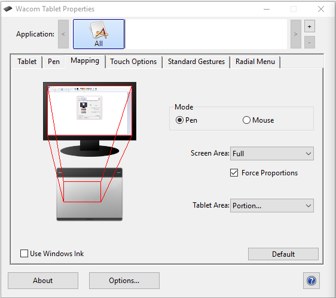

<!-- TODO: same deal as FAQ. this should be split up into appropriate articles and only written as guides where necessary. right now this page is only useful for people linking directly to sections of it -->

# Help centre

Having trouble with something? We're here to help! Check out some solutions to common issues in the sidebar to the left of your screen.

## Account

### Supporter

#### I've paid for a supporter tag, but still have not received it!

**Depending on what payment service you used (Paypal or Xsolla), there may be a slight delay in the processing of your payment before it reaches us.**

Usually, these issues resolve themselves within a few hours, and our systems will automatically apply your tag to your account.

If it has been over 24 hours and you still do not have your supporter tag, please email [support@ppy.sh](mailto:support@ppy.sh) and let us know about your problem.

Make sure to include any receipts that you received during the process (paypal transaction IDs, Xsolla receipts, etc) - these help us a lot in tracking down what happened to your payment!

### Restriction

#### What is "restricted" mode, exactly?

**A person with a restricted account is temporarily or permanently prevented from interacting with the community in any meaningful way, including chatting, participating in multiplayer, and having their scores on leaderboards.**

If your account has been restricted, you'll likely know why after a brief conversation with the support team.

In situations where we are absolutely assured that foul play or wrongdoing has taken place, we will ask you to wait out a period of **three (3) months** from the date of your last offense before we consider an appeal from you to let you back into the game.

Refer to *[Account Restrictions](/wiki/Help_Centre/Account_Restrictions)* for more information on account restrictions and the appeal process.

### Sign-in

#### I've forgotten my username and password!

**Please use [the password recovery page](https://osu.ppy.sh/home/password-reset) to reclaim your account automatically, provided that you still have access to the email you registered with.**

If this does not work for you (or you do not have access to your registration email), please send an email to our [support team](mailto:accounts@ppy.sh) with as much information as you can think of to help us acknowledge you as the owner of your account.

Good information to include this email would be:

- The name of the email address that you registered the account on, or any other email the account has been associated with since
- Any receipts for purchased osu!supporter tags or other items from the osu!store
- The last date you can remember being able to access your account normally
- Any other identifying information that you think could be helpful (excluding scores or replays, those do not help us very much!)

#### My account has been stolen!

**Try using [the password recovery page](https://osu.ppy.sh/home/password-reset) to see if your account's email is still valid.**

If this succeeds, you will be able to reset your own password without the assistance of the support staff.

If this does not work for you, please send us a support ticket immediately to [accounts@ppy.sh](mailto:accounts@ppy.sh) with as much identifying information as possible that will help us establish you as the owner of your account.

Emailing from your registration address is a huge bonus here, as well as any other information you can provide that only the holder of the account would know.

Please do not include replay or score data in your ticket - we cannot use this to verify your ownership of the account.

#### The website is telling me that I have tried to sign in too many times!

**This is a temporary protection measure after repeated failures to access your account. Try signing in again after 10-20 minutes.**

If this happens to you, simply wait for a while and try to sign in a little later.

A couple of hours at the absolute maximum will clear the status for most people and allow them to sign in again.

#### I didn't receive any emails from osu!/I forgot my email address!

**There might be an issue with your account's current email address.**

If you remember your account's attached email address, or think you do, try visiting the Email section in [account settings](https://osu.ppy.sh/home/account/edit) page to change your email address. Fill out the necessary fields and click `Update` when you're done.

If you have lost your account's password and are not receiving any password recovery emails, or you really cannot remember what email address you were using, please contact us at [accounts@ppy.sh](mailto:accounts@ppy.sh). Any information you have about your account (your username, any screenshots that show you signed in to the client, past transactions through the store or supporter payments, etc.) will be helpful!

Lastly, we are aware that some providers do not accept automated emails from us. If you are using any of these providers, please contact us by mail and we'll change your email address for you:

- `att.net`
- `bellsouth.net`
- `free.fr`
- `i.ua`
- `laposte.net`
- `sbcglobal.net`
- `t-online.de`

### Name Changes

#### Can I change my account's username?

**Yes, absolutely!**

If you have purchased (or been gifted) a [supporter tag](https://osu.ppy.sh/home/support) at any point, you will be a able to change your name **once** for free. This name change can be redeemed at the [osu!store](https://osu.ppy.sh/store/products/32).

At any point thereafter, you may purchase a username change to change your name to whatever you wish. However, each change will become progressively more expensive - the second will cost $8 USD, the third $16 USD, and so on, up to a cap of $100 USD. We do this to prevent people from abusing the system to change their names in rapid succession.

Please note that usernames must abide by our [Community Rules](/wiki/Rules) in that they must not be broadly offensive to other users, overly provocative or otherwise inflammatory in any way. In addition, usernames that impersonate or assume the identity of major public figures (such as celebrities, politicians, etc.) are not allowed and will be forcefully reverted once we find out about them.

If you are only after minor capitalization or grammar/spelling changes, you can email [accounts@ppy.sh](mailto:accounts@ppy.sh) to request a free name change to fix these issues. We will not charge you for these sorts of name changes, but you **MUST** do them through a support email. Keep in mind we will only perform this a limited number of times, so make sure you really want it!

#### Can I take another player's username?

**Yes, but only under certain circumstances.**

If a player has not signed in for at least 6 months and has no plays, their username may be reclaimed via the [osu!store player name change page](https://osu.ppy.sh/store/products/32) for a standard fee associated with username changes.

If that player does have any plays across all game modes, a [non-linear function](https://www.desmos.com/calculator/b89siyv9j8 "Desmos graph") is used to calculate how much extra time is added to those 6 months. This is to prevent people from stealing the usernames of active or recently retired players.

#### Is it possible to change my name back or revert to my old username?

**Yes, but only under certain circumstances.**

We grant free reverts for a user's direct previous username. Simply contact [accounts@ppy.sh](mailto:accounts@ppy.sh) and request your name-change reverted.

Changes to any other previous names must be [purchased via the store](https://osu.ppy.sh/store/products/32).

We only grant this one time per account, so please consider carefully before requesting!

#### My username has been changed back/reverted!

**We only force username reverts for usernames we deem inappropriate or abusive.**

If you find your recent namechange has been undone, it may be because the username you changed to was abusive, inappropriate, or considered offensive. We will not perform the change again even if requested, but if you purchased it on the store, we will offer a free change to replace it.

If the change was done with the free change that comes with a supporter tag, we cannot offer to change it again.

#### Can I remove my previous usernames/delete username history?

**Under certain circumstances.**

Your profile will show all your previous purchased namechanges, but we only selectively remove the ones that may be an issue for you. If one of your previous usernames breaches your privacy (for example, if it contains your legal name) or can lead to your privacy being breached (via other websites), contact [accounts@ppy.sh](mailto:accounts@ppy.sh) to request it removed.

### Other issues

#### The flag on my account profile is wrong!

**We can change this for you, but only if you are actively living in the country that you wish to change to.**

We determine your country as shown on your profile page from the area in which you first registered your account from.

If you create an account while on holiday in the United States, your account will show as belonging to the US - you'll even appear on the country rankings for the US too.

The support team can happily change your account's country upon request, **but only if you are actively living within that country at the time.**

To confirm this, the team will ask for proof of residency - be it the appropriate passport, drivers license for your country, or some other form of ID. This must be displayed in a picture next to your monitor with the osu! client open and signed in to your account.

We will never display this information to anyone else, and we encourage you to blank out any personal information (that will not otherwise make it impossible for us to determine what country the document is for!) if you are concerned about your privacy.

#### Can I make more than one account?

**Unfortunately, no, you cannot.**

If we were to allow everybody to make and play on multiple accounts, the ranked scoreboards would be nearly worthless!

Other games encounter this issue a lot with what is commonly known as "smurfs" - accounts with low playtimes and totals that inflate the rankings and prevent other users from playing competitively.

In osu!, we are very much against users having multiple accounts, and we enforce a strict rule of only one account per person, ever.

You get to play on the first account you ever registered with us, and that's it!

#### Is it possible to start over or have my account's statistics wiped?

**Not at the moment.**

We are considering extra 'score reset' purchases from the osu!store for the truly hardcore players who wish nothing but perfection in their stats, but as it currently stands, we cannot wipe an account's statistics for you.

This doesn't mean you can make a new account to do the same thing, either! Having multiple accounts is strongly frowned upon in our community and we will disable any such accounts that are brought to our attention.

#### Can I play on a computer that another osu! user has used before?

**Yes, absolutely. This includes shared PCs like netcafes or PC bangs.**

So long as you are playing on only your own account, you can play osu! anywhere.

If you are playing from a public place, make sure to keep a close eye on your account security. Shared computers are often prime targets for malicious software.

#### Can I get a list of all maps I've played or downloaded?

**You can see all maps you've played on the website.**

**If you have an active supporter tag**, you can see all maps you have submitted a score on by going in the Beatmap section, then clicking the "Ranked (played)" filter. Alternatively, you can use [this link](https://osu.ppy.sh/p/beatmaplist?m=-1&r=7&g=0&la=0&ra=) to access the filtered page directly.

On the new website, this filter can be found by clicking "more search options" on the [beatmap list page](https://osu.ppy.sh/beatmapsets) then "Played" in the "PLAYED" section. Alternatively, you can use [this link](https://osu.ppy.sh/beatmapsets?played=played) to access the filtered page directly.

Unfortunately, we do not keep track of all maps a user has downloaded, so it is impossible to get a list of them. The closest you could be to it would be using the aforementioned filter to recover at least the maps you've played before.

---

## Client

### Bugs/Crashes

#### osu! freezes when I click a link or multiplayer map!

**Make sure you are not running osu! in Windows compatibility mode, and that you also have a default web browser defined in your system settings.**

This issue is sometimes caused by an interaction with compatibility mode, and can also be caused by the game simply not finding a default browser to open the web page link with.

##### Is your game running under Windows compatibility mode?

To check or change if your game is running in compatibility mode under Windows, try the following steps:

1. Open your osu! installation folder and look for `osu!.exe`.
2. Right click on `osu!.exe` and select `Properties` from the dropdown menu.
3. Navigate to the `Compatibility` tab.
4. Look for a checkbox titled `Run this program in compatibility mode` within a section titled `Compatibility mode`.
5. If this checkbox is ticked, click it once more to disable the functionality.
6. If your game is already open, close the client and reopen the game once more.

##### Do you have a default web browser set?

**Under the vast majority of all circumstances, most Windows installations will have a default web browser set.**

To check, try the following steps (under Windows 8 and above):

1. Open the Start menu.
2. Type `default` into the search bar within the Start menu.
3. If you see a menu entry titled `Default app settings`, click it. If you do not, expand your search to include `default app settings`.
4. Scroll down to the `Web browser` heading and check to make sure that a browser which you have installed is properly set.

##### My game will not update properly!

**This is usually due to issues with your PC, but can very rarely be caused by new updates.**

osu! generally keeps itself up-to-date without any help, but sometimes things can go wrong.

We recommend restarting your PC as the first option. This will fix more issues than you expect it to as far as computers are concerned, and osu! is no different.

Ensure your release stream is set to stable in the game options.

You can also try forcing the game to update.

##### How do I check or set my game's release stream?

**This can be changed via the in-game options menu.**

1. Open osu!.
2. Enter the `Options` menu or hit `Control` + `O` by default.
3. Type `release` into the quick-search to jump straight to the option.
4. Ensure the dropdown says `Stable (Latest)` to receive the latest stable build of the game.

##### How do I force the game to update?

**You can force the game to update via the options menu.**

1. Open osu!.
2. Enter the `Options` menu or hit `Control` + `O` by default.
3. Type `update` into the quick-search to jump straight to the option.
4. Click the `Run osu! updater` button.

You can also force the game to update by creating a `help.txt` file in osu!'s installation directory. This file does not need to contain anything; it just needs to exist, and the game will automatically force an update the next time it runs.

#### I get an error about "font styles" when I try to open the game!

**You have deleted or lost important system fonts that are bundled with the base Windows installation. This probably isn't the only issue you are noticing!**

If you see this error when you try to open osu! or its updater, it means you deleted or otherwise lost important system fonts that ship with Windows. These fonts are used all over the Windows OS, so you can expect other assorted problems, such as wrong fonts, missing text, and other app crashes throughout Windows.

Here is a collection of common fonts used in different versions of Windows and across the web which should help:

- [Microsoft core web fonts](https://web.archive.org/web/20020124085641/http://www.microsoft.com/typography/fontpack/default.htm) (especially Arial, Times New Roman, Trebuchet MS, and Verdana)
- [Tahoma](https://freefontsfamily.com/tahoma-font-free)
- [Windows Live Essentials](https://support.microsoft.com/en-us/help/2434419/windows-live-essentials-2011) (Segoe UI)
- [Microsoft JhengHei](https://microsoft.com/en-us/download/details.aspx?&id=12072) (微軟正黑體) (Traditional Chinese UI font)

See [this topic](https://answers.microsoft.com/en-us/windows/forum/windows_vista-windows_programs/font-tahoma-does-not-support-style-regular/80ad7a97-230f-41d4-9101-107a0bfa986a) in Microsoft Answers for some more detailed advice, and other options on getting them back.

#### Some of my beatmaps are missing!

**Make sure you are not searching for beatmaps within a certain criteria (such as star rating, approach rate, so on).**

If you've just downloaded a map, you may want to try refreshing your beatmap list by pressing `F5` at the song selection screen.

### Gameplay

#### My combo counter, score display or accuracy display is missing!

**Pressing `Shift` + `Tab` by default will toggle the in-game HUD and allow you to see these elements again.**

If you have changed the keybinding that toggles the scoreboard, this will not work. You can check which key it is set to in `Options` -> `Change keyboard bindings` -> `In-Game` -> `Toggle Scoreboard`.

#### My local scores are missing!

There's a few reasons why this can happen. Read on below!

##### Have you recently reinstalled the game client?

**Reinstalling the game client will automatically clear all of your local scores.**

These are unfortunately, gone.

The scores you have submitted online are still there, however - simply redownload any song that you have played before, and your score will reappear.

Handy tip - if you are an osu!supporter, you can use the `Ranked (Played)` filter in the osu!direct panel in game or via [the beatmap listing page](https://osu.ppy.sh/p/beatmaplist?m=-1&r=7&g=0&la=0&ra=) to find any maps that you have set scores on in the past.

##### Are you set to the correct game mode?

**Playing another game mode (osu!taiko, osu!catch or osu!mania) will swap the in-game score view to only show scores for that mode. This will hide your scores from other modes.**

A common cause of this problem arises from playing maps of another game mode, which then automatically set song selection to use that mode's scores until the mode is set back again.

You can change the game mode by clicking the `Mode` button at the bottom left of the screen in song select, then choosing the appropriate mode that you are looking for your scores in.

##### Are you playing offline?

**Unfortunately, scores set while playing offline cannot be added to the online rankings.**

If you are playing online and suffer a brief disconnection for whatever reason, your game will automatically try to send the scores itself for as long as you keep the client open.

##### Have you recently downloaded a large number of maps? (ie: a beatmap pack or bundle)

**Scores can sometimes take a little while to download from the game servers if you've loaded lots of new maps at once.**

Playing the game or doing something else will let the client catch up in the background.

#### What is this white trail or smoke-like line behind my cursor?

**This is a special feature called *smoke* and can be used to doodle on your playfield for fun. Anyone who is spectating you can see the things you draw as well.**

The default keybinding for this feature is `C`, and it will work for as long as you hold the button down. You can rebind it at any time in the `osu! Standard Mode` section of the `Change keyboard bindings` options dialog.

#### How do I save my own replay of a score I just made?

**Enter the post-game results screen by clicking the score in your local scoreboard, and hit the `F2` button.**

This will save your shiny new score as a `.osr` file in the /Replays/ folder within the default osu! installation directory.

osu! also automatically saves all replays after you complete a song under the `/Data/r/` folder, also contained within the osu! installation directory.

Please note that if no replay was saved for the score you will not be able to retrieve a replay by doing this.

#### osu! is telling me that my game client is too old!

**It's time to upgrade! Very old versions of the game aren't allowed to submit new scores, so you'll need to force an update by going into `Options` -> `General` -> `Run osu! updater`.**

If this doesn't work, you can close osu! and restart the osu.exe while holding down the `Shift` key. This will provide you with a few upgrade and repair options, one of which is to update your game to the latest version.

#### My scores aren't submitting!

Oops! There's a few reasons why this can happen. Let's go through them:

##### Were you connected to the Internet while playing?

**If you were not able to access the Internet when finishing your score, it may not submit.**

This can be frustrating if you play on an unstable connection, though the game will try its best to resubmit your score for as long as you leave the client open.

##### Is osu! allowed in your local firewall or anti-virus suite?

**Some firewalls or anti-virus suites can block osu! from accessing the internet, which will prevent it from sending scores.**

Check your software of choice to make sure that `osu!.exe` in the directory you installed the game in is allowed to access the internet.

##### Are you running lots of programs in the background?

**Some can interfere with your ability to submit scores.**

Try closing any extra programs before playing osu! if you find that your scores aren't submitting and you are not having issues with connectivity otherwise.

##### Are the score submission servers up?

**The answer is almost always yes, but check the [osu! server status](https://status.ppy.sh) or the [@osustatus Twitter](https://twitter.com/osustatus) to make sure everything is running smoothly on our end.**

If the servers are offline, do not close osu! until we've fixed the issues and the servers come back up, and the game will try to submit your score again for up to an hour before it gives up.

##### Can you upload a score I set for me?

**Unfortunately, we cannot upload scores upon request.**

If you were denied a score due to technical reasons or whatever else, the best you can hope for is to repeat your display of skill and achieve it again. Sorry!

#### The notes seem out of sync or out of time with the music!

**This can be due to sound processing software running on your machine, such as *Razer Surround Audio*. It could also be due to your `Universal Offset` being set incorrectly.**

Try closing any extra programs which alter or influence the sound coming out of your computer. If this doesn't help, you could try to adjust your `Universal Offset`.

Every individual hardware configuration has a particular `Universal Offset` that determines whether you hear the game's audio a little later or earlier.

The default values work for most people, but if you find it isn't for you, you can change it by following these steps:

- Go to the `Options` menu, and find the `Universal offset` slider under the `Offset Adjustment` header. The default value is 0, and you should only change it if needed.
- If the default value (0) isn't working for you, try using the `Offset wizard` button to walk you through setting a new one.
- If this still doesn't help, you may want to try updating your sound card or motherboard audio drivers.

#### I'm experiencing lag spikes or stuttering during play!

**There's many reasons why the game may perform inconsistently, from programs on your computer, to out-of-date drivers, or simply having some settings too high.**

##### Do you have lots of programs open at the same time while playing osu!?

**Some background processes can fight with osu! for resources and make the game very unpleasant to play.**

Try closing some programs that you do not need open while playing the game.

##### Is your computer secure?

**Viruses, spyware, malware or other unwanted software can cause serious performance problems for even high-end computers.**

Keep your computer clean and safe and you might notice an improvement.

##### How old is your computer?

**Very old computers that use even older Intel Integrated graphics chipsets may not be powerful to handle osu! at all, even on the lowest settings.**

The only way to deal with this one is to upgrade your computer!

##### Are your drivers up to date?

**Old drivers can cause serious performance issues. Make sure you keep all of your drivers up to date for everything wherever possible.**

Graphics card drivers are particularly important for osu!, as well as sound card drivers.

##### Are you using a USB hub to connect lots of USB devices to your computer through one USB cable?

**Connecting too many devices to one port via a splitter can cause input lag which is hard to detect but can seriously throw off your game.**

An easy solution to this is to try unplugging your USB hub briefly. If your lag disappears, you know why!

##### Are you running osu! in windowed or borderless mode?

**Both windowed and borderless mode introduce a *considerable* amount of input delay. Fullscreen is optimal for the smoothest gameplay experience.**

##### Does your game freeze up for only a moment or so?

**Sometimes background processes or other applications on your computer can send big requests for resources all at once, which will make your machine struggle.**

This usually clears up after closing everything non-essential before playing osu!. Torrenting software is a big culprit for this, especially if it shares space with the drive that osu! is installed on.

##### Has the game recently updated?

**Sometimes after a game update, the client may struggle for seemingly no reason.**

If you have a lot of beatmaps, please wait at least 10-15 minutes before blaming the lag on the update. The osu! client may be reprocessing your maps to calculate their difficulty.

If it doesn't resolve, a reboot can sometimes help.

#### My game looks glitchy, like the graphics are torn!

**This is due to an effect called [screen tearing](https://en.wikipedia.org/wiki/Screen_tearing) and can be fixed by setting the in-game `Frame limiter` option to `VSync`.**

This is a completely harmless (albeit ugly!) effect that happens because the game's refresh rate is not synced up with your monitor's refresh rate.

You can also try playing in Windowed or Borderless mode, which will use your operating system's native VSync instead.

Turning on VSync or playing in Windowed or Borderless mode will introduce a *slight* amount of input lag, unfortunately. For most people, this will not cause significant issue.

Later NVidia graphics cards have a global option in the NVidia Control Panel to set the global refresh rate to a setting called 'Fast', which will also fix this issue.

#### I received a server-side error when trying to play online!

**The servers could be having issues.**

Check the [osu! server status page](https://status.ppy.sh/) to see if there are any ongoing issues with the servers.

**This can also happen if you are using a shared internet connection, a proxy, or VPN.**

Try using another proxy or VPN provider - if all else fails, send in a support ticket via mail to [accounts@ppy.sh](mailto:accounts@ppy.sh).

If you are not using any of the above, then you will need to send in a support ticket, as your connection has likely been blacklisted in error.

Tor or networks associated with the Tor relay will not connect to the game servers for the most part. This is to avoid malicious use.

### Online features

#### I can't sign in or connect to the game at all!

**Ensure that osu! can properly access the internet through any firewall or anti-virus suites you have installed on your computer.**

Here are a few ways of allowing applications to have internet access through several common anti-virus suites:

##### Allowing a program through Windows Firewall

**On most Windows installations, Windows Firewall will be the default firewall software.**

To make sure osu! can access the internet, we will need to allow it to communicate through Windows Firewall. Here's how to check and add osu! to the program's list:

1. Open the Start menu.
2. Type `allow an app` into the search bar within the Start menu.
3. You should see a Control Panel match titled `Allow an app through Windows Firewall`. Click it.
4. A panel with a large list of applications with two checkboxes beside them will open. Click on any application, and then hit the `o` key. The list will scroll down to all applications beginning with 'o'.
5. Look for `osu!` or `osu!.exe`.
6. If neither are present, click `Allow another app` at the bottom of the panel and search for your osu! installation directory, and choose `osu!.exe`.
7. Make sure both `Private` and `Public` checkboxes are ticked. Click OK to save your settings and try again.

##### Allowing a program through AVG Firewall

Please consult AVG's [official knowledgebase entry on the topic](https://support.avg.com/SupportArticleView?l=en&urlName=Allow-application-in-AVG-Firewall) for detailed instructions on how to do this.

##### Allowing a program through Kaspersky Security Center

Please consult Kaspersky's [official help article](https://support.kaspersky.com/7834) on adding applications to the Trusted Zone.

##### Allowing a program through McAfee

Please consult McAffee's [official knowledgebase entry on the topic](https://service.mcafee.com/webcenter/portal/cp/home/articleview?articleId=TS100813).

##### I've added osu! to my firewall but I still can't connect to the game!

**We will need extra information from you to help sort this out.**

If you are still having issues connecting to our game servers, please submit a support ticket by sending an e-mail to [accounts@ppy.sh](mailto:accounts@ppy.sh). The following information will help us resolve your issue quickly:

- A trace route output log from the command `tracert` for the servers `cho.ppy.sh`, `osu.ppy.sh` and `m1.ppy.sh` (see below for instructions)
- The `network.log` file from the `Logs` folder in your osu! installation directory

##### Running a trace route to troubleshoot connection issues

**A trace route will help us detect exactly where the problem is between you and our servers.**

You can perform a trace route by opening Command Prompt and running the command `tracert`.

To open the Command Prompt, press and hold the `Windows` key and press `R`, and then type `cmd` and click `OK`. [For more information, see this Windows knowledgebase article.](https://support.microsoft.com/en-us/kb/314868).

You can then type the trace route command into the console. For example, the command `tracert cho.ppy.sh` will track how your computer connects to the game server over the internet. Tracing routes takes a little time, sometimes upwards of a minute or more depending on your connection.

We will need the results from a trace route for command for the following servers: `cho.ppy.sh`, `osu.ppy,sh` and `m1.ppy.sh`.

To copy the results of the command, simply click and drag from the bottom of the output all the way to the top so that the information turns white, then right click to instantly copy it to your clipboard.

#### I have changed my settings, and now I can't start osu! or it freezes

**Resetting osu! back to its default settings will fix this in most cases.**

Follow these steps to restore osu! to its default settings:

1. Hold down the `Shift` key on your keyboard.
2. While holding `Shift`, double click the osu! icon on your desktop.
3. Continue holding `Shift` until you see the osu! recovery dialog prompt.
4. When the `osu! configuration` dialog opens, click the `reset settings` button.
5. If you still aren't having any luck, open the dialog again and click `repair osu!`.

#### I became supporter but my name isn't yellow in-game!

**You will always appear white to yourself on the in-game client. Other users will see your glorious yellowness, though!**

This helps to identify your own messages from everyone else's. There is no option to disable it at this time.

### Performance

#### How can I make osu! run cooler if my computer is overheating?

**The easiest way is to change your frame limiter settings.**

To check what your frame limiter is set to, follow these steps:

1. Open osu!.
2. Enter the `Options` menu or hit `Control` + `O` by default.
3. Type `frame` into the quick-search to bring up the frame limiter options.

If your frame limiter is set to Unlimited, you may notice a significant improvement by changing it to one of the other three options.

`VSync` will run the game at a refresh rate equal to that of your main monitor, whilst `Power Saving` and `Optimal` will run the game at twice and 8 times your monitor's refresh rate, up to 960Hz.

We recommend using `VSync` in situations where heat is an issue.

You may also wish to look into utilities that allow you to control the speed of your CPU and GPU fans manually.

#### My PC reboots while playing osu!

**Most of the time, this is due to overheating of one or more of your computer's components, usually your graphics card or CPU.**

To figure out what is causing this, we recommend you use a GPU/CPU temperature monitor and keep an eye on it as you play osu! in the background. A good choice of program to use for this would be [Piriform Speccy](https://www.piriform.com/speccy).

If you notice either your GPU or CPU temperature exceeding values of 90C or 194F, your computer is running very hot and dangerously close to most automatic shutdown thresholds.

##### My computer isn't overheating, but the game still causes my computer to reboot!

**The most common cause of forced restarts after overheating issues is sound card problems, followed by malfunctioning peripherals attached to your computer.**

Old sound card drivers or software can cause problems with osu!, but this is not an issue for most people. Try updating your sound card or motherboard drivers.

You may also wish to try removing some of the peripherals attached via USB to your computer, especially if they interact with sound in any way. Headphones or USB sound cards can sometimes cause problems if they or the port they are in begins malfunctioning.

##### It's still happening!

If none of this helps, please send in a support ticket to [accounts@ppy.sh](mailto:accounts@ppy.sh) with more information on the issue - including your computer's technical specifications, model (where appropriate) and any other information you think may help us discern the cause of your problem.

#### I can't hold more than a few keys at once while playing osu!mania

**This is due to a hardware issue common to most keyboards called *ghosting*.**

Ghosting is a somewhat complex topic, but essentially boils down to issues with the way your keyboard is made that prevent it from sending more than a few keys down at once from certain places on the board.

Most newer keyboards will allow up to **6** keys to be held down at once, albeit in random combinations.

You can test your keyboard's ghosting limits by using [drakeirving's Anti-Ghosting utility](https://drakeirving.github.io/MultiKeyDisplay).

While the Ranking Criteria for osu!mania tries to alleviate the issue of ghosting by not allowing more than 6 notes to be active at any one time, you may encounter this issue if your keyboard is older.

The only true solution is to purchase a keyboard that can support more concurrent keypresses, in that case. You may wish to look for a feature known as *n-key rollover* (or *NKRO*). NKRO keyboards do not have issues with ghosting for the most part, but are usually expensive.

#### My cursor goes crazy whenever I try to play osu!

**The most common cause of this is having your in-game mouse sensitivity set too high.**

Jumpy, erratic movement is a prime example of this, particularly if you are using a tablet.

Setting the in-game sensitivity to 1.0x (which is default) will fix this in most cases, but may leave your cursor feeling sluggish. We suggest enabling *raw input* in the game options and using the drivers for your peripheral of choice to alter sensitivity.

You may also wish to adjust the *DPI* setting of your mouse, if you are using one. Higher DPI settings provide more accurate positioning to the game client and may smooth out any jitters.

We also suggest ensuring your peripherals are clean and free from dirt or debris. A hair or bit of dust in front of a mouse's optical sensor can do very strange things to the way a cursor moves.

##### What is raw input, and how do I turn it on?

**Raw input forces the game to use a cleaner and more direct means to access the information from your peripherals. This generally increases the accuracy of the output from the device.**

To enable raw input, follow these steps:

1. Open osu!.
2. Enter the `Options` menu or hit `Control` + `O` by default.
3. Type `raw` into the quick-search to jump straight to the option.
4. Click the `Raw input` radio button.

#### I'm playing from a tablet and my cursor feels too slow!

**You can solve this problem by defining a smaller tablet area for your device.**

On most Wacom tablets, this is done via the `Mapping` tab of the `Wacom Tablet Properties` application.

You will need to consult your tablet's manufacturer to find out how to set your tablet area for your particular peripheral.

All osu! branded tablets support raw input by default, and may have their sensitivity easily adjusted on the fly by using the raw input option in game and using the mouse sensitivity slider.

#### My song list keeps scrolling!

**This is usually due to a faulty input device connected to your computer. Try unplugging any controllers or joysticks.**

Applications which emulate or change keybindings such as *Xpadder* or *X-Mouse Button Control* may also cause these issues. Try disabling them if you use them for other games.

This can also happen due to issues with the numpad keys, as they can be used to scroll the song selection list. Pressing the `NumLock` key to disable the numpad and then pressing either `9` or `3` on the numpad will fix the issue.

You may also wish to check for any jammed or damaged buttons on your peripherals.

#### I downloaded a Beatmap Pack but osu! is always trying to "repair" the file!

**You will need to extract the pack into your Songs directory.**

Most beatmap packs come in a `.rar` file format, which means they are a compressed archive of beatmap files. You will need to extract them using your utility of choice (we recommend [7-Zip](https://7-zip.org)) to your Songs directory first.

Once all of the `.osz` files within the pack are in the Songs directory, hitting `F5` at the song selection menu will refresh the game's beatmap cache and load your new songs into the game.

---

## Website

### Common issues

#### I have not received a reply to my support ticket and it's been over 2 weeks!

**The vast majority of the time, this is due to a high number of tickets coming into our system at once.**

You can always send a single reply to your currently open ticket asking about the state of your case, but make sure not to do this more than once or twice a week. You can also contact us on Twitter at [@osusupport](https://twitter.com/osusupport) to ask about your ticket.

In rare circumstances, support tickets from chronically offending users may be deliberately ignored, though the team will **always** tell you when they will no longer be responding to you first. If you have not received a notification like this, you do not need to worry about it!

#### My user page contents are missing!

**This can happen if your user page had inappropriate content on it as defined by our [community rules](/wiki/Rules).**

In such cases, you may open up a ticket with the support team by emailing [accounts@ppy.sh](mailto:accounts@ppy.sh) and discussing your situation with them.

If at any point you are in doubt as to whether something is appropriate for a userpage, you may message any of the members of the [Global Moderation Team](/wiki/People/Global_Moderation_Team) with what you plan to put up and they'll let you know if it's okay.

#### Can I completely block another user from contacting me?

**Yes, absolutely.**

In the event that another user is harassing you via private messages either on the forums or via the game client itself, there are a few steps that you can take yourself to filter out their messages.

##### Blocking a user from contacting you in-game

**To block a user from sending you messages in-game, simply add them to your ignore list.**

1. Click the Options menu button in-game
2. Type 'ignore' to filter the options listing to the "Chat Ignore List" section.
3. Add the offending user's username to the list, separating each new user with a space, and replacing any spaces in their name with underscores (A user called *The Gatekeeper* becomes *The\_Gatekeeper* for example).
4. You are done!

You'll no longer see public chat messages from any users on that list, or receive private messages from them.

If you wish to ignore highlights, private messages, or public messages, you can simply append respectively `@h`, `@p`, `@c` to their username. `The_Gatekeeper@c` will ignore the user's messages in public channels. It is possible to combine those: `The_Gatekeeper@ph` will ignore highlights and private messages, but leave public messages visible.

##### Blocking all non-friends from sending private messages in-game

If you wish to prevent anyone not on your friendslist from sending you private messages, follow the following steps. **Please note: moderators are not affected by this functionality and can always PM you. If you feel a moderator is harassing you in spite of this, you should contact [our support team](mailto:support@ppy.sh).**

1. Click the `Options` menu button in-game or hit `Control` + O on your keyboard
2. Type "block" to filter the options listing to the "In-game Chat" section.
3. Toggle the setting on by clicking it.
4. You are done! Users who are not on your friendslist (/addfriend "user") can no longer contact you.

<!-- TODO: this part needs to be rewritten for the current website, "foes" is no longer available on the old one

##### Blocking public forum posts from a user

**To naturally hide most public forum posts of a particular user, add them to your Foes list via the UCP.**

1. Head over to the [foes list setting in the UCP](https://osu.ppy.sh/forum/ucp.php?i=zebra&mode=foes) and simply add their username to the list as pictured.
2. Click submit.
3. You are done! Most forum posts from that user will no longer be visible to you - it will be as if they are never there. Do note that other users quoting their posts will still be visible.

-->

##### Prevent any new forum private messages from reaching you

Go to your [account settings](https://osu.ppy.sh/home/account/edit) and click `lock private messages from people not on your friends list` in the Privacy section. Private messages from users in your friendlist will still reach you.

##### What if I'm still having problems with a user after blocking them?

**Never fear, our support staff will help you out.**

If a user is still harassing you via other means, or using their friends or someone else to circumvent your effort to block them, please send us an email at [support@ppy.sh](mailto:support@ppy.sh).

Make sure to include any chatlogs or other evidence in the email, and our support staff will look into your case and see it sorted for you.

#### What are these "user pages" that I see on other players profiles?

**User pages are special profile elements that all players with a [supporter tag](https://osu.ppy.sh/home/support) get access to. They can contain whatever you like - pictures of your achievements, your beatmaps, basically anything you wish!**

Players with a [supporter tag](https://osu.ppy.sh/home/support) are given the privilege of editing their very own page for display on their profile for the world to see. User pages may contain anything you like - so long as it follows the [community rules](/wiki/Rules)!

Even if your [supporter tag](https://osu.ppy.sh/home/support) happens to run out, your user page will **remain visible** and you will still be able to edit its contents.

#### Do I need to use my email address to register?

**Yes. We require your email address to send you password reset requests and verification codes when needed.**

If you have trouble connecting via the game client, please check your firewall and anti-virus settings to make sure osu! isn't being blocked.

If you ever lose your password or cannot access your account, your registration email is our first point of contact with you.

#### Why are the statistics in my user profile page wrong?

**You might be looking at your stats for another game mode! The website defaults to showing your scores for the mode you last played.**

If you have been inactive for a lengthy period of time and your statistics are shown wrong, simply play a few maps to display them again. Inactive users can have their scores hidden to keep the rankings fresh.

---

## Installation and Registration

### Installation

Main Page: [Installation](/wiki/Installation)

#### How do I download osu!?

**Simply click `Download` found at the center of the [official osu! website homepage](https://osu.ppy.sh/home). You may also find the link through `home` dropdown section found at the navigation bar on any page.**

Alternatively, [click here](https://osu.ppy.sh/home/download) for a direct link to the download page.

### Registration

Main Page: [Registration](/wiki/Registration)

#### Where do I register for osu!?

**Download osu! through [here](https://osu.ppy.sh/home/download), then run it. The game will prompt you with a section where you can create an account.**

Make sure you provide an email address you have control over. This is used to reset your password and send verification emails when needed. Do not use a throwaway email.

---

## Beatmapping and Editor

### Common issues

#### How do I upload/update my map?

**You can do this through the in-game editor.**

To upload your beatmap, go into the editor and hit `File` > `Upload Beatmap`.

This will make your beatmap available for others to download on the website and create a dedicated thread for discussion. Updating a map is the same process for a map that has already been uploaded.

Each user has a limited number of maps they can simultaneously upload. Leaving a map inactive for a month (by not updating it or not posting in its thread) will send it to the Beatmap Graveyard. To update a graveyarded beatmap, you need to revive it first.

##### The editor is telling me that beatmap you are trying to submit isn't yours!

**This can happen if the creator of the beatmap is not properly set within the beatmap files.**

In the editor, click `File` in the menu, then `Open .osu file in Notepad`. Check the line `Creator:` and make sure that it's set to your exact username, capitalization included.

If it isn't, manually change it for every difficulty in your set, reload the map, and you should be able to submit it.

#### I am an osu!supporter, but I don't have 10 pending slots!

**The number of slots available depends on the number of ranked maps you have.**

By default, every user has 2 pending slots. One slot is added for every ranked map the user owns, up to a total of 8 slots. Being a supporter grants 2 additional slots, from 4 (without ranked maps) up to a total of 10.

#### How can I delete my map?

**The team does not take requests to manually delete uploaded beatmaps.**

You can delete your beatmap yourself by waiting for it to decay to the beatmap Graveyard, which it will do so after a month without updates.

Once your beatmap is in the Graveyard, you can delete it yourself by clicking the `Delete` button that appears next to the beatmap link.

---

## osu!store and merchandise

### osu!keyboard

#### How do I configure the osu!keyboard?

**You can use the osu!keyboard configuration utility, available from [this link](https://puu.sh/l6urN/4b6bc800f2.zip).**

Simply extract it to anywhere on your computer, and run the executable!

The rest should be self-explanatory.

If you have any further issues, please feel free to submit a ticket to [support@ppy.sh](mailto:support@ppy.sh) detailing your problem.

#### The LEDs on my osu! nono keyboard aren't working!

**This can be due to a few reasons - corrosion between the LEDs and the mainboard, or in certain circumstances with earlier models, faulty LEDs.**

Please contact [store@ppy.sh](mailto:store@ppy.sh) for further inquiries.

##### How do I tell if my LEDs have corrosion on them?

**Rubbing the base of the LED connectors with a small square of aluminium foil will remove most of the residue caused from corrosion.**

Corrosive residue usually appears to be blackish-grey, or may appear as strange stains on the metal.

Removing this residue may restore your LED to working condition. If it does, you know how to fix it next time!

### osu!tablet

#### My osu!tablet has stopped working or doesn't work at all!

**This can be tricky to troubleshoot since the osu!tablet is a two-unit solution (the tablet and the pen).**

Given that the osu!tablet is a two-unit solution (e.g. tablet and pen), it can be difficult to tell which unit is experiencing issues when things go wrong.

To find out, perform the following steps:

##### Checking for issues with your tablet device

**Follow these steps to check to see if your tablet device is functioning normally:**

1. Safely remove the tablet device from your system, and unplug the cable.
2. Gently plug the cable back into a USB slot on your system.
3. If the tablet is functioning, the light slot on the face of the tablet will flash green momentarily then fall dark. This is normal behaviour.

If the tablet's light does not flash, try using a different USB cable - the ones included with the tablet can sometimes be damaged during transit or after extensive use.

Please contact [store@ppy.sh](mailto:store@ppy.sh) for further inquiries.

##### Checking for issues with your pen device

**Follow these steps to check to see if your pen device is functioning normally:**

- Unscrew the grip from the body of the pen, exposing the battery on the inside.
- Remove the AAA battery from the pen.
- Replace the battery with a brand new AAA battery. **Verify that the new battery functions in another device first.**
- Ensure that the battery's positive and negative ends are appropriate in the pen. There are markers on the device that display marks telling you which end goes where.
- Screw the grip back onto the pen.
- Depress the button on the back end (eraser end) of the pen until it clicks.

If your tablet unit is functioning properly, placing the pen near the tablet will make the cursor on your screen move.

Please contact [store@ppy.sh](mailto:store@ppy.sh) for further inquiries.

### osu!go

#### My computer doesn't recognize the osu!go when I plug it in!

**This is a known issue with one of the very first shipments of the *osu!go* USB sticks, and comes down to the device not being formatted in a manner that works with all PCs.**

Despite how complex this may sound, it's actually very easy to fix.

First off, [download the package containing the osu!go default files](https://assets.ppy.sh/store/utilities/osu!go.zip) and save it somewhere on your computer.

##### Formatting the osu!go under Windows

**Follow these steps to prepare your *osu!go* device under Windows:**

1. Open the `Start` menu.
2. Type `disk management` into the search bar. This will bring up the `Create and manage hard disk partitions` section of the Control Panel.
3. **While in the Disk Management view, make sure to follow these instructions *VERY* closely and ONLY apply them to the osu!go device.** You can potentially lose data if you fiddle around in this dialog.
4. Check to see what state your computer recognizes the device as being in.

#### The osu!go device is present, but in a "RAW" state

**This will appear like [this](https://puu.sh/nktuJ/05791b6fc1.png) in the Disk Management dialog.**

To fix this, ensure you have the osu!go device selected, and right click on the RAW partition and select the `Format` option. Choose either `NTFS` or `exFAT` under the `File System` dropdown.

`exFAT` will work with more devices, but is slightly slower.

#### The osu!go device doesn't show up in Disk Management at all

**You will need to partition the device from scratch.**

Please follow [this guide](https://staging.tails.boum.org/doc/first_steps/reset/windows.en.html) for details on how to do that.

#### I've reformatted the osu!go device and it now shows up in Disk Management

**You're almost done!**

Unzip the archive we asked you to download earlier (osu!go.zip) into the *osu!go* drive and you're done!

##### None of this worked!

If you encounter any issues with this process, please send an email to [store@ppy.sh](mailto:store@ppy.sh) and we'd be happy to help you out.

---

## Troubleshooting

### Common issues

#### What are 'log files' and how do I make them?

**Log files are detailed recordings of what the game client is doing at any given point in time. We can use them to help determine what is causing your issue.**

These files are extremely handy to have and can make solving even very complicated issues trivial.

If a support team member has asked you for these logs, here's how to get them:

1. Open *osu*.
2. Go to the `Options` menu by clicking the button on the main menu, or hitting `CTRL+O`.
3. Type `release` into the quick-search bar. This will take you to the current release stream your client is using.
4. Make sure it is set to either `Beta` or `Cutting Edge (Experimental)`. We recommend `Beta` for the best chance of stability in this situation.
5. Restart the game client if you made any changes to the release stream to apply them.
6. Reopen the game, enter `Options`, and click `Open osu! folder`.
7. Find the `Logs` directory in the window that opens.
8. Select the log file required (the support representative will tell you which), and attach it to your ticket or upload it to a public filesharing service.

#### What is this 'Bancho authentication error' I keep on receiving?

**This typically happens when there are networking issues between you and our servers.**

There's a few things we can try to resolve this issue.

##### Have you entered your password correctly?

**This is the most obvious one.**

If you've forgotten what your password is, you can use the [password recovery page](https://osu.ppy.sh/home/password-reset) to recover access to your account.

##### Are you using any proxy servers or VPNs?

**Disabling these before attempting to connect again will likely fix your issue.**

Some VPN providers and proxy servers simply do not work with osu! for whatever reason.

##### I'm still getting the error!

**We'll need a `network.log` file from you to figure out what's going on if neither of the above solutions work.**

Check out the article a section above on how to get a log file to send to us.

Rarely, you might need to contact your ISP to inquire about these problems. Certain ISPs have historically had issues connecting to osu!, usually due to poor routing.
