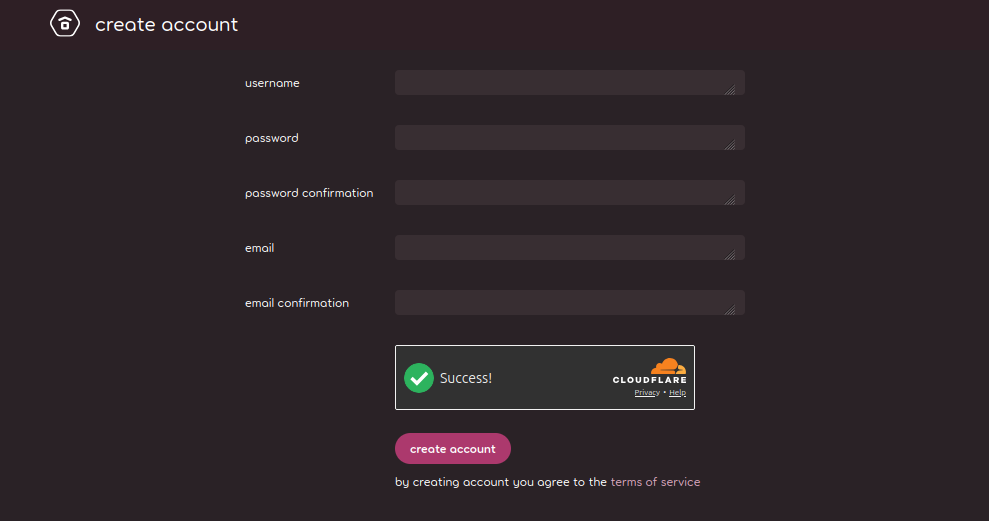

# Registration

*Warning: Having more than one osu! user account at any time is against the [osu! rules](/wiki/Rules)!*

## Using osu!(stable) {id=stable}

")

1. After [installing](/wiki/Client/Installation) osu!(stable) and running it, osu! will prompt you to sign in or register. Click `Create an account`.
2. Fill out all of the fields in the form.
3. Click `1. Create my account!`. You will be automatically signed in.

## Using osu!(lazer) {id=lazer}

")

1. When running osu!(lazer) without being logged in, the client will prompt you to sign in or register. Click `Register`.
   - If another user was logged in on the device you are using to create your account, you will receive a warning message. **If you are sure this is your first account**, click `I understand. This account isn't for me.`
2. Fill out all of the fields in the form.
3. Click `Register`.

## Using the website {id=web}

1. Open [the page `osu.ppy.sh/users/create`](https://osu.ppy.sh/users/create). Make sure no one else is logged in, as you will be redirected to the front page if that is the case.
2. Fill out all of the fields in the form.
3. Complete Cloudflare's verification if necessary.
4. Click `create account`.

## What credentials can I use? {id=credentials}

Your username must be between 3 and 15 characters long. The only characters that can be used in usernames are alphanumeric characters (`a-z`, `A-Z`, `0-9`), underscores (`_`), square brackets, (`[` and `]`), dashes (`-`), and spaces (` `).

Your email address is used to reset your password and to send you verification codes when needed, so use an email address you are sure you will be able to access for the foreseeable future (don't use a throwaway email).

Your password must be at least 8 characters long.

## What's next?

Don't forget to read the [rules](/wiki/Rules) very carefully!

We also recommend [setting up timed one-time password (TOTP) authentication](https://osu.ppy.sh/home/account/edit#authenticator-app) as an alternative to receiving an email every time your identity needs to be verified.

Once that is done, you are now ready to start your rhythm adventure! You can [add beatmaps](/wiki/Client/Installation#adding-beatmaps) to play, [make a skin](/wiki/Skinning), [make your own beatmap](/wiki/Beatmapping) or help out in [many other ways](/wiki/Community/How_you_can_help!)! You could also stop by and say "Hi" in the [Introductions subforum](https://osu.ppy.sh/community/forums/8).

If you need further in-game help, you can ask in the `#help` [Internet Relay Chat](/wiki/Community/Internet_Relay_Chat) (IRC) channel by opening the chat console (press `F8` in-game), then typing `/join help`. You can also post your question in the [Help subforum](https://osu.ppy.sh/community/forums/5).
