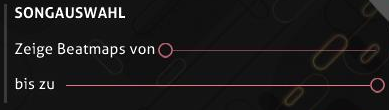

---
tags:
  - bug
  - crash
  - freeze
  - update
  - launch
  - options
  - font
  - directory
  - game
  - connection
  - bancho
  - performance
  - lag
  - glitch
  - gameplay
  - interface
  - Fehler
  - Absturz
  - Aktualisierung
  - Optionen
  - Schrift
  - Spiel
  - Verbindung
  - Benutzeroberfläche
---

# Client

*Hauptseite: [Hilfecenter](/wiki/Help_centre)*

Hast du Probleme mit dem Spiel-Client? Finde heraus, ob dein Problem unter den häufigsten Problemen unserer Nutzer aufgelistet ist.

## Fehler und Abstürze {id=crash}

### Ich habe meine Einstellungen geändert und jetzt kann ich osu! nicht mehr starten oder es stürzt ab! {id=incorrect-settings}

**Das Zurücksetzen von osu! auf die Standardeinstellungen wird das in den meisten Fällen lösen.**

Folge diesen Schritten, um osu! auf seine Standardeinstellungen zurückzusetzen:

1. Starte osu!, während du die Taste `Shift` auf deiner Tastatur hältst.
2. Halte weiter `Shift` gedrückt, bis du den osu!-Wiederherstellungsdialog siehst.
3. Klicke auf den Button `reset settings`, wenn sich der Dialog `osu! configuration` öffnet.
4. Falls du immer noch kein Glück hast, öffne den Dialog nochmal und klicke auf `repair osu!`.

### osu! friert ein, wenn ich einen Link oder eine Mehrspieler-Beatmap anklicke! {id=broken-links}

**Stelle sicher, dass osu! nicht im Kompatibilitätsmodus läuft und dass du einen Standardwebbrowser in deinen Systemeinstellungen definiert hast.**

Dieses Problem wird manchmal durch eine Interaktion mit dem Kompatibilitätsmodus ausgelöst und kann auch einfach dadurch entstehen, dass das Spiel keinen Standardbrowser zum Öffnen von Weblinks findet.

#### Läuft dein Spiel im Windows-Kompatibilitätsmodus? {id=windows-compatibility}

Versuche die folgenden Schritte nachzugehen, um zu prüfen, ob dein Spiel im Windows-Kompatibilitätsmodus läuft:

1. Öffne deinen osu!-Installationsordner und schaue nach `osu!.exe`.
2. Klicke mit der rechten Maustaste auf `osu!.exe` und wähle `Eigenschaften` im Dropdown-Menü aus.
3. Navigiere zum Tab `Kompatibilität`.
4. Halte Ausschau nach einer Checkbox mit dem Titel `Programm im Kompatibilitätsmodus ausführen für` innerhalb einer Sektion mit dem Namen `Kompatibilitätsmodus`.
5. Wenn diese Checkbox angekreuzt ist, klicke sie noch einmal an, um die Funktionalität zu deaktivieren.
6. Wenn dein Spiel bereits offen ist, schließe den Client und öffne das Spiel erneut.

#### Hast du einen Standardwebbrowser eingestellt? {id=default-browser}

**In der überwiegenden Mehrheit aller Fälle werden die meisten Windows-Installationen einen Standardwebbrowser eingestellt haben.**

Um dies zu prüfen, versuche die folgenden Schritte (unter Windows 8 und darüber):

1. Öffne das Startmenü.
2. Tippe `Standard-Apps` in die Suchleiste innerhalb des Startmenüs ein und klicke auf die Einstellung, die erscheint.
3. Scrolle herunter zur Rubrik `Webbrowser` und stelle sicher, dass dort ein von dir installierter Browser richtig eingestellt ist.

### Mein Spiel aktualisiert sich nicht richtig! {id=cannot-update}

**Das ist normalerweise aufgrund von Problemen mit deinem PC, kann aber sehr selten auch durch neue Updates auftreten.**

osu! hält sich allgemein ohne weitere Hilfe auf dem neuesten Stand, aber manchmal kann etwas schief gehen.

Wir empfehlen einen Neustart deines PCs als die erste Option. Dies wird mehr Probleme lösen, als du erwartest, was Computer betrifft, und osu! ist nicht anders.

Stelle sicher, dass die "Updatequelle" in den Spieloptionen auf `Stabil` gesetzt ist.

Du kannst auch versuchen, das Spiel dazu zu zwingen, ein Update durchzuführen.

#### Die Updatequelle ändern {id=release-stream}

**Das kann in den Spieleinstellungen geändert werden.**

1. Öffne osu!.
2. Klicke auf den Button `Options` im Hauptmenü oder drücke `Strg` + `O`.
3. Tippe `Updatequelle` in die Schnellsuche, um direkt zu der Einstellung zu gelangen.
4. Stelle sicher, dass im Auswahlmenü `Stabil` steht, damit du den aktuellsten Stable-Build des Spiels erhältst.

#### osu! zu einer Aktualisierung zwingen {id=force-update}

**Du kannst das Spiel über die Einstellungen zu einem Update zwingen.**

1. Öffne osu!.
2. Klicke auf den Button `Options` im Hauptmenü oder drücke `Strg` + `O`.
3. Tippe `Update` in die Schnellsuche ein, um direkt zu der Einstellung zu gelangen.
4. Klicke auf den Button `osu!-Updater starten`.

Du kannst das Spiel ebenfalls zu einem Update zwingen, indem du eine Datei `help.txt` im osu!-Installationsverzeichnis erstellst. Diese Datei muss nichts enthalten, sie muss einfach nur vorhanden sein. Beim nächsten Spielstart wird automatisch ein Update durchgeführt.

### Ich bekomme einen Fehler über "Schriftarten", wenn ich versuche, das Spiel zu öffnen! {id=no-default-fonts}

**Du hast wichtige Systemschriftarten gelöscht oder verloren, die in der standardmäßigen Windows-Installation enthalten sind. Das ist wahrscheinlich nicht das einzige Problem, das du wahrnimmst!**

Falls du diesen Fehler beim Starten von osu! oder seinem Aktualisierungsprogramm siehst, heißt das, dass du wichtige Systemschriftarten gelöscht oder anderweitig verloren hast, die mit Windows mitgeliefert werden. Diese Schriftarten werden überall im Windows-Betriebssystem verwendet. Somit kannst du also mit anderen Problemen wie falschen Schriftarten, fehlendem Text und anderen App-Abstürzen in Windows rechnen.

Hier ist eine Sammlung gängiger Schriftarten, die in verschiedenen Windows-Versionen und im Internet benutzt werden, die dir helfen sollten:

- [Microsoft core web fonts](https://web.archive.org/web/20020124085641/http://www.microsoft.com/typography/fontpack/default.htm) (insbesondere Arial, Times New Roman, Trebuchet MS und Verdana)
- [Tahoma](https://freefontsfamily.com/tahoma-font-free)
- [Windows Live Essentials](https://support.microsoft.com/en-us/help/2434419/windows-live-essentials-2011) (Segoe UI)
- [Microsoft JhengHei](https://microsoft.com/en-us/download/details.aspx?&id=12072) (微軟正黑體) (UI-Schriftart für traditionelles Chinesisch)

Siehe [dieses Thema](https://answers.microsoft.com/en-us/windows/forum/windows_vista-windows_programs/font-tahoma-does-not-support-style-regular/80ad7a97-230f-41d4-9101-107a0bfa986a) in Microsoft Answers für etwas detailliertere Ratschläge und andere Optionen, die Schriftarten zurückzuerhalten.

### Einige meiner Beatmaps fehlen! {id=missing-beatmaps}

**Stelle sicher, dass du deine Beatmaps nach nichts in der rechten, oberen Ecke deines Bildschirms gruppierst (also "Gruppe" sollte auf "Ohne Gruppierung" gesetzt sein).**

Wenn du gerade eine Beatmap heruntergeladen hast, dann kannst du versuchen, deine Beatmap-Liste durch das Drücken von `F5` in der Songauswahl erneut zu laden.

Vergewissere dich, dass du die Anzeige der Beatmaps nicht in den Spieloptionen einschränkst.

Um die Anzeige der Beatmaps in der Songauswahl zu ändern oder zu prüfen, versuche die folgenden Schritte:

1. Öffne osu!.
2. Klicke auf den Button `Options` im Hauptmenü oder drücke `Strg` + `O`.
3. Tippe `Songauswahl` in die Schnellsuche ein, um direkt zu der Einstellung zu gelangen.
4. Stelle sicher, dass `Zeige Beatmaps von` auf 0 Sterne und `bis zu` auf 10+ Sterne gesetzt ist.

Sollten keine dieser Methoden funktionieren, kannst du als letzte Möglichkeit versuchen, die Neuerstellung der Beatmap-Datenbank zu erzwingen. **Bedenke, dass das alle deine Beatmaps als "ungespielt" markieren wird, wodurch Suchen und Gruppieren nach Kriterien, die sich nach einem Datum richten, nicht mehr funktionieren werden.**

Um die Beatmap-Datenbank gefahrlos zu einer Neuerstellung zu zwingen, versuche die folgenden Schritte:

1. Öffne osu!.
2. Klicke auf den Button `Options` im Hauptmenü oder drücke `Strg` + `O`.
3. Click `osu!-Ordner öffnen`.
4. Schließe osu!.
5. Finde die Datei `osu!.db` innerhalb des gerade geöffneten Ordners.
6. Klicke sie mit der rechten Maustaste an, danach klicke auf `Umbenennen`.
7. Nenne sie um wie du möchtest. Es spielt keine Rolle, solange sie nicht "osu!" heißt. Anschließend drücke `Enter`.
8. Starte osu! erneut.

*Anmerkung: eine Fehlerbehebung dafür wurde in [Stable 20210519.3](https://osu.ppy.sh/home/changelog/stable40/20210519.3) am 19. Mai 2021 hinzugefügt. Wenn du diesem Problem immer noch begegnest, dann [lasse uns das bitte wissen](https://github.com/ppy/osu-stable-issues/issues).*

### Meine Songliste scrollt weiter! {id=songs-list-scrolling}

**Das ist normalerweise aufgrund von fehlerhaften Eingabegeräten, die mit deinem Computer verbunden sind. Versuche, alle Controller oder Joysticks abzustecken.**

Diese Probleme können auch durch Programme auftreten, die die Tastenbelegung emulieren oder ändern, wie z. B. *Xpadder* oder *X-Mouse Button Control*. Wenn du solche Programme für andere Spiele verwendest, deaktiviere sie.

Ebenfalls kann das durch Probleme mit dem Ziffernblock passieren, da er zum Scrollen in der Songauswahl benutzt werden kann. Das Drücken von der Taste `NumLock`, um den Ziffernblock zu deaktivieren und dann `9`, `8`, `3` oder `2` auf dem Ziffernblock zu drücken, wird das Problem lösen.

Du kannst auch nach verklemmten oder beschädigten Tasten auf deinen Peripheriegeräten suchen.

### Ich habe ein Beatmap-Paket heruntergeladen, aber osu! versucht immer die Datei zu "reparieren"! {id=beatmap-pack-extraction}

**Du musst das Paket in dein Songs-Verzeichnis extrahieren.**

Die meisten Beatmap-Pakete werden im Dateiformat `.rar` geliefert, was bedeutet, dass sie ein komprimiertes Archiv an Beatmap-Dateien sind. Du musst sie zuerst mit einem Mittel deiner Wahl (wir empfehlen [7-Zip](https://7-zip.org)) in das Verzeichnis "Songs" entpacken.

Sobald sich alle `.osz`-Dateien aus dem Archiv im Verzeichnis `Songs` befinden, wird das Drücken von `F5` in der Songauswahl den Beatmap-Cache des Spiels aktualisieren und deine neuen Songs in das Spiel laden.

## Spielverlauf {id=gameplay}

### Mein Combozähler, meine Score-Anzeige oder meine Genauigkeitsanzeige fehlen! {id=missing-interface}

**Durch das Drücken von `Shift` + `Tab` während dem Spielen schaltest du die HUD im Spiel an und wirst die Elemente wieder sehen können.**

Wenn du die Tastenbelegung geändert hast, die die Rangliste ein-/ausschaltet, dann wird das nicht funktionieren. Du kannst in `Options` -> `Tastenbelegung` -> `In-Game` -> `Toggle Scoreboard` prüfen, welche Kombination eingestellt ist. Dann kannst du die Taste anstelle von `Tab` ersetzen (z. B. `Shift` + `V`).

### Meine lokalen Scores fehlen! {id=no-scores}

Es gibt einige Gründe, warum das passieren kann. Lies weiter unten!

#### Hast du den Spiel-Client kürzlich neu installiert? {id=no-scores-reinstalling}

**Das Neuinstallieren des Spiel-Clients wird automatisch alle deine lokalen Scores löschen.**

Diese sind leider weg.

Die Scores, die du online eingereicht hast, sind aber noch da — lade einfach jeden Song, den du zuvor gespielt hast, erneut herunter und dein Score wird wieder erscheinen.

Praktischer Tipp — wenn du ein osu!supporter bist, kannst du den Filter `Ranked (Gespielt)` im osu!direct-Panel im Spiel oder via [der Beatmap-Auflistung](https://osu.ppy.sh/beatmapsets?played=played&s=ranked) benutzen, um alle Beatmaps zu finden, auf denen du in der Vergangenheit Punktestände erreicht hast.

#### Hast du den richtigen Spielmodus ausgewählt? {id=no-scores-game-mode}

**Das Spielen anderer Spielmodi (osu!taiko, osu!catch oder osu!mania) wird dafür sorgen, dass die Rangliste nur Scores für den jeweiligen Modus anzeigt. Scores aus anderen Modi werden versteckt.**

Eine häufige Ursache für dieses Problem ist das Spielen von Beatmaps aus anderen Spielmodi. Die Songauswahl nutzt automatisch die Scores aus dem entsprechenden Modus bis der Modus wieder umgestellt wird.

Du kannst den Spielmodus durch das Drücken des Buttons `Mode` in der linken, unteren Ecke des Bildschirms in der Songauswahl ändern, wobei du anschließend den angemessenen Modus für die Scores, die du sehen möchtest, auswählen musst.

#### Hast du kürzlich eine große Anzahl an Beatmaps heruntergeladen? (also ein Beatmap-Paket oder -Bundle) {id=no-scores-many-maps}

**Das Herunterladen von Scores von den Spielservern kann manchmal etwas dauern, wenn du viele neue Beatmaps auf einmal geladen hast.**

Wenn du das Spiel spielst oder etwas anderes machst, kann der Client die Daten im Hintergrund nachladen.

### Was ist die weiße Spur oder rauchähnliche Linie hinter meinem Cursor? {id=smoke}

**Das ist ein spezielles Feature, das sich *smoke* nennt und kann benutzt werden, um aus Spaß auf dem Spielfeld zu malen. Jeder, der dir zuschaut, kann die Dinge, die du malst, ebenfalls sehen.**

Die Standardtastenbelegung für diese Funktion ist `C` und wird funktionieren, solange du die Taste hältst. Du kannst dies jeder Zeit in der Sektion `osu!` im Optionsdialog `Tastenbelegung` umstellen.

### Wie speichere ich mein eigenes Replay eines Scores ab, den ich gerade erreicht habe? {id=save-replay}

**Betrete die Ergebnisanzeige durch das Klicken des Scores in deiner lokalen Rangliste und drücke die Taste `F2`.**

Das wird deinen glänzenden, neuen Score als eine `.osr`-Datei im Ordner /Replays/ innerhalb des standardmäßigen osu!-Installationsverzeichnisses speichern.

Außerdem speichert osu!, nach dem du einen Song erfolgreich gespielt hast, alle Replays im versteckten Ordner `/Data/r/`, der ebenfalls im osu!-Installationsverzeichnis liegt.

Bitte beachte, dass du auf diese Weise kein Replay abrufen kannst, wenn für den Score kein Replay gespeichert wurde.

### osu! sagt mir, dass mein Spiel-Client zu alt ist! {id=old-client}

**Es ist Zeit für eine Aktualisierung! Sehr alten Versionen des Spiels ist es nicht erlaubt, neue Scores einzureichen, wodurch du ein Update erzwingen musst, indem du auf `Options` -> `Allgemein` -> `osu!-Updater starten` gehst.**

Falls das nicht funktioniert, dann schließe osu! und starte die osu!.exe, während du die Taste `Shift` gedrückt hältst. Dadurch werden dir einige Aktualisierungs- und Reparaturmöglichkeiten aufgezeigt, von denen eine die Aktualisierung des Spiels auf die aktuelle Version ist.

### Meine Scores werden nicht eingereicht! {id=no-submission}

Ups! Es gibt einige Gründe, warum das passieren kann. Schauen wir sie uns an:

#### Warst du während dem Spielen mit dem Internet verbunden? {id=no-submission-no-connection}

**Falls du beim Abschließen der Beatmap keinen Zugang zum Internet hattest, wird der Score nicht eingereicht.**

Es kann frustrierend sein, mit einer instabilen Verbindung zu spielen, jedoch wird das Spiel sein Bestes geben, deinen Score erneut einzureichen, solange du den Client offen lässt.

#### Ist osu! in deiner lokalen Firewall oder Antiviren-Software erlaubt? {id=no-submission-firewall}

**Einige Firewalls oder Antiviren-Softwares können osu! beim Zugang zum Internet blockieren, was es daran hindert, Scores einzureichen.**

Prüfe die Software deiner Wahl, um sicherzugehen, dass `osu!.exe` im Installationsverzeichnis des Spiels auf das Internet zugreifen darf.

#### Führst du viele Programme im Hintergrund aus? {id=no-submission-software}

**Einige können die Fähigkeit beeinträchtigen, Scores einzureichen.**

Versuche, alle zusätzlichen Programme zu schließen, bevor du osu! spielst, wenn du feststellst, dass deine Scores nicht eingereicht werden und du ansonsten keine Probleme mit der Verbindung hast.

#### Sind die Status deiner Beatmaps korrekt? {id=no-submission-beatmap-status}

**Manchmal können die Status deiner Beatmaps durcheinander geraten, was bedeutet, dass die Scores, die du auf ihnen erreichst, nicht eingereicht werden können.**

Prüfe in der Songauswahl, in der linken, oberen Ecke des Bildschirms, auf etwaige kleine Symbole (zum Beispiel sollte eine gerankte Beatmap ein blaues Pfeilsymbol oben links anzeigen). Wenn deine Beatmaps kein Symbol oder ein falsches Symbol anzeigen, dann können deine Scores nicht eingereicht werden.

Das Spielen mit der `globalen Rangliste` und nicht mit der lokalen Rangliste kann helfen, das für jede einzelne Beatmap zu verhindern. Wenn eine große Anzahl deiner Beatmaps, oder alle, fehlende/inkorrekte Status haben, versuche, die Neuerstellung der Beatmap-Datenbank zu erzwingen. Wie man das ungefährlich machen kann, erfährst du in der Sektion "[Einige meiner Beatmaps fehlen!](#missing-beatmaps)". Nachdem du dies getan hast, kann es eine Weile dauern, bis alle Beatmaps wieder ihren richtigen Status haben.

#### Sind die Server zur Einreichung von Scores in Betrieb? {id=no-submission-servers}

**Die Antwort lautet fast immer ja, aber überprüfe den [osu!-Serverstatus](https://status.ppy.sh) oder das [@osustatus Twitter-Konto](https://twitter.com/osustatus), um sicherzugehen, dass alles bei uns reibungslos läuft.**

Falls die Server offline sind, schließe osu! nicht, bis wir die Probleme gelöst haben und die Server wieder aktiv sind. Das Spiel wird bis zu eine Stunde lang versuchen, deinen Score erneut einzureichen, bevor es aufgibt.

### Könnt Ihr einen Score, den ich erreicht habe, für mich hochladen? {id=upload-replay}

**Leider können wir keine Scores auf Anfrage hochladen.**

Wenn ein Score von dir aus technischen Gründen verweigert wurde, kannst du bestenfalls darauf hoffen, deine Fähigkeiten noch einmal unter Beweis zu stellen und den Score ein weiteres Mal zu erreichen. Sorry!

### Die Noten scheinen nicht synchronisiert oder aus dem Takt geraten zu sein mit der Musik! {id=offsync-notes}

**Das kann an einer auf deinem Computer laufenden Tonbearbeitungssoftware liegen, wie z. B. *Razer Surround Audio*. Es kann auch daran liegen, dass dein `Universales Offset` falsch eingestellt ist.**

Versuche, alle zusätzlichen Programme zu schließen, die den Sound deines Computers verändern oder beeinflussen. Wenn das nicht hilft, kannst du versuchen, dein `Universales Offset` anzupassen.

Jede individuelle Hardwarekonfiguration hat ein bestimmtes `Universales Offset`, welches bestimmt, ob du das Audio des Spiels ein bisschen früher oder später hörst.

Der Standardwert ist für die meisten Menschen geeignet, aber falls du findest, dass das nicht auf dich zutrifft, kannst du es mit den folgenden Schritten ändern:

1. Öffne osu!.
2. Klicke auf den Button `Options` im Hauptmenü oder drücke `Strg` + `O`.
3. Tippe `Offset` in die Schnellsuche. Das wird dich zum universalen Offset bringen, welches dein Client gerade benutzt.
4. Verwende den Schieberegler, um dein universales Offset einzustellen. Alternativ kannst du den [Offset-Assistenten](/wiki/Client/Options/Offset_Wizard) verwenden, der dir bei diesem Prozess hilft.

Falls dies immer noch nichts hilft, kannst du versuchen, deine Soundkarten- oder Motherboard-Audiotreiber zu aktualisieren.

### Mein Spiel sieht fehlerhaft aus, als ob die Grafik zerrissen wäre! {id=screen-tearing}

**Das entsteht durch einen Effekt namens [Screen Tearing](https://de.wikipedia.org/wiki/Screen_Tearing) und kann gelöst werden, indem die Einstellung `FPS-Limit` im Spiel auf `VSync` gesetzt wird.**

Dies ist ein komplett harmloser (wenn auch unschöner!) Effekt, der passiert, weil die Bildwiederholrate des Spiels nicht mit der Bildwiederholrate deines Bildschirms synchronisiert ist.

Du kannst auch versuchen im Fenster- oder randlosen Modus zu spielen, was stattdessen das native VSync deines Betriebssystems verwendet.

Das Aktivieren von VSync sowie das Spielen im Fenster- oder randlosen Modus wird leider eine *geringe* Verzögerung bei der Eingabe einführen. Für die meisten Menschen wird das keine signifikanten Probleme verursachen.

Spätere NVidia-Grafikkarten haben eine globale Option im NVidia Control Panel, um die globale Bildwiederholrate auf die Einstellung "Fast" zu setzen, welche dieses Problem ebenfalls lösen wird.

## Online-Funktionen {id=online-features}

### Ich kann mich gar nicht einloggen oder mit dem Spiel verbinden! {id=cannot-sign-in}

**Stelle sicher, dass osu! ordnungsgemäß über jede Firewall und Antivirensoftware, die auf deinem Computer installiert ist, auf das Internet zugreifen kann.**

Hier sind einige Möglichkeiten, Programmen zu erlauben, trotz üblicher Antivirensoftware auf das Internet zuzugreifen:

#### Zulassen eines Programms durch die Windows-Firewall {id=firewall-whitelist-windows}

**Auf den meisten Windows-Installationen wird Windows-Firewall die standardmäßige Firewall-Software sein.**

Um sicherzugehen, dass osu! auf das Internet zugreifen kann, müssen wir die Kommunikation über die Windows-Firewall erlauben. So kannst du das prüfen und osu! zu der Programmliste hinzufügen:

1. Öffne das Startmenü.
2. Tippe `Apps über die Windows-Firewall kommunizieren lassen` in die Suchleiste innerhalb des Startmenüs ein.
3. Du solltest ein Suchergebnis der Systemsteuerung mit dem Titel `Apps über die Windows-Firewall kommunizieren lassen` sehen. Klicke es an.
4. Es wird sich ein Fenster mit einer großen Liste an Applikationen mit zwei Checkboxen daneben öffnen. Klicke auf irgendeine Applikation, drücke dann die Taste `o`. Die Liste wird dann zu allen Applikationen herunterscrollen, die mit "o" beginnen.
5. Halte Ausschau nach `osu!` oder `osu!.exe`.
6. Falls keine der beiden vorhanden ist, klicke danach am unteren Rand des Fensters auf `Andere App zulassen...`, suche nach deinem osu!-Installationsverzeichnis und wähle `osu!.exe` aus.
7. Stelle sicher, dass die beiden Checkboxen `Privat` und `Öffentlich` angekreuzt sind. Klicke OK, um deine Einstellungen zu speichern und es nochmal zu versuchen.

#### Zulassen eines Programms durch die AVG-Firewall {id=firewall-whitelist-avg}

Bitte suche für detaillierte Anweisungen den [offiziellen Wissensbasiseintrag zu diesem Thema](https://support.avg.com/SupportArticleView?l=de&urlName=AVG-Antivirus-Enhanced-Firewall-Application-Rules&supportType=home) von AVG über die Vorgehensweise auf.

#### Zulassen eines Programms durch Kaspersky Internet Security {id=firewall-whitelist-kaspersky}

Bitte lies den [offiziellen Hilfeartikel](https://support.kaspersky.com/15163#block2) von Kaspersky über das Hinzufügen von Applikationen zur vertrauenswürdigen Zone.

#### Zulassen eines Programms durch McAfee {id=firewall-whitelist-mcafee}

Bitte informiere dich über den [offiziellen Wissensbasiseintrag zu diesem Thema](https://service.mcafee.com/?articleId=TS100813&page=shell&shell=article-view) von McAfee.

### Ich habe osu! zu meiner Firewall hinzugefügt, aber ich kann mich immer noch nicht mit dem Spiel verbinden! {id=sign-in-unknown-cause}

**Wir benötigen zusätzliche Informationen von dir, um dieses Problem zu lösen.**

Wenn du immer noch Probleme hast, eine Verbindung zu unseren Spielservern herzustellen, reiche bitte per E-Mail an [accounts@ppy.sh](mailto:accounts@ppy.sh) ein Support-Ticket ein. Die folgenden Informationen werden uns helfen, dein Problem schnell zu lösen:

- Ein Ausgabeprotokoll von Traceroute über den Befehl `tracert` für die Server `cho.ppy.sh`, `osu.ppy.sh` und `m1.ppy.sh` (siehe unten für Anweisungen)
- Die Datei `network.log` aus dem Ordner `Logs` in deinem osu!-Installationsverzeichnis

#### Ausführen von Traceroute zur Behebung von Verbindungsproblemen {id=traceroute}

**Eine Routenverfolgung wird uns helfen, genau zu bestimmen, wo das Problem zwischen dir und unseren Servern liegt.**

Durch das Öffnen der Kommandozeile und die Ausführung des Befehls `tracert` kannst du eine Routenverfolgung durchführen.

Um die Kommandozeile zu öffnen, drücke und halte die `Windows`-Taste und drücke `R`, dann tippe `cmd` ein und klicke `OK`. Weitere Informationen findest du im [Windows-Wissensbasisartikel](https://support.microsoft.com/en-us/topic/how-to-use-tracert-to-troubleshoot-tcp-ip-problems-in-windows-e643d72b-2f4f-cdd6-09a0-fd2989c7ca8e).

Du kannst dann den Befehl zur Routenverfolgung in die Konsole eingeben. Zum Beispiel wird der Befehl `tracert cho.ppy.sh` aufzeichnen, wie der Computer sich über das Internet mit dem Spielserver verbindet. Die Routenverfolgung braucht eine Weile, manchmal mehr als eine Minute, abhängig von deiner Verbindung.

Wir brauchen die Ergebnisse der Routenverfolgung für die folgenden Server: `cho.ppy.sh`, `osu.ppy.sh` und `m1.ppy.sh`.

Zum Kopieren der Resultate des Befehls, klicke und ziehe einfach vom unteren Rand der Ausgabe bis ganz nach oben, wodurch die Informationen weiß werden. Klicke anschließend mit der rechten Maustaste, um die Informationen direkt in deine Zwischenablage zu kopieren.

### Ich erhielt einen serverseitigen Fehler, als ich versucht habe, online zu spielen! {id=server-side-error}

**Die Server könnten Probleme haben.**

Prüfe die [osu!-Serverstatusseite](https://status.ppy.sh/ "osu!-Serverstatus"), um zu sehen, ob es irgendwelche laufenden Probleme mit den Servern gibt.

**Das kann auch passieren, wenn du eine gemeinsam genutzte Internetverbindung, ein Proxy oder VPN nutzt.**

Versuche, einen anderen Proxy oder VPN-Anbieter zu verwenden — wenn alles andere scheitert, sende ein Support-Ticket per E-Mail an [accounts@ppy.sh](mailto:accounts@ppy.sh).

Wenn du keine der oben genannten Möglichkeiten nutzt, dann musst du ein Support-Ticket einsenden, da deine Verbindung wahrscheinlich irrtümlich auf die schwarze Liste gesetzt wurde.

Tor oder mit Tor-Servern verbundene Netzwerke werden sich meistens nicht mit den Spielservern verbinden. Auch wenn wir die Nutzung von Tor weder verurteilen noch gutheißen, setzen wir diese Politik durch, um mögliche Bösewichte zu vermeiden, die Tor benutzen.

### Ich wurde ein osu!supporter, aber mein Name im Spiel ist nicht gelb! {id=white-username}

**Du wirst dich im Spiel-Client immer mit weißem Namen sehen. Andere Nutzer hingegen werden deine herrliche Gelbfärbung sehen!**

Das hilft dabei, deine Nachrichten von allen anderen zu unterscheiden. Es gibt aktuell keine Option, dies zu deaktivieren.

## Leistung {id=performance}

### Wie kann ich osu! kühler laufen lassen, wenn mein Computer überhitzt? {id=overheating}

**Der einfachste Weg, ist das Ändern deiner FPS-Einstellungen.**

Um zu prüfen, auf was das FPS-Limit eingestellt ist, folge diesen Schritten:

1. Öffne osu!.
2. Klicke auf den Button `Options` im Hauptmenü oder drücke `Strg` + `O`.
3. Tippe `FPS` in die Schnellsuche, um direkt zu den FPS-Einstellungen zu gelangen.

Wenn dein FPS-Limit auf `Unbegrenzt (nur im Spiel)` gesetzt ist, könntest du eine signifikante Verbesserung bemerken, indem du die Einstellung auf eine der anderen drei Optionen stellst.

`VSync` wird das Spiel mit einer Wiederholungsrate betreiben, die der deines Hauptmonitors entspricht, während `Power Saving` und `Optimal` das Spiel mit der doppelten und 8-fachen Wiederholungsrate, wie die deines Monitors mit bis zu 960 Hz, ausführen wird.

Wir empfehlen, `VSync` in Situationen zu benutzen, in denen Hitze ein Problem darstellt.

Du kannst auch Ausschau nach Programmen halten, die es dir erlauben, die Geschwindigkeit deiner CPU- und GPU-Lüfter manuell zu konfigurieren.

### Mein PC startet neu beim Spielen von osu! {id=reboot-overheating}

**Meistens liegt das an einem Überhitzen einer oder mehrerer Komponenten deines Computers, in der Regel deiner Grafikkarte oder CPU.**

Um herauszufinden, was dafür verantwortlich ist, empfehlen wir dir, eine Temperaturüberwachung für die GPU/CPU  zu benutzen und ein Auge darauf zu haben, wenn du osu! im Hintergrund spielst. Eine gute Programmwahl für diesen Zweck ist [Speccy](https://www.ccleaner.com/speccy).

Sollte die Temperatur deiner GPU oder CPU größer als 90°C oder 194°F betragen, läuft dein Computer sehr heiß und gefährlich nahe an häufigen Schwellenwerten für die automatische Abschaltung.

### Mein Computer überhitzt nicht, aber das Spiel verursacht trotzdem einen Neustart meines Computers! {id=reboot-faulty-device}

**Die üblichen Gründe für erzwungene Neustarts nach Überhitzungsproblemen sind Probleme mit der Soundkarte, gefolgt von nicht funktionierenden Peripheriegeräten, die an dein Computer angeschlossen sind.**

Alte Soundkartentreiber oder -software können Probleme mit osu! auslösen, aber für die meisten Leute ist das schnell gelöst. Versuche, die Treiber deiner Soundkarte oder deines Motherboards zu aktualisieren.

Du kannst auch ausprobieren, einige der mit USB an dein Computer angeschlossenen Peripheriegeräte zu entfernen, insbesondere wenn sie auf irgendeine Weise mit Sound interagieren. Kopfhörer oder USB-Soundkarten können manchmal Probleme verursachen, wenn sie oder der Anschluss, an den sie angeschlossen sind, eine Fehlfunktion aufweisen.

### Es passiert immer noch! {id=reboot-nothing-helps}

Wenn nichts davon hilft, dann sende bitte ein Support-Ticket an [accounts@ppy.sh](mailto:accounts@ppy.sh) mit mehr Informationen über das Problem — einschließlich der technischen Spezifikationen deines Computers, das Modell (wo zutreffend) und anderer Informationen, bei denen du denkst, dass sie uns helfen könnten, die Ursache deines Problems zu erkennen.

### Ich kann nicht mehr als ein paar Tasten auf einmal halten, während dem Spielen von osu!mania {id=keyboard-ghosting}

**Das wird durch häufige Hardwareprobleme in Tastaturen verursacht, was sich *Ghosting* nennt.**

Ghosting ist ein recht komplexes Thema, aber im Wesentlichen geht es darum, dass es Probleme mit der Art und Weise gibt, wie deine Tastatur hergestellt ist. Diese Probleme verhindern, dass die Tastatur keine Eingaben von mehr als ein paar Tasten auf einmal von bestimmten Stellen der Tastatur aus senden kann.

Die meisten der neueren Tastaturen unterstützen das gleichzeitige Drücken von bis zu **6** Tasten, wenn es auch in zufälligen Kombinationen ist.

Du kannst die Grenzen deiner Tastatur testen, indem du [das Anti-Ghosting-Tool von drakeirving](https://drakeirving.github.io/MultiKeyDisplay) verwendest.

Während die Ranking-Kriterien für osu!mania versuchen, die Probleme von Ghosting abzuschwächen, indem sie nicht erlauben, dass mehr als 6 Noten zu irgendeinem Zeitpunkt auf einmal aktiv sind, kannst du auf dieses Problem stoßen, wenn deine Tastatur älter ist.

Die einzig wahre Lösung ist der Kauf einer Tastatur, die in diesem Fall mehr gleichzeitige Tastendrücke unterstützt. Du kannst nach einer Funktion mit dem Namen *n-key rollover* (oder *NKRO*) schauen. NKRO-Tastaturen haben zum größten Teil keine Probleme mit Ghosting, aber sind normalerweise teuer.

### Mein Cursor spielt verrückt, sobald ich versuche, osu! zu spielen {id=crazy-cursor}

**Die häufigste Ursache dafür ist, dass die Mausempfindlichkeit im Spiel zu hoch eingestellt ist.**

Sprunghafte, unregelmäßige Bewegungen sind ein Paradebeispiel dafür, vor allem wenn du ein Tablet benutzt.

Das Setzen der Empfindlichkeit im Spiel auf 1.0x (was der Standard ist), wird das in den meisten Fällen lösen, aber kann dazu führen, dass sich dein Cursor träge anfühlt. Wir empfehlen, `Raw Input` in den Spieloptionen zu aktivieren und die Treiber deiner Peripheriegeräte zu benutzen, um die Empfindlichkeit zu verändern.

Du kannst auch die *DPI* deiner Maus anpassen, falls du eine verwendest. Höhere DPI-Einstellungen bieten eine akkuratere Positionierung für den Spiel-Client und können eventuelle Jitter ausgleichen.

Wir schlagen ebenso vor, dass du sicherstellst, dass deine Peripheriegeräte sauber und frei von Schmutz oder Ablagerungen sind. Ein Haar oder ein bisschen Staub vor dem optischen Sensor einer Maus kann sehr seltsame Dinge mit der Bewegung des Cursors anstellen.

#### Raw Input aktivieren {id=raw-input}

**Raw Input zwingt das Spiel dazu, eine sauberere und direktere Methode für den Zugriff auf die Informationen deiner Peripheriegeräte zu verwenden. Das erhöht allgemein die Genauigkeit der Ausgabe des Geräts.**

Um Raw Input zu aktivieren, folge diesen Schritten:

1. Öffne osu!.
2. Klicke auf den Button `Options` im Hauptmenü oder drücke `Strg` + `O`.
3. Tippe `Raw` in die Schnellsuche, um direkt zu der Einstellung zu gelangen.
4. Klicke auf die Einstellung `Raw Input`, um sie zu aktivieren.

### Ich spiele mit einem Tablet und mein Cursor ist zu langsam! {id=slow-cursor}

**Du kannst dieses Problem lösen, indem du einen kleineren Tablet-Bereich für dein Gerät festlegst.**

Bei den meisten Wacom-Tablets wird das via dem Tab `Mapping` der Applikation `Wacom Tablet Properties` erledigt.

Du musst den Hersteller deines Tablets fragen, um herauszufinden, wie der Tablet-Bereich für dein spezifisches Peripheriegerät eingestellt werden kann.

Alle Tablets der Marke osu! unterstützen Raw Input standardmäßig und die Empfindlichkeit kann dort leicht sowie spontan durch die Einstellung Raw Input im Spiel und den Schieberegler für die Mausempfindlichkeit angepasst werden.

### Ich erlebe Lag-Spitzen oder Stottern während dem Spielen! {id=lag-spikes}

**Es gibt viele Gründe, warum das Spiel inkonsistent arbeitet, von Programmen auf deinem Computer, zu veralteten Treibern oder dass einfach einige Einstellungen zu hoch sind.**

#### Hast du viele Programme offen, währenddessen du osu! spielst? {id=lag-too-many-programs}

**Manche Hintergrundprozesse können sich mit osu! um Ressourcen streiten und machen das Spiel sehr unangenehm zu spielen.**

Versuche, einige Programme (oder alle davon) zu schließen, die nicht offen sein müssen, während du das Spiel spielst.

#### Ist dein Computer sicher? {id=lag-infected-pc}

**Viren, Spyware, Malware oder andere unerwünschte Software können ernsthafte Leistungsprobleme sogar bei High-End-Computern hervorrufen.**

Halte deinen Computer sauber sowie geschützt und du könntest eine Verbesserung bemerken. Versuche, einen Virenscan auf deinem Computer durchzuführen, um solche Probleme zu finden und zu eliminieren.

#### Wie alt ist dein Computer? {id=lag-old-pc}

**Sehr alte Computer, die noch ältere Intel Integrated Graphics Chipsätze verwenden, könnten nicht leistungsstark genug sein, um osu! überhaupt zu verarbeiten, sogar in den geringsten Einstellungen.**

Die einzige Lösung dafür ist, deinen Computer aufzurüsten!

#### Sind deine Treiber aktuell? {id=lag-old-driver}

**Alte Treiber können zu ernsthaften Leistungsproblemen führen. Stelle sicher, dass du alle deine Treiber auf dem neusten Stand hältst, wo immer möglich.**

Grafikkartentreiber sind wie Soundkartentreiber besonders wichtig für osu!.

#### Benutzt du einen USB-Hub, um viele USB-Geräte mit deinem Computer über ein USB-Kabel zu verbinden? {id=lag-faulty-usb}

**Das Verbinden zu vieler Geräte an einen Port per Verteiler kann Eingabeverzögerungen verursachen, was schwierig zu erkennen ist, aber dein Spiel ernsthaft aus dem Gleichgewicht bringen kann.**

Eine einfache Lösung ist, zu versuchen, deinen USB-Hub kurz abzustecken. Wenn der Lag verschwindet, weißt du warum!

#### Läuft osu! im Fenster- oder randlosen Modus? {id=lag-windowed}

**Sowohl der Fenster- als auch randlose Modus sorgen für eine *deutliche* Eingabeverzögerung. Der Vollbildmodus ist optimal für die reibungsloseste Spielerfahrung.**

#### Friert dein Spiel nur für einen Moment oder so ein? {id=lag-background-process}

**Manchmal können Hintergrundprozesse oder andere Applikationen auf deinem Computer große Anfragen nach Ressourcen auf einmal senden, was deine Maschine in Schwierigkeiten bringt.**

Das erledigt sich normalerweise von selbst, nachdem alles Unwesentliche vor dem Spielen von osu! geschlossen wurde. Torrenting-Software ist ein Hauptverursacher dafür, insbesondere wenn sie Speicherplatz mit dem Laufwerk teilt, auf dem osu! installiert ist.

#### Wurde das Spiel kürzlich aktualisiert? {id=lag-after-update}

**Nach einem Spiel-Update kann der Client manchmal ohne ersichtlichen Grund Probleme haben.**

Falls du viele Beatmaps hast, dann warte bitte mindestens 10 bis 15 Minuten, bevor du das Update für den Lag verantwortlich machst. Der osu!-Client könnte deine Beatmaps erneut verarbeiten, um ihre Schwierigkeitsgrade zu berechnen.

Wenn das nichts hilft, dann kann ein Neustart manchmal helfen.

**Solltest du immer noch Lag-Spitzen oder Stottern während des Spielens haben, siehe dir den [Leitfaden zur Fehlerbehebung bei Leistungsproblemen](/wiki/Performance_troubleshooting) für mehr verwandte Probleme und ihre Lösungen an.**
