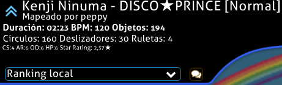

---
tags:
  - bug
  - crash
  - freeze
  - update
  - launch
  - options
  - font
  - directory
  - game
  - connection
  - bancho
  - performance
  - lag
  - glitch
  - gameplay
  - interface
  - error
  - detenido
  - congelado
  - actualización
  - iniciar
  - opciones
  - fuente
  - directorio
  - juego
  - conexión
  - rendimiento
  - retraso
  - falla
  - jugabilidad
  - interfaz
---

# Cliente

*Página principal: [Centro de ayuda](/wiki/Help_centre)*

¿Tienes problemas con el cliente del juego? Averigua si tu problema se encuentra entre los más comunes de nuestros usuarios.

## Errores y fallos {id=crash}

### ¡He cambiado la configuración y ahora no puedo iniciar osu! o se congela! {id=incorrect-settings}

**En la mayoría de los casos, si se restablece a la configuración predeterminada de osu! se solucionará el problema.**

Sigue estos pasos para restaurar osu! a su configuración predeterminada:

1. Inicia osu! mientras mantienes presionada la tecla `Mayús` de tu teclado.
2. Mantén presionada la tecla `Mayús` hasta que aparezca el cuadro de diálogo de reparación de osu!.
3. Cuando se abra el cuadro de diálogo `osu! configuration`, haz clic en el botón `reset settings`.
4. Si sigues sin tener suerte, abre de nuevo el cuadro de diálogo y haz clic en `repair osu!`.

### ¡osu! se congela cuando hago clic en un enlace o en un mapa en multijugador! {id=broken-links}

**Asegúrate de que no estás ejecutando osu! en modo de compatibilidad de Windows y de que también tienes definido un navegador web predeterminado en la configuración del sistema.**

Este problema se debe a veces a una interacción con el modo de compatibilidad, y también puede deberse a que el juego simplemente no encuentra un navegador predeterminado con el que abrir el enlace de la página web.

#### ¿Tu juego se está ejecutando en modo de compatibilidad de Windows? {id=windows-compatibility}

Para verificar o cambiar si tu juego se está ejecutando en modo de compatibilidad de Windows, sigue estos pasos:

1. Abre tu carpeta de instalación de osu! y busca `osu!.exe`.
2. Haz clic con el botón derecho del ratón en `osu!.exe` y selecciona `Propiedades` en el menú desplegable.
3. Ve a la pestaña `Compatibilidad`.
4. Busca una casilla de verificación llamada `Ejecutar este programa en modo de compatibilidad` dentro de una sección llamada `Modo de compatibilidad`.
5. Si esta casilla está marcada, vuelve a pulsarla para desactivar la funcionalidad.
6. Si el juego está abierto, cierra el cliente y vuelve a abrirlo.

#### ¿Tienes establecido un navegador web predeterminado? {id=default-browser}

**En la gran mayoría de los casos, la mayoría de las instalaciones de Windows tendrán un navegador web predeterminado.**

Para comprobarlo, sigue estos pasos (en Windows 8 y superior):

1. Abre el menú Inicio.
2. Escribe `aplicaciones predeterminadas` en la barra de búsqueda del menú Inicio y haz clic en la configuración que aparece.
3. Busca la opción `Navegador web` y comprueba que el navegador que tienes instalado está correctamente establecido.

### ¡Mi juego no se actualiza correctamente! {id=cannot-update}

**Esto suele deberse a problemas con tu ordenador, pero en muy raras ocasiones puede deberse a nuevas actualizaciones.**

osu! generalmente se mantiene actualizado sin ayuda, pero a veces las cosas pueden ir mal.

Recomendamos reiniciar el ordenador como primera opción. Esto solucionará más problemas de los que esperas, en lo que a ordenadores se refiere, y osu! no es la excepción.

Asegúrate de que tu «versión» está establecida en `Estable` en las opciones del juego.

También puedes intentar forzar la actualización del juego.

#### Cambiar la versión del juego {id=release-stream}

**Esto se puede cambiar a través del menú de opciones del juego.**

1. Abre osu!.
2. Haz clic en el botón `Options` del menú principal o presiona `Ctrl` + `O`.
3. Escribe `versión` en la búsqueda rápida para ir directamente a la opción.
4. Asegúrate de que el menú desplegable dice `Estable` para recibir la última versión estable del juego.

#### ¡Forzar la actualización de osu! {id=force-update}

**Puedes forzar la actualización del juego a través del menú de opciones.**

1. Abre osu!.
2. Haz clic en el botón `Options` del menú principal o presiona `Ctrl` + `O`.
3. Escribe `actualizar` en la búsqueda rápida para ir directamente a la opción.
4. Haz clic en el botón `Actualizar osu!`.

También puedes forzar la actualización del juego creando un archivo `help.txt` en el directorio de instalación de osu!. Este archivo no necesita contener nada; solo necesita existir, y el juego forzará automáticamente una actualización la próxima vez que se ejecute.

### ¡Me aparece un error sobre «font styles» cuando intento abrir el juego! {id=no-default-fonts}

**Has eliminado o perdido fuentes importantes del sistema que se incluyen con la instalación básica de Windows. ¡Probablemente no sea el único problema que estás notando!**

Si ves este error cuando intentas abrir osu! o su actualizador, significa que has eliminado o perdido fuentes importantes del sistema que vienen con Windows. Estas fuentes se usan en todo el sistema operativo de Windows, por lo que puedes esperar otros problemas variados, como fuentes erróneas, texto que falta y otros cierres de aplicaciones en todo Windows.

Aquí tienes una colección de fuentes comunes usadas en diferentes versiones de Windows y a través de la web que deberían ayudarte:

- [Fuentes web básicas de Microsoft](https://web.archive.org/web/20020124085641/http://www.microsoft.com/typography/fontpack/default.htm) (especialmente Arial, Times New Roman, Trebuchet MS y Verdana)
- [Tahoma](https://freefontsfamily.com/tahoma-font-free)
- [Windows Live Essentials](https://support.microsoft.com/en-us/help/2434419/windows-live-essentials-2011) (Segoe UI)
- [Microsoft JhengHei](https://microsoft.com/en-us/download/details.aspx?&id=12072) (微軟正黑體) (Fuente china tradicional)

Para más información y otras opciones para recuperarlas, consulta [este tema](https://answers.microsoft.com/en-us/windows/forum/windows_vista-windows_programs/font-tahoma-does-not-support-style-regular/80ad7a97-230f-41d4-9101-107a0bfa986a) en Microsoft Answers.

### ¡Algunos de mis beatmaps han desaparecido! {id=missing-beatmaps}

**Asegúrate de que no estás agrupando tus beatmaps por nada en la parte superior derecha de la pantalla (es decir, «Agrupar» debería estar en «Sin ordenar»).**

Si acabas de descargar un mapa, puedes intentar refrescar tu lista de beatmaps presionando `F5` en el selector de canciones.

Asegúrate de que no estás limitando los mapas que se muestran en las opciones del juego.

Para verificar o cambiar los beatmaps que se muestran en el selector de canciones, sigue estos pasos:

1. Abre osu!.
2. Haz clic en el botón `Options` del menú principal o presiona `Ctrl` + `O`.
3. Escribe `selector de canciones` en la búsqueda rápida para ir directamente a la opción.
4. Asegúrate de que `Mostrar mapas desde` esté establecido en 0 estrellas, y que `hasta` esté establecido en 10+ estrellas.

Si ninguno de estos métodos funciona, como último recurso puedes intentar forzar la recreación de tu base de datos de los beatmaps. **Ten en cuenta que esto marcará todos tus mapas como «no jugados», por lo que la búsqueda y agrupación de mapas por campos que dependen de la fecha de juego ya no funcionarán.**

Para forzar de forma segura la recreación de tu base de datos de los beatmaps, sigue estos pasos:

1. Abre osu!.
2. Haz clic en el botón `Options` del menú principal o presiona `Ctrl` + `O`.
3. Haz clic en `Abrir la carpeta de osu!`.
4. Cierra osu!.
5. Busca el archivo `osu!.db` en la carpeta que acabas de abrir.
6. Haz clic con el botón derecho del ratón, luego haz clic en `Cambiar nombre`.
7. Ponle el nombre que quieras. No importa, siempre que no se llame «osu!». Luego presiona `Entrar`.
8. Vuelve a iniciar osu!.

*Nota: se añadió una corrección para esto en [Stable 20210519.3](https://osu.ppy.sh/home/changelog/stable40/20210519.3) el 19 de mayo de 2021. Si sigues teniendo este problema, [háznoslo saber](https://github.com/ppy/osu-stable-issues/issues).*

### ¡Mi lista de canciones no para de moverse! {id=songs-list-scrolling}

**Esto suele deberse a un dispositivo de entrada defectuoso conectado al ordenador. Intenta desconectar los mandos o joysticks.**

Estos problemas también pueden ser causados por aplicaciones que emulan o cambian las asignaciones de las teclas, como *Xpadder* o *X-Mouse Button Control*. Si usas este tipo de aplicaciones para otros juegos, desactívalas.

Esto también puede ocurrir debido a problemas con las teclas del teclado numérico, ya que pueden usarse para desplazarse por la lista del selector de canciones. Presiona la tecla `BloqNum` para desactivar el teclado numérico y luego presiona `9`, `8`, `3` o `2` en el teclado numérico para solucionar el problema.

También es posible que desees revisar si hay algún botón atascado o dañado en tus periféricos.

### ¡He descargado un paquete de beatmaps, pero osu! siempre está intentando «reparar» el archivo! {id=beatmap-pack-extraction}

**Tendrás que extraer el paquete en tu directorio «Songs».**

La mayoría de los paquetes de beatmaps vienen en formato `.rar`, lo que significa que son archivos comprimidos de beatmaps. Primero tendrás que extraerlos con la herramienta que prefieras (recomendamos [7-Zip](https://7-zip.org)) en el directorio «Songs».

Una vez que todos los archivos `.osz` estén en el directorio `Songs`, presiona `F5` en el selector de canciones para actualizar la caché de los beatmaps y cargar las nuevas canciones en el juego.

## Jugabilidad {id=gameplay}

### ¡Me falta el contador del combo, la puntuación o la precisión! {id=missing-interface}

**Si presionas `Mayús` + `Tabulador` mientras juegas, activarás el HUD del juego y podrás volver a ver estos elementos.**

Si has cambiado la asignación de las teclas que activan la tabla de puntuaciones, esto no funcionará. Puedes revisar cuáles son las teclas asignadas en `Options` -> `Atajos del teclado` -> `In-Game` -> `Toggle Scoreboard`. Luego puedes reemplazar la tecla `Tabulador` por otra (por ejemplo, para hacer `Mayús` + `V`).

### ¡Mis puntuaciones locales han desaparecido! {id=no-scores}

Esto puede ocurrir por varias razones. ¡Sigue leyendo!

#### ¿Has reinstalado recientemente el cliente del juego? {id=no-scores-reinstalling}

**Al reinstalar el cliente de juego se borrarán automáticamente todas tus puntuaciones locales.**

Desafortunadamente, ya no existen.

Sin embargo, las puntuaciones que hayas enviado en línea seguirán ahí. Solo tienes que volver a descargar cualquier canción que hayas jugado antes y tu puntuación volverá a aparecer.

Consejo práctico: si eres un osu!supporter, puedes usar el filtro `Ranked (Played)` en el panel directo de osu!direct en el juego o a través del [listado de beatmaps](https://osu.ppy.sh/beatmapsets?played=played&s=ranked) para encontrar cualquier mapa en el que hayas establecido una puntuación en el pasado.

#### ¿Has seleccionado el modo de juego correcto? {id=no-scores-game-mode}

**Si juegas a otro modo de juego (osu!taiko, osu!catch u osu!mania), la visualización de las puntuaciones del juego cambiará para mostrar solo las puntuaciones de ese modo. Esto ocultará tus puntuaciones de otros modos.**

Una causa común de este problema surge al jugar mapas de otro modo de juego, que luego automáticamente establece el selector de canciones para usar las puntuaciones de ese modo hasta que el modo se establezca de nuevo.

Puedes cambiar el modo de juego haciendo clic en el botón `Mode` situado en la parte inferior izquierda del selector de canciones y eligiendo el modo adecuado en el que buscas tus puntuaciones.

#### ¿Has descargado recientemente un gran número de mapas? (es decir, un lote o paquete de beatmaps) {id=no-scores-many-maps}

**A veces, las puntuaciones pueden tardar un poco en descargarse de los servidores del juego si has cargado muchos mapas nuevos a la vez.**

Jugar al juego o hacer otra cosa permitirá al cliente ponerse al día en segundo plano.

### ¿Qué es esa estela blanca o línea parecida a un humo que aparece detrás de mi cursor? {id=smoke}

**Se trata de una función especial llamada *humo* que se puede usar para garabatear en el campo de juego por diversión. Cualquiera que te esté observando puede ver también lo que dibujas.**

La tecla predeterminada para esta función es `C`, y funcionará mientras mantengas presionada la tecla. Puedes cambiarla en cualquier momento en la sección `osu!` del cuadro de diálogo `Atajos del teclado`.

### ¿Cómo puedo guardar mi propia repetición de una puntuación que acabo de hacer? {id=save-replay}

**Entra a la pantalla de resultados haciendo clic en la tabla de clasificación local y presiona la tecla `F2`.**

Esto guardará tu nueva y brillante puntuación como un archivo `.osr` en la carpeta /Replays/ dentro del directorio de instalación predeterminado de osu!.

osu! también guarda automáticamente todas las repeticiones después de completar una canción en la carpeta oculta `/Data/r/`, también ubicada dentro del directorio de instalación de osu!.

Ten en cuenta que si no se ha guardado ninguna repetición de la puntuación, no podrás recuperar una repetición haciendo esto.

### ¡osu! me dice que mi cliente del juego es demasiado antiguo! {id=old-client}

**¡Es hora de actualizar! Las versiones muy antiguas del juego no pueden enviar nuevas puntuaciones, así que tendrás que forzar una actualización entrando en `Options` -> `General` -> `Actualizar osu!`.**

Si esto no funciona, puedes cerrar osu! y reiniciar osu!.exe mientras mantienes presionada la tecla `Mayús`. Esto te proporcionará unas cuantas opciones de actualización y reparación, siendo una de ellas actualizar tu juego a la última versión.

### ¡Mis puntuaciones no se envían! {id=no-submission}

Esto puede ocurrir por varias razones. Vamos a repasarlas:

#### ¿Estabas conectado a internet mientras jugabas? {id=no-submission-no-connection}

**Si no has podido acceder a internet al terminar tu puntuación, es posible que no se envíe.**

Esto puede ser frustrante si juegas con una conexión inestable, aunque el juego hará todo lo posible por volver a enviar tu puntuación mientras dejes el cliente abierto.

#### ¿Está osu! protegido por tu cortafuegos o antivirus local? {id=no-submission-firewall}

**Algunos cortafuegos o antivirus pueden bloquear el acceso de osu! a internet, lo que le impedirá enviar puntuaciones.**

Asegúrate en tu software de elección de que `osu!.exe` pueda acceder a internet en el directorio en el que instalaste el juego.

#### ¿Estás ejecutando muchos programas en segundo plano? {id=no-submission-software}

**Algunos pueden interferir con la posibilidad de enviar puntuaciones.**

Intenta cerrar todos los programas adicionales antes de jugar a osu! si ves que tus puntuaciones no se envían y no tienes problemas de conectividad por lo demás.

#### ¿Los estados de tus beatmaps son correctos? {id=no-submission-beatmap-status}

**A veces, los estados de tus beatmaps pueden estropearse, lo que significa que las puntuaciones que establezcas en ellos no podrán enviarse.**

En el selector de canciones, mira si hay algún icono pequeño en la parte superior izquierda de la pantalla (por ejemplo, un beatmap clasificado debería mostrar un icono de flecha azul en la parte superior izquierda). Si tus beatmaps no muestran ningún icono, o muestran un icono incorrecto, tus puntuaciones no podrán enviarse.

Jugar con `Ranking global` seleccionado, en lugar de con la tabla de clasificación local, puede ayudar a evitarlo en cada mapa. Si un gran número de tus beatmaps, o todos ellos, tienen estados incorrectos, intenta forzar la recreación de tu archivo de la base de datos de los beatmaps. Puedes ver cómo hacerlo de forma segura más arriba en la sección «[¡Algunos de mis beatmaps han desaparecido!](#missing-beatmaps)». Después de hacer esto, puede que pase algún tiempo hasta que todos tus mapas recuperen el estado correcto.

#### ¿Los servidores del envío de puntuaciones están operativos? {id=no-submission-servers}

**La respuesta es casi siempre afirmativa, pero revisa el [estado del servidor de osu!](https://status.ppy.sh) o el [Twitter @osustatus](https://twitter.com/osustatus) para asegurarte de que todo funciona correctamente por nuestra parte.**

Si los servidores están fuera de línea, no cierres osu! hasta que hayamos solucionado los problemas y los servidores vuelvan a funcionar, y el juego intentará enviar tu puntuación de nuevo hasta una hora antes de rendirse.

### ¿Pueden subir una puntuación que hice por mí? {id=upload-replay}

**Desafortunadamente, no podemos enviar puntuaciones a quienes lo soliciten.**

Si la puntuación no se ha enviado por motivos técnicos o de otra índole, a lo más que puedes aspirar es a repetir tu exhibición de habilidad y volver a conseguirla. ¡Lo sentimos!

### ¡Las notas parecen desincronizadas o fuera de tiempo con la música! {id=offsync-notes}

**Esto puede deberse al software de procesamiento de sonido que se ejecuta en tu máquina, como *Razer Surround Audio*. También puede deberse a que la `Compensación universal` esté mal configurada.**

Intenta cerrar cualquier programa adicional que altere o influya en el sonido que sale de tu ordenador. Si esto no ayuda, puedes intentar ajustar tu `Compensación Universal`.

Cada equipo tiene su propia `Compensación Universal`, que determina si el sonido del juego se escucha más tarde o más pronto.

El valor predeterminado funciona para la mayoría de la gente, pero si ves que no te funciona, puedes cambiarlo siguiendo estos pasos:

1. Abre osu!.
2. Haz clic en el botón `Options` del menú principal o presiona `Ctrl` + `O`.
3. Escribe `compensación` en la barra de búsqueda rápida. Esto te llevará a la compensación universal actual que está usando tu cliente.
4. Usa el control deslizante para ajustar la compensación universal. Como alternativa, prueba a usar el [asistente de compensación](/wiki/Client/Options/Offset_Wizard) para ayudarte con este proceso.

Si sigue sin funcionar, prueba a actualizar los controladores de audio de la tarjeta de sonido o de la placa base.

### ¡Mi juego se ve defectuoso, como si los gráficos estuvieran rasgados! {id=screen-tearing}

**Esto se debe a un efecto llamado [screen tearing](https://es.wikipedia.org/wiki/Tearing) y puede solucionarse cambiando en el juego la opción `Límite de FPS` a `Sincr. vertical`.**

Se trata de un efecto completamente inofensivo (aunque feo) que se produce porque la frecuencia de refresco del juego no está sincronizada con la frecuencia de refresco de tu monitor.

También puedes probar a jugar en modo ventana o sin bordes, que usarán la sincronización vertical (VSync) nativa de tu sistema operativo.

Desafortunadamente, si activas la sincronización vertical o juegas en modo ventana o sin bordes, se producirá un ligero retraso en la entrada. Para la mayoría de la gente, esto no causará problemas significativos.

Las últimas tarjetas gráficas de NVidia tienen una opción global en el panel de control de NVidia para establecer la frecuencia de refresco global a un valor llamado «Rápido», que también solucionará este problema.

## Funciones en línea {id=online-features}

### ¡No puedo iniciar sesión ni conectarme al juego! {id=cannot-sign-in}

**Asegúrate de que osu! pueda acceder correctamente a internet a través de cualquier cortafuegos o antivirus que tengas instalado en tu ordenador.**

Aquí hay algunas maneras de permitir que las aplicaciones tengan acceso a internet a través de varias soluciones comunes:

#### Permitir un programa a través del cortafuegos de Windows {id=firewall-whitelist-windows}

**En la mayoría de las instalaciones de Windows, el cortafuegos de Windows será el software de cortafuegos predeterminado.**

Para asegurarnos de que osu! pueda acceder a internet, tendremos que permitir que se comunique a través del cortafuegos de Windows. Sigue estos pasos para verificar y añadir a osu! a la lista del programa:

1. Abre el menú Inicio.
2. Escribe `permitir una aplicación` en la barra de búsqueda del menú Inicio.
3. Deberías ver una coincidencia en el panel de control llamada `Permitir una aplicación a través de Firewall de Windows`. Haz clic en ella.
4. Se abrirá un panel con una gran lista de aplicaciones con dos casillas de verificación al lado. Haz clic en cualquier aplicación, luego presiona la tecla `o`. La lista se desplazará hacia abajo hasta todas las aplicaciones que empiecen por `o`.
5. Busca `osu!` u `osu!.exe`.
6. Si no aparecen ninguno de los dos, haz clic en `Permitir otra aplicación` en la parte inferior del panel, busca el directorio de instalación de osu! y selecciona `osu!.exe`.
7. Asegúrate de que las casillas `Privada` y `Pública` estén marcadas. Haz clic en Aceptar para guardar la configuración y vuelve a intentarlo.

#### Permitir un programa a través del cortafuegos de AVG {id=firewall-whitelist-avg}

Consulta el [artículo oficial de la base de conocimientos sobre el tema](https://support.avg.com/SupportArticleView?l=en&urlName=AVG-Antivirus-Enhanced-Firewall-Application-Rules&supportType=home) de AVG para obtener instrucciones detalladas sobre cómo hacerlo.

#### Permitir un programa a través de Kaspersky Internet Security {id=firewall-whitelist-kaspersky}

Consulta el [artículo de ayuda oficial](https://support.kaspersky.com/15163#block2) de Kaspersky sobre cómo añadir aplicaciones a la zona de confianza.

#### Permitir un programa a través de McAfee {id=firewall-whitelist-mcafee}

Consulta el [artículo de la base de conocimientos oficial de McAfee sobre el tema](https://service.mcafee.com/?articleId=TS100813&page=shell&shell=article-view).

### ¡He añadido a osu! a mi cortafuegos, pero sigo sin poder conectarme al juego! {id=sign-in-unknown-cause}

**Necesitaremos información adicional que nos ayude a resolverlo.**

Si sigues teniendo problemas para conectarte a nuestros servidores del juego, envía un tiquete de soporte técnico por correo electrónico a [accounts@ppy.sh](mailto:accounts@ppy.sh). La siguiente información nos ayudará a resolver tu problema rápidamente:

- Un registro de salida de la ruta de rastreo del comando `tracert` para los servidores `cho.ppy.sh`, `osu.ppy.sh` y `m1.ppy.sh` (más instrucciones a continuación)
- El archivo `network.log` de la carpeta `Logs` del directorio de instalación de osu!

#### Cómo ejecutar una ruta de rastreo para solucionar problemas de conexión {id=traceroute}

**Una ruta de rastreo nos ayudará a detectar exactamente dónde está el problema entre tu ordenador y nuestros servidores.**

Puedes realizar una ruta de rastreo abriendo el símbolo del sistema y ejecutando el comando `tracert`.

Para abrir el símbolo del sistema, mantén presionada la tecla `Windows` y presiona `R`, luego escribe `cmd` y haz clic en `Aceptar`. Para obtener más información, consulta el [artículo de la base de conocimientos de Windows](https://support.microsoft.com/en-us/topic/how-to-use-tracert-to-troubleshoot-tcp-ip-problems-in-windows-e643d72b-2f4f-cdd6-09a0-fd2989c7ca8e).

Luego, puedes escribir el comando de ruta de rastreo en la consola. Por ejemplo, el comando `tracert cho.ppy.sh` rastreará cómo se conecta tu ordenador al servidor del juego a través de internet. Trazar rutas lleva un poco de tiempo, a veces más de un minuto o más dependiendo de tu conexión.

Necesitaremos los resultados de un comando de ruta de rastreo para los siguientes servidores: `cho.ppy.sh`, `osu.ppy.sh`, y `m1.ppy.sh`.

Para copiar los resultados del comando, simplemente haz clic y arrastra desde la parte inferior de la salida hasta la parte superior para que la información se vuelva blanca, luego haz clic con el botón derecho para copiarla instantáneamente en el portapapeles.

### ¡He recibido un error del servidor al intentar jugar en línea! {id=server-side-error}

**Los servidores podrían estar teniendo problemas.**

Consulta la página del [estado del servidor de osu!](https://status.ppy.sh/ "estado del servidor de osu!") para ver si hay algún problema con los servidores.

**Esto también puede ocurrir si estás usando una conexión a internet compartida, un proxy o una VPN.**

Prueba a usar otro proxy o proveedor para la VPN. Si todo lo demás falla, envía un tiquete de soporte por correo a [accounts@ppy.sh](mailto:accounts@ppy.sh).

Si no estás usando ninguna de las opciones anteriores, entonces tendrás que enviar un tiquete de soporte, ya que es probable que tu conexión haya sido incluida en la lista negra por error.

Tor o las redes asociadas con el relé Tor no se conectarán a los servidores del juego en su mayoría. Si bien no condenamos ni respaldamos el uso de Tor, hacemos cumplir esta política para evitar que cualquier potencial malhechor use Tor.

### ¡Me he hecho osu!supporter pero mi nombre no es amarillo en el juego! {id=white-username}

**Siempre te verás de color blanco en el cliente del juego. ¡Sin embargo, los demás usuarios verán tu glorioso amarillo!**

Esto te ayuda a identificar tus propios mensajes del resto. No hay opción para desactivarlo por el momento.

## Rendimiento {id=performance}

### ¿Cómo puedo hacer que osu! funcione a menor temperatura si mi ordenador se sobrecalienta? {id=overheating}

**La forma más sencilla es cambiar la configuración del limitador de fotogramas.**

Para verificar a qué valor está configurado tu limitador de fotogramas, sigue estos pasos:

1. Abre osu!.
2. Haz clic en el botón `Options` del menú principal o presiona `Ctrl` + `O`.
3. Escribe `límite` en la búsqueda rápida para que aparezcan las opciones del limitador de fotogramas.

Si tu limitador de fotogramas está establecido en `Ilimitado`, puedes notar una mejora significativa cambiándolo a una de las otras tres opciones.

La opción `Sincr. vertical` ejecutará el juego a una frecuencia de refresco igual a la de tu monitor principal, mientras que `Power Saving` y `Optimal` lo harán al doble y al óctuple de la frecuencia de refresco de tu monitor, hasta 960 Hz.

Recomendamos usar `Sincr. vertical` en situaciones en las que el calor sea un problema.

También puedes buscar herramientas que te permitan controlar manualmente la velocidad de los ventiladores de la CPU y la GPU.

### ¡Mi PC se reinicia mientras juego a osu! {id=reboot-overheating}

**La mayoría de las veces, esto se debe al sobrecalentamiento de uno o varios componentes del ordenador, normalmente la tarjeta gráfica o la CPU.**

Para averiguar cuál es la causa, te recomendamos que uses un monitor de la temperatura de la GPU/CPU y lo vigiles mientras juegas a osu! en segundo plano. Una buena opción sería usar el programa [Speccy](https://www.ccleaner.com/speccy).

Si notas que la temperatura de la GPU o de la CPU supera los valores de 90 °C o 194 °F, tu ordenador está funcionando a una temperatura muy elevada y se acerca peligrosamente a la mayoría de los valores límite para el apagado automático.

### ¡Mi ordenador no se sobrecalienta, pero el juego sigue haciendo que se reinicie! {id=reboot-faulty-device}

**La causa más común de los reinicios forzosos tras problemas de sobrecalentamiento son los problemas de la tarjeta de sonido, seguidos del mal funcionamiento de los periféricos conectados al ordenador.**

Los controladores de la tarjeta de sonido o el software antiguo pueden causar problemas con osu!, pero esto no es un problema para la mayoría de la gente. Prueba a actualizar los controladores de la tarjeta de sonido o de la placa base.

También puedes probar a desconectar algunos de los periféricos conectados vía USB a tu ordenador, especialmente si interactúan de algún modo con el sonido. Los auriculares o las tarjetas de sonido USB a veces pueden causar problemas si ellos o el puerto en el que están empiezan a funcionar mal.

### ¡Sigue ocurriendo! {id=reboot-nothing-helps}

Si nada de esto te ayuda, envía un tiquete de soporte a [accounts@ppy.sh](mailto:accounts@ppy.sh) con más información sobre el problema, incluidas las especificaciones técnicas de tu ordenador, el modelo (si es necesario) y cualquier otra información que creas que puede ayudarnos a identificar la causa de tu problema.

### No puedo mantener presionadas más que unas pocas teclas a la vez mientras juego a osu!mania {id=keyboard-ghosting}

**Esto se debe a un problema de hardware común en la mayoría de los teclados llamado *ghosting*.**

El ghosting es un tema algo complejo, pero esencialmente se resume en problemas con la forma en que está hecho el teclado que le impiden enviar señales de más de unas pocas teclas a la vez desde ciertos lugares de la placa.

La mayoría de los teclados nuevos permiten mantener presionadas hasta **6** teclas a la vez, aunque en combinaciones aleatorias.

Puedes probar los límites del ghosting de tu teclado usando la herramienta de [anti-ghosting de drakeirving](https://drakeirving.github.io/MultiKeyDisplay).

Si bien los criterios de clasificación de osu!mania intentan minimizar el problema del ghosting al no permitir que haya más de 6 notas activas a la vez, es posible que te encuentres con este problema si tu teclado es antiguo.

En ese caso, la única solución real es adquirir un teclado que admita más presiones simultáneas. Puede que quieras buscar una función conocida como *n-key rollover* (o *NKRO*). Los teclados NKRO no tienen problemas de ghosting en su mayoría, pero suelen ser caros.

### Mi cursor se vuelve loco cada vez que intento jugar a osu! {id=crazy-cursor}

**La causa más común es tener la sensibilidad del ratón demasiado alta.**

Los movimientos irregulares son un buen ejemplo de ello, sobre todo si usas una tableta.

Si ajustas la sensibilidad del juego a 1,0x (que es el valor predeterminado), esto se solucionará en la mayoría de los casos, pero puede que el cursor se vuelva más lento. Te sugerimos que actives la opción `puntero directo` en las opciones del juego y uses los controladores del periférico que elijas para modificar la sensibilidad.

También puedes ajustar el *DPI* de tu ratón, si usas uno. Los ajustes de DPI más altos proporcionan un posicionamiento más preciso al cliente del juego y pueden suavizar cualquier temblor.

También te sugerimos que te asegures de que tus periféricos están limpios y libres de suciedad o residuos. Un pelo o un poco de polvo delante del sensor óptico de un ratón puede hacer cosas muy extrañas en la forma en que se mueve el cursor.

#### Cómo activar el puntero directo {id=raw-input}

**El puntero directo obliga al juego a usar un medio más limpio y directo para acceder a la información de tus periféricos. Por lo general, esto aumenta la precisión del dispositivo.**

Para activar el puntero directo, sigue estos pasos:

1. Abre osu!.
2. Haz clic en el botón `Options` del menú principal o presiona `Ctrl` + `O`.
3. Escribe `raw` en la búsqueda rápida para ir directamente a la opción.
4. Haz clic en la opción `Puntero directo` para activarla.

### ¡Estoy jugando con una tableta y el cursor se siente demasiado lento! {id=slow-cursor}

**Puedes resolver este problema definiendo un área de la tableta más pequeña para tu dispositivo.**

En la mayoría de las tabletas Wacom, esto se hace a través de la pestaña `Proyección` en la sección `Propiedades de la tableta Wacom`.

Tendrás que consultar al fabricante de tu tableta para saber cómo configurar el área de tu tableta para tu periférico en particular.

Todas las tabletas de la marca osu! son compatibles con el puntero directo de forma predeterminada, y su sensibilidad puede ajustarse fácilmente sobre la marcha mediante la opción de puntero directo en el juego y el control deslizante de la sensibilidad del ratón.

### ¡Estoy experimentando picos de retraso o parpadeos durante el juego! {id=lag-spikes}

**Hay muchas razones por las que el juego puede funcionar de forma inconsistente, desde programas en tu ordenador, hasta controladores desactualizados, o simplemente tener algunos ajustes demasiado altos.**

#### ¿Tienes muchos programas abiertos al mismo tiempo mientras juegas a osu!? {id=lag-too-many-programs}

**Algunos procesos en segundo plano pueden luchar con osu! por los recursos y hacer que el juego sea muy desagradable de jugar.**

Prueba a cerrar algunos programas que no necesites tener abiertos mientras juegas y/o todos ellos.

#### ¿Tu ordenador es seguro? {id=lag-infected-pc}

**Los virus, spyware, malware u otro software no deseado pueden causar graves problemas de rendimiento, incluso en ordenadores de gama alta.**

Mantén tu ordenador limpio y seguro y puede que notes una mejora. Prueba a realizar un análisis de virus en tu ordenador para encontrar y eliminar este tipo de problemas.

#### ¿Qué tan antiguo es tu ordenador? {id=lag-old-pc}

**Los ordenadores muy antiguos que usan chipsets gráficos integrados de Intel antiguos pueden no ser lo suficientemente potentes como para procesar osu! en absoluto, incluso con los ajustes más bajos.**

¡La única forma de solucionarlo es actualizar el ordenador!

#### ¿Tus controladores están actualizados? {id=lag-old-driver}

**Los controladores antiguos pueden causar graves problemas de rendimiento. Siempre que sea posible, asegúrate de tener todos los controladores actualizados.**

Los controladores de las tarjetas gráficas son especialmente importantes para osu!, así como los controladores de las tarjetas de sonido.

#### ¿Estás usando algún dispositivo para conectar muchos dispositivos USB a tu ordenador a través de un solo cable USB? {id=lag-faulty-usb}

**Conectar demasiados dispositivos a un puerto mediante un adaptador puede provocar un retraso en la entrada de datos difícil de detectar, pero que puede afectar gravemente al juego.**

Una solución fácil es desconectar brevemente el adaptador USB. Si el retraso desaparece, ¡ya sabes por qué!

#### ¿Está ejecutando osu! en modo ventana o sin bordes? {id=lag-windowed}

**Tanto el modo ventana como el modo sin bordes introducen una cantidad *considerable* de retraso en la entrada. El modo de pantalla completa es óptimo para disfrutar de una experiencia de juego más fluida.**

#### ¿El juego se congela durante unos instantes? {id=lag-background-process}

**A veces, los procesos en segundo plano u otras aplicaciones de tu ordenador pueden enviar grandes peticiones de recursos a la vez, lo que hará que tu máquina funcione con dificultad.**

Esto suele desaparecer después de cerrar todo lo no esencial antes de jugar a osu!. El software de torrents es un gran culpable de esto, especialmente si comparte espacio con la unidad en la que está instalado osu!.

#### ¿El juego se ha actualizado recientemente? {id=lag-after-update}

**A veces, después de una actualización del juego, el cliente puede tener problemas sin motivo aparente.**

Si tienes muchos beatmaps, espera al menos 10 o 15 minutos antes de echarle la culpa del retraso a la actualización. El cliente de osu! puede estar reprocesando tus mapas para calcular su dificultad.

Si no se resuelve, un reinicio a veces puede ayudar.

**Si sigues teniendo picos de retraso o parpadeos durante el juego, echa un vistazo a la [guía de solución para los problemas de rendimiento](/wiki/Performance_troubleshooting) para ver más problemas relacionados y sus soluciones.**
