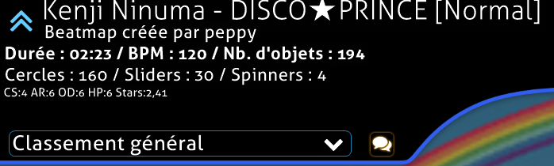

---
tags:
  - bug
  - crash
  - freeze
  - update
  - launch
  - options
  - font
  - directory
  - game
  - connection
  - bancho
  - performance
  - lag
  - glitch
  - gameplay
  - interface
  - mise à jour
  - lancement
  - police
  - dossier
  - jeu
  - connexion
---

# Client

*Page principale : [Centre d'aide](/wiki/Help_centre)*

Vous avez des problèmes avec le client de jeu ? Découvrez si votre problème figure parmi les problèmes les plus courants rencontrés par nos utilisateurs.

## Bugs & crashs {id=crash}

### J'ai changé mes paramètres, et maintenant je ne peux pas démarrer osu! ou il se fige ! {id=incorrect-settings}

**La réinitialisation d'osu! à ses paramètres par défaut résoudra ce problème dans la plupart des cas.**

Suivez ces étapes pour restaurer les paramètres par défaut d'osu! :

1. Lancez osu! tout en maintenant enfoncée la touche `Shift` de votre clavier.
2. Maintenez la touche `Shift` jusqu'à ce que vous voyiez la fenêtre de récupération d'osu!
3. Lorsque la boîte de dialogue `osu! configuration` s'ouvre, cliquez sur le bouton `reset settings`.
4. Si cela ne fonctionne pas, ouvrez à nouveau la boîte de dialogue et cliquez sur `repair osu!`.

### osu! se fige lorsque je clique sur un lien ou sur une beatmap en multijoueur ! {id=broken-links}

**Assurez-vous que vous n'exécutez pas osu! en mode de compatibilité Windows et que vous avez également défini un navigateur web par défaut dans les paramètres de votre système.**

Ce problème est parfois causé par une interaction avec le mode de compatibilité, et peut aussi être causé par le fait que le jeu ne trouve pas de navigateur par défaut pour ouvrir le lien de la page web.

#### Votre jeu fonctionne-t-il en mode de compatibilité Windows ? {id=windows-compatibility}

Pour vérifier ou modifier si votre jeu fonctionne en mode de compatibilité sous Windows, procédez comme suit :

1. Ouvrez votre dossier d'installation d'osu! et cherchez `osu!.exe`.
2. Faites un clic droit sur `osu!.exe` et sélectionnez `Propriétés` dans le menu déroulant.
3. Naviguez jusqu'à l'onglet `Compatibilité`.
4. Recherchez une case à cocher intitulée `Exécuter ce programme en mode de compatibilité pour :` dans une section intitulée `Mode de compatibilité`.
5. Si cette case est cochée, cliquez une nouvelle fois dessus pour désactiver la fonctionnalité.
6. Si votre jeu est déjà ouvert, fermez le client et rouvrez le jeu une nouvelle fois.

#### Avez-vous un navigateur web par défaut ? {id=default-browser}

**Dans la grande majorité des cas, un navigateur web par défaut est défini pour la plupart des installations Windows.**

Pour le vérifier, essayez les étapes suivantes (sous Windows 8 et plus) :

1. Ouvrez le menu Démarrer.
2. Tapez `applications par défaut` dans la barre de recherche du menu Démarrer, et cliquez sur le paramètre qui apparaît.
3. Faites défiler l'écran jusqu'à la rubrique `Navigateur Web` et vérifiez que le navigateur que vous avez installé est correctement configuré.

### Mon jeu ne se met pas à jour correctement ! {id=cannot-update}

**Cela est généralement dû à des problèmes avec votre PC, mais peut très rarement être causé par de nouvelles mises à jour.**

osu! se maintient généralement à jour sans aucune aide, mais il arrive parfois que les choses se passent mal.

Nous vous recommandons de redémarrer votre PC en premier lieu. Cela résoudra plus de problèmes que vous ne le pensez, en ce qui concerne les ordinateurs, et osu! n'est pas différent.

Assurez-vous que votre "canal de mises à jour" est réglé sur `Stable` dans les options du jeu.

Vous pouvez également essayer de forcer le jeu à se mettre à jour.

#### Modification du canal de mises à jour {id=release-stream}

**Cela peut être modifié via le menu des options du jeu.**

1. Ouvrez osu!
2. Cliquez sur le bouton `Options` du menu principal, ou appuyez sur `Ctrl` + `O`.
3. Tapez `release` dans la recherche rapide pour accéder directement à l'option.
4. Assurez-vous que le menu déroulant indique `Stable` pour recevoir la dernière version stable du jeu.

#### Forcer osu! à se mettre à jour {id=force-update}

**Vous pouvez forcer le jeu à se mettre à jour via le menu des options.**

1. Ouvrez osu!
2. Cliquez sur le bouton `Options` du menu principal, ou appuyez sur `Ctrl` + `O`.
3. Tapez `update` dans la recherche rapide pour accéder directement à l'option.
4. Cliquez sur le bouton `Lancer le logiciel de mise à jour`.

Vous pouvez également forcer le jeu à se mettre à jour en créant un fichier `help.txt` dans le répertoire d'installation d'osu!. Ce fichier n'a pas besoin de contenir quoi que ce soit ; il doit simplement exister, et le jeu forcera automatiquement une mise à jour lors de sa prochaine exécution.

### Je reçois une erreur à propos des "styles de police" lorsque j'essaie d'ouvrir le jeu ! {id=no-default-fonts}

**Vous avez supprimé ou perdu des polices système importantes fournies avec l'installation de base de Windows. Ce n'est probablement pas le seul problème que vous constatez !**

Si vous voyez cette erreur lorsque vous essayez d'ouvrir osu! ou sa mise à jour, cela signifie que vous avez supprimé ou perdu d'importantes polices système fournies avec Windows. Ces polices sont utilisées dans tout le système d'exploitation Windows, vous pouvez donc vous attendre à d'autres problèmes divers, tels que des polices incorrectes, du texte manquant et d'autres plantages d'applications dans Windows.

Voici une collection de polices courantes utilisées dans les différentes versions de Windows et sur le web qui devrait vous aider :

- [Microsoft core web fonts](https://web.archive.org/web/20020124085641/http://www.microsoft.com/typography/fontpack/default.htm) (especially Arial, Times New Roman, Trebuchet MS, and Verdana)
- [Tahoma](https://freefontsfamily.com/tahoma-font-free)
- [Windows Live Essentials](https://support.microsoft.com/en-us/help/2434419/windows-live-essentials-2011) (Segoe UI)
- [Microsoft JhengHei](https://microsoft.com/en-us/download/details.aspx?&id=12072) (微軟正黑體) (Traditional Chinese UI font)

Consultez [ce sujet](https://answers.microsoft.com/en-us/windows/forum/windows_vista-windows_programs/font-tahoma-does-not-support-style-regular/80ad7a97-230f-41d4-9101-107a0bfa986a) dans Microsoft Answers pour obtenir des conseils plus détaillés et d'autres options pour les récupérer.

### Certaines de mes beatmaps ont disparu ! {id=missing-beatmaps}

**Assurez-vous que vous ne regroupez pas vos beatmaps par quoi que ce soit en haut à droite de l'écran (c'est-à-dire que "Regrouper" doit être réglé sur "Ne rien regrouper").**

Si vous venez de télécharger une beatmap, vous pouvez essayer de rafraîchir votre liste de beatmap en appuyant sur `F5` à l'écran de sélection des beatmaps.

Assurez-vous que vous ne limitez pas les beatmaps affichées dans les options du jeu.

Pour vérifier ou modifier les beatmaps affichés dans le menu de sélection des morceaux, procédez comme suit :

1. Ouvrez osu!
2. Cliquez sur le bouton `Options` du menu principal, ou appuyez sur `Ctrl` + `O`.
3. Tapez `menu de sélection des beatmaps` dans la recherche rapide pour accéder directement à l'option.
4. Assurez-vous que l'option `Afficher les beatmaps de` est réglée sur 0 étoile, et que l'option `à` est réglée sur 10+ étoiles.

Si aucune de ces méthodes ne fonctionne, vous pouvez, en dernier recours, essayer de forcer la recréation de votre base de données beatmap. **Notez que cette opération marquera toutes vos beatmaps comme "non jouées", de sorte que la recherche et le regroupement de beatmaps par des champs qui dépendent de la date à laquelle vous les avez jouées ne fonctionneront plus**.

Pour forcer la recréation de votre base de données des beatmaps en toute sécurité, procédez comme suit :

1. Ouvrez osu!
2. Cliquez sur le bouton `Options` du menu principal, ou appuyez sur `Ctrl` + `O`.
3. Cliquez sur `Ouvrir le dossier d'osu!`.
4. Fermez osu!.
5. Trouvez le fichier `osu!.db` situé dans le dossier que vous venez d'ouvrir.
6. Faites un clic droit dessus, puis cliquez sur `Renommer`.
7. Renommez-le comme bon vous semble. Ce n'est pas important, tant que vous le ne renommez pas "osu!". Puis appuyez sur `Entrer`.
8. Relancez osu!

*Remarque : un correctif pour ce problème a été ajouté dans la version [Stable 20210519.3](https://osu.ppy.sh/home/changelog/stable40/20210519.3) datée du 19/05/2021. Si vous rencontrez toujours ce problème, veuillez [nous le faire savoir ici](https://github.com/ppy/osu-stable-issues/issues).*

### Ma liste de beatmaps défile toute seule ! {id=songs-list-scrolling}

**Cela est généralement dû à un périphérique d'entrée défectueux connecté à votre ordinateur. Essayez de débrancher les manettes ou les joysticks.**

Ces problèmes peuvent également être causés par des applications qui émulent ou modifient les combinaisons de touches, telles que *Xpadder* ou *X-Mouse Button Control*. Si vous utilisez de telles applications pour d'autres jeux, désactivez-les.

Cela peut également se produire en raison de problèmes avec les touches du pavé numérique, car elles peuvent être utilisées pour faire défiler la liste de sélection des beatmaps. Appuyez sur la touche `NumLock` pour désactiver le numpad et appuyez sur `9`, `8`, `3`, ou `2` sur le numpad pour résoudre le problème.

Vous pouvez également vérifier si les boutons de vos périphériques sont bloqués ou endommagés.

### J'ai téléchargé un beatmap pack, mais osu! essaie toujours de "réparer" le fichier ! {id=beatmap-pack-extraction}

**Vous devrez extraire le pack dans votre répertoire Songs.**

La plupart des beatmap packs sont fournis au format de fichier `.rar`, ce qui signifie qu'il s'agit d'une archive compressée de fichiers de beatmaps. Vous devrez les extraire en utilisant l'utilitaire de votre choix (nous recommandons [7-Zip](https://7-zip.org)) dans votre répertoire "Songs".

Une fois que tous les fichiers `.osz` de l'archive sont dans le répertoire `Songs`, appuyez sur `F5` dans le menu de sélection des musiques pour rafraîchir le cache des beatmaps du jeu et charger vos nouvelles musiques dans le jeu.

## Gameplay {id=gameplay}

### Mon compteur de combo, l'affichage du score ou l'affichage de la précision ont disparu ! {id=missing-interface}

**En appuyant sur les touches `Shift` + `Tab` pendant une partie, vous pourrez faire apparaître le HUD du jeu et voir à nouveau ces éléments.**

Si vous avez changé la combinaison de touches qui permet de faire apparaître ou disparaître le classement pendant une beatmap, cela ne fonctionnera pas. Vous pouvez vérifier quelle combinaison est définie dans `Options` -> `Configurer les touches` -> `In-Game` -> `Toggle Scoreboard`. Ensuite, vous pouvez substituer la touche à la place de `Tab` (par exemple, pour faire `Shift` + `V`).

### Mes scores locaux ont disparu ! {id=no-scores}

Il y a plusieurs raisons pour lesquelles cela peut se produire. Lisez ce qui suit !

#### Avez-vous récemment réinstallé le client du jeu ? {id=no-scores-reinstalling}

**La réinstallation du client de jeu effacera automatiquement tous vos scores locaux.**

Ils ont malheureusement disparu.

Les scores que vous avez envoyés sur le classement général en ligne sont toujours là, cependant - il suffit de retélécharger n'importe quelle beatmap que vous avez jouée auparavant, et votre score réapparaîtra.

Astuce : si vous êtes un osu!supporter, vous pouvez utiliser le filtre `Classée (Jouée)` dans le panneau osu!direct dans le jeu ou via [la page de liste des beatmap](https://osu.ppy.sh/beatmapsets?played=played&s=ranked) pour trouver toutes les beatmaps sur lesquelles vous avez établi des scores dans le passé.

#### Êtes-vous réglé sur le bon mode de jeu ? {id=no-scores-game-mode}

**Si vous jouez dans un autre mode de jeu (osu!taiko, osu!catch ou osu!mania), l'affichage des scores dans le jeu sera modifié pour ne montrer que les scores de ce mode. Vos scores des autres modes seront ainsi masqués.**

Une cause fréquente de ce problème est le fait de jouer des beatmaps d'un autre mode de jeu, qui règle alors automatiquement la sélection des beatmaps pour utiliser les scores de ce mode jusqu'à ce que le mode soit remis en place.

Vous pouvez changer le mode de jeu en cliquant sur le bouton `Mode` en bas à gauche de l'écran dans la sélection des beatmaps, puis en choisissant le mode dans lequel vous recherchez vos scores.

#### Avez-vous récemment téléchargé un grand nombre de beatmaps ? (par exemple, un pack ou un ensemble de beatmaps) {id=no-scores-many-maps}

**Les scores peuvent parfois mettre un peu de temps à être téléchargés depuis les serveurs du jeu si vous avez chargé beaucoup de nouvelles beatmaps en même temps.**

Jouer au jeu ou faire autre chose permettra au client de rattraper son retard en arrière-plan.

### Quelle est cette traînée blanche ou cette ligne semblable à de la fumée derrière mon curseur ? {id=smoke}

**Il s'agit d'une fonction spéciale appelée *smoke* qui peut être utilisée pour griffonner sur votre terrain de jeu pour le plaisir. Toute personne qui vous observe peut également voir ce que vous dessinez.**

Le raccourci clavier par défaut pour cette fonction est `C`, et il fonctionnera aussi longtemps que vous maintenez le bouton enfoncé. Vous pouvez le modifier à tout moment dans la section `osu!` de la boîte de dialogue des options `Configurer les touches`.

### Comment sauvegarder le replay d'un score que je viens de faire ? {id=save-replay}

**Entrez dans l'écran des résultats en cliquant sur le score dans votre classement local, et appuyez sur le bouton `F2`.**

Ceci sauvegardera votre nouveau score sous forme de fichier `.osr` dans le dossier /Replays/ du répertoire d'installation par défaut d'osu!

osu! sauvegarde aussi automatiquement tous les replays après avoir terminé une musique dans le dossier caché `/Data/r/`, également contenu dans le répertoire d'installation d'osu!

Veuillez noter que si aucun replay n'a été sauvegardé pour ce score, vous ne pourrez pas récupérer un replay de cette manière.

### osu! me dit que mon client est trop vieux ! {id=old-client}

**Il est temps de faire une mise à jour ! Les très anciennes versions du jeu ne peuvent plus envoyer de nouveaux scores, vous devrez donc forcer une mise à jour en allant dans `Options` -> `Général` -> `Lancer le logiciel de mise à jour`.**

Si cela ne fonctionne pas, vous pouvez fermer osu! et redémarrer osu!.exe en maintenant la touche `Shift` enfoncée. Cela vous fournira quelques options de mise à jour et de réparation, dont l'une consiste à mettre à jour votre jeu à la dernière version.

### Mes scores ne s'envoient pas ! {id=no-submission}

Oups ! Il y a plusieurs raisons pour lesquelles cela peut arriver. Passons-les en revue :

#### Étiez-vous connecté à internet pendant que vous jouiez ? {id=no-submission-no-connection}

**Si vous n'avez pas pu accéder à internet lorsque vous avez terminé votre partie, il se peut que le score ne soit pas envoyé.**

Cela peut être frustrant si vous jouez sur une connexion instable, mais osu! fera de son mieux pour envoyer votre score tant que vous laisserez le client ouvert.

#### Est-ce que votre pare-feu local ou votre anti-virus autorise osu! à accéder à internet ? {id=no-submission-firewall}

**Certains pare-feu ou anti-virus peuvent empêcher osu! d'accéder à internet, ce qui l'empêchera d'envoyer des scores.**

Vérifiez dans le logiciel de votre choix que le fichier `osu!.exe` se trouvant dans le répertoire où vous avez installé le jeu est autorisé à accéder à internet.

#### Faites-vous tourner beaucoup de programmes en arrière-plan ? {id=no-submission-software}

**Certains peuvent interférer avec votre capacité à soumettre des scores.**

Essayez de fermer tout programme supplémentaire avant de jouer à osu! si vous constatez que vos scores ne sont pas soumis et que vous n'avez pas de problèmes de connectivité ailleurs.

#### Les statuts de vos beatmaps sont-ils corrects ? {id=no-submission-beatmap-status}

**Parfois, les statuts de vos beatmaps peuvent ne pas être les bons, ce qui signifie que les scores que vous avez réalisés ne peuvent pas être soumis.**

Dans le menu de sélection des beatmaps, vérifiez la présence de petites icônes en haut à gauche de l'écran (par exemple, une beatmap classée devrait afficher une icône en forme de flèche bleue en haut à gauche). Si vos beatmaps n'affichent aucune icône, ou affichent une icône incorrecte, vos scores ne peuvent pas être soumis.

Jouer avec le `Classement général` sélectionné, plutôt qu'avec le classement local, peut aider à empêcher cela. Si un grand nombre de vos beatmaps, ou toutes vos beatmaps, n'ont pas de statut ou ont des statuts incorrects, essayez de forcer la recréation de votre fichier de base de données de beatmaps. Vous pouvez découvrir comment le faire en toute sécurité dans la section "[Certaines de mes beatmaps ont disparu !](#missing-beatmaps)". Après avoir effectué cette opération, il se peut que cela prenne un certain temps pour que toutes vos beatmaps retrouvent leur statut correct.

#### Les serveurs de soumission des scores sont-ils opérationnels ? {id=no-submission-servers}

**La réponse est presque toujours oui, mais vous pouvez vérifier sur le site [osu! server status](https://status.ppy.sh) ou sur le [Twitter @osustatus](https://twitter.com/osustatus) si tout fonctionne bien de notre côté.**

Si les serveurs sont hors ligne, ne fermez pas osu! jusqu'à ce que nous ayons résolu les problèmes et que les serveurs se remettent en marche. Le jeu essaiera de soumettre à nouveau votre score pendant une heure avant d'abandonner.

### Pouvez-vous télécharger un score que j'ai réalisé pour moi ? {id=upload-replay}

**Malheureusement, nous ne pouvons pas publier vos scores sur demande.**

Si un score n'a pas été envoyé pour des raisons techniques ou autres, le mieux que vous puissiez espérer est de répéter votre performance et de l'obtenir à nouveau. Désolé !

### Les notes semblent désynchronisées ou décalées par rapport à la musique ! {id=offsync-notes}

**Cela peut être dû à un logiciel de traitement du son exécuté sur votre machine, tel que *Razer Surround Audio*. Cela peut aussi être dû à un mauvais réglage de votre `Universal Offset`.**

Essayez de fermer tous les programmes qui modifient ou influencent le son sortant de votre ordinateur. Si cela n'aide pas, vous pouvez essayer d'ajuster votre `Universal Offset`.

Chaque configuration matérielle individuelle a un `Universal Offset` particulier qui détermine si vous entendez l'audio du jeu un peu plus tard ou plus tôt.

La valeur par défaut convient à la plupart des joueurs, mais si vous trouvez qu'elle ne vous convient pas, vous pouvez la modifier en suivant les étapes suivantes :

1. Ouvrez osu!
2. Cliquez sur le bouton `Options` du menu principal, ou appuyez sur `Ctrl` + `O`.
3. Tapez `décalage audio` dans la barre de recherche rapide. Vous obtiendrez ainsi le décalage global actuel utilisé par votre client.
4. Utilisez le curseur pour ajuster votre décalage universel. Vous pouvez également utiliser l'[assistant de décalage](/wiki/Client/Options/Offset_Wizard) pour vous aider dans ce processus.

Si cela ne suffit toujours pas, vous pouvez essayer de mettre à jour les pilotes audio de votre carte son ou de votre carte mère.

### Mon jeu a l'air défectueux, comme si les graphiques étaient déchirés ! {id=screen-tearing}

**Ceci est dû à un effet appelé [screen tearing](https://en.wikipedia.org/wiki/Screen_tearing) et peut être corrigé en réglant l'option du jeu `Images par seconde` sur `VSync`.**

Il s'agit d'un effet totalement inoffensif (bien que laid !) qui se produit parce que le taux de rafraîchissement du jeu n'est pas synchronisé avec celui de votre écran.

Vous pouvez également essayer de jouer en mode fenêtré ou sans bordure, ce qui vous permettra d'utiliser le mode VSync natif de votre système d'exploitation.

Activer VSync ou jouer en mode fenêtré ou sans bordure créera malheureusement un *léger* décalage d'entrée. Pour la plupart des joueurs, cela ne posera pas de gros problèmes.

Les cartes graphiques NVIDIA plus récentes ont une option globale dans le panneau de configuration NVIDIA pour régler le taux de rafraîchissement global sur un paramètre appelé 'Rapide', qui résoudra également ce problème.

## Fonctions en ligne {id=online-features}

### Je ne peux pas me connecter à mon compte ou au jeu ! {id=cannot-sign-in}

**Assurez-vous qu'osu! peut accéder correctement à internet par le biais de tout pare-feu ou de tout anti-virus que vous avez installé sur votre ordinateur.**

Voici quelques moyens de permettre aux applications d'avoir accès à Internet à travers plusieurs antivirus courants :

#### Autoriser un programme à travers le Pare-feu Windows {id=firewall-whitelist-windows}

**Sur la plupart des installations Windows, le Pare-feu Windows est le logiciel pare-feu par défaut.**

Pour s'assurer qu'osu! puisse accéder à internet, nous devrons l'autoriser à communiquer par le biais du Pare-feu Windows. Voici comment ajouter osu! à la liste des programmes autorisés :

1. Ouvrez le menu Démarrer.
2. Tapez `Autoriser une application` dans la barre de recherche du menu Démarrer.
3. Vous devriez voir une correspondance du Panneau de configuration intitulée `Autoriser les applications à communiquer à travers le Pare-feu Windows`. Cliquez dessus.
4. Un panneau contenant une grande liste d'applications avec deux cases à cocher à côté d'elles s'ouvrira. Cliquez sur n'importe quelle application, puis appuyez sur la touche `o`. La liste se déroulera jusqu'à toutes les applications commençant par 'o'.
5. Cherchez `osu!` ou `osu!.exe`.
6. Si ni l'un ni l'autre ne sont présents, cliquez sur `Autoriser une autre application...` en bas du panneau et cherchez le répertoire d'installation de votre osu! et choisissez `osu!.exe`.
7. Assurez-vous que les cases `Privé` et `Public` sont cochées. Cliquez sur OK pour enregistrer vos paramètres et réessayez.

#### Autoriser un programme à travers le Pare-feu AVG {id=firewall-whitelist-avg}

Veuillez consulter l'entrée de la [base de connaissances officielle d'AVG sur le sujet](https://support.avg.com/SupportArticleView?l=fr&urlName=AVG-Antivirus-Enhanced-Firewall-Application-Rules&supportType=home) pour obtenir des instructions détaillées sur la manière de procéder.

#### Autoriser un programme à travers Kaspersky Internet Security {id=firewall-whitelist-kaspersky}

Veuillez consulter l'[article d'aide officiel](https://support.kaspersky.com/15163#block2) de Kaspersky sur l'ajout d'applications à la zone de confiance.

#### Autoriser un programme à travers McAfee {id=firewall-whitelist-mcafee}

Veuillez consulter [l'entrée officielle de la base de connaissances sur le sujet](https://service.mcafee.com/?articleId=TS100813&locale=fr-CA&page=shell&shell=article-view) de McAfee.

### J'ai ajouté osu! à mon pare-feu mais je ne peux toujours pas me connecter au jeu ! {id=sign-in-unknown-cause}

**Nous aurons besoin d'informations supplémentaires de votre part pour nous aider à résoudre ce problème.**

Si vous rencontrez toujours des problèmes de connexion à nos serveurs de jeu, veuillez soumettre un ticket d'assistance en envoyant un e-mail à [accounts@ppy.sh](mailto:accounts@ppy.sh). Les informations suivantes nous aideront à résoudre votre problème rapidement :

- Un log de sortie de la commande `tracert` pour les serveurs `cho.ppy.sh`, `osu.ppy.sh` et `m1.ppy.sh` (voir plus bas pour les instructions).
- Le fichier `network.log` du dossier `Logs` de votre répertoire d'installation d'osu!

#### Exécution d'une trace route pour résoudre les problèmes de connexion {id=traceroute}

**Une trace route nous aidera à détecter exactement où se situe le problème entre vous et nos serveurs.**

Vous pouvez effectuer une trace route en ouvrant l'invite de commande et en exécutant la commande `tracert`.

Pour ouvrir l'Invite de commande, maintenez la touche `Windows` enfoncée et appuyez sur `R`, puis tapez `cmd` et cliquez sur `OK`. Pour plus d'informations, consultez cet [article de la base de connaissances Windows](https://support.microsoft.com/fr-fr/topic/how-to-use-tracert-to-troubleshoot-tcp-ip-problems-in-windows-e643d72b-2f4f-cdd6-09a0-fd2989c7ca8e).

Vous pouvez ensuite taper la commande trace route dans la console. Par exemple, la commande `tracert cho.ppy.sh` suivra la façon dont votre ordinateur se connecte au serveur de jeu sur Internet. Le trace route prend un peu de temps, parfois plus d'une minute ou plus selon votre connexion.

Nous aurons besoin des résultats d'une trace route pour les serveurs suivants : `cho.ppy.sh`, `osu.ppy.sh`, et `m1.ppy.sh`.

Pour copier les résultats de la commande, il suffit de cliquer et de faire glisser du bas de la sortie vers le haut de façon à ce que les informations deviennent blanches, puis de cliquer avec le bouton droit de la souris pour les copier instantanément dans votre presse-papiers.

### J'ai reçu une erreur côté serveur lorsque j'ai essayé de jouer en ligne ! {id=server-side-error}

**Les serveurs peuvent avoir des problèmes.**

Consultez la page [osu! server status](https://status.ppy.sh/ "osu! server status") pour voir s'il y a des problèmes avec les serveurs.

**Cela peut également se produire si vous utilisez une connexion Internet partagée, un proxy ou un VPN.**

Essayez d'utiliser un autre proxy ou un autre fournisseur de VPN. Si tout cela échoue, envoyez un ticket d'assistance par e-mail à [accounts@ppy.sh](mailto:accounts@ppy.sh).

S'il ne s'agit d'aucune des options ci-dessus, vous devrez envoyer un ticket d'assistance, car votre connexion a probablement été mise sur liste noire par erreur.

Tor ou les réseaux associés au relais Tor ne se connecteront pas aux serveurs de jeu pour la plupart. Bien que nous ne condamnions ni n'approuvions l'utilisation de Tor, nous appliquons cette politique pour éviter que d'éventuels mauvais acteurs utilisent Tor.

### Je suis devenu un osu!supporter mais mon nom n'est pas jaune dans le jeu ! {id=white-username}

**Vous apparaitrez toujours blanc pour vous-même sur le client du jeu. Mais les autres utilisateurs verront votre éclatante couleur jaune !**

Cela permet de différencier vos propres messages de ceux des autres. Il n'est pas possible de le désactiver pour l'instant.

## Performance {id=performance}

### Comment puis-je faire fonctionner osu! moins vite si mon ordinateur surchauffe ? {id=overheating}

**Le moyen le plus simple est de modifier les paramètres des images par seconde.**

Pour vérifier le réglage des images par seconde, procédez comme suit :

1. Ouvrez osu!
2. Cliquez sur le bouton `Options` du menu principal, ou appuyez sur `Ctrl` + `O`.
3. Tapez `images par seconde` dans la recherche rapide pour faire apparaître les options des images par seconde.

Si vos images par seconde sont réglées sur `Illimité (en jeu)`, vous pourrez constater une amélioration importante en utilisant une des trois autres options.

`VSync` fera tourner le jeu à un taux de rafraîchissement égal à celui de votre écran principal, tandis que `Power Saving` et `Optimal` feront tourner le jeu à deux et huit fois le taux de rafraîchissement de votre écran, jusqu'à 960Hz.

Nous recommandons d'utiliser `VSync` dans les situations où la surchauffe est un problème.

Vous pouvez également rechercher des utilitaires qui vous permettent de contrôler manuellement la vitesse des ventilateurs de votre processeur et de votre GPU.

### Mon PC redémarre en jouant à osu! {id=reboot-overheating}

**La plupart du temps, cela est dû à la surchauffe d'un ou plusieurs composants de votre ordinateur, généralement votre carte graphique ou votre CPU.**

Pour trouver la cause de ce problème, nous vous recommandons d'utiliser un moniteur de température GPU/CPU et de garder un œil dessus pendant que vous jouez à osu! en arrière-plan. Un bon choix de programme à utiliser pour cela serait [Speccy](https://www.ccleaner.com/speccy).

Si vous remarquez que la température de votre GPU ou de votre CPU dépasse les valeurs de 90°C ou 194°F, votre ordinateur est très chaud et se rapproche dangereusement de la plupart des seuils d'arrêt automatique.

### Mon ordinateur ne surchauffe pas, mais le jeu provoque quand même un redémarrage de mon ordinateur ! {id=reboot-faulty-device}

**La cause la plus fréquente des redémarrages forcés après des problèmes de surchauffe est un problème de carte son, suivi d'un dysfonctionnement des périphériques connectés à votre ordinateur.**

Les anciens pilotes de carte son ou logiciels peuvent causer des problèmes avec osu!, mais ce n'est pas un problème pour la plupart des gens. Essayez de mettre à jour les pilotes de votre carte son ou de votre carte mère.

Vous pouvez également essayer de retirer certains des périphériques connectés par USB à votre ordinateur, surtout s'ils interagissent avec le son de quelque manière que ce soit. Les casques ou les cartes son USB peuvent parfois causer des problèmes si eux-mêmes ou le port dans lequel ils se trouvent commencent à mal fonctionner.

### C'est toujours le cas ! {id=reboot-nothing-helps}

Si rien de tout cela ne vous aide, veuillez envoyer un ticket d'assistance à [accounts@ppy.sh](mailto:accounts@ppy.sh) avec plus d'informations sur le problème - y compris les spécifications techniques de votre ordinateur, le modèle (le cas échéant), et toute autre information qui, selon vous, pourrait nous aider à discerner la cause de votre problème.

### Je ne peux pas tenir plus de quelques touches à la fois en jouant à osu!mania {id=keyboard-ghosting}

**Ceci est dû à un problème matériel commun à la plupart des claviers appelé *ghosting*.**

Le ghosting est un sujet quelque peu complexe, mais il se résume essentiellement à des problèmes de fabrication de votre clavier qui l'empêchent d'envoyer les entrées de plus de quelques touches à la fois depuis certains endroits du clavier.

La plupart des claviers récents permettent de maintenir jusqu'à **6** touches enfoncées en même temps, mais dans des combinaisons aléatoires.

Vous pouvez tester les limites du ghosting de votre clavier en utilisant l'utilitaire Anti-Ghosting de [drakeirving](https://drakeirving.github.io/MultiKeyDisplay).

Bien que les critères de classement d'osu!mania tentent d'atténuer le problème du ghosting en ne permettant pas à plus de 6 notes d'être actives en même temps, vous pouvez rencontrer ce problème si votre clavier est plus ancien.

La seule véritable solution est d'acheter un clavier capable de supporter un plus grand nombre de pressions simultanées sur les touches. Vous pouvez rechercher une fonction connue sous le nom de *n-key rollover* (ou *NKRO*). Les claviers NKRO ne présentent généralement pas de problèmes de ghosting, mais ils sont généralement chers.

### Mon curseur devient fou à chaque fois que j'essaie de jouer à osu! {id=crazy-cursor}

**La cause la plus courante de ce problème est le réglage trop élevé de la sensibilité de votre souris dans le jeu.**

Les mouvements saccadés et erratiques en sont un excellent exemple, surtout si vous utilisez une tablette.

Le réglage de la sensibilité du jeu à 1,0x (valeur par défaut) résout le problème dans la plupart des cas, mais peut rendre votre curseur lent. Nous vous suggérons d'activer la fonction `raw input` dans les options du jeu et d'utiliser les pilotes du périphérique de votre choix pour modifier la sensibilité.

Vous pouvez également ajuster le paramètre *DPI* de votre souris, si vous en utilisez une. Des paramètres DPI plus élevés fournissent un positionnement plus précis au client du jeu et peuvent atténuer les tremblements.

Nous vous suggérons également de vous assurer que vos périphériques sont propres et exempts de saleté ou de débris. Un cheveu ou un peu de poussière devant le capteur optique d'une souris peut avoir des effets très étranges sur la façon dont le curseur se déplace.

#### Activation du raw input {id=raw-input}

**Le raw input oblige le jeu à utiliser un moyen plus propre et plus direct pour accéder aux informations de vos périphériques. Cela augmente généralement la précision de la sortie du périphérique.**

Pour activer le raw input, suivez ces étapes :

1. Ouvrez osu!
2. Cliquez sur le bouton `Options` du menu principal, ou appuyez sur `Ctrl` + `O`.
3. Tapez `raw` dans la recherche rapide pour accéder directement à l'option.
4. Cliquez sur le paramètre `Contourner le pilote du dispositif de pointage` pour l'activer.

### Je joue depuis une tablette et mon curseur est trop lent ! {id=slow-cursor}

**Vous pouvez résoudre ce problème en définissant une zone de tablette plus petite pour votre appareil.**

Sur la plupart des tablettes Wacom, cela se fait via l'onglet `Mapping` de l'application `Wacom Tablet Properties`.

Vous devrez consulter le fabricant de votre tablette pour savoir comment régler la zone de votre tablette pour votre périphérique particulier.

Toutes les tablettes de la marque osu! prennent en charge le raw input par défaut, et leur sensibilité peut être facilement ajustée à la volée en utilisant l'option de raw input dans le jeu et en utilisant le curseur de sensibilité de la souris.

### Je ressens des pics de lag ou du stuttering pendant le jeu ! {id=lag-spikes}

**Il y a de nombreuses raisons pour lesquelles le jeu peut fonctionner de manière instable, qu'il s'agisse de programmes sur votre ordinateur, de pilotes obsolètes ou simplement de paramètres trop élevés.**

#### Avez-vous beaucoup de programmes ouverts en même temps lorsque vous jouez à osu! ? {id=lag-too-many-programs}

**Certains processus d'arrière-plan peuvent se battre avec osu! pour les ressources et rendre le jeu très désagréable.**

Essayez de fermer certains ou tous les programmes dont vous n'avez pas besoin pendant que vous jouez.

#### Votre ordinateur est-il sécurisé ? {id=lag-infected-pc}

**Les virus, les logiciels espions, les logiciels malveillants et autres logiciels indésirables peuvent causer de graves problèmes de performance, même sur les ordinateurs haut de gamme.**

Gardez votre ordinateur propre et sûr et vous pourrez constater une amélioration. Essayez d'exécuter une analyse antivirus sur votre ordinateur pour trouver et éliminer ces problèmes.

#### Quel âge a votre ordinateur ? {id=lag-old-pc}

**Les très vieux ordinateurs qui utilisent des chipsets graphiques intégrés Intel encore plus anciens peuvent ne pas être assez puissants pour gérer osu! du tout, même avec les paramètres les plus bas.**

Le seul moyen de faire face à cette situation est de mettre à niveau votre ordinateur !

#### Vos pilotes sont-ils à jour ? {id=lag-old-driver}

**Les anciens pilotes peuvent causer de graves problèmes de performances. Dans la mesure du possible, veillez à ce que tous vos pilotes soient à jour.**

Les pilotes de cartes graphiques sont particulièrement importants pour osu!, de même que les pilotes de cartes son.

#### Utilisez-vous un hub USB pour connecter de nombreux périphériques USB à votre ordinateur via un seul câble USB ? {id=lag-faulty-usb}

**La connexion d'un trop grand nombre de périphériques à un port via un répartiteur peut provoquer un décalage d'entrée difficile à détecter mais qui peut sérieusement perturber votre jeu.**

Une solution simple consiste à débrancher brièvement votre hub USB. Si votre décalage disparaît, vous savez pourquoi !

#### Est-ce que vous exécutez osu! en mode fenêtré ou sans bordure ? {id=lag-windowed}

**Les modes fenêtré et sans bordure créent tous deux un délai d'entrée *considérable*. Le mode plein écran est optimal pour une expérience de jeu plus fluide.**

#### Votre jeu se fige-t-il pendant un instant ou deux ? {id=lag-background-process}

**Parfois, les processus d'arrière-plan ou d'autres applications sur votre ordinateur peuvent envoyer de grosses demandes de ressources en une seule fois, ce qui rendra votre ordinateur instable.**

Ce problème se résout généralement après avoir fermé tout ce qui n'est pas essentiel avant de jouer à osu!. Les logiciels de torrent sont les principaux responsables de ce problème, surtout s'ils partagent l'espace avec le disque sur lequel osu! est installé.

#### Le jeu a-t-il été récemment mis à jour ? {id=lag-after-update}

**Parfois, après une mise à jour du jeu, le client peut avoir des difficultés sans raison apparente.**

Si vous avez beaucoup de beatmaps, attendez au moins 10 à 15 minutes avant de donner la responsabilité du lag à la mise à jour. Le client osu! peut être en train de retraiter vos beatmaps pour calculer leur difficulté.

Si le problème ne se résout pas, un redémarrage peut parfois aider.

**Si vous rencontrez toujours des pics de lag ou du stuttering pendant la partie, consultez le [guide de dépannage des performances](/wiki/Performance_troubleshooting) pour d'autres problèmes connexes et leurs solutions.**
