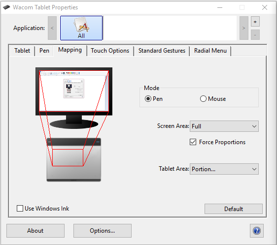

---
tags:
  - bug
  - crash
  - freeze
  - update
  - launch
  - options
  - font
  - directory
  - game
  - connection
  - bancho
  - performance
  - lag
  - glitch
  - gameplay
  - interface
  - баг
  - вылет
  - краш
  - крэш
  - сломалась
  - не работает
  - зависает
  - виснет
  - обновление
  - не обновляется
  - не запускается
  - настройки
  - опции
  - шрифт
  - шрифты
  - директория
  - папка
  - игра
  - подключение
  - соединение
  - лагает
  - лаги
  - лаг
  - интерфейс
---

# Игровой клиент

*Основная статья: [Справочный центр](/wiki/Help_centre)*

Что-то случилось с игрой? Ниже — список наиболее частых проблем и их возможных решений.

## Баги и вылеты {id=crash}

### После смены настроек osu! не запускается или виснет {id=incorrect-settings}

**Обычно это можно исправить, вернув настройки по умолчанию.**

Чтобы вернуть настройки по умолчанию, выполните следующие шаги:

1. Зажмите клавишу `Shift` и запустите osu!.
2. Не отпускайте `Shift`, пока не увидите небольшое окно с настройками.
3. Когда появится окно с заголовком `osu! configuration`, нажмите на кнопку `reset settings`.
4. Если это не помогло, снова откройте окно с настройками (шаги 1–2) и нажмите на кнопку `repair osu!`.

### osu! зависает при попытке открыть ссылку или карту в мультиплеере {id=broken-links}

**Проверьте, что osu! не запущена в режиме совместимости с Windows, и что в системе выбран браузер по умолчанию.**

К подобным зависаниям может приводить как режим совместимости, так и то, что игра не «знает», в каком браузере открывать ссылку.

#### Как обнаружить и отключить запуск в режиме совместимости в Windows {id=windows-compatibility}

Выполните следующие шаги:

1. Откройте директорию, куда установлена osu!, и найдите файл `osu!.exe`.
2. Кликните правой кнопкой мыши по `osu!.exe` и выберите пункт `Свойства` в выпадающем меню.
3. В появившемся окошке откройте вкладку `Совместимость`.
4. Найдите флажок с подписью `Запустить программу в режиме совместимости`.
5. Если флажок выставлен, снимите его, кликнув левой кнопкой мыши.
6. Если игра уже запущена, закройте её и запустите заново.

#### Как проверить, что в системе выбран браузер по умолчанию {id=default-browser}

**В подавляющем большинстве случаев в Windows уже выбран браузер по умолчанию.**

Выполните следующие шаги (версия Windows — 8 и выше):

1. Откройте меню «Пуск».
2. Введите в поисковой строке `приложения по умолчанию` и откройте первую найденную настройку.
3. Найдите пункт под названием `Веб-браузер` и убедитесь, что там выбран нужный вам браузер.

### osu! не может обновиться {id=cannot-update}

**В большинстве случаев проблема связана с вашим компьютером, и редко — с недавними обновлениями.**

osu! обычно обновляется самостоятельно, но иногда этот процесс ломается.

Рекомендуется начать с перезагрузки компьютера. Как ни странно, это помогает против многих проблем, в том числе и в osu!.

Проверьте, что в настройках osu! в списке веток обновлений выбрана `стабильная` ветка.

Кроме того, можно принудительно запустить обновление.

#### Как поменять ветку обновлений {id=release-stream}

**Сменить ветку можно в настройках игры.**

1. Запустите osu!.
2. Кликните по кнопке `Options` в главном меню или нажмите `Ctrl` + `O`.
3. Введите в поисковой строке `ветка` или `release` для перехода к нужной настройке.
4. Убедитесь, что выбрана `стабильная` ветка обновлений.

#### Как принудительно запустить обновление osu! {id=force-update}

**Принудительное обновление можно запустить из настроек игры.**

1. Запустите osu!.
2. Кликните по кнопке `Options` в главном меню или нажмите `Ctrl` + `O`.
3. Введите в поисковой строке `апдейтер` или `update` для перехода к нужной настройке.
4. Нажмите на кнопку `Запустить апдейтер`.

Помимо этого, можно заставить osu! обновиться, если внутри её установочной директории создать файл `help.txt`. Вписывать туда ничего не нужно: достаточно создать файл, и при следующем запуске игра начнёт обновляться.

### При запуске игры возникает ошибка с текстом про "font styles" {id=no-default-fonts}

**В вашей системе не установлены шрифты из стандартного набора, идущего в комплекте с Windows. Возможно, это проявляется и в других программах.**

Подобная ошибка при запуске или обновлении osu! показывает, что из Windows пропали (самостоятельно или с вашей помощью) шрифты из стандартного набора. Поскольку они широко используются самой операционной системой и многими программами, вы наверняка столкнётесь с похожими проблемами — пропажа надписей, странные шрифты, вылеты — не только в osu!.

Ниже перечислены шрифты, используемые в разных версиях Windows и на различных веб-сайтах. Их установка должна помочь:

- [Microsoft core web fonts](https://web.archive.org/web/20020124085641/http://www.microsoft.com/typography/fontpack/default.htm) (конкретно — Arial, Times New Roman, Trebuchet MS и Verdana)
- [Tahoma](https://freefontsfamily.com/tahoma-font-free)
- [Windows Live Essentials](https://support.microsoft.com/en-us/help/2434419/windows-live-essentials-2011) (Segoe UI)
- [Microsoft JhengHei](https://microsoft.com/en-us/download/details.aspx?&id=12072) (微軟正黑體) (шрифт для традиционного китайского)

Более подробные рекомендации и советы по восстановлению шрифтов даны в [теме на Microsoft Answers](https://answers.microsoft.com/en-us/windows/forum/windows_vista-windows_programs/font-tahoma-does-not-support-style-regular/80ad7a97-230f-41d4-9101-107a0bfa986a).

### Некоторые карты пропали {id=missing-beatmaps}

**Убедитесь, что у вас не включена группировка карт в правом верхнем углу osu! (напротив надписи `Группировать` должно быть выбрано `Всё вместе`).**

Если вы только что скачали карту и не можете её найти, нажмите `F5` на экране выбора песни.

Проверьте, что в настройках osu! не включена фильтрация по числу звёзд. Выполните следующие шаги:

1. Запустите osu!.
2. Кликните по кнопке `Options` в главном меню или нажмите `Ctrl` + `O`.
3. Введите в поисковой строке `список песен` или `song select` для перехода к нужной настройке.
4. Убедитесь, что первое значение настройки `Показывать карты от ... до ...` выставлено в 0, а второе — в 10+.

Если ничего не помогло, попробуйте удалить базу данных карт, чтобы она пересоздалась. **Это действие пометит все ваши карты как несыгранные, после чего их нельзя будет группировать и сортировать по дате прохождения или результату.**

Чтобы безопасно удалить базу данных карт, выполните следующие шаги:

1. Запустите osu!.
2. Кликните по кнопке `Options` в главном меню или нажмите `Ctrl` + `O`.
3. Нажмите на кнопку `Открыть директорию osu!`.
4. Закройте osu!.
5. В открывшемся окне проводника найдите файл `osu!.db`.
6. Кликните по нему правой кнопкой мыши и выберите `Переименовать`.
7. Дайте файлу любое другое имя и нажмите `Enter`.
8. Запустите osu!.

*Примечание: эта проблема исправлена в версии [Stable 20210519.3](https://osu.ppy.sh/home/changelog/stable40/20210519.3), вышедшей 19 мая 2021 г. Если карты пропадают в более новой версии osu!, [сообщите нам об этом](https://github.com/ppy/osu-stable-issues/issues).*

### Список карт постоянно пролистывается {id=songs-list-scrolling}

**Чаще всего причина кроется в неисправном устройстве ввода. Отсоедините от компьютера все джойстики и контроллеры.**

Такой эффект могут давать программы, которые переназначают клавиши или эмулируют их нажатия, например, *Xpadder* или *X-Mouse Button Control*. Выйдите из подобных программ или отключите их.

Ещё одной причиной могут быть неисправные клавиши на цифровой клавиатуре — их также можно использовать для прокрутки. Нажмите клавишу `NumLock` для отключения цифровой клавиатуры, а затем нажмите на ней `9`, `8`, `3` или `2`.

Помимо этого, стоит проверить, нет ли на каком-то из устройств, подключённых к компьютеру, залипших или сломанных клавиш.

### После скачивания архива с картами osu! постоянно пытается его «починить» {id=beatmap-pack-extraction}

**Архив необходимо самостоятельно извлечь в директорию Songs.**

Большинство архивов с картами — это файлы формата `.rar`, не являющиеся самостоятельными картами. Их нужно распаковать с помощью какого-нибудь архиватора (мы рекомендуем [7-Zip](https://7-zip.org)) в директорию Songs.

Когда все файлы формата `.osz`, находившиеся в архиве, окажутся в директории `Songs`, нажмите `F5` на экране выбора песни, чтобы osu! их подгрузила.

## Геймплей {id=gameplay}

### У меня пропал интерфейс (комбо, очки, точность) {id=missing-interface}

**Чтобы вернуть интерфейс, нажмите `Shift` + `Tab` во время игры.**

Это не сработает, если вы поменяли клавишу, скрывающую таблицу рекордов. Откройте настройки, найдите кнопку `Назначение клавиш`, затем — раздел `In-Game` и посмотрите, какая клавиша указана напротив `Toggle Scoreboard`. Используйте её вместо `Tab` (например, не `Shift` + `Tab`, а `Shift` + `V`).

### Пропали локальные рекорды {id=no-scores}

Причин может быть несколько.

#### Недавняя переустановка игры {id=no-scores-reinstalling}

**Переустановка osu! стирает все ваши локальные рекорды.**

Безвозвратно.

Онлайн-рекорды, напротив, никуда не делись — вы их увидите, если скачаете пройденные карты.

Полезный совет: если у вас есть osu!supporter, все сыгранные карты можно найти через osu!direct или на [веб-сайте osu!](https://osu.ppy.sh/beatmapsets?played=played&s=ranked), если включить фильтр `Ranked (Played)`.

#### Неправильный режим игры {id=no-scores-game-mode}

**Во время игры в другом режиме (osu!taiko, osu!catch или osu!mania) osu! будет показывать рекорды только для него. Рекорды, поставленные в других режимах, будут скрыты.**

Скорее всего, вы сыграли сложность другого игрового режима — рекорды будут показываться только для него, пока вы снова не смените режим.

Чтобы сменить режим игры, нажмите на кнопку `Mode` в левом нижнем углу экрана и выберите нужный пункт.

#### Вы скачали очень много карт (например, в архиве) {id=no-scores-many-maps}

**Если импортировать очень много карт, то osu! будет дольше загружать поставленные на них рекорды.**

Поиграйте какое-то время или позанимайтесь своими делами — за это время карты обработаются.

### За курсором тянется какой-то белый след {id=smoke}

**Это дым, которым можно рисовать на игровом поле. Рисунки и надписи, сделанные дымом, видны всем, кто следит за вашей игрой.**

По умолчанию дым активируется, когда вы удерживаете клавишу `C`. Её можно переназначить в настройках: найдите в них кнопку `Назначение клавиш`, затем — раздел `osu!`, и в нём — строчку `Smoke`.

### Как сохранить реплей? {id=save-replay}

**Кликните по рекорду в таблице, чтобы открыть окно результатов, а затем нажмите `F2`.**

После этого реплей будет сохранён в формате `.osr` в директорию `Replays` внутри установочной директории osu!.

osu! автоматически записывает реплеи всех успешных прохождений карт — их можно найти в скрытой директории `Data/r` внутри установочной директории osu!.

Если реплей не был записан во время прохождения карты, его не получится сохранить.

### osu! пишет, что версия клиента устарела {id=old-client}

**Пора обновляться: в достаточно старых версиях клиента нельзя ставить онлайн-рекорды. Чтобы обновить osu!, в главном меню выберите пункт `Options` и найдите кнопку `Запустить апдейтер`.**

Если это не сработало, см. пункт «[Как принудительно запустить обновление osu!](#force-update)».

### Рекорды не отправляются на сервер {id=no-submission}

Беда. Причин может быть несколько:

#### Пропало подключение к интернету {id=no-submission-no-connection}

**Если вы поставили рекорд во время проблем с подключением к интернету, то он может отправиться далеко не сразу.**

Если не закрывать окно с osu!, игра будет пытаться отправить ваш рекорд, пока у неё не получится. Учитывайте это, если у вас нестабильный интернет (сочувствуем).

#### Файервол или антивирус блокируют osu! {id=no-submission-firewall}

**Некоторые файерволы или антивирусы могут блокировать osu! доступ в интернет, и игра не сможет отправлять ваши рекорды.**

Если у вас установлен файервол или антивирус, откройте его настройки и убедитесь, что для `osu!.exe` в директории, куда вы установили игру, разрешён доступ в интернет.

#### Одновременно с osu! запущено слишком много программ {id=no-submission-software}

**Некоторые программы могут мешать osu! использовать интернет-соединение.**

Если у вас нет проблем с подключением или скоростью интернета, но рекорды не отправляются, закройте остальные программы, работающие вместе с osu!.

#### У карт сбросились статусы {id=no-submission-beatmap-status}

**Изредка у скачанных карт может поменяться их статус, что помешает отправке рекордов.**

Откройте экран выбора песни, выберите какую-нибудь карту и посмотрите в левый верхний угол — там должна быть маленькая иконка (например, у ранкнутых карт там будет двойная синяя стрелка). Если там нарисован знак вопроса, или вообще ничего нет, рекорды могут не отправляться именно из-за этого.

В некоторых ситуациях сброс статуса можно исправить, открыв перед началом игры таблицу мировых рекордов. Если статус сбросился у многих карт (или вообще у всех), попробуйте [удалить базу данных карт](#missing-beatmaps). После этого у карт должны вскоре появиться правильные статусы.

#### Сервера osu! могли не работать {id=no-submission-servers}

**У серверов osu! иногда бывают проблемы. Об инцидентах можно узнать на [странице состояния серверов](https://status.ppy.sh) и в твиттере [@osustatus](https://twitter.com/osustatus).**

Если сервера недоступны, не закрывайте osu!. Оставьте игру открытой, и она в течение примерно часа будет пытаться отправить ваш рекорд на сервер.

### А вы можете залить мой рекорд на сервер за меня? {id=upload-replay}

**Нет.**

Если рекорд не отправился (неважно, из-за технических неполадок или чего-то ещё), придётся поставить его ещё раз самостоятельно. Мы в вас верим!

### Игровые объекты появляются не под ритм или не под музыку {id=offsync-notes}

**Ритм может быть сбит из-за программ, преобразовывающих звук, например, *Razer Surround Audio*. Другая причина — неправильно настроенный универсальный оффсет.**

Закройте все программы, которые «улучшают» или как-то иначе влияют на звук на вашем компьютере. Если это не помогло, попробуйте подобрать другой универсальный оффсет.

Универсальный оффсет смещает всю музыку и эффекты в osu!, заставляя их звучать чуть раньше или чуть позже. Значение универсального оффсета зависит от конкретной конфигурации компьютера и его комплектующих.

Значение по умолчанию — 0 — подходит большинству игроков, но если вы не входите в большинство, выполните следующие шаги:

1. Запустите osu!.
2. Кликните по кнопке `Options` в главном меню или нажмите `Ctrl` + `O`.
3. Введите в поисковой строке `оффсет` или `offset` для перехода к настройке оффсета.
4. Настройте универсальный оффсет с помощью слайдера или [мастера настройки оффсета](/wiki/Client/Options/Offset_Wizard).

Если это не помогло, попробуйте обновить драйвера аудиокарты или материнской платы.

### В игре видны какие-то глитчи, изображение разрывается {id=screen-tearing}

**Эта проблема называется [screen tearing](https://en.wikipedia.org/wiki/Screen_tearing), и её можно исправить, найдя в настройках игры пункт `Ограничение FPS` и выбрав в нём `вертикальную синхронизацию`.**

Разрыв картинки на мониторе — это противный, но безобидный эффект, вызванный разной частотой кадров у osu! и у вашего монитора.

Помимо ограничения FPS, osu! можно перевести в оконный режим или выбрать в настройках разрешение экрана без рамки. В этом случае за вертикальную синхронизацию будет отвечать операционная система.

К несчастью, все эти действия *чуть-чуть* увеличивают задержку ввода. Для большинства игроков это будет некритично.

В достаточно свежей версии панели управления NVidia есть настройка под названием `Вертикальный синхроимпульс`, где можно выбрать значение `Быстро`. Это также устранит разрыв картинки.

## Онлайн {id=online-features}

### Не удаётся войти в аккаунт или подключиться к серверу {id=cannot-sign-in}

**Проверьте, что доступ osu! в интернет не заблокирован вашим файерволом или антивирусом.**

Ниже — о том, как разрешить приложению доступ в интернет через несколько популярных файерволов:

#### Как добавить osu! в исключения файервола Windows {id=firewall-whitelist-windows}

**В большинстве случаев на компьютере установлен только файервол Windows.**

Чтобы разрешить osu! доступ в интернет, выполните следующие шаги:

1. Откройте меню «Пуск».
2. Напишите в поисковой строке `разрешение запуска`.
3. Выберите пункт панели управления, который называется `Разрешение запуска программы через брандмауэр Windows`.
4. Появится окно с очень большим списком программ. Кликните по любой из них и нажмите клавишу `o`, чтобы пролистать до названий на букву `o`.
5. Найдите в списке `osu!` или `osu!.exe`.
6. Если таких пунктов нет, нажмите под списком кнопку `Разрешить другую программу…` и укажите путь к `osu!.exe`.
7. Выставите в списке напротив osu! оба флажка, `Домашняя или рабочая (частная)` и `Публичные`. Нажмите `ОК` для сохранения настроек.

#### Как добавить osu! в исключения файервола AVG {id=firewall-whitelist-avg}

Подробные инструкции есть в [справочной базе AVG](https://support.avg.com/SupportArticleView?l=en&urlName=AVG-Antivirus-Enhanced-Firewall-Application-Rules&supportType=home).

#### Как добавить osu! в исключения Kaspersky Internet Security {id=firewall-whitelist-kaspersky}

Подробные инструкции есть в [справочной базе Касперского](https://support.kaspersky.ru/15163#block2).

#### Как добавить osu! в исключения McAfee {id=firewall-whitelist-mcafee}

Подробные инструкции есть в [справочной базе McAfee](https://service.mcafee.com/?articleId=TS100813&page=shell&shell=article-view).

### osu! не может подключиться даже после добавления в исключения {id=sign-in-unknown-cause}

**Для помощи нам понадобится диагностическая информация.**

Если проблемы с подключением не решились, свяжитесь с техподдержкой на английском по адресу [accounts@ppy.sh](mailto:accounts@ppy.sh). Для ускорения диагностики приложите к письму следующие файлы:

- Результат вызова программы `tracert` с адресами `cho.ppy.sh`, `osu.ppy.sh` and `m1.ppy.sh` (инструкции есть ниже);
- Файл `network.log` из директории `Logs` внутри установочной директории osu!.

#### Как провести трассировку с помощью tracert {id=traceroute}

**Трассировка сетевых маршрутов покажет, где именно между вашим компьютером и серверами osu! находится проблема.**

Чтобы провести трассировку, откройте командную строку Windows и запустите программу `tracert`.

Чтобы открыть командную строку Windows, нажмите `Windows` + `R`, в появившемся окошке введите `cmd` и нажмите `ОК`. Более подробно про трассировку рассказано в [справочной базе Windows](https://support.microsoft.com/en-us/topic/how-to-use-tracert-to-troubleshoot-tcp-ip-problems-in-windows-e643d72b-2f4f-cdd6-09a0-fd2989c7ca8e).

В появившемся окне командной строки можно запускать трассировку. Например, команда `tracert cho.ppy.sh` покажет, по какому пути osu! подключается к серверам авторизации. В зависимости от скорости соединения, трассировка может идти несколько минут.

Для обращения в техподдержку соберите результаты трассировки до адресов `cho.ppy.sh`, `osu.ppy.sh` и `m1.ppy.sh`.

Чтобы скопировать результат работы команды, кликните по командной строке левой кнопкой мыши и выделите нужную область (она сменит цвет на белый). После этого кликните правой клавишей мыши для копирования текста в буфер обмена.

### Во время игры иногда появляется непонятная серверная ошибка {id=server-side-error}

**Проблема может быть на стороне серверов.**

Состояние серверов osu! можно [проверить на отдельной странице](https://status.ppy.sh/ "osu! server status").

**Ошибка может быть вызвана использованием публичной сети, прокси или VPN.**

Попробуйте сменить прокси или провайдера VPN. Если это не поможет, свяжитесь с техподдержкой на английском по адресу [accounts@ppy.sh](mailto:accounts@ppy.sh).

Если вы не используете прокси или VPN, то ваше подключение могло быть заблокировано по ошибке — напишите нам по вышеуказанному адресу.

Кроме того, блокируются почти все подключения через Tor или сети, связанные с его узлами. Мы нейтрально относимся к использованию Tor, но блокируем подключения в качестве превентивной меры защиты.

### После покупки osu!supporter цвет ника не поменялся {id=white-username}

**Вы всегда будете видеть свой ник в белом цвете. Для других игроков он изменится на величественный золотой.**

Белый цвет ника нужен, чтобы помочь отличить ваши сообщения от переписки остальных игроков. Это нельзя отключить.

## Производительность {id=performance}

### Компьютер перегревается из-за osu!, как это исправить? {id=overheating}

**Самый простой вариант — настроить ограничение FPS.**

Выполните следующие шаги:

1. Запустите osu!.
2. Кликните по кнопке `Options` в главном меню или нажмите `Ctrl` + `O`.
3. Введите в поисковой строке `fps` или `frame` для перехода к нужной настройке.

Если напротив ограничения FPS написано `Нет`, выберите любой другой вариант для снижения нагрузки.

`Вертикальная синхронизация` заставит osu! работать с частотой кадров как у вашего монитора, а `Power Saving` и `Optimal` увеличат её в 2 и 8 раз соответственно, вплоть до 960 FPS.

Если проблема точно в перегреве компьютера, рекомендуется выбрать именно `Вертикальную синхронизацию`.

Помимо этого, можно воспользоваться программами для настройки скорости вентиляторов процессора и видеокарты.

### Компьютер перезагружается во время игры в osu! {id=reboot-overheating}

**Чаще всего дело в перегреве одного из компонентов: процессора или видеокарты.**

Для диагностики установите любую программу, показывающую температуру процессора и видеокарты, запустите её и поиграйте в osu!. Один из вариантов — [Speccy](https://www.ccleaner.com/speccy).

Если температура одного из устройств превышает 90°C, то компьютер выключается из-за срабатывания автоматической защиты от перегрева.

### Компьютер не перегревается, но всё равно перезагружается при игре в osu! {id=reboot-faulty-device}

**Вторая по частоте причина — проблемы с аудиокартой, а также неправильно работающие внешние устройства.**

К перезагрузке могут приводить старые версии драйверов аудиокарты или материнской платы — начните с их обновления.

Помимо этого, от компьютера стоит отсоединить USB-устройства, особенно если они обрабатывают звук. Обратите внимание на наушники, гарнитуры или внешние аудиокарты, а также сами USB-порты — они могут быть неисправны.

### Ничего не помогло, компьютер перезагружается {id=reboot-nothing-helps}

Если ни один совет не помог, свяжитесь с техподдержкой на английском по адресу [accounts@ppy.sh](mailto:accounts@ppy.sh). В письме укажите технические характеристики компьютера или его модель, а также любую другую, по вашему мнению, полезную информацию.

### При игре в osu!mania не получается зажать несколько клавиш вместе {id=keyboard-ghosting}

**Эта проблема называется *гостинг* (англ. *ghosting*) и часто встречается среди разных клавиатур.**

Если кратко, то причина гостинга кроется в конструкции клавиатуры. В зависимости от того, как изготовлена её печатная плата, клавиатура не всегда может распознать, какие именно несколько клавиш нажаты вместе.

Большинство современных клавиатур распознают до **шести** одновременно зажатых клавиш, но не во всех комбинациях.

Проверить, как дела у вашей клавиатуры, можно с помощью [утилиты от drakeirving](https://drakeirving.github.io/MultiKeyDisplay).

В ранкнутых картах для osu!mania разрешается ставить не более шести нот единовременно, но с гостингом всё равно можно столкнуться, если ваша клавиатура достаточно старая (или дешёвая).

Единственное решение — покупка новой клавиатуры. При поиске замены обращайте внимание на слова *n-key rollover* или аббревиатуру *NKRO*: вместо N будет указано число клавиш, которые клавиатура может одновременно распознать. Цена таких клавиатур обычно выше, но их качество оправдывает стоимость.

### Курсор в osu! двигается с бешеной скоростью {id=crazy-cursor}

**Чаще всего дело в высокой чувствительности курсора в настройках osu!.**

Высокая чувствительность проявляется в скачущих или размашистых движениях курсора (особенно если вы играете на планшете).

Решить проблему можно, вернув чувствительность в стандартное значение, 1.0x. Это может ощутимо замедлить курсор; чтобы избежать этого, включите прямой ввод в настройках osu!, а затем настройте чувствительность планшета или мыши с помощью программ от их производителя.

Если вы играете на мыши, её чувствительность можно настроить изменением *DPI*. В целом, чем выше DPI, тем точнее положение мыши определяется компьютером — это может сгладить скачки.

Ещё один совет — почистить устройство ввода. Нередки случаи, когда странные движения курсора были вызваны пылью или мелким мусором, попавшим в оптический сенсор.

#### Как включить прямой ввод {id=raw-input}

**При включённом прямом вводе osu! получает информацию о положении курсора напрямую от устройства, что зачастую повышает точность данных позиционирования.**

Выполните следующие шаги:

1. Запустите osu!.
2. Кликните по кнопке `Options` в главном меню или нажмите `Ctrl` + `O`.
3. Введите в поисковой строке `raw` или `прямой ввод` для перехода к нужной настройке.
4. Включите настройку `Прямой ввод`.

### При игре на планшете курсор движется очень медленно {id=slow-cursor}

**Это можно исправить, уменьшив активную область планшета.**

Если у вас планшет от Wacom, запустите приложение `Wacom Tablet Properties` и настройте область на вкладке `Mapping`.

О том, как менять область на других планшетах, обычно написано на веб-сайтах их производителей.

Все планшеты, выпущенные специально для osu! и имеющие её символику, по умолчанию поддерживают прямой ввод. Размер их области можно регулировать, включив прямой ввод и изменяя настройку чувствительности курсора в игре.

### osu! лагает во время игры {id=lag-spikes}

**У лагов может быть очень много причин, начиная от программ, которые мешают работе osu!, и заканчивая старыми драйверами и слишком требовательными настройками.**

#### Вместе с osu! запущено очень много программ {id=lag-too-many-programs}

**Некоторые фоновые процессы могут отбирать у osu! системные ресурсы, из-за чего игра будет тормозить.**

Закройте программы, которыми вы не пользуетесь во время игры.

#### Компьютер может быть заражён {id=lag-infected-pc}

**Вирусы и другие вредоносные или нежелательные программы могут серьёзно замедлять даже мощные компьютеры.**

Просканируйте компьютер одним из популярных антивирусов, чтобы устранить угрозу или убедиться, что заражения нет.

#### Компьютер слишком старый {id=lag-old-pc}

**Если компьютер достаточно старый или имеет встроенную в процессор видеокарту, он может не потянуть osu! даже на минимальных настройках.**

Увы, это исправляется только обновлением железа!

#### Драйвера слишком старые {id=lag-old-driver}

**Слишком старые драйвера устройств могут сильно снизить производительность компьютера. Старайтесь поддерживать их в актуальном состоянии.**

Особое внимание стоит обратить на драйвера видео- и аудиокарты, а также материнской платы.

#### К компьютеру подключён USB-концентратор с кучей устройств {id=lag-faulty-usb}

**Если через один порт подключено слишком много устройств, они могут вызывать случайные лаги и проблемы с производительностью.**

Попробуйте на время отсоединить USB-концентратор. Если лаги пропадут, то виновник найден!

#### osu! запущена в окне или режиме без рамки {id=lag-windowed}

**Оба режима, оконный и без рамки, заметно увеличивают задержку ввода в osu!. Старайтесь по возможности играть в полноэкранном режиме.**

#### Лаги длятся долю секунды и тут же проходят {id=lag-background-process}

**«Мгновенные» лаги могут быть вызваны каким-то фоновым процессом или программой, которая на очень короткое время требует много ресурсов, отбирая их у других программ.**

Это обычно можно решить, закрыв перед игрой все ненужные программы. Сюда входят торрент-клиенты, любящие нагружать диск, особенно если они делят его с osu!.

#### Лаги начались после обновления игры {id=lag-after-update}

**Иногда osu! может начать лагать после установки обновления без видимой причины.**

Если у вас скачано много карт, osu! может в это время пересчитывать их сложность. Прежде чем грешить на обновление, подождите 10-15 минут.

Если лаги не прошли, перезагрузите компьютер.

**Если ни один совет не помог, и лаги или зависания никуда не делись, посмотрите [инструкцию по диагностике проблем с производительностью](/wiki/Performance_troubleshooting) — она может выручить.**
