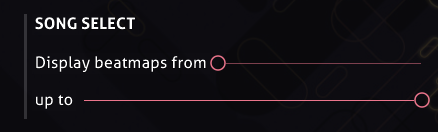
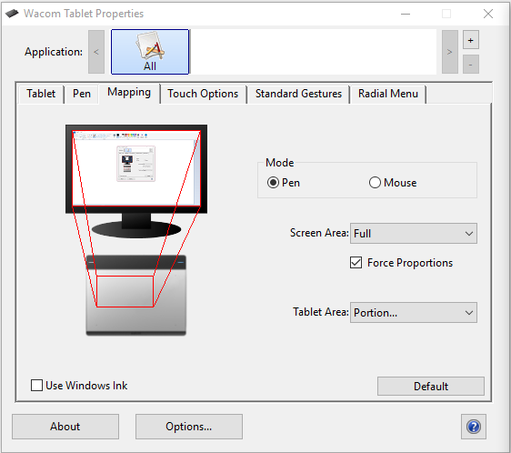

---
tags:
  - bug
  - crash
  - freeze
  - update
  - launch
  - options
  - font
  - directory
  - game
  - connection
  - bancho
  - performance
  - lag
  - glitch
  - gameplay
  - interface
---

# ตัวเกม (Client)

*หน้าหลัก: [ศูนย์ช่วยเหลือ (Help centre)](/wiki/Help_centre)*

กำลังมีปัญหากับตัวเกมใช่ไหม? ลองดูว่าปัญหาของคุณมีรายชื่ออยู่ในบรรดาปัญหาที่พบบ่อยที่สุดที่ผู้ใช้ของเราพบเจอหรือไม่

## บั๊กและการค้าง (Bugs & crashes) {id=crash}

### ฉันเปลี่ยนการตั้งค่าแล้ว และตอนนี้ฉันเริ่มเกม osu! ไม่ได้ หรือมันค้าง! {id=incorrect-settings}

**การรีเซ็ต osu! กลับเป็นค่าเริ่มต้นจะช่วยแก้ปัญหานี้ได้ในกรณีส่วนใหญ่**

ทำตามขั้นตอนเหล่านี้เพื่อคืนค่า osu! กลับสู่การตั้งค่าเริ่มต้น:

1. เริ่มต้นเกม osu! ในขณะที่กดปุ่ม `Shift` บนคีย์บอร์ดค้างไว้
2. กด `Shift` ค้างไว้ต่อไปจนกว่าคุณจะเห็นหน้าต่างโต้ตอบการกู้คืน (recovery dialog) ของ osu!
3. เมื่อหน้าต่างโต้ตอบ `osu! configuration` เปิดขึ้น ให้คลิกปุ่ม `reset settings` (รีเซ็ตการตั้งค่า)
4. หากคุณยังไม่สำเร็จ ให้เปิดหน้าต่างโต้ตอบอีกครั้งแล้วคลิก `repair osu!` (ซ่อมแซม osu!)

### osu! ค้างเมื่อฉันคลิกที่ลิงก์หรือแผนที่ในโหมดผู้เล่นหลายคน! {id=broken-links}

**ตรวจสอบให้แน่ใจว่าคุณไม่ได้รัน osu! ในโหมดความเข้ากันได้ (compatibility mode) ของ Windows และคุณได้กำหนดเว็บเบราว์เซอร์เริ่มต้นไว้ในการตั้งค่าระบบของคุณแล้ว**

ปัญหานี้บางครั้งเกิดจากการโต้ตอบกับโหมดความเข้ากันได้ และอาจเกิดจากตัวเกมไม่สามารถหาเบราว์เซอร์เริ่มต้นเพื่อเปิดลิงก์หน้าเว็บได้

#### เกมของคุณกำลังรันภายใต้โหมดความเข้ากันได้ของ Windows หรือไม่? {id=windows-compatibility}

หากต้องการตรวจสอบหรือเปลี่ยนว่าเกมของคุณรันในโหมดความเข้ากันได้ภายใต้ Windows หรือไม่ ให้ลองทำตามขั้นตอนต่อไปนี้:

1. เปิดโฟลเดอร์ที่ติดตั้ง osu! และมองหาไฟล์ `osu!.exe`
2. คลิกขวาที่ `osu!.exe` และเลือก `Properties` (คุณสมบัติ) จากเมนูที่แสดงขึ้นมา
3. ไปที่แถบ `Compatibility` (ความเข้ากันได้)
4. มองหาช่องทำเครื่องหมายที่ชื่อว่า `Run this program in compatibility mode` (รันโปรแกรมนี้ในโหมดความเข้ากันได้) ภายในส่วนที่ชื่อว่า `Compatibility mode`
5. หากช่องนี้ถูกติ๊กไว้ ให้คลิกอีกครั้งเพื่อปิดการใช้งานฟังก์ชันดังกล่าว
6. หากเกมของคุณเปิดอยู่ ให้ปิดตัวเกมและเปิดใหม่อีกครั้ง

#### คุณได้ตั้งค่าเว็บเบราว์เซอร์เริ่มต้นไว้หรือไม่? {id=default-browser}

**ภายใต้สถานการณ์ส่วนใหญ่ การติดตั้ง Windows ส่วนใหญ่จะมีเว็บเบราว์เซอร์เริ่มต้นตั้งไว้ให้อยู่แล้ว**

หากต้องการตรวจสอบ ให้ลองทำตามขั้นตอนต่อไปนี้ (สำหรับ Windows 8 ขึ้นไป):

1. เปิดเมนู Start
2. พิมพ์คำว่า `default app settings` ลงในแถบค้นหาภายในเมนู Start และคลิกที่การตั้งค่าที่ปรากฏขึ้น
3. เลื่อนลงมาที่หัวข้อ `Web browser` (เว็บเบราว์เซอร์) และตรวจสอบให้แน่ใจว่าเบราว์เซอร์ที่คุณติดตั้งไว้นั้นถูกตั้งค่าไว้อย่างถูกต้อง

### เกมของฉันไม่อัปเดตอย่างที่ควรจะเป็น! {id=cannot-update}

**โดยปกติจะเกิดจากปัญหาที่พีซีของคุณ แต่ในกรณีที่หาได้ยากมากอาจเกิดจากการอัปเดตใหม่ๆ**

โดยทั่วไป osu! จะคอยอัปเดตตัวเองโดยไม่ต้องมีความช่วยเหลือใดๆ แต่บางครั้งก็อาจเกิดข้อผิดพลาดได้

เราแนะนำให้รีสตาร์ทพีซีของคุณเป็นอันดับแรก วิธีนี้จะช่วยแก้ปัญหาได้มากกว่าที่คุณคาดไว้ในเรื่องที่เกี่ยวกับคอมพิวเตอร์ และ osu! ก็ไม่ต่างกัน

ตรวจสอบให้แน่ใจว่า "release stream" ของคุณถูกตั้งค่าเป็น `stable` ในตัวเลือกของเกม

คุณยังสามารถลองบังคับให้เกมอัปเดตได้

#### การเปลี่ยน release stream {id=release-stream}

**สิ่งนี้สามารถเปลี่ยนได้ผ่านเมนูตัวเลือกภายในเกม**

1. เปิด osu!
2. คลิกปุ่ม `Options` ในเมนูหลัก หรือกด `Ctrl` + `O`
3. พิมพ์คำว่า `release` ในช่องค้นหาด่วนเพื่อกระโดดไปยังตัวเลือกนั้นโดยตรง
4. ตรวจสอบให้แน่ใจว่าในเมนูแบบเลื่อนลงเขียนว่า `Stable (Latest)` เพื่อรับตัวเกมเวอร์ชันเสถียรล่าสุด

#### การบังคับให้ osu! อัปเดต {id=force-update}

**คุณสามารถบังคับให้เกมอัปเดตผ่านเมนูตัวเลือก**

1. เปิด osu!
2. คลิกปุ่ม `Options` ในเมนูหลัก หรือกด `Ctrl` + `O`
3. พิมพ์คำว่า `update` ในช่องค้นหาด่วนเพื่อกระโดดไปยังตัวเลือกนั้นโดยตรง
4. คลิกปุ่ม `Run osu! updater`

คุณยังสามารถบังคับให้เกมอัปเดตได้โดยการสร้างไฟล์ชื่อ `help.txt` ในโฟลเดอร์ที่ติดตั้ง osu! ไฟล์นี้ไม่จำเป็นต้องมีเนื้อหาใดๆ แค่มีไฟล์อยู่ก็พอ และตัวเกมจะบังคับอัปเดตโดยอัตโนมัติในครั้งต่อไปที่รันเกม

### ฉันได้รับข้อผิดพลาดเกี่ยวกับ "font styles" เมื่อฉันพยายามเปิดเกม! {id=no-default-fonts}

**คุณได้ลบหรือทำฟอนต์ระบบที่สำคัญซึ่งมาพร้อมกับการติดตั้ง Windows พื้นฐานหายไป นี่อาจไม่ใช่ปัญหาเดียวที่คุณกำลังสังเกตเห็น!**

หากคุณเห็นข้อผิดพลาดนี้เมื่อพยายามเปิด osu! หรือตัวอัปเดตของมัน หมายความว่าคุณได้ลบหรือทำฟอนต์ระบบที่สำคัญซึ่งมาพร้อมกับ Windows หายไป ฟอนต์เหล่านี้ถูกใช้ทั่วทั้งระบบปฏิบัติการ Windows ดังนั้นคุณสามารถคาดการณ์ได้ว่าจะเจอปัญหาเบ็ดเตล็ดอื่นๆ เช่น ฟอนต์ผิดเพี้ยน, ข้อความหายไป และแอปอื่นๆ ค้างทั่วทั้ง Windows

นี่คือกลุ่มรวมฟอนต์ทั่วไปที่ใช้ใน Windows เวอร์ชันต่างๆ และทั่วทั้งเว็บซึ่งน่าจะช่วยได้:

- [Microsoft core web fonts](https://web.archive.org/web/20020124085641/http://www.microsoft.com/typography/fontpack/default.htm) (โดยเฉพาะ Arial, Times New Roman, Trebuchet MS และ Verdana)
- [Tahoma](https://freefontsfamily.com/tahoma-font-free)
- [Windows Live Essentials](https://support.microsoft.com/en-us/help/2434419/windows-live-essentials-2011) (Segoe UI)
- [Microsoft JhengHei](https://microsoft.com/en-us/download/details.aspx?&id=12072) (微軟正黑體) (ฟอนต์ UI ภาษาจีนตัวเต็ม)

ดู [หัวข้อนี้](https://answers.microsoft.com/en-us/windows/forum/windows_vista-windows_programs/font-tahoma-does-not-support-style-regular/80ad7a97-230f-41d4-9101-107a0bfa986a) ใน Microsoft Answers สำหรับคำแนะนำที่ละเอียดกว่านี้ และตัวเลือกอื่นๆ ในการนำฟอนต์เหล่านั้นกลับมา

### บีทแมพบางอันของฉันหายไป! {id=missing-beatmaps}

**ตรวจสอบให้แน่ใจว่าคุณไม่ได้จัดกลุ่มบีทแมพด้วยเงื่อนไขใดๆ ที่มุมขวาบนของหน้าจอ (นั่นคือ "grouping" ควรถูกตั้งค่าเป็น "no grouping")**

หากคุณเพิ่งดาวน์โหลดแผนที่มา คุณอาจต้องการลองรีเฟรชรายการบีทแมพโดยการกด `F5` ที่หน้าจอเลือกเพลง

ตรวจสอบให้แน่ใจว่าคุณไม่ได้จำกัดว่าแผนที่ใดที่จะถูกแสดงในการตั้งค่าตัวเลือกของเกม

หากต้องการตรวจสอบหรือเปลี่ยนการแสดงผลบีทแมพในเมนูเลือกเพลง ให้ลองทำตามขั้นตอนต่อไปนี้:

1. เปิด osu!
2. คลิกปุ่ม `Options` ในเมนูหลัก หรือกด `Ctrl` + `O`
3. พิมพ์คำว่า `song select` ในช่องค้นหาด่วนเพื่อกระโดดไปยังตัวเลือกนั้นโดยตรง
4. ตรวจสอบให้แน่ใจว่า `Display beatmaps from` (แสดงบีทแมพตั้งแต่) ถูกตั้งไว้ที่ 0 ดาว และ `up to` (ถึง) ถูกตั้งไว้ที่ 10+ ดาว

หากไม่มีวิธีใดข้างต้นได้ผล ในฐานะวิธีสุดท้ายคุณสามารถลองบังคับให้สร้างฐานข้อมูลบีทแมพใหม่ **โปรดทราบว่าวิธีนี้จะทำเครื่องหมายแผนที่ทั้งหมดของคุณเป็น "ยังไม่ได้เล่น" ดังนั้นการค้นหาและจัดกลุ่มแผนที่ด้วยฟิลด์ที่อิงจากวันที่เล่นจะใช้งานไม่ได้อีกต่อไป**

ในการบังคับสร้างฐานข้อมูลบีทแมพใหม่ได้อย่างปลอดภัย ให้ลองทำตามขั้นตอนต่อไปนี้:

1. เปิด osu!
2. คลิกปุ่ม `Options` ในเมนูหลัก หรือกด `Ctrl` + `O`
3. คลิก `Open osu! folder` (เปิดโฟลเดอร์ osu!)
4. ปิดเกม osu!
5. หาไฟล์ `osu!.db` ที่อยู่ในโฟลเดอร์ที่คุณเพิ่งเปิดขึ้นมา
6. คลิกขวาที่ไฟล์นั้น แล้วคลิก `Rename` (เปลี่ยนชื่อ)
7. เปลี่ยนชื่อตามที่คุณต้องการ ชื่ออะไรก็ได้ ตราบใดที่ไม่ใช่ชื่อ "osu!" จากนั้นกด `Enter`
8. เปิดเกม osu! ใหม่อีกครั้ง

*หมายเหตุ: วิธีแก้ไขปัญหานี้ถูกเพิ่มเข้ามาใน [Stable 20210519.3](https://osu.ppy.sh/home/changelog/stable40/20210519.3) ลงวันที่ 2021-05-19 หากคุณบังเอิญยังคงพบปัญหานี้อยู่ โปรด [แจ้งให้เราทราบ](https://github.com/ppy/osu-stable-issues/issues)*

### รายการเพลงของฉันเลื่อนเองไม่หยุด! {id=songs-list-scrolling}

**โดยปกติจะเกิดจากอุปกรณ์รับข้อมูลที่เชื่อมต่อกับคอมพิวเตอร์ของคุณทำงานผิดปกติ ลองถอดปลั๊กคอนโทรลเลอร์หรือจอยสติ๊กออก**

ปัญหาเหล่านี้อาจเกิดจากแอปพลิเคชันที่จำลองหรือเปลี่ยนการกำหนดปุ่ม เช่น *Xpadder* หรือ *X-Mouse Button Control* หากคุณใช้แอปพลิเคชันดังกล่าวสำหรับเกมอื่น ให้ปิดการใช้งานพวกมัน

สิ่งนี้ยังสามารถเกิดขึ้นได้เนื่องจากปัญหากับปุ่มตัวเลข (numpad) เนื่องจากมันสามารถใช้เพื่อเลื่อนรายการเลือกเพลงได้ การกดปุ่ม `NumLock` เพื่อปิดการใช้งาน numpad และจากนั้นกด `9`, `8`, `3` หรือ `2` บน numpad จะช่วยแก้ปัญหานี้ได้

คุณอาจต้องการตรวจสอบว่ามีปุ่มใดติดขัดหรือเสียหายบนอุปกรณ์ต่อพ่วงของคุณหรือไม่

### ฉันดาวน์โหลดแพ็กบีทแมพมา แต่ osu! พยายาม "ซ่อมแซม" (repair) ไฟล์อยู่เสมอ! {id=beatmap-pack-extraction}

**คุณจำเป็นต้องแตกไฟล์แพ็กนั้นลงในโฟลเดอร์ Songs ของคุณ**

แพ็กบีทแมพส่วนใหญ่จะมาในรูปแบบไฟล์ `.rar` ซึ่งหมายความว่ามันคือไฟล์ที่ถูกบีบอัดไว้ คุณจำเป็นต้องแตกไฟล์โดยใช้โปรแกรมที่คุณเลือก (เราแนะนำ [7-Zip](https://7-zip.org)) ลงในโฟลเดอร์ 'Songs' ของคุณก่อนเป็นอันดับแรก

เมื่อไฟล์ `.osz` ทั้งหมดจากไฟล์ที่แตกออกมาอยู่ในโฟลเดอร์ `Songs` แล้ว การกด `F5` ที่เมนูเลือกเพลงจะรีเฟรชแคชบีทแมพของเกมและโหลดเพลงใหม่ของคุณเข้าสู่เกม

## การเล่นเกม (Gameplay) {id=gameplay}

### ตัวนับคอมโบ, การแสดงคะแนน หรือการแสดงความแม่นยำของฉันหายไป! {id=missing-interface}

**การกด `Shift` + `Tab` ในขณะที่เล่นจะเป็นการสลับการเปิด/ปิด HUD ภายในเกม และช่วยให้คุณเห็นองค์ประกอบเหล่านี้ได้อีกครั้ง**

หากคุณได้เปลี่ยนการกำหนดปุ่มที่สลับการเปิด/ปิด scoreboard (ตารางคะแนน) วิธีนี้จะใช้งานไม่ได้ คุณสามารถตรวจสอบได้ว่ามันถูกตั้งค่าไว้ที่ปุ่มใดใน `Options` -> `Change keyboard bindings` -> `In-Game` -> `Toggle Scoreboard` จากนั้นคุณสามารถใช้ปุ่มนั้นแทนที่ปุ่ม `Tab` ได้ (ตัวอย่างเช่น เปลี่ยนเป็น `Shift` + `V`)

### คะแนนในเครื่อง (local scores) ของฉันหายไป! {id=no-scores}

มีเหตุผลบางประการที่สิ่งนี้สามารถเกิดขึ้นได้ อ่านต่อด้านล่างเลย!

#### คุณเพิ่งติดตั้งตัวเกมใหม่เร็วๆ นี้หรือไม่? {id=no-scores-reinstalling}

**การติดตั้งตัวเกมใหม่จะเป็นการล้างคะแนนในเครื่องทั้งหมดของคุณโดยอัตโนมัติ**

ซึ่งน่าเสียดายที่คะแนนเหล่านั้นหายไปแล้ว

อย่างไรก็ตาม คะแนนที่คุณได้ส่งไปทางออนไลน์ยังคงอยู่ — เพียงแค่ดาวน์โหลดเพลงที่คุณเคยเล่นมาก่อนหน้านี้ใหม่อีกครั้ง และคะแนนของคุณจะปรากฏกลับมา

เคล็ดลับที่เป็นประโยชน์: หากคุณเป็น osu!supporter คุณสามารถใช้ตัวกรอง `Ranked (Played)` ในแผง osu!direct ภายในเกม หรือผ่าน [หน้าการจัดรายการบีทแมพ](https://osu.ppy.sh/beatmapsets?played=played&s=ranked) เพื่อค้นหาแผนที่ใดๆ ที่คุณเคยทำคะแนนไว้ในอดีต

#### คุณได้ตั้งค่าโหมดเกมถูกต้องหรือไม่? {id=no-scores-game-mode}

**การเล่นโหมดเกมอื่น (osu!taiko, osu!catch หรือ osu!mania) จะสลับมุมมองคะแนนภายในเกมให้แสดงเฉพาะคะแนนสำหรับโหมดนั้นๆ สิ่งนี้จะซ่อนคะแนนของคุณจากโหมดอื่นๆ**

สาเหตุทั่วไปของปัญหานี้เกิดจากการเล่นแผนที่ของโหมดเกมอื่น ซึ่งจะทำให้หน้าเลือกเพลงเปลี่ยนไปใช้คะแนนของโหมดนั้นโดยอัตโนมัติจนกว่าโหมดจะถูกตั้งกลับคืน

คุณสามารถเปลี่ยนโหมดเกมได้โดยการคลิกปุ่ม `Mode` ที่มุมซ้ายล่างของหน้าจอในหน้าเลือกเพลง จากนั้นเลือกโหมดที่เหมาะสมที่คุณกำลังมองหาคะแนนของคุณอยู่

#### คุณเพิ่งดาวน์โหลดแผนที่จำนวนมากเร็วๆ นี้หรือไม่? (เช่น แพ็กบีทแมพหรือชุดรวม) {id=no-scores-many-maps}

**บางครั้งคะแนนอาจใช้เวลาสักครู่ในการดาวน์โหลดจากเซิร์ฟเวอร์เกมหากคุณโหลดแผนที่ใหม่จำนวนมากในคราวเดียว**

การเล่นเกมหรือการทำอย่างอื่นจะช่วยให้ตัวเกมดำเนินการตามหลังในพื้นหลังได้

### เส้นสีขาวหรือเส้นที่เหมือนควันหลังเคอร์เซอร์ของฉันคืออะไร? {id=smoke}

**นี่คือคุณลักษณะพิเศษที่เรียกว่า *ควัน (smoke)* และสามารถใช้เพื่อวาดรูปเล่นบนพื้นที่เล่นเพื่อความสนุก ใครก็ตามที่กำลัง spectate (รับชม) คุณอยู่จะสามารถเห็นสิ่งที่คุณวาดได้เช่นกัน**

การกำหนดปุ่มเริ่มต้นสำหรับฟีเจอร์นี้คือ `C` และมันจะทำงานตราบเท่าที่คุณกดปุ่มค้างไว้ คุณสามารถเปลี่ยนปุ่มได้ทุกเมื่อในส่วน `osu!` ของหน้าต่างตัวเลือก `Change keyboard bindings`

### ฉันจะบันทึกรีเพลย์ (replay) ของคะแนนที่ฉันเพิ่งทำเสร็จได้อย่างไร? {id=save-replay}

**เข้าสู่หน้าจอผลลัพธ์หลังจบเกมโดยการคลิกที่คะแนนในตารางคะแนนในเครื่องของคุณ และกดปุ่ม `F2`**

วิธีนี้จะบันทึกคะแนนใหม่ที่ยอดเยี่ยมของคุณเป็นไฟล์ `.osr` ในโฟลเดอร์ /Replays/ ภายในไดเรกทอรีที่ติดตั้ง osu! เริ่มต้น

นอกจากนี้ osu! ยังบันทึกรีเพลย์ทั้งหมดโดยอัตโนมัติหลังจากที่คุณจบเพลงไว้ภายใต้โฟลเดอร์ที่ซ่อนอยู่ชื่อ `/Data/r/` ซึ่งอยู่ในไดเรกทอรีที่ติดตั้ง osu! เช่นกัน

โปรดทราบว่าหากไม่มีการบันทึกรีเพลย์สำหรับคะแนนนั้น คุณจะไม่สามารถเรียกคืนรีเพลย์ได้โดยการทำเช่นนี้

### osu! บอกฉันว่าตัวเกมของฉันเก่าเกินไป! {id=old-client}

**ได้เวลาอัปเกรดแล้ว! ตัวเกมเวอร์ชันเก่ามากๆ ไม่ได้รับอนุญาตให้ส่งคะแนนใหม่ ดังนั้นคุณจำเป็นต้องบังคับการอัปเดตโดยเข้าไปที่ `Options` -> `General` -> `Run osu! updater`**

หากวิธีนี้ไม่ได้ผล คุณสามารถปิด osu! และรีสตาร์ทไฟล์ osu!.exe ในขณะที่กดปุ่ม `Shift` ค้างไว้ วิธีนี้จะแสดงตัวเลือกการอัปเกรดและซ่อมแซมบางอย่าง หนึ่งในนั้นคือการอัปเดตเกมของคุณเป็นเวอร์ชันล่าสุด

### คะแนนของฉันไม่ยอมส่งเข้าระบบ! {id=no-submission}

อุ๊ปส์! มีเหตุผลบางประการที่สิ่งนี้สามารถเกิดขึ้นได้ มาลองไล่ดูกัน:

#### คุณได้เชื่อมต่ออินเทอร์เน็ตในขณะที่เล่นหรือไม่? {id=no-submission-no-connection}

**หากคุณไม่สามารถเข้าถึงอินเทอร์เน็ตได้เมื่อจบเพลง คะแนนของคุณอาจไม่ถูกส่งเข้าระบบ**

สิ่งนี้อาจน่าหงุดหงิดหากคุณเล่นด้วยการเชื่อมต่อที่ไม่เสถียร แม้ว่าตัวเกมจะพยายามอย่างเต็มที่เพื่อส่งคะแนนของคุณซ้ำตราบเท่าที่คุณยังเปิดตัวเกมทิ้งไว้

#### osu! ได้รับการอนุญาตในไฟร์วอลล์ (firewall) หรือชุดโปรแกรมสแกนไวรัสในเครื่องของคุณหรือไม่? {id=no-submission-firewall}

**ไฟร์วอลล์หรือชุดโปรแกรมสแกนไวรัสบางชนิดสามารถบล็อก osu! ไม่ให้เข้าถึงอินเทอร์เน็ตได้ ซึ่งจะขัดขวางการส่งคะแนน**

ตรวจสอบซอฟต์แวร์ที่คุณเลือกเพื่อตรวจสอบให้แน่ใจว่าไฟล์ `osu!.exe` ในไดเรกทอรีที่คุณติดตั้งเกมไว้ได้รับอนุญาตให้เข้าถึงอินเทอร์เน็ตได้

#### คุณกำลังรันโปรแกรมจำนวนมากในพื้นหลังหรือไม่? {id=no-submission-software}

**บางโปรแกรมสามารถรบกวนความสามารถในการส่งคะแนนของคุณได้**

ลองปิดโปรแกรมส่วนเกินก่อนเล่น osu! หากคุณพบว่าคะแนนของคุณไม่ส่งเข้าระบบและคุณไม่ได้มีปัญหาเรื่องการเชื่อมต่อในด้านอื่นๆ

#### สถานะของบีทแมพของคุณถูกต้องหรือไม่? {id=no-submission-beatmap-status}

**บางครั้งสถานะของบีทแมพของคุณอาจเกิดข้อผิดพลาด หมายความว่าคะแนนที่คุณทำในแผนที่นั้นจะไม่สามารถส่งได้**

ในเมนูเลือกเพลง ให้ตรวจสอบที่มุมซ้ายบนของหน้าจอเพื่อหาไอคอนขนาดเล็ก (ตัวอย่างเช่น บีทแมพที่ได้รับการ ranked ควรจะแสดงไอคอนลูกศรสีน้ำเงินที่มุมซ้ายบน) หากบีทแมพของคุณไม่แสดงไอคอนใดๆ หรือแสดงไอคอนที่ไม่ถูกต้อง คะแนนของคุณจะไม่สามารถส่งได้

การเล่นโดยเลือก `global leaderboard` (ตารางคะแนนทั่วโลก) แทนที่จะเป็นตารางคะแนนในเครื่อง สามารถช่วยป้องกันปัญหานี้ได้ในแต่ละแผนที่ หากบีทแมพจำนวนมากของคุณ หรือทั้งหมด หายไป/มีสถานะไม่ถูกต้อง ให้ลองบังคับให้สร้างไฟล์ฐานข้อมูลบีทแมพใหม่ คุณสามารถหาวิธีทำได้อย่างปลอดภัยที่ด้านบนในส่วน "[บีทแมพบางอันของฉันหายไป!](#missing-beatmaps)" หลังจากทำเช่นนี้ อาจต้องใช้เวลาสักครู่เพื่อให้แผนที่ทั้งหมดของคุณกลับมามีสถานะที่ถูกต้อง

#### เซิร์ฟเวอร์ส่งคะแนนเปิดใช้งานอยู่หรือไม่? {id=no-submission-servers}

**คำตอบเกือบจะคือ 'ใช่' เสมอ แต่ให้ตรวจสอบที่ [osu! server status](https://status.ppy.sh) หรือ [Twitter @osustatus](https://twitter.com/osustatus) เพื่อให้แน่ใจว่าทุกอย่างกำลังทำงานอย่างราบรื่นในฝั่งของเรา**

หากเซิร์ฟเวอร์ออฟไลน์ อย่าปิด osu! จนกว่าเราจะแก้ไขปัญหาเสร็จและเซิร์ฟเวอร์กลับมาออนไลน์ และตัวเกมจะพยายามส่งคะแนนของคุณอีกครั้งนานถึงหนึ่งชั่วโมงก่อนที่จะถอดใจ

### คุณสามารถอัปโหลดคะแนนที่ฉันทำไว้ให้ฉันได้ไหม? {id=upload-replay}

**น่าเสียดายที่เราไม่สามารถอัปโหลดคะแนนตามคำขอได้**

หากคุณถูกปฏิเสธคะแนนเนื่องจากเหตุผลทางเทคนิคหรืออย่างอื่น สิ่งที่ดีที่สุดที่คุณหวังได้คือการแสดงทักษะซ้ำและทำคะแนนนั้นให้ได้อีกครั้ง ขออภัยด้วยครับ!

### ตัวโน้ตดูเหมือนจะไม่ซิงค์หรือจังหวะเพี้ยนจากเพลง! {id=offsync-notes}

**สิ่งนี้อาจเกิดจากซอฟต์แวร์ประมวลผลเสียงที่ทำงานบนเครื่องของคุณ เช่น *Razer Surround Audio* นอกจากนี้ยังอาจเกิดจากการตั้งค่า `Universal Offset` ของคุณไม่ถูกต้อง**

ลองปิดโปรแกรมส่วนเกินใดๆ ที่แก้ไขหรือมีอิทธิพลต่อเสียงที่ออกมาจากคอมพิวเตอร์ของคุณ หากวิธีนี้ไม่ช่วย คุณสามารถลองปรับค่า `Universal Offset` ของคุณได้

การกำหนดค่าฮาร์ดแวร์แต่ละรายมีค่า `Universal Offset` เฉพาะที่จะกำหนดว่าคุณจะได้ยินเสียงของเกมช้าลงหรือเร็วขึ้นเล็กน้อย

ค่าเริ่มต้นใช้งานได้ดีสำหรับคนส่วนใหญ่ แต่หากคุณพบว่ามันไม่ใช่สำหรับคุณ คุณสามารถเปลี่ยนได้โดยทำตามขั้นตอนต่อไปนี้:

1. เปิด osu!
2. คลิกปุ่ม `Options` ในเมนูหลัก หรือกด `Ctrl` + `O`
3. พิมพ์คำว่า `offset` ในช่องค้นหาด่วน สิ่งนี้จะพาคุณไปยังค่า universal offset ปัจจุบันที่ตัวเกมของคุณใช้อยู่
4. ใช้แถบเลื่อนเพื่อปรับค่า universal offset ของคุณ อีกทางเลือกหนึ่งคือ ลองใช้ [offset wizard](/wiki/Client/Options/Offset_Wizard) เพื่อช่วยคุณในกระบวนการนี้

หากสิ่งนี้ยังไม่ช่วย คุณอาจต้องลองอัปเดตซาวด์การ์ดหรือไดรเวอร์เสียงของเมนบอร์ด

### เกมของฉันดูเหมือนมีอาการรวน เหมือนกราฟิกฉีกขาด! {id=screen-tearing}

**นี่เป็นผลจากเอฟเฟกต์ที่เรียกว่า [ภาพฉีกขาด (screen tearing)](https://en.wikipedia.org/wiki/Screen_tearing) และสามารถแก้ไขได้โดยการตั้งค่าตัวเลือก `Frame limiter` ภายในเกมให้เป็น `VSync`**

นี่เป็นเอฟเฟกต์ที่ไม่มีอันตรายโดยสิ้นเชิง (แม้ว่าจะดูไม่สวย!) ซึ่งเกิดขึ้นเพราะอัตราการรีเฟรช (refresh rate) ของเกมไม่ซิงค์กับอัตราการรีเฟรชของจอภาพของคุณ

คุณยังสามารถลองเล่นในโหมด Windowed หรือ Borderless ซึ่งจะใช้ VSync ดั้งเดิมของระบบปฏิบัติการของคุณแทน

การเปิดใช้งาน VSync หรือการเล่นในโหมด Windowed หรือ Borderless จะเพิ่มอาการหน่วงของข้อมูลที่รับเข้ามา (input lag) *เล็กน้อย* ซึ่งเป็นเรื่องที่เลี่ยงไม่ได้ สำหรับคนส่วนใหญ่ สิ่งนี้จะไม่ก่อให้เกิดปัญหาสำคัญ

กราฟิกการ์ด NVidia รุ่นหลังๆ มีตัวเลือกส่วนกลางใน NVidia Control Panel เพื่อตั้งค่าอัตราการรีเฟรชส่วนกลางเป็นค่าที่ชื่อว่า 'Fast' ซึ่งจะช่วยแก้ปัญหานี้ได้เช่นกัน

## คุณลักษณะออนไลน์ {id=online-features}

### ฉันไม่สามารถลงชื่อเข้าใช้หรือเชื่อมต่อกับเกมได้เลย! {id=cannot-sign-in}

**ตรวจสอบให้แน่ใจว่า osu! สามารถเข้าถึงอินเทอร์เน็ตได้อย่างถูกต้องผ่านไฟร์วอลล์หรือชุดโปรแกรมสแกนไวรัสใดๆ ที่คุณติดตั้งไว้ในคอมพิวเตอร์**

นี่คือวิธีบางส่วนในการอนุญาตให้แอปพลิเคชันเข้าถึงอินเทอร์เน็ตผ่านชุดโปรแกรมสแกนไวรัสทั่วไปหลายชนิด:

#### การอนุญาตโปรแกรมผ่าน Windows Firewall {id=firewall-whitelist-windows}

**ในการติดตั้ง Windows ส่วนใหญ่ Windows Firewall จะเป็นซอฟต์แวร์ไฟร์วอลล์เริ่มต้น**

เพื่อให้แน่ใจว่า osu! สามารถเข้าถึงอินเทอร์เน็ตได้ เราจำเป็นต้องอนุญาตให้มันสื่อสารผ่าน Windows Firewall นี่คือวิธีตรวจสอบและเพิ่ม osu! ลงในรายการโปรแกรม:

1. เปิดเมนู Start
2. พิมพ์คำว่า `allow an app` ลงในแถบค้นหาภายในเมนู Start
3. คุณควรจะเห็นผลลัพธ์ใน Control Panel ที่ชื่อว่า `Allow an app through Windows Firewall` คลิกที่นั่น
4. แผงที่มีรายการแอปพลิเคชันจำนวนมากพร้อมช่องทำเครื่องหมายสองช่องข้างๆ จะเปิดขึ้น คลิกที่แอปพลิเคชันใดก็ได้ แล้วกดปุ่ม `o` รายการจะเลื่อนลงมายังแอปพลิเคชันทั้งหมดที่ขึ้นต้นด้วย 'o'
5. มองหา `osu!` หรือ `osu!.exe`
6. หากไม่พบทั้งคู่ ให้คลิก `Allow another app` (อนุญาตแอปอื่น) ที่ด้านล่างของแผงและค้นหาไดเรกทอรีที่คุณติดตั้ง osu! และเลือกไฟล์ `osu!.exe`
7. ตรวจสอบให้แน่ใจว่าทั้งช่องทำเครื่องหมาย `Private` (ส่วนตัว) และ `Public` (สาธารณะ) ถูกติ๊กไว้ คลิก OK เพื่อบันทึกการตั้งค่าของคุณและลองอีกครั้ง

#### การอนุญาตโปรแกรมผ่าน AVG Firewall {id=firewall-whitelist-avg}

โปรดดูข้อมูลใน [ฐานความรู้อย่างเป็นทางการของ AVG ในหัวข้อนี้](https://support.avg.com/SupportArticleView?l=en&urlName=AVG-Antivirus-Enhanced-Firewall-Application-Rules&supportType=home) สำหรับคำแนะนำโดยละเอียดเกี่ยวกับวิธีการทำสิ่งนี้

#### การอนุญาตโปรแกรมผ่าน Kaspersky Internet Security {id=firewall-whitelist-kaspersky}

โปรดดู [บทความช่วยเหลืออย่างเป็นทางการของ Kaspersky](https://support.kaspersky.com/15163#block2) เกี่ยวกับการเพิ่มแอปพลิเคชันลงใน Trusted Zone (เขตพื้นที่ที่เชื่อถือได้)

#### การอนุญาตโปรแกรมผ่าน McAfee {id=firewall-whitelist-mcafee}

โปรดดูข้อมูลใน [ฐานความรู้อย่างเป็นทางการของ McAfee ในหัวข้อนี้](https://download.mcafee.com/products/webhelp/5/1033/index.html#GUID-68D866FC-3978-4665-940E-9CA5CC0836E2.html)

### ฉันเพิ่ม osu! ลงในไฟร์วอลล์แล้วแต่ฉันยังคงเชื่อมต่อกับเกมไม่ได้! {id=sign-in-unknown-cause}

**เราต้องการข้อมูลเพิ่มเติมจากคุณเพื่อช่วยจัดการเรื่องนี้**

หากคุณยังคงมีปัญหาในการเชื่อมต่อกับเซิร์ฟเวอร์เกมของเรา โปรดส่งตั๋วสนับสนุนโดยส่งอีเมลไปที่ [accounts@ppy.sh](mailto:accounts@ppy.sh) ข้อมูลต่อไปนี้จะช่วยให้เราแก้ปัญหาของคุณได้อย่างรวดเร็ว:

- บันทึกผลลัพธ์การติดตามเส้นทาง (trace route) จากคำสั่ง `tracert` สำหรับเซิร์ฟเวอร์ `cho.ppy.sh`, `osu.ppy.sh` และ `m1.ppy.sh` (ดูคำแนะนำด้านล่าง)
- ไฟล์ `network.log` จากโฟลเดอร์ `Logs` ในไดเรกทอรีที่ติดตั้ง osu! ของคุณ

#### การรันการติดตามเส้นทางเพื่อแก้ไขปัญหาการเชื่อมต่อ {id=traceroute}

**การติดตามเส้นทาง (trace route) จะช่วยให้เราตรวจพบได้ว่าปัญหาอยู่ที่จุดใดระหว่างคุณและเซิร์ฟเวอร์ของเรา**

คุณสามารถทำการติดตามเส้นทางได้โดยการเปิด Command Prompt และรันคำสั่ง `tracert`

ในการเปิด Command Prompt ให้กดปุ่ม `Windows` ค้างไว้แล้วกด `R` จากนั้นพิมพ์ `cmd` และคลิก `OK` สำหรับข้อมูลเพิ่มเติม โปรดดู [บทความฐานความรู้ของ Windows](https://support.microsoft.com/en-us/topic/how-to-use-tracert-to-troubleshoot-tcp-ip-problems-in-windows-e643d72b-2f4f-cdd6-09a0-fd2989c7ca8e)

จากนั้นคุณสามารถพิมพ์คำสั่งติดตามเส้นทางลงในคอนโซลได้ ตัวอย่างเช่น คำสั่ง `tracert cho.ppy.sh` จะติดตามวิธีที่คอมพิวเตอร์ของคุณเชื่อมต่อกับเซิร์ฟเวอร์เกมผ่านอินเทอร์เน็ต การติดตามเส้นทางใช้เวลาสักครู่ บางครั้งอาจนานกว่าหนึ่งนาทีหรือมากกว่านั้นขึ้นอยู่กับการเชื่อมต่อของคุณ

เราต้องการผลลัพธ์จากการติดตามเส้นทางสำหรับคำสั่งสำหรับเซิร์ฟเวอร์ต่อไปนี้: `cho.ppy.sh`, `osu.ppy.sh` และ `m1.ppy.sh`

ในการคัดลอกผลลัพธ์ของคำสั่ง เพียงแค่คลิกและลากจากด้านล่างของผลลัพธ์ขึ้นไปด้านบนสุดเพื่อให้ข้อมูลเปลี่ยนเป็นสีขาว จากนั้นคลิกขวาเพื่อคัดลอกลงในคลิปบอร์ดของคุณทันที

### ฉันได้รับข้อผิดพลาดฝั่งเซิร์ฟเวอร์ (server-side error) เมื่อพยายามเล่นออนไลน์! {id=server-side-error}

**เซิร์ฟเวอร์อาจกำลังมีปัญหา**

ตรวจสอบ [หน้าสถานะเซิร์ฟเวอร์ osu!](https://status.ppy.sh/ "osu! server status") เพื่อดูว่ามีปัญหาใดๆ ที่กำลังเกิดขึ้นกับเซิร์ฟเวอร์หรือไม่

**สิ่งนี้ยังสามารถเกิดขึ้นได้หากคุณใช้การเชื่อมต่ออินเทอร์เน็ตที่แชร์ร่วมกัน, พร็อกซี หรือ VPN**

ลองใช้ผู้ให้บริการพร็อกซีหรือ VPN รายอื่น — หากทุกอย่างล้มเหลว ให้ส่งตั๋วสนับสนุนผ่านอีเมลมาที่ [accounts@ppy.sh](mailto:accounts@ppy.sh)

หากคุณไม่ได้ใช้สิ่งใดข้างต้น คุณจำเป็นต้องส่งตั๋วสนับสนุน เนื่องจากความเชื่อมต่อของคุณอาจถูกขึ้นบัญชีดำ (blacklisted) โดยข้อผิดพลาด

โดยส่วนใหญ่แล้ว Tor หรือเครือข่ายที่เกี่ยวข้องกับรีเลย์ Tor จะไม่สามารถเชื่อมต่อกับเซิร์ฟเวอร์เกมได้ แม้ว่าเราจะไม่ได้ประณามหรือสนับสนุนการใช้ Tor แต่เราบังคับใช้นโยบายนี้เพื่อหลีกเลี่ยงผู้ไม่หวังดีที่อาจใช้ Tor

### ฉันเป็น osu!supporter แล้วแต่ชื่อของฉันไม่ใช่สีเหลืองภายในเกม! {id=white-username}

**คุณจะมองเห็นชื่อตัวเองเป็นสีขาวเสมอในตัวเกมภายในเกม อย่างไรก็ตาม ผู้ใช้รายอื่นจะเห็นความเหลืองอันรุ่งโรจน์ของคุณ!**

สิ่งนี้ช่วยในการระบุข้อความของคุณเองจากคนอื่นๆ ปัจจุบันยังไม่มีตัวเลือกในการปิดใช้งานฟังก์ชันนี้

## ประสิทธิภาพ (Performance) {id=performance}

### ฉันจะทำให้ osu! ทำงานด้วยอุณหภูมิที่ต่ำลงได้อย่างไรหากคอมพิวเตอร์ของฉันร้อนเกินไป? {id=overheating}

**วิธีที่ง่ายที่สุดคือการเปลี่ยนการตั้งค่าการจำกัดเฟรม (frame limiter)**

หากต้องการตรวจสอบว่า frame limiter ของคุณถูกตั้งค่าไว้ที่ใด ให้ทำตามขั้นตอนต่อไปนี้:

1. เปิด osu!
2. คลิกปุ่ม `Options` ในเมนูหลัก หรือกด `Ctrl` + `O`
3. พิมพ์คำว่า `frame` ในช่องค้นหาด่วนเพื่อเรียกตัวเลือก frame limiter ขึ้นมา

หาก frame limiter ของคุณถูกตั้งค่าเป็น `Unlimited` (ไม่จำกัด) คุณอาจสังเกตเห็นการพัฒนาที่สำคัญโดยการเปลี่ยนเป็นหนึ่งในสามตัวเลือกที่เหลือ

`VSync` จะรันเกมที่อัตราการรีเฟรชที่เท่ากับอัตราการรีเฟรชของจอภาพหลักของคุณ ในขณะที่ `Power Saving` และ `Optimal` จะรันเกมที่ความเร็ว 2 เท่าและ 8 เท่าของอัตราการรีเฟรชของจอภาพ ตามลำดับ สูงสุดถึง 960Hz

เราแนะนำให้ใช้ `VSync` ในสถานการณ์ที่เรื่องความร้อนเป็นปัญหา

คุณอาจต้องการมองหาโปรแกรมอรรถประโยชน์ที่อนุญาตให้คุณควบคุมความเร็วของพัดลม CPU และ GPU ด้วยตนเอง

### พีซีของฉันรีบูตเองในขณะเล่น osu! {id=reboot-overheating}

**ส่วนใหญ่แล้ว สิ่งนี้เกิดจากความร้อนสูงเกินไปของส่วนประกอบใดส่วนประกอบหนึ่งหรือมากกว่าของคอมพิวเตอร์คุณ โดยปกติจะเป็นกราฟิกการ์ดหรือ CPU**

เพื่อค้นหาว่าอะไรเป็นสาเหตุของเรื่องนี้ เราแนะนำให้คุณใช้โปรแกรมตรวจสอบอุณหภูมิ GPU/CPU และคอยสังเกตมันในขณะที่คุณเล่น osu! ในพื้นหลัง โปรแกรมที่แนะนำให้ใช้คือ [Speccy](https://www.ccleaner.com/speccy)

หากคุณสังเกตเห็นอุณหภูมิของ GPU หรือ CPU สูงเกิน 90°C หรือ 194°F คอมพิวเตอร์ของคุณกำลังทำงานที่ความร้อนสูงมากและเข้าใกล้ขีดจำกัดของการปิดเครื่องอัตโนมัติส่วนใหญ่อย่างอันตราย

### คอมพิวเตอร์ของฉันไม่ได้ร้อนเกินไป แต่เกมยังคงทำให้คอมพิวเตอร์รีบูต! {id=reboot-faulty-device}

**สาเหตุที่พบบ่อยที่สุดของการบังคับรีสตาร์ทหลังจากตัดเรื่องความร้อนออกไปแล้ว คือปัญหาเกี่ยวกับซาวด์การ์ด ตามมาด้วยอุปกรณ์ต่อพ่วงที่เชื่อมต่อกับคอมพิวเตอร์ของคุณทำงานผิดปกติ**

ไดรเวอร์ซาวด์การ์ดหรือซอฟต์แวร์รุ่นเก่าอาจก่อให้เกิดปัญหากับ osu! ได้ แต่สิ่งนี้ไม่ใช่ปัญหาสำหรับคนส่วนใหญ่ ลองอัปเดตซาวด์การ์ดหรือไดรเวอร์เมนบอร์ดของคุณ

คุณอาจต้องการลองถอดอุปกรณ์ต่อพ่วงบางส่วนที่เชื่อมต่อผ่าน USB กับคอมพิวเตอร์ของคุณออก โดยเฉพาะอย่างยิ่งหากพวกมันมีปฏิสัมพันธ์กับเสียงในทางใดทางหนึ่ง หูฟังหรือซาวด์การ์ดแบบ USB บางครั้งสามารถก่อให้เกิดปัญหาได้หากตัวมันเองหรือพอร์ตที่เสียบอยู่เริ่มทำงานผิดปกติ

### มันยังคงเกิดขึ้นอยู่! {id=reboot-nothing-helps}

หากไม่มีสิ่งใดข้างต้นช่วยได้ โปรดส่งตั๋วสนับสนุนมาที่ [accounts@ppy.sh](mailto:accounts@ppy.sh) พร้อมข้อมูลเพิ่มเติมเกี่ยวกับปัญหา — รวมถึงข้อกำหนดทางเทคนิคของคอมพิวเตอร์ของคุณ, รุ่น (ถ้าเหมาะสม) และข้อมูลอื่นใดที่คุณคิดว่าอาจช่วยให้เราแยกแยะสาเหตุของปัญหาของคุณได้

### ฉันไม่สามารถกดปุ่มค้างไว้พร้อมกันเกินสองสามปุ่มในขณะเล่น osu!mania {id=keyboard-ghosting}

**นี่เป็นเพราะปัญหาด้านฮาร์ดแวร์ที่พบได้บ่อยในคีย์บอร์ดส่วนใหญ่ที่เรียกว่า *Ghosting***

Ghosting เป็นหัวข้อที่ค่อนข้างซับซ้อน แต่โดยสรุปแล้วมันคือปัญหาเกี่ยวกับวิธีการสร้างคีย์บอร์ดที่ขัดขวางไม่ให้มันส่งข้อมูลจากการกดปุ่มมากกว่าสองสามปุ่มพร้อมกันจากบางจุดบนบอร์ด

คีย์บอร์ดรุ่นใหม่ๆ ส่วนใหญ่จะอนุญาตให้กดค้างไว้พร้อมกันได้สูงสุด **6** ปุ่ม แม้ว่าจะเป็นการรวมกันแบบสุ่มก็ตาม

คุณสามารถทดสอบขีดจำกัด ghosting ของคีย์บอร์ดได้โดยใช้ [drakeirving's Anti-Ghosting utility](https://drakeirving.github.io/MultiKeyDisplay)

แม้ว่า Ranking Criteria สำหรับ osu!mania จะพยายามบรรเทาปัญหาของ ghosting โดยการไม่อนุญาตให้มีโน้ตมากกว่า 6 ตัวทำงานพร้อมกันในเวลาใดเวลาหนึ่ง แต่คุณอาจพบปัญหานี้ได้หากคีย์บอร์ดของคุณเป็นรุ่นเก่า

ทางเลือกเดียวที่แท้จริงคือการซื้อคีย์บอร์ดที่สามารถรองรับการกดปุ่มพร้อมกันได้มากขึ้นในกรณีนั้น คุณอาจต้องการมองหาฟีเจอร์ที่เรียกว่า *n-key rollover* (หรือ *NKRO*) คีย์บอร์ดแบบ NKRO จะไม่มีปัญหาเรื่อง ghosting เป็นส่วนใหญ่ แต่โดยปกติจะมีราคาแพง

### เคอร์เซอร์ของฉันบ้าคลั่งทุกครั้งที่ฉันพยายามเล่น osu! {id=crazy-cursor}

**สาเหตุที่พบบ่อยที่สุดของเรื่องนี้คือการตั้งค่าความไวของเมาส์ (mouse sensitivity) ภายในเกมสูงเกินไป**

การเคลื่อนที่แบบกระโดดและไม่แน่นอนคือตัวอย่างที่ชัดเจนของเรื่องนี้ โดยเฉพาะอย่างยิ่งหากคุณใช้แท็บเล็ต

การตั้งค่าความไวภายในเกมเป็น 1.0x (ซึ่งเป็นค่าเริ่มต้น) จะช่วยแก้ปัญหานี้ได้ในกรณีส่วนใหญ่ แต่อาจทำให้เคอร์เซอร์ของคุณรู้สึกอืด เราแนะนำให้เปิดใช้งาน `raw input` ในตัวเลือกของเกม และใช้ไดรเวอร์สำหรับอุปกรณ์ต่อพ่วงที่คุณเลือกในการเปลี่ยนความไว

คุณอาจต้องการปรับการตั้งค่า *DPI* ของเมาส์ หากคุณใช้งานเมาส์อยู่ การตั้งค่า DPI ที่สูงขึ้นจะช่วยให้การระบุตำแหน่งไปยังตัวเกมมีความแม่นยำมากขึ้นและอาจช่วยลดอาการสั่นไหวได้

เรายังแนะนำให้ตรวจสอบให้แน่ใจว่าอุปกรณ์ต่อพ่วงของคุณสะอาดและปราศจากสิ่งสกปรกหรือเศษผง เส้นผมหรือเศษฝุ่นเล็กๆ หน้าเซ็นเซอร์ออปติคัลของเมาส์สามารถทำให้เคอร์เซอร์เคลื่อนที่อย่างประหลาดได้

#### การเปิดใช้งาน raw input {id=raw-input}

**Raw input บังคับให้เกมใช้วิธีการที่สะอาดและตรงยิ่งขึ้นในการเข้าถึงข้อมูลจากอุปกรณ์ต่อพ่วงของคุณ โดยทั่วไปจะช่วยเพิ่มความแม่นยำของผลลัพธ์จากอุปกรณ์นั้นๆ**

ในการเปิดใช้งาน raw input ให้ทำตามขั้นตอนต่อไปนี้:

1. เปิด osu!
2. คลิกปุ่ม `Options` ในเมนูหลัก หรือกด `Ctrl` + `O`
3. พิมพ์คำว่า `raw` ในช่องค้นหาด่วนเพื่อกระโดดไปยังตัวเลือกนั้นโดยตรง
4. คลิกการตั้งค่า `Raw input` เพื่อเปิดใช้งาน

### ฉันกำลังเล่นจากแท็บเล็ตและเคอร์เซอร์ของฉันรู้สึกช้าเกินไป! {id=slow-cursor}

**คุณสามารถแก้ปัญหานี้ได้โดยการกำหนดพื้นที่แท็บเล็ต (tablet area) ให้เล็กลงสำหรับอุปกรณ์ของคุณ**

สำหรับแท็บเล็ต Wacom ส่วนใหญ่ สิ่งนี้ทำได้ผ่านแถบ `Mapping` ของแอปพลิเคชัน `Wacom Tablet Properties`

คุณจะต้องปรึกษาผู้ผลิตแท็บเล็ตของคุณเพื่อค้นหาวิธีการตั้งค่าพื้นที่แท็บเล็ตสำหรับอุปกรณ์ต่อพ่วงเฉพาะของคุณ

แท็บเล็ตยี่ห้อ osu! ทั้งหมดรองรับ raw input โดยค่าเริ่มต้น และสามารถปรับความไวได้อย่างง่ายดายทันทีโดยใช้ตัวเลือก raw input ภายในเกมและใช้แถบเลื่อนความไวของเมาส์

### ฉันกำลังประสบกับอาการแลคพุ่งสูง (lag spikes) หรืออาการกระตุก (stuttering) ระหว่างเล่น! {id=lag-spikes}

**มีเหตุผลหลายประการที่เกมอาจทำงานไม่เสถียร ตั้งแต่โปรแกรมในคอมพิวเตอร์ของคุณ ไปจนถึงไดรเวอร์ที่ล้าสมัย หรือเพียงแค่ตั้งค่าบางอย่างไว้สูงเกินไป**

#### คุณเปิดโปรแกรมจำนวนมากไว้พร้อมกันในขณะเล่น osu! หรือไม่? {id=lag-too-many-programs}

**กระบวนการในพื้นหลังบางอย่างสามารถแย่งทรัพยากรกับ osu! และทำให้เกมเล่นได้ไม่ราบรื่นอย่างยิ่ง**

ลองปิดโปรแกรมบางอย่างที่คุณไม่จำเป็นต้องเปิดในขณะเล่นเกม และ/หรือปิดทั้งหมดเลย

#### คอมพิวเตอร์ของคุณปลอดภัยหรือไม่? {id=lag-infected-pc}

**ไวรัส, สปายแวร์, มัลแวร์ หรือซอฟต์แวร์ที่ไม่พึงประสงค์อื่นๆ สามารถก่อให้เกิดปัญหาด้านประสิทธิภาพที่รุนแรงได้ แม้แต่กับคอมพิวเตอร์ระดับไฮเอนด์**

รักษาคอมพิวเตอร์ของคุณให้สะอาดและปลอดภัย แล้วคุณอาจสังเกตเห็นการพัฒนาที่ดีขึ้น ลองรันการสแกนไวรัสในคอมพิวเตอร์ของคุณเพื่อค้นหาและกำจัดปัญหาดังกล่าว

#### คอมพิวเตอร์ของคุณเก่าแค่ไหน? {id=lag-old-pc}

**คอมพิวเตอร์รุ่นเก่ามากๆ ที่ใช้ชิปเซ็ตกราฟิก Intel Integrated ที่เก่ากว่านั้น อาจไม่มีพลังเพียงพอที่จะรองรับ osu! ได้เลย แม้จะใช้การตั้งค่าต่ำสุดก็ตาม**

ทางเดียวที่จะจัดการเรื่องนี้ได้คือการอัปเกรดคอมพิวเตอร์ของคุณ!

#### ไดรเวอร์ของคุณเป็นรุ่นล่าสุดหรือไม่? {id=lag-old-driver}

**ไดรเวอร์รุ่นเก่าสามารถก่อให้เกิดปัญหาด้านประสิทธิภาพที่รุนแรงได้ ตรวจสอบให้แน่ใจว่าคุณอัปเดตไดรเวอร์ทั้งหมดให้เป็นรุ่นล่าสุดเท่าที่จะเป็นไปได้**

ไดรเวอร์กราฟิกการ์ดนั้นสำคัญเป็นพิเศษสำหรับ osu! เช่นเดียวกับไดรเวอร์ซาวด์การ์ด

#### คุณกำลังใช้ USB hub เพื่อเชื่อมต่ออุปกรณ์ USB จำนวนมากเข้ากับคอมพิวเตอร์ผ่านสาย USB เส้นเดียวหรือไม่? {id=lag-faulty-usb}

**การเชื่อมต่ออุปกรณ์จำนวนมากเกินไปเข้ากับพอร์ตเดียวผ่านตัวแยก (splitter) สามารถก่อให้เกิด input lag ซึ่งตรวจพบได้ยากแต่สามารถรบกวนการเล่นเกมของคุณได้อย่างรุนแรง**

วิธีแก้ปัญหาที่ง่ายคือลองถอดปลั๊ก USB hub ของคุณออกชั่วคราว หากอาการแลคหายไป คุณก็จะรู้สาเหตุ!

#### คุณกำลังรัน osu! ในโหมด Windowed หรือ Borderless หรือไม่? {id=lag-windowed}

**ทั้งโหมด Windowed และ Borderless จะเพิ่มค่า input delay เป็นจำนวนมาก โหมด Fullscreen (เต็มหน้าจอ) คือตัวเลือกที่เหมาะสมที่สุดสำหรับประสบการณ์การเล่นเกมที่ราบรื่นที่สุด**

#### เกมของคุณค้างเพียงชั่วครู่หรือไม่? {id=lag-background-process}

**บางครั้งกระบวนการในพื้นหลังหรือแแอปพลิเคชันอื่นๆ ในคอมพิวเตอร์ของคุณสามารถส่งคำขอทรัพยากรจำนวนมากพร้อมกัน ซึ่งจะทำให้เครื่องของคุณต้องดิ้นรน**

โดยปกติอาการนี้จะหายไปหลังจากปิดทุกสิ่งที่ไม่ได้จำเป็นก่อนเล่น osu! ซอฟต์แวร์โหลด Torrent คือตัวการใหญ่สำหรับเรื่องนี้ โดยเฉพาะอย่างยิ่งหากมันแชร์พื้นที่ร่วมกับไดรฟ์ที่ osu! ติดตั้งอยู่

#### เกมเพิ่งได้รับการอัปเดตไปเมื่อเร็วๆ นี้หรือไม่? {id=lag-after-update}

**บางครั้งหลังจากการอัปเดตเกม ตัวเกมอาจทำงานติดขัดโดยดูเหมือนไม่มีเหตุผล**

หากคุณมีบีทแมพจำนวนมาก โปรดรออย่างน้อย 10-15 นาที ก่อนที่จะตำหนิว่าอาการแลคเกิดจากการอัปเดต ตัวเกม osu! อาจกำลังประมวลผลแผนที่ของคุณใหม่เพื่อคำนวณระดับความยาก

หากมันไม่หายไป การรีบูตเครื่องบางครั้งสามารถช่วยได้

**หากคุณยังคงมีอาการแลคพุ่งสูงหรืออาการกระตุกระหว่างเล่นเกม ลองดูผ่าน [คู่มือการแก้ไขปัญหาประสิทธิภาพ (performance troubleshooting guide)](/wiki/Performance_troubleshooting) สำหรับปัญหาที่เกี่ยวข้องอื่นๆ และวิธีแก้ไข**