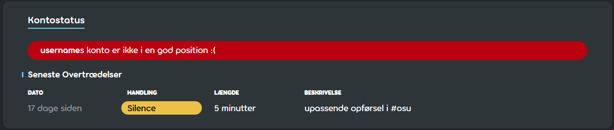

# Silences

**Silence** (også uofficielt kaldt *Mute*) er begrebet for straffen af at begrænse en spillers muligheder for kommunikation i osu!-fællesskabet. Medlemmer af [Global Moderation Teamet](/wiki/People/Global_Moderation_Team) og [Nomination Assessment Teamet](/wiki/People/Nomination_Assessment_Team) udsteder silences for at opretholde fællesskabsreglerne og den almene orden, både på hjemmesiden og i spillet.

## Begrænsninger

::: Infobox

:::

En bruger, der er silenced, kan ikke gøre følgende:

- Bruge [chatten](/wiki/Client/Interface/Chat_console) (offentlig og privat), både i spillet og på hjemmesiden.
- Poste på nogen af osu!s fora.
- Poste kommentarer noget sted på hjemmesiden (beatmaps, ændringslog, nyheder).
- Deltage i [beatmapdiskussioner](/wiki/Beatmap_discussion).
- Redigere deres profildetaljer eller ændre deres avatar, titelbilleder og brugerside.
- Indsende og opdatere beatmaps.
- Deltage i [multiplayer](/wiki/Client/Interface/Multiplayer)-spil.

::: Infobox

:::

Når en bruger bliver silenced, fjernes alle deres beskeder i chatten, og i stedet for feltet for indtastning af chatbeskeder vises der en advarsel, der indeholder silencens varighed.[^chat-cleanup]

## Varigheder

Varigheden af en silence er mindst 5 minutter indtil højst 28 dage, og fordobler sig som regel for hver efterfølgende overtrædelse. Længden af den første silence udmåles i forhold til grovheden af overtrædelsen og brugerens tidligere opførsel. Når en silence bliver udstedt, lægges der især vægt på følgende faktorer, når varigheden bestemmes:

- **Atmosfære:** Chattens stemning på overtrædelsestidspunktet.
- **Hyppighed:** Gentagelser, uafhængig af tidligere silences.
- **Historik:** Brugerens tidligere registrerede overtrædelser.
- **Grovhed:** Alvorligheden af den begåede overtrædelse.

Nogle gange får brugere en sidste advarsel, før deres [konti bliver begrænset](/wiki/Help_centre/Account_restrictions), hvilket giver dem en mulighed til at rette deres adfærd.

## Almindelige grunde for silences

Typiske grunde for udstedelse af silences i den offentlige chat inkluderer, men er ikke begrænset til:

- **Spam:** En selvfølge.
- **Misbrug af store bogstaver:** Kun at skrive med store bogstaver.
- **Upassende adfærd/emner:** Den offentlige chat er ikke for diskussioner om følsomme emner eller emner, der ikke er passende for alle aldre.
- **Racisme:** Diskriminering eller had på baggrund af etnicitet, religion, køn, seksuel orientering, osv.
- **Reklamering:** Promovering af produkter eller tjenester. Dette inkluderer invitationer til Discord-servere og links til streaming-sider såsom Twitch og YouTube.
- **Uønsket indhold:** Hjemmesider med piratkopier, chokerende indhold, overdrevne reklamer eller lignende.

Silences kan også blive udstedt af andre grunde, der inkluderer (men er ikke begrænset til):

- **Indsendelse af beatmaps med upassende indhold:** Detaljer såsom metadata, tags, sværhedsgradsnavne og baggrundbilleder.
- **Upassende adfærd:** Steder såsom osu!s fora, beatmapdiskussioner og kommentarer.
- **Upassende profil:** Indhold såsom avatarer, titelbilleder og profildetaljer.

## Klager

Silences bliver udstedt til at bevare et positivt miljø i fællesskabet, men fejl kan ske. Hvis du mener, at du er blevet silenced uretfærdigt eller ved en fejl, kan du kontakte [kontostøtteholdet](/wiki/People/Account_support_team#accounts@ppy.sh) via [accounts@ppy.sh](mailto:accounts@ppy.sh) og forklare situationen.

Husk, at du skal bruge mailadressen knyttet til din osu!-konto — og nævn dit brugernavn for at bekræfte, at det er dig.

## References

[^chat-cleanup]: [Blogopslag af ppy (2012-12-17) "This Week in osu!"](https://blog.ppy.sh/post/38114063519/this-week-in-osu-5)
