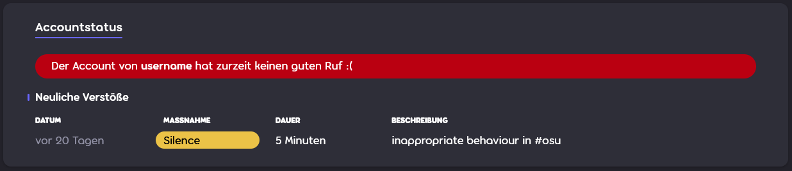

# Stummschaltung

Eine **Stummschaltung** (auch *Silence* genannt) ist eine Strafe, bei der einem Spieler die Kommunikation innerhalb der osu!-Community verwehrt wird. Stummschaltungen können durch Mitglieder des [Globalen Moderationsteams](/wiki/People/Global_Moderation_Team) und des [Nomination Assessment Teams](/wiki/People/Nomination_Assessment_Team) festgelegt werden, damit die allgemeine Umgangsform auf der Webseite und im Spiel angemessen bleibt.

## Beschränkungen

::: Infobox

:::

Nutzer, die von Moderatoren stumm geschaltet werden, können folgende Dinge nicht machen:

- Den [Chat](/wiki/Client/Interface/Chat_console) benutzen (öffentlich und privat), sowohl im Spiel als auch auf der Webseite
- In irgendeinem der osu!-Foren beitragen
- Kommentare auf der Webseite hinterlassen (Neuigkeiten, Änderungsprotokoll, Beatmaps)
- An [Beatmap-Diskussionen](/wiki/Beatmap_discussion) teilnehmen
- Profildetails bearbeiten sowie Änderungen am Avatar, am Titelbild oder der Nutzerseite vornehmen
- Beatmaps einreichen und aktualisieren
- Am [Mehrspielermodus](/wiki/Client/Interface/Multiplayer) teilnehmen

::: Infobox

:::

Nachdem ein Nutzer stumm geschaltet wurde, werden alle Nachrichten des Nutzers entfernt. Des Weiteren wird eine Warnung anstelle der Chateingabe angezeigt, die anmerkt, wann die Stummschaltung aufgehoben wird.[^chat-cleanup]

## Dauer

Die Dauer einer Stummschaltung reicht von 5 Minuten bis maximal 28 Tage und verdoppelt sich in der Regel bei jedem weiteren Verstoß. Zu Beginn wird die Dauer abhängig vom Schweregrad des Verstoßes und dem früheren Verhalten des Nutzers festgelegt. Die Faktoren, die bei der Dauer eine Rolle spielen, sind:

- **Atmosphäre:** Die aktuelle Stimmung im Chat.
- **Häufigkeit:** Wiederholungen, unabhängig von früheren Stummschaltungen.
- **Früheres Verhalten:** Aufzeichnungen früherer Verstöße.
- **Schwere:** Der Schweregrad des Verstoßes.

In einigen Fällen erhalten Nutzer möglicherweise eine letzte Warnung, bevor ihr [Account eingeschränkt wird](/wiki/Help_centre/Account_restrictions). Dadurch haben Nutzer die Möglichkeit, ihr Fehlverhalten selbst zu überdenken.

## Häufige Gründe für Stummschaltungen

Häufige Gründe für Stummschaltungen im öffentlichen Chat sind (nicht darauf beschränkt):

- **Spam:** Selbsterklärend.
- **Missbrauch der Feststelltaste:** Texte nur mit Großbuchstaben schreiben.
- **Unangemessenes Verhalten/Thema:** Diskussionen im öffentlichen Chat müssen sich für alle Altersgruppen eignen und sollten keine sensiblen Themen behandeln.
- **Rassismus:** Diskriminierung oder Hass basierend auf der ethnischen Abstammung, der Religion, dem Geschlecht, der sexuellen Orientierung usw.
- **Werbung:** Werbung für Produkte oder Dienste machen. Dazu gehören Einladungen zu Discord-Servern und Streamingangeboten wie Twitch und YouTube.
- **Unerwünschte Inhalte:** Webseiten mit Raubkopien, Clickbait, Weiterleitungen und dergleichen.

Nutzer erhalten Stummschaltungen möglicherweise auch aus den folgenden Gründen (nicht darauf beschränkt):

- **Veröffentlichung einer Beatmap mit unangemessenen Inhalten:** Details wie Metadaten, Tags, Namen von Spielleveln und Hintergrundbilder.
- **Unangemessenes Verhalten:** Orte wie die Foren, Beatmap-Diskussionen und Kommentare.
- **Unangemessenes Profil:** Inhalte wie Avatare, Titelbilder und Profilbeschreibungen.

## Einer Stummschaltung widersprechen

Stummschaltungen sind wichtig für einen positiven Umgang in der Community, jedoch können Fehler passieren. Wenn du glaubst, zu Unrecht stumm geschaltet worden zu sein, dann kontaktiere das [Account-Support-Team](/wiki/People/Account_support_team#accounts@ppy.sh) via [accounts@ppy.sh](mailto:accounts@ppy.sh) und erkläre die Situation.

Stelle sicher, dass du die mit deinem osu!-Account verknüpfte E-Mail-Adresse verwendest. Erwähne deinen osu!-Benutzernamen, um zu bestätigen, dass du es bist.

## Referenzen

[^chat-cleanup]: [Blogbeitrag von ppy (17.12.2012) "This Week in osu!"](https://blog.ppy.sh/post/38114063519/this-week-in-osu-5)
