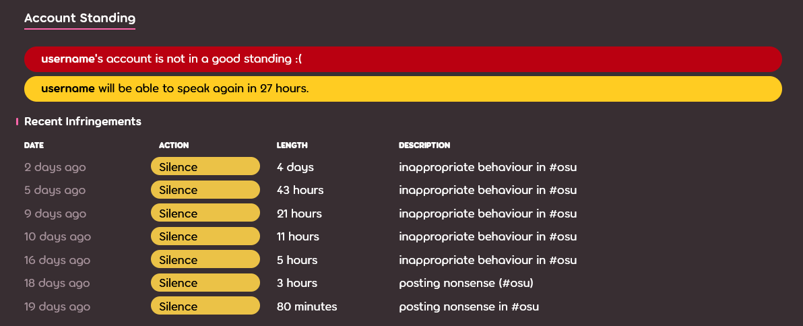
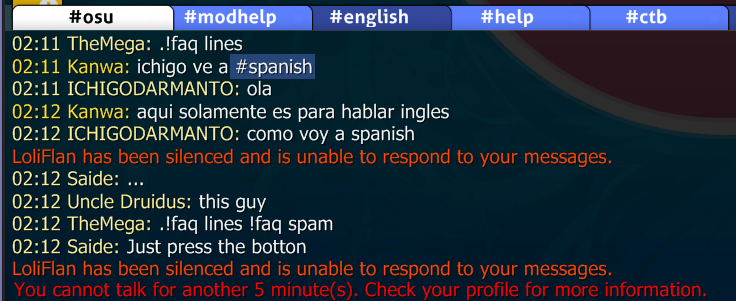

# Silence

Le **silence** est un terme utilisé pour décrire la sanction consistant à limiter les moyens de communication d'un utilisateur au sein de la communauté d'osu!. Les silences peuvent être imposés par les membres de la [Global Moderation Team](/wiki/People/Global_Moderation_Team) et de la [Nomination Assessment Team](/wiki/People/Nomination_Assessment_Team), et ne sont imposés qu'aux utilisateurs qui ont enfreint les [règles de la communauté](/wiki/Rules).

## Limitations

::: Infobox

:::

Les utilisateurs qui sont réduits au silence par les modérateurs ne peuvent pas faire ce qui suit :

- Utiliser le [tchat](/wiki/Client/Interface/Chat_console) (public et privé), tant dans le jeu que sur le site web.
- Postez sur l'un des forums d'osu!.
- Laissez des commentaires n'importe où sur le site (news, changelog, beatmaps).
- Participez aux [discussions sur les beatmaps](/wiki/Beatmap_discussion)
- Modifier les détails du profil (par exemple, l'avatar, la section "moi!", etc.)
- Envoyer et mettre à jour les beatmaps
- Participer à des jeux [multijoueurs](/wiki/Client/Interface/Multiplayer)

En outre, tous les messages d'un utilisateur réduit au silence sont supprimés de tous les canaux de discussion et des conversations privées.[^chat-cleanup]

::: Infobox

:::

Après qu'un utilisateur a été réduit au silence, une alerte s'affiche à la place du champ de saisie du tchat, indiquant le moment où le silence se dissipe. L'enregistrement du silence peut également être observé en bas du profil sur le site web, d'où il disparaîtra après 28 jours.

## Faire appel d'un silence

Si vous pensez avoir été injustement réduit au silence, contactez [l'équipe d'assistance aux comptes](/wiki/People/Account_support_team#accounts@ppy.sh) à [accounts@ppy.sh](mailto:accounts@ppy.sh) pour contester le silence. Assurez-vous de le faire à partir de l'e-mail lié à votre compte osu! ; mentionnez votre nom d'utilisateur osu! ainsi que la date et l'heure approximatives auxquelles le silence a été prononcé.

## Raisons courantes des silences

*Attention : Adopter un "comportement inapproprié" dans les messages privés n'est pas contraire aux règles, à moins que le comportement inapproprié ne soit transmis à des destinataires non consentants ou inconscients. En cas de signalement, des sanctions appropriées seront prises.*

- Comportement inapproprié dans les tchats ou forums publics (par exemple, `#multiplayer`, discussions sur les beatmaps, commentaires, etc.), y compris, mais sans s'y limiter, le spamming, les discussions absurdes, le racisme, etc.
- Télécharger ou publier du contenu inapproprié par d'autres moyens (par exemple, avatars de profil, envois des beatmap, détails de profil, bio de page d'utilisateur, bannière, etc.).

La durée d'un silence peut varier en fonction de la gravité de l'infraction. Les silences peuvent s'empiler les uns sur les autres, ajoutant plus de temps pour chacun d'eux. Veuillez noter que si une infraction est suffisamment grave, ou si un joueur est un récidiviste, elle peut entraîner une [restriction du compte](/wiki/Help_centre/Account_restrictions) au lieu d'un silence.

## Références

[^chat-cleanup]: [Post de blog par ppy (17/12/2012) "This Week in osu!"](https://blog.ppy.sh/post/38114063519/this-week-in-osu-5)
