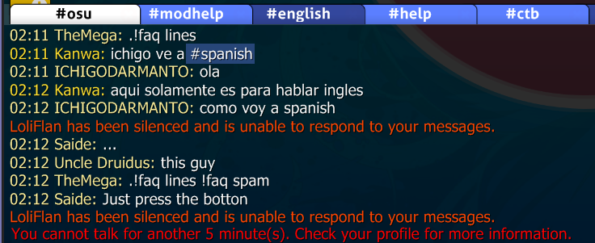

---
tags:
  - mute
  - timeout
  - chat ban
  - сало
  - мьют
  - бан чата
  - блок чата
  - молчанка
---

# Сайленс

**Сайленс** (англ. *silence* — тишина, жарг. *сало*, *мьют*, *молчанка*) — это набор ограничений, которые не позволяют игроку контактировать с другими пользователями. Сайленсы выдаются [модераторами](/wiki/People/Global_Moderation_Team) и членами [команды оценки номинаций](/wiki/People/Nomination_Assessment_Team) ради поддержания порядка как в игре, так и на сайте.

## Ограничения

::: Infobox

:::

Игрок, который получил сайленс, не сможет делать следующее:

- Использовать онлайн-[чат](/wiki/Client/Interface/Chat_console) и отправлять личные сообщения в игре и через веб-сайт;
- Оставлять сообщения на форуме;
- Оставлять комментарии на сайте под новостями, картами и чейнджлогами osu!;
- Модить карты через [систему обсуждения карт](/wiki/Beatmap_discussion);
- Редактировать профиль, менять аватарку, баннер или юзерпейдж;
- Публиковать новые карты или обновлять уже имеющиеся;
- Играть в [мультиплеере](/wiki/Client/Interface/Multiplayer);

::: Infobox

:::

Если игрок получил сайленс, то все его сообщения будут удалены из чата. При открытии окна чата он увидит заблокированное поле ввода, поверх которого будет написано, когда сайленс заканчивается.[^chat-cleanup]

Выданные сайленсы перечислены в профиле пользователя в разделе `Нарушения`. Они видны всем пользователям в течение 28 дней после их истечения. У действующих сайленсов показывается оставшееся время. Если у пользователя 3 или больше видимых сайленсов, либо есть хотя бы один видимый сайленс длиной от 43 часов, то в профиль добавляется отдельное предупреждение о состоянии аккаунта.

## Длительность

Сайленсы начинаются от 5 минут и обычно удваиваются с каждым последующим нарушением, а их максимальная длительность может составлять 28 дней. Тем не менее, длина сайленса зависит от нескольких факторов:

- **Атмосфера в чате** на момент получения сайленса;
- **Частота нарушений** без учёта прошлых сайленсов;
- **История поведения** пользователя;
- **Тяжесть** совершённого нарушения.

В некоторых случаях пользователя могут предупредить перед тем, как его аккаунт [будет ограничен](/wiki/Help_centre/Account_restrictions), чтобы у него был шанс перестать нарушать правила.

## Распространённые причины сайленса

Чаще всего сайленс можно получить по следующим причинам (список неполный):

- **Спам или флуд**;
- **ЗЛОУПОТРЕБЛЕНИЕ КАПСОМ**;
- **Неприемлемое поведение** или разговоры на откровенные или провокационные темы;
- **Расизм или дискриминация** по разным признакам: религиозному, половому, сексуальному и т.д.;
- **Реклама** продуктов, сервисов или мероприятий — например, постинг ссылок на дискорд-сервера, или частая реклама стримов;
- **Нежелательный контент:** пиратские сайты, скримеры, реферальные ссылки и тому подобные вещи.

К сайленсам может также привести нарушение правил вне чата:

- **Публикация карт** с метаданными, названиями сложностей или фонами, которые нарушают правила;
- **Плохое поведение** на форуме, в комментариях и при моддинге карт;
- **Содержимое профиля** — например, «плохая» аватарка, баннер, или прочие компоненты.

## Апелляция

В редких случаях сайленс может быть выдан по ошибке — если вы считаете, что так и вышло, или что сайленс не был оправдан, свяжитесь со [службой поддержки](/wiki/People/Account_support_team#accounts@ppy.sh), написав письмо на английском на [accounts@ppy.sh](mailto:accounts@ppy.sh). Отправляйте письмо с почтового адреса, привязанного к профилю osu!; в письме укажите свой ник и примерные дату и время, когда вы получили сайленс. У службы поддержки также можно спросить, за что именно вам выдали сайленс.

## Как не получить сайленс?

Внимательно прочитайте [правила](/wiki/Rules), [критерии визуального содержания](/wiki/Rules/Visual_content_considerations), [правила для песен](/wiki/Rules/Song_content_rules) и [кодекс поведения при моддинге и маппинге](/wiki/Rules/Code_of_conduct_for_modding_and_mapping) и следуйте им. Если вы не уверены, нарушает ли правила то, что вы хотите сделать или сказать, спросите об этом [кого-нибудь из модераторов](https://osu.ppy.sh/groups/4).

При возможности удалите или отредактируйте свои старые форумные сообщения, комментарии, карты и т.д., которые нарушают правила. Если удалить или изменить содержимое не получается, попросите модератора сделать это за вас.

## Примечания

[^chat-cleanup]: ["This Week in osu!", блог-пост от ppy, 17.12.2012](https://blog.ppy.sh/post/38114063519/this-week-in-osu-5)
