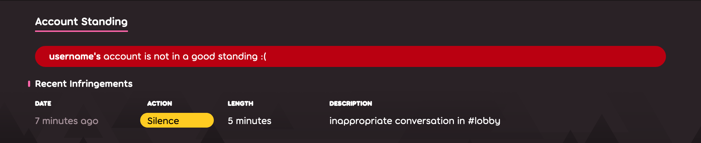

---
tags:
  - сало
  - мьют
  - бан чата
  - блок чата
  - молчанка
outdated_translation: true
outdated_since: 220f8e2cb5c0a920fc17f24436144b38510e05d9
---

# Сайленс

**Сайленс** (англ. *silence* — тишина, жарг. *сало*, *мьют*, *молчанка*) — это набор ограничений, которые не позволяют игроку контактировать с другими пользователями. Сайленсы накладываются [модераторами](/wiki/People/Global_Moderation_Team) и членами [команды оценки номинаций](/wiki/People/Nomination_Assessment_Team) на игроков, нарушивших [правила сообщества](/wiki/Rules).

## Ограничения

::: Infobox

:::

Игрок, который получил сайленс, не сможет делать следующее:

- Общаться в каналах [чата](/wiki/Client/Interface/Chat_console) или отправлять личные сообщения в игре и через веб-сайт;
- Оставлять сообщения на форуме;
- Оставлять комментарии на сайте под новостями, картами и чейнджлогами osu!;
- Модить карты через [систему обсуждения карт](/wiki/Beatmap_discussion);
- Редактировать профиль (менять аватарку, юзерпейдж, и т.д.);
- Публиковать новые карты или обновлять уже имеющиеся;
- Играть в [мультиплеере](/wiki/Client/Interface/Multiplayer);

Кроме того, после сайленса все сообщения игрока удаляются из общих каналов и личных переписок.[^chat-cleanup]

::: Infobox

:::

Если игрок получил сайленс, то при открытии окна чата он увидит заблокированное поле ввода. Поверх него будет написано, когда сайленс заканчивается. Выданный сайленс также будет записан в историю профиля в самом низу страницы, откуда он пропадёт через 28 дней.

## Апелляция

Если вы считаете, что сайленс был получен незаслуженно, свяжитесь со [службой поддержки](/wiki/People/Account_support_team#accounts@ppy.sh), написав письмо на английском на [accounts@ppy.sh](mailto:accounts@ppy.sh). Отправляйте письмо с почтового адреса, привязанного к профилю osu!; в письме укажите свой ник и примерные дату и время, когда вы получили сайленс.

## Распространённые причины сайленса

*Внимание: всякие безумства и плохое поведение в личных сообщениях будут считаться нарушениями, только если вы так поступаете без согласия собеседника. Если на вас пожалуются, то за этим может последовать наказание.*

- Неприемлемое поведение в публичных каналах чата или на сайте (например, в канале `#multiplayer`, в обсуждениях карты, комментариях и т.д.): спам, бессмыслица и туалетный юмор, расизм, а также другие нарушения правил чата.
- Другие способы публикации текста или медиа, нарушающего правила (аватарки, карты, информация в профиле, на юзерпейдже, в баннере и т.д.).

Длина сайленса варьируется в зависимости от тяжести нарушения. Модераторы могут накладывать несколько сайленсов за один раз, что продляет ограничения. Кроме того, в случае достаточно плохих поступков, а также стабильно частых или многократных нарушений правил, игрок может вместо сайленса [попасть в рестрикт](/wiki/Help_centre/Account_restrictions).

## Примечания

[^chat-cleanup]: ["This Week in osu!", блог-пост от ppy, 17.12.2012](https://blog.ppy.sh/post/38114063519/this-week-in-osu-5)
