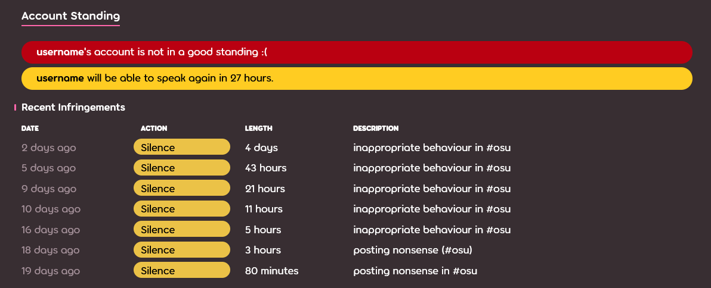
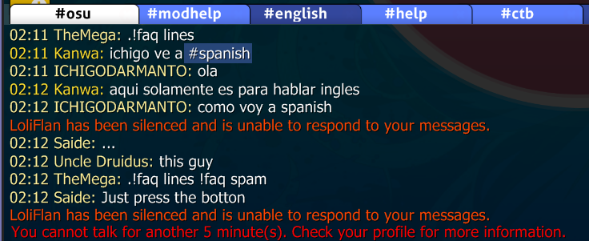

---
tags:
  - mute
  - timeout
  - chat ban
---

# การระงับการแชท (Silences)

**Silence** (การระงับการแชท) คือคำที่ใช้เรียกบทลงโทษในการจำกัดช่องทางการสื่อสารของผู้ใช้ภายในชุมชน osu! สมาชิกของ [Global Moderation Team](/wiki/People/Global_Moderation_Team) และ [Nomination Assessment Team](/wiki/People/Nomination_Assessment_Team) มักจะเป็นผู้ออกคำสั่งระงับการแชทเหล่านี้เพื่อรักษาสภาพแวดล้อมที่สะอาด ทั้งบนเว็บไซต์และภายในเกม

## ข้อจำกัด (Limitations)

::: Infobox

:::

ผู้ใช้ที่อยู่ภายใต้สถานะระงับการแชทจะไม่สามารถทำสิ่งต่อไปนี้ได้:

- ใช้ระบบ [แชท](/wiki/Client/Interface/Chat_console) ออนไลน์ (ทั้งสาธารณะและส่วนตัว) ทั้งภายในเกมและบนเว็บไซต์
- โพสต์ในฟอรัมใดๆ ของ osu!
- โพสต์ความคิดเห็นในส่วนต่างๆ ของเว็บไซต์ (บีทแมพ, รายการการเปลี่ยนแปลง, ข่าวสาร)
- มีส่วนร่วมใน [การสนทนาบีทแมพ (beatmap discussions)](/wiki/Beatmap_discussion)
- แก้ไขรายละเอียดโปรไฟล์, เปลี่ยนรูปอวาตาร์, ภาพปก และหน้าผู้ใช้ (userpage)
- ส่งและอัปเดตบีทแมพ
- เข้าร่วมในเกมแบบ [ผู้เล่นหลายคน (multiplayer)](/wiki/Client/Interface/Multiplayer)

::: Infobox

:::

เมื่อผู้ใช้ถูกสั่งระงับการแชท ข้อความทั้งหมดของพวกเขาในแชทจะถูกลบออก และจะมีการแสดงการแจ้งเตือนขึ้นแทนที่ช่องกรอกข้อความแชท ซึ่งระบุระยะเวลาของการระงับการแชทที่กำลังมีผลอยู่[^chat-cleanup]

## ระยะเวลา (Durations)

ระยะเวลาของการระงับการแชทเริ่มต้นที่ 5 นาที และโดยทั่วไปจะเพิ่มขึ้นเป็นสองเท่าสำหรับการกระทำผิดในแต่ละครั้งถัดไป สูงสุดไม่เกิน 28 วัน แต่ระยะเวลาเริ่มต้นอาจแตกต่างกันไปขึ้นอยู่กับการกระทำความผิดที่เกิดขึ้นและประวัติก่อนหน้าของผู้ใช้ ปัจจัยที่นำมาพิจารณาในการกำหนดความยาวของการระงับการแชท ได้แก่:

- **บรรยากาศ (Atmosphere):** สถานะของสภาพแวดล้อมในการแชท ณ ขณะนั้น
- **ความถี่ (Frequency):** การกระทำซ้ำโดยไม่คำนึงถึงการระงับการแชทที่เคยได้รับก่อนหน้า
- **ประวัติ (History):** บันทึกการละเมิดกฎในอดีต
- **ความรุนแรง (Severity):** ความร้ายแรงของการกระทำความผิดที่เกิดขึ้น

ในบางกรณี ผู้ใช้อาจได้รับคำเตือนสุดท้ายก่อนที่จะมีการ [จำกัดบัญชี (account restriction)](/wiki/Help_centre/Account_restrictions) เพื่อให้โอกาสในการหยุดพฤติกรรมที่เป็นปัญหา

## เหตุผลทั่วไปสำหรับการระงับการแชท

เหตุผลทั่วไปบางประการที่ทำให้ผู้ใช้ถูกระงับการแชทในแชทสาธารณะ ได้แก่ (แต่ไม่จำกัดเพียง):

- **การสแปมหรือฟลัดข้อความ (Spamming or flooding):** ตรงตามชื่อ
- **การใช้ตัวพิมพ์ใหญ่มากเกินไป (Caps abuse):** การแชทด้วยตัวอักษรภาษาอังกฤษพิมพ์ใหญ่ทั้งหมด
- **พฤติกรรม/บทสนทนาที่ไม่เหมาะสม:** แชทสาธารณะไม่ใช่สถานที่สำหรับหารือในเรื่องที่ไม่เหมาะสมสำหรับทุกวัย หรือหัวข้อที่สร้างความแตกแยก
- **การเหยียดเชื้อชาติ (Racism):** การเลือกปฏิบัติหรือความเกลียดชังโดยอิงจากเชื้อชาติ, ศาสนา, เพศ, รสนิยมทางเพศ ฯลฯ
- **การโฆษณา (Advertising):** การโปรโมทสินค้าหรือบริการ ซึ่งรวมถึงลิงก์คำเชิญ Discord และลิงก์สตรีมมิ่ง เช่น Twitch และ YouTube
- **เนื้อหาที่ไม่พึงประสงค์:** เว็บไซต์ที่มีเนื้อหาละเมิดลิขสิทธิ์, วิดีโอหลอน (screamers), ลิงก์แนะนำ (referrals) และสิ่งที่คล้ายกัน

การระงับการแชทอาจเกิดขึ้นจากเหตุผลอื่นๆ เช่น (แต่ไม่จำกัดเพียง):

- **การส่งบีทแมพที่ไม่เหมาะสม:** รายละเอียดต่างๆ เช่น metadata, แท็ก, ชื่อระดับความยาก และภาพพื้นหลัง
- **ความประพฤติที่ไม่เหมาะสม:** ในสถานที่ต่างๆ เช่น ฟอรัม, การสนทนาบีทแมพ และความคิดเห็น
- **โปรไฟล์ที่ไม่เหมาะสม:** เนื้อหาเช่น อวาตาร์, ภาพปก และรายละเอียดโปรไฟล์

## การอุทธรณ์ (Appealing)

แม้ว่าการระงับการแชทจะถูกนำมาใช้เพื่อรักษาสภาพแวดล้อมเชิงบวกของชุมชน แต่ความผิดพลาดก็อาจเกิดขึ้นได้ หากคุณเชื่อว่าการระงับการแชทที่ได้รับนั้นเป็นความผิดพลาดหรือไม่ยุติธรรม โปรดติดต่อ [ทีมสนับสนุนบัญชี](/wiki/People/Account_support_team#accounts@ppy.sh) ที่ [accounts@ppy.sh](mailto:accounts@ppy.sh) และอธิบายสถานการณ์ที่เกิดขึ้น

พึงระลึกไว้ว่าคุณต้องใช้ที่อยู่อีเมลที่เชื่อมโยงกับบัญชี osu! ของคุณและระบุชื่อผู้ใช้เพื่อยืนยันว่าเป็นคุณ

## อ้างอิง (References)

[^chat-cleanup]: [โพสต์บล็อกโดย ppy (2012-12-17) "This Week in osu!"](https://blog.ppy.sh/post/38114063519/this-week-in-osu-5)
