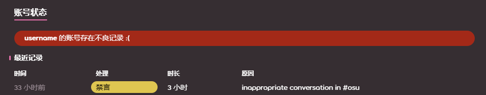

# 禁言

**禁言** 是一个术语，即限制玩家在 osu! 社区内聊天活动的惩罚。[全局管理团队 (GMT)](/wiki/People/Global_Moderation_Team) 和 [审核评估团队 (NAT)](/wiki/People/Nomination_Assessment_Team) 成员可以禁言其他玩家，来保证网站和游戏内有一个和善文明的环境。

## 限制

::: Infobox

:::

处于禁言状态的玩家不能：

- 使用任何形式的[聊天](/wiki/Client/Interface/Chat_console)，这包含了公共频道和私密频道、也包含了游戏内和网站内。
- 在任何 osu! 论坛里发帖。
- 在网站可评论的地方评论（谱面、更新日志、新闻的讨论区）。
- 参与[谱面讨论](/wiki/Beatmap_discussion)。
- 编辑个人资料，更换头像、封面、个人主页。
- 发布和更新谱面。
- 参与[多人](/wiki/Client/Interface/Multiplayer)游戏。

除此之外，禁言还会删除被禁言玩家曾发表在所有聊天频道和私人对话中的消息。[^chat-cleanup]

::: Infobox

:::

当玩家被禁言后，他们在聊天内发送的所有消息都会被移除，并且在他们的消息发送框内会展示一条警告，其中包含了禁言状态的持续时长。[^chat-cleanup]

## 时长

禁言的持续时长通常 5 分钟起步，并在多次违反后加倍，最高可达 28 天。但起步时长通常会根据玩家违反的条例和过往违规记录而决定。被考虑的方面包括：

- **氛围：** 当前聊天环境的状态。
- **频率：** 即使之前已经被禁言过，也再次违规。
- **历史：** 以往的违规记录。
- **严重程度：** 违规行为的严重程度。

在某些情况下，玩家可能会在[账号限制](/wiki/Help_centre/Account_restrictions)之前，收到最终警告。这是他们停止违规行为的最后机会。

## 常见的禁言原因

玩家可能在公共聊天内被禁言的原因，包括但不限于：

- **刷屏或者灌水：** 不言而喻。
- **滥用大写：** 在聊天中全部使用大写（这很冒犯）。
- **不合适的行为和交谈：** 公共聊天室不宜讨论不适合所有年龄段或煽动性的话题。
- **种族歧视：** 基于种族、宗教、性别、性取向等的歧视或仇恨。
- **发布广告：** 推广产品或者服务。这包括 Discord 邀请链接，或是 Twitch 和 YouTube 的直播链接。
- **不需要的内容：** 包含盗版、猎奇、推荐之类的内容

玩家也可能会因为其他原因被禁言，比如但不限于：

- **不合适的谱面提交内容：** 比如元数据、标签、难度名的内容，以及背景图片的不合适内容。
- **不合适的行为：** 比如在论坛、谱面讨论区和评论区中做出的不合适行为。
- **不合适的资料：** 比如头像、封面和个人资料的不合适内容。

## 上诉

尽管禁言是为了确保一个积极的社区环境，但在执行时也可能出错。如果你认为你被禁言这件事是错误或不公正的，请通过 [accounts@ppy.sh](mailto:accounts@ppy.sh)，友善联系[账号支持团队](/wiki/People/Account_support_team#accounts@ppy.sh)并说明详细情况。

请记住，你必须使用你当前 osu! 账户内绑定的邮箱地址联系，并告知你的玩家名，来让我们得知你的身份。

## 参考

[^chat-cleanup]: [ppy 发表的博客 (2012-12-17) "This Week in osu!"](https://blog.ppy.sh/post/38114063519/this-week-in-osu-5)
