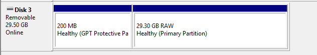

---
tags:
  - store
  - product
  - keyboard
  - tablet
  - area
  - device
  - setup
  - pendrive
---

# Store archive

*Main page: [osu!store and merchandise](/wiki/Help_centre/Store)*\
*Note: These products are no longer available for purchase from the osu!store. For the full list of items that were sold by the osu!store in the past, see: [Past osu!store items](/wiki/Past_osu!store_items)*

Having trouble with a product from the osu!store? Check if there's an available solution to your problem!

## osu!keyboard {id=osu!keyboard}

### How do I configure the osu!keyboard? {id=osu!keyboard-setup}

**You can use the osu!keyboard configuration utility, available from [puush](https://puu.sh/l6urN/4b6bc800f2.zip).**

Simply extract it to anywhere on your computer, and run the executable!

The rest should be self-explanatory.

If you have any further issues, please feel free to submit a ticket to [support@ppy.sh](mailto:support@ppy.sh) detailing your problem.

### The LEDs on my osu! nono keyboard aren't working! {id=osu!keyboard-leds}

**This can be due to a few reasons - corrosion between the LEDs and the mainboard, or in certain circumstances with earlier models, faulty LEDs.**

Please contact [store@ppy.sh](mailto:store@ppy.sh) for further inquiries.

#### Checking the LEDs for corrosion {id=osu!keyboard-corrosion}

**Rubbing the base of the LED connectors with a small square of aluminium foil will remove most of the residue caused from corrosion.**

Corrosive residue usually appears to be blackish-grey, or may appear as strange stains on the metal.

Removing this residue may restore your LED to working condition. If it does, you know how to fix it next time!

## osu!tablet {id=osu-tablet}

### My osu!tablet has stopped working or doesn't work at all! {id=osu-tablet-not-working}

**This can be tricky to troubleshoot since the osu!tablet is a two-unit solution (the tablet and the pen).**

Given that the osu!tablet is a two-unit solution (e.g. tablet and pen), it can be difficult to tell which unit is experiencing issues when things go wrong.

To find out, perform the following steps:

#### Checking for issues with your tablet device {id=osu-tablet-checkup}

**Follow these steps to check to see if your tablet device is functioning normally:**

1. Safely remove the tablet device from your system, and unplug the cable.
2. Gently plug the cable back into a USB slot on your system.
3. If the tablet is functioning, the light slot on the face of the tablet will flash green momentarily then fall dark. This is normal behaviour.

If the tablet's light does not flash, try using a different USB cable — the ones included with the tablet can sometimes be damaged during transit or after extensive use.

Please contact [store@ppy.sh](mailto:store@ppy.sh) for further inquiries.

#### Checking for issues with your pen device {id=osu-tablet-pen-checkup}

**Follow these steps to check to see if your pen device is functioning normally:**

- Unscrew the grip from the body of the pen, exposing the battery on the inside.
- Remove the AAA battery from the pen.
- Replace the battery with a brand new AAA battery. **Verify that the new battery functions in another device first.**
- Ensure that the battery's positive and negative ends are appropriate in the pen. There are markers on the device that display marks telling you which end goes where.
- Screw the grip back onto the pen.
- Depress the button on the back end (eraser end) of the pen until it clicks.

If your tablet unit is functioning properly, placing the pen near the tablet will make the cursor on your screen move.

Please contact [store@ppy.sh](mailto:store@ppy.sh) for further inquiries.

## osu!go {id=osu!go}

### My computer doesn't recognise the osu!go when I plug it in! {id=osu!go-not-recognised}

**This is a known issue with one of the very first shipments of the osu!go USB sticks, and comes down to the device not being formatted in a manner that works with all PCs.**

Despite how complex this may sound, it's actually very easy to fix.

First off, [download the package containing the osu!go default files](https://assets.ppy.sh/store/utilities/osu!go.zip) and save it somewhere on your computer.

#### Formatting the osu!go under Windows {id=osu!go-format}

**Follow these steps to prepare your osu!go device under Windows:**

1. Right click the `Start` menu button and select `Disk Management`.
2. **While in the Disk Management view, make sure to follow these instructions *VERY* closely and ONLY apply them to the osu!go device.** You can potentially lose data if you fiddle around in this dialog.
3. Check to see what state your computer recognises the device as being in.

### The osu!go device is present, but in a "RAW" state {id=osu!go-raw}

**This will appear like this in the Disk Management dialog:**

To fix this, ensure you have the osu!go device selected, right-click on the RAW partition, and select the `Format` option. Choose either `NTFS` or `exFAT` under the `File System` dropdown.

`exFAT` will work with more devices, but is slightly slower.

### The osu!go device doesn't show up in Disk Management at all {id=osu!go-partition}

**You will need to partition the device from scratch.**

Please follow [this guide](https://tails.boum.org/doc/reset/windows/index.en.html) for details on how to do that.

### I've reformatted the osu!go device and it now shows up in Disk Management {id=osu!go-clean}

**You're almost done!**

Unzip the archive we asked you to download earlier (osu!go.zip) into the osu!go drive and you're done!

### None of this worked! {id=osu!go-unknown-cause}

If you encounter any issues with this process, please send an email to [store@ppy.sh](mailto:store@ppy.sh) and we'd be happy to help you out.
