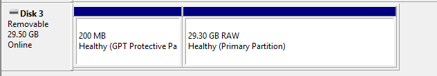

# Arsip toko

*Halaman utama: [osu!store dan cendera mata](/wiki/Help_centre/Store)*\
*Catatan: Produk-produk berikut ini sudah tidak lagi tersedia untuk dibeli dari osu!store. Untuk daftar item selengkapnya yang dahulu pernah dijual di osu!store, lihat: [Item osu!store terdahulu](/wiki/Past_osu!store_items)*

Mengalami masalah dengan produk osu!store tertentu? Simak artikel ini untuk melihat apakah terdapat solusi atas masalahmu!

## osu!keyboard {id=osu!keyboard}

### Bagaimana cara saya mengatur osu!keyboard? {id=osu!keyboard-setup}

**Kamu dapat menggunakan utilitas konfigurasi osu!keyboard yang tersedia dari [puush](https://puu.sh/l6urN/4b6bc800f2.zip).**

Cukup ekstrak berkas ini ke lokasi mana pun pada komputermu, lalu jalankan aplikasinya!

Langkah-langkah selanjutnya seharusnya akan dapat kamu ikuti dengan cukup jelas.

Apabila kamu memiliki masalah lebih lanjut, jangan sungkan untuk mengirimkan tiket layanan dukungan ke [support@ppy.sh](mailto:support@ppy.sh) dengan menyertakan rincian masalahmu.

### Lampu LED pada keyboard osu! nono saya tidak menyala! {id=osu!keyboard-leds}

**Hal ini dapat terjadi karena beberapa hal — baik itu karena korosi antara lampu LED dan *mainboard*, atau dalam situasi tertentu pada model yang lebih tua, karena lampu LED yang cacat pabrik.**

Silakan hubungi [store@ppy.sh](mailto:store@ppy.sh) untuk pertanyaan lebih lanjut.

#### Memeriksa korosi pada lampu LED {id=osu!keyboard-corrosion}

**Mengelap dasar konektor LED dengan kepingan kecil alumunium foil akan menghilangkan sebagian besar residu yang disebabkan oleh korosi.**

Residu korosif ini pada umumnya berwarna abu kehitaman atau tampak seperti noda yang berbentuk tidak wajar pada logam.

Memulihkan residu ini dapat memulihkan kondisi lampu LED kamu. Apabila lampu ini kembali menyala, kini kamu tahu bagaimana cara untuk menyelesaikan masalah ini ke depannya!

## osu!tablet {id=osu-tablet}

### osu!tablet saya berhenti berfungsi atau bahkan tidak dapat digunakan sama sekali! {id=osu-tablet-not-working}

**Masalah ini dapat cukup rumit untuk dipecahkan berhubung osu!tablet merupakan gabungan dari dua unit yang terpisah (tablet dan penanya).**

Karena sifat komponen osu!tablet yang terpisah ini, terkadang akan cukup sulit untuk menentukan unit mana yang bermasalah pada saat sesuatu yang tidak diinginkan terjadi.

Untuk mengetahui unit mana yang bermasalah, lakukan langkah-langkah berikut:

#### Memeriksa masalah dengan perangkat tabletmu {id=osu-tablet-checkup}

**Ikuti langkah-langkah berikut untuk memeriksa apakah perangkat tabletmu berfungsi secara normal:**

1. Lepas perangkat tablet dari sistem kamu secara aman dan cabut kabel tablet yang terhubung.
2. Pasang kembali kabel tablet ke *slot* USB pada sistem kamu.
3. Apabila tablet berfungsi dengan baik, *slot* lampu yang terdapat pada bagian muka tablet akan berkelip hijau selama sejenak sebelum kemudian berubah warna menjadi gelap. Ini adalah perilaku yang normal.

Apabila lampu tablet ini tidak berkelip, cobalah untuk menggunakan kabel USB yang berbeda — kabel yang datang satu paket dengan tablet terkadang dapat rusak pada saat transit atau setelah digunakan dalam jangka panjang.

Silakan hubungi [store@ppy.sh](mailto:store@ppy.sh) untuk pertanyaan lebih lanjut.

#### Memeriksa masalah dengan perangkat penamu {id=osu-tablet-pen-checkup}

**Ikuti langkah-langkah berikut untuk memeriksa apakah perangkat penamu berfungsi secara normal:**

- Lepas baut yang terdapat pada bagian pegangan (*grip*) pena, yang akan menyingkap baterai yang terdapat pada bagian dalam pena.
- Cabut baterai AAA ini dari pena.
- Ganti baterai ini dengan baterai AAA baru. **Pastikan terlebih dahulu pada perangkat lainnya bahwa baterai baru ini dapat berfungsi dengan baik.**
- Pastikan kutub positif dan negatif baterai berada pada tempat yang seharusnya. Terdapat penanda pada perangkatmu yang menunjukkan posisi peletakan masing-masing kutub.
- Satukan kembali bagian pegangan pena ke dalam badan pena.
- Tekan tombol yang berada pada bagian bawah (bagian penghapus) pena hingga tombol ini mengeluarkan bunyi klik.

Apabila unit tabletmu berfungsi dengan baik, kursor pada layar kamu akan bergerak pada saat pena didekatkan dengan tablet.

Silakan hubungi [store@ppy.sh](mailto:store@ppy.sh) untuk pertanyaan lebih lanjut.

## osu!go {id=osu!go}

### Komputer saya tidak mengenali osu!go pada saat saya menyambungkan perangkat ini! {id=osu!go-not-recognised}

**Hal ini merupakan masalah yang diketahui terjadi pada stik USB osu!go yang dikirim di awal-awal, dan disebabkan oleh perangkat yang tidak terformat dengan benar untuk dapat bekerja pada seluruh jenis PC.**

Walaupun hal ini terkesan sangat kompleks, masalah ini sebenarnya sangat mudah untuk diperbaiki.

Pertama-tama, [unduh paket yang berisi berkas bawaan osu!go ini](https://assets.ppy.sh/store/utilities/osu!go.zip) dan simpan paket ini pada suatu tempat di komputermu.

#### Memformat osu!go pada Windows {id=osu!go-format}

**Ikuti langkah-langkah berikut untuk menyiapkan perangkat osu!go milikmu pada sistem operasi Windows.**

1. Klik kanan tombol menu `Start` dan pilih `Disk Management`.
2. **Pada saat berada dalam tampilan Disk Management, pastikan untuk mengikuti instruksi di bawah ini dengan *SANGAT* seksama dan HANYA menerapkan segala sesuatunya pada perangkat osu!go milikmu.** Kamu dapat kehilangan berbagai data penting apabila kamu iseng bermain-main dengan kotak dialog ini.
3. Periksa dalam kondisi apa komputer kamu mengenali perangkat osu!go yang terpasang.

### Perangkat osu!go saya dikenali oleh komputer, namun dalam kondisi "RAW" {id=osu!go-raw}

**Tampilan berikut akan muncul pada kotak dialog Disk Management:**

Untuk memperbaiki hal ini, pastikan perangkat osu!go kamu sedang berada dalam kondisi terpilih, lalu klik kanan pada partisi RAW dan pilih `Format`. Pilih baik `NTFS` atau `exFAT` pada menu *dropdown* `File System` yang muncul.

`exFAT` pada umumnya akan dapat digunakan dengan lebih banyak perangkat, namun dengan kecepatan yang sedikit lebih lambat.

### Perangkat osu!go saya tidak muncul pada Disk Management sama sekali! {id=osu!go-partition}

**Kamu akan perlu untuk mempartisi perangkat ini dari awal.**

Silakan ikuti [panduan ini](https://tails.boum.org/doc/reset/windows/index.en.html) untuk memperoleh rincian seputar cara melakukan hal ini.

### Saya telah memformat ulang osu!go dan perangkat saya sekarang telah muncul pada Disk Management {id=osu!go-clean}

**Kamu hampir selesai!**

Ekstrak arsip yang kami minta untuk kamu unduh sebelumnya (osu!go.zip) ke *drive* osu!go, dan kamu telah selesai!

### Tidak ada satu pun dari hal ini yang membantu! {id=osu!go-unknown-cause}

Apabila kamu menemui masalah apa pun dengan proses ini, silakan kirim email ke alamat [store@ppy.sh](mailto:store@ppy.sh) dan kami akan membantumu dengan senang hati.
