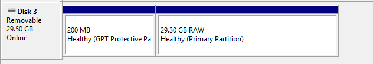

---
tags:
  - store
  - product
  - keyboard
  - tablet
  - area
  - device
  - setup
  - pendrive
---

# คลังข้อมูลร้านค้า (Store archive)

*หน้าหลัก: [ร้านค้า osu! และสินค้าที่ระลิก (osu!store and merchandise)](/wiki/Help_centre/Store)*
*หมายเหตุ: ผลิตภัณฑ์เหล่านี้ไม่มีจำหน่ายที่ osu!store อีกต่อไป สำหรับรายการสินค้าทั้งหมดที่เคยขายใน osu!store ในอดีต โปรดดูที่: [สินค้าในอดีตของ osu!store (Past osu!store items)](/wiki/Past_osu!store_items)*

กำลังมีปัญหากับผลิตภัณฑ์จาก osu!store ใช่หรือไม่? ตรวจสอบว่ามีวิธีแก้ไขปัญหาของคุณหรือไม่!

## osu!keyboard {id=osu!keyboard}

### ฉันจะกำหนดค่า osu!keyboard ได้อย่างไร? {id=osu!keyboard-setup}

**คุณสามารถใช้โปรแกรมอรรถประโยชน์สำหรับการกำหนดค่า osu!keyboard ซึ่งมีให้ดาวน์โหลดจาก [puush](https://puu.sh/l6urN/4b6bc800f2.zip)**

เพียงแตกไฟล์ไว้ที่ใดก็ได้ในคอมพิวเตอร์ของคุณ แล้วรันไฟล์ที่ใช้งานได้ (executable)!

ส่วนที่เหลือควรจะอธิบายได้ด้วยตัวมันเองอยู่แล้ว

หากคุณมีปัญหาเพิ่มเติม โปรดส่งตั๋วไปที่ [support@ppy.sh](mailto:support@ppy.sh) พร้อมระบุรายละเอียดปัญหาของคุณ

### ไฟ LED บนคีย์บอร์ด osu! nono ของฉันไม่ทำงาน! {id=osu!keyboard-leds}

**สิ่งนี้สามารถเกิดขึ้นได้จากหลายสาเหตุ - การกัดกร่อนระหว่างไฟ LED และเมนบอร์ด หรือในบางกรณีสำหรับรุ่นก่อนหน้า อาจเกิดจากไฟ LED ที่ชำรุด**

โปรดติดต่อ [store@ppy.sh](mailto:store@ppy.sh) สำหรับการสอบถามเพิ่มเติม

#### การตรวจสอบไฟ LED สำหรับการกัดกร่อน {id=osu!keyboard-corrosion}

**การขัดฐานของขั้วต่อ LED ด้วยฟอยล์อะลูมิเนียมชิ้นเล็กๆ จะช่วยขจัดคราบตกค้างส่วนใหญ่ที่เกิดจากการกัดกร่อนได้**

คราบกัดกร่อนมักปรากฏเป็นสีเทาดำ หรืออาจปรากฏเป็นรอยประหลาดบนโลหะ

การขจัดคราบตกค้างนี้อาจทำให้ไฟ LED ของคุณกลับมาใช้งานได้อีกครั้ง หากได้ผล คุณก็จะได้รู้วิธีแก้ไขในครั้งต่อไป!

## osu!tablet {id=osu-tablet}

### osu!tablet ของฉันหยุดทำงาน หรือไม่ทำงานเลย! {id=osu-tablet-not-working}

**สิ่งนี้อาจยุ่งยากในการแก้ไขปัญหา เนื่องจาก osu!tablet เป็นโซลูชันแบบสองยูนิต (ตัวแท็บเล็ตและตัวปากกา)**

เนื่องจาก osu!tablet เป็นโซลูชันแบบสองยูนิต (เช่น แท็บเล็ตและปากกา) จึงเป็นเรื่องยากที่จะบอกว่ายูนิตใดกำลังประสบปัญหาเมื่อมีสิ่งผิดปกติเกิดขึ้น

เพื่อค้นหาความจริง ให้ทำตามขั้นตอนต่อไปนี้:

#### การตรวจสอบปัญหาเกี่ยวกับอุปกรณ์แท็บเล็ตของคุณ {id=osu-tablet-checkup}

**ทำตามขั้นตอนเหล่านี้เพื่อตรวจสอบว่าอุปกรณ์แท็บเล็ตของคุณทำงานเป็นปกติหรือไม่:**

1. ถอดอุปกรณ์แท็บเล็ตออกจากระบบของคุณอย่างปลอดภัย และถอดสายออก
2. เสียบสายกลับเข้าไปในช่อง USB บนระบบของคุณอย่างระมัดระวัง
3. หากแท็บเล็ตทำงานอยู่ ช่องไฟบนหน้าแท็บเล็ตจะกะพริบเป็นสีเขียวชั่วขณะแล้วดับลง นี่คือพฤติกรรมปกติ

หากไฟของแท็บเล็ตไม่กะพริบ ให้ลองใช้สาย USB อื่น — สายที่มาพร้อมกับแท็บเล็ตบางครั้งอาจเสียหายระหว่างการขนส่งหรือหลังจากใช้งานเป็นเวลานาน

โปรดติดต่อ [store@ppy.sh](mailto:store@ppy.sh) สำหรับการสอบถามเพิ่มเติม

#### การตรวจสอบปัญหาเกี่ยวกับอุปกรณ์ปากกาของคุณ {id=osu-tablet-pen-checkup}

**ทำตามขั้นตอนเหล่านี้เพื่อตรวจสอบว่าอุปกรณ์ปากกาของคุณทำงานเป็นปกติหรือไม่:**

- คลายเกลียวด้ามจับออกจากตัวปากกา เพื่อเปิดให้เห็นแบตเตอรี่ที่อยู่ด้านใน
- ถอดแบตเตอรี่ AAA ออกจากปากกา
- เปลี่ยนแบตเตอรี่ด้วยแบตเตอรี่ AAA ก้อนใหม่ **ตรวจสอบว่าแบตเตอรี่ใหม่ทำงานได้ในอุปกรณ์อื่นก่อนเป็นอันดับแรก**
- ตรวจสอบให้แน่ใจว่าขั้วบวกและขั้วลบของแบตเตอรี่เหมาะสมกับปากกา มีสัญลักษณ์บนอุปกรณ์ที่แสดงเครื่องหมายบอกคุณว่าขั้วไหนไปทางไหน
- ขันเกลียวด้ามจับกลับเข้ากับปากกา
- กดปุ่มที่ส่วนท้าย (ส่วนที่เป็นยางลบ) ของปากกาจนกว่าจะมีเสียงคลิก

หากยูนิตแท็บเล็ตของคุณทำงานอย่างถูกต้อง การวางปากกาไว้ใกล้กับแท็บเล็ตจะทำให้เคอร์เซอร์บนหน้าจอของคุณเคลื่อนที่

โปรดติดต่อ [store@ppy.sh](mailto:store@ppy.sh) สำหรับการสอบถามเพิ่มเติม

## osu!go {id=osu!go}

### คอมพิวเตอร์ของฉันไม่รู้จัก osu!go เมื่อฉันเสียบมันเข้าไป! {id=osu!go-not-recognised}

**นี่เป็นปัญหาที่ทราบกันดีสำหรับหนึ่งในการจัดส่งรุ่นแรกๆ ของ USB stick osu!go และเกิดจากตัวอุปกรณ์ไม่ได้ถูกฟอร์แมตในลักษณะที่ทำงานได้กับพีซีทุกเครื่อง**

แม้ว่าสิ่งนี้จะฟังดูซับซ้อน แต่จริงๆ แล้วมันแก้ไขได้ง่ายมาก

ก่อนอื่น [ดาวน์โหลดแพ็กเกจที่มีไฟล์เริ่มต้นของ osu!go](https://assets.ppy.sh/store/utilities/osu!go.zip) และบันทึกไว้ที่ไหนสักแห่งในคอมพิวเตอร์ของคุณ

#### การฟอร์แมต osu!go ภายใต้ Windows {id=osu!go-format}

**ทำตามขั้นตอนเหล่านี้เพื่อเตรียมอุปกรณ์ osu!go ของคุณภายใต้ Windows:**

1. คลิกขวาที่ปุ่มเมนู `Start` และเลือก `Disk Management`
2. **ในขณะที่อยู่ในมุมมอง Disk Management ตรวจสอบให้แน่ใจว่าได้ปฏิบัติตามคำแนะนำเหล่านี้อย่างเคร่งครัดและใช้เฉพาะกับอุปกรณ์ osu!go เท่านั้น** คุณอาจสูญเสียข้อมูลได้หากคุณไปปรับเปลี่ยนอะไรเล่นในหน้าต่างโต้ตอบนี้
3. ตรวจสอบดูว่าคอมพิวเตอร์ของคุณรับรู้อุปกรณ์ว่าอยู่ในสถานะใด

### อุปกรณ์ osu!go ปรากฏขึ้น แต่อยู่ในสถานะ "RAW" {id=osu!go-raw}

**สิ่งนี้จะปรากฏขึ้นแบบนี้ในหน้าต่างโต้ตอบ Disk Management:**

ในการแก้ไขปัญหานี้ ตรวจสอบให้แน่ใจว่าคุณได้เลือกอุปกรณ์ osu!go ไว้ คลิกขวาที่พาร์ติชัน RAW และเลือกตัวเลือก `Format` เลือกเป็น `NTFS` หรือ `exFAT` ภายใต้เมนูแบบเลื่อนลงของ `File System`

`exFAT` จะทำงานร่วมกับอุปกรณ์ได้มากกว่า แต่จะช้ากว่าเล็กน้อย

### อุปกรณ์ osu!go ไม่แสดงใน Disk Management เลย {id=osu!go-partition}

**คุณจะต้องแบ่งพาร์ติชันอุปกรณ์ใหม่ตั้งแต่ต้น**

โปรดทำตาม [คู่มือนี้](https://tails.net/doc/first_steps/reset/windows/index.en.html) สำหรับรายละเอียดเกี่ยวกับวิธีการทำเช่นนั้น

### ฉันได้ฟอร์แมตอุปกรณ์ osu!go ใหม่แล้ว และตอนนี้มันแสดงขึ้นมาใน Disk Management {id=osu!go-clean}

**คุณเกือบจะเสร็จแล้ว!**

แตกไฟล์ archive ที่เราขอให้คุณดาวน์โหลดก่อนหน้านี้ (osu!go.zip) ลงในไดรฟ์ osu!go และก็เสร็จเรียบร้อย!

### ไม่มีวิธีไหนข้างต้นได้ผลเลย! {id=osu!go-unknown-cause}

หากคุณพบปัญหาใดๆ ในกระบวนการนี้ โปรดส่งอีเมลไปที่ [store@ppy.sh](mailto:store@ppy.sh) และเรายินดีที่จะช่วยเหลือคุณ