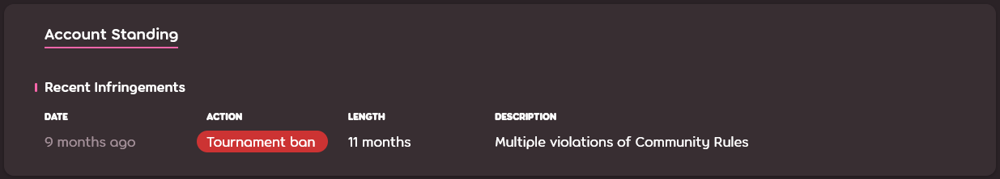

# Lệnh xử phạt giải đấu

*Trang chính: [trung tâm trợ giúp](/wiki/Help_centre)* 

## Lệnh cấm thi đấu

Lệnh cấm thi đấu ngăn người chơi tham gia các giải đấu chính thức hoặc được hỗ trợ chính thức. Nó cũng giới hạn phạm vi mà người chơi đó có thể tham gia với vai trò nhân viên hay cung cấp các hình thức hỗ trợ khác cho những giải đấu này.

Lệnh cấm thi đấu rất hiếm khi được áp dụng một cách riêng lẻ. Nhưng nói chung, hầu hết tất cả người chơi trở lại theo tiêu chuẩn kháng cáo đối với [hạn chế tài khoản](/wiki/Help_centre/Account_restrictions) sẽ phải chịu lệnh cấm có thời hạn kéo dài ít nhất một năm.

Do tính chất quan trọng của việc chơi các giải đấu, các lệnh cấm giải đấu được xử lý rất nghiêm túc và sẽ không nhận được sự khoan nhượng như những hạn chế tài khoản thường có thể nhận được.

### Điều gì khiến ai đó nhận lệnh cấm thi đấu tạm thời? {id=why-temporary} 

Bất kỳ vi phạm nghiêm trọng nào đối với các [quy tắc cộng đồng](/wiki/Rules) xảy ra trong một [giải đấu được hỗ trợ chính thức](/wiki/Tournaments/Official_support) cũng có thể gây ra lệnh cấm thi đấu, ngay cả khi hành vi đó thường chỉ bị xử nhẹ hơn khi xảy ra ngoài phạm vi giải đấu.

Lấy một ví dụ thực tế, hành vi như vậy sẽ bao gồm việc vẽ hoặc viết các từ ngữ miệt thị/lời lẽ xúc phạm (như swastika, v.v.) bằng khói con trỏ trong các trận đấu phát trực tiếp.

Tất cả người dùng quay lại trò chơi sau khi được gỡ hạn chế theo các điều kiện kháng cáo tiêu chuẩn đều phải chịu [lệnh cấm tham gia giải đấu tạm thời ít nhất 1 năm](/wiki/Help_centre/Account_restrictions#reasons) hoặc lâu hơn theo quyết định của [đội ngũ hỗ trợ tài khoản](/wiki/People/Account_support_team).

### Điều gì dẫn đến ai đó nhận được cấm thi đấu vô thời hạn? {id=why-permanent}

Việc sử dụng bất kỳ công cụ gian lận của bên thứ ba hoặc các phương pháp khác để đạt được lợi thế không công bằng so với những người tham gia khác trong một giải đấu được hỗ trợ chính thức sẽ dẫn đến lệnh cấm tham gia giải đấu vô thời hạn. Trong một số tình huống, đặc biệt là những trường hợp lạm dụng quá mức, cũng có thể dẫn đến hình phạt này tùy theo quyết định của nhóm hỗ trợ.

Điều này bao gồm những trường hợp như:

- Như đã nêu ở trên, bất kỳ việc sử dụng công cụ gian lận bên thứ ba hoặc tiện ích để giành lợi thế.
- Sử dụng nhiều tài khoản để tham gia giải đấu.
- Cố gắng né tránh lệnh im lặng hay vi phạm bằng cách sử dụng tài khoản khác.
- Chia sẻ tài khoản trong khi tham gia một giải đấu hỗ trợ chính thức.
- Kết hợp thu thập hoặc sử dụng thông tin riêng tư theo cách khác nhằm đạt được hoặc mang lại lợi thế (chẳng hạn như truy cập thông tin mappool trước các đội khác, v.v.)
- Lạm dụng vị trí tin cậy để đạt được hoặc mang lại lợi thế (sửa đổi lịch thi đấu, thay đổi đội hình một cách không công bằng, hoặc loại bỏ người tham gia mà không có lý do hay giải thích hợp lý).
- Tổ chức các chiến dịch lạm dụng có chủ đích nhằm vào người tham gia hoặc ban tổ chức nằm ngoài phạm vi chỉ trích.

## Tôi có thể làm gì sau khi đã bị cấm thi đấu? {id=while-banned}

Bạn có thể tiếp tục chơi trong các giải đấu cộng đồng mà không yêu cầu sự hỗ trợ chính thức hoặc cần phải xét duyệt theo quyết định của những người tổ chức sự kiện đó.

Bạn vẫn có thể làm nhân sự trong các giải đấu được hỗ trợ chính thức với vai trò là người phát trực tiếp, bình luận viên hay thiết kế đồ họa tùy theo quyết định của người tổ chức giải đấu. Đối với các vai trò khác, người tổ chức giải đấu mà bạn muốn hỗ trợ PHẢI xin một ngoại lệ trong yêu cầu hỗ trợ ban đầu của họ. Dựa trên lý do và mức độ nghiêm trọng của vi phạm, cùng với lịch sử của bạn. [Đội ngũ hỗ trợ tài khoản](/wiki/People/Account_support_team) sau cùng mới có thể chấp nhận ngoại lệ này.

Thông tin về trạng thái lệnh cấm thi đấu của bạn có thể được cung cấp cho các người tổ chức giải đấu khi có yêu cầu, cho dù họ có được hỗ trợ chính thức hay không.

## Những lý do cấm thi đấu phổ biến và thời lượng cấm {id=reasons}

| Lý do cấm thi đấu | Thời gian | Ghi chú |
| :-- | :-- | :-- |
| Vi phạm quy tắc cộng đồng trong một giải đấu. | 1 tháng hoặc hơn | Có thể kéo dài hơn tùy theo quyết định của đội ngũ hỗ trợ tài khoản |
| Thô tục với nhân viên hoặc lãng phí thời gian. | 1 tháng hoặc hơn |  |
| Hỗ trợ gian lận hoặc sử dụng nhiều tài khoản trong giải đấu | 6 tháng hoặc hơn |  |
| Hành vi sai trái của người chơi trong giải đấu được hỗ trợ chính thức | 1-2 năm |  |
| Quay lại theo điều khoản kháng cáo tiêu chuẩn | 1-2 năm | Có thể kéo dài hơn tùy theo quyết định của đội ngũ hỗ trợ tài khoản |
| Sử dụng nhiều tài khoản hoặc chia sẻ tài khoản trong giải đấu được hỗ trợ chính thức | Vô thời hạn | Cũng sẽ dẫn đến hạn chế |
| Sử dụng tiện ích bên thứ ba hoặc các công cụ gian lận khác trong giải đấu được hỗ trợ chính thức | Vô thời hạn | Cũng sẽ dẫn đến hạn chế |
| Tận dụng thông tin nội bộ/bảo mật của giải đấu để đạt được hoặc mang lại lợi thế không công bằng | Vô thời hạn | Cũng có thể dẫn đến hạn chế |
| Lạm dụng nghiêm trọng hoặc quấy rối ban tổ chức/nhân sự giải đấu/người tham gia giải đấu | Vô thời hạn | Cũng có thể dẫn đến hạn chế |

## Giám sát việc tổ chức 

Một giám sát đối với việc tổ chức được thực thi như là kết quả của vi phạm các quy tắc [hỗ trợ chính thức](/wiki/Tournaments/Official_support) rằng không được giải quyết thông qua trao đổi với người tổ chức sau khi giải đấu kết thúc. Khi một giám sát việc tổ chức được áp dụng với người dùng, các giải đấu áp dụng hỗ trợ chính thức tiếp theo do họ tổ chức sẽ bị giám sát chặt chẽ bởi Ủy ban Giải đấu trong lúc giải đấu diễn ra và sau khi hoàn thành. Những vấn đề nhỏ mà bình thường chỉ cần trao đổi qua email là xong mà không gây ra sự cố gì, nhưng trong trường hợp này sẽ khiến thời gian giám sát bị kéo dài. Vi phạm nghiêm trọng đối với các quy tắc hỗ trợ chính thức sau khi giám sát được áp dụng sẽ dẫn đến việc [cấm tổ chức giải đấu](#cấm-tổ-chức-giải-đấu) hoặc hình phạt lớn hơn, tùy theo quyết định của Ủy ban Giải đấu.

Giám sát việc tổ chức có thể được gỡ bỏ nếu giải đấu được tổ chức mà **không** vi phạm các quy tắc [hỗ trợ chính thức](/wiki/Tournaments/Official_support), điều này bao gồm các vấn đề nhỏ mà cần phải gửi email cho người tổ chức để sửa chúng. Các ví dụ về những vấn đề này bao gồm:

- Thiếu danh sách nhân sự trên bài đăng diễn đàn
- Không có kết quả vòng loại công khai 
- Không cập nhật thông tin trận đấu công khai, chẳng hạn như bảng đấu.
- Những lỗi cơ bản khác có tính chất tương tự.

Những người dùng thường xuyên mắc các lỗi nhỏ cần ủy ban nhắc nhở qua email sẽ tiếp tục bị giám sát vô thời hạn. Những người dùng không nỗ lực để phát triển chất lượng sự kiện của họ trong thời gian bị giám sát có thể phải chịu hình phạt nặng hơn theo quyết định của ủy ban. Giám sát việc tổ chức không tự động hết hạn.

Nếu một người dùng đối mặt với hình phạt nặng hơn, chẳng hạn như cấm việc tổ chức, giám sát của họ cũng sẽ kết thúc khi hình phạt của họ được gỡ bỏ. 

## Cấm tổ chức giải đấu

Lệnh cấm việc tổ chức ngăn cản người dùng trở thành người tổ chức chính hoặc quản lý đối với bất kỳ giải đấu hỗ trợ chính thức nào. Tuy nhiên, họ vẫn có thể tham gia vào các vai trò khác không liên quan đến việc tổ chức.

Ủy ban Giải đấu có quyền bỏ qua hình phạt [giám sát việc tổ chức](#giám-sát-việc-tổ-chức) trong các trường hợp vi phạm nghiêm trọng [các quy tắc hỗ trợ chính thức](/wiki/Tournaments/Official_support). Đặc biệt trong những trường hợp mà tính công bằng cạnh tranh là vấn đề đáng lo ngại.

## Cấm nhân sự giải đấu

Lệnh cấm làm nhân sự giải đấu ngăn một người dùng trở thành nhân viên trong giải đấu được hỗ trợ chính thức, ngoại lệ đối với việc phát trực tuyến, bình luận viên hoặc thiết kế đồ họa.

## Tôi có thể kháng cáo lệnh xử phạt giải đấu không? {id=appeal}

Lệnh xử phạt giải đấu được áp dụng qua các phương thức khác ngoài [điều khoản kháng cáo tiêu chuẩn](/wiki/Help_centre/Account_restrictions#appeal-granted) được đi kèm với thời hạn 72 giờ để kháng cáo, trong thời gian này người bị phạt có thể phản đối hình phạt. Sau khi quãng thời gian kháng cáo này trôi qua, các lệnh xử phạt không bao gồm lệnh cấm thi đấu vô thời hạn đều không thể kháng cáo. 

Lệnh cấm thi đấu vô thời hạn có thể được kháng cáo sau ít nhất **hai năm** (24 tháng) kể từ khi chúng được áp dụng lần đầu tiên. Người dùng kháng cáo lệnh cấm thi đấu vô thời hạn sẽ phải chứng minh được sự tham gia tích cực trong cộng đồng osu! rộng lớn hơn, thông qua các giải đấu thường hoặc bằng cách khác, và có một hồ sơ hành vi hoàn toàn trong sạch trong suốt khoảng thời gian này. Trong trường hợp đơn kháng cáo không thành công, người dùng bắt buộc phải chờ ít nhất **một năm** (12 tháng) kể từ ngày kháng cáo cuối cùng trước khi có thể kháng cáo trở lại.

Mặc dù việc kháng cáo lệnh cấm tham gia giải đấu vô thời hạn là khả thi như đã đề cập ở trên, cần phải nhấn mạnh rằng ngoài việc viết kháng cáo, người dùng còn phải thể hiện các đóng góp đáng kể cho cộng đồng nói chung thì mới có cơ hội thành công thực sự. Danh sách những lần kháng cáo thành công lệnh cấm thi đấu vô thời hạn có thể được tìm thấy trên [chủ đề diễn đàn này](https://osu.ppy.sh/community/forums/topics/1798871)

Trong những trường hợp hiếm hoi, [nhóm hỗ trợ tài khoản](/wiki/People/Account_support_team) có thể xem xét các trường hợp cụ thể theo đánh giá của họ và quyết định gỡ bỏ hoặc áp dụng lại các hình phạt phù hợp để đảm bảo chúng vẫn nhất quán với các trường hợp tương tự trong quá khứ.

## Các lệnh xử phạt giải đấu có hiển thị công khai không? {id=visibility}

::: Infobox

:::

Lệnh cấm thi đấu vô thời hạn và các lệnh cấm thi đấu được áp dụng qua cách thức khác với [điều khoản kháng cáo tiêu chuẩn](/wiki/Help_centre/Account_restrictions#appeal-granted) đều hiển thị trên hồ sơ của người dùng trong toàn bộ thời gian bị cấm được đề cập, cộng thêm **28 ngày** sau khi lệnh cấm hết hiệu lực. Lệnh xử phạt giải đấu khác (VD: giám sát việc tổ chức, cấm người tổ chức và cấm nhân sự giải đấu) đều không hiển thị theo cách này.
