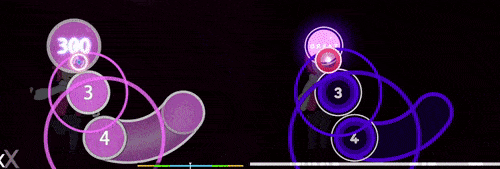
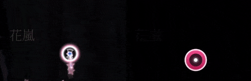
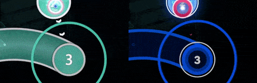
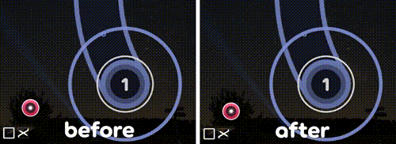
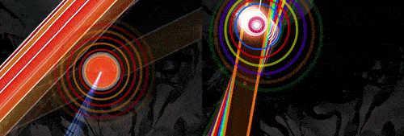
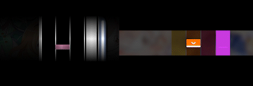

# Umstellung auf lazer

osu!(lazer) ist das nächste große Update des Spiels. In den letzten Jahren wurde das Spiel von Grund auf neu implementiert.

Auch wenn diese Version viele neue Funktionen bietet, die nicht in osu!(stable) zu finden sind, gibt es einige Funktionen, die nur in einem der beiden Clients vorhanden sind. Am Ende des Tages entscheiden **die Spieler**, auf welcher Version sie spielen möchten, und sie bestimmen, wie lange wir die vorherige Version weiter pflegen.

"lazer" ist ein Deckname und wird irgendwann verschwinden, wenn es die Hauptversion des Spiels wird. Der Rest dieses Dokuments bezeichnet zur Vereinfachung osu!(lazer) als "lazer" und osu!(stable) als "stable".

## Vergleich der Funktionen

Im Folgenden findest du eine umfassende Liste des **aktuellen Status** von lazer im Vergleich zu stable. Beachte, dass sich die Übersicht fortlaufend ändert — im Laufe der Zeit ist das Endziel die Umsetzung aller Features, die den Spielern wichtig sind.

### Kompatibilität und Leistung

| Feature | stable | lazer |
| :-- | :-- | :-- |
| Windows 8.0 und niedriger | ![Ja][true] | ![Nein][false] |
| macOS / Linux | ![Teilweise][partial][^wine] | ![Ja][true] |
| DirectX / Metal | ![Teilweise][partial][^compatibility-mode] | ![Ja][true] |
| Unterstützung für mobile Geräte | ![Nein][false] | ![Ja][true] |
| Multithreading-Architektur | ![Nein][false] | ![Ja][true] |
| Hardware-beschleunigte Videografik | ![Nein][false] | ![Ja][true] |
| Skalierung der Benutzeroberfläche | ![Nein][false] | ![Ja][true] |
| Benutzerdefinierte Spielmodi (Rulesets) | ![Nein][false] | ![Teilweise][partial][^dll] |
| Deduplizierter Dateispeicher | ![Nein][false] | ![Ja][true][^share-files] |
| Anpassung des Tablet-Bereichs | ![Nein][false] | ![Ja][true] |
| Unterstützung für viele Bildschirmformate | ![Nein][false] | ![Ja][true] |

### UI und Skinning

| Feature | stable | lazer |
| :-- | :-- | :-- |
| Skin-Unterstützung | ![Ja][true] | ![Teilweise][partial][^gameplay-only] |
| Gruppierungsmodi in der Songauswahl | ![Ja][true] | ![Ja][true] |
| Skin im Spiel / Bearbeitung des UI-Layouts | ![Nein][false] | ![Ja][true] |
| Dynamische, anpassbare Skinning-Komponenten | ![Nein][false] | ![Ja][true] |

### Benutzeroberfläche

| Feature | stable | lazer |
| :-- | :-- | :-- |
| Storyboards im Hauptmenü | ![Nein][false] | ![Ja][true][^supporter] |
| Schwierigkeitsgrade ausblenden | ![Nein][false] | ![Ja][true] |
| Einrichtungsassistent für den ersten Start | ![Nein][false] | ![Ja][true] |
| Temporäre Löschung | ![Nein][false] | ![Ja][true][^soft-deletion] |
| Unmittelbare Einstellungsänderungen während dem Spiel | ![Nein][false] | ![Ja][true] |

### Gameplay

| Feature | stable | lazer |
| :-- | :-- | :-- |
| Detaillierte Performance-Punkte-Anzeige | ![Teilweise][partial][^online] | ![Ja][true] |
| Anpassung der Schwierigkeit | ![Nein][false] | ![Ja][true][^difficulty-adjust] |
| Mod-Voreinstellungen | ![Nein][false] | ![Ja][true] |
| Einstellungen für Mods | ![Nein][false] | ![Ja][true] |
| Neue "spaßige" Mods | ![Nein][false] | ![Ja][true] |
| Combo-Farbennormalisierung[^normalisation] | ![Nein][false] | ![Ja][true] |
| Halten für HUD | ![Nein][false] | ![Ja][true][^hold-for-hud] |
| Offset-Kalibrierung pro Beatmap | ![Teilweise][partial][^offset-calibration-stable] | ![Ja][true][^offset-calibration-lazer] |
| osu!-Slider "schlängeln" sich beim Halten | ![Nein][false] | ![Ja][true][^can-disable] |
| Spielerfreundliches "Notelock" | ![Nein][false] | ![Ja][true][^note-lock] |
| Zeitabhängige Einfärbung von Noten in osu! und osu!mania | ![Nein][false] | ![Ja][true] |
| In Replays vor-/zurückspulen | ![Nein][false] | ![Ja][true] |
| Durchlaufende Replay-Kommentare wie bei [Niconico](https://de.wikipedia.org/wiki/Nico_Nico_Douga) | ![Ja][true] | ![Nein][false] |

### Online-Systeme

| Feature | stable | lazer |
| :-- | :-- | :-- |
| Score-Einreichung | ![Ja][true] | ![Ja][true] |
| Beatmap-Ranglisten | ![Ja][true] | ![Ja][true] |
| Profilstatistiken | ![Ja][true] | ![Ja][true] |
| Medaillen | ![Teilweise][partial][^medals-stable] | ![Teilweise][partial][^medals-lazer] |
| Performance-Punkte | ![Ja][true] | ![Ja][true] |
| Chat in Echtzeit | ![Teilweise][partial][^stable-chat] | ![Ja][true] |
| Wiki / Neuigkeiten / Änderungsprotokoll / Ranglisten | ![Nein][false] | ![Ja][true][^online-content] |
| Nutzerprofile | ![Nein][false] | ![Ja][true] |
| Beatmap-Auflistung | ![Teilweise][partial][^direct-supporter] | ![Ja][true] |
| Unbegrenzte Mehrspieler-Raumgröße | ![Nein][false][^multi-room-max] | ![Ja][true] |
| Zuschauen im Mehrspielermodus | ![Nein][false] | ![Ja][true] |
| Countdown-Timer | ![Teilweise][partial][^countdown-timers-stable] | ![Ja][true][^countdown-timers-lazer] |
| Warteschlangen-Modi | ![Nein][false] | ![Ja][true][^queue-modes] |
| Freestyle-Modus | ![Nein][false] | ![Ja][true][^freestyle] |
| Mehrspieler-Befehle | ![Ja][true] | ![Nein][false] |
| Tag Co-op | ![Ja][true] | ![Nein][false] |
| Playlists (von Benutzern erstellte Ranglisten) | ![Nein][false] | ![Ja][true] |
| Beatmaps mit Online-Änderungen aktualisieren | ![Teilweise][partial][^map-only] | ![Ja][true][^all-files] |

### Editor

| Feature | stable | lazer |
| :-- | :-- | :-- |
| osu!-Editor | ![Ja][true] | ![Ja][true] |
| osu!taiko-Editor | ![Nein][false] | ![Ja][true] |
| osu!catch-Editor | ![Nein][false] | ![Ja][true] |
| osu!mania-Editor | ![Ja][true] | ![Ja][true] |
| Öffne einen Schwierigkeitsgrad als Referenz | ![Ja][true] | ![Nein][false] |
| Anpassen der SV / Lautstärke pro Objekt | ![Nein][false] | ![Ja][true] |
| Festlegen des Kurventyps von Slidern pro Segment | ![Nein][false] | ![Ja][true] |
| Aufsplittung und Zusammenführung von Slidern | ![Nein][false] | ![Ja][true] |
| Pattern-Rotation | ![Ja][true] | ![Ja][true] |
| Pattern-Skalierung | ![Nein][false] | ![Ja][true] |
| Beatmap-Einreichung | ![Ja][true] | ![Ja][true] |
| Storyboard-Editor | ![Ja][true] | ![Nein][false] |
| Cross-Kompatibilität | ![Ja][true] | ![Ja][true] |

## Unterschiede im Gameplay

### Allgemein

#### Die Easy-Mod pausiert das Spiel nicht mehr, wenn die Lebenspunkte wiederhergestellt werden

Anstatt, dass das Spiel pausiert während sich die Lebensleiste füllt, wird die Gesundheit sofort wiederhergestellt.

|  |  |
| :-- | :-: |
| Abwärtskompatibel | ![Ja][true] |
| Umkehrbar mit der Classic-Mod | ![Nein][false] |
| Absichtliche Änderung | ![Nein][false] |
| Weitere Prüfung notwendig | ![Ja][true] |

#### Unterschiede im Bewertungssystem

Die Anforderungen für die Genauigkeit (und Beurteilungen) für jede [Note](/wiki/Gameplay/Grade) sehen in osu!(stable) wie folgt aus:

| Note | osu! / osu!taiko | osu!catch | osu!mania |
| :-: | :-- | :-- | :-- |
| SS | 100 % | 100 % | 100 % |
| S | >90 % GREATs/300s (≤1 % MEHs/50s, keine Misses) | >98 % | >95 % |
| A | >80 % GREATs/300s (keine Misses) oder >90 % GREATs/300s | >94 % | >90 % |
| B | >70 % GREATs/300s (keine Misses) oder >80 % GREATs/300s | >90 % | >80 % |
| C | >60 % GREATs/300s | >85 % | >70 % |

In osu!(lazer) hingegen gibt es folgende Anforderungen:

| Note | osu! / osu!taiko | osu!catch | osu!mania |
| :-: | :-- | :-- | :-- |
| SS | 100 % | 100 % | alle [Beurteilungen](/wiki/Gameplay/Judgement/osu!mania) sind GREAT oder PERFECT |
| S | ≥95 % (keine Misses) | ≥98 % | ≥95 % |
| A | ≥90 % | ≥94 % | ≥90 % |
| B | ≥80 % | ≥90 % | ≥80 % |
| C | ≥70 % | ≥85 % | ≥70 % |

|  |  |
| :-- | :-: |
| Abwärtskompatibel | ![Nein][false] |
| Umkehrbar mit der Classic-Mod | ![Nein][false] |
| Absichtliche Änderung | ![Ja][true] |
| Weitere Prüfung notwendig | ![Nein][false] |

#### Unterschiede im Punktesystem

Das Punktesystem in lazer ist ähnlich zu ScoreV2, wobei alle Scores, die mit ScoreV1 erzielt wurden, in das neue System migriert werden.

Es gibt zwei voneinander unabhängige Anzeigemodi für Scores: *standardisiert* und *klassisch*. Beim standardisierten Punktesystem wird der Punktestand auf maximal 1.000.000 Punkte begrenzt, wobei Boni und Punktemultiplikatoren nicht einberechnet sind (ähnlich zu ScoreV2). Im Vergleich dazu ist das klassische Punktesystem dasselbe wie das standardisierte, nur dass die Punkte quadratisch mit der Menge der Hit-Objekte in einer Beatmap skaliert sind (wie in ScoreV1). Der Anzeigemodus kann in den Einstellungen ausgewählt werden, wobei alle Punktedarstellungen automatisch angepasst werden.

Darüber hinaus gibt es Unterschiede, wie viele Punkte man für jedes Hit-Objekt und jede Beurteilung in Relation zueinander bekommen kann.

|  |  |
| :-- | :-: |
| Abwärtskompatibel | ![Nein][false] |
| Umkehrbar mit der Classic-Mod | ![Nein][false] |
| Absichtliche Änderung | ![Ja][true] |
| Weitere Prüfung notwendig | ![Ja][true] |

#### Storyboardtrigger sind nicht implementiert

Einige Storyboards enthalten Funktionen, die auf Spielereingaben oder die Lebenspunkte reagieren.

### osu!

#### Notelock wurde lascher eingestellt

In dichten Patterns ist es nun leichter, nach Verfehlen eines Hit-Objekts weiterzuspielen.

|  |  |
| :-- | :-: |
| Abwärtskompatibel | ![Nein][false] |
| Umkehrbar mit der Classic-Mod | ![Ja][true] |
| Absichtliche Änderung | ![Ja][true] |
| Weitere Prüfung notwendig | ![Nein][false] |

#### Sliderköpfe erfassen beim Treffen die Genauigkeit

In stable musste man bei Slidern bisher nur die Genauigkeit einer MEH-Beurteilung (50er) erreichen, um eine perfekte Beurteilung zu bekommen. Das geschah aus historischen Gründen, fühlt sich aber in einem Rhythmusspiel nicht richtig an. Sliderköpfe erfassen nun die Genauigkeit.

|  |  |
| :-- | :-: |
| Abwärtskompatibel | ![Nein][false] |
| Umkehrbar mit der Classic-Mod | ![Ja][true] |
| Absichtliche Änderung | ![Ja][true] |
| Weitere Prüfung notwendig | ![Nein][false] |

#### Mehr Kulanz bei Sliderköpfen

Wenn man einen Slider zu früh trifft, startet der Follow-Circle jetzt sofort im Führungsmodus, auch wenn der Cursor den Sliderball verlässt, bevor der Slider startet.

Des Weiteren werden beim zu späten Klicken eines Sliders alle Ticks oder Wiederholungen, die bereits vorüber sind, als absolviert gewertet.

Siehe [dieses englische YouTube-Video](https://www.youtube.com/watch?v=xTRwM3zhhj0&t=243s) für eine detaillierte Erklärung.

|  |  |
| :-- | :-: |
| Abwärtskompatibel | ![Nein][false] |
| Umkehrbar mit der Classic-Mod | ![Nein][false] |
| Absichtliche Änderung | ![Ja][true] |
| Weitere Prüfung notwendig | ![Nein][false] |

#### Sliderenden sind nun leichter zu treffen

Bei sehr schnellen Slidern muss der Cursor im Bereich für die letzten 36 ms sein, und nicht mehr im Bereich für exakt 36 ms vor dem Sliderende (Erhöhung der Trefferkulanz).

Siehe [dieses englische YouTube-Video](https://www.youtube.com/watch?v=SlWKKA-ltZY) für eine detaillierte Erklärung.

|  |  |
| :-- | :-: |
| Abwärtskompatibel | ![Nein][false] |
| Umkehrbar mit der Classic-Mod | ![Nein][false] |
| Absichtliche Änderung | ![Ja][true] |
| Weitere Prüfung notwendig | ![Nein][false] |

#### Das Verfehlen eines Sliderkopfes führt zu einem Miss

Bislang unterbrach die Combo beim Verfehlen eines Sliderkopfes (entweder, weil er nicht oder außerhalb des Trefferfensters getroffen wird), aber führte zu keinem Miss. Eine Beurteilung konnte man durch Abschluss des Rests des Sliders trotzdem noch erhalten. Dies ermöglichte Spielern Scores mit einer geringen maximalen Combo zu erzielen, obwohl sie genau genommen keine Misses hatten.

In lazer bekommt man beim Verfehlen des Sliderkopfes einen MISS für den gesamten Slider. Punkte, Combo und Genauigkeit können danach aber noch durch Sliderticks, -wiederholungen und -enden erzielt werden.

|  |  |
| :-- | :-: |
| Abwärtskompatibel | ![Nein][false] |
| Umkehrbar mit der Classic-Mod | ![Nein][false] |
| Absichtliche Änderung | ![Ja][true] |
| Weitere Prüfung notwendig | ![Nein][false] |

#### Sliderenden erzeugen keine Hitsounds, wenn sie nicht getroffen werden

Solange man Slider überhaupt trifft, spielt stable ihre Hitsounds ab, auch wenn man das Sliderende verfehlt. In lazer entsprechen die Hitsounds 1:1 den Eingaben.

|  |  |
| :-- | :-: |
| Abwärtskompatibel | ![Ja][true] |
| Umkehrbar mit der Classic-Mod | ![Ja][true] |
| Absichtliche Änderung | ![Ja][true] |
| Weitere Prüfung notwendig | ![Nein][false] |

#### Die Begrenzung der Spingeschwindigkeit von 477 RPM beim Spinner wurde entfernt

Anstatt der Geschwindigkeitsbegrenzung werden nun die Punkte limitiert, die durch die Gesamtzahl der Rotationen, die bei einem bestimmten RPM-Wert (Umdrehungen pro Minute) im Spinner erreichbar sind, bestimmt werden (abhängig vom OD-Wert).

Das bedeutet, dass die maximale Punktzahl früh durch ein schnelleres Spinnen erzielt werden kann, wobei danach keine weiteren Punkte für die restliche Dauer des Spinners vergeben werden.

Die erforderliche RPM, um die maximale Punktzahl zu bekommen, ist wie folgt:

| OD | RPM |
| --: | --: |
| 0 | 250 |
| 5 | 380 |
| 10 | 430 |

|  |  |
| :-- | :-: |
| Abwärtskompatibel | ![Nein][false] |
| Umkehrbar mit der Classic-Mod | ![Nein][false] |
| Absichtliche Änderung | ![Ja][true] |
| Weitere Prüfung notwendig | ![Ja][true] |

#### Slider, die wie in Aspire-Beatmaps Programmfehler ausnutzen, werden nicht unterstützt

Einige experimentelle Beatmaps nutzen Programmfehler im Stable-Client aus, die abartige Slidermechaniken ermöglichen. Dies geht von Slidern der Länge null, die sich wie unsichtbare Kreise verhalten, bis hin zu Slidern, die sich über den gesamten Bildschirm erstrecken oder die sehr stark gequetscht sind.

Es steht noch zur Debatte, in wie weit Aspire-Beatmaps kompatibel sein sollen in Zukunft. Beispielsweise könnten unsichtbare Kreise eine tatsächlich unterstützte Funktion sein.

|  |  |
| :-- | :-: |
| Abwärtskompatibel | ![Nein][false] |
| Umkehrbar mit der Classic-Mod | ![Nein][false] |
| Absichtliche Änderung | ![Nein][false] |
| Weitere Prüfung notwendig | ![Ja][true] |

### osu!taiko

#### Noten, die mit Swells überlappen, können nicht getroffen werden

In einigen Beatmaps mit Gimmicks überlappen Noten mit Swells.

|  |  |
| :-- | :-: |
| Abwärtskompatibel | ![Nein][false] |
| Umkehrbar mit der Classic-Mod | ![Nein][false] |
| Absichtliche Änderung | ![Nein][false] |
| Weitere Prüfung notwendig | ![Ja][true] |

#### Drumrolls verhindern kein wildes Durcheinandertippen

In stable war es nicht möglich, Drumrolls zu schnell oder zu langsam zu treffen. Diese Limitierung wurde wie in ScoreV2 aufgehoben.

|  |  |
| :-- | :-: |
| Abwärtskompatibel | ![Nein][false] |
| Umkehrbar mit der Classic-Mod | ![Nein][false] |
| Absichtliche Änderung | ![Ja][true] |
| Weitere Prüfung notwendig | ![Ja][true] |

#### Der Mittelpunkt der Taschenlampe stimmt mit dem Beurteilungskreis überein

In stable ist der Mittelpunkt der Taschenlampe bei der Mod Flashlight etwas nach unten und nach rechts versetzt, wodurch mehr Hit-Objekte sichtbar sind.

|  |  |
| :-- | :-: |
| Abwärtskompatibel | ![Ja][true] |
| Umkehrbar mit der Classic-Mod | ![Nein][false] |
| Absichtliche Änderung | ![Nein][false] |
| Weitere Prüfung notwendig | ![Ja][true] |

### osu!catch

#### Die Generierung von Hyperdashes kann in einigen Fällen unterschiedlich sein

Dies führt möglicherweise zu ungenauen Beurteilungen in Replays und einem erhöhten Schwierigkeitslevel.

|  |  |
| :-- | :-: |
| Abwärtskompatibel | ![Nein][false] |
| Umkehrbar mit der Classic-Mod | ![Nein][false] |
| Absichtliche Änderung | ![Nein][false] |
| Weitere Prüfung notwendig | ![Ja][true] |

#### Die Generierung von Juice-Streams kann in einigen Fällen unterschiedlich sein

Dies führt möglicherweise zu ungenauen Beurteilungen in Replays.

|  |  |
| :-- | :-: |
| Abwärtskompatibel | ![Nein][false] |
| Umkehrbar mit der Classic-Mod | ![Nein][false] |
| Absichtliche Änderung | ![Nein][false] |
| Weitere Prüfung notwendig | ![Ja][true] |

### osu!mania

#### Köpfe und Enden von Hold-Notes vergeben Beurteilungen

Dies funktioniert ähnlich zu ScoreV2 in stable.

|  |  |
| :-- | :-: |
| Abwärtskompatibel | ![Nein][false] |
| Umkehrbar mit der Classic-Mod | ![Nein][false] |
| Absichtliche Änderung | ![Ja][true] |
| Weitere Prüfung notwendig | ![Nein][false] |

#### Ticks von Hold-Notes wurden entfernt

In stable erhöht sich die Combo bei Hold-Notes alle 100 ms, wohingegen "Ticks von Hold-Notes" in lazer die Combo jedes Tickinterval erhöht haben.

Hold-Notes haben in lazer keine Ticks, was bedeutet, dass Hold-Notes die Combo nur am Anfang und am Ende erhöhen. Wie in stable bricht die Combo allerdings sofort ab, wenn man den Slider loslässt.

|  |  |
| :-- | :-: |
| Abwärtskompatibel | ![Nein][false] |
| Umkehrbar mit der Classic-Mod | ![Nein][false] |
| Absichtliche Änderung | ![Ja][true] |
| Weitere Prüfung notwendig | ![Nein][false] |

#### Übermäßige Scrollgeschwindigkeiten sind nur eingeschränkt verfügbar

Einige Beatmaps mit SV-Gimmicks wie Teleportationen oder Stopps sehen nicht wie beabsichtigt aus, aber sind ansonsten spielbar.

|  |  |
| :-- | :-: |
| Abwärtskompatibel | ![Ja][true] |
| Umkehrbar mit der Classic-Mod | ![Nein][false] |
| Absichtliche Änderung | ![Ja][true] |
| Weitere Prüfung notwendig | ![Ja][true] |

#### Das Trefferfenster der Beurteilung PERFECT skaliert mit OD

Früher waren das konstante ±16 ms, unabhängig von der [allgemeinen Schwierigkeit](/wiki/Beatmap/Overall_difficulty) (OD).

|  |  |
| :-- | :-: |
| Abwärtskompatibel | ![Nein][false] |
| Umkehrbar mit der Classic-Mod | ![Ja][true] |
| Absichtliche Änderung | ![Ja][true] |
| Weitere Prüfung notwendig | ![Nein][false] |

#### Die Mod Flashlight hat keinen weichen Rand

|  |  |
| :-- | :-: |
| Abwärtskompatibel | ![Ja][true] |
| Umkehrbar mit der Classic-Mod | ![Nein][false] |
| Absichtliche Änderung | ![Nein][false] |
| Weitere Prüfung notwendig | ![Ja][true] |

## lazer ausprobieren

Du hast dich also dazu entschieden, lazer auszuprobieren? Super!

Du kannst es [hier](https://osu.ppy.sh/home/download) herunterladen. Bald wirst du die Möglichkeit haben, von stable aus zu lazer zu wechseln (über die Einstellung `Updatequelle`).

## Häufig gestellte Fragen

### Migration

#### Wird stable verschwinden? Werde ich zum Wechsel gezwungen?

Solange der Stable-Client aktiv gespielt wird, wird dieser unterstützt.

#### Kann ich alle meine Daten aus stable in lazer importieren?

Aktuell können Beatmaps, Skins, Scores, Replays und Sammlungen in lazer importiert werden. Erwähnenswert ist, dass **Einstellungen da noch nicht dazu gehören**, das heißt, du musst sie von Grund auf neu einrichten.

#### Wenn ich meine Beatmaps in lazer importiere, verbrauchen sie dann den doppelten Speicherplatz?

Wenn du sowohl lazer als auch stable auf demselben Laufwerk installiert hast, dann werden [harte Links](/wiki/Client/Release_stream/Lazer/File_storage#über-harte-links) verwendet, um den zusätzlichen Speicherplatz einzusparen.

In allen anderen Fällen wird die Einbindung von Beatmaps den doppelten Speicherplatz benötigen.

#### Wenn ich lazer lösche, wird das meine stable-Installation zerstören?

Nein.

#### Wenn ich stable lösche, werden dann die Inhalte in lazer, die aus stable importiert wurden, zerstört?

Nein.

#### Wenn ich lazer installiere, kann ich dann zu stable zurückkehren?

Ja, lazer wird immer unabhängig von stable installiert. Wenn du dich nicht entscheidest, das eine oder das andere zu löschen, sind beide zugänglich.

#### Kann ich Daten von lazer in stable importieren?

Nein. Das wird nicht unterstützt.

Davon abgesehen können vorläufig einzelne Scores und Beatmaps aus lazer exportiert und manuell in stable eingebunden werden.

### Gameplay und Punktevergabe

#### Wenn ich einen Score in lazer erreiche, wird er dann in meinem Profil angezeigt?

Ja, aber nicht unter "Beste Performance", wenn der "Lazer-Modus" auf der Webseite deaktiviert ist.

Außerdem wird der Score vorerst nicht unter der Übersicht "Erster Platz" erscheinen.

#### Wenn ich einen Score in lazer erreiche, wird es dafür Performance-Punkte geben?

Ja.

#### Verwendet lazer ScoreV2?

Ja, es nutzt ein mit einigen Anpassungen darauf basierendes Punktesystem.

<!-- lint ignore no-heading-punctuation -->

#### Ich bevorzuge die klassische Spielstandanzeige, bei der Scores richtig groß werden.

Du kannst tatsächlich die Einstellung `Spielstandanzeigemodus` auf `Klassisch` stellen, um den alten Stil des Punktesystems im Spiel wiederherzustellen! Es wird keine perfekte Übereinstimmung sein, gibt dir aber das gleiche Gefühl wie beim klassischen Scoring und wird überall angewendet, wo du es erwarten würdest.

Globale Score-Ranglisten nutzen ebenfalls das klassische Punktesystem.

#### Wenn ich einen Score auf lazer erreiche, wird dieser für immer bleiben?

Wir versuchen zwar, so viele Scores wie möglich zu erhalten, geben aber **keine Garantie, dass Scores dauerhaft erhalten bleiben**. Wir können uns jederzeit dazu entscheiden, einen Teil oder alle Scores zu vernichten, um das Spiel fair zu halten, z. B. wenn Cheats entdeckt werden.

#### Werden in stable erreichte Scores in lazer gezeigt?

Ja.

#### Werden auf lazer erreichte Scores in stable auftauchen?

Vorerst nicht.

#### Werden alle Mods gerankt werden?

Auf Ranglisten erscheinen Scores jeglicher Mod-Kombinationen.

Jedoch gibt es aktuell nur für die folgenden Mods Performance-Punkte:

- Verringerung der Schwierigkeit
  - Easy
  - No Fail
  - Half Time (nur 0,75x, `Adjust pitch` anzupassen ist erlaubt)
  - Daycore (nur 0,75x)
- Erhöhung der Schwierigkeit
  - Hard Rock (gilt nicht für osu!mania)
  - Sudden Death (`Restart on fail` anzupassen ist erlaubt)
  - Perfect (`Restart on fail` anzupassen ist erlaubt)
  - Hidden
  - Nightcore (nur 1,5x)
  - Double Time (nur 1,5x, `Adjust pitch` anzupassen ist erlaubt)
  - Flashlight
  - Blinds
  - Accuracy Challenge
- Konvertierung (betrifft nur osu!mania)
  - Mirror
  - Four Keys
  - Five Keys
  - Six Keys
  - Seven Keys
  - Eight Keys
  - Nine Keys
- Zum Spaß
  - Muted
  - No Scope
- Automatisierung (betrifft nur osu!)
  - Spun out
- System
  - Touch Device

Sofern oben nicht anders angegeben, werden Performance-Punkte nur für die Standardkonfiguration der Anpassungsoptionen vergeben.

#### Ich mag die neuen Spielmechaniken nicht. Kann ich die alten Spielmechaniken wie auf stable wiederherstellen?

Bitte probiere die Mod "Classic" aus, die vieles zurückbringt, was du gewohnt bist. Stelle ebenfalls sicher, in die Einstellungen zu schauen, die die Mod anbietet. Mit den dort vorhandenen Optionen kannst du dein Erlebnis besser anpassen.

### Skinning und UI

#### Etwas ist anders als in stable und mir gefällt das nicht!

Bitte führe den Einrichtungsassistenten oben in den Einstellungen aus und gehe durch die Einstellungen auf den Bildschirm `Verhalten`. Viele der allgemeinen Einstellungen, deren Standardwerte geändert wurden, sind hier aufgeführt. Es gibt auch einen Button, um das alte Verhalten als Ausgangspunkt für dein Erlebnis in lazer zu übernehmen.

#### Werden alte Skins irgendwann in der Songauswahl und der Ergebnisanzeige funktionieren?

Wir geben unser Bestes, um so viel wie möglich davon zurückzubringen, ohne dass neue Funktionalitäten blockiert werden. Das wird später kommen.

#### Kann ich meinen Skin-Cursor auch in den Menüs verwenden?

Wir werden dies wahrscheinlich aufgrund von hoher Nachfrage in Zukunft wieder unterstützen.

### Leistung

#### Warum kann ich keine unbegrenzten FPS einstellen?

Ab einer bestimmten Grenze bilden höhere Bildraten keinen Mehrwert mehr. Lazer setzt verschiedene neue Technologien ein, die sicherstellen, dass die geringste Latenzzeit erreicht wird, ohne dass hohe Bildwiederholraten benötigt werden. Dies wird sich in Zukunft noch weiter verbessern, da noch einige Verbesserungen anstehen.

Lazer fragt Eingaben mit 1.000 Hz unabhängig vom FPS-Limit ab. Das ist der Grund, warum die maximale Einstellung bei 1.000 FPS liegt.

Wenn du neugierig bist, wie das die Eingabelatenz beeinflusst und deine eigene Wahrnehmung testen möchtest, dann führe bitte den eingebauten "Latency Certifier" am Ende der Einstellungen aus.

Du kannst auch [dieses technische Dokument lesen (Englisch)](https://github.com/ppy/osu/wiki/Latency-and-unlimited-frame-rates), was den von uns eingeschlagenen Weg und die dahinter stehenden Überlegungen erläutert.

#### Wenn Eingaben mit 1.000 Hz abgefragt werden, was ist mit meiner 8.000 Hz Gaming-Maus?

Das Betriebssystem fragt weiterhin mit der hohen Rate ab, obwohl sich die Vorteile als vernachlässigbar erwiesen haben. Abfragen mit so hohen Raten können unvorhergesehene Dinge verursachen und wir empfehlen, die Geräte für die Systemstabilität auf 1.000 Hz zu begrenzen.

#### Lazer läuft für mich schlechter als stable. Warum das?

Während auf den meisten modernen Geräten lazer besser abschneidet als stable, gibt es immer Sonderfälle, da jeder Benutzer eine andere Hardwarekonfiguration hat. Die Unterstützung von DirectX (auch bekannt als "Kompatibilitätsmodus" auf stable) und Vulkan, welche beide in vielerlei Hardware bessere Treiberunterstützung als OpenGL haben, möchten wir in naher Zukunft hinzufügen. Sobald dies implementiert wurde, wird sich die Leistung auf Hardware wie integrierten Chipsätzen von Intel erheblich verbessern.

### Feedback geben

#### Eine Funktion, auf die ich angewiesen bin, fehlt! / Etwas hat sich geändert und mir gefällt es nicht. / Ich habe einen Fehler gefunden. Wie kann ich ihn am besten melden?

Es ist sehr wahrscheinlich, dass wir uns dessen bereits bewusst sind und es für die zukünftige Umsetzung einplanen! Bitte suche im [Issue-Tracker](https://github.com/ppy/osu/issues) und der [Diskussionsseite](https://github.com/ppy/osu/discussions). Wenn du keine passenden Beiträge finden kannst, darfst du gerne [eine Diskussion öffnen](https://github.com/ppy/osu/discussions/new).

Bedenke, dass wir bereits über 1.000 Issues mit unterschiedlichen Prioritäten verfolgen und es kann einige Zeit dauern, Fehler zu beheben, die nur einen kleinen Teil der Nutzer beeinträchtigt.

### Sonstiges

#### Warum wird es "lazer" genannt?

Was ist schärfer als eine scharfe Kante? Ein Laser! Es handelt sich um ein Wortspiel mit der Updatequelle `Cutting Edge`, die experimentelle Version des Clients.

#### Warum dauert es so lange, bis es die "Hauptversion" wird?

Auch wenn osu! wie ein einfaches Spiel aussieht, gibt es Hunderte von Funktionen und Systemen, auf die sich die Nutzer inzwischen verlassen. Je nachdem, wen man fragt, ist lazer schon seit Jahren in einem voll spielbaren Zustand oder es fehlen noch zahlreiche Funktionen.

Ein weiterer Bereich, der einen großen Teil der Arbeit einnimmt, ist die historische Erhaltung — es wird sichergestellt, dass die Beatmaps sich genauso verhalten, wie sie es sollen, einschließlich der Randfälle, die ursprünglich nicht eingeplant waren. osu! ist ein dynamisches Ökosystem und die Nutzer haben sich die Freiheit genommen, das Spiel weit über den geplanten Umfang hinaus zu erweitern. Wir versuchen unser Bestes, um das in Zukunft zu fördern und zu unterstützen.

Zu guter Letzt investieren wir im Gegensatz zur letzten Iteration viel Zeit und Sorgfalt, um sicherzustellen, dass die Codebasis uns auch in Zukunft noch gute Dienste leisten wird. Wir haben die Voraussetzungen dafür geschaffen, dass neue Funktionen in Zukunft in rasantem Tempo online gehen können. Das beinhaltet neue UI-Komponenten, neue Optionen das Spiel zu verschönern, neue Mehrspieler-Systeme und nicht zu vergessen die Möglichkeit, alle deine existierenden Beatmaps in neuen Spielmodi (auch bekannt als Rulesets) zu spielen!

#### Was kommt als nächstes?

Wir haben eine riesige ToDo-Liste an Funktionen und Verbesserungen, die von den Benutzern gewünscht werden, an denen wir mit Lichtgeschwindigkeit arbeiten. Falls du erst kürzlich zu uns gestoßen bist und die Dynamik der Entwicklung von osu! noch nicht erlebt hast, bereite dich auf eine Überraschung vor.

#### Wie greife ich auf meinen Songs-Ordner zu?

Es gibt keinen Songs-Ordner in lazer! Das ermöglicht uns, coole Dinge zu machen, wie zum Beispiel, dass in der Songauswahl nicht mehr `F5` gedrückt werden muss, um Beatmaps neuzuladen (weil Beatmaps immer das richtige Format haben) und dass der Speicherplatz, der von Beatmaps verbraucht wird, um 20 bis 40 % reduziert wird. Wie lazer Dateien speichert, kannst du [in diesem Artikel](/wiki/Client/Release_stream/Lazer/File_storage) nachlesen.

Wenn du Änderungen an Beatmaps vornehmen musst, dann verwende bitte den Editor. Künftig werden wir einen Modus im Editor einführen, der einen Beatmap-Ordner temporär für die externe Bearbeitung verfügbar macht. So kannst du während der Erstellung einer Beatmap externe Tools verwenden.

#### Jetzt, da "osu!direct" für alle Spieler verfügbar ist, werden Supporter irgendwelche neuen Vorteile haben?

Einige Filter in der Beatmap-Auflistung sind nur für Supporter.

Es gibt bereits einige zusätzliche Vorteile:

- Supporter können Playlists erstellen, die länger halten.
- Supporter können Storyboards im Hauptmenü spielen lassen.

Wir beabsichtigen, in Zukunft neue Vorteile in das Spiel zu bringen, aber unser Fokus liegt nun auf der Feature-Parität mit stable, also nutze bitte den Kauf deines Supporter-Tags als Möglichkeit, um... die Entwicklung des Spiels voranzutreiben!

#### Werde ich gebannt, wenn ich in lazer schummle?

Ja.

#### Wenn ich jemanden finde, der in lazer schummelt, wie sollte ich ihn melden?

Auf die gleiche Weise, wie du es sonst machen würdest.

#### Wo sind die Mikrotransaktionen?

Du denkst wahrscheinlich an ein anderes Spiel.

## Anmerkungen

[^wine]: Mit Wine.
[^compatibility-mode]: DirectX über den Kompatibilitätsmodus.
[^dll]: Manuell durch `.dll`-Dateien.
[^share-files]: Beatmaps und Skins teilen sich Dateien, um Speicherplatz einzusparen.
[^gameplay-only]: Nur Gameplay.
[^online]: Über Online-Abfrage.
[^normalisation]: Dadurch werden die benutzerdefinierten Combo-Farben von Beatmaps auf dieselbe Helligkeitsstufe gebracht.
[^hold-for-hud]: Halte `Strg` gedrückt, um das HUD kurzzeitig anzuzeigen, während es ansonsten ausgeblendet ist.
[^offset-calibration-stable]: Manuell anpassbar über die Tastenbelegung.
[^offset-calibration-lazer]: Beim Neustart einer Beatmap kannst du das Offset anhand deines letzten Durchlaufs kalibrieren.
[^can-disable]: Kann deaktiviert werden.
[^note-lock]: Existiert noch, sollte aber nicht stören.
[^online-content]: Eingebauter Zugang zu den meisten Online-Inhalten.
[^direct-supporter]: Über osu!direct, nur für osu!supporter.
[^supporter]: nur für osu!supporter.
[^soft-deletion]: Stelle gelöschte Beatmaps und andere Daten in den Einstellungen wieder her. Löschoperationen sind erst beim Verlassen des Spiels unumkehrbar.
[^multi-room-max]: Maximal 16 Spieler.
[^map-only]: Nur die Beatmap.
[^all-files]: Alle Dateien.
[^stable-chat]: Es kann bis zu 15 Sekunden dauern, bis eine Nachricht ankommt.
[^countdown-timers-stable]: Stelle einen Countdown mit einem Befehl ein, kein automatischer Start.
[^countdown-timers-lazer]: Stelle einen Countdown in der Benutzeroberfläche ein, um das Match automatisch zu starten.
[^queue-modes]: Aktiviere diese Option, damit jeder in einer Lobby neue Beatmaps in die Warteschlange stellen kann, auch bekannt als "host rotate".
[^freestyle]: In diesem Mehrspielermodus können Spieler die Schwierigkeitsstufe der aktuellen Beatmap frei wählen.
[^difficulty-adjust]: Ändere die Werte CS/AR/OD/HP einer Beatmap direkt in der Songauswahl über die Mod "Difficulty Adjust".
[^medals-lazer]: Manche [Hush-Hush Medaillen](/wiki/Medals#hush-hush) sind noch nicht verfügbar.
[^medals-stable]: Einige Medaillen sind nur in lazer verfügbar.

[true]: /wiki/shared/true.png
[false]: /wiki/shared/false.png
[partial]: /wiki/shared/partial.png
