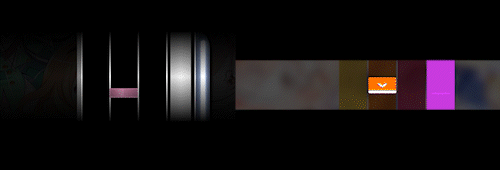

# Upgrading to lazer

osu!(lazer) is the next major update to the game. It is the culmination of several years of work behind the scenes to painstakingly reimplement the game.

While this version brings many new features not found in osu!(stable), there are still some features unique to each client. In the meantime, **the players** can choose what version they'd like to play, and they will dictate for how long we will continue to support the previous release.

"lazer" is a codename and will eventually be dropped as it becomes the primary release of the game. The rest of this document will refer to osu!(lazer) as "lazer" and osu!(stable) as "stable" for simplicity.

## Feature comparison

The following is a comprehensive list of the **current state** of lazer in comparison to stable. Note that this is a moving target — the end goal is to implement all the features that players care about over time.

### Compatibility and performance

| Feature | stable | lazer |
| :-- | :-- | :-- |
| Windows 8.0 and lower | ![Yes][true] | ![No][false] |
| macOS / Linux | ![Partial][partial][^wine] | ![Yes][true] |
| DirectX / Metal | ![Partial][partial][^compatibility-mode] | ![Yes][true] |
| Mobile support | ![No][false] | ![Yes][true] |
| Multithreaded architecture | ![No][false] | ![Yes][true] |
| Hardware-accelerated video | ![No][false] | ![Yes][true] |
| UI scaling | ![No][false] | ![Yes][true] |
| Custom rulesets (game modes) | ![No][false] | ![Partial][partial][^dll] |
| De-duped file store | ![No][false] | ![Yes][true][^share-files] |
| Tablet area adjustment | ![No][false] | ![Yes][true] |
| Support for many aspect ratios | ![No][false] | ![Yes][true] |

### UI and skinning

| Feature | stable | lazer |
| :-- | :-- | :-- |
| Skin support | ![Yes][true] | ![Partial][partial][^gameplay-only] |
| Song select grouping modes | ![Yes][true] | ![Yes][true] |
| In-game skin / UI layout editing | ![No][false] | ![Yes][true] |
| Dynamic customisable skinning components | ![No][false] | ![Yes][true] |

### Interface

| Feature | stable | lazer |
| :-- | :-- | :-- |
| Storyboards in main menu | ![No][false] | ![Yes][true][^supporter] |
| Hiding difficulties | ![No][false] | ![Yes][true] |
| First-run setup wizard | ![No][false] | ![Yes][true] |
| Soft deletion | ![No][false] | ![Yes][true][^soft-deletion] |
| Immediate setting changes during gameplay | ![No][false] | ![Yes][true] |

### Gameplay

| Feature | stable | lazer |
| :-- | :-- | :-- |
| Accurate performance point display | ![Partial][partial][^online] | ![Yes][true] |
| Difficulty adjustment | ![No][false] | ![Yes][true][^difficulty-adjust] |
| Mod presets | ![No][false] | ![Yes][true] |
| Per-mod settings | ![No][false] | ![Yes][true] |
| New "fun" mods | ![No][false] | ![Yes][true] |
| Combo colour normalisation[^normalisation] | ![No][false] | ![Yes][true] |
| Hold for HUD | ![No][false] | ![Yes][true][^hold-for-hud] |
| Per-beatmap offset calibration | ![Partial][partial][^offset-calibration-stable] | ![Yes][true][^offset-calibration-lazer] |
| osu! sliders "snake" while dragging | ![No][false] | ![Yes][true][^can-disable] |
| osu! player-friendly "note lock" | ![No][false] | ![Yes][true][^note-lock] |
| osu!mania and osu! timing-based note colouring | ![No][false] | ![Yes][true] |
| Replay seeking | ![No][false] | ![Yes][true] |
| [Niconico](https://en.wikipedia.org/wiki/Niconico)-style scrolling replay comments | ![Yes][true] | ![No][false] |

### Online systems

| Feature | stable | lazer |
| :-- | :-- | :-- |
| Score submission | ![Yes][true] | ![Yes][true] |
| Beatmap leaderboards | ![Yes][true] | ![Yes][true] |
| Profile statistics | ![Yes][true] | ![Yes][true] |
| Medals | ![Partial][partial][^medals-stable] | ![Partial][partial][^medals-lazer] |
| Performance points | ![Yes][true] | ![Yes][true] |
| Real-time chat | ![Partial][partial][^stable-chat] | ![Yes][true] |
| Wiki / news / changelog / rankings | ![No][false] | ![Yes][true][^online-content] |
| User profiles | ![No][false] | ![Yes][true] |
| Beatmap listing | ![Partial][partial][^direct-supporter] | ![Yes][true] |
| Unlimited multiplayer room size | ![No][false][^multi-room-max] | ![Yes][true] |
| Multiplayer spectating | ![No][false] | ![Yes][true] |
| Countdown timers | ![Partial][partial][^countdown-timers-stable] | ![Yes][true][^countdown-timers-lazer] |
| Queue modes | ![No][false] | ![Yes][true][^queue-modes] |
| Multiplayer freestyle | ![No][false] | ![Yes][true][^freestyle] |
| Multiplayer commands | ![Yes][true] | ![No][false] |
| Tag co-op | ![Yes][true] | ![No][false] |
| Playlists (user-curated leaderboards) | ![No][false] | ![Yes][true] |
| Updating beatmaps with online changes | ![Partial][partial][^map-only] | ![Yes][true][^all-files] |

### Editor

| Feature | stable | lazer |
| :-- | :-- | :-- |
| osu! editor | ![Yes][true] | ![Yes][true] |
| osu!taiko editor | ![No][false] | ![Yes][true] |
| osu!catch editor | ![No][false] | ![Yes][true] |
| osu!mania editor | ![Yes][true] | ![Yes][true] |
| Open difficulty as reference | ![Yes][true] | ![No][false] |
| Per-object SV / volume | ![No][false] | ![Yes][true] |
| Per-segment slider curve types | ![No][false] | ![Yes][true] |
| Slider splitting and merging | ![No][false] | ![Yes][true] |
| Pattern rotation | ![Yes][true] | ![Yes][true] |
| Pattern resizing | ![No][false] | ![Yes][true] |
| Beatmap submission | ![Yes][true] | ![Yes][true] |
| Storyboard editor | ![Yes][true] | ![No][false] |
| Cross-compatibility | ![Yes][true] | ![Yes][true] |

## Gameplay differences

### General

#### The Easy mod no longer pauses gameplay when recovering from failure

Instead of pausing gameplay while filling up the health bar, health is restored immediately.

|  |  |
| :-- | :-: |
| Breaks backwards compatibility | ![No][false] |
| Revertable using the Classic mod | ![No][false] |
| Intentionally changed | ![No][false] |
| Needs further consideration | ![Yes][true] |

#### Differences in grading systems

In stable, the accuracy (and judgement) requirements for each [grade](/wiki/Gameplay/Grade) are as follows:

| Grade | osu! / osu!taiko | osu!catch | osu!mania |
| :-: | :-- | :-- | :-- |
| SS | 100% | 100% | 100% |
| S | >90% GREATs/300s (≤1% MEHs/50s, no misses) | >98% | >95% |
| A | >80% GREATs/300s (no misses) or >90% GREATs/300s | >94% | >90% |
| B | >70% GREATs/300s (no misses) or >80% GREATs/300s | >90% | >80% |
| C | >60% GREATs/300s | >85% | >70% |

Meanwhile, osu!(lazer) has these accuracy cutoffs now:

| Grade | osu! / osu!taiko | osu!catch | osu!mania |
| :-: | :-- | :-- | :-- |
| SS | 100% | 100% | all [judgements](/wiki/Gameplay/Judgement/osu!mania) GREAT or PERFECT |
| S | ≥95% (no misses) | ≥98% | ≥95% |
| A | ≥90% | ≥94% | ≥90% |
| B | ≥80% | ≥90% | ≥80% |
| C | ≥70% | ≥85% | ≥70% |

|  |  |
| :-- | :-: |
| Breaks backwards compatibility | ![Yes][true] |
| Revertable using the Classic mod | ![No][false] |
| Intentionally changed | ![Yes][true] |
| Needs further consideration | ![No][false] |

#### Differences in scoring

Scoring in lazer will use a system similar to ScoreV2, with all ScoreV1 scores converted into the new system.

There are two interchangeable display modes for scores: *standardised* and *classic*. Standardised scoring limits score to a maximum of 1,000,000 points + bonus and score multipliers (similarly to ScoreV2), while classic scoring is the same as standardised, but scaled quadratically with the amount of hit objects in a beatmap (similar to ScoreV1). These can be selected from the settings, with all places where score is displayed in-game changing accordingly.

There are also some differences in how much score each hit object and each judgement is responsible for relative to each other.

|  |  |
| :-- | :-: |
| Breaks backwards compatibility | ![Yes][true] |
| Revertable using the Classic mod | ![No][false] |
| Intentionally changed | ![Yes][true] |
| Needs further consideration | ![Yes][true] |

#### Storyboard triggers are not implemented

Some storyboards feature elements that react to player input or health.

### osu!

#### Notelock has been adjusted to be more lenient

Recovering from a miss in dense patterns has been made easier.

|  |  |
| :-- | :-: |
| Breaks backwards compatibility | ![Yes][true] |
| Revertable using the Classic mod | ![Yes][true] |
| Intentionally changed | ![Yes][true] |
| Needs further consideration | ![No][false] |

#### Slider head circles require accuracy when hitting

Until lazer, sliders have only required the accuracy of a 50/MEH judgement to reward a perfect score. This was done for historic reasons, but feels bad for a rhythm game. Going forward, sliders will require hit accuracy for their initial click.

|  |  |
| :-- | :-: |
| Breaks backwards compatibility | ![Yes][true] |
| Revertable using the Classic mod | ![Yes][true] |
| Intentionally changed | ![Yes][true] |
| Needs further consideration | ![No][false] |

#### Slider heads are more lenient

When clicking a slider early, the follow circle will now immediately start in a tracking state even if the cursor leaves the slider ball before the slider starts.

Additionally, when clicking a slider late, any ticks or repeats that have already passed will be judged as completed.

See [this YouTube video](https://www.youtube.com/watch?v=xTRwM3zhhj0&t=243s) for a detailed explanation.

|  |  |
| :-- | :-: |
| Breaks backwards compatibility | ![Yes][true] |
| Revertable using the Classic mod | ![No][false] |
| Intentionally changed | ![Yes][true] |
| Needs further consideration | ![No][false] |

#### Slider end leniency is now more lenient

On very fast sliders, you now only need to be tracking somewhere in the last 36 ms, rather than at the point 36 ms before the slider end.

See [this YouTube video](https://www.youtube.com/watch?v=SlWKKA-ltZY) for a detailed explanation.

|  |  |
| :-- | :-: |
| Breaks backwards compatibility | ![Yes][true] |
| Revertable using the Classic mod | ![No][false] |
| Intentionally changed | ![Yes][true] |
| Needs further consideration | ![No][false] |

#### Missing a slider head causes a miss

Missing a slider head (either by not hitting it or hitting it during its miss window) would previously break combo but not cause a MISS judgement, and a judgement could still be received for the missed slider by completing the rest of it. This allowed players to get scores with low max combo while technically having no misses.

In lazer, not hitting the slider head will give a MISS judgement for the whole slider. After missing a slider head, combo, score, and accuracy can still be gained from slider ticks, repeats, and ends.

|  |  |
| :-- | :-: |
| Breaks backwards compatibility | ![Yes][true] |
| Revertable using the Classic mod | ![No][false] |
| Intentionally changed | ![Yes][true] |
| Needs further consideration | ![No][false] |

#### Slider ends do not cause hitsounds when not hit

In stable, slider ends would play their hitsounds even if they were missed, as long as any part of the slider was hit. This has been changed such that hitsounds match inputs 1:1.

|  |  |
| :-- | :-: |
| Breaks backwards compatibility | ![No][false] |
| Revertable using the Classic mod | ![Yes][true] |
| Intentionally changed | ![Yes][true] |
| Needs further consideration | ![No][false] |

#### The spinner spin speed cap of 477 RPM has been removed

Instead of a speed cap, spinners now have a score cap determined by the total amount of rotations that can be achieved by spinning the entire spinner at a certain RPM depending on OD.

This means that the maximum score can be obtained early by spinning faster, with no more points awarded afterwards for the rest of the spinner duration.

The RPM required to get the maximum score is as follows:

| OD | RPM |
| --: | --: |
| 0 | 250 |
| 5 | 380 |
| 10 | 430 |

|  |  |
| :-- | :-: |
| Breaks backwards compatibility | ![Yes][true] |
| Revertable using the Classic mod | ![No][false] |
| Intentionally changed | ![Yes][true] |
| Needs further consideration | ![Yes][true] |

#### Aspire-like glitched sliders are not supported

Some adventurous beatmaps exploit glitches in the stable client that allowed for very weird slider mechanics. These range from zero-length sliders acting as invisible circles, to cross-screen stretched and squished sliders.

More discussion and consideration will be needed for how much of Aspire beatmaps will be compatible going forward. For example, invisible circles might become a properly supported feature in the future.

|  |  |
| :-- | :-: |
| Breaks backwards compatibility | ![Yes][true] |
| Revertable using the Classic mod | ![No][false] |
| Intentionally changed | ![No][false] |
| Needs further consideration | ![Yes][true] |

### osu!taiko

#### Notes that overlap swells cannot be hit

Some gimmick maps make use of notes that overlap swells.

|  |  |
| :-- | :-: |
| Breaks backwards compatibility | ![Yes][true] |
| Revertable using the Classic mod | ![No][false] |
| Intentionally changed | ![No][false] |
| Needs further consideration | ![Yes][true] |

#### Drumrolls do not prevent mashing

In stable, drumrolls could not be hit too quickly or too slowly. This restriction has been lifted, just like in ScoreV2.

|  |  |
| :-- | :-: |
| Breaks backwards compatibility | ![Yes][true] |
| Revertable using the Classic mod | ![No][false] |
| Intentionally changed | ![Yes][true] |
| Needs further consideration | ![Yes][true] |

#### The Flashlight centre is aligned with the hit receptor

<!-- TODO: comparison image  -->

In stable, the Flashlight centre is offset a bit down and to the right, making more hit objects visible.

|  |  |
| :-- | :-: |
| Breaks backwards compatibility | ![No][false] |
| Revertable using the Classic mod | ![No][false] |
| Intentionally changed | ![No][false] |
| Needs further consideration | ![Yes][true] |

### osu!catch

#### Hyperdash generation can be different in some cases

This may lead to inaccurate judgements in replays and increased difficulty.

|  |  |
| :-- | :-: |
| Breaks backwards compatibility | ![Yes][true] |
| Revertable using the Classic mod | ![No][false] |
| Intentionally changed | ![No][false] |
| Needs further consideration | ![Yes][true] |

#### Juice stream generation can be different in some cases

This may lead to inaccurate judgements in replays.

|  |  |
| :-- | :-: |
| Breaks backwards compatibility | ![Yes][true] |
| Revertable using the Classic mod | ![No][false] |
| Intentionally changed | ![No][false] |
| Needs further consideration | ![Yes][true] |

### osu!mania

#### Hold note heads and tails give judgements

This functions similarly to ScoreV2 in stable.

|  |  |
| :-- | :-: |
| Breaks backwards compatibility | ![Yes][true] |
| Revertable using the Classic mod | ![No][false] |
| Intentionally changed | ![Yes][true] |
| Needs further consideration | ![No][false] |

#### Hold note ticks are removed

In stable, hold notes give combo every 100 ms, while in lazer "hold note ticks" gave combo every tick interval.

None of those exist in lazer, meaning hold notes only give combo for the start and the end. However, just like in stable, combos break immediately when letting go of sliders.

|  |  |
| :-- | :-: |
| Breaks backwards compatibility | ![Yes][true] |
| Revertable using the Classic mod | ![No][false] |
| Intentionally changed | ![Yes][true] |
| Needs further consideration | ![No][false] |

#### Extreme scroll speeds are limited

<!-- TODO: how exactly -->

Some beatmaps with SV gimmicks like teleports or stops do not look as intended, but are otherwise playable.

|  |  |
| :-- | :-: |
| Breaks backwards compatibility | ![No][false] |
| Revertable using the Classic mod | ![No][false] |
| Intentionally changed | ![Yes][true] |
| Needs further consideration | ![Yes][true] |

#### The PERFECT judgement hit window scales with OD

This used to be a constant ±16 ms regardless of overall difficulty.

|  |  |
| :-- | :-: |
| Breaks backwards compatibility | ![Yes][true] |
| Revertable using the Classic mod | ![Yes][true] |
| Intentionally changed | ![Yes][true] |
| Needs further consideration | ![No][false] |

#### The Flashlight mod does not have a gradient

|  |  |
| :-- | :-: |
| Breaks backwards compatibility | ![No][false] |
| Revertable using the Classic mod | ![No][false] |
| Intentionally changed | ![No][false] |
| Needs further consideration | ![Yes][true] |

## Switching to lazer

So you've decided you want to give lazer a shot? Great!

You can find it for download [here](https://osu.ppy.sh/home/download). In the near future, you will be able to switch to lazer from stable (from the `Release stream` setting).

## FAQ

### Migration

#### Is stable going away? Am I going to be forced to switch?

Stable will continue to be maintained as long as users are using it. At very least, it will be maintained for several years.

#### Can I import all my data from stable to lazer?

Currently, beatmaps, skins, scores, replays and collections can be imported into lazer. Of note, **settings are not yet imported** so you will need to set them up from scratch.

#### If I import my beatmaps to lazer, will it use double the disk space?

If you have both lazer and stable on the same drive, [hard links](/wiki/Client/Release_stream/Lazer/File_storage#via-hard-links) are used to avoid using extra disk space.

In all other cases, importing beatmaps will use double the disk space.

#### If I delete lazer will it break my stable install?

No.

#### If I delete stable will it break content in lazer that was imported from stable?

No.

#### If I install lazer, will I be able to return to stable?

Yes, lazer always installs alongside stable. Unless you choose to delete one or the other, both will be accessible.

#### Can I import data from lazer to stable?

No. This will not be supported.

That said, individual scores and beatmaps can be exported from lazer and manually imported into stable for now.

### Gameplay and scoring

#### If I set a score on lazer, will it show on my profile?

Yes, but it won't show in "best performance" with "lazer mode" turned off on the website.

It additionally not show in "first place ranks" regardless for now.

#### If I set a score on lazer, will it give performance points?

Yes.

#### Does lazer use ScoreV2?

It uses a scoring system based on it with some adjustments.

<!-- lint ignore no-heading-punctuation -->

#### I prefer the classic scoring display, where scores get really big.

You can actually change the `Score display mode` setting to `Classic` to get back the explosive style of scoring game-wide! It won't be a perfect match, but will give you the same feel of classic scoring and be applied everywhere you'd expect it to be.

Global score leaderboards will also use classic scoring.

#### If I set a score on lazer, will it remain forever?

While we will try to preserve as many scores as possible, we **offer no guarantee that scores will remain indefinitely**. At any point we may choose to wipe a subset of scores in order to preserve game balance, such as when exploits or foul play are discovered.

#### Will scores set on stable show in lazer?

Yes.

#### Will scores set in lazer show in stable?

Not at the moment.

#### Will all mods be ranked?

Scores of all mod combinations appear on leaderboards.

However, only the following mods will award performance points for now:

- Difficulty reduction
  - Easy
  - No Fail
  - Half Time (only 0.75x, configuring `Adjust pitch` is allowed)
  - Daycore (only 0.75x)
- Difficulty Increase
  - Hard Rock (not for osu!mania)
  - Sudden Death (Configuring `Restart on fail` is allowed)
  - Perfect (Configuring `Restart on fail` is allowed)
  - Hidden
  - Nightcore (only 1.5x)
  - Double Time (only 1.5x, configuring `Adjust pitch` is allowed)
  - Flashlight
  - Blinds
  - Accuracy Challenge
- Conversion (osu!mania only)
  - Mirror
  - Four Keys
  - Five Keys
  - Six Keys
  - Seven Keys
  - Eight Keys
  - Nine Keys
- Fun
  - Muted
  - No Scope
- Automation (osu! only)
  - Spun out
- System
  - Touch Device

Only the default configuration of customisation options is eligible for performance points, unless otherwise noted above.

#### I don't like the new gameplay mechanics. Can I restore the old gameplay mechanics like on stable?

Please try applying the "Classic" mod, which will restore much of the old behaviour that you are used to. Also make sure to check the settings offered by the Classic mod, as it will let you further customise your experience and also understand what changes are being applied (as they are all listed there).

### Skinning and UI

#### Something is behaving differently to stable and I don't like it!

Please run the setup wizard at the top of settings and go through the settings on the `Behaviour` screen. A lot of the common settings which have defaults changed are listed here. There's also a single button you can press to apply the old behaviours as a starting point for your lazer journey.

#### Will old skins eventually work in song select and results screens?

We'll do our best to bring back as much of this as we can without blocking new functionality. This will come later on.

#### Can I use my skin cursor in the menus as well?

We will likely bring back support for this in the future due to popular demand.

### Performance

#### Why can't I run at unlimited FPS?

Above a certain threshold there is no reason to run at higher frame rates. Lazer employs various new technologies to ensure the lowest latency is achievable without requiring high frame rates. This will continue to improve going forward as we still have a few improvements left to implement.

Lazer polls for input at 1,000 Hz regardless of FPS limiter, which is why the maximum limiter setting will also limit to 1,000 FPS.

If you are curious about how this affects input latency and test your own perception, please run the built-in "latency certifier" at the bottom of settings.

You can also [read this technical document](https://github.com/ppy/osu/wiki/Latency-and-unlimited-frame-rates) explaining the path we are taking along with rationale behind it.

#### If input is only polled at 1,000 Hz, what about my 8,000 Hz gaming mouse?

The operating system will still poll at the higher rate, although benefits are proven to be negligible. Polling at such high rates can have unforeseen overheads, and we recommend limiting devices to 1,000 Hz for system stability.

#### Lazer performs worse than stable for me. What gives?

While on most modern hardware we see lazer outperform stable, there are always edge cases when each user has a different hardware configuration. In our short-term roadmap, we are looking to support DirectX (aka "compatibility mode" on stable) and Vulkan, which both have better driver support than OpenGL across all hardware. Once this is implemented, performance on hardware like Intel integrated chipsets will improve greatly.

### Providing feedback

#### A feature that I depend on is missing! / Something has changed and I don't like it. / I have found a bug, what's the best way to report it?

There's a very high chance we are already aware of this and tracking it for future implementation! Please search the [issue tracker](https://github.com/ppy/osu/issues) and [discussions page](https://github.com/ppy/osu/discussions). If you can't find any matching threads, feel free to [open a discussion](https://github.com/ppy/osu/discussions/new).

Do note that we are already tracking over 1,000 issues of varying priorities, and it may take us some time to fix issues that only affect a small number of users.

### Other

#### Why is it called "lazer"?

What is sharper than cutting-edge?

#### Why is it taking so long to become the "main" release?

While osu! may seem like a simple game, there are hundreds on hundreds of features and systems that users have come to rely on. Depending on who you ask, lazer may have been in a fully playable state for years now, or it may be missing countless features.

Another area which has taken a huge amount of effort is historical preservation — making sure that beatmaps behave exactly as they should, including edge cases that weren't originally planned for. osu! is a vibrant ecosystem and users have taken liberty to extend the game far beyond its planned extents, and we are trying our best to embrace and support this going forward.

Finally, unlike the last iteration, we are putting in the time and diligence to ensure the code base will serve us well into the future. We have done the groundwork to allow new features to come online at blazing speed going forward. This will include new UI components, new ways to skin the game, new multiplayer systems and let's not forget the ability to load and play all your existing beatmaps on completely new game modes (a.k.a. rulesets)!

#### What comes next?

We have a huge backlog of user-requested features and improvements that we will continue to push out at the speed of light. For those that have joined us recently and haven't experienced the momentum of osu! development, prepare to be in for a surprise.

#### How do I access my songs folder?

There is no songs folder in lazer! This allows us to do cool things like not require pressing `F5` at song select to refresh beatmaps (because beatmaps are always in a good state) and reduce the disk space used by beatmaps by 20–40%. You can read more about [the way lazer stores files](/wiki/Client/Release_stream/Lazer/File_storage).

If you need to make changes to a beatmap, please use the editor. Going forward we will introduce a mode in the editor which makes a beatmap's folder temporarily accessible for external editing. This will allow you to use external tools on a beatmap during the creation process.

#### Now that "osu!direct" is available to all players, will supporters have any new benefits?

Some filters in the beatmap listing are still supporter-only.

There are also some additional benefits already:

- Supporters can create playlists that last longer.
- Supporters can enable storyboards to play in the main menu.

We do intend to look into new benefits in the future, but our focus is currently on feature parity with stable so please use your supporter tag purchase as a way to... support the game's development!

#### If I cheat on lazer will I be banned?

Yes.

#### If I find someone cheating on lazer how should I report them?

The same way you usually would.

#### Where are the microtransactions?

You're likely thinking of another game.

## Notes

[^wine]: Using Wine.
[^compatibility-mode]: DirectX via compatibility mode.
[^dll]: Manually via `.dll` files.
[^share-files]: Beatmaps and skins will share files and save on disk space.
[^gameplay-only]: Gameplay only.
[^online]: Via online retrieval.
[^normalisation]: This brings beatmap custom combo colours to the same brightness level.
[^hold-for-hud]: Hold `Ctrl` to view the HUD momentarily while it's hidden.
[^offset-calibration-stable]: Adjustable manually via key bindings.
[^offset-calibration-lazer]: When retrying a beatmap, you can calibrate the offset based on your last play.
[^can-disable]: Can be disabled.
[^note-lock]: Still exists, but should not interfere.
[^online-content]: Native access to most online content.
[^direct-supporter]: Via osu!direct, osu!supporter-only.
[^supporter]: osu!supporter-only.
[^soft-deletion]: Restore deleted beatmaps and other data from the settings. Deletions only become permanent upon restart.
[^multi-room-max]: 16 players max.
[^map-only]: Map only.
[^all-files]: All files.
[^stable-chat]: Messages can take up to 15 seconds to arrive.
[^countdown-timers-stable]: Set a countdown using a command, no automatic start.
[^countdown-timers-lazer]: Set a countdown from the game UI to automatically start the match.
[^queue-modes]: Turn on to allow anyone in a lobby to queue new beatmaps, a.k.a. "host rotate".
[^freestyle]: Turn on in song select to allow players to select any difficulty of the current beatmap.
[^difficulty-adjust]: Change CS/AR/OD/HP of a beatmap directly from song select via the Difficulty Adjust mod.
[^medals-lazer]: Some [Hush-Hush medals](/wiki/Medals#hush-hush) are not yet obtainable.
[^medals-stable]: Certain medals are lazer-exclusive.

[true]: /wiki/shared/true.png
[false]: /wiki/shared/false.png
[partial]: /wiki/shared/partial.png
