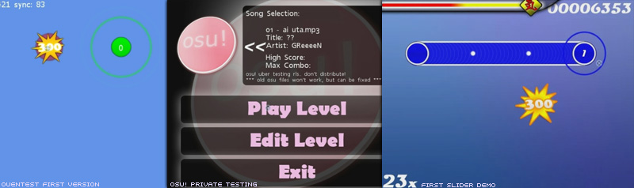
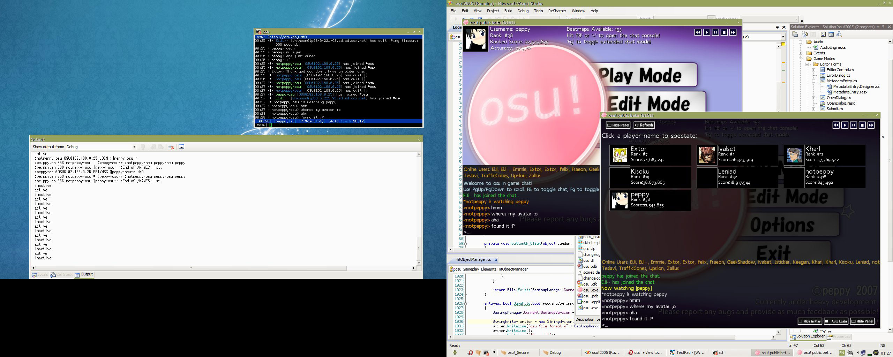

Dies sind Teile der Geschichte von osu! von Anfang an. Vielen Dank an [Sinistro](http://osu.ppy.sh/u/Sinistro) beim Helfen des Zusammenstellens des 2007/2008 Teils. [Quellen Link](http://osu.ppy.sh/p/history).

2007
====

Juli
----

**osu! hat als Konzeptprobe mit dem Namen "ouentest" angefangen**. Die erste Version wurde am **1. Juli 2007**, in einer kleinen Gruppe Peppy's engster Freunde veröffentlicht und enthielt einen sehr einfach gehaltenen Edit und Play Modus. Der Editor hatte zwar keine Seek oder Snap Funktionen, erlaubte das Erstellen einfacher Beatmaps. **Zu diesem Zeitpunkt gab es weder Spinner noch Slider**, jedoch waren einfache Score-und Combozähler bereits präsent. Das **erste Release brauchte nur ca. 16 Stunden Zeit um es zu coden** und wurde *am Stück erstellt*. **pUpdater** wurde eingeführt (auch bekannt unter dem Namen **osume** - heute wird alles vom client selbst gehandhabt) um das aktualisieren auf die neuesten versionen durchzuführen.

<File:200707-01.jpg%7CSong> Selection for osu!editor <File:200707-02.jpg%7CTest-play> 1 <File:200707-03.jpg%7CTest-play> 2 <File:200707-04.jpg%7CBeatmapping> Hit-Circles

Gegen **Ende Juli** wurde, um ein wenig Stil in das Spiel zu bringen, das Menu System geändert. Eine *' erste Implementation vom Slidern wurde abgeschlossen*', mit einem nicht-animierten Slider-Ball und einigen ziemlichen hässlichen Linien. **Beat Snapping** wurde dem Editor hinzugefügt, sowie **eine Timeline und ein solideres Interface** (recht ähnlich zu dem was man heutzutage in der "Compose" Ansicht zu sehen bekommt).

<File:200707-05.jpg%7Cosu!editor> <File:200707-06.jpg%7CSong> Auswahl for "Edit Modus" <File:200707-07.jpg%7CSlider> Erstellung im osu!editor <File:200707-08.jpg%7CGameplay> Beispielt

August
------

**Das Hauptmenu wurde mit einem neuen Look versehen** und der **Editor bekam eine Menge neuer Funkionalitäten, inklusive Copy/Paste Unterstützung**. Die Windows Menüleiste und Mauszeiger sind nun präsent, welche die Features des Editors um Einiges besser erreichbar machten als das zuvor der Fall war. **Slider werden nun besser unterstützt**, mit Ticks versehen und verschwinden sobald man sie passiert hat. **Das Stacken (Stapeln) von Hitcirclen ist nun ebenfalls präsent. Lokale High Scores werden nun viel besser unterstützt. Das .osu Dateiformat wurde überarbeitet und vollständig modernisiert, enthählt jedoch eine Umwandlung alter Dateien in das neue Format.**

<File:200708-01.jpg%7CSong> Auswahlbildschirm für den "Play Mode" <File:200708-02.jpg%7CEvolution> der Hit-Circle Score Bursts.

Das Gameplay wurde mit dem **Debüt von Combo Feuer, der HP-Leiste, Cursor Trail und besser aussehenden Slidern** verbessert. Zu diesem Zeitpunkt hatten wir eine bescheidene Sammlung von ungefähr **zehn Beatmaps die vom Test-Team, bestehend aus ca. 5 Leuten, erstellt wurden.**

<File:200708-03.jpg>|"Edit Mode" Song Auswahl <File:200708-04.jpg%7CGameplay> Beispiel

September
---------

**Die Geburt von osu!** soweit das die Öffentlichkeit betrifft. Die **Foren** so wie wir sie heute kennen wurden **etabliert** und von Peppy's Home Server (ppy.sh) aus gehostet. Durch einen News Mitteilung auf <http://www.bemanistyle.com> wurde Aufmerksamkeit erreicht was ein paar interessierte Leute mit vorgänglicher Rythmusspielerfahrung anzog.

<File:200709-01.jpg%7CSlider> Erstellung im osu!editor [File:200709-02.jpg|Hauptmenü](File:200709-02.jpg%7CHauptmenü) <File:200709-03.jpg%7CSpinner> (basierend auf DS's offiziellem Ouendan) <File:200709-04.jpg%7CRangbildschirm> <File:200709-SS.jpg%7CNews> Ankündigung auf einer Spiele-Webseite

<File:Easy.png>|[Easy](DE:EZ "wikilink") mod <File:No> Fail.png|[DE:No Fail](DE:No_Fail "wikilink") mod

Kurz nach dem Public Release wurden **die ersten Mods ([Easy](DE:EZ "wikilink") und [No Fail](DE:NF "wikilink")) hinzugefügt, sowie Pausen (welche bis heute ignoriert werden und fehlen).** Eine Großzahl an Veränderungen ließen osu! schnell mehr und mehr wie ein kommerzielles Rhythmusspiel aussehen.

Oktober
-------

**Der 1. Oktober war der Tag an dem Online Rankings öffentlich verfügbar gemacht wurden**. Außerdem wurde die **.osz packaging Methode und Online Beatmap Datenbank mit einem frühen web-basierten Submission System eingeführt. Online Rankings wurden ins in-game Interface hinzugefügt und auch auf der Webseite angezeigt.**

Der **Song Auswahl Bildschirm** wurde verbessert mit dem '''Gruppieren der Schwierigkeiten und einer intuitiveren Steuerung. Das Soft-Sample-Set, Tastatureingaben sowie das Suchen in-game wurde alles in diesem Monat hinzugefügt. ''' **Spieler konnten nun zum ersten Mal universelle sowie beatmapspezifische Skins erstellen** und **vollständige TabletPC Unterstützung wurde hinzugefügt.**

<File:200710-03.jpg%7CSolo> Song Auswahl (man bemerke die note the Ergänzung von EZ und NF) <File:200710-02.png%7CFehlermeldung>

**Version 2 von pUpdater (osume) wurde veröffentlicht was nun optionale Pakete zum Downloaden ermöglichte.** Dies enthielt **Zugänglichkeit erster benutzererstellte Skins für alle Spieler durch den Updater.** Der **Editor bekam [Distance-baisierendes Snapping](DE:Distance_Snap "wikilink"), Lesezeichenunterstützung, mehrere Slider-Curven-Typen, individuelle Farben, Test-Playing, Lead-In Time und vieles mehr.**

November
--------

<File:No> Video.png|No Video mod <File:Hidden.png>|[Hidden](DE:Hidden "wikilink") mod

A new **SS rank was added to the ranking system**, replacing S rank in cases where perfection was achieved. The **[No Video](DE:No_Video "wikilink") and [Hidden](DE:Hidden "wikilink") mods were introduced, and the SH and SSH ranks** to go with it. For the first time, **players could skin and assign normal and soft sample sets per timing section. .osz files could now be loaded by double-clicking them, or dragging them onto the osu! icon.**

<File:200711-01.jpg%7Cosu>! Hauptmenü. (überflutet von Sternen.) <File:200711-02.jpg%7CLoginbildschirm>.

Das **"Beatmap Submission System" (BSS) wurde veröffentlicht**, welches Benutzern ermöglichte ihre Kreationen einfach hochzuladen und mit anderen Leuten zu teilen. Dies führte ebenfalls den **Status von Pending und gerankten Maps ein** und half die rapide wachsende Sammlung, der von Benutzern eingesendeten Beatmaps, zu organisieren. **Der In-Game Chat wurde als ein von Grund auf erstellter IRC Client ins Spiel integriert und wurde mit einem standardmäßigen IRC Server verbunden (Zu diesem Zeitpunkt war das nocht nicht Bancho). Der gesamte Chat war sichtbar. Profilbilder und einfache Statistiken wurden in-game** (mithilfe einer http-basierenden Verbindung) **angezeigt**. **Audio Steuerelemente** wurden ebenfalls zum Hauptmenü hinzugefügt, welche nun auch einen zufälligen Song beim Programmstart spielt. **Replays von lokalen Rekorden sowie von Online Plays können nun geschaut werden.** Spieler können nun **anderen Spielern zuschauen (spectaten)** (Die Spectator Daten wurden unverarbeitet über irc gesendet!).

Dezember
--------

**Songs können nun gemappt werden indem man sie ins osu! Fenster zieht. Tooltips sind nun präsent und erklären all die verschiedenen Buttons in den osu! Menüs und im Editor Interface.** Viele neue erstklassige Skins wurden von frühen Skinnern eingereicht ([Holiday von LuigiHann](http://osu.ppy.sh/forum/t/1139/start=0), [WindWaker von awp](http://osu.ppy.sh/forum/t/761/start=0)). **Neue Methoden zum Sortieren wurden der Songauswahl hinzugefügt**. **Peppy konnte nun allgemein gültige Ankündigungen an alle osu! Spieler senden. Kleinere Verbesserungen wurden am Gameplay durchgeführt, wie zum Beispiel das dimmen nicht-aktiver Circles.**

2008
====

Januar
------

Peppy war vom 17.12.2007 bis zum 20.01.2008 in Japan. Er hat es irgendwie geschafft der Codebasis von osu! für einen gesamten Monat fern zu bleiben und deshalb gab es zu der Zeit auch keine bedeutenden Updates (die Community stand ebenfalls recht still während dieser Zeit).

Februar
-------

<File:Hard> Rock.png|[Hard Rock](DE:Hard_Rock "wikilink") Mod <File:Sudden> Death.png|[Sudden Death](DE:Sudden_Death "wikilink") Mod <File:Double> time.png|[Double Time](DE:Double_Time "wikilink") Mod

**Spieler bekamen eine zusätzliche Herausforderung in Form der Mods** ([Hard Rock](DE:Hard_Rock "wikilink"), [Sudden Death](DE:Sudden_Death "wikilink") and [Double Time](DE:Double_Time "wikilink")).Das Gameplayerlebnis wurde mit **der Einführung von Countdown-bildern und Sounds, individuellen Zahlen und Farben für die Combos, O/X (Pass/Fail) Section Rankings, Countdown Intros, Hintergrunfarbenskripting, Lautstärkekontrollen für Timing Sektionen und ,wahrscheinlich am wichtigsten, der Einführung von Storyboarding Skripunterstützung beachtlich verbessert.** Es wurde der Versuch gestartet osu! ins XNAv2 Framework umzuschreiben, Peppy entschied jedoch, dass die neue Version nutzlos sei und die Gesamtperformance negativ beeinträchtigt. **XNA1.1 wird zu diesem Zeitpunkt weiter genutzt und entsprechend osu!'s Bedürfnissen mit tausenden neugeschrieben Zeilen und Hacks angepasst um aus osu! das zu machen, was es heute ist.** **Eine neue Text Render Engine wurde implementiert, welche einer sehr saubere Darstellung von Schriften jeglicher Schriftgröße ermöglichte.** Dies erlaubte es mehr Informationen im Editor unterzubringen und lies das Spiel im Allgemeinen um einige besser aussehen.

März
----

<File:Relax.png>|[Relax](DE:Relax "wikilink") Mod <File:Half-time.png>|[Half Time](DE:Half_Time "wikilink") Mod

Um ein Gegengewicht zu den im Februar eingeführten Mods zu schaffen wurden die [Relax](DE:Relax "wikilink") and [Half Time](DE:Half_Time "wikilink") Mods erschaffen um das Leben der Spieler diesen Monat zu vereinfachen. **Benutzer können nun Screenshots aufnehmen und Replays importieren und exportieren. Animationen konnten zu ersten mal mithilfe von Storyboarding erreicht werden und ein Skin Auswahlbildschirm wurde hinzugefügt.** Durch Performance Optimierungen wurde **die Ladezeit für den Songauswahlbildschirm um 82% verkürzt** (durch ein neues Format für die lokale Beatmap Datenbank). Zahlreiche andere Performance Verbesserungen wurden vorgenommen, einschließlich der Einführung des **Frame Limiters und einigen weiteren Grafikoptionen.** '''Project Bancho wurde am 24.03.2008 gestartet. Die Idee dahinter war es eine Server Komponente für die osu! Familie einzuführen, die die Kommunikation zwischen Benutzern handhabt und die von der Abhängigkeit von IRC befreit.

April
-----

Ohne Spaß **Bancho ging diesen Monat live, sowie das Userpanel so wie wir es heute kennen.** Benutzer können nun im Userpanel sehen was die Anderen machen und mit ihnen interagieren indem sie auf sie klicken um ihnen zuzuschauen. Das **automatische Error Submission System wurde eingeführt, xfire Kompatibilität wurde implementiert und das Hauptmenü sowie der Editor wurden überarbeitet.** (mit neuen neuen Icons von LuigiHann) . Das **Chat Interface bekam ein wenig mehr Liebe mit dem "Show Chat"(Chat anzeigen) Button, Tab Vervollständigung und Nickname Highlightbenachrichtigungen.** Der **Rankingbildschirm zeigt nun die benötigten Punkte um den nächten Rang zu erreichen.**

Mai
---

 mod](Taiko.png "Taiko mod")

Der **[Taiko](DE:Taiko "wikilink") Modus** sah zum ersten Mal das Licht der Welt in diesem Monat, sowie eine weitere größere Ergänzung: **.osb Storyboarding Skript Support. Multi-Part Slider und private Nachrichten im Chat wurden ebenfalls möglich gemacht.**

Juni
----

Ein weitere größerer Meilenstein in der Geschichte von osu! wurde durch die Implementation des **[Multiplayer (Mehrspieler) (Multi)](DE:Multiplayer "wikilink") Modus erreicht.** Skinning Optionen wurden erweitert, für Grafik sowie Sounds. Zu guter letzt **war Multi-Channel Chat zum ersten Mal möglich.**

Juli
----

**Der Editor, Multiplayer, Storyboarding, Grafik, Chat Konsole; alles bekam diesen Monat zahllose Verbesserungen. Das Optionsmenü bekam ein neues Layout und [individuelle Tastaturbelegungen](DE:Options#Key_Bindings "wikilink") wurden eingeführt.**

August
------

Da sich der im Juli gesetzte Trend fortsetzte, hat man ziemlich große Probleme dabei einen Aspekt in osu! zu finden der in diesem Monat nicht verbessert wurde. Einige der brandneuen Features waren das **Hinzufügen von tags für Beatmaps** und **die eher experimentelle Unterstützung von mehreren Monitoren**. **Eine neue Methode des Aufhebens der Pausierung im Gameplay wurde eingeführt um Leute davon abzuhalten die Pause Funkion zu missbrauchen** (man muss nun seinen Cursor die gleiche Stelle bringen and der man war bevor man pausiert hat um weiterzuspielen).

**Persöhnliche Online-Bestenlisten wurden der Songauswahl hinzugefügt** und somit einer Forderung über längere Zeit nachgekommen. Dies erfordete einige heftigere Optimierungen der Datenbank. Grafische Verbesserungen wurden am Rankingbildschirm sowie an zahlreichen Elementen im Standard Skin vorgenommen mit dem Ziel ihn um einiges sauberer und klarer wirken zu lassen als zuvor. Die Anzeige von **Slider Tick Score Sprites (10/30) wurde implementiert.** Verbesserungen waren im Mehrspieler Match Setup zu sehen, welche erlaubten **die Host Kontrolle zu übergeben**. Viele **neue Chat Befehle** wurden für die Benutzerfreundlichkeit hinzugefügt.

Der neue Geranked Status "Approved" wurde hinzugefügt für Maps die von großartiger Qualität waren, die jedoch die Ranking-Länge, die Schwierigkeit oder andere Limits überschritten. Maps in diesem Zustand werden nicht in der Wertung der Spieler mit einbezogen, haben jedoch ein Scoreboard und verhalten sich auch andersweitig wie eine gerankte Map.

September
---------

<File:Flashlight.png>|[Flashlight](DE:Flashlight "wikilink") Mod <File:Spun> Out.png|[Spun Out](DE:Spun_Out "wikilink") Mod <File:Autoplay.png>|[Auto](DE:Auto "wikilink") Mod

Ein Haufen **neuer Mods wurden diesen Monat vorgestellt: [Flashlight](DE:Flashlight "wikilink"), [Spun Out](DE:Spun_Out "wikilink") und [Auto](DE:Auto "wikilink")**. Auto skriptet einen AI Spieler der (fast) jede Beatmap mit perfekter Genauigkeit spielt und ebenfalls im Editor Test Modus verfügbar ist. Die Limits vom Beatmap Design wurden noch mehr erweitert durch **mehr skinnbare Elemente (einschließlich Combo Burst Bildern), dem Clap Sound, der Möglichkeit Sound Samples auf individuelle Slider Endpunkte und in Timing Sektionen zu legen. Der Songauswahlbildschirm bekam ebenfalls eine Überarbeitung.**

Oktober
-------

Fortschritte bei der **OpenGL Implementation** und bei der **bevorstehenden Veröffentlichung des Catch the Beat Game Modus, in einer privaten Testumgebung** wurden gemacht.''' Eine Menge von osu!'s Code wurde neugeschrieben, was auf **über 4.000 Zeilen komplett überarbeiteter Code hinauslief um Play Modi modularer zu machen damit Modes in Zukunft einfacher hinzugefügt werden konnten.** Aufgrund dieser großen Änderungen gab es in diesem Monat keine Öffentlichen Releases.

November
--------

Im November wurde der brandneue Modus **"[Catch the Beat](DE:Catch_the_Beat "wikilink")" eingeführt. OpenGL Support wurde implementiert**, dadurch konnte osu! auf den meisten Systemen laufen. Andere features aus diesem Monat waren **in-game Freundeslisten Support, private Chat Tabs, ein neues Tutorial, der [Offset Wizard](DE:Options#Offset_Wizard "wikilink") und osu!direct**; ein in-game Beatmap Downloader für Supporter.

Weil sich Leute mit einer großen Anzahl an Beatmaps über die Ladezeiten von osu! beschwert haben, hat Peppy unzählige Tage damit zugebracht zu Optimieren was in irgeneiner Art und Weise möglich war. Dies resultierte in einer Performancesteigerung von unermesslichem Ausmaß (sagen wir einfach irgendwo über 9.000). **Ladezeiten von über einer Minute wurden auf Millisekunden verkürzt.**

Dezember
--------

Der letzte Monat von 2008 hatte einiges zu bieten. An osu!'s zweitem Weihnachten wurde die erste Version des Storyboard Editors implementiert, was das Storyboarding um einiges einfacher für den Benutzer machte. Ein zweiter Multiplayer Modus wurde hinzugefügt, "Tag Play" - ein kooperativer Modus bei dem Spieler sich beim Spielen einer Beatmap abwechseln. Des weiteren wurde die "Genauigkeit als Siegbedingung" hinzugefügt. MSN und Yahoo Status wurden integriert und Benutzer konnten nun Tastenbelengungen vollständig anpassen sowie Chat Highlight Trigger Wörter.

Thumbnails (Vorschaubilder) und Audio-previews wurden dem Online Beatmap Listing hinzugefügt was das suchen nach einer Beatmap die man mag um einiges einfacher macht.

Ein weiteres bemerkbares Event war, dass der Catch The Beat Score diesen Monat [gelöscht](http://osu.ppy.sh/forum/viewtopic.php?f=9&t=7996) wurde. Seitdem wurde der Score Multiplier von Mods sowie von Catch The Beat verändert.

Die Zukunft
===========

*"Think big, and expect big."* - *"Denke groß und erwarte Großes."* — peppy
