# 2007/2008

Previous|Main page|Next
:---:|:---:|:---:
-|[Main](/wiki/History_of_osu!/)|[2009/2010](/wiki/History_of_osu!/2)

The following are some of the history of osu! since its beginning. Special thanks to [Sinistro](http://osu.ppy.sh/u/Sinistro) for helping in compiling 2007/2008 content. [Source link](http://osu.ppy.sh/p/history).

2007
====

July
----

**osu! began as a proof-of-concept named "ouentest"**. The first version was released on the **1st of July, 2007**, to a small group of peppy's close friends and featured a very basic edit and play mode. The editor had no seeking or snapping functions, but allowed making simple beatmaps. There were **no sliders or spinners at this point**, but basic scoring/combo counters were present. The **first release took approximately 16 hours of coding time** and was done in a *single all-nighter*. **pUpdater** was introduced (now known as **osume**) to handle updating to the latest version.

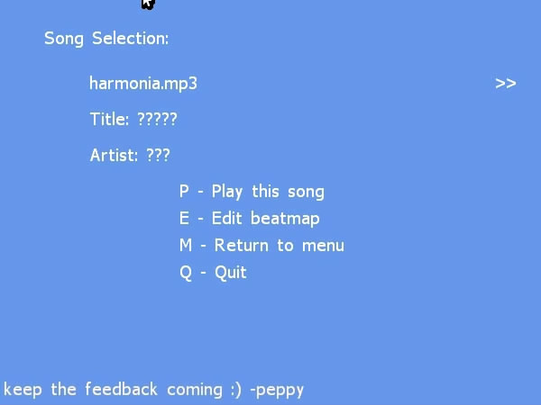
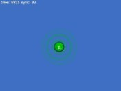
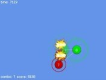
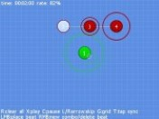

By the **end of July**, the menu system was changed to add a bit of style to the game. An **initial implementation of sliders was completed**, with a non-animated orange slider ball and some relatively ugly curves. **Beat snapping** was added to the editor, as was **a timeline and a more robust editor interface** (quite similar to what you see in "Compose" view today).

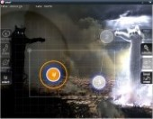

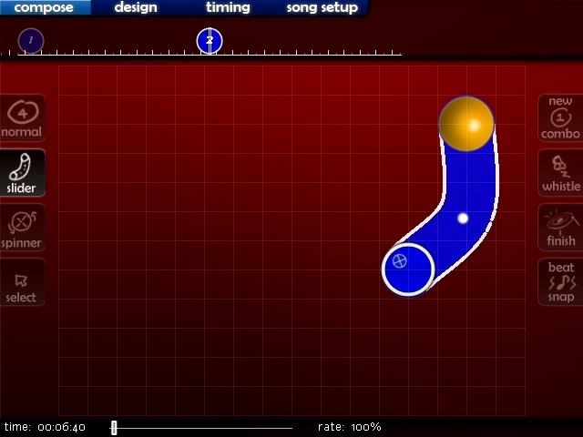
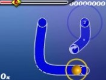

August
------

**The main menu was updated with a new look**, and the **editor received a lot of new functionality, including copy/paste support**. The Windows's menubar and cursor are now present, making editor features a lot more accessible than before. **Sliders are more extensively supported**, with ticks present and disappearing as you pass them. **Stacking of hitcircles is now also present. Local high scores are a lot better supported. The .osu file format is revised and completely revamped, but includes conversion of older files to the new format.**

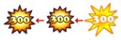

Gameplay was enhanced with the **debut of combo fire, the HP bar, mouse trails, and better looking sliders**. By this point, we had a humble collection of around **10 beatmaps made by the testing team of around 5 people.**

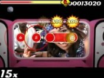

September
---------

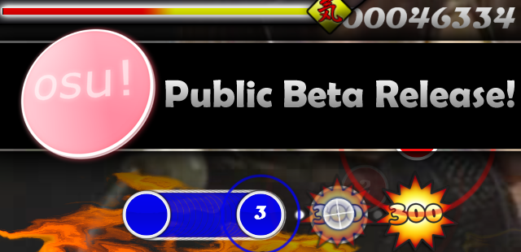

**The birth of osu!** as far as the public is concerned. The **forums** as we know them today were **established**, and hosted from peppy's home server (ppy.sh). Attention was gained via a news announcement on <http://www.bemanistyle.com> which drew quite a few interested people with previous rhythm game experience.

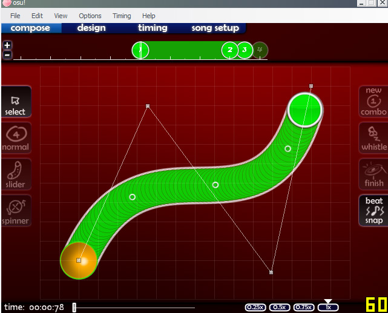
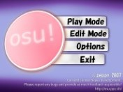
")
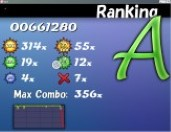
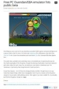

#### Game Modifiers introduced

Quickly after the public release, **the first play mods ([Easy](EZ "wikilink") and [No Fail](NF "wikilink")) were added, as well as break sections (which up until now had been ignored and missing).** A large number of changes quickly made osu! look more and more like a commercial rhythm game.

October
-------

**October 1st was the day when online rankings were made available publicly**. This also saw the **launch of the .osz packaging method, and online beatmap database with an early web-based submission system. Online rankings were added to the in-game interface and also displayed on the website.**

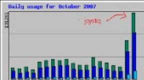

The **song selection screen** saw improvements, with **grouping of difficulties and more intuitive song wheel movement. The soft sample set, keyboard-based controls, in-game searching all originate in this month.** **Players could make universal skins and per-beatmap skins for the first time** and **full TabletPC support was implemented.**

") 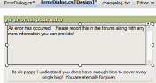

**pUpdater (osume) version 2 was released, supporting optional package downloads.** This included **making the first user-made skins available to all players via the updater.** The **editor saw the addition of [distance-based snapping](Distance_Snap "wikilink"), bookmark support, multiple slider curve types, custom colours, play-testing, lead-in time and much more.**

November
--------
#### Game Modifiers
 

A new **SS rank was added to the ranking system**, replacing S rank in cases where perfection was achieved. The **[No Video](No_Video "wikilink") and [Hidden](Hidden "wikilink") mods were introduced, and the SH and SSH ranks** to go with it. For the first time, **players could skin and assign normal and soft sample sets per timing section. .osz files could now be loaded by double-clicking them, or dragging them onto the osu! icon.**

") 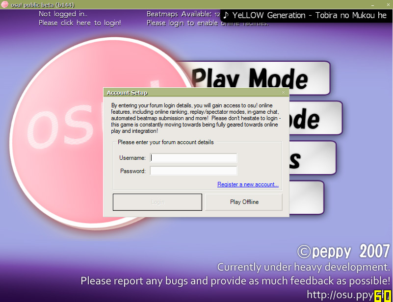

")

 The **"Beatmap Submission System" (BSS) was made public**, allowing users to easily upload and share their creations. This introduced the **status of pending and ranked maps** and helped organise the rapidly growing collection of user-submitted beatmaps. **In-game chat was added, as an IRC client built from scratch and connected to a standard irc server (no bancho yet). Extended chat was visible. Avatars and basic stats were displayed in game** (using an http-based communication). **Audio controls** were also added to the main menu, which also now plays a random song on startup. **Replays could be watched for both local scores and online plays.** Players could **spectate other players** (and spectator data was sent raw over irc!).

December
--------

**Songs can be edited by dragging them into the osu! window. Tooltips are now present explaining all the various buttons in the osu! menus and editor interface.** Many new quality skins were submitted by early skinners ([Holiday by LuigiHann](http://osu.ppy.sh/forum/t/1139/start=0), [WindWaker by awp](http://osu.ppy.sh/forum/t/761/start=0)). **New sorting methods were added to the song selection screen**. **peppy could now send universal announcements to all osu! players. Minor tweaks are made to gameplay, such as non-active circle dimming.**

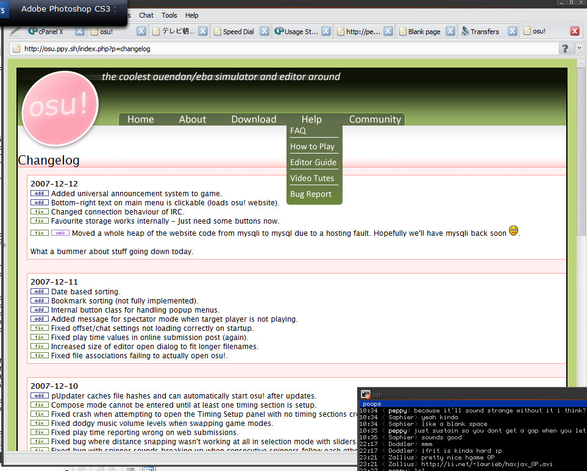

2008
====

January
-------

peppy was MIA in Japan 2007-12-17 until 2008-01-20. He somehow managed to draw himself away from the osu! codebase for a full month, and therefore there were no major updates (and the community was quite stagnant during this time).

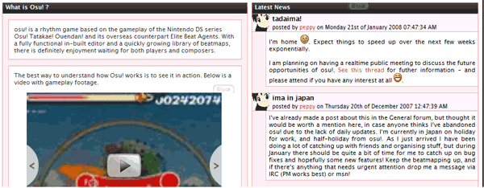

February
--------

  

**Players received extra challenges in the form of mods** ([Hard Rock](Hard_Rock "wikilink"), [Sudden Death](Sudden_Death "wikilink") and [Double Time](Double_Time "wikilink")). Gameplay experience was enhanced considerably with the **addition of countdown images and sounds, custom number and colours of combos, O/X (Pass/Fail) section rankings, countdown intros, background colour scripting, volume control per timing section and, perhaps most importantly, the introduction of storyboarding script support.** An attempt was made to move osu! over to the XNAv2 framework, but peppy decided the new version was useless and reduced overall performance. **XNA1.1 is used from this point forward, which is shaped according to osu!'s needs with thousands of rewritten lines and hacks to make osu! what it is.** **A new text rendering engine is implemented, allowing for very crisp font display at any font size.** This makes it possible to display some more editor information and make the game look a lot better overall.

March
-----

 

To counterbalance February's new mods, the [Relax](Relax "wikilink") and [Half Time](Half_Time "wikilink") mods arrived to make life easier for players this month. **Users became able to take screenshots, import and export replays. Animations could be storyboarded for the first time, and the skin selection screen was added.** Performance optimisations saw **a decrease in 82% for loading the song selection screen** (via a new format for the local beatmap database). Various other performance tweaks were made, including the introduction of the **frame limit toggle and a number of other graphical options.** **Project Bancho was started on 2008-03-24. The idea was to create a server component for the osu! family, which handles communications between users and removes the irc dependency.**

April
-----

No joke, **Bancho went live this month, and so did the user panels of Extended Chat as you know them today.** Users are now able to see what other users are doing in their user panels, as well as interact with them by clicking to spectate. The **automatic error submission system debuted, xfire compatibility was implemented, and the main menu and editor interface received makeovers** (with new icons by LuigiHann). The **chat interface got some love, with the "show chat" button, tab completion and nickname highlight alerts.** The **ranking screen now shows points required to reach the next rank.**

May
---

 The **[Taiko](Taiko "wikilink") Mode** first saw the light of day in this month, as well as another major addition, **.osb storyboarding script support. Multi-part sliders and private messaging in chat were also made available.**

June
----

A major milestone in osu history was reached with the addition of the **[multiplayer (Multi)](Multiplayer "wikilink") game mode.** Skinning options were expanded further regarding both graphics and sounds. Lastly, **multi-channel chat was possible for the first time.**

July
----

**The editor, multiplayer, storyboarding, graphics, chat console all received numerous improvements this month. The options screen received a new layout, and [custom key bindings](Options#Key_Bindings "wikilink") were introduced.**

August
------

Continuing the trend set by July, one would be hard pressed to find an aspect of osu! that wasn't improved or optimised in this month. In the realm of brand new additions, **tags were added to beatmaps** and **multiple monitor support was implemented on an experimental level**. **A new method of unpausing gameplay was constructed to stop people abusing the pause function** (you now need to align your cursor to where it was before you paused in order to continue).

**Personal online best scores were added to song selection**, fulfilling a long-time request. This required some fairly hefty database optimisation. Graphical improvements were made to the ranking screen, and various elements of the default skin, in an aim to make it feel more clean and crisp than before. The display of **slider tick score sprites (10/30) was implemented.** Improvements were seen in the multiplayer match setup, allowing **host control to be transferred**. Many **new chat commands** were added for user convenience.

A new ranked status "Approved" was added for maps which are of great quality but exceed ranking length or difficulty (or other) limits in some way. Maps in this status don't add to player's scores, but have scoreboards and act otherwise like a ranked map.

September
---------

  

A slew of **new mods were unveiled this month: [Flashlight](Flashlight "wikilink"), [Spun Out](Spun_Out "wikilink") and [Auto](Auto "wikilink")**. Auto scripts an AI player that completed (almost) any beatmap with perfect accuracy, and can also be accessed via the editor test mode. The limits of beatmap design were pushed farther with the addition of **more skinnable elements (including combo burst images), the clap sound sample, the ability to assign sound samples to individual slider endpoints and inherited timing sections. The song selection screen also received an overhaul.**

October
-------

Progress was made on **OpenGL implementation** and the **upcoming game mode debut (Catch the Beat), in a private testing environment.** A lot of the internals of osu! were rewritten, equaling **over 4,000 lines of totally revamped code in order to make play modes more modular, so future modes could be added more easily.** Due to these large changes, there was no public release this month.

November
--------

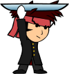

 November saw the introduction of a brand new play mode, **"[Catch the Beat](Catch_the_Beat "wikilink")". OpenGL support debuted**, thus allowing osu! to run on most systems. Other new features in this update packed month included **in-game friend list support, private chat tabs, a new tutorial/ [offset wizard](Options#Offset_Wizard "wikilink") and osu!direct**; an in-game beatmap downloader for supporters.
Due to people with large numbers of beatmaps complaining about the load time of osu!, peppy spent countless days optimising anything possible, resulting in a performance increase almost unmeasurable on a scale (let's just say somewhere over 9,000). **Load times of over one minute reduced to just milliseconds.**

December
--------

The last month of 2008 had plenty in store for osu! development. By osu!'s second Christmas, the first version of the Storyboarding Editor was implemented, making storyboarding much more accessible to users. A second multiplayer mode was added, "Tag Play" - a cooperative mode where players take turns playing a beatmap. Another addition to multiplayer was "Accuracy as a victory condition". MSN and Yahoo status were integrated, and users could fully customize key bindings and chat highlight trigger words.

Thumbnail and audible previews were added to the online beatmap listing, making browsing for a beatmap you'd like to play a much easier task.

Another noticeable event is that the Catch the Beat score is [wiped](http://osu.ppy.sh/forum/viewtopic.php?f=9&t=7996) this month. Since then, the score multiplier of mods has been changed on Catch The Beat mod as well.

The Future
==========

*"Think big, and expect big."* — peppy
