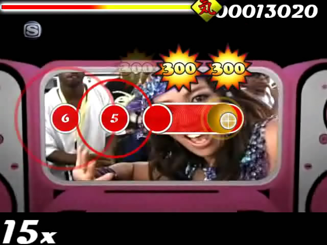
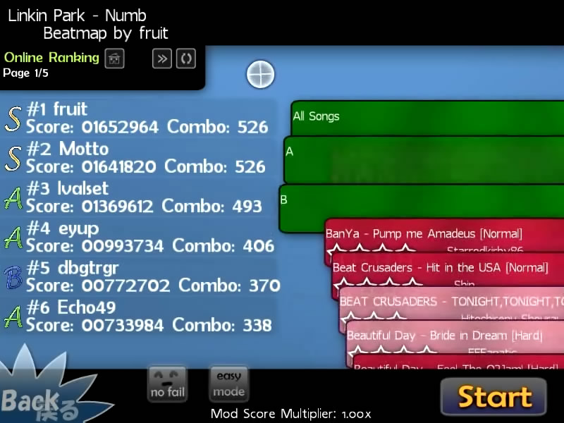

# Historia osu!
## 2007

## Lipiec
osu! rozpoczął swoją przygodę jako proof-of-concept (dowód na koncept) o nazwie "ouentest". Pierwsza wersja została wydana 1 lipca 2007 roku dla małej grupy odbiorców (głównie to byli przyjaciele). Gra zawierała bardzo podstawowy tryb edycji i dzięki niemu można było stworzyć prostą bitmapę.
Nie było żadnych sliderów oraz spinnerów, ale liczniki punktacji / combo były obecne w grze. Kodowanie pierwszej wersji zajeło 16 godzin. pUpdater został wprowadzony (obecnie znany jako osume) do obsługi aktualizacji do najnowszej wersji. Pod koniec lipca, menu gry zostało zmienionione, aby dodać trochę "stylu". Początkowe wdrożenie sliderów zostały zakończone, z pomarańczową piłeczką na czele (która była bardzo brzydka).

## Sierpień
Menu główne zostało ponownie zaaktualizowane, a edytor dostał wiele nowych funkcji (w tym wsparcie dla kopiowania / wklejania). Windowsowy pasek menu oraz kursor myszy zostały dodane, co ułatwiało prace nad bitmapą.
Lokalne wysokie wyniki teraz są o wiele lepsze. Format pliku .osu został zmieniony i całkowicie rozbudowany, obejmuję konwersję starszych plików do nowego formatu.

## Wrzesień

###

Gra osu! wreszcie ujżało światło dzienne. Strona osu została postawiona na domowym serwerze peppego (ppy.sh).
Mała gierka zdobyła popularność dzięki stronie bemanistyle.com która przyciągnęła sporo zainteresowanych osób z wcześniejszym doświadczeniem rytmicznej gry.
Zostały dodane pierwsze mody - Easy oraz No Fail. Duża liczba zmian przyciągała uwagę.
## Październik
1 październik był dniem, kiedy rankingi na forum zostały udostępnione publicznie. Wtedy również zapoczątkowano sposób pakowania pliku .osz oraz bazę beatmap online z bardzo wczesnym systemem składania wniosków. Rankingi online zostały dodane do interfejsu gry, a także były wyświetlane na stronie internetowej.
###

###

###
Ekran wyboru piosenki został ulepszony, dodano grupowanie trudności oraz bardziej intuicyjny ruch koła piosenki. Dodano również kontrolę kółka na klawiaturze. Gracze mogli tworzyć skórki oraz edytować skórkę bitmapy. Dodano również wsparcie dla TabletPC.
pUpdater (osume) v2 została wydana, wspierała one alternatywne pobieranie pakietów. Obejmowało to skórki użytkownika udostępnione wszystkim graczom za pośrednictwem Updatera.
## Listopad
Nowa ranga SS dodaje do systemu rankingu zastepce S w przypadku, gdy gracz osiągnął perfekcjie. No Video oraz Hidden zostały wprowadzone. Pliki .osz mogą być teraz ładowane przez dwukrotne kliknięcie lub przeciągnięcie ich na ikonkę osu!.
###
"Beatmap Submission System" został dodany, dzięki czemu użytkownicy mogli przesyłać szybciej mapy.
Dzięki temu dodano również bardzo wczesne "Bancho", można było zobaczyć rankingi, rozmawiać na czacie, oglądać awatary, itp. Kontrola muzyki została dodana do ustawień, umożliwiała ona wyłączenie puszczanych losowych piosenek przy starcie. Powtórki można było oglądać zarówno na lokalnej grze oraz w grze online. Gracze mogli obserwować innych graczy (można było również komentować w tym samym czasie na kanale IRC!)
