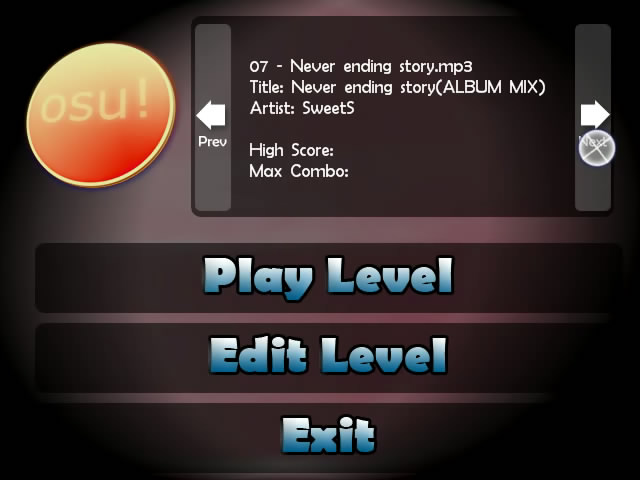

# Storia di osu! 2007

Quelli che seguono sono alcuni degli eventi più importanti della storia di osu! sin dal suo inizio. Ringraziamenti speciali a [Sinistro](https://osu.ppy.sh/users/5530) per aver contributo nella compilazione dei contenuti del 2007/2008.

## Luglio

osu! ha inizio come una prova di concetto chiamata "ouentest".[^ouentest] La prima versione è stata rilasciata il 1 luglio 2007 per un piccolo gruppo di amici intimi di [peppy](https://osu.ppy.sh/users/2) e presentava un [editor di beatmap](/wiki/Client/Beatmap_editor) e una modalità di gioco molto semplici. L'editor poteva creare solo [beatmaps](/wiki/Beatmap) *molto* semplici, senza funzioni di ricerca o [snapping](/wiki/Beatmapping/Snapping) disponibili e non c'erano sliders o spinners, solo cerchi e un conteggio di punteggio/combo di base. Il primo rilascio ha richiesto circa 16 ore di codifica ed è stato realizzato in un'unica *notte*. `pUpdater` (presto conosciuto come `osume`)[^osume] è stato introdotto per gestire l'aggiornamento alla versione più recente.

Entro la fine di luglio, il sistema menu è stato modificato per aggiungere un po' di stile al gioco. È stata completata un'implementazione iniziale degli slider, insieme a una sfera arancione non animata e ad alcune curve relativamente brutte. All'editor è stato aggiunto il beat snapping, così come una timeline e un'interfaccia dell'editor più robusta (abbastanza simile a quella che vedi oggi nella vista [Componi](/wiki/Client/Beatmap_editor/Compose)).

## Agosto

Il menu principale è stato aggiornato con un nuovo aspetto e l'editor ha ricevuto molte nuove funzionalità, incluso il supporto per il copia-e-incolla. Sono stati aggiunti la scheda menu e il menu contestuale, rendendo le funzionalità dell'editor più accessibili rispetto a prima; gli slider erano supportati più ampiamente con la presenza dei [tick degli slider](/wiki/Gameplay/Hit_object/Slider/Slider_tick); era presente un [impilamento](/wiki/Beatmapping/Mapping_techniques/Stack) dei [cerchi colpiti](/wiki/Gameplay/Hit_object/Hit_circle); i punteggi più alti a livello locale erano meglio supportati; e il formato del file `.osu` è stato rivisto e completamente rinnovato, ma includeva la conversione dei file più vecchi nel nuovo formato.

Il gameplay è stato migliorato con il debutto del [combo fire](/wiki/Gameplay/Combo_fire), la barra della [vita](/wiki/Gameplay/Health), il percorso del cursore e sliders dall'aspetto migliore. A questo punto, osu! aveva una umile raccolta di decine di beatmap realizzate dal team di test, composto da circa cinque persone.

## Settembre

Il 17 settembre 2007 è stata la "nascita" di osu! per quanto riguardava il pubblico. I forum come li conosciamo oggi sono stati istituiti e ospitati dal dominio home di Peppy (`ppy.sh`). L'attenzione è stata attirata da un [annuncio di notizie](https://web.archive.org/web/20071221020801/http://www.bemanistyle.com/index.php?news_id=483) su [bemanistyle](http://bemanistyle.com/) che ha attirato parecchie persone interessate, con precedenti esperienze di giochi ritmici.

")

Subito dopo il rilascio al pubblico, furono aggiunte le prime [mods](/wiki/Gameplay/Game_modifier) di gioco, [Easy](/wiki/Gameplay/Game_modifier/Easy) e [No Fail](/wiki/Gameplay/Game_modifier/No_Fail), così come le sezioni break (che fino ad ora erano state ignorate e mancanti). Un gran numero di modifiche hanno rapidamente portato osu! a sembrare sempre di più un gioco ritmico legittimo.

") ")

## Ottobre

Il 6 ottobre 2007 è stato il giorno in cui le classifiche online sono state rese pubbliche. Ciò ha visto anche il lancio del metodo di packaging `.osz` e di un database di beatmap online con un primo sistema di invio basato sul web. Le classifiche online sono state aggiunte all'interfaccia di gioco e sono state visualizzate anche sul sito web.

La schermata di selezione dei brani ha visto miglioramenti con il ragguppamento delle difficoltà e un movimento più intuitivo della ruota dei brani. Il sample set software, i controlli basati su tastiera e la ricerca in-game sono tutti nati in questo mese. I giocatori potevano creare [skins](/wiki/Skinning) e skin per beatmap per la prima volta ed è stato implementato il supporto completo per Tablet PC.

La versione 2 di `pUpdater` (`osume`) è stata rilasciata, che supporta il download di pacchetti opzionali. Ciò includeva la messa a disposizione di tutti i giocatori delle prime skin create dagli utenti tramite l'aggiornamento. L'editor ha visto l'aggiunta dello [snap basato sulla distanza](/wiki/Client/Beatmap_editor/Distance_snap), del supporto dei segnalibri, di più tipi di curve degli slider, di colori personalizzati, di test di gioco, di tempi di consegna e molto altro.

## Novembre

Un nuovo grado SS è stato aggiunto al sistema di classificazione, sostituendo il grado S nei casi in cui è stata raggiunta la perfezione. Sono state introdotte la modalità [No Video](/wiki/Gameplay/Game_modifier/No_Video) e [Hidden](/wiki/Gameplay/Game_modifier/Hidden), insieme ai gradi SH (S argento) e SSH (SS argento). Per la prima volta, i giocatori potevano fare skin e assegnare i sample set normali e soft per la sezione dei tempi. I file `.osz` possono ora essere caricati facendo doppio clic su di essi o trascinandoli sulla finestra o icona di osu!.

") ")

---

")

Il [Sistema di invio delle beatmap](/wiki/Beatmapping/Beatmap_submission) (BSS) è stato reso pubblico, consentendo agli utenti di caricare e condividere facilmente le proprie creazioni. Ciò ha introdotto lo stato di [in attesa](/wiki/Beatmap/Category#wip-and-pending) e [classificata](/wiki/Beatmap/Category#ranked) e ha aiutato a organizzare la raccolta in rapida crescita di beatmap inviate dagli utenti. La chat di gioco è stata aggiunta come client [IRC](/wiki/Community/Internet_Relay_Chat) (Internet Relay Chat) creato da zero e connesso a un server IRC standard (senza [Bancho](/wiki/Bancho_(server))); la chat estesa era visibile; gli avatar e le statistiche di base venivano visualizzati nel gioco utilizzando una comunicazione basata su http; sono stati aggiunti anche i controlli audio al menu principale, che riproduceva un brano casuale all'avvio; i [replay](/wiki/Gameplay/Replay) potevano essere guardati sia per i punteggi locali che per le partite online. I giocatori potevano osservare altri giocatori (i dati degli spettatori venivano inviati grezzi su IRC).

## Dicembre

I brani possono essere modificati trascinandoli nella finestra di osu!; sono stati aggiunti i tooltip che spiegano tutti i vari pulsanti nell'osu! menu e interfaccia dell'editor; molte nuove skin di qualità sono state presentate dai primi [skinners](/wiki/Skinning/Skinner) ([Holiday by LuigiHann](https://osu.ppy.sh/community/forums/topics/1139), [WindWaker by awp](https://osu.ppy.sh/community/forums/topics/761)); sono stati aggiunti nuovi metodi di ordinamento alla schermata di selezione dei brani; peppy potrebbe inviare annunci universali a tutti i giocatori di osu! e sono state apportate piccole modifiche al gameplay (come l'oscuramento dei cerchi non attivi).

## Riferimenti

[^ouentest]: [Tweet di @ppy (2019-06-19)](https://twitter.com/ppy/status/1141394137637249025?s=20)
[^osume]: [Discussione del forum di peppy (2007-08-28) "pUpdater (aka osume)"](https://osu.ppy.sh/community/forums/topics/4?n=1)
