# Geschiedenis van osu! 2007

Het volgende is een deel van de geschiedenis van osu! sinds het begin. Met dank aan [Sinistro](https://osu.ppy.sh/users/5530) voor de hulp bij het samenstellen van de inhoud van 2007/2008.

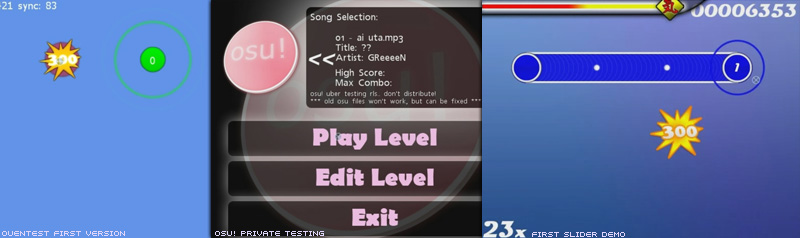

## Juli

osu! begon als een proof-of-concept met de naam "ouentest". De eerste versie werd uitgebracht op 2007-07-01 voor een kleine groep van peppy's goede vrienden en bevatte een zeer eenvoudige editor en spelmodus. De editor had geen zoek- of snappingfuncties, maar kon alleen eenvoudige beatmaps maken. Er waren geen sliders of spinners op dit punt, maar er waren wel basis score/combo-tellers aanwezig. De eerste release kostte ongeveer 16 uur coderingstijd en werd gedaan in één *all-nighter*. `PUpdater` werd geïntroduceerd (binnenkort bekend als `osume`) om het updaten naar de laatste versie te kunnen afhandelen.

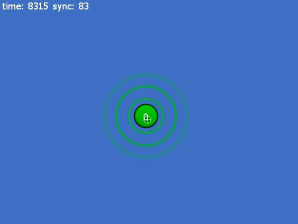

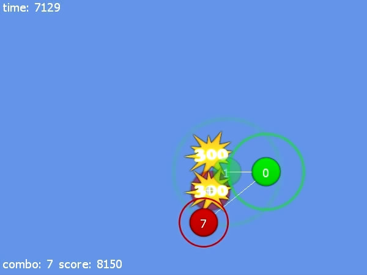

Eind juli werd het menusysteem gewijzigd om het spel wat meer stijl te geven. Een eerste implementatie van sliders werd voltooid, met een niet geanimeerde oranje schuifbal en enkele vrij lelijke bochten. Beat snapping werd toegevoegd aan de editor, evenals een tijdlijn en een meer robuuste editor interface (vrij gelijkaardig aan wat je vandaag ziet in [Compose](/wiki/Client/Beatmap_editor/Compose) view).

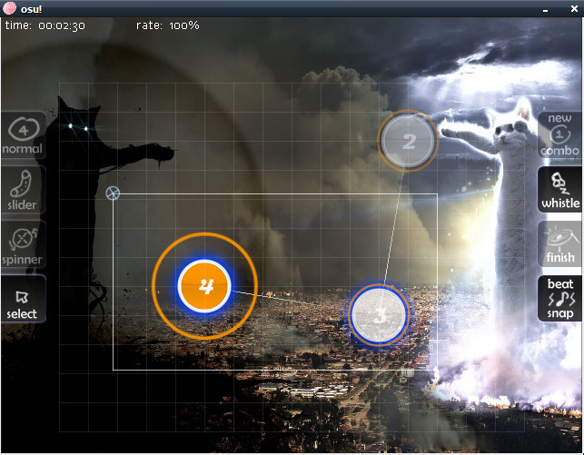

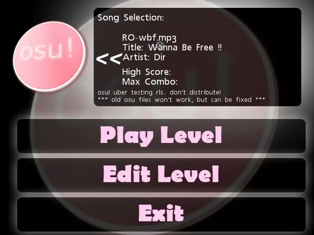

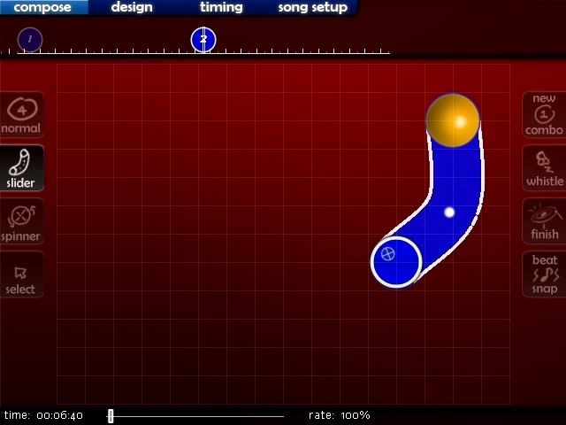

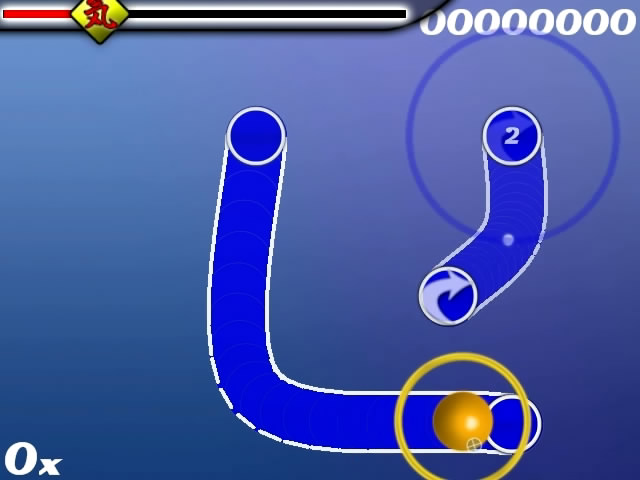

## Augustus

Het hoofdmenu werd geüpdatet met een nieuwe look, en de editor kreeg veel nieuwe functionaliteiten, waaronder kopieer- en plakondersteuning. De menubalk en de cursor van Windows werden toegevoegd, waardoor de functies van de editor veel toegankelijker werden dan voorheen. Sliders werden uitgebreider ondersteund, waarbij ticks toegevoegd werden die verdwenen als de sliderball erdoorheen ging. Het stapelen van hitcirkels werd mogelijk gemaakt. Lokale highscores werden veel beter ondersteund. Het .osu-bestandsformaat werd volledig vernieuwd. Dit omvatte ook de conversie van oudere bestanden naar het nieuwe formaat.

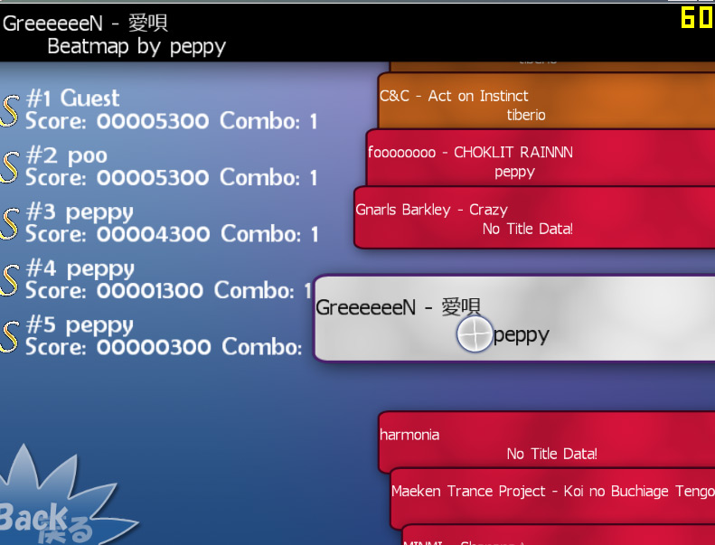

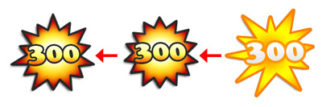

De gameplay werd verbeterd met het debuut van [combo fire](/wiki/Gameplay/Combo_fire), de HP-balk, muissporen en beter uitziende sliders. Op dit punt had osu! een bescheiden verzameling van ongeveer 10 beatmaps gemaakt door het testteam van ongeveer 5 mensen.

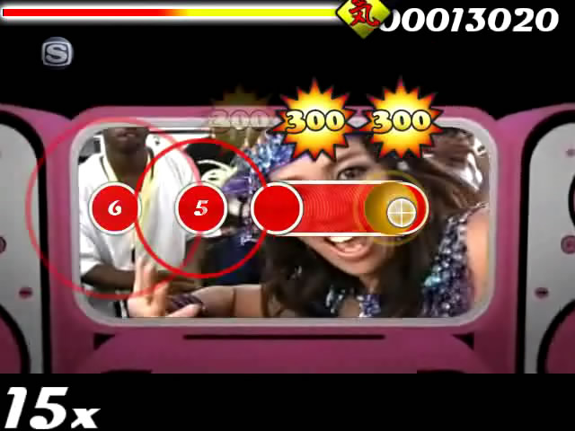

## September

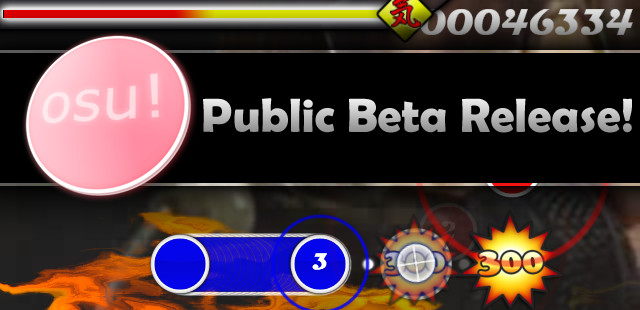

2007-09-17 was de geboorte van osu! wat het grote publiek betreft. De forums zoals we die nu kennen werden opgericht en gehost vanuit peppy's domein (ppy.sh). Er werd aandacht getrokken via een nieuwsbericht op [bemanistyle](https://www.otaquest.com/bemanistyle) dat nogal wat geïnteresseerden met eerdere ritmespelervaring aantrok.

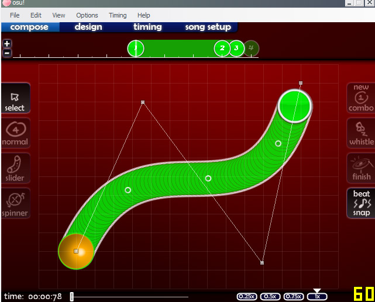

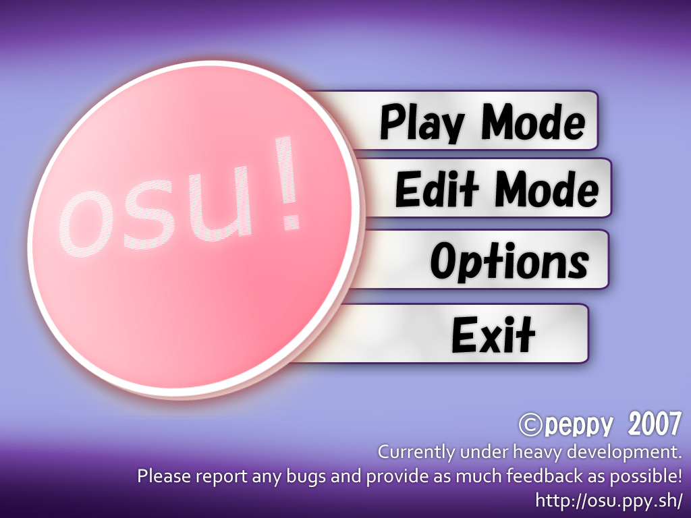

")

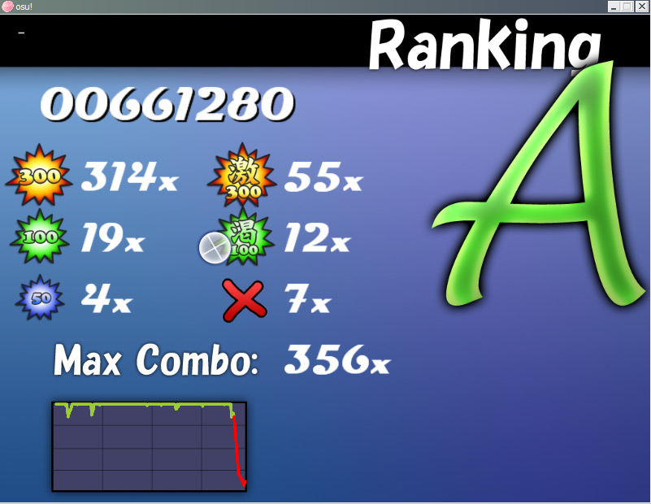

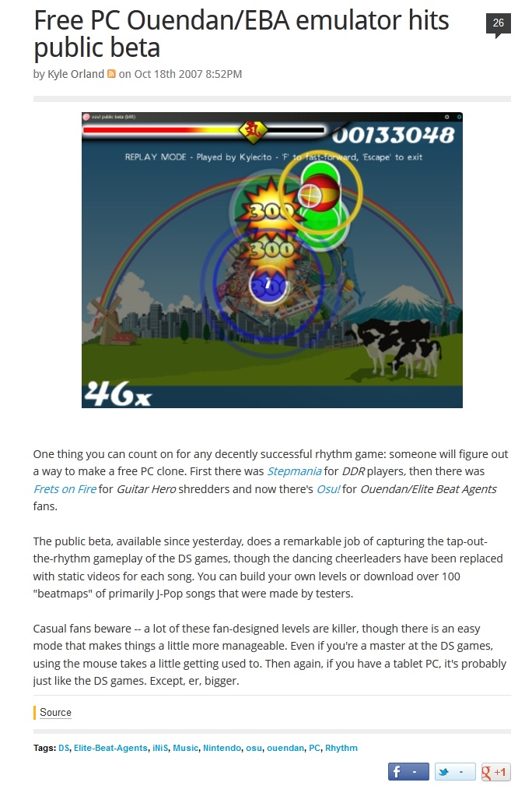

Een korte tijd na de publieke release werden de eerste mods, [Easy](/wiki/Disambiguation/EZ) en [No Fail](/wiki/Gameplay/Game_modifier/No_Fail), toegevoegd, evenals break secties (die tot nu toe genegeerd werden en ontbreekten). Een groot aantal veranderingen werd snel doorgevoerd waardoor osu! steeds meer op een commercieel ritmespel begon te lijken.

") ")

## Oktober

2007-10-06 was de dag waarop de online ranglijsten openbaar werden gemaakt. Ook de lancering van de .osz-zipmethode en de online beatmap-database met een vroeg webgebaseerd inzendingssysteem werd op die dag uitgevoerd. Online rankings werden toegevoegd aan de in-game interface en werden ook getoond op de website.

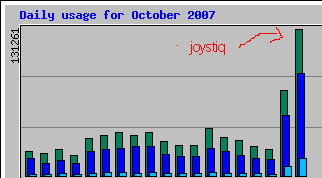

Het muziekselectiescherm werd verbeteringen, met groepering van moeilijkheden en een meer intuïtieve beweging van het muziekwiel. De zachte sampleset, toetsenbordbediening en in-game zoeken komen allemaal uit deze maand. Spelers konden voor het eerst universele skins en per-beatmap skins maken en er werd volledige TabletPC-ondersteuning geïmplementeerd.

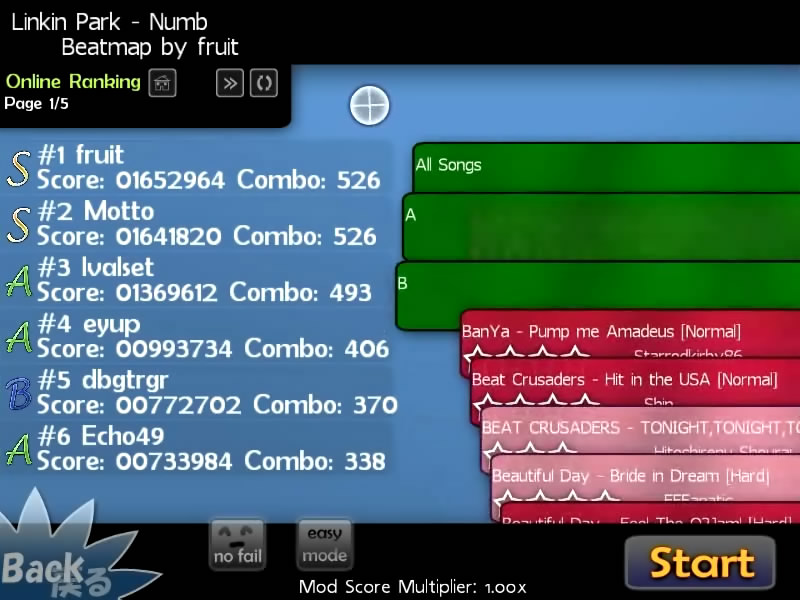

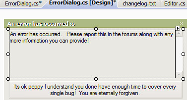

`pUpdater` (`osume`) versie 2 werd uitgebracht, met ondersteuning van optionele pakketdownloads. Dit omvatte het beschikbaar stellen van de eerste door de gebruiker gemaakte skins aan alle spelers via het updateprogramma. De editor zag de toevoeging van [afstand gebaseerde snapping](/wiki/Beatmapping/Snapping), bladwijzerondersteuning, meerdere sliderbochten, aangepaste kleuren, play-testing, lead-in tijd, en nog veel meer.

## November

Een nieuwe SS-rang werd toegevoegd aan het rangschikkingsysteem, ter vervanging van de S-rang in gevallen waarin de perfectie werd bereikt. De [No Video](/wiki/Gameplay/Game_modifier/No_Video) en [Hidden](/wiki/Gameplay/Game_modifier/Hidden) mods werden geïntroduceerd, en de SH (zilvere S) en SSH (zilver SS) kwamen er ook bij. Voor het eerst konden spelers skins, normale en zachte samplesets per timingsectie toewijzen. `.osz-bestanden` konden nu worden geladen door er op te dubbelklikken, of door ze op het osu! icoon te slepen.

") ")

---

")

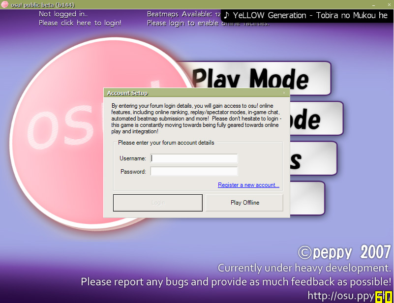

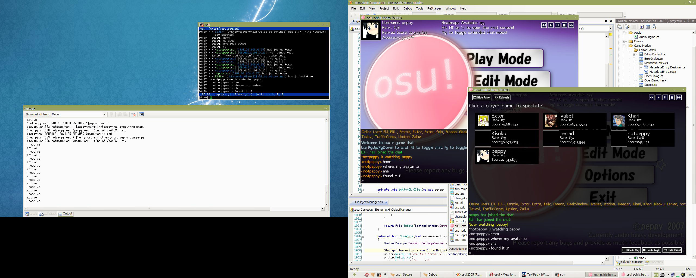

Het [Beatmap Submission System](/wiki/Beatmapping/Beatmap_submission) (BSS) werd openbaar gemaakt, zodat gebruikers hun creaties gemakkelijk konden uploaden en delen. Dit introduceerde de status van in afwachting en gerangschikte maps en hielp bij het organiseren van de snelgroeiende collectie van door gebruikers ingezonden beatmaps. In-game chat werd toegevoegd, als een IRC-client die vanaf nul is opgebouwd en verbonden was met een standaard IRC-server (nog geen bancho). Uitgebreide chat was zichtbaar. Avatars en basisstatistieken werden in het spel weergegeven (met behulp van een http-gebaseerde communicatie). Audiobedieningen werden ook toegevoegd aan het hoofdmenu, dat nu ook een willekeurig nummer afspeelde bij het opstarten. Replays konden worden bekeken voor zowel de lokale als de online scores. Spelers konden andere spelers spectaten (en de spactator data werd ruw en onbewerkt over IRC verstuurd!).

## December

Liedjes konden worden bewerkt door ze in het osu! venster te slepen. Er werden tooltips toegevoegd, die alle verschillende knoppen in de osu! menu's en de editor-interface uitlegden. Veel nieuwe kwaliteitsvolle skins werden ingezonden door vroege skinners ([Holiday van LuigiHann](https://osu.ppy.sh/community/forums/topics/1139), [WindWaker van awp](https://osu.ppy.sh/community/forums/topics/761)). Nieuwe sorteermethodes werden toegevoegd aan het muziekselectiescherm. peppy kon nu universele aankondigingen sturen naar alle osu! spelers. Er werden kleine aanpassingen gedaan aan de gameplay, zoals het dimmen van niet-actieve cirkels.

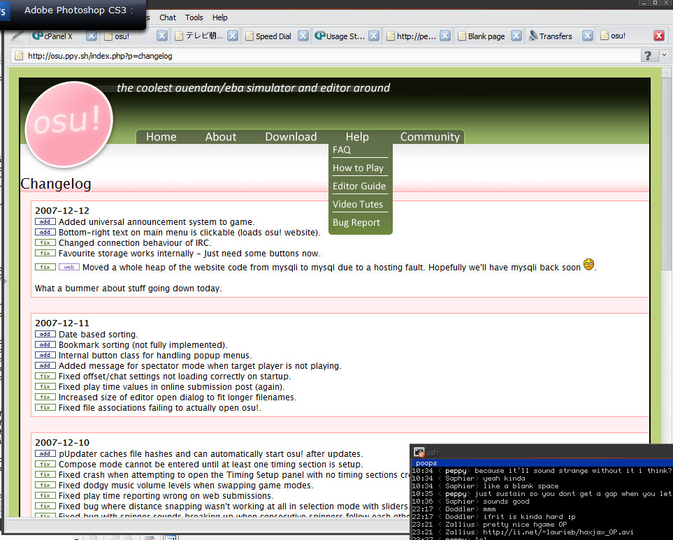
