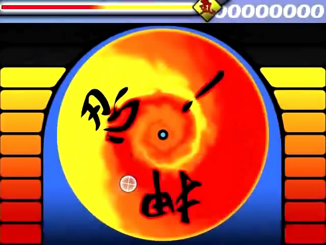
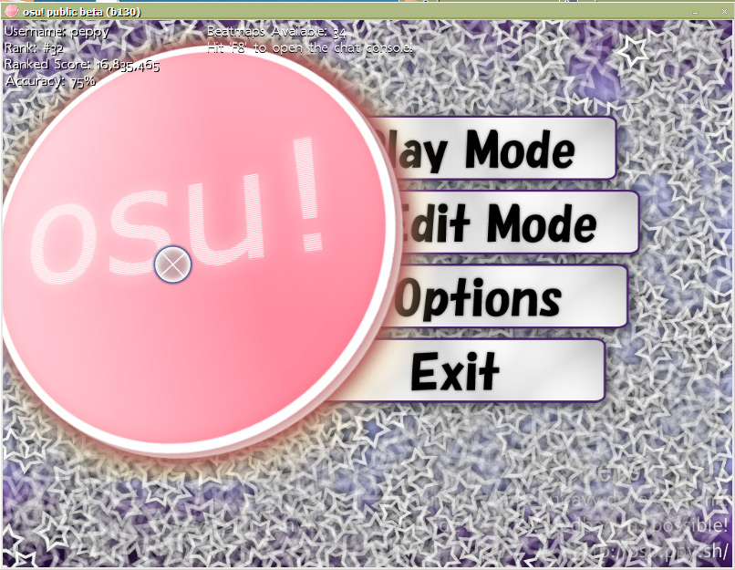

# osu! 2007大事记

本文记载了 osu! 自其诞生以来的重大事件。感谢 [Sinistro](https://osu.ppy.sh/users/5530) 编写 2007 年至 2008 年部分的内容。

## 七月

osu! 在最开始其实是一个叫做 “应援测试 (ouentest)”[^ouentest] 的概念验证产品。它的第一个版本面向 [peppy](https://osu.ppy.sh/users/2) 的很小一部分挚友于 2007 年 7 月 1 日发布，包含一个简单的[谱面编辑器](/wiki/Client/Beatmap_editor)以及游玩谱面的功能。这个制谱器也只能创建*非常*基本的不包含预览或者[网格对齐](/wiki/Disambiguation/Snapping)等诸如此类的功能，而游玩模式中的[谱面](/wiki/Beatmap)也没有滑条或者转盘，而只有最基本的普通音符以及分数和连击的计数器。第一个发布版只用了大概 16 个小时编码，而且是在*一个通宵*之内完成的。`pUpdater`（也就是之后为人所知的 `osume`）[^osume]也跟着发布，用于负责将游戏自动更新至最新版本。

在七月底，菜单系统为了给游戏添加一些风格而进行了一些改变。最早的滑条功能已经实现，尽管其本质上就是一个没有任何动画的橙色球以及一些比较丑的曲线。音符拆分和时间线功能一同加入了谱面编辑器，而一并加入的是一个更健壮的界面（跟现在的[作曲](/wiki/Client/Beatmap_editor/Compose)界面有点像）。

## 八月

主菜单在此时更新为了一个全新的外观，而谱面编辑器则是得到了包括复制粘贴功能在内的不少功能更新；内容目录和菜单栏被加入，使得其功能比之前看起来更加直观；滑条得到了[滑条点](/wiki/Gameplay/Hit_object/Slider/Slider_tick)的扩展；[打击圈](/wiki/Gameplay/Hit_object/Hit_circle)也可以进行[堆叠](/wiki/Beatmapping/Mapping_techniques/Stack)；本地的高分榜也得到了完善；谱面格式 `.osu` 也进行了修改，甚至可以说是改头换面。但在对其进行更改的同时，也加入了一个能将旧谱面格式转换为新谱面格式的转谱器。

[连击特效](/wiki/Gameplay/Combo_fire)、[血量](/wiki/Gameplay/Health)条、鼠标尾迹和更好看的滑条改良了游戏体验。此时，osu! 已经有了一个由一个五人测试团队所制作的大约 10 张谱面所组成的一个谱面库。

## 九月

2007 年 9 月 17 日是 osu! 被大众所公认的"生日"。我们今日所熟知的论坛在此日开通，并且托管于 peppy 的主域名 ( `ppy.sh` )。[这条新闻](https://web.archive.org/web/20071221020801/http://www.bemanistyle.com/index.php?news_id=483)被一家叫做 [bemanstyle](http://bemanistyle.com/) 的媒体发现并且发布了出来，而这条新闻则吸引了一些些对这有兴趣的音游人的注意力。

在正式版本发布之后，最初的[游戏模组](/wiki/Gameplay/Game_modifier) [Eazy](/wiki/Gameplay/Game_modifier/Easy) 和 [No Fail](/wiki/Gameplay/Game_modifier/No_Fail) 迅速加入，而与其一同加入的还有休息时间（对其的编辑至今仍缺失，并且被忽略）。这个月中大量的功能变更迅速使得 osu! 越来越像一个独立音游。

## 十月

2007 年 10 月 6 日是在线排行榜公开的第一天。同样，在这一天，新的 `.osz` 谱面格式和一个早期的基于在线提交系统的谱面库上线。在线排行榜不仅被加入游戏内界面，而且也同时显示在了网站上。

而选曲界面则有了两个改进：一个是基于难度的分组方式，一个是看起来更加直观的“滚轮式”选图动画。软件示例集、基于键盘的控制方式和游戏内搜索在这个月中加入。玩家们首次可以制作全局[皮肤](/wiki/Skinning)和对于特定谱面的皮肤。同时，对于平板（触屏）电脑的完整支持也得到了实现。

`pUpdater` ( `osume` ) 版本 2 发布，同时也支持下载可选包。这也代表着第一个由用户自己制作的皮肤可以通过更新程序向全体玩家公布。而作图器中则加入了[基于距离的音符拆分](/wiki/Client/Beatmap_editor/Distance_snap)、标记点、更多种类的滑条曲线、自定义颜色、试玩、前摇时间等等功能。

## 十一月

新的 SS 评价被加入了评分系统，用于替换在这之前达到完美的 S 级评分。[No Video](/wiki/Gameplay/Game_modifier/No_Video) 和 [Hidden](/wiki/Gameplay/Game_modifier/Hidden) 两个模组和配套的 SH (银 S ) 和 SSH (银 SS) 两个评价加入游戏。也是第一次，玩家们可以基于每一段计时部分来切换皮肤。现在可以通过双击或将其拖动到osu!的图标或窗口中来加载 `.osz` 谱面。

[提交谱面](/wiki/Beatmapping/Beatmap_submission)功能（BSS）对公众开放，使得用户可以轻松的上传、分享他们的劳动成果。而这也带来了[待定](/wiki/Beatmap/Category#wip-and-pending)和[上架](/wiki/Beatmap/Category#ranked)两个分类。它们有助于分类曲库中疯狂增加的由用户上传的谱面。而游戏内的聊天室则是一个从零搭起的 [IRC](/wiki/Community/Internet_Relay_Chat) (互联网中继聊天)客户端，并且连接到一个标准的不包含 [Bancho](/wiki/Bancho_(server)) 的 IRC 服务器；现在全局聊天是可见的；头像和用户的基本信息也在游戏中使用一种基于 http 的通讯方式显示出来；一个会在游戏启动时随机播放一首歌的播放器也被加入主菜单；无论是本地的还是在线的[回放](/wiki/Gameplay/Replay)都可以被观看。同时，玩家们也可以旁观别的玩家（旁观者的数据会以未加密的形式通过 IRC 来发送）。

## 十二月

现在，将音乐拖入 osu! 的窗口就可以直接为它制作谱面；主界面和作图器中的每个按钮都加入了与其相对应的提示；一些新的优质皮肤由一些早期的[皮肤制作者](/wiki/Skinning/Skinner)([Holiday by LgigiHann](https://osu.ppy.sh/community/forums/topics/1139), [WindWaker by awp](https://osu.ppy.sh/community/forums/topics/761))所提交；选曲界面有了新的排序方式；现在，peppy 可以给所有玩家发公告；游玩模式做出了一些小更改（比如对未激活的打击圈进行暗化）。

## 引用

[^ouentest]:[@ppy 发的推特（2019 年 6 月 19 日）](https://twitter.com/ppy/status/1141394137637249025?s=20)
[^osume]:[论坛中peppy发的帖子（ 2007 年 8 月 28 日）"pUpdater（又名 osume）"](https://osu.ppy.sh/community/forums/topics/4?n=1)
