# osu! 2007 大事记

本文记载了 osu! 自其诞生以来的重大事件。感谢 ::Sinistro::{ user-id=5530 } 编写 2007 年至 2008 年部分的内容。

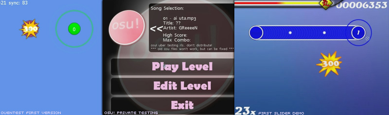

## 七月

osu! 在最开始其实是一个叫做 “应援测试 (ouentest)”[^ouentest] 的概念验证产品。它的第一个版本于 2007 年 7 月 1 日面向 ::peppy::{ user-id=2 } 的一小部分挚友发布，包含一个简单的[谱面编辑器](/wiki/Client/Beatmap_editor)以及游玩谱面的功能。编辑器只能创建*非常*基本的[谱面](/wiki/Beatmap)，且不包含定位与[对齐](/wiki/Disambiguation/Snapping)等功能，也没有滑条或者转盘，只有圈圈、基础的计分板和连击计数器。写第一个发布版本的代码只花了大概 16 个小时，而且是在*一个通宵*之内完成的。`pUpdater`（也就是之后为人所知的 `osume`）[^osume]也跟着发布，用于负责将游戏自动更新至最新版本。

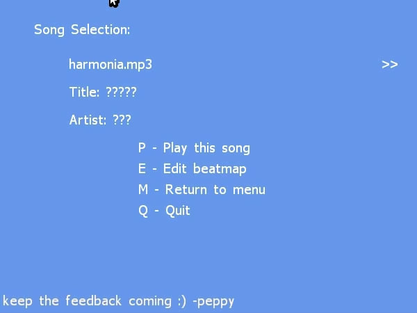

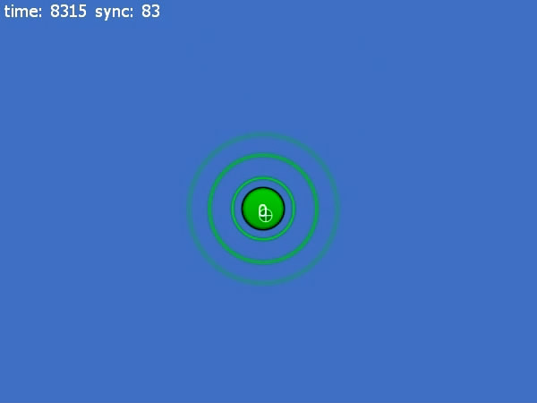

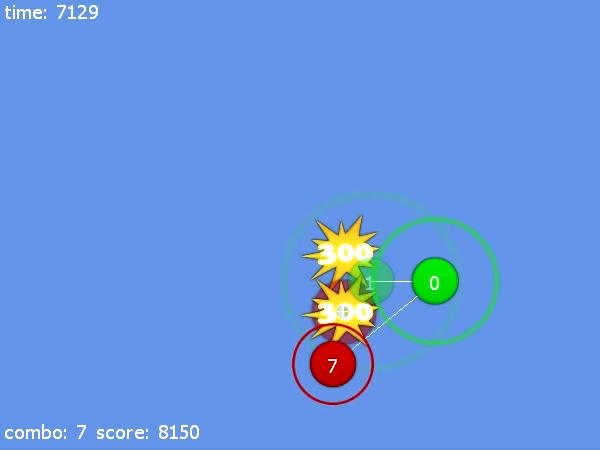

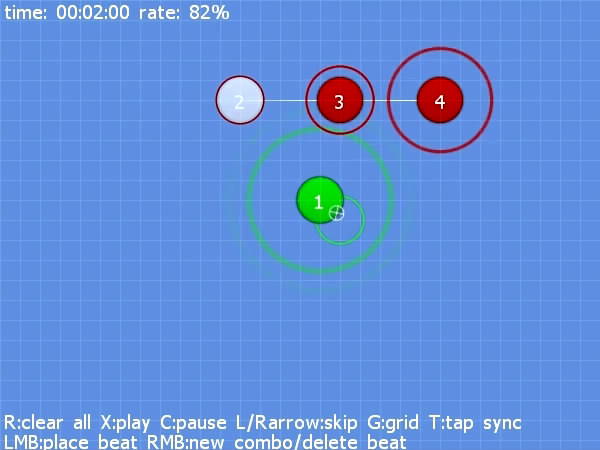

在七月底，为了给游戏添加一些风味，菜单系统做了一些调整。初始的滑条功能在此时被实现，由没有动画的橙色滑条球以及比较丑的曲线构成。节拍对齐功能被加入到谱面编辑器中，同时还加入了时间轴，以及更健壮的编辑器界面（有点类似于现在的[作曲 (Compose)](/wiki/Client/Beatmap_editor/Compose) 界面）。

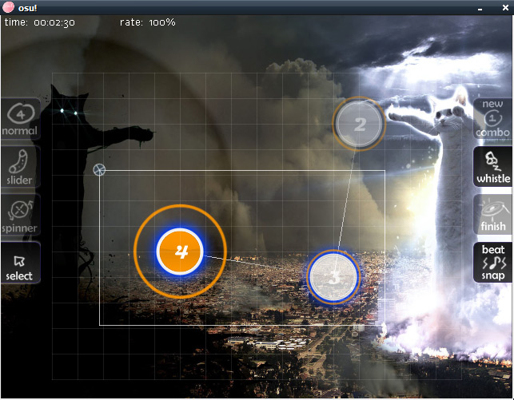

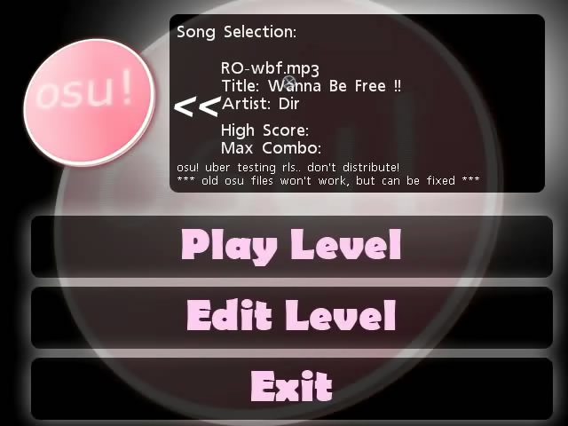

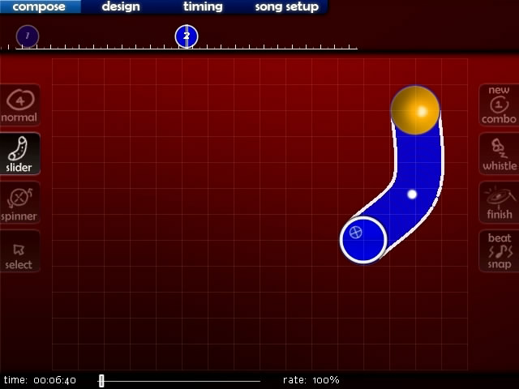

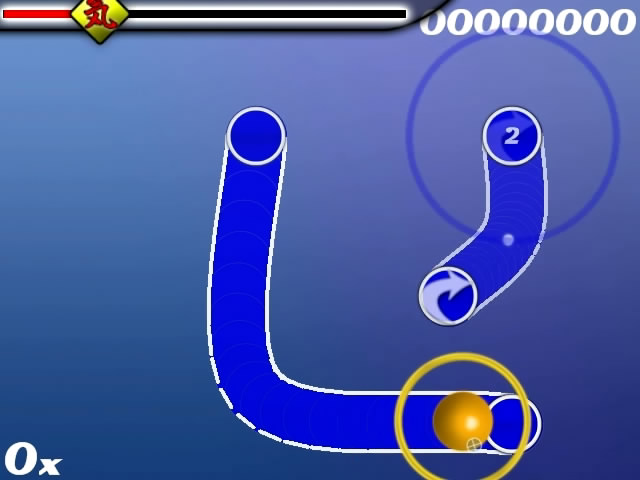

## 八月

主菜单的外观被全面更新，谱面编辑器也添加了不少新功能，其中包括复制与粘贴；菜单选项卡与设置菜单的加入，使编辑器的功能更加直观易用；滑条添加了[滑条点](/wiki/Gameplay/Hit_object/Slider/Slider_tick)支持；[打击圈](/wiki/Gameplay/Hit_object/Hit_circle)可以进行[堆叠](/wiki/Beatmapping/Mapping_techniques/Stack)；本地高分榜得到了完善；谱面格式 `.osu` 进行了修改，甚至可以说是改头换面，不过同时也包含了旧版本到新版本格式文件的转换。

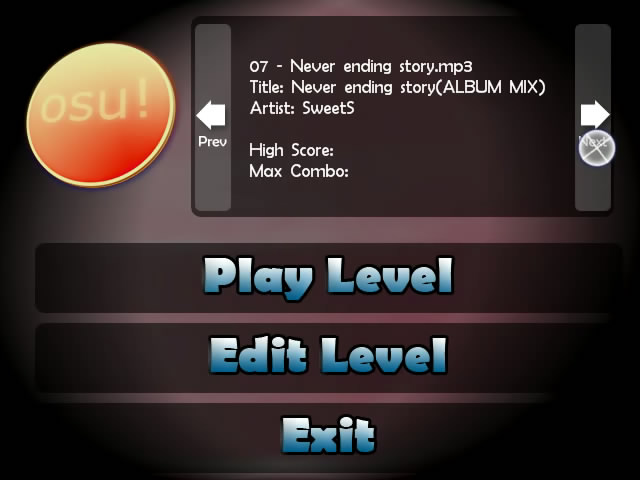

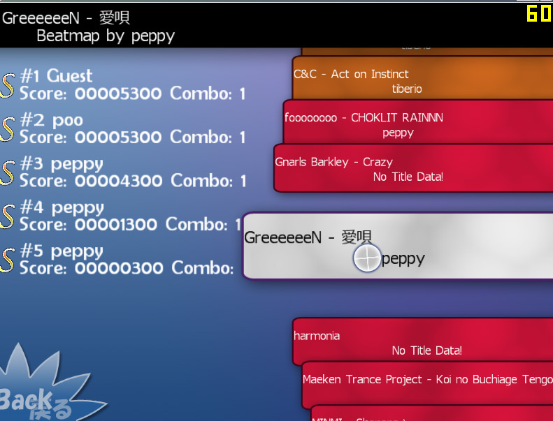

[连击特效](/wiki/Gameplay/Combo_fire)、[血量](/wiki/Gameplay/Health)条、光标尾迹和更好看的滑条提升了游玩体验。此时，osu! 拥有十来张谱面，由一支大约五个人组成的测试团队制作。

## 九月

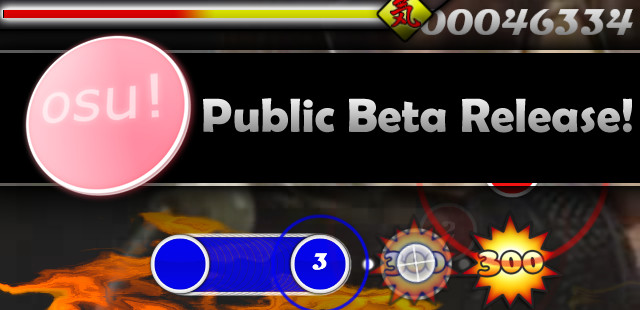

2007 年 9 月 17 日是 osu! 被大众所公认的"生日"。我们今日所熟知的论坛在此日开通，并且托管于 peppy 的主域名 (`ppy.sh`)。一家叫做 [bemanstyle](http://bemanistyle.com/) 的媒体为此报道了[一则新闻](https://web.archive.org/web/20071221020801/http://www.bemanistyle.com/index.php?news_id=483)，吸引来了相当一批感兴趣的音游玩家。

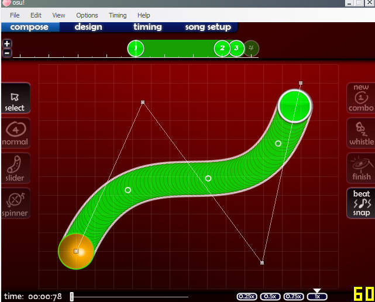

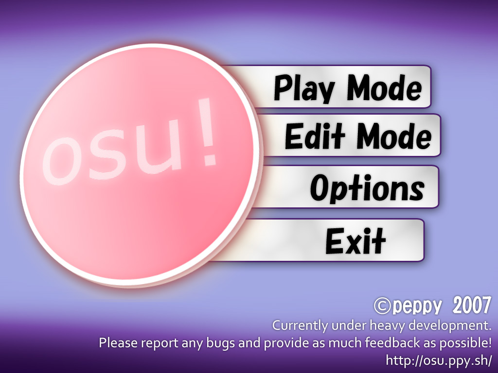

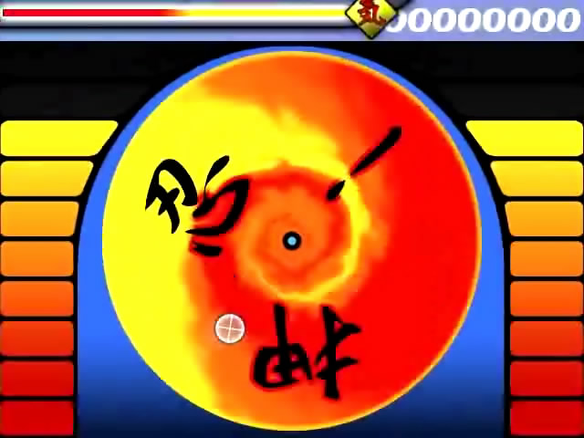

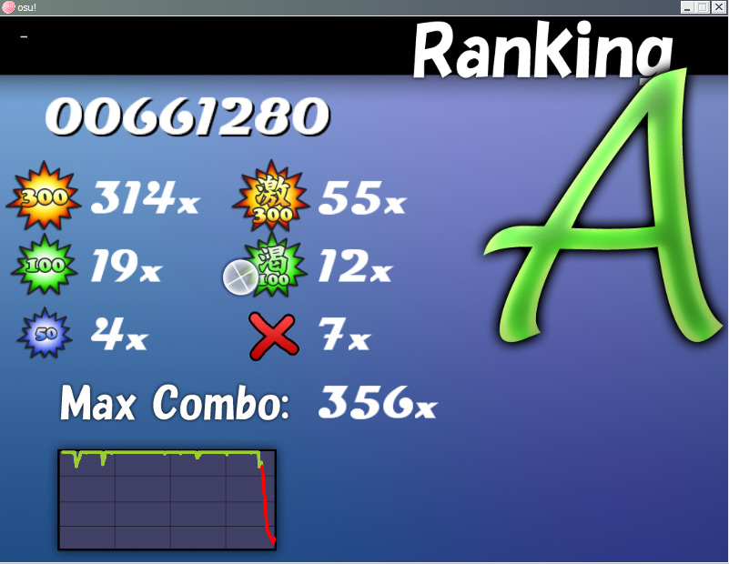

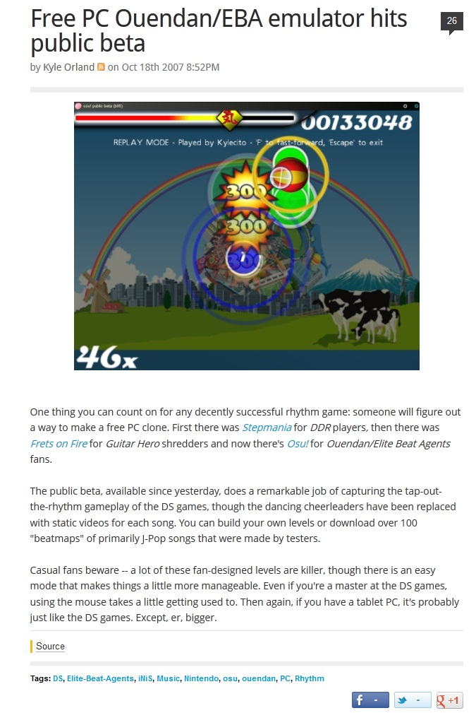

在正式版本发布之后，最早的[游戏模组](/wiki/Gameplay/Game_modifier) [Easy](/wiki/Gameplay/Game_modifier/Easy) 和 [No Fail](/wiki/Gameplay/Game_modifier/No_Fail) 很快便被加入，与其一同加入的还有休息时间（在此之前一直被冷落忽视）。相当多的变更很快让 osu! 越来越像一款独立音游。

") ")

## 十月

2007 年 10 月 6 日是在线排行榜公开的第一天。同一天还引入了 `.osz` 谱面打包格式，上线了在线谱面库，以及早期的在线谱面提交系统。在线排行榜加入了游戏内界面，同时也显示在网站上。

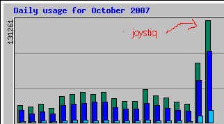

选歌界面从两方面有了显著改进：难度的分组方式、更加直观的选歌界面滚动体验。soft 音效集、基于键盘的控制方式和游戏内搜索全都在这个月被加入到游戏中。玩家们首次可以制作全局[皮肤](/wiki/Skinning)和谱面皮肤。同时，对于平板（触屏）电脑的完整支持也得以实现。

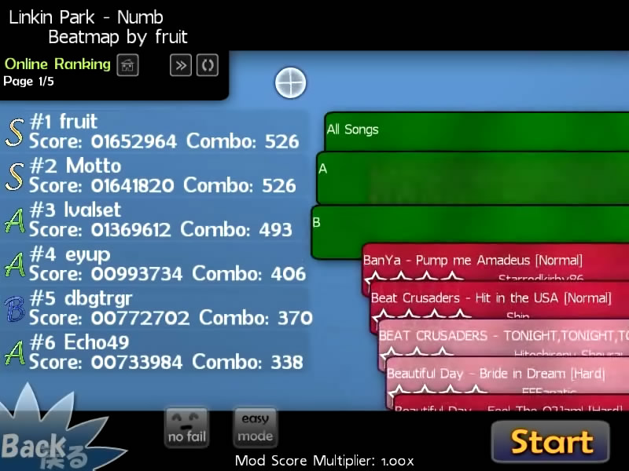

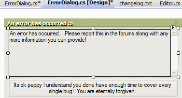

`pUpdater` (`osume`) 的第二版发布，支持了可选包下载功能。这次更新还通过更新程序向全体玩家推送了第一批由用户制作的皮肤。编辑器中引入了[间距锁定](/wiki/Client/Beatmap_editor/Distance_snap)、书签、更多种类的滑条曲线类型、自定义物件颜色、试玩、引导时间等各种功能。

## 十一月

新的 SS 评价被加入了评分系统，在完美通过时取代 S 而给出。[No Video](/wiki/Gameplay/Game_modifier/No_Video) 模组、[Hidden](/wiki/Gameplay/Game_modifier/Hidden) 模组以及与 Hidden 模组配套的 SH (银 S) 和 SSH (银 SS) 评价被加入到游戏中。玩家们现在可以按时间轴分段设置皮肤和 normal、soft 音效组。现在可以通过双击 `.osz` 谱面包文件，或将其拖动到 osu! 的图标或窗口中来加载它们。

")")

---

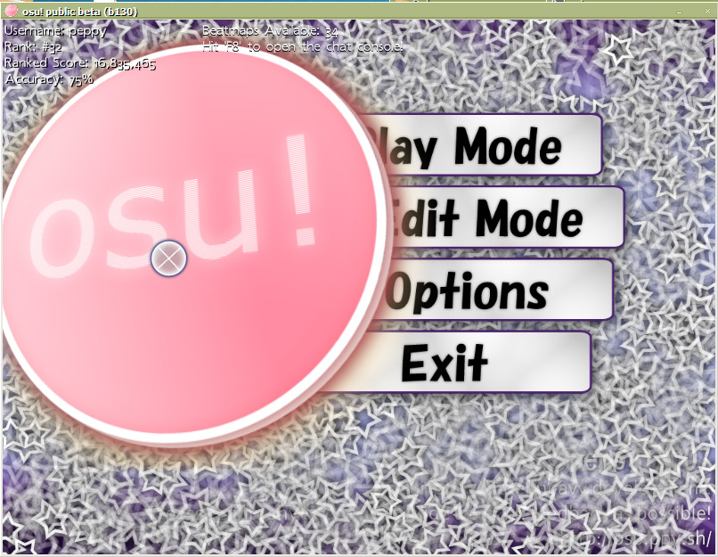

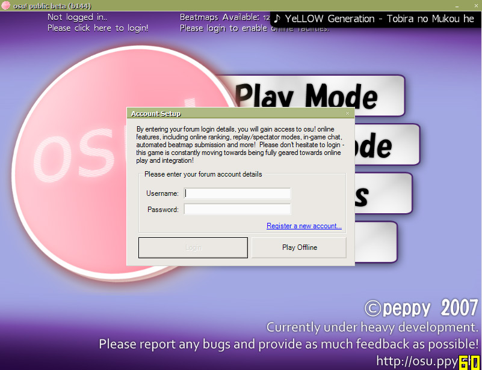

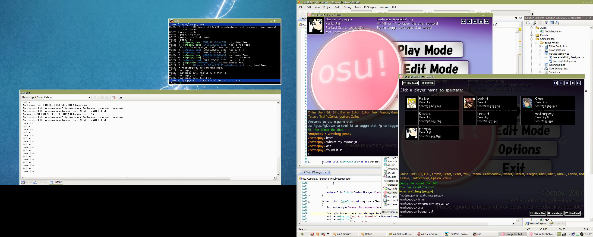

[谱面提交系统 (BSS)](/wiki/Beatmapping/Beatmap_submission) 开始对公众开放，使得用户可以轻松上传、分享他们的作品。而这也带来了[待定 (Pending)](/wiki/Beatmap/Category#wip-and-pending) 和[上架 (Ranked)](/wiki/Beatmap/Category#ranked) 两个谱面分类，用于组织曲库中迅速增加的用户上传谱面。游戏内聊天功能被添加到游戏中，使用了从零实现的 [互联网中继聊天 (IRC)](/wiki/Community/Internet_Relay_Chat) 客户端，连接到（不包含 [Bancho](/wiki/Bancho_(server)) 的）标准 IRC 服务器；全局聊天现在是可见的；玩家的头像和基本信息现在会利用基于 HTTP 的通讯方式显示在游戏内；音乐播放器及其控件也被加入主菜单，会在游戏启动时随机播放歌曲；本地、在线的[游玩回放](/wiki/Gameplay/Replay)现在都可以被观看。同时，玩家们也可以旁观别的玩家（旁观者的原始数据通过 IRC 来发送）。

## 十二月

现在，将音乐文件拖入 osu! 的窗口就可以直接基于该歌曲制作谱面；主界面和编辑器中的各个按钮都添加了对应的悬浮提示，用于解释它们的作用；早期的[皮肤制作者](/wiki/Skinning/Skinner)上传了一很多的优质皮肤（[由 LgigiHann 制作的 Holiday](https://osu.ppy.sh/community/forums/topics/1139)，[由 awp 制作的 WindWaker](https://osu.ppy.sh/community/forums/topics/761) 等）；选歌界面加入了新的排序方式；peppy 现在可以给所有玩家发送公告消息；游玩方面也做了一些小优化（比如暗化不活跃的圆圈）。

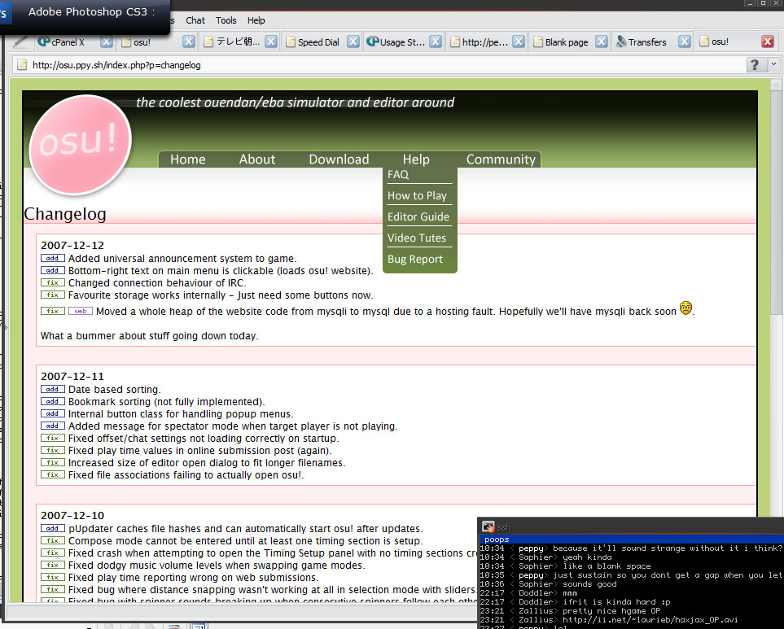

## 引用

[^ouentest]:[@ppy 发布的推文 (2019-06-19)](https://twitter.com/ppy/status/1141394137637249025?s=20)
[^osume]:[peppy 的论坛帖子 (2007-08-28) "pUpdater（又名 osume）"](https://osu.ppy.sh/community/forums/topics/4?n=1)
