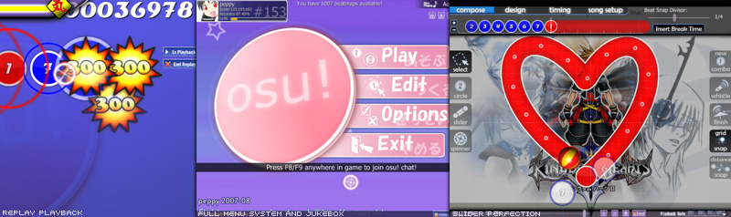
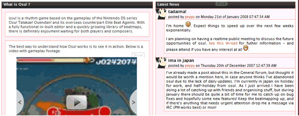

# History of osu! 2008

## January

peppy was MIA (missing in action) in Japan on December 17, 2007 until January 20, 2008. He somehow managed to draw himself away from the osu! codebase for a full month, thus there were no major updates (while the community was quite stagnant during this time).

## February

") ") ")

Players received extra challenges in the form of [mods](/wiki/Gameplay/Game_modifier) ([Hard Rock](/wiki/Gameplay/Game_modifier/Hard_Rock), [Sudden Death](/wiki/Gameplay/Game_modifier/Sudden_Death) and [Double Time](/wiki/Gameplay/Game_modifier/Double_Time)). Gameplay experience was enhanced considerably with the addition of countdown images and sounds, custom number and colours for combos, O/X (Pass/Fail) section rankings, countdown intros, background colour scripting, volume control per timing section and (perhaps most importantly) the introduction of [storyboard scripting](/wiki/Storyboard/Scripting) support. An attempt was made to move osu! over to the XNAv2 framework, but peppy decided the new version was useless and reduced overall performance. XNA1.1 was used from this point forward, which was shaped according to osu!'s needs with thousands of rewritten lines and "hacks" to make osu! what it was. A new text rendering engine was also implemented, allowing for very crisp font display at any font size. Which makes it possible to display more [editor](/wiki/Client/Beatmap_editor) information and make the game look a lot better overall.

## March

") ")

To counterbalance February's new mods, the [Relax](/wiki/Gameplay/Game_modifier/Relax) (RX) and [Half Time](/wiki/Gameplay/Game_modifier/Half_Time) (HT) mods arrived to make life easier for players this month. Users were now able to take screenshots, and import and export [replays](/wiki/Gameplay/Replay). Animations could be [storyboarded](/wiki/Storyboard) for the first time, and the [skin](/wiki/Skinning) selection screen was added. Performance optimisations saw a decrease in 82% for loading the song selection screen (via a new format for the local beatmap database). Various other performance tweaks were made, including the introduction of the frame limit toggle and a number of other graphical options. Project [Bancho](/wiki/Bancho_(server)) was started on March 24, 2008. The idea was to create a server component for the osu! family, which handles communications between users and removes the [IRC](/wiki/Community/Internet_Relay_Chat) (Internet Relay Chat) dependency.

## April

No joke, Bancho went live in April, and so did the user panels of [Extended Chat](/wiki/Client/Interface/Chat_console#extended-chat-console). Users were now able to see what other users were doing in their user panels, as well as interact with them by clicking to spectate. The automatic error submission system debuted, xfire compatibility was implemented, and the main menu and editor interface received makeovers (with new icons by [LuigiHann](https://osu.ppy.sh/users/1079)). The chat interface got some love with the "show chat" button, tab completion, and [nickname highlight](/wiki/Client/Interface/Chat_console/Highlight) alerts. The ranking screen now shows points required to reach the next rank.

## May

The [Taiko](/wiki/Game_mode/osu!taiko) mode first saw the light of day in this month, as well as another major addition, `.osb` storyboarding script support. Multi-part sliders and private messaging in chat were also made available.

## June

A major milestone in osu! history was reached with the addition of the [Multi (multiplayer)](/wiki/Client/Interface/Multiplayer) game mode. Skinning options were expanded further regarding both graphics and sounds. Lastly, multi-channel chat was possible for the first time.

## July

The editor, multiplayer, storyboarding, graphics, and chat console all received numerous improvements this month. The Options screen received a new layout, and [custom key bindings](/wiki/Client/Options/Keyboard_bindings) were introduced.

## August

Continuing the trend set by July, one would be hard pressed to find an aspect of osu! that wasn't improved or optimised in this month. In the realm of brand new additions, tags were added to beatmaps and multiple monitor support was implemented on an experimental level. A new method of unpausing gameplay was constructed to stop people abusing the pause function (which now required players to align their cursor to where it was before they paused in order to continue).

Personal online best scores were added to song selection, fulfilling a long-time request, which required some fairly hefty database optimisation. Graphical improvements to the ranking screen and various elements of the default skin were made in an aim to make them feel even more clean and crisp than before. The display of slider tick score sprites (10/30) was implemented. Improvements were seen in the multiplayer match setup, allowing host control to be transferred. Many new [chat commands](/wiki/Client/Interface/Chat_console#commands-list) were added for user convenience.

A new ranked status " [Approved](/wiki/Beatmap/Category#approved)" was added for maps which were of great quality but exceed ranking length, difficulty, or other limits in some way. Maps in this status don't add to the player's scores, but have scoreboards and act otherwise like a  [Ranked](/wiki/Beatmap/Category#ranked) map.

## September

") ") ")

A slew of new mods were unveiled this month: [Flashlight](/wiki/Gameplay/Game_modifier/Flashlight), [Spun Out](/wiki/Gameplay/Game_modifier/Spun_Out) and [Auto](/wiki/Gameplay/Game_modifier/Auto). Auto scripts an AI player that completed (almost) any beatmap with perfect [accuracy](/wiki/Gameplay/Accuracy), and can also be accessed via the editor test mode. The limits of beatmap design were pushed farther with the addition of more skinnable elements (including [comboburst images](/wiki/Gameplay/Comboburst), the clap sound sample, the ability to assign sound samples to individual slider endpoints and inherited timing sections. The song selection screen also received an overhaul.

## October

Progress was made on OpenGL implementation and the upcoming game mode debut ([Catch the Beat](/wiki/Game_mode/osu!catch), in a private testing environment. A lot of the internals of osu! were rewritten, equaling over 4,000 lines of completely revamped code in order to make play modes more modular so future modes could be added more easily. Due to these large changes, there was no public release in October.

## November

November saw the introduction of a brand new game mode, Catch the Beat. OpenGL support debuted, thus allowing osu! to run on most systems. Other new features in this update included in-game friend list support, private chat tabs, a new tutorial/[offset wizard](/wiki/Client/Options/Offset_Wizard) and osu!direct (an in-game beatmap downloader for supporters).

Due to people with large numbers of beatmaps complaining about the load time of osu!, peppy spent countless days optimising anything possible, resulting in a performance increase almost unmeasurable on a scale (somewhere over 9,000). Load times of over one minute were reduced to just milliseconds.

## December

The last month of 2008 had plenty in store for osu!'s development. By osu!'s second Christmas, the first version of the Storyboarding Editor was implemented, making storyboarding much more accessible to users. A second multiplayer mode was added: "Tag Play." It was a cooperative mode where players took turns playing a beatmap. Another addition to multiplayer was "Accuracy as a victory condition". MSN and Yahoo status were integrated, and users could fully customise key bindings and chat highlight trigger words.

Thumbnail and audible previews were added to the online beatmap listing, making browsing for a beatmap you'd like to play a much easier task.

Another noticeable event was that the [Catch the Beat scores were wiped](https://osu.ppy.sh/community/forums/topics/7996) during this month. Since then, the score multiplier of mods has been changed in Catch the Beat mode as well.

## The Future

*"Think big, and expect big."* — peppy
