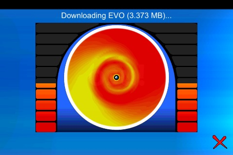

# osu! 2009 大事记

## 一月

osu! 被 [nuudles](https://osu.ppy.sh/users/21312) 移植到了 iPhone 上。该项目曾经拥有自己的子论坛，现已存档。[^iphone]

osu! 官网上的 FAQ 板块现在允许贡献翻译。在这之后，志愿者们为使得 FAQ 板块可以以多种不同的语言访问而做出了许多贡献。[^faq-localisation]

在 1 月 26 日的一次大更新中，又有许多功能被添加到 osu! 中。[^stable-b593a] 这些功能包括：新的多人游戏模式 [Tag VS](/wiki/Client/Interface/Multiplayer#team-vs) 与 [Tag Team VS](/wiki/Client/Interface/Multiplayer#tag-co-op-/-tag-team-vs)；多人游戏房间的密码保护；可以通过矢量缩放和翻转转换选项，将故事板编辑器中的对象以一种新方式进行修改；
游玩时，打击高亮效果将会以将颜色泼洒在屏幕上的方式来强调一次点击；歌曲游玩进度可以以饼状图进行显示；“最近游玩的”作为一种排序方式被加入了[选歌界面](/wiki/Client/Interface#选歌界面)。

## 二月

2 月 14 日，第四次 osu! community meeting 召开，讨论了谱面的管理方式、一个即将推出的本地化新功能两个议题，以及有关扩大 osu! 团队的一些问题。[^community-meeting-4]

为了缓解在[谱面审核流程](/wiki/Beatmap_ranking_procedure)中[摸图](/wiki/Modding)过程的压力，[Kudosu](/wiki/Modding/Kudosu) 系统被加入。谱师们可以给提出与谱面相关的建设性批评的人们奖励一种叫做 Kudosu 的点数。三个 Kudosu 可以兑换为一颗 Kudosu 星，而 Kudosu 星可以用于提升该谱面在[谱面审核团队](/wiki/People/Beatmap_Appreciation_Team) （BAT）的摸图队列中的优先级。[^kudosu-1]

## 三月

本月中的三次更新给 osu! 带来了不少改变。第一次更新包括在多人游戏大厅中加入筛选器、一个在出现冒犯性语言时进行自动过滤的聊天选项。如果启用了这个选项，那么每一条包含屏蔽词的聊天信息中的屏蔽词都将会被替换成一个预定义列表中的词语。
[^stable-b622]

在 3 月 21 日发布的第二次更新中，加入了 [Kiai 时间](/wiki/Gameplay/Kiai_time)，使谱师们能够在歌曲的最强部分加入星星特效。[^stable-b631]

在 3 月 26 日，osu! 中添加了对于 TaTaCon Wii Taiko 控制器和在 Catch the Beat 下对 Wiimote 游戏/菜单控制的支持。[^stable-b639] [^custom-changelog]

## 四月

总注册玩家数超过了10万。[^user-count]

## 五月

在 Kudosu 系统中的一项更改使得用户们可以给予任何一张谱面 Kudosu 星，而不是像之前那样只能给自己制作的谱面发送。[^kudosu-change]

在这个月的其他一些更新中，osu! 添加了宽屏支持和 [Autopilot](/wiki/Gameplay/Game_modifier/Autopilot) 模组。这个模组将会控制鼠标移动，而玩家只需要控制击打就行了。[^stable-b674]

## 六月

由于[谱面提交系统](/wiki/Beatmapping/Beatmap_submission)中的一项改变，用户们现在无法在谱面被摸图之后对其进行再次更改。当然，也出现了 BAT 成员们在不知道他们摸图过的谱面中包含了违反[谱面上架标准](/wiki/Ranking_criteria)的内容的情况下就将其上架的事件出现。[^bss-update]

到目前为止，osu! 仅提供英文版本。随着新的本地化系统的引入，用户可以翻译游戏客户端。他们可以下载包含游戏文本的文件，将其翻译成自己的语言，然后请求将文件集成到游戏客户端中。
[^client-localisation] [^stable-b695]

## 七月

在 7 月 14 日，osu! News 可以作为一个 [RSS 源](https://en.wikipedia.org/wiki/RSS)进行订阅。[^rss-news]

这个月的两次更新为鼠标灵敏度较低的用户带来了新的鼠标精度切换选项；以及为了简化在 osu! 中[制作故事板](/wiki/Storyboard/Scripting)的流程而加入的新的命令参数和快捷方式。

一个 32 GB 的 SSD 给服务器的数据库带来了容量上的升级。[^server-upgrade]

在三月份进行了首次 Taiko 模式的在线排名测试后，排名统计数据可以在 osu! 网站上按模式查看。[^per-mode-ranking] [^stable-b622] 在此之前，只有 [osu! 模式](/wiki/Game_mode/osu!) 有在线排名。[^stable-b753c] [^stable-b709]

## 八月

Twitter 账号 [@osustatus](https://twitter.com/osustatus) 被创建，用于通知玩家有关 [Bancho](/wiki/Bancho_(server)) 和网站的问题。[^osustatus]

在 8 月 12 日的更新中，osu! 为循环故事板对象新增了 `LoopType` 参数，并为太鼓游戏模式新增了 [Relax](/wiki/Gameplay/Game_modifier/Relax) mod。此外，还发布了用于检测谱面问题的工具 [AiMod](/wiki/Client/Beatmap_editor/AiMod) 的预发布版本。[^stable-b825]

## 九月

本月的更新集成了新功能，其中包括歌曲选择的宽屏支持，[^stable-b904a] 网站上的好友支持，等等。[^custom-changelog] 太鼓模式吉祥物 [pippidon](/wiki/Mascots#pippi) 也被加入游戏中。它现在会在游玩时显示在屏幕的左上角。[^stable-b898]

截至 9 月 6 日，所有 [太鼓分数已重置](https://osu.ppy.sh/community/forums/topics/17118?n=1)，以便使用改进的评分算法。

## 十月

新增了一个排名信息屏幕，为后来的的排名图表系统奠定了基础。[^stable-b1077][^custom-changelog]

由 [Larto](https://osu.ppy.sh/users/12328) 提交的 [Imogen Heap - Sweet Religion](https://osu.ppy.sh/beatmapsets/10000#osu/97517) 成为了 osu! 中的第 10000 张谱面。[^beatmap-10k]

除了 2009 年 7 月的 osu! 新闻外，[更新日志](/wiki/Changelog) 也在 10 月 25 日以 RSS 源的形式提供。[^rss-changelog]

## 十一月

10 月 18 日发布的 osu! 更新中带来了几个新功能：用户现在可以对[回放](/wiki/Gameplay/Replay)添加评论；[^custom-changelog]通过按 `Shift` + `F12` 可以自动将截图上传到 osu! 服务器。[^stable-b1118]

本月达成了两个里程碑：11 月 15 日，已进榜成绩达到了 50,000,000 个；11 月 20 日，osu! 拥有了 200,000 名注册用户。[^play-count] [^user-count-2]

## 十二月

本月，[制谱协助团队](/wiki/People/Mapping_Assistance_Team) (MAT) 成立。MAT 负责挑选质量合格的[待定](/wiki/Beatmap/Category#wip-and-pending)谱面，并推荐给 [BAT](/wiki/People/Beatmap_Appreciation_Team) 在[论坛摸图](/wiki/Modding/Forum_modding)系统中进行排名。[^mat]

为了应对一些不可能的跳跃，osu! 的一次更新为 Catch the Beat 模式引入了[红果跳](/wiki/Gameplay/Hyperdash)。玩家在收集[红果](/wiki/Gameplay/Hit_object/Hyperfruit)时会获得短暂的额外速度。此外，还实现了在[扩展聊天面板](/wiki/Client/Interface/Chat_console#扩展聊天面板)中显示在线用户列表的预览的功能。[^stable-b1209]

新增了 [社区之声](https://osu.ppy.sh/community/forums/65) 论坛，旨在向社区提出各种问题，用户可以在每周的投票中进行投票。[^weekly-polls]

## 引用

[^iphone]: [peppy 的论坛帖子 (2009-01-21) "osu! iPhone 移植版开始公测"](https://osu.ppy.sh/community/forums/topics/9193?n=1)
[^faq-localisation]: [peppy 的论坛帖子 (2009-01-11) "快来翻译 FAQ"](https://osu.ppy.sh/community/forums/topics/8905?n=1)
[^stable-b593a]: [peppy 的论坛帖子 (2009-01-26) "osu! 公众版本 b593a 发布"](https://osu.ppy.sh/community/forums/topics/9344?n=1)

[^community-meeting-4]: [Sinistro 的论坛帖子 (2009-02-09) "osu! 社区会议 #4 胜利结束"](https://osu.ppy.sh/community/forums/topics/9784?n=1)
[^kudosu-1]: [peppy 的论坛帖子 (2009-02-21) "Kudosu 系统"](https://osu.ppy.sh/community/forums/topics/10245?n=1)

[^stable-b622]: [peppy 的论坛帖子 (2009-03-09) "osu! 公众版本 b622 发布"](https://osu.ppy.sh/community/forums/topics/10822?n=1)
[^stable-b631]: [peppy 的论坛帖子 (2009-03-21) "osu! 公众版本 b631 发布"](https://osu.ppy.sh/community/forums/topics/11247?n=1)
[^stable-b639]: [peppy 的论坛帖子 (2009-03-26) "osu! 公众版本 b639 发布"](https://osu.ppy.sh/community/forums/topics/11440?n=1)
[^custom-changelog]: [由 pishifat 整理的从 2008 年 8 月到 2017 年 5 月的所有更新日志](https://github.com/ppy/osu-web/files/4915516/changelog.pdf)

[^user-count]: [Sinistro 的论坛帖子 (2009-04-24) "用户数已破 100,000。"](https://osu.ppy.sh/community/forums/topics/12446?n=1)

[^kudosu-change]: [peppy 的论坛帖子 (2009-05-07) "Kudosu 系统变更"](https://osu.ppy.sh/community/forums/topics/12842?n=1)
[^stable-b674]: [peppy 的论坛帖子 (2009-05-10) "osu! 公众版本 b674 发布"](https://osu.ppy.sh/community/forums/topics/12925?n=1)

[^bss-update]: [peppy 的论坛帖子 (2009-06-18) "BSS 提交变更"](https://osu.ppy.sh/community/forums/topics/14127?n=1)
[^client-localisation]: [peppy 的论坛帖子 (2009-06-27) "osu! 本地化"](https://osu.ppy.sh/community/forums/topics/14502?n=1)
[^stable-b695]: [peppy 的论坛帖子 (2009-06-28) "osu! 公众版本 b695 发布"](https://osu.ppy.sh/community/forums/topics/14543?n=1)

[^rss-news]: [peppy 的论坛帖子 (2009-07-14) "osu! 新闻通过 rss 提供"](https://osu.ppy.sh/community/forums/topics/15153?n=1)
[^server-upgrade]: [peppy 的论坛帖子 (2009-07-29) "osu! 服务器升级 [完成]"](https://osu.ppy.sh/community/forums/topics/15649?n=1)
[^stable-b753c]: [peppy 的论坛帖子 (2009-07-26) "osu! 公众版本 b753c 发布"](https://osu.ppy.sh/community/forums/topics/15565?n=1)
[^stable-b709]: [peppy 的论坛帖子 (2009-07-12) "osu! 公众版本 b709 发布"](https://osu.ppy.sh/community/forums/topics/15090?n=1)
[^per-mode-ranking]: [peppy 的论坛帖子 (2009-07-20) "关于按模式的排名"](https://osu.ppy.sh/community/forums/topics/15366?n=1)

[^osustatus]: [peppy 的论坛帖子 (2009-08-11) "在 Twitter 上关注 osu! 的状态"](https://osu.ppy.sh/community/forums/topics/17399?n=1)
[^stable-b825]: [peppy 的论坛帖子 (2009-08-12) "osu! 公众版本 b825 发布"](https://osu.ppy.sh/community/forums/topics/16212?n=1)

[^stable-b904a]: [peppy 的论坛帖子 (2009-09-07) "osu! 版本 b904(a) 发布"](https://osu.ppy.sh/community/forums/topics/17231?n=1)
[^stable-b898]: [peppy 的论坛帖子 (2009-09-04) "osu! 公众版本 b898 发布"](https://osu.ppy.sh/community/forums/topics/17075?n=1)

[^stable-b1077]: [peppy 的论坛帖子 (2009-10-25) "osu! 公众版本 b1077 发布"](https://osu.ppy.sh/community/forums/topics/19115?n=1)
[^beatmap-10k]: [Sinistro 的论坛帖子 (2009-10-19) "谱库中已有 10,000 张谱面！"](https://osu.ppy.sh/community/forums/topics/18922?n=1)
[^rss-changelog]: [peppy 的论坛帖子 (2009-10-25) "更新日志以 RSS 源提供。"](https://osu.ppy.sh/community/forums/topics/19137?n=1)

[^stable-b1118]: [peppy 的论坛帖子 (2009-11-18) "osu! 公众版本 b1118 发布"](https://osu.ppy.sh/community/forums/topics/19464?n=1)
[^user-count-2]: [Sinistro 的论坛帖子 (2009-11-20) "osu! 解锁了成就：“200,000 用户”！"](https://osu.ppy.sh/community/forums/topics/20268?n=1)
[^play-count]: [awp 的论坛帖子 (2009-11-15) "5000 万个进榜成绩！"](https://osu.ppy.sh/community/forums/topics/20050?n=1)

[^mat]: [Pasonia 的论坛帖子 (2009-12-27) "制谱协助团队介绍！"](https://osu.ppy.sh/community/forums/topics/21856?n=1)
[^stable-b1209]: [peppy 的论坛帖子 (2009-12-20) "osu! 公众版本 b1209 发布"](https://osu.ppy.sh/community/forums/topics/21511?n=1)
[^weekly-polls]: [peppy 的论坛帖子 (2009-12-08) "每周投票介绍"](https://osu.ppy.sh/community/forums/topics/20976?n=1)
