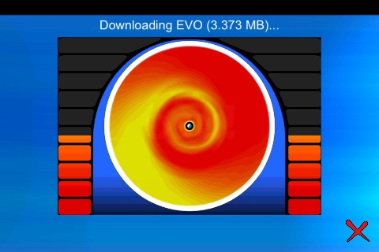

# osu! 2009 大事记

## 一月

[nuudles](https://osu.ppy.sh/users/21312) 将 osu! 移植到了 iPhone 上。该项目曾经拥有自己的[子论坛](https://osu.ppy.sh/community/forums/47)，现已存档。[^iphone]

osu! 官网上的 FAQ 板块支持翻译了。归功于志愿者的贡献，FAQ 版块可以用多种语言访问。[^faq-localisation]

在 1 月 26 日的一次大更新中，又有许多功能被添加到 osu! 中。[^stable-b593a] 这些功能包括：新的多人游戏模式 [Tag VS](/wiki/Client/Interface/Multiplayer#team-vs) 与 [Tag Team VS](/wiki/Client/Interface/Multiplayer#tag-co-op-/-tag-team-vs)，以及多人游戏房间的密码保护。故事板编辑器中的对象支持了两种全新的修改方式：矢量缩放与翻转。游玩时，打击高亮效果将会以将颜色泼洒在屏幕上的方式来强调每次点击。此外，歌曲进度也能以饼状图的形式显示。[选歌界面](/wiki/Client/Interface#选歌界面)中也新增了“最近游玩”排序方式。

## 二月

2 月 14 日，第四次 osu! 社区会议召开，讨论了有关摸图方式的话题、一个即将推出的本地化功能，以及有关扩大 osu! 团队的一些问题。[^community-meeting-4]

为了缓解在[谱面上架流程](/wiki/Beatmap_ranking_procedure)过程中的[摸图](/wiki/Modding)压力，[Kudosu](/wiki/Modding/Kudosu) 系统被加入。对于提出与谱面相关的建设性批评的人们，谱师可以给他们发放一种叫做 Kudosu 的点数。三个 Kudosu 可以兑换为一颗 Kudosu 星，而 Kudosu 星可以用于提升该谱面在[谱面审核团队 (BAT)](/wiki/People/Beatmap_Appreciation_Team) 的摸图队列中的优先级。[^kudosu-1]

## 三月

本月中的三次更新给 osu! 带来了不少改变。第一次更新在多人游戏大厅中加入筛选器，同时添加了自动过滤冒犯性语言的聊天选项。启用该选项后，聊天消息中的屏蔽词会被替换成预定义列表中的词语。[^stable-b622]

在 3 月 21 日发布的第二次更新中，加入了 [Kiai 时间](/wiki/Gameplay/Kiai_time)，使谱师们能够使用星星喷泉特效来强调歌曲中的重要部分。[^stable-b631]

在 3 月 26 日，osu! 中添加了对于 TaTaCon Wii Taiko 控制器的支持，以及对接水果模式中 Wiimote 游戏/菜单控制的支持。[^stable-b639][^custom-changelog]

## 四月

总注册玩家数超过了 10 万。[^user-count]

## 五月

在 Kudosu 系统中的一项更改使得用户可以将 Kudosu 星送给任何一张谱面，而不是像之前那样只能送给自己制作的谱面。[^kudosu-change]

在这个月的其他一些更新中，osu! 添加了宽屏支持和 [Autopilot](/wiki/Gameplay/Game_modifier/Autopilot) 模组。这个模组将会控制光标移动，而玩家只需要控制击打就行了。[^stable-b674]

## 六月

由于[谱面提交系统](/wiki/Beatmapping/Beatmap_submission)中的一项改变，谱师现在无法在谱面被摸之后对其进行再次更改。曾经出现过谱面包含违反[谱面上架标准](/wiki/Ranking_criteria)的内容的更改，而 BAT 成员在不知道的情况下，就将其上架的事件。[^bss-update]

到目前为止，osu! 仅提供英文版本。随着新的本地化系统的引入，用户可以翻译游戏客户端。他们可以下载包含游戏文本的文件，将其翻译成自己的语言，然后请求将文件集成到游戏客户端中。[^client-localisation][^stable-b695]

## 七月

自 7 月 14 日起，osu! News 可以作为 [RSS 源](https://zh.wikipedia.org/wiki/RSS)被订阅。[^rss-news]

这个月的两次更新为鼠标灵敏度较低的用户带来了新的鼠标精度切换选项；为了简化[故事板的制作](/wiki/Storyboard/Scripting)，还加入了新的故事板命令参数和快捷方式。

服务器数据库添加了一块额外的 32 GB SSD，从而为未来的存储量增长做好准备。[^server-upgrade]

在三月份进行了首次 Taiko 模式的在线排名测试后，现在可以在 osu! 网站上按模式查看排名统计数据。[^per-mode-ranking][^stable-b622] 在此之前，只有 [osu! 模式](/wiki/Game_mode/osu!) 有在线排名。[^stable-b753c][^stable-b709]

## 八月

Twitter 账号 [@osustatus](https://twitter.com/osustatus) 被创建，用于通知玩家有关 [Bancho](/wiki/Bancho_(server)) 服务器和网站的问题。[^osustatus]

在 8 月 12 日的更新中，osu! 为循环故事板对象新增了 `LoopType` 参数，并为太鼓游戏模式新增了 [Relax](/wiki/Gameplay/Game_modifier/Relax) 模组。此外，还发布了 [AiMod](/wiki/Client/Beatmap_editor/AiMod) 的预发布版本，该工具可以被用于检测谱面问题。[^stable-b825]

## 九月

本月的更新集成了新功能，其中包括歌曲选择界面的宽屏支持，[^stable-b904a] 网站上的好友功能等等。[^custom-changelog] 太鼓模式吉祥物 [pippidon](/wiki/Mascots#pippi) 现在会在游玩时显示在屏幕的左上角。[^stable-b898]

截至 9 月 6 日，所有 [太鼓分数已重置](https://osu.ppy.sh/community/forums/topics/17118?n=1)，以便使用改进的评分算法。

## 十月

新增了一个排名信息界面，为后来排名图表系统的实现奠定了基础。[^stable-b1077][^custom-changelog]

由 [Larto](https://osu.ppy.sh/users/12328) 提交的 [Imogen Heap - Sweet Religion](https://osu.ppy.sh/beatmapsets/10000#osu/97517) 成为了 osu! 中的第 10000 张谱面。[^beatmap-10k]

自 10 月 25 日起，除了 2009 年 7 月开始提供的 osu! 新闻外，[更新日志](/wiki/Changelog) 也通过 RSS 源提供。[^rss-changelog]

## 十一月

10 月 18 日发布的 osu! 更新中带来了几个新功能：用户现在可以对[回放](/wiki/Gameplay/Replay)添加评论。[^custom-changelog]现在可以通过按下 `Shift` + `F12`，自动截图并将图片上传到 osu! 服务器。[^stable-b1118]

本月达成了两个里程碑：已进榜成绩数量于 11 月 15 日达到了 5000 万个；注册用户数量于 11 月 20 日达到了 20 万人。[^play-count][^user-count-2]

## 十二月

本月，[谱面协助团队 (MAT)](/wiki/People/Mapping_Assistance_Team) 成立。MAT 团队负责挑选质量合格的[待定](/wiki/Beatmap/Category#wip-and-pending)谱面并推荐它们，使得这些谱面能够在[论坛摸图](/wiki/Modding/Forum_modding)系统中被 [BAT](/wiki/People/Beatmap_Appreciation_Team) 提名上架。[^mat]

osu! 的一次更新为接水果模式引入了[红果跳](/wiki/Gameplay/Hyperdash)，使得玩家能够接住那些之前不可能接住的跳——玩家在接住[红果](/wiki/Gameplay/Hit_object/Hyperfruit)后会获得短暂加速。此外，[扩展聊天面板](/wiki/Client/Interface/Chat_console#扩展聊天面板)添加了显示在线用户列表预览的支持。[^stable-b1209]

新增了 [Community Voice](https://osu.ppy.sh/community/forums/65) 论坛，旨在向社区提出各种问题，用户可以在每周投票活动中进行投票。[^weekly-polls]

## 引用

[^iphone]: [peppy 的论坛帖子 (2009-01-21) "osu! iPhone 移植版开始公测"](https://osu.ppy.sh/community/forums/topics/9193?n=1)
[^faq-localisation]: [peppy 的论坛帖子 (2009-01-11) "快来翻译 FAQ"](https://osu.ppy.sh/community/forums/topics/8905?n=1)
[^stable-b593a]: [peppy 的论坛帖子 (2009-01-26) "osu! 公开发行版本 b593a 发布"](https://osu.ppy.sh/community/forums/topics/9344?n=1)

[^community-meeting-4]: [Sinistro 的论坛帖子 (2009-02-09) "osu! 社区会议 #4 圆满结束"](https://osu.ppy.sh/community/forums/topics/9784?n=1)
[^kudosu-1]: [peppy 的论坛帖子 (2009-02-21) "Kudosu 系统"](https://osu.ppy.sh/community/forums/topics/10245?n=1)

[^stable-b622]: [peppy 的论坛帖子 (2009-03-09) "osu! 公开发行版本 b622 发布"](https://osu.ppy.sh/community/forums/topics/10822?n=1)
[^stable-b631]: [peppy 的论坛帖子 (2009-03-21) "osu! 公开发行版本 b631 发布"](https://osu.ppy.sh/community/forums/topics/11247?n=1)
[^stable-b639]: [peppy 的论坛帖子 (2009-03-26) "osu! 公开发行版本 b639 发布"](https://osu.ppy.sh/community/forums/topics/11440?n=1)
[^custom-changelog]: [由 pishifat 整理的从 2008 年 8 月到 2017 年 5 月的所有更新日志](https://github.com/ppy/osu-web/files/4915516/changelog.pdf)

[^user-count]: [Sinistro 的论坛帖子 (2009-04-24) "用户数已破 100,000。"](https://osu.ppy.sh/community/forums/topics/12446?n=1)

[^kudosu-change]: [peppy 的论坛帖子 (2009-05-07) "Kudosu 系统变更"](https://osu.ppy.sh/community/forums/topics/12842?n=1)
[^stable-b674]: [peppy 的论坛帖子 (2009-05-10) "osu! 公开发行版本 b674 发布"](https://osu.ppy.sh/community/forums/topics/12925?n=1)

[^bss-update]: [peppy 的论坛帖子 (2009-06-18) "BSS 提交变更"](https://osu.ppy.sh/community/forums/topics/14127?n=1)
[^client-localisation]: [peppy 的论坛帖子 (2009-06-27) "osu! 本地化"](https://osu.ppy.sh/community/forums/topics/14502?n=1)
[^stable-b695]: [peppy 的论坛帖子 (2009-06-28) "osu! 公开发行版本 b695 发布"](https://osu.ppy.sh/community/forums/topics/14543?n=1)

[^rss-news]: [peppy 的论坛帖子 (2009-07-14) "通过 RSS 提供的 osu! 新闻"](https://osu.ppy.sh/community/forums/topics/15153?n=1)
[^server-upgrade]: [peppy 的论坛帖子 (2009-07-29) "osu! 服务器升级 [完成]"](https://osu.ppy.sh/community/forums/topics/15649?n=1)
[^stable-b753c]: [peppy 的论坛帖子 (2009-07-26) "osu! 公开发行版本 b753c 发布"](https://osu.ppy.sh/community/forums/topics/15565?n=1)
[^stable-b709]: [peppy 的论坛帖子 (2009-07-12) "osu! 公开发行版本 b709 发布"](https://osu.ppy.sh/community/forums/topics/15090?n=1)
[^per-mode-ranking]: [peppy 的论坛帖子 (2009-07-20) "关于按模式的排名"](https://osu.ppy.sh/community/forums/topics/15366?n=1)

[^osustatus]: [peppy 的论坛帖子 (2009-08-11) "在 Twitter 上关注 osu! 的状态"](https://osu.ppy.sh/community/forums/topics/17399?n=1)
[^stable-b825]: [peppy 的论坛帖子 (2009-08-12) "osu! 公开发行版本 b825 发布"](https://osu.ppy.sh/community/forums/topics/16212?n=1)

[^stable-b904a]: [peppy 的论坛帖子 (2009-09-07) "osu! 版本 b904(a) 发布"](https://osu.ppy.sh/community/forums/topics/17231?n=1)
[^stable-b898]: [peppy 的论坛帖子 (2009-09-04) "osu! 公开发行版本 b898 发布"](https://osu.ppy.sh/community/forums/topics/17075?n=1)

[^stable-b1077]: [peppy 的论坛帖子 (2009-10-25) "osu! 公开发行版本 b1077 发布"](https://osu.ppy.sh/community/forums/topics/19115?n=1)
[^beatmap-10k]: [Sinistro 的论坛帖子 (2009-10-19) "谱库中已有 10,000 张谱面！"](https://osu.ppy.sh/community/forums/topics/18922?n=1)
[^rss-changelog]: [peppy 的论坛帖子 (2009-10-25) "通过 RSS 提供的更新日志"](https://osu.ppy.sh/community/forums/topics/19137?n=1)

[^stable-b1118]: [peppy 的论坛帖子 (2009-11-18) "osu! 公开发行版本 b1118 发布"](https://osu.ppy.sh/community/forums/topics/19464?n=1)
[^user-count-2]: [Sinistro 的论坛帖子 (2009-11-20) "osu! 解锁了成就：“200,000 用户”！"](https://osu.ppy.sh/community/forums/topics/20268?n=1)
[^play-count]: [awp 的论坛帖子 (2009-11-15) "5000 万个进榜成绩！"](https://osu.ppy.sh/community/forums/topics/20050?n=1)

[^mat]: [Pasonia 的论坛帖子 (2009-12-27) "谱面协助团队介绍！"](https://osu.ppy.sh/community/forums/topics/21856?n=1)
[^stable-b1209]: [peppy 的论坛帖子 (2009-12-20) "osu! 公开发行版本 b1209 发布"](https://osu.ppy.sh/community/forums/topics/21511?n=1)
[^weekly-polls]: [peppy 的论坛帖子 (2009-12-08) "每周投票介绍"](https://osu.ppy.sh/community/forums/topics/20976?n=1)
