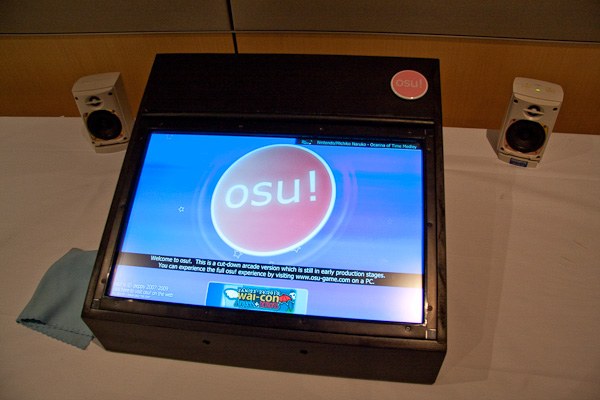

# Geschichte von osu! 2010

## Januar

Auf der Anime-Convention [Wai-con](https://en.wikipedia.org/wiki/Wai-Con) in Perth gab es osu!arcade, ein in sich geschlossener Spielautomat auf dem eine Touch-Version von osu! lief. Manche Spieler kritisierten zwar, dass man wunde Finger bekam, wenn man zu lang darauf spielte, aber ansonsten kam der Prototyp mit speziell angefertigter Hardware und eingebautem Touchscreen bei der Community gut an.[^wai-con]

## März

Von Februar bis März organisierte [peppy](https://osu.ppy.sh/users/2) einen Kunstwettbewerb, der den Bannern für Herausforderungen im Spiel gewidmet war. Als Preis wurde das Kunstwerk offiziell anerkannt und man erhielt ein Jahr [osu!supporter](/wiki/osu!supporter) oder physische Produkte. Nach einer [Abstimmung der Community](https://osu.ppy.sh/community/forums/topics/27112?n=1) traf das osu!-Team die endgültige Entscheidung.[^art-challenge]

Am 8. März sorgte ein osu!-Update für erhebliche Leistungs- und Audio-Verbesserungen im Spiel.[^stable-b1485]

## April

Aufgrund von Änderungen der Infrastruktur wurde der [IRC](https://de.wikipedia.org/wiki/Internet_Relay_Chat)-Server auf die Adresse `irc.ppy.sh` verschoben.[^irc]

In diesem Monat führte peppy in einem osu!-Update einen neuen Algorithmus zur Berechnung der Schwierigkeit ein, genannt Sternebewertung.[^stable-b1596]

## August

Am 2. August wurde allen Nutzern eine einmalige Änderung ihres Nutzernamen gewährt. Um diese zu verwenden, musste man mindestens einmal ein osu!supporter-Tag bessessen haben, entweder durch einen Kauf oder als Geschenk.[^name-change]

Der Chatbefehl [`!report`](/wiki/BanchoBot#report) wurde zu [Bancho](/wiki/BanchoBot) hinzugefügt, wodurch Spieler in der Lagen waren, Moderatoren über Fehlverhalten im Chat zu informieren.[^bancho-report]

[nardii](https://osu.ppy.sh/users/1017) gab peppy Zugriff auf sein [Twitter](https://twitter.com)-Konto [@osugame](https://twitter.com/osugame), welches seither für allgemeine Neuigkeiten bezüglich osu! genutzt wurde.[^twitter-osugame]

## September

Am 2. September erhielt osu! mehrere Updates in Bezug auf Mapping, unter anderem:[^stable-b1650]

- Die [SB-Load](/wiki/Client/Beatmap_editor/SB_load)-Anzeige, die die Effizienz des Zeichnens des Storyboards und der Hintergrundelemente widerspiegelt.
- Um die Geschwindkeit der [Approach-Circles](/wiki/Gameplay/Hit_object/Approach_circle) unabhängig von der [allgemeinen Schwierigkeit](/wiki/Beatmap/Overall_difficulty) konfigurieren zu können, wurde die [Approach-Rate](/wiki/Beatmap/Approach_rate) eingeführt.
- Benutzerdefinierte Multiplikatoren der [Slidergeschwindigkeit](/wiki/Gameplay/Hit_object/Slider/Slider_velocity) von 0,5x bis 2x.

60 [Schwierigkeitsgrade](/wiki/Beatmap/Difficulty) waren von einem Bug in Taiko[^taiko-name] betroffen durch den Drumrolls nicht richtig angezeigt wurden, weswegen alle Scores auf diesen gelöscht wurden.[^taiko-reset]

## Oktober

Mitglieder des [Mapping Assistance Teams](/wiki/People/Mapping_Assistance_Team) (MAT) konnten Beatmaps, deren Qualität sie als gut erachteten, nun mit einer [Blase](/wiki/Modding/Bubble) versehen.[^mat-bubble]

Die Mod [Flashlight](/wiki/Gameplay/Game_modifier/Flashlight) wurde für einen Tag unranked, da sich Spieler einen unfairen Vorteil verschaffen konnten.[^flashlight-1][^flashlight-2]

## November

Ein osu!-Update fügte neue Sprites für den Modus Taiko[^taiko-name] hinzu.[^stable-b1696]

Vom 20. bis zum 28. November wurde die Flashlight-Mod in Online-Ranglisten nach intensiver Diskussion erneut deaktiviert, da Spieler nach wie vor in der Lage waren, mit der Mod zu schummeln.[^flashlight-3][^flashlight-4]

## Anmerkungen und Referenzen

[^taiko-name]: Der [Spielmodus](/wiki/Game_mode) [osu!taiko](/wiki/Game_mode/osu!taiko) hieß zur damaligen Zeit Taiko.

[^wai-con]: [Forumsbeitrag von peppy (27.01.2010) "osu!arcade at Wai-con 2010"](https://osu.ppy.sh/community/forums/topics/23392?n=1)

[^art-challenge]: [Forumsbeitrag von peppy (12.02.2010) "Competition: Designing challenge artwork!"](https://osu.ppy.sh/community/forums/topics/24356?n=1)

[^stable-b1485]: [Forumsbeitrag von peppy (08.03.2010) "osu! Public Release b1485"](https://osu.ppy.sh/community/forums/topics/25978?n=1)

[^irc]: [Forumsbeitrag von peppy (02.04.2010) "osu! Public Release b1553 / new Bancho server"](https://osu.ppy.sh/community/forums/topics/27635?n=1)
[^stable-b1596]: [Forumsbeitrag von peppy (21.04.2010) "osu! Public Release b1596"](https://osu.ppy.sh/community/forums/topics/28863?n=1)

[^name-change]: [Forumsbeitrag von peppy (02.08.2010) "Changing Usernames"](https://osu.ppy.sh/community/forums/topics/34694?n=1)
[^bancho-report]: [Forumsbeitrag von peppy (05.08.2010) "Bancho !report command"](https://osu.ppy.sh/community/forums/topics/34843?n=1)
[^twitter-osugame]: [Forumsbeitrag von peppy (21.08.2010)](https://osu.ppy.sh/community/forums/topics/17399?n=10)

[^stable-b1650]: [Forumsbeitrag von peppy (02.09.2010) "osu! Public Release b1650"](https://osu.ppy.sh/community/forums/topics/36635?n=1)
[^taiko-reset]: [Forumsbeitrag von peppy (22.09.2010) "Taiko score reset (60 difficulties)"](https://osu.ppy.sh/community/forums/topics/37672?n=1)

[^mat-bubble]: [Forumsbeitrag von peppy (04.10.2010) "MAT members can now bubble beatmaps"](https://osu.ppy.sh/community/forums/topics/38405?n=1)
[^flashlight-1]: [Forumsbeitrag von peppy (09.10.2010) "Flashlight mod temporarily disabled"](https://osu.ppy.sh/community/forums/topics/38692?n=1)
[^flashlight-2]: [Forumsbeitrag von peppy (10.10.2010) "osu! Public Release b1673 (with flashlight)"](https://osu.ppy.sh/community/forums/topics/38760?n=1)

[^stable-b1696]: [Forumsbeitrag von peppy (25.11.2010) "osu! Public Release b1696"](https://osu.ppy.sh/community/forums/topics/41318?n=1)
[^flashlight-3]: [Forumsbeitrag von peppy (20.11.2010) "Flashlight mod disabled #2"](https://osu.ppy.sh/community/forums/topics/41039?n=1)
[^flashlight-4]: [Forumsbeitrag von peppy (28.11.2010) "Flashlight is back!"](https://osu.ppy.sh/community/forums/topics/41519?n=1)
