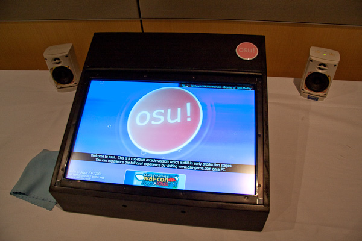

# L'histoire d'osu! en 2010

## Janvier

La convention d'anime [Wai-con](https://en.wikipedia.org/wiki/Wai-Con) de Perth a présenté osu!arcade, une machine d'arcade entièrement autonome fonctionnant avec une version tactile d'osu!. Bien que certains aient critiqué le fait que l'on puisse trop jouer dessus et se faire mal aux doigts, le prototype contenant du matériel fait sur mesure et un écran tactile intégré a été bien accueilli par la communauté[^wai-con].

## Mars

De février à mars, [peppy](https://osu.ppy.sh/users/2) a organisé un concours d'art dédié aux bannières pour les défis en jeu, le prix étant la reconnaissance officielle de l'art et une année de [osu!supporter](/wiki/osu!supporter) ou des biens physiques. Après un [vote de la communauté](https://osu.ppy.sh/community/forums/topics/27112?n=1), l'équipe d'osu! a fait le choix final.[^art-challenge]

Le 8 mars, une mise à jour d'osu! a apporté des améliorations considérables aux performances et à l'audio du jeu[^stable-b1485].

## Avril

En raison de changements d'infrastructure, le serveur [IRC](https://fr.wikipedia.org/wiki/Internet_Relay_Chat) a été déplacé à l'adresse `irc.ppy.sh`.[^irc]

Ce mois-ci, peppy a introduit un nouvel algorithme de classement par étoiles dans une mise à jour d'osu![^stable-b1596].

## Août

Le 2 août, tous les utilisateurs ont pu changer de nom d'utilisateur. Pour changer de nom d'utilisateur, ils devaient avoir reçu au moins une fois un tag osu!supporter, soit en l'achetant, soit en l'offrant en cadeau.[^changement-nom]

La commande de tchat [`!report`](/wiki/BanchoBot#report) a été ajoutée à [Bancho](/wiki/BanchoBot), ce qui permet aux gens d'informer les modérateurs du tchat sur les utilisateurs qui se comportent mal dans le tchat.[^bancho-report]

[nardii](https://osu.ppy.sh/users/1017) a donné à peppy l'accès à son compte [Twitter](https://twitter.com) [@osugame](https://twitter.com/osugame) qui a été utilisé pour les nouvelles générales d'osu! à partir de ce moment-là.[^twitter-osugame]

## Septembre

Le 2 septembre, osu! a reçu plusieurs mises à jour concernant le mapping, dont :[^stable-b1650]

- L'indicateur [SB load](/wiki/Client/Beatmap_editor/SB_load), qui reflète l'efficacité du dessin des éléments du storyboard et de l'arrière-plan.
- L'introduction de [l'approach rate](/wiki/Beatmap/Approach_rate) pour configurer la vitesse des [approach circles](/wiki/Gameplay/Hit_object/Approach_circle) indépendamment de [l'overall difficulty](/wiki/Beatmap/Overall_difficulty).
- Multiplicateurs de la [vitesse du curseur](/wiki/Gameplay/Hit_object/Slider/Slider_velocity) personnalisés allant de 0,5x à 2x.

60 [difficultés](/wiki/Beatmap/Difficulty) ont été affectées par un bug Taiko[^taiko-name] causant un affichage incorrect des drum rolls et donc, tous les scores sur ces difficultés ont été supprimés.[^taiko-reset]

## Octobre

Les membres de la [Mapping Assistance Team](/wiki/People/Mapping_Assistance_Team) (MAT) ont obtenu la possibilité de [buller](/wiki/Modding/Bubble) les beatmaps jugées de bonne qualité.[^mat-bubble]

Le mod [Flashlight](/wiki/Gameplay/Game_modifier/Flashlight) est devenu non classé pendant une journée jusqu'à ce qu'un correctif soit publié, car les joueurs étaient en mesure d'obtenir un avantage injuste.[^flashlight-1][^flashlight-2]

## Novembre

Une mise à jour d'osu! a ajouté de nouveaux sprites pour le mode Taiko.[^taiko-name][^stable-b1696].

Du 20 novembre au 28 novembre, le mod Flashlight a de nouveau été désactivé dans les classements en ligne après de vives discussions, les joueurs ayant toujours la possibilité de tricher avec le mod[^flashlight-3][^flashlight-4].

## Notes et références

[^taiko-name]: À l'époque, le [mode de jeu](/wiki/Game_mode) [osu!taiko](/wiki/Game_mode/osu!taiko) s'appelait Taiko.

[^wai-con]: [Fil de discussion par peppy (27/01/2010) "osu!arcade at Wai-con 2010"](https://osu.ppy.sh/community/forums/topics/23392?n=1)

[^art-challenge]: [Fil de discussion par peppy (12/02/2010) "Competition: Designing challenge artwork!"](https://osu.ppy.sh/community/forums/topics/24356?n=1)

[^stable-b1485]: [Fil de discussion par peppy (08/03/2010) "osu! Public Release b1485"](https://osu.ppy.sh/community/forums/topics/25978?n=1)

[^irc]: [Fil de discussion par peppy (02/04/2010) "osu! Public Release b1553 / new Bancho server"](https://osu.ppy.sh/community/forums/topics/27635?n=1)
[^stable-b1596]: [Fil de discussion par peppy (21/04/2010) "osu! Public Release b1596"](https://osu.ppy.sh/community/forums/topics/28863?n=1)

[^changement-nom]: [Fil de discussion par peppy (02/08/2010) "Changing Usernames"](https://osu.ppy.sh/community/forums/topics/34694?n=1)
[^bancho-report]: [Fil de discussion par peppy (05/08/2010) "Bancho !report command"](https://osu.ppy.sh/community/forums/topics/34843?n=1)
[^twitter-osugame]: [Forum post by peppy (21/08/2010)](https://osu.ppy.sh/community/forums/topics/17399?n=10)

[^stable-b1650]: [Fil de discussion par peppy (02/09/2010) "osu! Public Release b1650"](https://osu.ppy.sh/community/forums/topics/36635?n=1)
[^taiko-reset]: [Fil de discussion par peppy (22/09/2010) "Taiko score reset (60 difficulties)"](https://osu.ppy.sh/community/forums/topics/37672?n=1)

[^mat-bubble]: [Fil de discussion par peppy (04/10/2010) "MAT members can now bubble beatmaps"](https://osu.ppy.sh/community/forums/topics/38405?n=1)
[^flashlight-1]: [Fil de discussion par peppy (09/10/2010) "Flashlight mod temporarily disabled"](https://osu.ppy.sh/community/forums/topics/38692?n=1)
[^flashlight-2]: [Fil de discussion par peppy (10/10/2010) "osu! Public Release b1673 (with flashlight)"](https://osu.ppy.sh/community/forums/topics/38760?n=1)

[^stable-b1696]: [Fil de discussion par peppy (25/11/2010) "osu! Public Release b1696"](https://osu.ppy.sh/community/forums/topics/41318?n=1)
[^flashlight-3]: [Fil de discussion par peppy (20/11/2010) "Flashlight mod disabled #2"](https://osu.ppy.sh/community/forums/topics/41039?n=1)
[^flashlight-4]: [Fil de discussion par peppy (28/11/2010) "Flashlight is back!"](https://osu.ppy.sh/community/forums/topics/41519?n=1)
