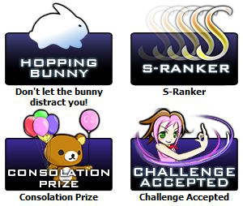

# Historia de osu! de 2012

## Marzo

Se probó una nueva función que añadía un chat web [IRC](https://es.wikipedia.org/wiki/Internet_Relay_Chat) integrado al sitio web de osu!.[^web-chat]

## Abril

::{ flag=AU }:: [peppy](https://osu.ppy.sh/users/2) organizó un concurso de arte de los gráficos de los logros, en el que los usuarios debían diseñar iconos para varios títulos independientes y paquetes de beatmaps. Los usuarios cuyos gráficos fueron elegidos por peppy recibieron 3 meses de [osu!supporter](/wiki/osu!supporter) como premio.[^achievements]

## Mayo

Se añadió una [lista de transmisiones en vivo](https://osu.ppy.sh/community/livestreams) a la página web de osu!, la cual mostraría a los usuarios que estuvieran transmitiendo osu! en [Twitch](https://es.wikipedia.org/wiki/Twitch) en ese momento.[^live-stream-listing]

## Agosto

osu! recibió una actualización que incluía una versión del [grado](/wiki/Gameplay/Grado) SS para el mod [Sudden Death](/wiki/Gameplay/Game_modifier/Sudden_death) y filtros de modos de juego para la lista de usuarios, entre otras cosas.[^stable-b0813]

Del 11 de junio al 1 de julio, los participantes en el [osu! 2012 T-shirt Design Contest](https://osu.ppy.sh/community/forums/topics/86971?n=1) tuvieron que crear ilustraciones para las camisetas que se vendían en la osu!store. Después del concurso, se organizó una votación pública para decidir a los ganadores. ::{ flag=CN }:: [Ballance](https://osu.ppy.sh/users/165946) ganó el 1er lugar con 324 votos. Entre los premios para los finalistas figuraban una camiseta con la ilustración del usuario impresa en ella, un regalo de 20 $ para gastar libremente en cualquier mercancía disponible y diversas cantidades de osu!supporter.[^shirt-voting][^shirt-winner]

## Septiembre

::: Infobox

:::

osu! y su comunidad celebraron el 5º cumpleaños de osu! el 17 de septiembre de 2012. Durante este tiempo, se otorgaron etiquetas de [osu!supporter](/wiki/osu!supporter) a todos los jugadores durante 24 horas, empezando el 16 de septiembre de 2012 (18:00 UTC), que fue la hora de lanzamiento original de osu! en 2007. peppy tenía la intención de distribuir una versión antigua de osu! de una forma u otra para la celebración, de modo que los jugadores pudieran experimentar osu! desde una época más antigua, donde estaban las raíces del programa. Sin embargo, debido a las diferentes versiones de los archivos `.dll`, peppy no pudo hacerla funcionar. La publicó finalmente unos meses después, en [abril de 2013](/wiki/History_of_osu!/2013#april).[^five-years]

## Octubre

El 8 de octubre, el juego de ritmo de desplazamiento vertical (VSRG) conocido como [osu!mania](/wiki/Game_mode/osu!mania) e implementado por ::{ flag=CN }:: [woc2006](https://osu.ppy.sh/users/1105845) se hizo público.[^stable-b1008] La comunidad expresó diversas opiniones sobre el nuevo modo de juego. Algunos jugadores alabaron el esfuerzo realizado, mientras que otros criticaron la puntuación de los [juicios](/wiki/Gameplay/Judgement/osu!mania) por ser demasiada estricta en comparación con O2JAM, un juego de ritmo con una mecánica de juego similar. Para algunos jugadores, la actualización fue demasiado precipitada, ya que la clasificación, el envío de beatmaps de osu!mania, la modificación de la dificultad y la jugabilidad no se habían pulido o completado lo suficiente. Algunos jugadores tuvieron problemas para actualizar su cliente de osu! debido al enorme tamaño de la actualización (unos 20 MB). La mayoría de estos problemas se habían resuelto en noviembre con una gran respuesta de la comunidad. Sin embargo, muchos usuarios querían probar el nuevo modo de juego.

::: Infobox

:::

Para los jugadores que entraban al modo [multijugador](/wiki/Client/Interface/Multiplayer) antes de actualizar a la versión b20121008, había un error que causaba una cómica aparición de osu!mania con el nombre de «3» sin el icono del modo de juego. Los jugadores no podían jugar sin aplicar la actualización.

::: Infobox

:::

Además del nuevo modo de juego, en la actualización se había implementado lo siguiente:

- Se añadieron hitsounds por objeto en el editor, gracias a ::{ flag=CA }:: [mm201](https://osu.ppy.sh/users/30655).
- Los jugadores podrían recuperarse de fallar un beatmap en [multijugador](/wiki/Client/Interface/Multiplayer) al alcanzar el total de HP (esto no ocurriría si estaba activado el mod [Sudden Death](/wiki/Gameplay/Game_modifier/Sudden_Death) o [Perfect](/wiki/Gameplay/Game_modifier/Perfect)).
- Se añadió soporte de desplazamiento a la lista de clasificación en línea del juego.
- Se mejoró la [selección de skins](/wiki/Client/Options#skin) para que la vista previa se reproduzca de forma más realista.

::{ flag=FR }:: [Kurai](https://osu.ppy.sh/users/77089) ayudó a crear la nueva osu!store para ofrecer los diseños presentados en el [concurso de diseño de camisetas](https://osu.ppy.sh/community/forums/topics/94466?n=1) en camisetas de alta calidad, con el objetivo final de ampliar la gama de productos a otros artículos como pegatinas.[^osu-market]

::: Infobox

:::

La actualización de osu! del 29 de octubre incluía un cambio en el menú principal, que permitía a los jugadores con osu!supporter personalizar la imagen de fondo. La jugabilidad no se vio afectada en absoluto por esta alteración puramente visual. osu!mania recibió su propio sistema de clasificación, el cual era muy esperado por la comunidad. Para garantizar que ninguna puntuación tramposa se colara en la clasificación, hubo una fase de pruebas hasta noviembre en la que la tabla de clasificación se restableció varias veces.[^stable-b1029][^stable-b0904]

Además, al ver las repeticiones (o como espectadores) en el modo de juego osu!, los usuarios podrían ver qué botones había presionado el jugador en la superposición del estado de los botones. Esta superposición también puede activarse en el modo de un jugador mediante la opción `Mostrar botones en pantalla` del menú de [opciones](/wiki/Client/Options#general.1). Al principio se colocó en la parte superior de la pantalla, pero luego se trasladó a la derecha para que no obstruyera con la barra de HP ni afectara a la atención del jugador.

Por último, se resolvieron algunos problemas de rendimiento a largo plazo que provocaban congelaciones ocasionales en el juego.

## Noviembre

El sistema de clasificación de osu!mania había finalizado y todas las puntuaciones se restablecieron por última vez el 13 de noviembre.[^mania-ranking]

En la actualización del 22 de noviembre, se añadieron a osu! las localizaciones proporcionadas por colaboradores voluntarios en el [osu! localisation project v2](https://osu.ppy.sh/community/forums/topics/104342), por lo que el juego estaría disponible en varios idiomas. Además, se añadió un botón de `Quick Join` en el modo multijugador, que permitiría a los jugadores unirse aleatoriamente a una sala.[^stable-b1122]

[Google Translate](https://es.wikipedia.org/wiki/Traductor_de_Google) se añadió al sitio web de osu! el 8 de noviembre como una función opcional, en la que los usuarios podían elegir un idioma y el sitio web se traduciría automáticamente.[^website-translation]

Se añadió una nueva sección a la página de capturas de pantalla en la que se mostraría una selección de imágenes populares que se subieron al presionar `Mayús` + `F12` en el juego.[^week-in-osu-2]

## Diciembre

El 21 de diciembre, osu! recibió nuevas funciones y cambios, entre los que destacaron:

1. Soporte para pantallas panorámicas.
2. Una pantalla de carga al entrar a un beatmap.
3. Los ajustes de `Fun Spoiler` se reemplazaron por el nuevo menú de la [configuración visual](/wiki/Client/Interface/Visual_settings), que se colocó en la parte inferior de la pantalla.
4. El mod [No Video](/wiki/Gameplay/Game_modifier/No_video) se movió al menú de la configuración visual.

El soporte para pantallas panorámicas, a pesar de ser funcional, hacía que algunas imágenes y vídeos se vieran raros (no se veía la cabeza de un personaje y faltaba texto o estaba parcialmente oculto) porque la parte superior e inferior estaban recortadas. Los [storyboards](/wiki/Storyboard) no eran compatibles con las pantallas panorámicas en aquella época, sino que aparecían cuadros o barras negras a los lados que hacían que parecieran estrechas. Esto creaba un problema en Catch the Beat[^catch], ya que las frutas pasaban *por encima* de las barras negras, que se suponía que estaban en el límite cuando se usaba una pantalla panorámica. Algunos storyboards tampoco funcionaban correctamente (algunas imágenes no permanecían en el área de juego, sino que se extendían hasta las barras negras).[^stable-b1221]

Después de pasar un beatmap una vez, los usuarios podrían atenuar el fondo al 100 % a través del nuevo menú de la configuración visual.[^week-in-osu-6]

El 25 de diciembre se publicó una nueva versión de [Bancho](/wiki/Bancho_(server)) que reducía la cantidad de tráfico de red al conectarse al servidor. Al tratarse de una ocasión especial, osu!direct estuvo disponible para todo el mundo durante ese día.[^stable-b1225]

## Referencias

[^web-chat]: [Hilo del foro por peppy (19/3/2012) «New web-chat testing»](https://osu.ppy.sh/community/forums/topics/77845?n=1)

[^achievements]: [Hilo del foro por peppy (12/4/2012) «Achievement Graphics»](https://osu.ppy.sh/community/forums/topics/80448?n=1)

[^live-stream-listing]: [Hilo del foro por peppy (23/5/2012) «Live Streams listing»](https://osu.ppy.sh/community/forums/topics/84890?n=1)

[^shirt-voting]: [Hilo del foro por ppy (17/7/2012) «osu! 2012 clothing design contest VOTING!»](https://osu.ppy.sh/community/forums/topics/91083?n=1)
[^shirt-winner]: [Hilo del foro por Derekku (14/8/2012) «osu! 2012 Clothing Design Contest Winners!»](https://osu.ppy.sh/community/forums/topics/94466?n=1)

[^stable-b0813]: [Hilo del foro por peppy (13/8/2012) «osu! Release (b20120813-14)»](https://osu.ppy.sh/community/forums/topics/94319?n=1)

[^five-years]: [Hilo del foro por peppy (16/9/2012) «Five Years of osu!»](https://osu.ppy.sh/community/forums/topics/98349)
[^stable-b0904]: [Hilo del foro por peppy (4/9/2012) «osu! Release (20120904/05)»](https://osu.ppy.sh/community/forums/topics/96949?n=1)

[^stable-b1008]: [Hilo del foro por peppy (8/10/2012) «osu! release (b20121008): osu!mania»](https://osu.ppy.sh/community/forums/posts/1825880)
[^osu-market]: [Hilo del foro por peppy (20/10/2012) «osu! market is open for business!»](https://osu.ppy.sh/community/forums/topics/102283?n=1)
[^stable-b1029]: [Hilo del foro por peppy (29/10/2012) «osu! Release (b20121029)»](https://osu.ppy.sh/community/forums/topics/103427)

[^website-translation]: [Hilo del foro por peppy (8/11/2012) «osu! website translation project»](https://osu.ppy.sh/community/forums/topics/104883?n=1)
[^mania-ranking]: [Hilo del foro por peppy (13/11/2012) «osu!mania score reset»](https://osu.ppy.sh/community/forums/topics/105564)
[^stable-b1122]: [Hilo del foro por peppy (22/11/2012) «osu! Public Release (b20121122)»](https://osu.ppy.sh/community/forums/topics/106677)
[^week-in-osu-2]: [Publicación en el blog por peppy (23/11/2012) «This week in osu!»](https://blog.ppy.sh/post/36356913092/this-week-in-osu-2)

[^catch]: En aquel momento, el [modo de juego](/wiki/Game_mode) [osu!catch](/wiki/Game_mode/osu!catch) se llamaba Catch the Beat.
[^stable-b1221]: [Hilo del foro por peppy (21/12/2012) «osu! Public Release (b20121221)»](https://osu.ppy.sh/community/forums/topics/110459)
[^week-in-osu-6]: [Publicación en el blog por peppy (22/12/2012) «This week in osu!»](https://blog.ppy.sh/post/38531298013/this-week-in-osu-6)
[^stable-b1225]: [Hilo del foro por peppy (25/12/2012) «Merry Christmas (bancho changes + free osu!direct)»](https://osu.ppy.sh/community/forums/posts/2005499)
