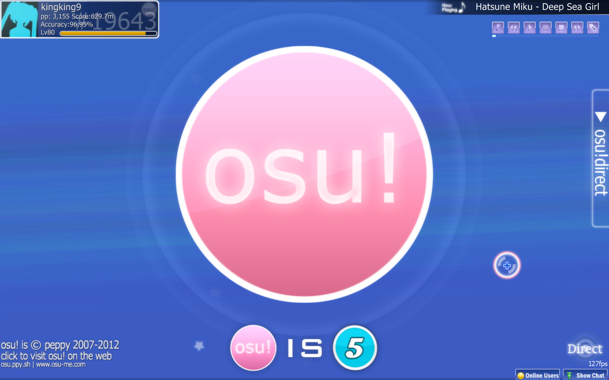
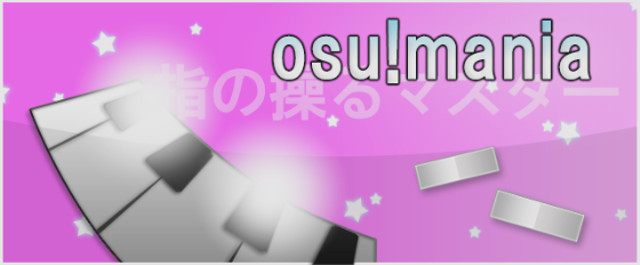
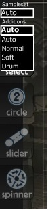
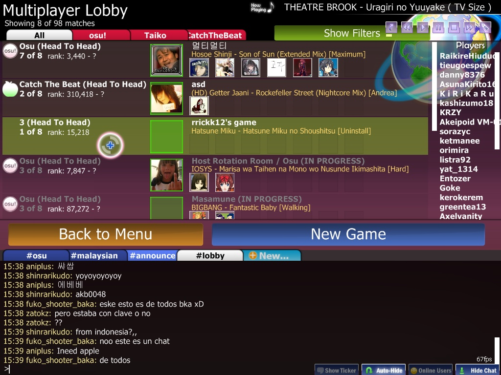
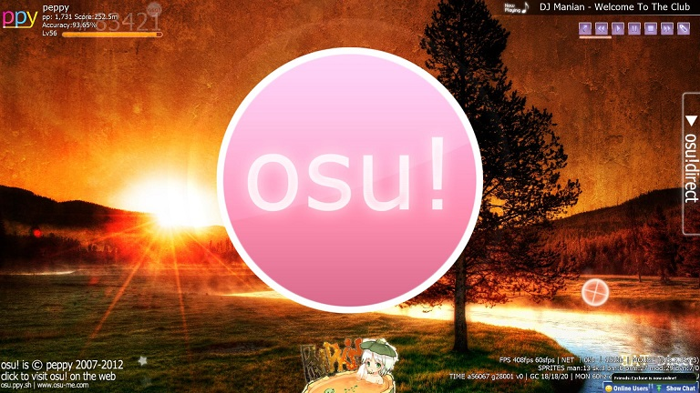
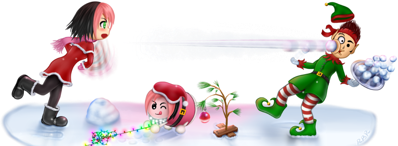

# L'histoire d'osu! en 2012

## Septembre

osu! et sa communauté ont célébré le 5e anniversaire d'osu! le 17/09/2012. Pendant cette période, tous les joueurs ont reçu le statut d'[osu!supporter](/wiki/osu!supporter) pendant 24 heures, à partir du 16/09/2012 (18:00 UTC), qui était l'heure de sortie originale d'osu! en 2007. peppy avait l'intention de distribuer une première version d'osu! sous une forme ou une autre pour la célébration, afin que les joueurs puissent faire l'expérience d'osu! à une époque antérieure, là où se trouvaient les racines du programme. Cependant, en raison des différentes versions du fichier `.dll`, peppy n'a pas été en mesure de le faire fonctionner. Il a dit qu'il le ferait fonctionner un jour.

Liens :

- [Five Years of osu! (fil du forum)](https://osu.ppy.sh/community/forums/topics/98349)

## Octobre

Le 08/10/2012, osu!mania a finalement été publié au public, build ([woc2006](https://osu.ppy.sh/users/1105845)) ! En plus de cela :

- Des hitsounds par objet ont été ajoutés dans l'éditeur. ([mm201](https://osu.ppy.sh/users/30655))
- La possibilité de se remettre d'un miss en [multijoueur](/wiki/Client/Interface/Multiplayer) en atteignant tous les HP. (Exception faite si le mod [Sudden Death](/wiki/Gameplay/Game_modifier/Sudden_Death) ou [Perfect](/wiki/Gameplay/Game_modifier/Perfect) sont activée).
- Un support du défilement pour la liste de classement en ligne dans le jeu.
- Des corrections sur le [sélecteur de skin](/wiki/Client/Options#skin) afin de rendre le jeu plus réaliste.

L'événement principal de cette mise à jour était osu!mania. De nombreux joueurs ont débarqué dans osu! juste pour essayer de jouer au mode osu!mania. Certains ont loué l'effort fourni, tandis que d'autres ont remis en question le jugement du score, trop strict et très décalé par rapport à O2JAM. Des problèmes étaient à prévoir, car certains joueurs n'ont pas pu mettre à jour leur client osu! en raison de la taille énorme de la mise à jour (~20MB serait une bonne estimation). Certains se sont plaints que la mise à jour était trop précipitée, car le classement, la soumission des beatmaps osu!mania, la modification de la difficulté et même le gameplay n'étaient pas complètement au point ou terminés. Certains problèmes ont été résolus plus tard, vers le mois de novembre, grâce à un retour suffisant de l'opinion publique, tandis que d'autres étaient encore en cours de traitement.

Le saviez-vous ? : Pour les joueurs qui sont entrés dans le lobby multijoueur avant la mise à jour vers la build b20121008, ils peuvent voir une apparition comique d'osu!mania nommé comme "3" sans l'icône du mode de jeu (comme vu ci-dessous). Il est néanmoins impossible d'entrer dans la salle sans appliquer la mise à jour, et encore moins d'y jouer.

Liens :

- [osu! release (b20121008) : osu!mania (fil du forum)](https://osu.ppy.sh/community/forums/posts/1825880)

---

Le 29/10/2012, l'arrière-plan du menu principal pouvait être modifié si l'utilisateur avait le statut d'osu!supporter. En plus de cela :

- Le classement d'osu!mania était en phase de test bêta. Les scores devaient être remis à zéro après une semaine.
- Une superposition de l'état des boutons.
- Une amélioration des performances.

Quelques changements notables pour corriger la mise à jour précédente (osu!mania) et pour donner ce que les joueurs voulaient vraiment : le classement d'osu!mania. Comme le système de classement d'osu!mania n'a pas encore été complètement testé, le classement était remis à zéro chaque semaine ou plus tôt pour s'assurer qu'aucun score piraté n'était téléchargé. Le test a duré un certain temps jusqu'à la mise à jour du 13/11/2012 (20121113b).

Les supporters ont eu la possibilité de définir leur image comme fond d'écran d'osu! au lieu de la couleur de fond habituelle. En pratique, cela n'affecte personne et il s'agissait plutôt d'un gadget. Cependant, le changement d'arrière-plan nécessite que vous soyez en ligne pour *vraiment fonctionner*, car osu! a besoin de vérifier votre tag d'osu!supporter pour fonctionner. Le gameplay n'a pas été affecté de quelque manière que ce soit.

La superposition de l'état des boutons était considérée comme un ajout intéressant. Maintenant, vous pouvez réellement *voir* comment vous/ils traitent votre/leur hit soit en utilisant le clavier/souris ou en utilisant de manière répétée ce bouton. Par défaut, cela ne fonctionne dans osu! que lors d'un replay ou en tant que spectateur d'une partie. Vous pouvez le faire apparaître manuellement pendant le jeu dans les [options sous l'onglet Entrée - Général](/wiki/Client/Options#général.1) comme `Toujours afficher la superposition des touches`. Initialement, elle était placée en haut de l'écran, mais elle a ensuite été déplacée à droite de l'écran car elle gênait la barre de HP et la concentration du joueur.

Liens :

- [osu! release (b20121029) (fil du forum)](https://osu.ppy.sh/community/forums/topics/103427)

## Novembre

Le 13/11/2012, le classement **osu!mania a été mis en place avec le classement pp**. Pour s'assurer que tous les scores n'ont pas été falsifiés ou triché, les scores ont été remis à zéro une dernière fois.

Liens :

- [osu!mania score reset (fil du forum)](https://osu.ppy.sh/community/forums/topics/105564)

---

Le 22/11/2012 :

- Mise à jour de la localisation. Plus de langues ont été ajoutées.
- Un clic droit sur une beatmap non courante peut permettre l'option d'affichage d'une beatmap lors de la sélection de la musique sans l'ouvrir au préalable avec un clic gauche.
- Amélioration de DirectX.
- Ajout du bouton `Quick Join` en ([Multi](/wiki/Client/Interface/Multiplayer)).
- Les paramètres des spoilers amusants étaient disponibles lors d'un replay/spectateur d'un joueur.

La localisation d'[osu! localisation project v2](https://osu.ppy.sh/community/forums/topics/104342) a été ajoutée. Vous pouvez trouver la localisation à la page [Options](/wiki/Client/Options) dans l'onglet `Graphiques` sous `Langues`.

Un bouton `Quick Join` a été ajouté au lobby du Multi. Il vous permet de rejoindre une salle au hasard en fonction de la beatmap que vous avez lorsqu'il est pressé. Puisque vous êtes "forcé" d'entrer dans une salle aléatoire, il ne serait pas surprenant que la beatmap en question soit dans le paramètre de difficulté que vous ne voulez pas (difficulté Insane habituellement ou difficulté que vous ne pouvez pas bien gérer). À moins que vous ne trouviez gênant de chercher vous-même une salle manuellement, vous pouvez l'utiliser comme option à la place.

Liens :

- [osu! Public Release (b20121122) (fil du forum)](https://osu.ppy.sh/community/forums/topics/106677)

## Décembre

Le 21/12/2012, osu! a fait l'objet d'une mise à jour majeure. Les changements les plus notables sont :

1. La prise en charge des écrans larges
2. Un écran de chargement au début des beatmaps
3. Une sélection des beatmaps plus fluide
4. Un paramétrages des spoilers amusants a été changé en [paramètres visuels](/wiki/Client/Interface/Visual_settings) et placé en bas de l'écran.
5. Le mod No Video a été déplacé vers les paramètres visuels

Des problèmes techniques et des bugs étaient attendus. La prise en charge de l'écran large, bien que fonctionnelle, a donné un aspect bizarre à certaines images et vidéos (tête d'un personnage non visible, texte manquant ou partiellement caché) car le haut et le bas étaient coupés. Les [storyboards](/wiki/Storyboard) ne supportent pas actuellement l'écran large, à la place, des letterboxes ou des barres noires apparaissent sur les côtés, ce qui leur donne un air étriqué. Cela a créé un problème pour [Catch the Beat](/wiki/Game_mode/osu!catch) car le fruit passait *sur* les barres noires qui étaient censées être dans la limite lors de l'utilisation de l'écran large. Certains storyboards ne fonctionnent pas non plus correctement (certaines images ne restent pas dans le terrain de jeu, mais s'étendent jusqu'aux barres noires). Ces problèmes sont actuellement connus et sont corrigés au fur et à mesure que des solutions sont discutées et trouvées.

Liens :

- [osu! Public Release (b20121221) (fil du forum)](https://osu.ppy.sh/community/forums/topics/110459)

---

Le 25/12/2012, c'était un joyeux Noël pour ceux qui le célèbrent. Une nouvelle version de [bancho](/wiki/Bancho_(server)) a été publiée qui "réduit la quantité de trafic envoyée lors de la connexion. Cela signifie que vous devriez bénéficier de temps de connexion 95% plus rapides". Comme il s'agit d'une occasion spéciale, osu!direct a été activé pour tout le monde pour la journée.

Liens :

- [Merry Christmas (bancho changes + free osu!direct) (fil du forum)](https://osu.ppy.sh/community/forums/posts/2005499)
