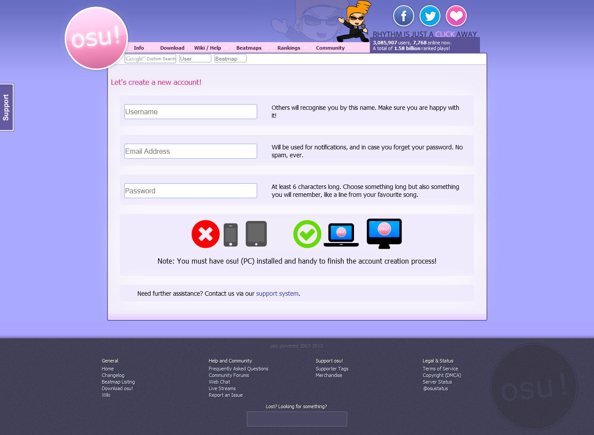
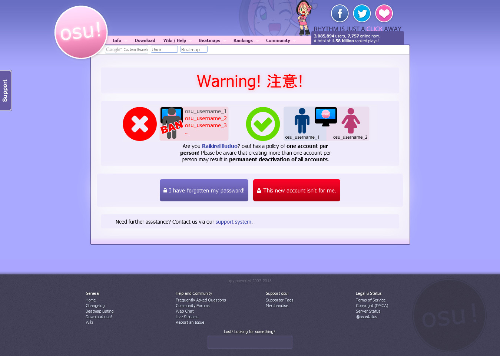
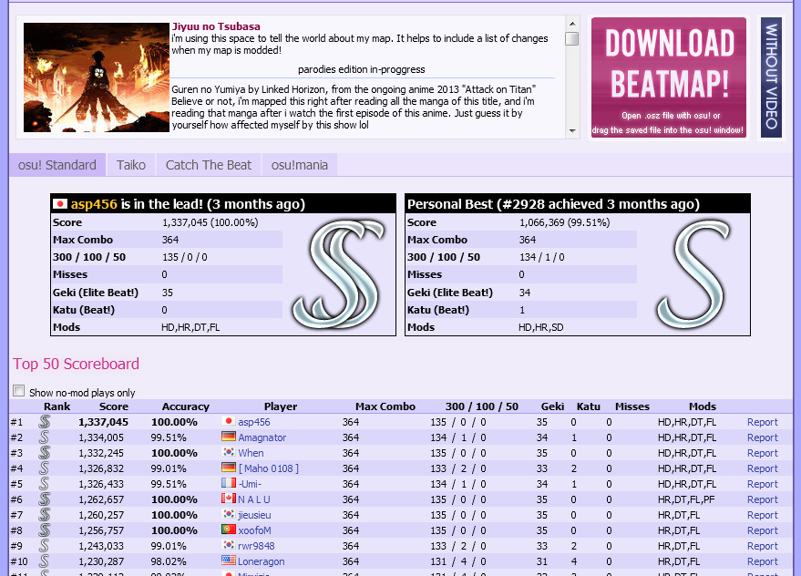
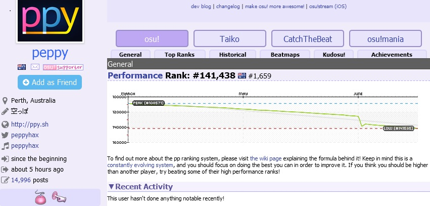
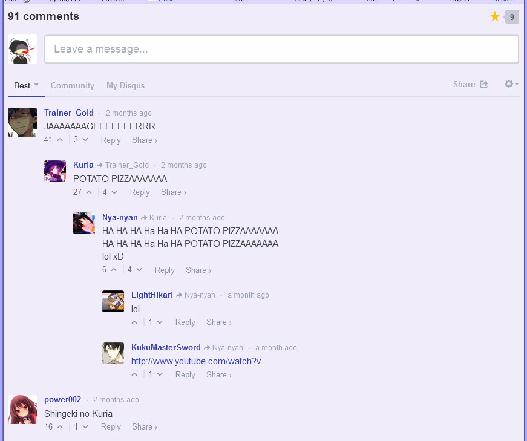
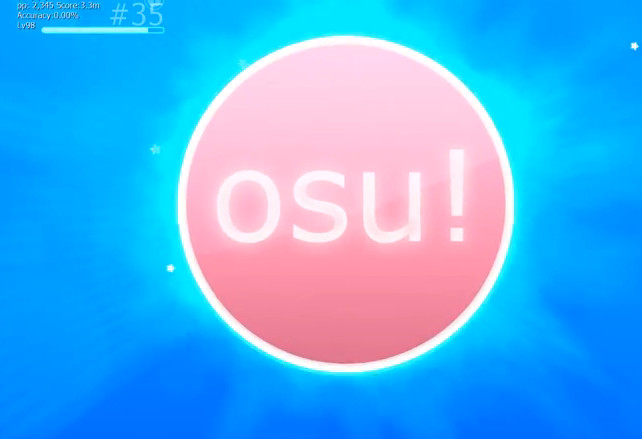
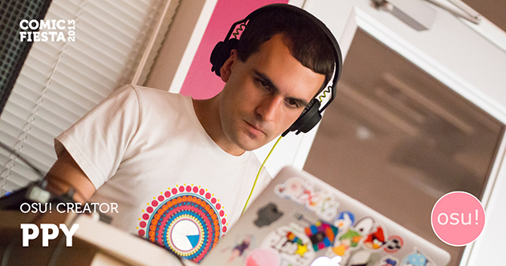

# Historia de osu! de 2013

## Enero

¡Ahora osu! es compatible con pantalla ancha en todos los modos (incluido el editor también)! El tamaño de la base de datos se redujo en un 10 %. Se agregó la capacidad de restablecer las asignaciones de teclas a sus valores predeterminados. Los problemas con el Hyperdash en [Catch the Beat](/wiki/Game_mode/osu!catch) casi se solucionaron. El gráfico de derechos de autor del menú principal se actualizó para 2013 sin el texto de derechos de autor. [Los resultados del «Best of» anual ya están disponibles. (Lo mejor de 2012)](https://docs.google.com/a/ppy.sh/spreadsheet/ccc?key=0AlsSAL_F7-xDdDRDSjNMN3o3Y1Z6UzA0QUpFNzdlNUE#gid=0).

Enlaces:

- [This Week in osu! – ppy blog](https://blog.ppy.sh/post/39831318171/this-week-in-osu-8)
- [This Week in osu! – ppy blog](https://blog.ppy.sh/post/41003637501/this-week-in-osu-9)
- [Getting Hyperdash Right – ppy blog](https://blog.ppy.sh/post/39917651337/getting-hyperdash-right)
- [Best of 2012 Results](https://osu.ppy.sh/community/forums/posts/2042263)

## Febrero

Se estaba trabajando en una nueva versión del editor para osu!mania. El modo Taiko ahora tiene una barra de «metadatos» (título de la canción y artista debajo del campo de juego), el campo de juego de taiko ya no era transparente y se desvanece dentro y fuera del kiai time. Las preguntas frecuentes originales han sido reemplazadas por la [osu! wiki](/wiki/FAQ).

El comando `!faq` de BanchoBot ha sido abierto al público para su [traducción](https://docs.google.com/a/ppy.sh/spreadsheet/ccc?key=0AlsSAL_F7-xDdHhUUjNSa19QendtcTdYUjE2S2hnVHc#gid=24). ¡El legendario [BanchoBot](/wiki/BanchoBot) finalmente tiene un [perfil](https://osu.ppy.sh/users/3)! La visualización de los paneles de usuario ahora se ajusta para mostrar cuatro columnas en todos los modos de pantalla ancha.

osu!mania ahora admite el giro vertical (al revés), lo que hace que el juego sea similar al de DDR/o2jam. El skinning ahora admite sprites de doble resolución cuando el ancho de la ventana era superior a 1600 píxeles. Para agregar soporte a una skin, agrega imágenes con el doble de ancho/alto que contengan el sufijo `@2x` antes de la extensión del archivo (por ejemplo: `cursor@2x.png`).

Soporte de clasificación para los mods [Hidden](/wiki/Gameplay/Game_modifier/Hidden) y [FadeIn](/wiki/Gameplay/Game_modifier/Fade_In) en osu!mania y, por último, menos limitaciones de pantalla ancha en el editor cuando se trata de ubicación y selección.

Enlaces:

- [This Week in osu! – ppy blog](https://blog.ppy.sh/post/42178900910/this-week-in-osu-10)
- [This Week in osu! – ppy blog](https://blog.ppy.sh/post/43136384020/this-week-in-osu-11)
- [This Week in osu! – ppy blog](https://blog.ppy.sh/post/43823357969/this-week-in-osu-12)
- [osu! release b20130220](https://osu.ppy.sh/community/forums/posts/2134063)

## Marzo

¡osu! recibió una revisión completa de la IU (interfaz de usuario)! El modo de juego osu! recibió un nuevo símbolo de leitmotiv (anteriormente, era un círculo con «osu!», ahora es un círculo con un «1»). Se han actualizado los botones del editor. El modo especial se ha combinado con el menú de selección de canciones (llamado «Mods»), lo que permite a los jugadores cambiar de modo más rápido y sin problemas. Todos los botones de los [modificadores del juego](/wiki/Gameplay/Game_modifier) ​​recibieron su respectiva revisión de imagen. La pantalla de resultados ahora muestra la imagen de fondo del beatmap en lugar del fondo de resultados de la skin del usuario.

El Hit-Offset ahora se puede conocer pasando el cursor sobre la precisión desde la pantalla de resultados. Ten en cuenta que desaparecerá y no se podrá guardar. Los resultados en línea ahora estaban ocultos debajo de la pantalla de resultados en lugar de obligarte a verlos. Puedes desplazarte hacia abajo para ver o simplemente puedes hacer clic en el botón y se te dirigirá a la pantalla de resultados en línea.

En términos de skin, «osu!default por peppy» fue reemplazado por «osu! por peppy» (arte de [RBRat3](https://osu.ppy.sh/users/307202)). Ya que osu! ahora puede soportar tanto pantalla ancha HD como tamaño estándar, se agregó un nuevo botón a la pestaña «Skins» en «Opciones». De forma predeterminada, el antiguo comportamiento de la skin se utilizó para la compatibilidad y habilitar el botón obligará a que se aplique el nuevo comportamiento de la skin. El [combo fire](/wiki/Gameplay/Combo_fire) se eliminó debido a problemas de rendimiento. En el lado del multijugador, los anfitriones tienen un nuevo comando especial llamado «Mods libres» y se eliminó el «Estilo de juego» (el anfitrión puede ajustar el estilo de juego en la selección de canciones ahora en «Mods»). Se introdujo `#userlog` para mostrar tus logros de juego recientes en privado.

El cuadro de clasificación, por su parte, recibió dos revisiones en un solo mes. La primera revisión fue «marcadores unificados», donde el marcador se separó en cuatro partes (Mods, Amigos, Mejor marca personal, Local) con una diferencia de puntuación debajo de la precisión de la capa, la eliminación del marcador local y la imposibilidad de desplazarse para ver más de los últimos mejores jugadores de puntuación. A pesar de que se limitó solo a los osu!supporters, recibió muchas críticas y, como tal, se publicó una segunda revisión a finales de mes. El marcador fue básicamente reverenciado como antes, manteniendo la brecha de diferencia de puntuación. La adición destacada fue el menú desplegable con pestañas, donde alberga varios tipos de tablas de clasificación. Sin embargo, los nuevos tipos de marcador \[País, Global (Mods seleccionados) y Amigo\] seguían estando limitados solo a los osu!supporters.

Por último, se agregó la imagen de perfil del jugador junto a la marca de calificación de su lugar en el marcador de clasificación. Cuando se desplaza sobre la pestaña, se puede conocer la ubicación ya que la imagen de perfil se oscureció para mostrar el número de ubicación. Ten en cuenta que esta simple adición no afecta al marcador local de ninguna manera, ya que lo más probable es que se inunde con tus propios resultados de juego con una intrusión mínima o nula de otros jugadores (a menos que el beatmap se haya recibido de otros jugadores en forma de carpeta).

Enlaces:

- [osu! Public Release (b20130319)](https://osu.ppy.sh/community/forums/topics/123276)
- [osu! Public Release (b20130325)](https://osu.ppy.sh/community/forums/topics/124366)
- [osu! Public Release (b20130328)](https://osu.ppy.sh/community/forums/topics/124848)
- [2013 Staff Restructuring](https://osu.ppy.sh/community/forums/topics/123510)

## Abril

Las actualizaciones de este mes se componían principalmente de parchear la actualización principal anterior, ¡pero eso no significa que ese fuera el final! Primero, fue la implementación inicial del soporte de «colecciones» que reemplazará a los «favoritos A/B» anteriores, lo que simplificará que el jugador coloque sus beatmaps favoritos en «colecciones» y pueda compartirlo con otros por transferir las «colecciones» en lugar de «favoritos A/B».

Los modos de juego ahora se pueden cambiar fácilmente en la selección de canciones usando `Ctrl` + `1`, `2`, `3` o `4`. Se agregó un nuevo modificador del juego especialmente para osu!mania, [Random](/wiki/Gameplay/Game_modifier/Random). Se han realizado algunos ajustes en el comportamiento del botón «Partida aleatoria» de multijugador para dirigirte a una sala con respecto a tu pp promedio frente a la desviación del pp de la sala.

Para las repeticiones de beatmaps, los comentarios obsoletos se cambiaron a [estilo nico](https://es.wikipedia.org/wiki/Nico_Nico_Douga) en movimiento. El estilo y el color de los comentarios ahora se pueden personalizar (solo para osu!supporters).

En el lado del beatmapping, todos los miembros del MAT se convirtieron en miembros del BAT ya que el MAT se disolvió oficialmente debido a que el límite de poder entre los miembros del MAT y BAT estaba demasiado cerca el uno del otro.

peppy lanzó una de las compilaciones iniciales de osu! de 2007 a 2009 (la que esperaba lanzar para el quinto aniversario de osu!).

Enlaces:

- [This week (month) in osu! – ppy blog](https://blog.ppy.sh/post/46924535831/this-week-month-in-osu-13)
- [The end of the MAT](https://osu.ppy.sh/community/forums/topics/129165)
- [osu! Public Release (2007-09)](https://osu.ppy.sh/community/forums/topics/130144)

## Mayo

El nombre de los modificadores del juego en los resultados se ha acortado (por ejemplo, «Hard Rock» a «HR») para eliminar el uso limitado del espacio. *La mayoría* de las repeticiones rotas en el pasado se han arreglado. Un nuevo sistema de observación en el que puedes seguir al objetivo del espectador si estuviera viendo a otra persona. El sistema de actualización se ha rediseñado, en particular, ya no forzará reinicios a menos que sea necesario.

Durante las repeticiones, se ha agregado la repetición a la mitad de la velocidad (después de presionar `2x` Speed, se mostrará `0.5x` Speed). El campo de juego no mostrará el fondo al 100 % de atenuación. [Catch the Beat](/wiki/Game_mode/osu!catch) recibió compatibilidad con joystick (arriba/abajo: cambiar de canción, derecha: seleccionar, izquierda: salir).

[Se está desarrollando un nuevo sistema de clasificación/modding](https://osu.ppy.sh/community/forums/topics/129625) que reemplazará los hilos antiguos de [modding en el foro](/wiki/Modding/Forum_modding).

Para el modo multijugador, los jugadores ahora pueden usar los mods especiales (Relax/Autopilot/SpunOut/ManiaKeys) cuando el anfitrión habilite Free Mod. En el lado del skinning, se agregaron sprites predeterminados de pantalla ancha para taiko (taiko `@2x`). Los favoritos A/B se eliminaron por completo y fueron reemplazados por las colecciones.

Se han lanzado tres nuevos [logros](/wiki/Medals) de dedicación para osu!mania (40 000 / 400 000 / 4 000 000 teclas presionadas). El diseño del perfil de usuario se modificó y «última visita» se basará en la conexión a Bancho (es decir, el inicio de sesión en el juego) en lugar de las visitas al foro. ¡Finalmente, osu! golpea el hito de tener 10 000 usuarios conectados simultáneamente!

- [osu! Public Release (b20130509)](https://osu.ppy.sh/community/forums/topics/131611)
- [May 2013 Highlights + Map of the Month](https://osu.ppy.sh/community/forums/posts/2334705)

## Junio

Ha comenzado [el osu! Beatmapping Contest \#4](https://osu.ppy.sh/community/forums/posts/2324098). Como contramedida contra los jugadores que crean muchas cuentas, se mejoró la claridad de los mensajes durante el registro de la cuenta y se agregó una infografía que muestra que no pueden registrarse desde teléfonos/tabletas para evitar que los jugadores creen más cuentas por motivos personales.

Aparte de las medidas de seguridad, los usuarios podían elegir el modo de juego predeterminado de su perfil (como [osu!mania](/wiki/Game_mode/osu!mania), [Taiko](/wiki/Game_mode/osu!taiko)) y compatibilidad con perfiles de [last.fm](https://last.fm). Los perfiles de usuario ahora tienen una clasificación por rendimiento nacional en su perfil y un nuevo gráfico de pp.

En cuanto al juego, el menú principal obtiene una nueva visualización, con un destello resplandeciente alrededor del símbolo de osu! que depende de la intensidad del BPM de la canción que se está reproduciendo actualmente. El rendimiento se ha optimizado en la selección de canciones con muchos (más de diez mil) mapas. Se ha mejorado la solidez y el rendimiento del proceso de actualización.

En cuanto a la jugabilidad, el tiempo de inicio se agregó automáticamente a cualquier beatmap que comience abruptamente para permitir suficiente tiempo para ajustar la [configuración visual](/wiki/Client/Interface/Visual_settings) y se agregó el recuento total de pulsaciones para cada tecla en la superposición de entrada. Para el almacenamiento de los resultados en línea, el mejor rango personal se mostró en las páginas de información del beatmap además del jugador \#1. Se permitió el envío de puntajes desde las tablas de mania y se almacenaron las repeticiones del top 50 en lugar del top 40 habitual. Se corrigieron los sliders inversos que no alcanzaban su combo máximo. Se agregaron comentarios de Disqus a las páginas de los beatmaps. Finalmente, se estaba realizando la prueba del prototipo del medidor de puntuación de todos los modos para osu!test.

Enlances:

- [June 2013 Highlights + Map of the Month](https://osu.ppy.sh/community/forums/posts/2400775)
- [Regional Team Management](https://osu.ppy.sh/community/forums/topics/132667)

## Julio

[Los nuevos gerentes del BAT regionales](https://osu.ppy.sh/community/forums/topics/132667) comenzaron su primer reclutamiento importante de nuevos BAT en el equipo con las [nuevas aplicaciones del BAT de verano de 2013](https://osu.ppy.sh/community/forums/topics/142864). Esto brindó una oportunidad para que los nuevos gerentes manejaran adecuadamente las nuevas aplicaciones. Los nuevos gerentes regionales fueron [NatsumeRin](https://osu.ppy.sh/users/151679) en representación de Asia/Oceanía, [Kurai](https://osu.ppy.sh/users/77089) en representación de Europa y [Garven](https://osu.ppy.sh/users/244216) en representación de América.

El 2 de julio de 2013, peppy abrió al público la [osu!api](https://osu.ppy.sh/community/forums/topics/141240) (anteriormente disponible solo a través de solicitudes privadas). Esto permitió a los desarrolladores independientes trabajar en servicios de terceros para osu!. El 11 de julio de 2013, se arregló la página «Olvidé mi contraseña» que no funcionaba anteriormente. El 18 de julio de 2013 trajo actualizaciones a la conectividad alternativa de Bancho. El 21 de julio de 2013, se agregó el soporte de pantalla ancha para storyboards en el cuadro de diálogo de configuración de la canción. Se agregaron dos nuevas superposiciones en el juego para rastrear la precisión mientras juegas o ves jugar a otros. Consulta la página [Opciones](/wiki/Client/Options) para obtener más información.

Enlaces:

- [Summer 2013 NewBAT Applications](https://osu.ppy.sh/community/forums/topics/142864)
- [osu!api open beta](https://osu.ppy.sh/community/forums/topics/141240)

## Diciembre

[Se confirmó que peppy estaría en la Comic Fiesta 2013 de Malasia los días 21 y 22 de diciembre en el centro de la ciudad de Kuala Lumpur](https://osu.ppy.sh/community/forums/topics/163121). Para el día 1 (21/12/2013), osu! se mostró como un evento de escenario, demostrando el juego en cuatro modos de juego diferentes (osu!, Taiko, Catch the Beat y osu!mania). Para el día 2 (22/12/2013), peppy dio una idea de osu! junto con sus futuros planes de actualizaciones en la sala de paneles y mostró la osu!tablet para que el público la probara.

Uno de los temas candentes de debate en este momento era que peppy estaba creando un nuevo modo de juego y lo estaba probando como una prueba de concepto (probando si es jugable, competitivo o lo suficientemente flexible). Algunos jugadores especulan que fue [Touhosu!](https://osu.ppy.sh/community/forums/topics/19307) (esquivando el infierno de balas, es decir, lo contrario a [Catch the Beat](/wiki/Game_mode/osu!catch)). Al momento de escribir, no se descubrió mucha información sobre el nuevo modo de juego. [Un videoclip sobre la charla estaba en el blog de ppy](https://blog.ppy.sh/post/71405880656/i-have-a-few-posts-waiting-for-some-final-touches).

Enlaces:

- [I will be in malaysia (December)](https://osu.ppy.sh/community/forums/topics/163121)
- [Schedule | Comic Fiesta 2013](https://comicfiesta.org/2013/info/event/schedule)
- [New osu! mode announced on CF2013?](https://osu.ppy.sh/community/forums/topics/176000)
- [Comic Fiesta 2013 Impressions & osu! Q&A Panel Session with peppy (ppy) | INFONOCHIKARA 「インフォノチカラ」 Blogotopia](https://infonochikara.wordpress.com/2013/12/30/comic-fiesta-2013-impressions-osu-qa-panel-session-with-peppy-ppy/)
