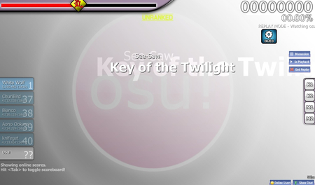

# L'histoire d'osu! en 2014

## Janvier

L'ensemble du système des [points de performance (pp)](/wiki/Performance_points) a été complètement désactivé pour une maintenance le 20 janvier 2014 en raison d'erreurs de calcul survenues au cours des mois précédents.[^ranking-maintenance] Cette désactivation a ensuite été suivie d'une annonce, le 26 janvier 2014, détaillant une refonte complète du système de pp, qui a été mise en service le lendemain.[^new-perf-ranking][^pp-article] Le nouveau système a été conçu et mis en œuvre par [Tom94](https://osu.ppy.sh/users/1857058) et visait à baser les scores de pp sur une nouvelle "valeur de difficulté" (distincte du [star rating](/wiki/Beatmap/Star_rating)) qui était déterminée pour chaque combinaison de [beatmap](/wiki/Beatmap) et de [mod](/wiki/Gameplay/Game_modifier) dans le jeu.[^ranking-maintenance] En conséquence, l'ancien système de pp a été renommé "ppv1" et le nouveau système a été nommé "ppv2".

## Mars

Le 1er mars 2014, le système des points de performance remanié par Tom94 quelques mois auparavant était prêt à être mis en ligne pour [osu!taiko](/wiki/Game_mode/osu!taiko), [osu!catch](/wiki/Game_mode/osu!catch) et [osu!mania](/wiki/Game_mode/osu!mania) en tant que système de classement officiel pour ces modes, tout en rappelant que le système actuel n'était pas encore terminé à 100 % et qu'il fallait encore recueillir les commentaires des joueurs.[^all-game-modes]

Comme les éléments de [skinning](/wiki/Skinning) se sont développés, l'élément `playfield.jpg` a été déprécié et remplacé par un nouvel élément générique qui n'est pas modifiable. `playfield.jpg` était un élément qui permettait aux skinneurs d'utiliser n'importe quelle image comme arrière-plan par défaut d'une beatmap si aucune n'était fournie. Cette fonctionnalité a été apportée plus tard sous la forme de `menu-background.jpg`, qui modifiait à la fois l'écran principal et les arrière-plan par défaut du terrain de jeu.[^change-background][^skinning]

## Avril

Le tout premier "osu! Monthly Fanart Contest" a été annoncé le 3 avril 2014. Il s'agissait d'un concours informel organisé par [LuigiHann](https://osu.ppy.sh/users/1079) qui se déroulerait tous les mois et récompenserait deux gagnants par an d'[osu!supporter](https://osu.ppy.sh/home/support) (l'un choisi par le public et l'autre par le personnel d'osu!).[^fanart] Le premier concours s'est conclu par un [newspost](https://osu.ppy.sh/home/news/2014-05-21-first-official-osu-fanart-contest-results) le 21 mai 2014, les joueurs [kunny](https://osu.ppy.sh/users/3931585) et [DumplingYumYum](https://osu.ppy.sh/users/1715930) remportant respectivement la première et la deuxième place.[^fanart-results]

## Juin

Le 18 juin 2014, [peppy](https://osu.ppy.sh/users/2) a annoncé que les limitations de téléchargement seraient supprimées pour tous les utilisateurs ; cependant, il existait toujours une, je cite, "limite de sanité" qui empêcherait les bots de télécharger une quantité inhumaine de beatmaps.[^download]

## Août

Le 21 août 2014, un [newspost](https://osu.ppy.sh/home/news/2014-08-21-restructuring-of-the-bat) a été publié pour annoncer une nouvelle restructuration de la [Beatmap Appreciation Team (BAT)](/wiki/Modding/Beatmap_Appreciation_Team), qui détaillait la séparation de l'équipe initiale en une Beatmap Appreciation Team et une [Quality Assurance Team (QAT)](/wiki/Modding/Quality_Assurance_Team).[^bat]

## Octobre

Le mois d'octobre a apporté une poignée de nouveaux ajouts au jeu de base, notamment un nouvel écran de connexion et un nouveau système de défilement dans [osu!mania](/wiki/Game_mode/osu!mania) basé sur le BPM de la beatmap, de nouvelles séquences d'intro et d'outro, et un thème musical personnalisé qui devait être jouée au démarrage (par opposition à une beatmap aléatoire).

De plus, [peppy](https://osu.ppy.sh/users/2) a également publié la version "osu!test" (désormais connue sous le nom de "Cutting Edge") pour tous les joueurs, et non plus seulement pour les [osu!supporter](https://osu.ppy.sh/home/support), afin de faciliter les efforts de débogage.

## Références

[^ranking-maintenance]: [Article de news par peppy (20/01/2014) "Performance Ranking Maintenance"](https://osu.ppy.sh/home/news/2014-01-20-performance-ranking-maintenance)
[^new-perf-ranking]: [Article de news par Tom94 (26/01/2014) "New Performance Ranking"](https://osu.ppy.sh/home/news/2014-01-26-new-performance-ranking)
[^pp-article]: [Article de l'osu! wiki "Points de performance"](/wiki/Performance_points)
[^all-game-modes]: [Article de news par Tom94 (01/03/2014) "Performance ranking for all gamemodes"](https://osu.ppy.sh/home/news/2014-03-01-performance-ranking-for-all-gamemodes)
[^change-background]: [Commentaire sur le forum (Resolved Issues) par Pawsu (20/12/2015) "[resolved] How to change all beatmap backgrounds")](https://osu.ppy.sh/community/forums/topics/397827?start=4749640)
[^skinning]: [Article de l'osu! wiki "L'histoire du skinning"](/wiki/Skinning/History)
[^fanart]: [Article de news par LuigiHann (03/04/2014) "osu! Monthly Fanart Contest #1 - Ends this week!"](https://osu.ppy.sh/home/news/2014-04-03-osu-monthly-fanart-contest-1-ends-this-week)
[^fanart-results]: [Article de news par LuigiHann (21/05/2014) "First Official osu! Fanart Contest Results!"](https://osu.ppy.sh/home/news/2014-05-21-first-official-osu-fanart-contest-results)
[^download]: [Article de news par peppy (18/06/2014) "Download restrictions removed"](https://osu.ppy.sh/home/news/2014-06-18-download-restrictions-removed)
[^bat]: [Article de news par Ephemeral (21/08/2014) "Restructuring of the BAT"](https://osu.ppy.sh/home/news/2014-08-21-restructuring-of-the-bat)
