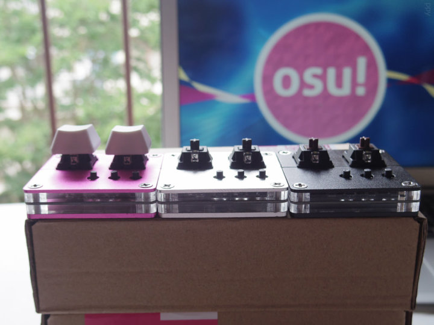
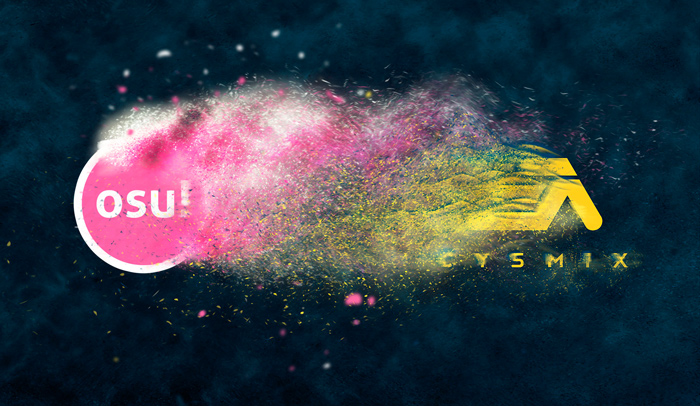
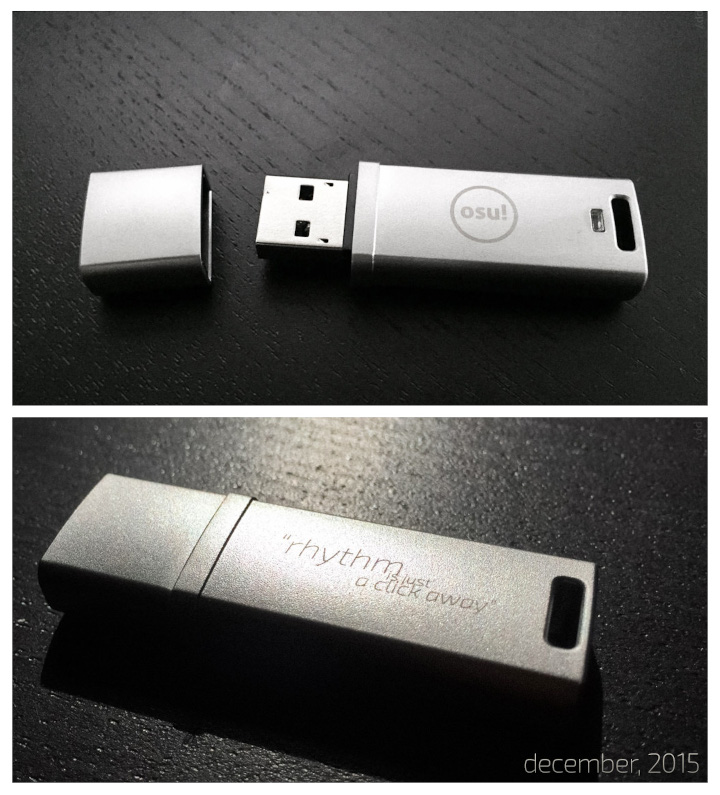

---
tags:
  - history
  - 2015
  - legacy
  - historia
  - legado
---

# Historia de osu! de 2015

## Febrero

El 16 de febrero de 2015, las reglas de los storyboards se actualizaron para permitir tamaños de imagen superiores a 854x640. Según lo sugerido por [Xgor](https://osu.ppy.sh/users/98661), el nuevo tamaño máximo de imagen clasificable para los storyboards se actualizó a 1366x768.[^osu-weekly-1][^sb-rule-change]

## Marzo

La primera edición de osu!weekly se publicó el 13 de marzo de 2015. Escrito por [Tasha](https://osu.ppy.sh/users/1031958), osu!weekly se posicionó como «un resumen de noticias semanal que cubría los últimos acontecimientos del juego y su comunidad».[^osu-weekly-1]

Las primeras pegatinas de los planos de beatmaps de osu! se añadieron a la [osu!store](https://osu.ppy.sh/store/listing) el 20 de marzo de 2015. Las pegatinas venían en dos paquetes de hojas de pegatinas personalizadas de 8,5 x 11 con elementos como círculos, contadores de combo, sliders, y mucho más.[^osu-stickers] Para celebrar el lanzamiento, se llevó a cabo un concurso para ver quién podía hacer el mejor [beatmap](/wiki/Beatmap) usando las pegatinas, con un premio de primer lugar de una osu! tablet y un juego de pegatinas de osu! 1 y 2. A pesar de esto, el concurso se canceló debido a la falta de presentaciones, y en ese momento nunca se declaró públicamente ningún seguimiento al respecto.[^osu-stickers][^osu-stickers-submission-count]

Se añadió soporte para el [Wii Remote](https://es.wikipedia.org/wiki/Wii_Remote) en [osu!taiko](/wiki/Game_mode/osu!taiko) el 26 de marzo de 2015.[^osu-weekly-3]

El 31 de marzo de 2015, se añadieron las [osu!coins](/wiki/History_of_osu!/April_Fools#osu!coins) como moneda de broma en el juego para osu! como parte de una broma del día de los Inocentes. Las monedas se crearon para parodiar a los juegos móviles [free-to-play](https://es.wikipedia.org/wiki/Videojuego_gratuito) y su uso común de monedas en el juego y [microtransacciones](https://es.wikipedia.org/wiki/Microtransacción). Las osu!coins se retiraron rápidamente al día siguiente.

## Abril

El canal `#balkan` se volvió a añadir al juego según una [solicitud de función](https://osu.ppy.sh/community/forums/topics/152009&start=0) el 2 de abril de 2015.[^balkan-channel][^osu-weekly-4]

El [mod Co-op](/wiki/Gameplay/Game_modifier/Co-op) se convirtió en un mod no clasificable el 6 de abril de 2015.[^osu-weekly-5]

9K se hizo clasificable después de recibir soporte de uso adecuado en el editor el 30 de abril de 2015.[^osu-weekly-8]

## Mayo

*Aviso: El [mensaje del foro](https://osu.ppy.sh/community/forums/topics/334994) que anunciaba el nuevo sistema de clasificación se publicó el 4 de junio de 2015, aunque el antiguo sistema quedó completamente obsoleto el 1 de mayo de 2015, y la implementación completa del nuevo sistema aún no estaba disponible para el público a fines de 2015.*

La antigua clasificación de los Beatmap Nominators (BN) quedó totalmente obsoleta el 1 de mayo de 2015, y se reemplazó por una nueva clasificación en tiempo real. Esta nueva clasificación mantenía el objetivo original de la anterior, aunque se centró en el desafío y la colaboración en lugar del desempeño individual durante un periodo de tiempo establecido. La recepción del público hacia este nuevo cambio fue mayormente positiva en general, aunque muchos usuarios comentaron que el nuevo sistema era confuso.[^realtime-bn-ranking][^osu-weekly-14]

Entre los cambios y anuncios realizados en torno a la clasificación de beatmaps, [se realizó un cambio en el proceso de clasificación](https://osu.ppy.sh/community/forums/topics/325973) el 5 de mayo de 2015 que permitió a los jugadores disputar las descalificaciones realizadas por el Quality Assurance Team (QAT), debido a la falta de cualquier forma de disputar los problemas que podía plantear el QAT. El nuevo cambio hizo posible enviar un formulario si hubiera una disputa, donde se podría tomar una decisión final con respecto a un beatmap y si estaba listo para ser clasificado.[^osu-weekly-9]

El [canal de YouTube osu!news](https://www.youtube.com/channel/UCZKQIqv9O2tddMNUMAxWaqQ) subió su [primer vídeo](https://www.youtube.com/watch?v=KQbudVxEjr8) al público el 8 de mayo de 2015. El canal estaba a cargo de varios miembros de la comunidad y tenía como objetivo crear vídeos sobre exhibiciones de skins, torneos, mapping, concursos y otras noticias de la comunidad.[^osu-weekly-9][^osu-news-welcome]

El teclado osu! (también conocido como el «teclado osu! 'nono'») se añadió a la osu!store el 30 de mayo de 2015, con un precio de venta minorista de alrededor de 40 $ en el lanzamiento. Anunciado inicialmente en un [tuit de peppy](https://twitter.com/ppy/status/603797988742336512) el 28 de mayo de 2015, solo había 100 teclados disponibles en el lanzamiento y se parecían más a un keypad que a un teclado de tamaño completo.[^osu-weekly-12][^ppy-tweet-osu-keyboards]

## Junio

La implementación del sistema de cambio de nombre de usuario en la osu!store se puso en marcha el 16 de junio de 2015, aunque la funcionalidad completa del sistema no estuvo disponible hasta el 18 de junio de 2015. Los cambios hicieron que los jugadores tuvieran que pagar 4 $ por su primer cambio de nombre, después de lo cual el precio se duplicaría con cada compra posterior con un límite de 100 $; sin embargo, si un usuario compraba una [etiqueta de osu!supporter](https://osu.ppy.sh/home/support), su primer cambio sería gratuito. [^ppy-blog-june-04][^ppy-blog-june-16][^ppy-blog-june-17][^ppy-blog-june-18]

La capacidad de ver cómo se vería una repetición sin [mods](/wiki/Gameplay/Game_modifier) se añadió el 23 de junio de 2015 según una [solicitud de función](https://osu.ppy.sh/community/forums/topics/97560), aunque el cambio solo hizo que los mods [Double Time](/wiki/Gameplay/Game_modifier/Double_Time), [Half Time](/wiki/Gameplay/Game_modifier/Half_Time) y [Flashlight](/wiki/Gameplay/Game_modifier/Flashlight) se pudieran activar y desactivar.[^ppy-blog-june-23]

## Julio

El 15 de julio de 2015, se anunció que se creó un nuevo equipo público de [Slack](https://slack.com/) con el fin de mejorar la comunicación con los contribuidores públicos. [peppy](https://osu.ppy.sh/users/2) inicialmente hizo el anuncio en su blog y explicó que cualquiera que estuviera dispuesto a ayudar a probar funciones de cutting-edge, contribuir con recursos gráficos/de sonido u obtener ayuda trabajando con osu! podrían venir y unirse al equipo y hablar con la gente de diferentes [osu! teams](/wiki/People/osu!_team) directamente.[^ppy-blog-july-15]

*Nota: También existía un equipo privado de Slack que el osu! team usó para comunicaciones internas, que no era accesible o visible para usuarios externos; estos dos equipos eran independientes entre sí.*

No obstante, el nuevo equipo era completamente público y estaba disponible para que cualquiera se uniera, lo que provocó que muchos usuarios no deseados inundaran los canales. Esto obligó a peppy a «bloquear» el nuevo equipo hasta el día siguiente. A pesar de esto, peppy siguió haciendo uso del equipo durante el resto del año y, a menudo, invitaba a los usuarios a venir y unirse cuando estaban probando nuevas funciones o implementaciones.[^ppy-blog-july-16][^ppy-blog-july-20]

## Agosto

Los moderadores del chat se fusionaron oficialmente con el Global Moderation Team (GMT) el 20 de agosto de 2015.[^osu-weekly-24][^gmt-merge-post]

## Septiembre

El antiguo contador de FPS fue reemplazado por una nueva «pantalla de actualización y latencia» el 2 de septiembre de 2015. Esta nueva pantalla seguiría mostrando los FPS (fotogramas por segundo) actuales, pero el nuevo cambio hizo que se ocultara de la vista si superaba los 500 FPS. Además, se añadió un nuevo contador debajo del contador de FPS que mostraría exactamente cuánta latencia se estaba introduciendo durante la renderización de los fotogramas (medida en milisegundos). Los fotogramas «entrecortados» o «caídos» se mostrarían como rectángulos de colores a la izquierda del contador para visualizar mejor exactamente cuánta latencia de procesamiento de fotogramas estaba experimentando un usuario.[^ppy-blog-sep-mwr][^osu-weekly-29]

El 26 de septiembre de 2015, [cYsmix](http://cysmix.com/) se convirtió en uno de los primeros artistas oficiales de osu!. Esta asociación implicó la creación de tres pistas hechas específicamente para osu!, junto con la creación de un concurso de mapping usando esas pistas. Las tres pistas antes mencionadas fueron las siguientes:

- [«Manic»](https://soundcloud.com/olemlanglie/cysmix-manic-osu)
- [«House with Legs»](https://soundcloud.com/olemlanglie/cysmix-house-with-legs-osu)
- [«Dovregubben's Hall (New Ver.)»](https://soundcloud.com/olemlanglie/cysmix-dovregubbens-hall-new-ver-osu)

Cada pista tenía su propio archivo [`.osz`](/wiki/Client/File_formats/osz_(file_format)) preprogramado incluido y se lanzó en el [SoundCloud de cYsmix](https://soundcloud.com/olemlanglie) el 28 de septiembre de 2015.

Además de esto, se creó una «recompensa abierta» llamada «Mapping With Rewards» para este evento, que permitía a cualquiera mapear una de las pistas antes mencionadas, ponerla en un estado clasificable y, si era lo suficientemente impresionante, esa persona podría recibir una recompensa por ello. La recompensa ofrecida en ese momento era la siguiente: una canción incluida con el cliente (por un período de tiempo limitado), crédito de 50 $ en la osu!store, 6 meses de supporter y una insignia de perfil única. Según los informes, esta recompensa abierta se creó debido a la necesidad de recompensar a los jugadores por beatmaps de calidad y para celebrar las nuevas pistas sin tener que pasar por la molestia que conlleva la ejecución de concursos de mapping tradicionales.[^ppy-blog-sep-mwr]

Sin embargo, a pesar de [las promesas de peppy en su blog](https://blog.ppy.sh/post/132009865043/mapping-with-rewards-oct-2015), los resultados del Mapping With Rewards no se publicaron al final del año.

## Octubre

Después de meses de trabajo, se completó la migración de [DirectX](https://es.wikipedia.org/wiki/DirectX) a [OpenGL](https://es.wikipedia.org/wiki/OpenGL) y se envió a todos los usuarios en el flujo de lanzamiento Stable el 16 de octubre de 2015. Sin embargo, los usuarios que no podían ejecutar la nueva actualización debido a problemas de compatibilidad cambiaron a un nuevo canal de lanzamiento llamado «Stable (Fallback)», que usaba el antiguo renderizado de gráficos de DirectX. Estaba destinado a ser compatible continuamente junto con el lanzamiento de Stable hasta que el osu! team confiara lo suficiente en la compatibilidad del renderizado OpenGL para todos los usuarios.[^ppy-blog-june-11][^ppy-blog-july-31][^ppy-blog-august-12][^ppy-blog-september-04][^ppy-blog-october-16]

Otro lote de canciones oficiales de osu! fueron lanzadas por cYsmix el 27 de octubre de 2015, y también se abrió un concurso similar al del «estilo de recompensa abierta». Las tres canciones fueron [«Fright March»](https://soundcloud.com/olemlanglie/cysmix-fright-march-osu), [«Moonlight Sonata»](https://soundcloud.com/olemlanglie/cysmix-moonlight-sonata-osu) y [«Classic Pursuit»](https://soundcloud.com/olemlanglie/cysmix-classic-pursuit-osu).[^ppy-blog-oct-mwr][^osu-weekly-34]

Al igual que el [concurso Mapping With Rewards del mes anterior](#septiembre), los resultados no se publicaron antes de fin de año.

La URL del subdominio de prueba de los nuevos foros de osu! (jizz.ppy.sh) se reemplazó con new.ppy.sh el 26 de octubre de 2015 debido a las connotaciones explícitas que la antigua URL puede haber implicado.[^osu-weekly-34][^new-design-post]

El primer y único lote de memorias USB de osu! (que se muestran a continuación) se anunciaron por primera vez el 30 de octubre de 2015 en [el blog de peppy](https://blog.ppy.sh/), mostrando las primeras imágenes de su diseño de cuerpo completamente metálico. En el momento de su anuncio, su lanzamiento estaba previsto para diciembre de 2015.[^osu-weekly-34][^ppy-blog-october-30]

## Noviembre

Los banners de perfil de la [OWC](/wiki/Tournaments#osu!-world-cup) se añadieron a la osu!store del 7 al 8 de noviembre de 2015.[^ppy-blog-november-12][^osu-weekly-35]

La verificación de correo electrónico requerida para ciertas acciones de la cuenta comenzó a implementarse el 16 de noviembre de 2015 en respuesta a eventos recientes en ese momento que involucraron el compromiso de numerosas cuentas de osu! de streamers.[^ppy-blog-november-17][^ppy-blog-november-19][^osu-weekly-36] Al día siguiente, [peppy publicó en su blog](https://blog.ppy.sh/post/133395614668/20151117), donde inicialmente anunció el cambio en la seguridad de las cuentas:

> Me ha llamado la atención que en los últimos días una gran cantidad de streamers de osu! han sido hackeados. El vínculo común parece ser que todos tenían cuentas de xsplit activas (que fue hackeado en 2013, filtrando todas las contraseñas). Esto significa que dichos usuarios estaban usando la misma contraseña en twitch, twitter, osu! y más. En primer lugar, si estás haciendo algo como esto, SAL AHORA MISMO Y CAMBIA TUS CONTRASEÑAS. ¡Obtén un administrador de contraseñas y configura una contraseña por servicio!
> Aunque estoy seguro de que osu! no estuvo involucrado en la filtración de ningún detalle, me aseguro de que más intentos de este tipo no resulten en cuentas de osu! comprometidas. A partir de ayer comencé a implementar la verificación de correo electrónico para ciertas acciones de la cuenta. En el futuro, también se añadirá la verificación de correo electrónico al cliente del juego, pero esto requerirá un poco más de implementación. Espéralo en un futuro cercano.

— peppy, «20151117»[^osu-weekly-36]

Unos días después (19 de noviembre de 2015), peppy actualizó a los usuarios sobre la situación en [otra publicación en su blog](https://blog.ppy.sh/post/133524244723/20151119), en la que explicó la situación y mantuvo su postura igual:

> Algunas actualizaciones sobre la seguridad de las cuentas:

> - Estoy seguro de que osu! no ha sido comprometido.
> - Todos los usuarios a los que se dirigió hasta ahora han usado la misma contraseña durante más de 3 años.
> - Muchos usaron una contraseña muy simple o compartieron la contraseña con otros servicios.
> - Todos los usuarios comprometidos han tenido al menos otra cuenta comprometida en el pasado.

> No obstante, todavía estoy tomando más medidas:

> - He ampliado la lista de contraseñas comunes y estoy restableciendo a la fuerza las contraseñas de los usuarios que las tienen.
> - Estamos en alerta máxima y listos para ayudar a los usuarios que tienen problemas.
> - Hemos realizado procedimientos para los usuarios que tienen direcciones de correo electrónico no válidas para que puedan recuperar su cuenta con éxito.
> - Trabajando para añadir soporte de dos factores (correo electrónico por ahora) al cliente de osu!. Debería salir a la superficie muy pronto.

> Tenemos muchas cuentas para restablecer a la fuerza debido a contraseñas débiles y, debido al personal de soporte limitado, iremos haciendo el «despliegue» de estos restablecimientos a lo largo de las próximas semanas.

— peppy, «20151119»[^ppy-blog-november-19]

## Referencias

[^osu-weekly-1]: [Publicación de noticia por Tasha (13/3/2015) «osu!weekly #1»](https://osu.ppy.sh/home/news/2015-03-13-osuweekly-1)
[^sb-rule-change]: [Hilo del foro por Xgor (5/1/2015) «[Rule Change] Higher storyboard image sizes»](https://osu.ppy.sh/community/forums/topics/276337&start=0)
[^osu-stickers]: [Publicación de noticia por yelle (20/3/2015) «osu! Beatmap Blueprints Available & Contest Details»](https://osu.ppy.sh/home/news/2015-03-20-osu-beatmap-blueprints-available-contest)
[^osu-stickers-submission-count]: [Comentario de GitHub por peppy (23/4/2021) en «Update History of osu! 2015 #5236»](https://github.com/ppy/osu-wiki/pull/5236#discussion_r618896306)
[^osu-weekly-3]: [Publicación de noticia por Tasha (28/3/2015) «osu!weekly #3»](https://osu.ppy.sh/home/news/2015-03-28-osuweekly-3)
[^balkan-channel]: [Hilo del foro por Srbija (30/8/2013) «[added] #balkan channel»](https://osu.ppy.sh/community/forums/topics/152009)
[^osu-weekly-4]: [Publicación de noticia por Tasha (4/4/2015) «osu!weekly #4»](https://osu.ppy.sh/home/news/2015-04-04-osuweekly-4)
[^osu-weekly-5]: [Publicación de noticia por Tasha (13/4/2015) «osu!weekly #5»](https://osu.ppy.sh/home/news/2015-04-11-osuweekly-5)
[^osu-weekly-8]: [Publicación de noticia por Tasha (1/5/2015) «osu!weekly #8»](https://osu.ppy.sh/home/news/2015-05-01-osuweekly-8)
[^realtime-bn-ranking]: [Hilo del foro por p3n (4/6/2015) «Realtime Beatmap Nominator Ranking»](https://osu.ppy.sh/community/forums/topics/334994)
[^osu-weekly-14]: [Publicación de noticia por Tasha (13/6/2015) «osu!weekly #14»](https://osu.ppy.sh/home/news/2015-06-13-osuweekly-14)
[^osu-weekly-9]: [Publicación de noticia por Tahsa (8/5/2015) «osu!weekly #9»](https://osu.ppy.sh/home/news/2015-05-08-osuweekly-9)
[^osu-news-welcome]: [Vídeo de YouTube por osu!news (8/5/2015) «Welcome to the osu!news»](https://www.youtube.com/watch?v=iAhKcQK5Iw8)
[^osu-weekly-12]: [Publicación de noticia por Tasha (30/5/2015) «osu!weekly 12»](https://osu.ppy.sh/home/news/2015-05-30-osuweekly-12)
[^ppy-tweet-osu-keyboards]: [Tuit de @ppy (28/5/2015)](https://twitter.com/ppy/status/603797988742336512)
[^ppy-blog-june-04]: [Publicación de blog por ppy (4/6/2015) «20150604 /Vocal/»](https://blog.ppy.sh/post/120685091453/20150604-vocal)
[^ppy-blog-june-16]: [Publicación de blog por ppy (16/6/2015) «20150616 /Boxed/»](https://blog.ppy.sh/post/121678619658/20150616-boxed)
[^ppy-blog-june-17]: [Publicación de blog por ppy (17/6/2015) «20150617»](https://blog.ppy.sh/post/121762218848/20150617)
[^ppy-blog-june-18]: [Publicación de blog por ppy (18/6/2015) «20150618»](https://blog.ppy.sh/post/121862035218/20150618)
[^ppy-blog-june-23]: [Publicación de blog por ppy (23/6/2015) «20150623»](https://blog.ppy.sh/post/122272830393/20150623)
[^ppy-blog-july-15]: [Publicación de blog por ppy (15/7/2015) «20150715 /Slack/»](https://blog.ppy.sh/post/124145059058/20150715-slack)
[^ppy-blog-july-16]: [Publicación de blog por ppy (16/7/2015) «20150716»](https://blog.ppy.sh/post/124270196183/20150716)
[^ppy-blog-july-20]: [Publicación de blog por ppy (20/7/2015) «20150720»](https://blog.ppy.sh/post/124591178658/20150720)
[^osu-weekly-24]: [Publicación de noticia por Tasha (22/8/2015) «osu!weekly #24»](https://osu.ppy.sh/home/news/2015-08-22-osuweekly-24)
[^gmt-merge-post]: [Publicación de foro por IamKwaN (19/8/2015) en «Staff Promotion/Retirement Log»](https://osu.ppy.sh/community/forums/posts/4435972)
[^ppy-blog-sep-mwr]: [Publicación de blog por ppy (26/9/2015) «Mapping with Rewards (Sep. 2015)»](https://blog.ppy.sh/post/129936251068/mapping-with-rewards-sep-2015)
[^osu-weekly-29]: [Publicación de noticia por Tasha (29/9/2015) «osu!weekly #29»](https://osu.ppy.sh/home/news/2015-09-29-osuweekly-29)
[^ppy-blog-june-11]: [Publicación de blog por ppy (11/6/2015) «20150611 /Team94/»](https://blog.ppy.sh/post/121209041498/20150611-team94)
[^ppy-blog-july-31]: [Publicación de blog por ppy (31/7/2015) «20150731»](https://blog.ppy.sh/post/125505179343/20150731)
[^ppy-blog-august-12]: [Publicación de blog por ppy (12/8/2015) «20150812»](https://blog.ppy.sh/post/126507986673/20150812)
[^ppy-blog-september-04]: [Publicación de blog por ppy (4/9/2015) «20150904»](https://blog.ppy.sh/post/128331961733/20150904)
[^ppy-blog-october-16]: [Publicación de blog por ppy (16/10/2015) «20151016»](https://blog.ppy.sh/post/131290077973/20151016)
[^ppy-blog-oct-mwr]: [Publicación de blog por ppy (27/10/2015) «Mapping with Rewards (Oct. 2015)»](https://blog.ppy.sh/post/132009865043/mapping-with-rewards-oct-2015)
[^osu-weekly-34]: [Publicación de noticia por deadbeat (2/11/2015) «osu!weekly #34»](https://osu.ppy.sh/home/news/2015-11-02-osuweekly-34)
[^new-design-post]: [Publicación de foro por peppy (27/10/2015) «What is your opinion on the new forum design?»](https://osu.ppy.sh/community/forums/posts/4619563)
[^ppy-blog-october-30]: [Publicación de blog por ppy (30/10/2015) «20151030»](https://blog.ppy.sh/post/132211570533/20151030)
[^ppy-blog-november-12]: [Publicación de blog por ppy (12/11/2015) «20151112»](https://blog.ppy.sh/post/133060402138/20151112)
[^osu-weekly-35]: [Publicación de noticia por Tari (16/11/2015) «osu!weekly #35»](https://osu.ppy.sh/home/news/2015-11-16-osuweekly-35)
[^ppy-blog-november-17]: [Publicación de blog por ppy (17/11/2015) «20151117»](https://blog.ppy.sh/post/133395614668/20151117)
[^ppy-blog-november-19]: [Publicación de blog por ppy (19/11/2015) «20151119»](https://blog.ppy.sh/post/133524244723/20151119)
[^osu-weekly-36]: [Publicación de noticia por Tari (23/11/2015) «osu!weekly #36»](https://osu.ppy.sh/home/news/2015-11-23-osuweekly-36)
