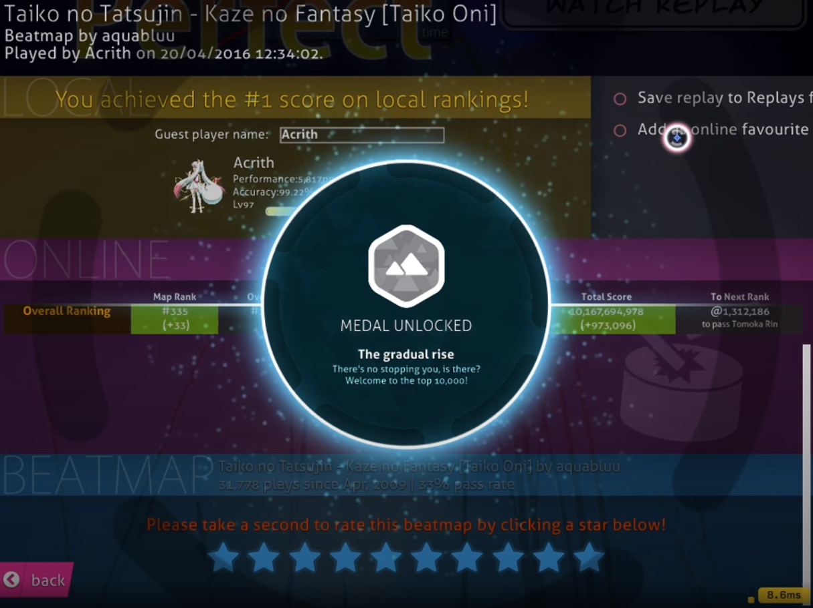
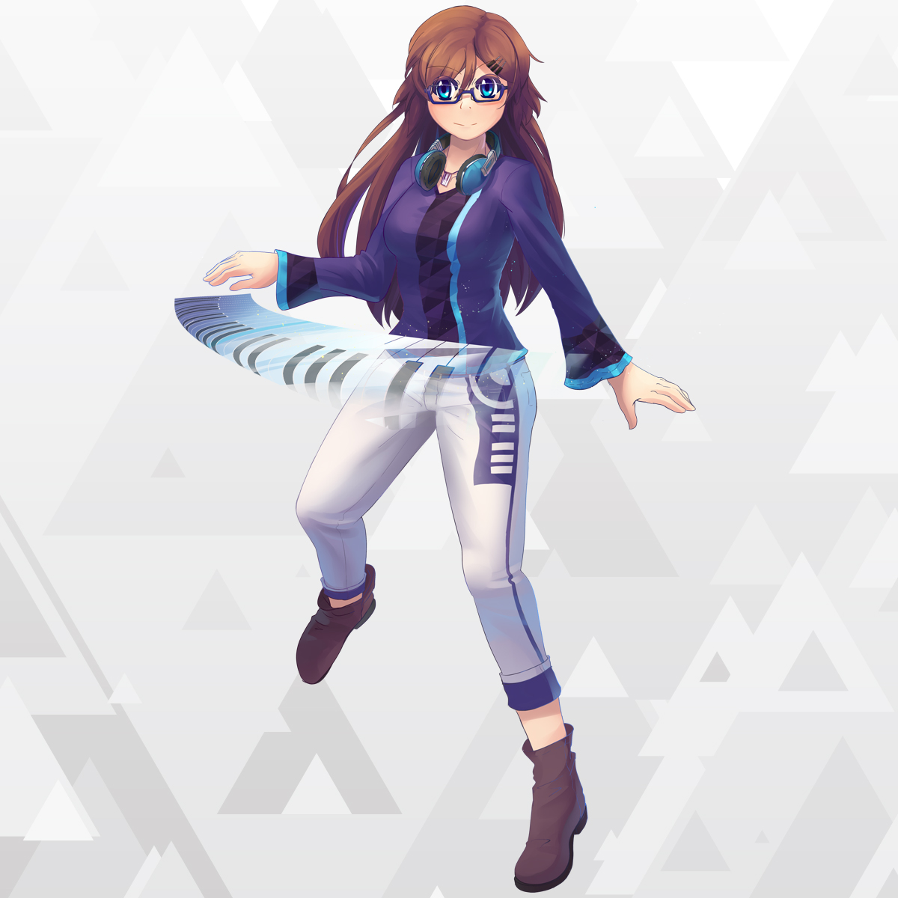
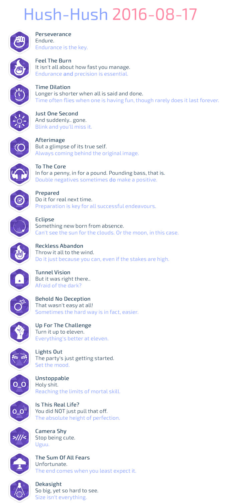

# History of osu! 2016

## January

**The ability to see live previews of a selected skin in the options menu was re-implemented on 28 January 2016 after having been removed two years prior.** The feature was initially removed in 2014 due to an options menu rework.[^osu-weekly-47][^jan-28-changelog]

## February

**Two new items were added to the osu!store in February: the osu!mug, and the osu!go.** The former was a typical coffee mug with custom osu! designs on it ($15 USD at launch), while the latter was a USB stick preloaded with the osu! client, capable of playing osu! directly out of it ($50 USD at launch).[^osu-weekly-48][^osu-go-post]<!--dates missing-->

 and the osu!go (right)")

**On 13 February 2016, a new rule change that attempted to change the then-current difficulty spread criteria for ranked beatmaps sparked massive backlash from the beatmapping community**.[^mapset-restructure-proposal]

While much of the response from the community was in disapproval of the new rule change (which attempted to limit the amount of difficulties allowed in a single ranked beatmap), a much larger discussion was started that centred around many users' discontent towards the osu! staff due to what they felt was a lack of transparency and player representation regarding then-recent changes in the BAT (Beatmap Appreciation Team) as well as the creation of the RCC (Ranking Criteria Council).[^mapset-restructure-proposal]

A few days after the incident (17 February), [Ephemeral](https://osu.ppy.sh/users/102335) made a post on [peppy's blog](https://blog.ppy.sh) attempting to clarify the matter with a timeline of events leading up to the situation and what the osu! team intended to do to resolve it. With this, it was revealed that many changes were being made with regards to the structure of the BAT, beatmapping in general, and ranking processes with little-to-no prior discussion or explicit approval from the BAT or QAT.[^meet-ephemeral][^mv2-timeline-doc]

Additionally, in response to the backlash from the community, Ephemeral promised that Ranking Criteria changes would be temporarily suspended and that the osu! team would commit to being more transparent in their processes:

> So, going forward, we aim to be entirely transparent with our thought processes leading up to the big decisions that impact everyone in the community.
>
> ...
>
> It is our hope that by placing the events leading up to the birth of these decisions into the public view, we can work together to find out the best way of moving forward from here, and to make sure that something like this does not happen again.
>
> We have suspended all movement in the Ranking Criteria changes for (at very least) the remainder of the week, and will use this time to gather your feedback and our thoughts on how we may best proceed from now on.

—Ephemeral, "Meet Ephemeral!"[^meet-ephemeral][^mv2-timeline-doc]

## March

**On the very first day of March, Ephemeral created the first in a series of posts on peppy's blog that would become the "Meeting Notes", which served as an attempt to provide more transparency between the osu! team and the community.** In these posts, Ephemeral would summarise the main objectives, ideas, and thoughts the team had towards the future into digestible bullet points. This first post was primarily geared towards improving the team and their communication across the board (with emphasis on beatmapping and modding).[^meeting-notes-2016-feb]

## April

**The modding panel on the new osu! website (new.ppy.sh) was set live for public testing on 11 April 2016**. However, the testing was only available for [Ice - L2 - Ascension : Act 2 (Liberation) (LordRaika)](https://osu.ppy.sh/beatmapsets/123760) and [Camellia - overcomplexification (ProfessionalBox)](https://osu.ppy.sh/beatmapsets/351408). According to [Loctav](https://osu.ppy.sh/users/71366), the main idea of the panel was to split problems into separate posts and then discuss them individually for easier tracking of issues and such as part of the steps towards implementing the long-awaited "Modding V2".[^mv2-feedback-thread]<!--wayback snapshot broken-->

**New medal designs were added to osu! on 14 April 2016.**[^medals-showcase-yt] They meant to be more in-line with the "[osu!next](https://osunext.tumblr.com/about)" design philosophy that was used in the [new osu! client](/wiki/Client/Release_stream/Lazer) (codenamed "lazer") and on the new website.[^osu-weekly-57][^apr-15-changelog]

**The first images of osu!mania's official mascot, Maria, were posted for the first time on 20 April 2016.** In celebration of Maria's introduction to the community, a brand new medal named "A meganekko approaches" was added to the game alongside a sprite of Maria being used as a combo burst in osu!mania.[^news-maria]

**The QAT (Quality Assurance Team) and their involvement in the beatmapping and modding processes were significantly changed on 25 April 2016.** The changes made were described by [Loctav](https://osu.ppy.sh/users/71366) in a forum post at the time:

> Going forward, the QAT will no longer be obligated to check every qualified beatmap for quality checks. Instead, they will be reactive in nature, responding to and addressing reports made by members of the community about a map's quality.
>
> We want to return the responsibility for mapping quality and content to the community at large, rather than delegating it to a small group of people to enforce. We believe this change will achieve this.
>
> ...
>
> Going forward, we will also be releasing a Code of Conduct regarding Mapping and Modding affairs. This will ensure that there will be a base level of respect in the talks surrounding these issues, as they have been prone to problems in the past. Ultimately, all parties involved in the ranking/mapping process have the same ultimate goal - to get cool stuff ranked and available for play as quickly as possible with as little issue as possible.

—Loctav, "Changes to the Quality Assurance Team"[^qat-changes-post]

Reception of the community towards this change was overall mostly positive. However, some users did have concerns as to whether or not this change would cause some beatmaps to become ignored without a guaranteed mod by a QAT member.[^qat-changes-post]

## May

**The very first osu! remix contest began on 6 May 2016.** "osu!remix" was a new contest that challenged participants to make a remix of the song [circles!](https://soundcloud.com/nekodex/circles) by [nekodex](https://osu.ppy.sh/users/102). The grand prize winner (chosen by osu! staff) would have their remix featured in osu! along with $250 USD in osu!store credit, a profile badge, and an official beatmapping contest featuring the remix. The secondary winner (chosen by community vote) would receive $50 USD in osu!store credit. The deadline for the contest was set to be 9 July 2016 (00:00 UTC).[^news-circles-remix-contest]

**A request for "early bird contributors" was made by [peppy](https://osu.ppy.sh/users/2) on 18 May 2016.** The request specifically asked for individuals with knowledge in [C#](https://en.wikipedia.org/wiki/C_Sharp_(programming_language)) 6.0 and enough free time and willingness to help clean up and refactor large areas of the new osu! client's codebase.[^early-bird-contributors] peppy also later asked for "reinforcements" in the form of additional contributors familiar with [Laravel](https://en.wikipedia.org/wiki/Laravel) and [React](https://en.wikipedia.org/wiki/React_(JavaScript_library)).[^ppy-tweet-may-31]

## June

**After nine months, the results for the first [Mapping With Rewards](https://blog.ppy.sh/post/129936251068/mapping-with-rewards-sep-2015) contest were released on 1 June 2016.** There were three winners chosen in the contest — one for each song: [monstrata](https://osu.ppy.sh/users/2706438) (won [Manic](https://osu.ppy.sh/beatmapsets/361175#osu/793620)), [alacat](https://osu.ppy.sh/users/869782#osu) (won [House With Legs](https://osu.ppy.sh/beatmapsets/360680#osu/793357)), [Guy](https://osu.ppy.sh/users/91738) (won [Dovregubben's Hall](https://osu.ppy.sh/beatmapsets/360950#osu/793190)). In addition to having their beatmaps bundled into the osu! installer, they also each received $50 USD in osu!store credit, and a unique profile badge as a prize.[^news-mwr-bounties]

**The [osu! Discord server](/wiki/Community/Discord_servers#official) was released to the public on 9 June 2016.** As announced on Twitter, the purpose of the server was to replace the public Slack team that was previously in place due to its lack of moderation controls. Anyone with the link to the Discord server would be able to join and follow along with osu! development, although they would not be able to speak in text channels unless specifically given access to by a moderator.[^ppy-tweet-june-09][^osu-weekly-65]

## July

**A new contest challenging the community to create a new osu!taiko mascot design that would replace pippidon, the old mascot, was announced and began on 18 July 2016.** The winner of the contest would have their design formally accepted as the official osu!taiko mascot, receive an **osu!artist** user title, 12 months of osu!supporter, and $50 USD in osu!store credit. The set deadline for entries was 16 August 2016 (00:00 UTC).[^news-osu-mascot-design-contest]

**Changes towards how prizes were awarded for tournaments were made and announced on 24 July 2016.** Due to the increasing amount of community-run tournaments being started around that time, the osu! team felt that a system of credits that could be exchanged for osu!supporter tags would be more helpful and easier to keep track of for tournament planners and players. The credits awarded to contestants would be kept track of in a provided Google Sheet.[^osu-weekly-70]<!-- Google Sheet unavailable due to locked forum thread: https://osu.ppy.sh/community/forums/topics/481791 -->

## August

**A new set of "Hush-Hush" medals arrived on 17 August 2016** and were gradually rolled out over the following day. Users could tell if a new medal was obtainable in osu! if it was visible on the new website (new.ppy.sh).[^news-hush-hush-medals] The medals that were announced to be added are shown below.

**Results for the first "osu!remix" contest were formally announced on 29 August 2016**:

| Placing | Track | Artist | Prize(s) |
| :-- | :-: | :-: | :-- |
| **Staff vote** | [HDHR](https://soundcloud.com/billiummoto/hdhr) | [BilliumMoto](https://osu.ppy.sh/users/3862471) | Track featured as an official contest beatmap, $250 USD osu!store credit, unique profile badge |
| **First place community vote** | HDHR | BilliumMoto | N/A |
| **Second place community vote** | [circles! (黒皇帝 Remix)](https://soundcloud.com/dialgadu77/circles-remix) | [Sayaka-](https://osu.ppy.sh/users/398275) | $50 USD osu!store credit |
| **Third place community vote** | [circles! (happy30 Remix)](https://soundcloud.com/happy30/circles-happy30-remix) | [happy30](https://osu.ppy.sh/users/27767) | Honourable mention |

Although BilliumMoto won first place in the community vote, the prize for the community vote winner ($50 USD in osu!store credit) was awarded to the runner-up, Sayaka, as BilliumMoto had already won the staff vote and its prizes.[^news-circles-remix-contest-results]

## September

**Results for the community vote on the osu!taiko mascot contest were formally announced on 21 September 2016**:

, Alisa (middle), and Tama (right)")

| Placing | Character | Artist | Prize(s) |
| :-- | :-: | :-: | :-- |
| **First place** | Aiko | [JMC](https://osu.ppy.sh/users/774010) | **osu!artist** user title, 12 months of osu!supporter, $50 USD osu!store credit |
| **Second place** | Alisa | [\[ Glitch \]](https://osu.ppy.sh/users/3781400) | 3 months of osu!supporter |
| **Third place** | Tama | [crystalsuicine](https://osu.ppy.sh/users/9974) | 1 month of osu!supporter |

Despite these rankings and rewards, users were reminded that the official mascot of osu!taiko would still be up to a staff vote, regardless of community vote results, although the mascot chosen by staff did not end up being announced by the end of the year.[^news-taiko-mascot-voting][^news-taiko-mascot-voting-results]

## October

**The GMT (Global Moderation Team) began taking applications for the first time in its history on 15 October 2016.** Previously, members of the GMT would be inducted via process of nomination or recommendation by other GMT members. However, due to a recent increase in demand for more members, the team decided that it would need to reach out to the community more:

> Over the past few months, we've been trying to get more in touch with the community as a whole. As a part of these efforts, we are now accepting applications from anyone who wishes to join the Global Moderation Team.
>
> ...
>
> As osu!next draws closer, we'll be making more efforts to get the community involved again. A big part of the rework involves not only redesigning the website and game client, but also how the community operates as well. We're very big on letting the community guide the course of the game, and it is our hope that by expanding the team with fresh new faces and outlooks, we'll be better able to achieve this going forward.

—[shARPII](https://osu.ppy.sh/users/776257), "GMT Applications Now Open"[^news-gmt-applications]

The applications that were given out at the time were different from BN (Beatmap Nominator) applications in that simply filling out a form with "good answers" would not guarantee a position: users who were of interest to the GMT would be spoken to by the GMT and further inspection would follow from there. Additionally, there was not a limited number of "spots" available for the GMT. If the team felt someone was qualified for the position, they would add them, regardless of the amount of current members.[^news-gmt-applications]

**Open testing for the "Loved" ranking status for beatmaps was formally started and announced on 17 October 2016.** The category, intended for beatmaps held in very high regard by the community at large, allowed beatmaps to have official online leaderboards, with the caveat that they would not grant users performance points for any plays. The purpose of this was to highlight beatmaps that may not have met ranking criteria to still be given online leaderboards and a more "official" recognition for their beloved status in the community.[^news-loved]

In its [announcement newspost](https://osu.ppy.sh/home/news/2016-10-17-here-comes-the-love), a set of pre-selected beatmaps were given the Loved status:

- [mocchie - Nyan Nyan Drive (D: (caren_sk)](https://osu.ppy.sh/beatmapsets/106318)
- [The Quick Brown Fox - PACEMAKER (Kyshiro)](https://osu.ppy.sh/beatmapsets/180771)
- [DM Ashura - deltaMAX (rustbell)](https://osu.ppy.sh/beatmapsets/18315)
- [Omoi - Snow Drive (Arieeru)](https://osu.ppy.sh/beatmapsets/291154)
- [The Quick Brown Fox - Big Money (Blue Dragon)](https://osu.ppy.sh/beatmapsets/293705)
- [Nakajima Megumi - TRY UNITE! (aran Remix) (lahphnya)](https://osu.ppy.sh/beatmapsets/319815)
- [Kitsune^2 - Free (Starrodkirby86)](https://osu.ppy.sh/beatmapsets/342207)
- [xi - Garyou Tensei (fartownik)](https://osu.ppy.sh/beatmapsets/344371)
- [tokiwa yuu - shounen ripples (lahphnya)](https://osu.ppy.sh/beatmapsets/356426)
- [ZiGZaG HACKER - V^3 (Hello World) (rustbell)](https://oszu.ppy.sh/beatmapsets/365053)
- [Fleshgod Apocalypse - The Deceit / The Violation (Mazzerin)](https://osu.ppy.sh/beatmapsets/367631)
- [sHimaU - Slotcore is Dead (Zapy)](https://osu.ppy.sh/beatmapsets/37065)
- [DJ Mass MAD Izm\* - SHAKUNETSU Beach Side Bunny (rustbell)](https://osu.ppy.sh/beatmapsets/409345)
- [Blue Stahli - Anti You (thatguy0815)](https://osu.ppy.sh/beatmapsets/42567)
- [Cardboard Box - The Limit Does Not Exist (Blue Dragon)](https://osu.ppy.sh/beatmapsets/429469)
- [Seether - Fake It ([Dellirium])](https://osu.ppy.sh/beatmapsets/48738)
- [Vektor - Recharging the Void (Mazzerin)](https://osu.ppy.sh/beatmapsets/489236)

Despite the first additions, users were reminded that the new ranking status was still in "open testing", and that the team still was not sure of how the specifics of getting a beatmap into Loved should work. Many different ideas for this were thrown around, although the first to be tested was a system of weekly community voting from a pool of ten maps chosen based on a "variety of factors".[^news-loved][^news-loved-2]

## References

[^osu-weekly-47]: [News post by Nyquill (2016-02-09) "osu!weekly #47"](https://osu.ppy.sh/home/news/2016-02-09-osuweekly-47)
[^jan-28-changelog]: [Cutting Edge 20160128 changelog](https://osu.ppy.sh/home/changelog/cuttingedge/20160128)
[^mapset-restructure-proposal]: [Forum thread by ztrot (2016-02-13) "Mapset and Spread Restructure (Proposed)"](https://osu.ppy.sh/community/forums/topics/420223)
[^meet-ephemeral]: [Blog post by ppy (2016-02-17) "Meet Ephemeral!"](https://blog.ppy.sh/post/139478794378/meet-ephemeral)
[^mv2-timeline-doc]: [Google Doc by Ephemeral (2016-02-17) "Timeline of Events Surrounding Recent Changes"](https://docs.google.com/document/d/1VlFUIte8ho4tssRCucSBt96nTVAhsCLfJZcFVgzHjuk/edit)
[^osu-weekly-48]: [News post by Nyquill (2016-02-16) "osu!weekly #48"](https://osu.ppy.sh/home/news/2016-02-16-osuweekly-48)
[^osu-go-post]: [Forum thread by DW10 (2016-02-26) "osu!go not worth it?"](https://osu.ppy.sh/community/forums/topics/425108)
[^meeting-notes-2016-feb]: [Blog post by ppy (2016-03-01) "2016-02 meeting notes"](https://blog.ppy.sh/post/140259300353/2016-02-meeting-notes)
[^mv2-feedback-thread]: [Forum thread by Loctab (2016-04-11) "Modding v2: Modding Panel - Feedback Thread"](https://osu.ppy.sh/community/forums/topics/442285)
[^osu-weekly-57]: [News post by Nyquill (2016-04-20) "osu!weekly #57"](https://osu.ppy.sh/home/news/2016-04-20-osuweekly-57)
[^apr-15-changelog]: [Cutting Edge 20160415 changelog](https://osu.ppy.sh/home/changelog/cuttingedge/20160415)
[^medals-showcase-yt]: [YouTube video by Acrith (2016-04-20) "osu! | How medals looks like? (Animations) | Achievements 20/04/2016"](https://www.youtube.com/watch?v=sdGe-Gv38Yw)
[^news-maria]: [News post by Ephemeral (2016-04-20) "Meet Maria - osu!mania's new mascot!"](https://osu.ppy.sh/home/news/2016-04-20-meet-maria-osumanias-new-mascot)
[^qat-changes-post]: [Forum thread by Loctav (2016-04-25) "Changes to the Quality Assurance Team"](https://osu.ppy.sh/community/forums/topics/447417)
[^news-circles-remix-contest]: [News post by Tasha (2016-05-06) "osu! 'circles!' Remix Contest"](https://osu.ppy.sh/home/news/2016-05-06-osu-circles-remix-contest)
[^early-bird-contributors]: [Blog post by ppy (2016-05-18) "Early-bird contributors"](https://blog.ppy.sh/post/144539340703/early-bird-contributors)
[^ppy-tweet-may-31]: [Tweet by @ppy (2016-05-31)](https://twitter.com/ppy/status/737529593184149504)
[^news-mwr-bounties]: [News post by Ephemeral (2016-06-01) "Mapping With Rewards #1 - Bounties Complete!"](https://osu.ppy.sh/home/news/2016-06-01-mapping-with-rewards-1-bounties-complete)
[^ppy-tweet-june-09]: [Tweet by @ppy (2016-06-09)](https://twitter.com/ppy/status/741107246965235713)
[^osu-weekly-65]: [News post by Nyquill (2016-06-24) "osu!weekly #65"](https://osu.ppy.sh/home/news/2016-06-24-osuweekly-65)
[^news-osu-mascot-design-contest]: [News post by deadbeat (2016-07-18) "osu! mascot design contest"](https://osu.ppy.sh/home/news/2016-07-18-osu-mascot-design-contest)
[^osu-weekly-70]: [News post by deadbeat (2016-08-07) "osu!weekly #70"](https://osu.ppy.sh/home/news/2016-08-07-osuweekly-70)
[^news-hush-hush-medals]: [News post by Ephemeral (2016-08-17) "New Hush-Hush Medals!"](https://osu.ppy.sh/home/news/2016-08-17-new-hush-hush-medals)
[^news-circles-remix-contest-results]: [News post by Ephemeral (2016-08-29) "osu!remix contest #1: Results"](https://osu.ppy.sh/home/news/2016-08-29-osuremix-contest-1-results)
[^news-taiko-mascot-voting]: [News post by deadbeat (2016-08-22) "osu!taiko mascot voting"](https://osu.ppy.sh/home/news/2016-08-22-osutaiko-mascot-voting)
[^news-taiko-mascot-voting-results]: [News post by Ephemeral (2016-09-21) "osu!taiko Mascot Community Vote Results"](https://osu.ppy.sh/home/news/2016-09-21-osutaiko-mascot-community-vote-results)
[^news-gmt-applications]: [News post by shARPII (2016-10-15) "GMT Applications Now Open"](https://osu.ppy.sh/home/news/2016-10-15-gmt-applications-now-open)
[^news-loved]: [News post by Ephemeral (2016-10-17) "Here Comes the Love"](https://osu.ppy.sh/home/news/2016-10-17-here-comes-the-love)
[^news-loved-2]: [News post by Ephemeral (2016-10-21) "Show Your Love!"](https://osu.ppy.sh/home/news/2016-10-21-show-your-love)
