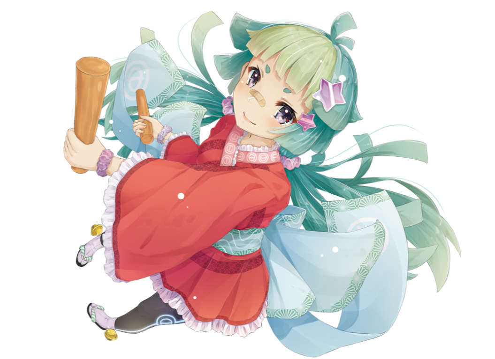

# History of osu! 2017

## February

**The first public osu!lazer pre-release build was released on 12 February 2017** [[1]][r].

## March

**Beatmap Spotlights were formally introduced to the public on 18 March 2017** [[2,3]][r]. First mentioned in a [developer meeting post on peppy's blog](https://blog.ppy.sh/post/149588555393/2016-08-dev-meeting "ppy blog"), Spotlights intended to fully replace the Ranking Charts that had been in place for so by following a system split into two "rubrics" as described in its [announcement newspost](https://osu.ppy.sh/home/news/2017-03-18-introducing-to-you-spotlights):

> Following this, the system will be split into two rubrics - one which will be in the interest of mappers and one which will be for players:
>
> - Spotlights: Similar to the previous Charts, this is where the most noteworthy maps of each month will be showcased, awarding the #1 placed mapper with 1 month of supporter. These maps will be included in the Beatmap Pack Listing.
> - Themed Spotlights: Released in a bi-monthly manner, at the end of these months players will be able to compete on themed compilations, such as "Electronic" or "Summer", awarding the #1 placed player with 1 month of supporter. Additionally, by completing a whole themed pack you will gain achievements.
>
> There's much more to come from Spotlights, but for now we will keep that a surprise (!) and stick with the common release of the monthly Spotlights while preparing the remaining upcoming changes. Additionally, we will release a pack you can gain achievements on by completing older chart packs every two months.

— OnosakiHito, "Introducing to you: Spotlights" [[2]][r]

## April

**Several significant updates to osu!lazer were made in April:**

- The beatmap details panel on the song select screen was added on 12 April 2017 [[4,5]][r]
- Rulesets became completely modular on 17 April [[6,7]][r]
- Player retry logic was improved to reduce/limit memory usage over time on 18 April [[8,9]][r]
- The Double Time, Nightcore, and Half Time mods were added on 21 April [[10]][r]

## May

**Several significant updates to osu!lazer were made in early May:**

- Playlist controls were added on 1 May 2017 [[11,12]][r]
- Nested dependency support was added on 2 May [[12,14]][r]
- The mod overlay was added on 8 May [[15]][r]

**On 9 May 2017 it was announced that osu! would attend [Anime Expo](https://lite.anime-expo.org/ "Anime Expo") 2017 as part of their 10th anniversary celebration** [[16]][r].

The general plan was to have a free-play set up of around eight computers to run tournaments for each day of the event. In addition to this, several panels would be run that would go further into the history of osu!, along with an open Q&A session with various team and community members. The event ran from 1–4 July 2017 at the Los Angeles Convention Center, and was remarked as being quite successful by many of those involved [[17,18]][r].

**After many months in the making, work on the new osu! website progressed enough to the point that the <new.ppy.sh> domain and the <osu.ppy.sh> domain could be merged.** Announced on 16 May 2017, peppy explained that, going forward, the osu! web team would be switching pages successively as they are ready to be used. Using the <new.ppy.sh> domain would automatically redirect users to <osu.ppy.sh> [[19]][r].

**After nearly a year in the making, the new, official osu!taiko mascot, Mocha, was revealed to the public on 25 May 2017.** The mascot was made by [Crowie](https://osu.ppy.sh/users/6894067) (ranked 21 on the community vote), and had a few changes made from its original design, primarily changes in hair and costume colour. The official end design (shown above) was illustrated by [flyte](https://osu.ppy.sh/users/3103765). A fan art contest was also held a few weeks afterward to honour the new mascot's entry [[20]][r].

## June

**[Raw input](https://osu.ppy.sh/community/forums/topics/187785) support and the Daycore mod were added to osu!lazer on 5 June 2017** [[21,22,23]][r].

**Seasonal main menu backgrounds received a new settings toggle that allowed users to have more control over which main menu backgrounds should be displayed when on 16 June 2017** [[24]][r]. Users gained three options on when to show seasonal backgrounds:

- `sometimes`: Seasonal backgrounds display for a few weeks at the beginning of each season; the team will choose when they will be removed and replaced with more plain backgrounds.
- `never`: Seasonal backgrounds will never be shown; defaults will be used in all cases.
- `always`: Seasonal backgrounds will always show.

## July

**The friends listing page was added to the osu! website on 14 July 2017** [[25,26]][r].

## August

**The inception of the osu! Coffee Hour was first unveiled on 15 August 2017** [[27]][r]. It's purpose was to be a bi-weekly, podcast-style talk show on the [osulive Twitch channel](https://www.twitch.tv/osulive "Twitch") featuring both osu! staff and prominent community members. They would discuss topics surrounding current events in osu! and would have a general theme, host, and one to three guests per episode. The first episode of osu! Coffee Hour would air on 18 August 2017 (23:00 UTC), and would be hosted by [HappyStick](https://osu.ppy.sh/users/256802) and [peppy](https://osu.ppy.sh/users/2); it would also be subsequently uploaded as a [VOD](https://en.wikipedia.org/wiki/Video_on_demand "Wikipedia") to YouTube on 23 August 2017 [[27,28]][r].

**On 21 August 2017, a new contest was announced that challenged community members to create a "new look" for osu!catch's mascot, Yuzu** [[29]][r]. The contest would follow similarly to the previous contest that had [decided the fate for Mocha](https://osu.ppy.sh/home/news/2017-05-25-the-new-osutaiko-mascot-is-here), where a community vote would be held to decide which entry had the best mascot, and a staff vote would be held to decide the actual, official mascot from those submissions. The top three winners of the community vote would receive six, four, and two months of osu!supporter for first, second, and third place respectively. The contest would remain open until 21 September 2017 [[29]][r].

## September

**After receiving largely negative reactions from a trial phase of a proposed Beatmap Nominator (BN) tier system for osu!, it was announced on 7 September 2017 that the aforementioned system would be abolished** [[30]][r]. This would mean that all existing Beatmap Nominators would be able to bubble and qualify beatmaps again. The tier system would be replaced in favour of a "probation" phase, whose members would be able to bubble beatmaps, but not qualify them:

> Whilst in this probationary period, Beatmap Nominators will be closely surveyed on their general attitude (forum posts, in-game chat, modding and icon activity, etc.) to ensure they receive the assistance needed to properly fulfill their roles as gatekeepers of content in the mapping and modding community. After a maximum of two months, Probationary Beatmap Nominators will be either promoted to full member status, allowing them the power to qualify mapsets, or removed from the group if their activity, behaviour or proficiency are found to be below our expected standards.

— JBHyperion, "The QAT Gazette: September 2017" [[30]][r]

**After an indefinite hiatus from new Loved beatmap additions, a new method of Loved voting was proposed and trialed on 25 September 2017 via the Loved "Captain's Pick"** [[31]][r]. The Captain's Pick followed the same voting process as in previous community votes, however the ten beatmaps that would be chosen for voting would be chosen by a top player in the respective game modes. The method was developed after many creators expressed concerns over the type and quality of maps that were gaining Loved status from community voting and star priority [[31,32,33,34]][r].

## October

**On 31 October 2017, a Halloween-themed update was issued that added Discord integration (also known as Discord Rich Presence) into osu!** [[35]][r]. As part of this integration, users would be able to see more detailed information about what a user was playing when clicking on their status; users would also be able to invite other players to play with them in a multiplayer game by clicking on the plus button next to the text box [[36]][r].

## November

**On 15 November 2017, a [new top play](https://www.youtube.com/watch?v=edogtxn6WSk "YouTube") by player [freedomdiver](https://osu.ppy.sh/users/8482062) on the beatmap [Ayase Rie - Yuima-ru*World TVver. (Fycho) [Ultimate]](https://osu.ppy.sh/beatmapsets/459149#osu/994495) sparked massive controversy across the community due to the circumstances surrounding the way in which it became the first 900pp play to ever be achieved in osu!** [[37]][r]. Specifically, these circumstances regard the fact that the play was achieved on a 30 second long beatmap via the use of a touchscreen-capable device (AKA a "touch device" or "touchscreen"), use of the mods Hidden, Nightcore, and Hard Rock, and the fact that it only amassed a total accuracy of 78.58%.

The primary issue that most users had with the play was the fact that it had been achieved via the use of a touchscreen, which, as many users reasoned, dramatically reduced the difficulty of the jumps in the beatmap, as such a device allowed players to use up to 10 localised points of input (i.e., their fingers), which required less travel distance and allowed for users to preemptively hover their fingers over where the cursor needed to be for the next hit object(s) [[38,39]][r].

In addition to this, many users were also upset with the fact that it was the first play to ever achieve 900pp, yet had been achieved on a beatmap that was less than a minute long and only gained an accuracy of 78.58%, whereas many previous historical pp records required endurance to play through longer beatmaps with a much higher accuracy. This led to many users expressing that they felt that the performance points system was broken or unfair, and that it should not have allowed for a relatively easy beatmap to reward very high amounts of pp [[40,41]][r].

On the contrary, however, other users felt as if these issues were blown out of proportion, or that there were no issues with the play at all. Although largely scattered in opinions, many argued that the use of a touchscreen actually did take a significant amount of skill to play with, citing that freedomdiver took quite a few hours to be able to achieve the score on the day it was set, and that they had played the beatmap approximately 600 times prior to the score. Additionally, some pointed out that even after 600 plays on the same beatmap, the accuracy was still 78.58%, which could imply that touch devices are much harder to master, and thus should be held on the same pedestal as tablets and mice [[42,43]][r].

Overall, though, almost everyone agreed that—touchscreen or not—the play was not worthy of the pp given due to the beatmap's short length and the play's low accuracy. What was not agreed upon, though, was how to resolve the issue: some players suggested adjusting the performance points algorithm to more heavily favour higher accuracy plays or focus less on the aspect of aim, others suggested making touchscreen-only leaderboards, while others wanted to ban touchscreen players entirely.

Following this, [peppy](https://osu.ppy.sh/users/2) made a [forum post](https://osu.ppy.sh/community/forums/topics/665986) on 17 November addressing the situation, their thoughts, and what the future holds for touchscreen players and the pp system. While nothing concrete was promised, peppy asked users to continue enjoying the game, and reassured them that the team was actively looking into a solution to the situation [[39]][r].

## December

**On 10 December 2017, the [@osugame](https://twitter.com/osugame "Twitter") Twitter account [posted an update](https://twitter.com/osugame/status/939815301524287488 "Twitter") regarding the "touchscreen nerf"**, which would be a mod that would be applied to scores set using touch devices and would devalue the pp gained across the board. The nerf came out that day and recalculations for previously-set scores rolled out throughout the week. This nerf would stand as the permanent solution in response to the controversy over touchscreen scores in November [[44]][r].

## References

1. [Release v0.0.3 - GitHub](https://github.com/ppy/osu/releases/tag/v0.0.3 "Github")
2. [Introducing to you: Spotlights - osu!](https://osu.ppy.sh/home/news/2017-03-18-introducing-to-you-spotlights)
3. [2016-08 Dev Meeting - ppy blog](https://blog.ppy.sh/post/149588555393/2016-08-dev-meeting "ppy blog")
4. [2017 04 12 - ppy blog](https://blog.ppy.sh/2017-04-12/ "ppy blog")
5. [Beatmap Details #574 - GitHub](https://github.com/ppy/osu/pull/574 "GitHub")
6. [Remove PlayMode enum and make Rulesets modular #640 - GitHub](https://github.com/ppy/osu/pull/640 "GitHub")
7. [2017 04 17 - ppy blog](https://blog.ppy.sh/2017-04-17/ "ppy blog")
8. [2017 04 18 - ppy blog](https://blog.ppy.sh/2017-04-18/ "ppy blog")
9. [Memory increase on restart fix #644 - GitHub](https://github.com/ppy/osu/pull/644 "GitHub")
10. [2017 04 21 - ppy blog](https://blog.ppy.sh/2017-04-21/ "ppy blog")
11. [2017 05 01 - ppy blog](https://blog.ppy.sh/2017-05-01/ "ppy blog")
12. [Playlist #687 - GitHub](https://github.com/ppy/osu/pull/687 "GitHub")
13. [2017 05 02 - ppy blog](https://blog.ppy.sh/2017-05-02/ "ppy blog")
14. [Add basic nested DI support. #685 - GitHub](https://github.com/ppy/osu-framework/pull/685 "GitHub")
15. [2017 05 08 - ppy blog](https://blog.ppy.sh/2017-05-08/ "ppy blog")
16. [osu! at anime expo 2017 - osu!](https://osu.ppy.sh/home/news/2017-05-09-osu-at-anime-expo-2017)
17. [osu! at Anime Expo 2017 - YouTube](https://www.youtube.com/watch?v=8Whaj3PHq3gf "YouTube")
18. [2017.717.0 - ppy blog](https://blog.ppy.sh/2017.717.0/ "ppy blog")
19. [2017 05 16 - ppy blog](https://blog.ppy.sh/2017-05-16/ "ppy blog")
20. [The new osu!taiko mascot is here! - osu!](https://osu.ppy.sh/home/news/2017-05-25-the-new-osutaiko-mascot-is-here)
21. [2017.605.0 - ppy blog](https://blog.ppy.sh/2017.605.0/ "ppy blog")
22. [Add settings for toggling raw input and adjusting sensitivity #893 - GitHub](https://github.com/ppy/osu/pull/893 "GitHub") 
23. [Mod Suggestion: Daycore #883 - GitHub](https://github.com/ppy/osu/pull/883 "GitHub")
24. [main menu background changes - osu!](https://osu.ppy.sh/community/forums/topics/606931)
25. [2017.717.0 - ppy blog](https://blog.ppy.sh/2017.717.0/ "ppy blog")
26. [Merge pull request #1307 from nekodex/friends - GitHub](https://github.com/ppy/osu-web/commit/1b689fde1f6d931d10f312c26510674102607c9e "GitHub")
27. [Introducing the osu! Coffee Hour - osu!](https://osu.ppy.sh/home/news/2017-08-15-introducing-the-osu-coffee-hour)
28. [osu! Coffee Hour #1 ☕ The osu! community and the future - YouTube](https://www.youtube.com/watch?v=lmggLK8BeNY&list=PLmWVQsxi34bPicSo93oPXnwwjr-X7nBmo "YouTube")
29. [Yuzu's New Look Contest - osu!](https://osu.ppy.sh/home/news/2017-08-21-yuzus-new-look-contest)
30. [The QAT Gazette: September 2017 - osu!](https://osu.ppy.sh/home/news/2017-09-07-qat-gazette-september-2017)
31. [Introducing the Loved Captain's Pick - osu!](https://osu.ppy.sh/home/news/2017-09-25-introducing-the-loved-captains-pick)
32. [osu! Coffee Hour #2 ☕ "Loved" Beatmaps - YouTube](https://www.youtube.com/watch?v=JYLITcBYkC4 "YouTube")
33. [Let's talk about Loved. - osu!](https://osu.ppy.sh/community/forums/topics/601062)
34. [Loved Captain's Pick (osu!) - osu!](https://osu.ppy.sh/community/forums/topics/646584)
35. [Halloween Descends - osu!](https://osu.ppy.sh/home/news/2017-10-31-halloween-descends)
36. [Discord RPC - join multiplayer (and more) from Discord! - osu!](https://osu.ppy.sh/community/forums/topics/659856)
37. [freedomdiver | Ayase Rie - Yuima-ru*World TVver. [Ultimate] +HD,NC,HR | 78.58% 900pp | Livespectate! - YouTube](https://www.youtube.com/watch?v=edogtxn6WSk "YouTube")
38. [Is Touchscreen Ruining osu!? (Outdated) - YouTube](https://www.youtube.com/watch?v=hmARjSwp2w4 "YouTube")
39. [osu!, touchscreens and you - osu!](https://osu.ppy.sh/community/forums/topics/665986)
40. [hi-mei comment: "osu!, touchscreens and you" - osu!](https://osu.ppy.sh/community/forums/posts/6357097)
41. [-Makishima S- comment: "osu!, touchscreens and you" - osu!](https://osu.ppy.sh/community/forums/posts/6357383)
42. [Vaarka comment: "freedomdiver | Ayase Rie - Yuima-ru*World TVver. [Ultimate] +HD,NC,HR | 78.58% 900pp | Livespectate!" - YouTube](https://www.youtube.com/watch?v=edogtxn6WSk&lc=UgwJSrwfXxNS4CahDel4AaABAg "YouTube")
43. [[Zeth] comment: "osu!, touchscreens and you" - osu!](https://osu.ppy.sh/community/forums/posts/6357375)
44. [10 Dec 2017 (16:13 UTC) @osugame tweet - Twitter](https://twitter.com/osugame/status/939815301524287488 "Twitter")

[r]: #references
