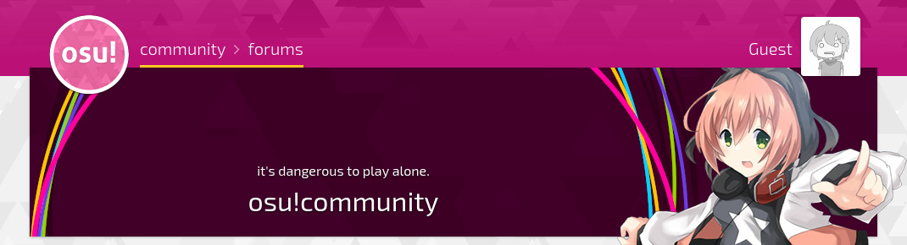
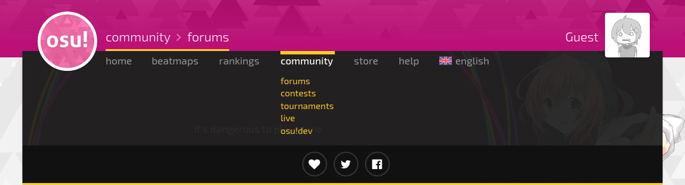
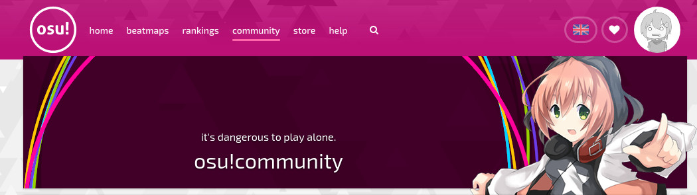
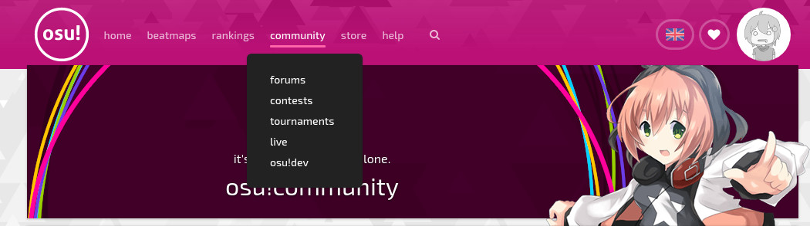

# Historia de osu! de 2018

## Enero

Después de seis meses de inactividad, flyte publicó en el blog [osu!next](https://osunext.tumblr.com) algunas imágenes del próximo diseño del sitio web. Explicó que el estado actual del sitio web presentaba muchos problemas relacionados con la experiencia del usuario, desde diversas especificaciones funcionales hasta las opiniones de los usuarios, que no se tuvieron en cuenta a la hora de diseñarlo. Desde entonces, se había tomado un tiempo para rediseñar desde cero el diseño actual del sitio web.

Se abrieron las inscripciones para la osu!mania 7K World Cup 2018. Se abrieron las votaciones del Community Choice 2017 (antes conocido como «Best of»).

En la versión [lazer](/wiki/Client/Release_stream/Lazer) de osu! se añadió el desenfoque del fondo y el mod hidden. La velocidad de desplazamiento de osu!mania fue implementada. Gracias a cYsmix, se añadió un nuevo conjunto de hitsounds predeterminados. osu!catch fue mejorado enormemente y el juego automático fue arreglado para ser más humano.

En la osu!web, se mejoraron los listados de los paquetes de beatmaps, y los contadores de hypes y nominaciones se hicieron visibles en los listados de beatmaps. Se hizo más fácil copiar un enlace permanente a una discusión de un beatmap, las localizaciones ahora podrían cambiar el tamaño del menú al pasar el ratón por encima de las mismas, se podrían ver las calificaciones por estrellas en la lista de beatmaps al pasar el ratón por encima del icono de dificultad y se añadió la ordenación de las discusiones de beatmaps. Se implementó un límite para cargar solo 250 hilos del foro y dejar los demás sin cargar para evitar un gran consumo de memoria.

peppy tuiteó que el nuevo lote de camisetas (junto con sus nuevos diseños) ya había llegado. Seis días después, ya estaban en la osu!store.

La posibilidad de ver las calificaciones por estrellas en osu!direct se adaptó desde la versión lazer del cliente de osu!. Por último, gracias a nekodex, se llevó a cabo el rediseño del marcador de puntuaciones.

peppy abrió brevemente un problema en GitHub para discutir sobre la *HP pasiva*.

Enlaces:

- [osu!next](https://osunext.tumblr.com/post/169336245023/hi-its-been-6-months-since-my-last-post-rest)
- [osu!mania 7K World Cup 2018: Registrations now open!](https://osu.ppy.sh/home/news/2018-01-10-MWC7K-2018-registrations-open)
- [Dean Herbert en Twitter](https://twitter.com/ppy/status/951884503122784257)
- [Community Choice 2017](https://osu.ppy.sh/home/news/2018-01-18-community-choice-2017)
- [dev changelog 20180120 - blog de ppy](https://blog.ppy.sh/dev-changelog-20180120/)
- [Dean Herbert en Twitter](https://twitter.com/ppy/status/956058435845611521)
- [Dean Herbert en Twitter](https://twitter.com/ppy/status/958185268258865152)
- [Dean Herbert en Twitter](https://twitter.com/ppy/status/958220599783866368)
- [ppy/osu-web#2292](https://github.com/ppy/osu-web/pull/2292)
- [ppy/osu#1990](https://github.com/ppy/osu/issues/1990)
- [dev changelog 20180128 - blog de ppy](https://blog.ppy.sh/dev-changelog-20180128/)

## Febrero

En la versión [lazer](/wiki/Client/Release_stream/Lazer) del cliente de osu!, se implementaron los infames sliders estilo catmull; permitiendo así que los beatmaps más antiguos se jugaran de la forma en que fueron pensados. Se rediseñó el botón de revertir en las opciones. Las estadísticas SS+ y S+ ahora estaban visibles. Ahora aparecería el marcador de puntuaciones de osu!catch, lo que permitiría a los jugadores completar realmente una partida de osu!catch. cYsmix estuvo trabajando para crear los nuevos hitsounds predeterminados. Se implementó el silenciamiento del cliente a través de teclas de acción, sin embargo, el diseño aún estaba en progreso. Se añadió el manejo de las URL dentro del juego y se dijo que se mantendrían (abrir canales del chat o enlaces de osu! usarían el cliente, en lugar de dejar que se abrieran a través de un navegador web). Los ajustes visuales podrían realizarse en la «pantalla de carga». La importación de las repeticiones volvió a funcionar.

En la osu!web, el tiempo total de juego se implementó en los perfiles de los usuarios. Elasticsearch fue actualizado. El antiguo sitio se dejó de usar casi por completo (ahora había un nuevo banner presente en casi todas partes del antiguo sitio, que enlazaba a los usuarios con el nuevo). Se añadieron los géneros e idiomas a las páginas de los beatmaps. La actividad reciente ahora mostraba la opción «mostrar más». Se mejoró la búsqueda de usuarios. Se cambiaron los iconos de los temas del foro para que fueran más fáciles de usar para las personas daltónicas. Los usuarios ahora podían establecer su modo de juego predeterminado (mostrado con una estrella junto al modo de juego) en sus perfiles de usuario, en lugar de usar el último modo de juego visualizado. Los registros de cambios ahora tenían una promoción de osu!supporter en la parte inferior. Ahora se podía ver una barra de experiencia para el nivel del usuario pasando el ratón por encima de la insignia de nivel.

Se publicaron los resultados del Community Choice 2017 con Doormat, Backfire, Ascendance y Protastic101 como ganadores de los votos de la comunidad en osu!, osu!taiko, osu!catch y osu!mania, respectivamente.

Enlaces:

- [dev changelog 20180206 - blog de ppy](https://blog.ppy.sh/dev-changelog-20180206/)
- [ppy/osu#2003](https://github.com/ppy/osu/pull/2003)
- [ppy/osu#2011](https://github.com/ppy/osu/pull/2011)
- [ppy/osu#2004](https://github.com/ppy/osu/pull/2004)
- [ppy/osu#1999](https://github.com/ppy/osu/pull/1999)
- [ppy/osu#1997](https://github.com/ppy/osu/pull/1997)
- [ppy/osu#1667](https://github.com/ppy/osu/pull/1667)
- [ppy/osu-web#2262](https://github.com/ppy/osu-web/pull/2262)
- [ppy/osu-web#2290](https://github.com/ppy/osu-web/pull/2290)
- [dev changelog 20180213 - blog de ppy](https://blog.ppy.sh/dev-changelog-20180213/)
- [ppy/osu-web#2331](https://github.com/ppy/osu-web/pull/2331)
- [Community Choice 2017 Results](https://osu.ppy.sh/home/news/2018-02-20-community-choice-2017-results)
- [dev changelog 20180222 - blog de ppy](https://blog.ppy.sh/dev-changelog-20180222/)
- [ppy/osu-web#2373](https://github.com/ppy/osu-web/pull/2373)
- [ppy/osu-web#2412](https://github.com/ppy/osu-web/pull/2412)
- [ppy/osu-web#2379](https://github.com/ppy/osu-web/pull/2379)
- [ppy/osu-web#2409](https://github.com/ppy/osu-web/pull/2409)
- [ppy/osu-web#2449](https://github.com/ppy/osu-web/pull/2449)
- [ppy/osu-web#2448](https://github.com/ppy/osu-web/pull/2448)

## Marzo

Trial & Error fue presentado como nuevo artista destacado.

En la versión [lazer](/wiki/Client/Release_stream/Lazer) de osu!, se implementó el soporte básico para el skinning. Se redujo el efecto de paralaje durante el juego.

En la osu!web, se añadieron los gráficos del historial de jugadas y del historial de repeticiones vistas por otros (el diseño era temporal) y el recuento de publicaciones en los perfiles de los usuarios. La vista móvil del sitio web tendría ahora un cuadro de búsqueda específico. Los títulos de las páginas se reorganizaron para dar prioridad al nombre de la página (en lugar del nombre del juego) y facilitar la navegación entre pestañas. Los resultados de la búsqueda en el foro estarían ordenados por temas. Gracias a nanaya, las insignias de usuario se mostrarían en las páginas de los usuarios.

El 13 de marzo de 2018, peppy abrió el canal `#ranking-procedures` (ahora llamado `#modding`) en el Discord osu!dev para dar a los BN y miembros del QAT un área para discutir temas sobre los que quieren que se actúe. Esto se hizo para permitir discusiones más transparentes y abiertas, pero también para evitar que personas ajenas asumieran que el «osu! staff» era el que tomaba las decisiones de los BN y los miembros del QAT.

La MWC 7K 2018 concluyó con Corea del Sur, Malasia y China ocupando el primer, segundo y tercer puesto, respectivamente.

Enlaces:

- [New Featured Artist: Trial & Error](https://osu.ppy.sh/home/news/2018-03-06-new-featured-artist-trial-and-error)
- [dev changelog 20180306 - blog de ppy](https://blog.ppy.sh/dev-changelog-20180306/)
- [ppy/osu#2134](https://github.com/ppy/osu/pull/2134)
- [ppy/osu-web#2608](https://github.com/ppy/osu-web/pull/2608)
- [ppy/osu-web#2597](https://github.com/ppy/osu-web/pull/2597)
- [ppy/osu-web#2578](https://github.com/ppy/osu-web/pull/2578)
- [ppy/osu-web#2531](https://github.com/ppy/osu-web/pull/2531)
- [ppy/osu-web#2332](https://github.com/ppy/osu-web/pull/2332)
- [osu!mania 7K World Cup 2018 Concludes](https://osu.ppy.sh/home/news/2018-03-22-mwc-7k-2018-concludes)

## Abril

La galleta del menú principal giraba lentamente en el sentido de las agujas del reloj a medida que pasaba el tiempo. Mientras que la galleta del selector de canciones giraría lentamente en sentido contrario a las agujas del reloj. Si se pasaba el ratón por encima, la galleta aumentaba de tamaño como de costumbre, pero también giraría más rápido.

---

Se actualizó la insignia de contribuidor de la comunidad para adaptarla al nuevo diseño de las insignias de usuario, dando forma a las pautas sobre el aspecto de las insignias de usuario actuales y futuras.

---

En la osu!web, gracias a nanaya, se actualizó el encabezado para que coincida con el nuevo diseño de flyte. Se añadió a las páginas de los usuarios la opción de mostrar el historial de los nombres de usuario. El historial de los nombres de usuario ahora era visible y las páginas desaparecidas de los usuarios ahora mostraban un mensaje similar al del sitio antiguo, en lugar de dar la vaga página 404.

---

Gracias a nekodex, el estado de osu!supporter ahora era visible en la página de [apoya el juego](https://osu.ppy.sh/home/support) y se implementó la adición de tu nombre de usuario de Discord a tu cuenta de usuario.

---

Enlaces:

- [ppy/osu-web#2906](https://github.com/ppy/osu-web/pull/2906)
- [ppy/osu-web#2896](https://github.com/ppy/osu-web/pull/2896)
- [ppy/osu-web#2984](https://github.com/ppy/osu-web/pull/2984)
- [ppy/osu-web#3033](https://github.com/ppy/osu-web/pull/3033)
- [ppy/osu-web#2984](https://github.com/ppy/osu-web/pull/2984)
- [ppy/osu-web#3099](https://github.com/ppy/osu-web/pull/3099)
