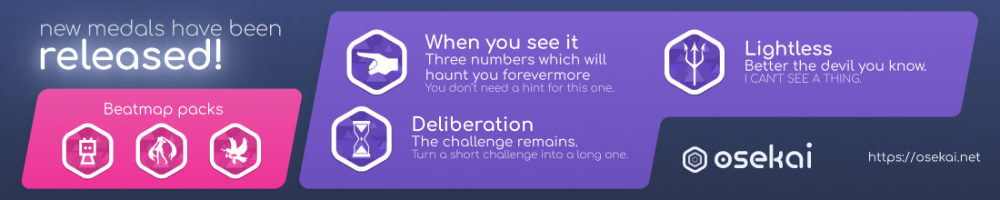
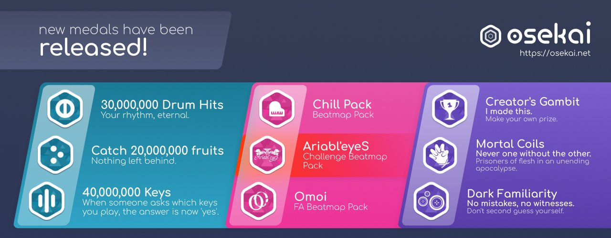
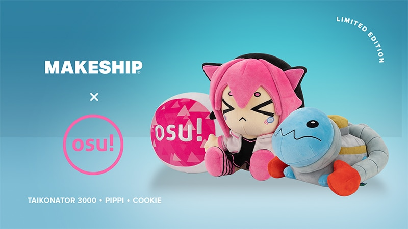

# Historia de osu! de 2022

## Enero

Más artistas se unieron al programa de [artistas destacados](/wiki/People/Featured_Artists) a principios de año, siendo estos: [NIWASHI](https://osu.ppy.sh/beatmaps/artists/228), [DGK](https://osu.ppy.sh/beatmaps/artists/229), [Haywyre](https://osu.ppy.sh/beatmaps/artists/230), [satella](https://osu.ppy.sh/beatmaps/artists/231), [Vansire](https://osu.ppy.sh/beatmaps/artists/232), [Boom Kitty](https://osu.ppy.sh/beatmaps/artists/233), [Annabel](https://osu.ppy.sh/beatmaps/artists/234) y [Maduk](https://osu.ppy.sh/beatmaps/artists/235).

El 9 de enero, el [osu! team](/wiki/People/osu!_team) realizó una [reunión con la comunidad](/wiki/Community/osu!_community_meetings), en la que se abordaron las mecánicas de HP y otras cuestiones generales con miembros de la comunidad.[^community-meeting-hp] En particular, muchos jugadores de osu!mania comentaron que querían que el drenaje de HP de osu!(lazer) fuera menos severo, ya que osu!mania en osu!(stable) no tenía drenaje pasivo, al contrario que osu!(lazer) en aquel momento. [peppy](https://osu.ppy.sh/users/2) mencionó que le gustaría estandarizar el drenaje de HP entre todos los modos de juego para simplificar la experiencia para los recién llegados a lazer. Dos semanas después, el 22 de enero, se realizó otra reunión con el osu! team detallando el continuo desarrollo y contestando a varias preguntas de la comunidad.[^community-meeting-dev]

Se añadió una nueva función al editor de osu!(lazer) que permite a los mappers rotar contenido seleccionado mediante un botón.[^editor-rotate] Mientras tanto, se implementó en el cliente un nuevo sistema de base de datos llamado [Realm](https://realm.io/), que proporciona mayor eficacia y fiabilidad. Se agregó una barra de progreso al comienzo del juego mientras se realizaba la migración, ya que podría llevar un tiempo si había grandes cantidades de beatmaps y otros datos.[^realm]

En la página, los usuarios son ahora capaces de anclar cualquiera de sus puntuaciones y reordenarlas en su perfil.[^score-pin][^score-pin-reorder]

## Febrero

[bill wurtz](https://osu.ppy.sh/beatmaps/artists/236), [Atavistia](https://osu.ppy.sh/beatmaps/artists/237), [HEAD PHONES PRESIDENT](https://osu.ppy.sh/beatmaps/artists/238), [MisoilePunch](https://osu.ppy.sh/beatmaps/artists/239), [Good Kid](https://osu.ppy.sh/beatmaps/artists/240), [Riya](https://osu.ppy.sh/beatmaps/artists/241), [Rabbit House](https://osu.ppy.sh/beatmaps/artists/242) y [MisomyL](https://osu.ppy.sh/beatmaps/artists/243) se convirtieron en artistas destacados.

En enero, el osu! team abrió una [encuesta para osu!taiko y osu!mania](https://osu.ppy.sh/home/news/2022-01-14-taiko-mania-pp-sr-survey) para determinar qué es lo que la comunidad espera de los puntos de rendimiento y el sistema de calificación por estrellas. Los resultados de la encuesta, visibles [aquí para osu!taiko](https://assets.ppy.sh/surveys/2022-pp-taiko/viewer.htm?v=9) y [aquí para osu!mania](https://assets.ppy.sh/surveys/2022-pp-mania/viewer.htm?v=2),[^pp-survey] impulsaron la formación de un panel para osu!mania y osu!taiko en el [comité de puntos de rendimiento](/wiki/People/Performance_Points_Committee) más tarde ese mismo año.

El 6 de febrero se realizó la tercera reunión con la comunidad del año, dedicada a diversas preguntas de la comunidad.[^community-meeting-questions] El 20 de febrero, se llevó a cabo otra reunión con la comunidad sobre los multiplicadores y la puntuación de los mods, debido a que osu!(lazer) permite ajustes de tasa variable para algunos mods. Por ejemplo, Double Time puede ser ajustado para dar una velocidad de 1,01x, en lugar de solo 1,5x como en stable. Esto le daría a los jugadores una ventaja injusta en las tablas de clasificación, ya que los jugadores aún recibirían el multiplicador de puntuación fijo de 1,12x. Como consecuencia, los multiplicadores de los mods se desactivaron temporalmente. El osu! team quiere trabajar en una solución más sólida en el futuro.[^community-meeting-mod]

osu!(lazer) recibió el mod Aim Assist como una nueva característica que atrae los objetos hacia el cursor, lo que esencialmente requiere menos movimiento del cursor por parte del jugador.[^aim-assist] El mod pasó a llamarse Magnetised un mes después de la implementación inicial.[^aim-assist-rename] Además, también se agregó el mod Alternate, que requiere que el jugador *alterne* entre dos teclas al presionar los círculos.[^alternate] El modo de juego osu!mania en osu!(lazer) obtuvo un nuevo mod, Hold Off, donde las notas largas se convierten en dos notas normales.[^hold-off]

Después de la primera iteración en mayo del año pasado, hubo otro concurso de skinning, esta vez con [Tides of Winter](https://osu.ppy.sh/home/news/2021-12-02-skinning-contest-tides-of-winter-announcement) como tema. El concurso concluyó con [thetasigma](https://osu.ppy.sh/users/6234482), [BPChingu](https://osu.ppy.sh/users/4236855) y [Redo_](https://osu.ppy.sh/users/7122165) obteniendo el tercer, segundo y primer lugar respectivamente.[^tides-of-winter]

## Marzo

En este mes, [Yunosuke](https://osu.ppy.sh/beatmaps/artists/244), [City Girl](https://osu.ppy.sh/beatmaps/artists/245), [EmoCosine](https://osu.ppy.sh/beatmaps/artists/246), [Raimukun](https://osu.ppy.sh/beatmaps/artists/247), [USAO](https://osu.ppy.sh/beatmaps/artists/248), [Plum](https://osu.ppy.sh/beatmaps/artists/249), [luvlxckdown](https://osu.ppy.sh/beatmaps/artists/250), [Never Say Die Records](https://osu.ppy.sh/beatmaps/artists/251) y [my sound life](https://osu.ppy.sh/beatmaps/artists/252) se unieron a osu! como artistas destacados.

El 6 de marzo se llevó a cabo otra reunión con la comunidad para determinar cómo se gestionarían las tablas de clasificación y la visualización de puntuaciones. La solución implementada fue mostrar puntuaciones de stable en lazer con el mod Classic aplicado. Sin embargo, no se resolvió la posibilidad de mostrar puntuaciones de lazer en stable, ya que los nuevos mods de lazer definitivamente no se implementarían en stable y, por lo tanto, mostrar dichas puntuaciones en stable solo sería posible con ciertas restricciones. Para integrar a la comunidad en este proceso, se realizó una [encuesta sobre marcadores en lazer](https://docs.google.com/forms/d/1jAWlFkjECDftXJ7iZFgipH1sJuwYDvPtF0CuaciFiW8/viewanalytics). Si bien preservar la historia era y sigue siendo una prioridad, la cuestión de dividir o fusionar las tablas de clasificación antiguas y nuevas se dejó en manos de la comunidad.[^community-meeting-leaderboard] El 20 de marzo se organizó otra reunión con la comunidad para dar a conocer el desarrollo en curso.[^community-meeting-dev-2]

[BTMC](https://osu.ppy.sh/users/3171691) entrevistó a peppy sobre los planes para osu!(lazer). La mayoría de las preguntas fueron enviadas por la comunidad, con algunas preguntas personales mezcladas entre ellas.[^btmc-peppy-interview] Un tema importante fue el estado del sistema de clasificación, pero también hubo preguntas más generales sobre el ecosistema de osu! y su futuro.

Se implementaron dos mods en osu!(lazer): Adaptive Speed y Strict Tracking. Adaptive Speed cambia la velocidad de la canción dependiendo de si el golpe fue temprano o tarde.[^adaptive-speed] Cuando se habilita el mod Strict Tracking, el cursor debe permanecer en la bola del slider en todo momento para evitar romper el combo.[^strict-tracking]

## Abril

9 nuevos artistas formaron parte del programa de los artistas destacados: [A.SAKA](https://osu.ppy.sh/beatmaps/artists/253), [Stonebank](https://osu.ppy.sh/beatmaps/artists/254), [Archspire](https://osu.ppy.sh/beatmaps/artists/256), [in love with a ghost](https://osu.ppy.sh/beatmaps/artists/257), [Mage](https://osu.ppy.sh/beatmaps/artists/258), [Aethral](https://osu.ppy.sh/beatmaps/artists/259), [Nile](https://osu.ppy.sh/beatmaps/artists/260), [MUZZ](https://osu.ppy.sh/beatmaps/artists/261) y [Mitsuki / RINYA](https://osu.ppy.sh/beatmaps/artists/262). Además, la discográfica [Monstercat](https://osu.ppy.sh/beatmaps/artists/255) también se unió a osu!, aportando muchos artistas nuevos a la comunidad.[^monstercat]

La encuesta que comenzó en marzo sobre los marcadores de lazer se completó y se discutió en una reunión con la comunidad. Los [resultados](https://docs.google.com/forms/d/1jAWlFkjECDftXJ7iZFgipH1sJuwYDvPtF0CuaciFiW8/viewanalytics) mostraron que los usuarios votaron por la visualización de puntuaciones en las tablas de clasificación de los beatmaps, los puntos de rendimiento otorgados y el rendimiento de lazer como las principales prioridades.[^community-meeting-survey-1][^community-meeting-survey-2]

Después de 5 años, [Reddit](https://www.reddit.com/) organizó por segunda vez el evento r/place por el día de los Inocentes. Desde el 1 de abril hasta el 4 de abril, los usuarios podían colocar píxeles de colores en cualquier lugar de un lienzo. La comunidad de osu! tuvo éxito al dibujar y mantener varias obras de arte, ya que las ilustraciones siempre estaban en peligro de ser tapadas por otros usuarios. Entre estas obras de arte se encontraban el logo de osu! que contenía los 4 [modos de juego](/wiki/Game_mode) y un retrato de peppy.[^place-canvas]

## Mayo

En este mes, [Ardolf](https://osu.ppy.sh/beatmaps/artists/263), [Allegaeon](https://osu.ppy.sh/beatmaps/artists/264), [Tenchio](https://osu.ppy.sh/beatmaps/artists/265), [Neko Hacker](https://osu.ppy.sh/beatmaps/artists/266), [JOYLESS](https://osu.ppy.sh/beatmaps/artists/267), [69 de 74](https://osu.ppy.sh/beatmaps/artists/268), [Origami Angel](https://osu.ppy.sh/beatmaps/artists/269) y [Rameses B](https://osu.ppy.sh/beatmaps/artists/270) se unieron a osu! como artistas destacados.

En el concurso de arte de fans [A Place To Belong](https://osu.ppy.sh/home/news/2022-04-11-place-to-belong-fanart-contest), a los artistas se les pidió que dibujaran a las mascotas de osu! yendo de aventuras a lugares a los que nunca habían ido. [Dreamxiety](https://osu.ppy.sh/users/13103233) ganó el concurso con 3713 votos.[^aptb-results]

Desde el 20 de mayo hasta el 22 de mayo, los usuarios pudieron escuchar varios discursos en el [osu! Talk Event: Overcoming Obstacles](https://osu.ppy.sh/home/news/2022-05-19-osu-talk-event-overcoming-obstacles). Como sugiere el título, las charlas trataron sobre abordar desafíos con la mentalidad en la mejora, la competencia y cosas por el estilo. Muchos temas en este evento trataban sobre cómo aplicar ideas de osu! a la vida real.

osu!(lazer) recibió importantes actualizaciones este mes, una de ellas siendo un nuevo diseño para el chat[^lazer-chat] y la otra siendo una renovación completa de la pantalla de selección de mods.[^lazer-mod-select]

## June

osu! dio la bienvenida a [Ponchi](https://osu.ppy.sh/beatmaps/artists/271), [Hino Isuka](https://osu.ppy.sh/beatmaps/artists/272), [SAMString](https://osu.ppy.sh/beatmaps/artists/273), [Kanpyohgo](https://osu.ppy.sh/beatmaps/artists/274), [:Poin7less](https://osu.ppy.sh/beatmaps/artists/275), [Tokyo Machine](https://osu.ppy.sh/beatmaps/artists/276), [Beach Bunny](https://osu.ppy.sh/beatmaps/artists/277), [NILFRUITS](https://osu.ppy.sh/beatmaps/artists/278) y [Toromaru](https://osu.ppy.sh/beatmaps/artists/279) como artistas destacados.

osu!(lazer) también recibió el mod Repel, que funciona de manera completamente opuesta a Magnetised. Al activarlo, se *repelerán* los objetos desde el cursor, haciendo que sea más difícil dirigir el cursor hacia los objetos.[^repel]

Varios contribuidores voluntarios fueron premiados con una insignia por su asombrosa ayuda en convertir a la comunidad en lo que es hoy.[^community-contributor]

## Julio

9 artistas más se unieron al programa de los artistas destacados, siendo estos: [Rootkit](https://osu.ppy.sh/beatmaps/artists/280), [Grant](https://osu.ppy.sh/beatmaps/artists/281), [aran](https://osu.ppy.sh/beatmaps/artists/282), [Liar-soft](https://osu.ppy.sh/beatmaps/artists/283), [Blind Guardian](https://osu.ppy.sh/beatmaps/artists/284), [Exyl](https://osu.ppy.sh/beatmaps/artists/285), [NOISZ](https://osu.ppy.sh/beatmaps/artists/286), [Pegboard Nerds](https://osu.ppy.sh/beatmaps/artists/287) y [ZxNX](https://osu.ppy.sh/beatmaps/artists/288).

osu!weekly era un boletín informativo con artículos sobre todo tipo de acontecimientos en la comunidad.[^osu-weekly] Un equipo de contribuidores voluntarios trabajó para publicar el [osu!monthly](https://osu.ppy.sh/home/news/2022-08-01-osumonthly-1), reviviendo osu!weekly después de 5 años en un formato mensual, convirtiéndose también en el homónimo de las primeras y segundas ediciones de [osu!monthly](/wiki/Community/osu!monthly) publicadas por última vez hace 4 años en los foros de osu!. Estos presentaban actualizaciones de desarrollo de osu!(lazer), eventos de la comunidad, puntuaciones de los top players, entre otras cosas, además de ofrecer un cuestionario comunitario, premiando al usuario más rápido en responder con osu!supporter.[^monthly-quiz]

Del 8 de julio al 10 de julio, 16 jugadores fueron invitados a competir en [The Roundtable](https://osu.ppy.sh/home/news/2022-07-08-the-roundtable). Organizado y presentado por BTMC en Los Ángeles, el evento fue comentado por varios creadores de contenido. El ganador de este torneo fue [Utami](https://osu.ppy.sh/users/7512553), con [mrekk](https://osu.ppy.sh/users/7562902) ocupando el segundo lugar.[^roundtable-winners]

El mod Single Tap fue implementado para el modo de juego osu! en osu!(lazer), desafiando a los jugadores a jugar con solo una tecla.[^single-tap]

## Agosto

En este mes, osu! logró contar con la colaboración de [Hamu](https://osu.ppy.sh/beatmaps/artists/289), [Darkney](https://osu.ppy.sh/beatmaps/artists/290), [Waterflame](https://osu.ppy.sh/beatmaps/artists/291), [Mitsukiyo](https://osu.ppy.sh/beatmaps/artists/292), [Koven](https://osu.ppy.sh/beatmaps/artists/293), [Abuse](https://osu.ppy.sh/beatmaps/artists/294), [DJ Genki / Gram](https://osu.ppy.sh/beatmaps/artists/295), [Aiyru](https://osu.ppy.sh/beatmaps/artists/296) y [-45](https://osu.ppy.sh/beatmaps/artists/297) para convertirse en artistas destacados.

En el [cavoe's osu! event (COE)](/wiki/Community/cavoe's_osu!_event) de 2022, una de las convenciones más grandes de osu!, peppy presentó una charla técnica junto con [ThePoon](https://osu.ppy.sh/users/718454) sobre cómo es la infraestructura de osu! detrás de cámaras. Abordaron temas como el costo del servidor, el almacenamiento de la base de datos y cómo se usa software de contenerización como Docker y Kubernetes para implementar la infraestructura como código.[^coe-osu-infra]

osu!(lazer) recibió una función adicional, permitiendo la creación de preajustes de mods desde la pantalla de selección de mods que guardan combinaciones de mods y sus configuraciones.[^presets]

## Septiembre

[Nashimoto Ui](https://osu.ppy.sh/beatmaps/artists/298), [Nitro Fun](https://osu.ppy.sh/beatmaps/artists/299), [Rezonate](https://osu.ppy.sh/beatmaps/artists/300), [AAAA](https://osu.ppy.sh/beatmaps/artists/301), [Andy Gillion](https://osu.ppy.sh/beatmaps/artists/302), [Vorso](https://osu.ppy.sh/beatmaps/artists/303), [Alestorm](https://osu.ppy.sh/beatmaps/artists/304), [Ritorikal](https://osu.ppy.sh/beatmaps/artists/305) y [Feint](https://osu.ppy.sh/beatmaps/artists/306) se unieron a osu! como artistas destacados.

Desde sus 15 años de existencia, osu! ha cultivado una comunidad animada con muchos contribuidores voluntarios. A raíz de este evento, el osu! team organizó un concurso de arte en celebración del aniversario. El concurso consistía en crear dibujos de las mascotas de osu! en momentos históricos. El primer, segundo y tercer lugar fueron para [Dreamxiety](https://osu.ppy.sh/users/13103233), [illuminae2005](https://osu.ppy.sh/users/29866964) y [urgutz](https://osu.ppy.sh/users/11731553) respectivamente. Entre los resultados, peppy también compartió algunos de sus favoritos personales.[^15-anniversary-results]

Después del concurso, hubo un evento de celebración en el [servidor de Discord osu!](/wiki/Community/Discord_servers#servidor-oficial-de-osu!), donde el osu! team jugó juegos junto con miembros de la comunidad y habló sobre temas aleatorios.[^15-celebration]

Se implementó un nuevo diseño propuesto por [flyte](https://osu.ppy.sh/users/3103765) en la forma de la skin «argon» para reemplazar a la antigua skin «triangles» de 2017.[^argon] La apariencia visual de cada modo de juego recibió una renovación en profundidad, mejorando la claridad y legibilidad.

El sistema de clasificación por estrellas y los puntos de rendimiento de osu! fueron renovados este mes. Además de un pase general de equilibrio y otros cambios, jugar en una pantalla táctil ahora afectaría la clasificación por estrellas.[^osu-sr-pp] El sistema de clasificación por estrellas y los puntos de rendimiento en osu!taiko también recibieron una actualización, con múltiples nuevos tipos de habilidades tenidos en cuenta en el cálculo.[^osu-taiko-sr-pp]

Se agregaron varias medallas Hush-Hush, junto con 3 nuevas medallas de paquetes de beatmaps.[^medals-september]

## Octubre

En este mes, [Mono.](https://osu.ppy.sh/beatmaps/artists/307), [Tokyo.MeltiMelt](https://osu.ppy.sh/beatmaps/artists/308), [Ata](https://osu.ppy.sh/beatmaps/artists/309), [Hybrid Minds](https://osu.ppy.sh/beatmaps/artists/310), [GLORYHAMMER](https://osu.ppy.sh/beatmaps/artists/311), [Au5](https://osu.ppy.sh/beatmaps/artists/312), [Fractal](https://osu.ppy.sh/beatmaps/artists/313), [Kikuo](https://osu.ppy.sh/beatmaps/artists/314), [Hinkik](https://osu.ppy.sh/beatmaps/artists/315) y [Zenpaku](https://osu.ppy.sh/beatmaps/artists/316) fueron anunciados como los nuevos artistas destacados.

El concurso de beatmapping y storyboarding [triangles](https://osu.ppy.sh/home/news/2022-05-31-triangles) concluyó este mes, con el equipo Crazy Thursday formado por [yf_bmp](https://osu.ppy.sh/users/1243669), [TtmnZk](https://osu.ppy.sh/users/2495509), [Yugu](https://osu.ppy.sh/users/3161834), [Chaoslitz](https://osu.ppy.sh/users/3621552) y [Yumeno Himiko](https://osu.ppy.sh/users/1806962) llevándose el primer lugar. Su beatmap se incluirá en cada instalación de osu!(lazer) como el gran premio del concurso.[^triangles-results]

Entre otros cambios, osu!mania ahora usa la precisión en lugar de la puntuación para calcular los puntos de rendimiento, debido a cambios en los sistemas de clasificación por estrellas y de puntos de rendimiento.[^osu-mania-sr-pp]

osu! superó las 4 294 967 296 puntuaciones, lo que significa que el antiguo sistema de base de datos ha alcanzado su límite. Cada puntuación se guarda con un entero único sin signo de 32 bits, lo que significa que la base de datos no puede almacenar más de 2^32 puntuaciones. La infraestructura de la base de datos ampliada ya estaba planeada meses antes y se migró con unas semanas de antelación.[^score-limit][^osu-death][^score-submission] La última puntuación enviada en el antiguo sistema fue [\*namirin - Kanzen Shouri\*Esper Girl](https://osu.ppy.sh/scores/osu/4294967295) jugada por [ElDanetex](https://osu.ppy.sh/users/18930084).

Las mentes creativas demostraron su talento en el concurso de skinning [Chromatic Alteration](https://osu.ppy.sh/home/news/2022-07-18-skinning-contest-chromatic-alteration-announcement). El desafío de este concurso tenía un giro interesante porque los tipos de colores debían ser de uno de los tres espectros de color especificados que corresponden a las deficiencias visuales [protanopia, deuteranopia y tritanopia](https://en.wikipedia.org/wiki/Color_blindness). [Los ganadores de este concurso](/wiki/Contests/Skinning_Contest/3#podium) que se llevaron el primer, segundo y tercer lugar fueron [thetasigma](https://osu.ppy.sh/users/6234482), [Corne2Plum3](https://osu.ppy.sh/users/15646039) y [koomo](https://osu.ppy.sh/users/2168518) respectivamente.[^chromatic-alt-results]

osu!(lazer) recibió el mod Freeze Frame que solo mostraría un combo completo a la vez, requiriendo una mayor capacidad de lectura por parte del jugador.[^freeze-frame]

Una actualización del sitio web de osu! permitió mostrar la clasificación más alta que un jugador ha alcanzado cuando se pasa el cursor sobre la clasificación de un jugador en su perfil.[^highest-rank]

Para Halloween de este año, hubo un [concurso de arte de fans](https://osu.ppy.sh/home/news/2022-10-10-halloween-fanart-contest) una vez más donde se animaba a los artistas a dibujar a las mascotas de osu! con disfraces espeluznantes. [Dreamxiety](https://osu.ppy.sh/users/13103233) ganó el primer lugar en el concurso con 3749 votos.[^halloween] Una entrada fue revocada porque se consideró demasiado terrorífica y el autor recibió en su lugar una insignia personalizada.[^grin-reddit][^grin-twitter][^grin-badge]

## Noviembre

osu! dio la bienvenida a 8 nuevos artistas destacados, siendo estos: [happy30](https://osu.ppy.sh/beatmaps/artists/317), [Massive New Krew](https://osu.ppy.sh/beatmaps/artists/318), [HoneyComeBear](https://osu.ppy.sh/beatmaps/artists/319), [Ensou](https://osu.ppy.sh/beatmaps/artists/320), [Crywolf](https://osu.ppy.sh/beatmaps/artists/321), [E0ri4](https://osu.ppy.sh/beatmaps/artists/322), [Innocent Key](https://osu.ppy.sh/beatmaps/artists/323) y [Noisestorm](https://osu.ppy.sh/beatmaps/artists/324).

Se agregaron 3 medallas Hush-Hush, 3 medallas de paquetes de beatmaps y 3 nuevas medallas skill.[^medals-november]

## Diciembre

En este mes, [LilyPichu](https://osu.ppy.sh/beatmaps/artists/325), [Ekcle](https://osu.ppy.sh/beatmaps/artists/326), [LandRoot](https://osu.ppy.sh/beatmaps/artists/327), [Satyr](https://osu.ppy.sh/beatmaps/artists/328), [tsunamix](https://osu.ppy.sh/beatmaps/artists/329), [nyankobrq](https://osu.ppy.sh/beatmaps/artists/330) y [Mili](https://osu.ppy.sh/beatmaps/artists/331) se convirtieron en artistas destacados.

En colaboración con makeship, este año se han creado 3 diseños diferentes de peluches de osu!, la propia pippi, la osu! cookie y el Taikonator 3000, disponibles en una oferta por tiempo limitado.[^makeship]

Se agregó otra skin incorporada a osu!(lazer) llamada «argon pro», una variante de la skin «argon» destinada a contener elementos de juego más minimalistas, comenzando con un nuevo conjunto de hitsounds para el modo de juego osu!.[^argon-pro] Las skins con menos distracciones visuales suelen ser las preferidas por los top players.

En el último concurso de arte del año, [New Beginnings](https://osu.ppy.sh/home/news/2022-11-27-new-beginnings-art-contest), los participantes tenían que dibujar a las mascotas de osu! dando la bienvenida al 2023 en la víspera de Año Nuevo. El ganador de este concurso fue [Dreamxiety](https://osu.ppy.sh/users/13103233) con 2203 votos.[^new-beginnings]

## Referencias

[^editor-rotate]: [Solicitud de cambios por bdach (1/8/2022) «Add tooltip with relative rotation in degrees to rotation handles»](https://github.com/ppy/osu/pull/16371)
[^realm]: [Solicitud de cambios por peppy (12/1/2022) «Migrate scores and beatmaps to realm»](https://github.com/ppy/osu/pull/16428)
[^community-meeting-hp]: [Notas de la reunión con la comunidad de osu! #8 (9/1/2022) en Google Docs](https://docs.google.com/document/d/1wJtJ7Agnsci3Ujxk52-ajeXfSJEKO-RCXDZCSUHcQYY/edit)
[^community-meeting-dev]: [Notas de la reunión con la comunidad de osu! #9 (22/1/2022) en Google Docs](https://docs.google.com/document/d/1W_97ttbAo1mHjUgTeU_IB5SQVeQztT-pRrwiyTfjTu4/edit)
[^score-pin]: [Solicitud de cambios por nanaya (14/12/2021) «Add pinning scores»](https://github.com/ppy/osu-web/pull/8442)
[^score-pin-reorder]: [Solicitud de cambios por nanaya (24/12/2021) «Add support to rearrange pinned scores»](https://github.com/ppy/osu-web/pull/8468)

[^pp-survey]: [Publicación de noticia por el osu! team (7/2/2022) «Results - osu!taiko & osu!mania Performance Points & Star Rating Surveys»](https://osu.ppy.sh/home/news/2022-02-07-taiko-mania-survey-results)
[^community-meeting-questions]: [Reunión con la comunidad #10 (6/2/2022) en Google Docs](https://docs.google.com/document/d/1IM8LlHTrU9aIBkS-WTfbpLrMMrq2eRgRl7EAo_chDYE/edit)
[^community-meeting-mod]: [Publicación de noticia por el osu! team (7/3/2022) «Community Meetings Recap & Scoring Survey»](https://osu.ppy.sh/home/news/2022-03-07-community-meetings-recap)
[^aim-assist]: [Solicitud de cambios por MaxOhn (20/8/2019) «Add "Aim Assist" mod»](https://github.com/ppy/osu/pull/5774)
[^aim-assist-rename]: [Solicitud de cambios por peppy (1/4/2022) «Rename "Aim Assist" to "Magnetised" to better suit the mod's behaviour»](https://github.com/ppy/osu/pull/17588)
[^alternate]: [Solicitud de cambios por LeNitrous (29/1/2022) «Add "Alternate" mod for osu! ruleset»](https://github.com/ppy/osu/pull/16701)
[^hold-off]: [Solicitud de cambios por Spooghetti420 (27/1/2022) «Add "Hold Off" mod (no long notes)»](https://github.com/ppy/osu/pull/16658)
[^tides-of-winter]: [Publicación de noticia por RockRoller (25/2/2022) «Skinning Contest: Tides of Winter - Results»](https://osu.ppy.sh/home/news/2022-02-25-skinning-contest-tides-of-winter-results)

[^community-meeting-leaderboard]: [Publicación de noticia por el osu! team (7/3/2022) «Community Meetings Recap & Scoring Survey»](https://osu.ppy.sh/home/news/2022-03-07-community-meetings-recap)
[^community-meeting-dev-2]: [Notas de la reunión con la comunidad de osu! (20/3/2022) en Google Docs](https://docs.google.com/document/d/1X6ak_3CXxTYQLz71yhSTsKkl7cm74iaCQ7wecDkE6uQ/edit)
[^btmc-peppy-interview]: [Vídeo de YouTube por BTMC (1/3/2022) «INTERVIEW WITH PEPPY: THE DIRECTION OF OSU!LAZER»](https://www.youtube.com/watch?v=3sVvC1FCTzs)
[^adaptive-speed]: [Solicitud de cambios por hlysine (2/3/2022) «Implement Adaptive Speed mod»](https://github.com/ppy/osu/pull/17054)
[^strict-tracking]: [Solicitud de cambios por apollo-dw (20/3/2022) «Implement "Strict Tracking" mod in osu!»](https://github.com/ppy/osu/pull/17356)

[^monstercat]: [Publicación de noticia por pishifat (6/4/2022) «New Featured Artist: Stonebank»](https://osu.ppy.sh/home/news/2022-04-06-new-featured-artist-stonebank)
[^community-meeting-survey-1]: [«osu! community meeting notes 2022-04-03» en Google Docs](https://docs.google.com/document/d/1LzKpXwIKxcpYgEAK4zdEIVuMNJckoo9SWN-UoAvOto8/edit)
[^community-meeting-survey-2]: [Publicación de noticia por el osu! team (17/4/2022) «Scoring Survey Results»](https://osu.ppy.sh/home/news/2022-04-17-scoring-survey-results)
[^place-canvas]: [Publicación de Reddit por u/Vavik (5/4/2022) «Actual Final Image of Place 2022 (High Res)»](https://www.reddit.com/r/place/comments/twkdw7/actual_final_image_of_place_2022_high_res/)

[^aptb-results]: [Publicación de noticia por Ephemeral (8/5/2022) «A Place To Belong Fanart Contest Results»](https://osu.ppy.sh/home/news/2022-05-08-aptb-fanart-results)
[^lazer-chat]: [Solicitud de cambios por jai-x (23/5/2022) «Integrate new chat into game»](https://github.com/ppy/osu/pull/18377)
[^lazer-mod-select]: [Solicitud de cambios por bdach (5/5/2022) «Replace old mod overlay with new design»](https://github.com/ppy/osu/pull/18111)

[^repel]: [Solicitud de cambios por ggliv (7/6/2022) «Add repel mod to the osu ruleset»](https://github.com/ppy/osu/pull/18607)
[^community-contributor]: [Publicación de noticia por el osu! team (30/6/2022) «Community Contributors: 2021»](https://osu.ppy.sh/home/news/2022-06-30-community-contributors-2021)

[^osu-weekly]: [Publicación de noticia por Nyquill (7/6/2017) «osu!weekly #106»](https://osu.ppy.sh/home/news/2017-06-07-osu-weekly-106)
[^monthly-quiz]: [Publicación de noticia por Soetch, Blushing, Wowcake, 0x84f y Hubz (1/8/2022) «osu!monthly returns, July 2022»](https://osu.ppy.sh/home/news/2022-08-01-osumonthly-1#monthly-community-quiz)
[^roundtable-winners]: [Publicación de noticia por Soetch, Blushing, Wowcake, 0x84f y Hubz (1/8/2022) «osu!monthly returns, July 2022»](https://osu.ppy.sh/home/news/2022-08-01-osumonthly-1#what's-new-in-osu!?)
[^single-tap]: [Solicitud de cambios por tsunyoku (13/7/2022) «Add "Single Tap" mod for osu! ruleset, abstract Alternate & Single Tap into InputBlockingMod»](https://github.com/ppy/osu/pull/19089)

[^coe-osu-infra]: [Vídeo de YouTube por peppy (7/8/2022) «"osu! infrastructure" dev talk at #COE2022"»](https://www.youtube.com/watch?v=HVBVqvpFVL4)
[^presets]: [Solicitud de cambios por bdach (7/8/2022) «Add mod preset column to solo mod select overlay»](https://github.com/ppy/osu/pull/19622)

[^15-anniversary-results]: [Publicación de noticia por Ephemeral (15/9/2022) «15th Anniversary Art Contest Results»](https://osu.ppy.sh/home/news/2022-09-15-anniversary-art-contest-results)
[^15-celebration]: [Vídeo de YouTube por 2th - osu! Archive (18/9/2022) «[Live] ppy | celebrating 15 years of osu! {17-09-2022}»](https://www.youtube.com/watch?v=xEfXbNbkIvw)
[^argon]: [Solicitud de cambios por peppy (19/9/2022) «Add new default "argon" skin»](https://github.com/ppy/osu/pull/20377)
[^osu-sr-pp]: [Publicación de noticia por el comité de pp de osu! (30/9/2022) «Changes to osu! Star Rating & Performance Points»](https://osu.ppy.sh/home/news/2022-09-30-changes-to-osu-sr-and-pp)
[^osu-taiko-sr-pp]: [Publicación de noticia por el comité de pp de osu!taiko (28/9/2022) «Changes to osu!taiko Star Rating & Performance Points»](https://osu.ppy.sh/home/news/2022-09-28-changes-to-osu-taiko-sr-and-pp)
[^medals-september]: [Publicación de noticia por 0x84f, Pisapou y RandomeLoL (2/10/2022) «osu!monthly, September 2022»](https://osu.ppy.sh/home/news/2022-10-02-osumonthly-3)

[^triangles-results]: [Publicación de noticia por pishifat (6/10/2022) «Results - triangles»](https://osu.ppy.sh/home/news/2022-10-06-results-triangles)
[^osu-mania-sr-pp]: [Publicación de noticia por el comité de pp de osu!mania (9/10/2022) «Changes to osu!mania Star Rating & Performance Points»](https://osu.ppy.sh/home/news/2022-10-09-changes-to-osu-mania-sr-and-pp)
[^score-limit]: [Vídeo de YouTube por Willy (17/10/2022) «osu! has run out of scores»](https://www.youtube.com/watch?v=EKaVzjD3ckg)
[^osu-death]: [«OSU DEATH!!!!» (11/9/2022) en Wayback Machine](https://web.archive.org/web/20220911154100/https://nyahh.net/osudeath/)
[^score-submission]: [Documento de GitHub de peppy (1/2/2022) «Score infrastructure migration plan»](https://github.com/ppy/osu-infrastructure/blob/e68ac5395452ea15cca6f5232da9f1117de944bc/score-submission.md#goals--timeline)
[^chromatic-alt-results]: [Publicación de noticia por RockRoller (20/10/2022) «Skinning Contest: Chromatic Alteration - Results»](https://osu.ppy.sh/home/news/2022-10-20-skinning-contest-chromatic-alteration-results)
[^freeze-frame]: [Solicitud de cambios por mk56-spn (16/9/2022) «Add "Freeze Frame" mod»](https://github.com/ppy/osu/pull/20345)
[^highest-rank]: [Solicitud de cambios por cl8n (18/10/2022) «Show highest achieved rank on user profile»](https://github.com/ppy/osu-web/pull/9388)
[^halloween]: [Publicación de noticia por Ephemeral (29/10/2022) «Halloween 2022 Fanart Contest Results»](https://osu.ppy.sh/home/news/2022-10-29-halloween-fanart-results)
[^grin-reddit]: [Comentario de Reddit de u/pepppppy en r/osugame (30/10/2022) en la publicación «osu seriously booted another submission as “too scary” again»](https://www.reddit.com/r/osugame/comments/yhh6hd/comment/iuh6ii2/)
[^grin-twitter]: [Tuit de xx_aether (29/10/2022)](https://twitter.com/xx_aether/status/1586438659292569600)
[^grin-badge]: [Perfil de osu! de Roro-san](https://osu.ppy.sh/users/11084479)

[^medals-november]: [Publicación de noticia por 0x84f, Junihuhn, Pisapou y RandomeLoL (1/12/2022) «osu!monthly, November 2022»](https://osu.ppy.sh/home/news/2022-12-01-osumonthly-5#new-medals)

[^new-beginnings]: [Publicación de noticia por Ephemeral (31/12/2022) «New Beginnings Art Contest: Results»](https://osu.ppy.sh/home/news/2022-12-31-new-beginnings-results)
[^makeship]: [Publicación de noticia por el osu! team (10/12/2022) «Makeship x osu!: Limited Edition Plushies»](https://osu.ppy.sh/home/news/2022-12-10-makeship-x-osu-plushies)
[^argon-pro]: [Solicitud de cambios por nekodex (20/12/2022) «Add argon "pro" skin»](https://github.com/ppy/osu/pull/21735)
