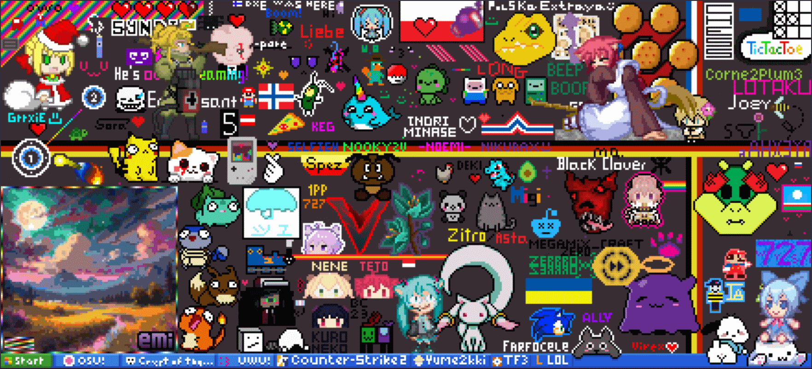

# 2023

## January

On the second week of January, [peppy](https://osu.ppy.sh/users/2) was interviewed by [MongoDB](https://en.wikipedia.org/wiki/MongoDB), the team responsible for developing [Realm](https://realm.io/), a database system used in osu!(lazer). In the interview, they talked about topics such as the origin of osu!, how osu! is making revenue, osu!'s development and infrastructure as well as the transition to osu!(lazer).[^interview-mongodb]

Due to an update to osu!(lazer) on 21 January, mappers became able to set the preview time of a beatmap in the [beatmap editor](/wiki/Client/Beatmap_editor). Furthermore, the gameplay progress bar was redesigned for the "argon" skin, and the ability to change the screen's coverage of the [Fade In](/wiki/Gameplay/Game_modifier/Fade_In) mod was added. Lastly, [performance points](/wiki/Performance_points) were enabled for scores, which caused a spike in player activity. Right after the update went live, the scores set per day increased from 103,000 the day earlier to 302,000, and the concurrent player count rose from around 200 to 1,600.[^lazer-jan-21]

[osu!stream](/wiki/osu!stream), a game specifically designed for handheld devices and with unique gameplay elements, received an [Android](https://en.wikipedia.org/wiki/Android_(operating_system)) port following contributions by [ThePooN](https://osu.ppy.sh/users/718454) and others. Until then, it was only available on [iOS](https://en.wikipedia.org/wiki/IOS). An implementation on Android was not planned at the time when the development of the iOS version began in 2011 due to audio-related restrictions in Android's infrastructure that would heavily affect the gameplay experience.[^osu-stream-twitter][^osu-stream-pr]

The download page on the osu! website received a redesign, with an additional download option for osu!(lazer). Prior to this change, only osu!(stable) was downloadable via the website, whereas downloading osu!(lazer) was only possible from its [GitHub repository](https://github.com/ppy/osu). The osu!(lazer) download button itself was put on the right side of the page, with osu!(stable) on the left, the eventual goal being to swap the two in order to make osu!(lazer) more prominent.[^lazer-download]

## February

The [markup language](https://en.wikipedia.org/wiki/Markup_language) [BBCode](/wiki/BBCode), which is used in the osu! forums and various parts of the website, acquired a way to highlight inline text with the implementation of `[c]` tags.[^c-tag]

## March

In 2022's [Skin of the Year](https://osu.ppy.sh/home/news/2023-02-09-skin-of-the-year-2022) contest, users were able to vote for their most favourite skin. The top three entries from 1st to 3rd place, by [- Koshiin -](https://osu.ppy.sh/users/19135423), [moonstaar](https://osu.ppy.sh/users/27339355), and [BatuhanYtho](https://osu.ppy.sh/users/12091015) respectively, received custom badges as the contest's price. Each finalist ranging from place #1 to #10 was gifted different amounts of osu!supporter.[^soty-results]

[EEEEEEEEEEEEEEE](https://osu.ppy.sh/users/2927048) played all ranked beatmaps in the [osu! game mode](/wiki/Game_mode/osu!) as of March 12 and is thus the third to receive the [osu!completionist](/wiki/People/Completionists) [user title](/wiki/Community/User_title).[^completionist-tweet]

## April

Another tag was added to the BBCode syntax. The `[imagemap]` tag would allow adding several hyperlinked areas to a single image.[^imagemap-tag]

In celebration of the 15th anniversary in 2022, osu! sold a desk mat in the store as a limited time offer.[^desk-mat]

## May

[osudaily.net](https://osudaily.net/) provided data dating back to 2016 to include in the profile statistics showing the highest rank a player has ever achieved.[^highest-rank]

As May was coming to an end, [new medals](https://www.reddit.com/r/osugame/comments/13vma49/new_medals_are_out/) were released.

## June

In the second release of the month 2 weeks later, the osu! [game mode](/wiki/Game_mode) in osu!(lazer) received the Synesthesia mod, which colours [hit objects](/wiki/Gameplay/Hit_object) based on timing.[^synesthesia-mod] Furthermore, a search panel was added to the mod select screen to simplify finding certain mods.[^mod-search] The input field could be activated by pressing `Tab` to not collide with normal keyboard shortcuts.

::: Infobox

:::

The third season of [osu!monthly](/wiki/Community/osu!monthly) ended with the [9th edition](https://osu.ppy.sh/home/news/2023-06-26-osumonthly-9), outlining the most important community events from March 2023. Mainly due to the mapping team within the project disbanding[^mapping-team-disbanding] and the ample effort required to author osu!monthly editions, the osu!monthly team decided to put the project on hold for the time being. Reorganising the work and publishing seasonal or annual editions instead was considered in various discussions.[^monthly-discord][^writing-proposal] [0x84f](https://osu.ppy.sh/users/7944724), one of the third season's project leaders, also published public polls to find out what the community was interested in and would like to see in the osu! website's news section in general.[^news-content-1][^news-content-2]

Serving as a memorial to the first two seasons that were published in a PDF format, the 9th osu!monthly was realised [as a magazine](https://assets.ppy.sh/media/osu-monthly/2023-03/osu-monthly-2023-03.pdf) instead of the usual news posts. It featured news about mapping, skinning and community happenings, as well as interviews with [EEEEEEEEEEEEEEE](https://osu.ppy.sh/users/2927048) and [pishifat](https://osu.ppy.sh/users/3178418).

## July

[A website update](https://osu.ppy.sh/home/changelog/web/2023.725.0) allowed users to update the displayed country on their profiles, provided it does not match the country they have consistently logged in from for the past 6 months and that the user is not registered for any ongoing tournaments. In the past, changing the displayed country was possible by contacting the [account support team](/wiki/People/Account_support_team) and providing proof of residence, but this option was discontinued after December 2021 due to the transmission of sensitive data as well as frequent cases of abuse.[^flag-pr][^flag-issue][^flag-news]

## August

From May through August, the [Icons of an Era](https://osu.ppy.sh/home/news/2023-05-10-skinning-contest-icons-of-an-era) skinning contest was organised to celebrate 15 years of osu! in the form of [skins](/wiki/Skin) representing popular beatmaps or mascots. [Spoo](https://osu.ppy.sh/users/11805037), [Chromasia](https://osu.ppy.sh/users/7306251), and [thetasigma](https://osu.ppy.sh/users/6234482) won first, second, and third place in the contest respectively. The prize included a custom badge and varying amounts of osu!supporter.[^icons-of-an-era]

::: Infobox

:::

[Dynam1cNET](https://osu.ppy.sh/users/12540789) implemented a custom [r/place](https://en.wikipedia.org/wiki/R/place)-like canvas on their profile page, allowing any user to *place* coloured pixels on it.[^me-page-place]

## November

Several people were commended and awarded with a Community Contributor badge for their remarkable assistance in the osu! community in 2022 and 2023.[^contributors]

## December

In parallel to this year's last update, the osu! team wanted more people to try out osu!(lazer) and give feedback via the forum before finalising gameplay mechanics and allowing [performance points](/wiki/Performance_points) to be awarded for scores.[^feedback] The following notable changes were applied:

- The score penalty for misses at high combos was decreased (`combo^1.5` compared to `combo^2`).
- The combo–accuracy split was rebalanced, making accuracy account for a bigger portion in a score.
- osu!catch's grading in osu!(lazer) was changed to match the grading of osu!(stable) to simplify obtaining high accuracy values.
- Slider mechanics were adjusted to make fast sliders more lenient.[^lazer-12-18]

2023's [Winter Fanart Contest](https://osu.ppy.sh/home/news/2023-11-07-winter-fanart-contest) ran under the theme "osu! mascots enjoying a seasonal feast". Due to this broad theme, the participants had a lot of freedom and creativity for designs. All finalists obtained three months of osu!supporter, while the top 3 winners received a custom [profile badge](/wiki/Community/Profile_badge) on top.[^winter-fanart]

Similar to the other [release streams](/wiki/Client/Release_stream), osu!(lazer)'s user count became viewable on the website.[^lazer-user-count]

## References

[^lazer-jan-21]: [YouTube video by pishifat (2023-01-21) "lazer updates - January 21, 2023"](https://www.youtube.com/watch?v=P6Y9B1pyIcw)
[^interview-mongodb]: [Tweet by @ppy (2023-01-12)](https://twitter.com/ppy/status/1613534700295028739)
[^osu-stream-twitter]: [Tweet by @ppy (2023-01-12)](https://twitter.com/ppy/status/1613460209703456769)
[^osu-stream-pr]: [Pull request by Beyley (2021-08-22) "Add android support"](https://github.com/ppy/osu-stream/pull/27)
[^lazer-download]: [Pull request by nanaya (2022-12-13) "New download page"](https://github.com/ppy/osu-web/pull/9638)

[^c-tag]: [Pull request by nanaya (2023-02-02) "Add bbcode tag for inline code"](https://github.com/ppy/osu-web/pull/9829)

[^soty-results]: [News post by RockRoller (2023-03-05) "Skin of the Year 2022: Results"](https://osu.ppy.sh/home/news/2023-03-05-skin-of-the-year-2022-results)
[^completionist-tweet]: [Tweet by @osugame (2023-03-15)](https://twitter.com/osugame/status/1635888223590453250)

[^imagemap-tag]: [Pull request by nanaya (2023-03-09) "Add imagemap support to bbcode"](https://github.com/ppy/osu-web/pull/9972)
[^desk-mat]: [Tweet by @osugame (2023-04-04)](https://twitter.com/osugame/status/1643288319860801536)

[^highest-rank]: [Tweet by @ppy (2023-05-13)](https://twitter.com/ppy/status/1657250346291593217)

[^mod-search]: [Pull request by Cootz (2023-05-06) "Add mod search"](https://github.com/ppy/osu/pull/23414)
[^synesthesia-mod]: [Pull request by jtbiddle (2023-05-13) "Add "Synesthesia" mod for osu! ruleset"](https://github.com/ppy/osu/pull/23520)
[^mapping-team-disbanding]: [Discord message by 0x84f (2023-05-31)](https://discord.com/channels/188630481301012481/1003689172420276246/1113463478057971722)
[^monthly-discord]: [Discord message by 0x84f (2023-04-17)](https://discord.com/channels/188630481301012481/1003689172420276246/1097626728328876062)
[^writing-proposal]: ["The “osu! writing team” proposal" on Google Documents](https://docs.google.com/document/d/1vWSy64g8HxNsoEoL5uGVarH1cpYH0zWDRmmIoZyjOgY/edit)
[^news-content-1]: [Forum thread by 0x84f (2023-05-31) "What content do you want to see in the news section on the front page?"](https://osu.ppy.sh/community/forums/topics/1772564?n=1)
[^news-content-2]: [Reddit thread by u/EDMSerbia (2023-05-31) "What content do you want to see in the news section on the osu! website?"](https://www.reddit.com/r/osugame/comments/13wpu7g/what_content_do_you_want_to_see_in_the_news/)

[^flag-pr]: [Pull request by nanaya (2023-07-21) "Allow changing country from account settings"](https://github.com/ppy/osu-web/pull/10398)
[^flag-issue]: [Issue by peppy (2023-07-18) "Add support for user initiated flag changes"](https://github.com/ppy/osu-web/issues/10382)
[^flag-news]: [News post by Blushing and Walavouchey (2023-07-28) "Enabling Country Flag Changes"](https://osu.ppy.sh/home/news/2023-07-28-enabling-country-flag-changes)

[^icons-of-an-era]: [News post by RockRoller (2023-08-10) "Skinning Contest: Icons of an Era - Results"](https://osu.ppy.sh/home/news/2023-08-10-skinning-contest-icons-of-an-era-results)
[^me-page-place]: [Forum thread by Dynam1cNET (2023-08-19) "I've made a r/place clone for my about me section"](https://osu.ppy.sh/community/forums/topics/1809912?n=1)

[^contributors]: [News post by osu! team (2023-11-19) "Community Contributors: 2022 & 2023"](https://osu.ppy.sh/home/news/2023-11-19-community-contributors-2022-2023)

[^feedback]: [Forum thread by peppy (2023-12-18) "osu!(lazer) 2023.1218.0 release feedback"](https://osu.ppy.sh/community/forums/topics/1858702?n=1)
[^lazer-12-18]: [News post by Walavouchey (2023-12-18) "osu!(lazer) Updates & Preparing For Ranked Play"](https://osu.ppy.sh/home/news/2023-12-18-osulazer-updates-preparing-for-ranked-play)
[^winter-fanart]: [News post by Ephemeral (2023-12-07) "Winter 2023 Fanart Contest Results"](https://osu.ppy.sh/home/news/2023-12-07-winter-fanart-contest-results)
[^lazer-user-count]: [Tweet by @ppy (2023-12-15)](https://twitter.com/ppy/status/1735606671031091389)
